# N1CTF Junior re pyramid-先知社区

> **来源**: https://xz.aliyun.com/news/18949  
> **文章ID**: 18949

---

# N1CTF Junior re pyramid

**知识点：pyd逆向，pyc反编译，RC4密钥流爆破，白盒AES**

## exe->pyc->pyd

python逆向，给了一个exe，使用对应版本的python和`pyinstxtractor.py`​解包

得到了`chal.pyc`​，使用在线网站[PyLingual](https://pylingual.io/)反编译得到主逻辑

```
# Decompiled with PyLingual (https://pylingual.io)
# Internal filename: chal.py
# Bytecode version: 3.12.0rc2 (3531)
# Source timestamp: 1970-01-01 00:00:00 UTC (0)

import pyramid
import os
text = 'A pyramid fortified with intricate defenses looms before you. 
Its secrets are locked behind layers of puzzles. 
You stand at its base, challenged to unravel them all.'
print('･････････････････････････････････････････････････････････････････')
for line in text.split('
'):
    print(f'  {line}')
print('･････････････････････････････････････････････････････････････････')
a=input()
pyramid.a_long_way_to_treasure()
try:
    os.remove('checkinput.pyd')
except Exception as e:
    pass
```

是调用了`checkinput.pyd`​里的`pyramid.a_long_way_to_treasure()`​函数，ida打开，直接搜字符串`pyramid.a_long_way_to_treasure`​定位到函数逻辑

直接上动调

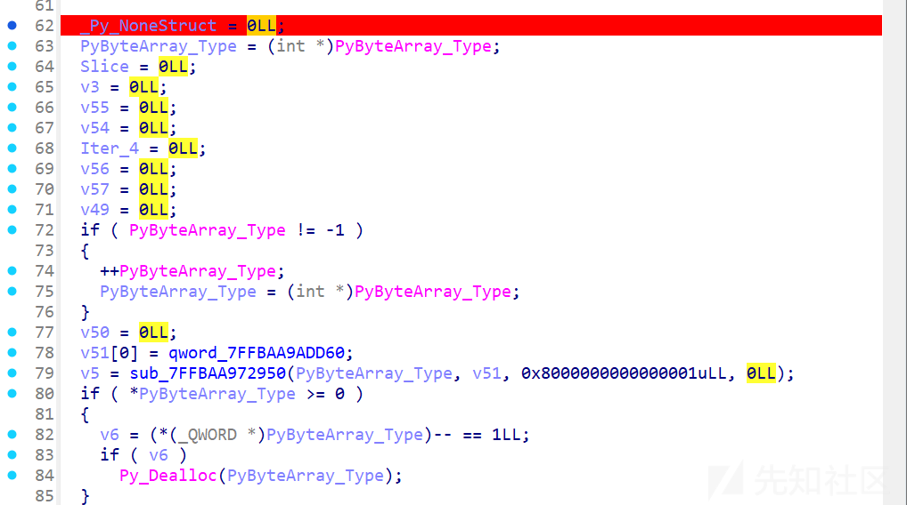

主要逻辑都在循环里

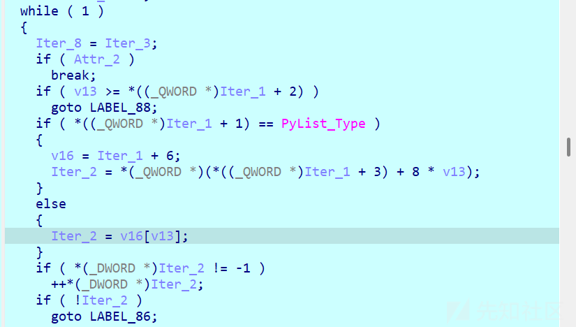

调试至第一个`sub_7FFDC8272C80`​

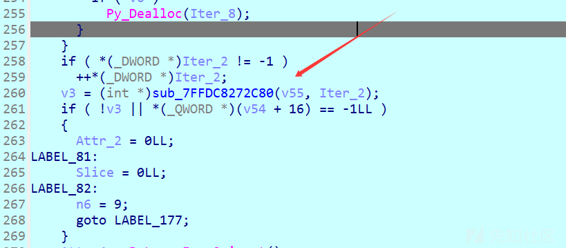

查看v55

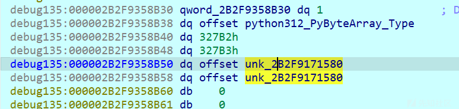

是一个长度为`0x327B2`​的字节数组，`unk_2B2F9171580`​就是具体内容

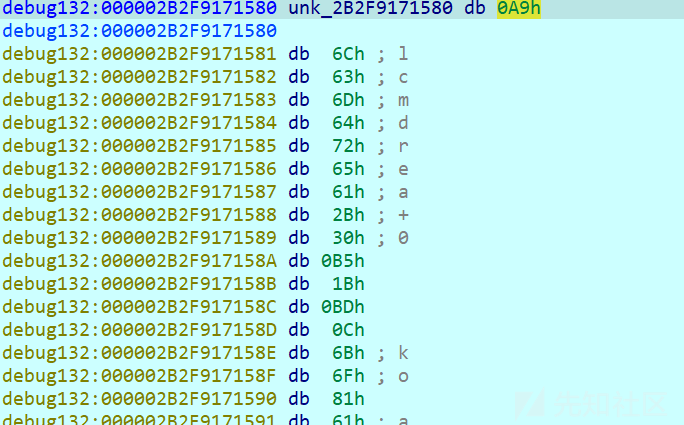

再查看函数返回值v3，正好就是字节数组[0]，这里就应该是在取值`bytearray[index]`​

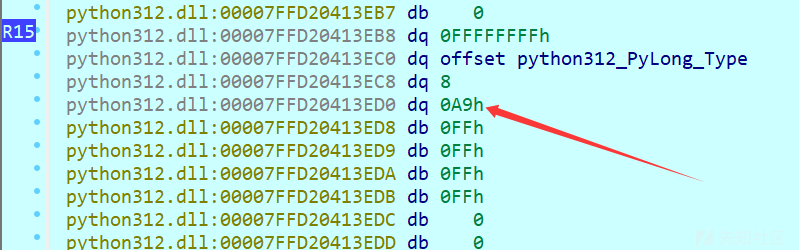

下面还有个`sub_7FFDC8272C80`​，也是在取值

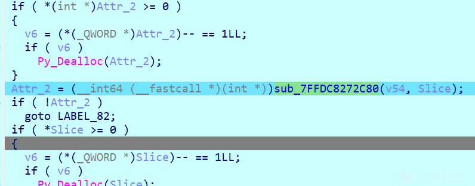

查看v54，是一个字节数组，内容是`bangdreamitsmygo`​

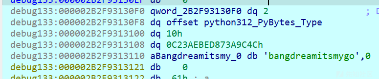

函数返回值`Attr_2`​在内存中的值也印证了这一点

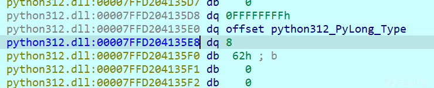

后面就是前面取的两个值做异或，可以猜测是大字节数组用key动态解密

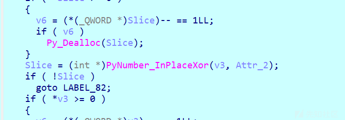

## pyd->pyc->py

手动提取数据然后解密：

```
start = 0x2B2F9171580
size  = 0x327B2
end   = start + size

data = ida_bytes.get_bytes(start, size)
if data:
    with open(r"D:\dump.bin", "wb") as f:  # 换成你自己的路径
        f.write(data)
    print("Dump saved to dump.bin")
else:
    print("Failed to read bytes")

```

```
import os
xor_key="bangdreamitsmygo"
with open('dump.bin', 'rb') as f:
    data = f.read()
list_data = list(data)
for i in range(len(list_data)):
    list_data[i] ^= ord(xor_key[i % len(xor_key)])

with open('decrypt_dump.bin', 'wb') as f:
    f.write(bytes(list_data))
```

解密后的文件用010查看

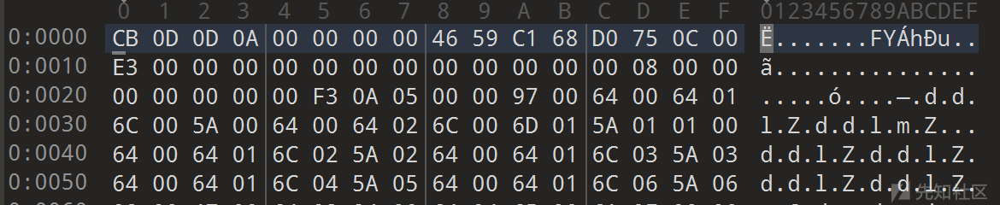

得到的文件看到 0xE3 跟一串 0，是 marshal 的 code object 的特征，甚至还有pyc文件头

使用在线网站[PyLingual](https://pylingual.io/)反编译

```
# Decompiled with PyLingual (https://pylingual.io)
# Internal filename: layer2.py
# Bytecode version: 3.12.0rc2 (3531)
# Source timestamp: 2025-09-10 10:56:06 UTC (1757501766)

import ctypes
from ctypes import wintypes
import struct
import os
import importlib.util
import sys

class BUF(ctypes.Structure):
    _fields_ = [('Length', wintypes.ULONG), ('Unused', wintypes.ULONG), ('Ptr', ctypes.c_void_p)]
key = input('Input your key: ')
tmp = 2166136261
for ch in key:
    tmp = 16777619 * (tmp ^ ord(ch)) & 4294967295
key_bytes = struct.pack('<I', tmp)
advapi32 = ctypes.WinDLL('advapi32', use_last_error=True)
SystemFunction033 = advapi32.SystemFunction033
FNPROTO = ctypes.WINFUNCTYPE(None, ctypes.POINTER(BUF), ctypes.POINTER(BUF))
fn = FNPROTO(ctypes.cast(SystemFunction033, ctypes.c_void_p).value)
data = b'\xb7\xc3\xbc\xe5\xb1\x0f\xa0\x8cHq\xaebe2\x05\xc6'#(skip)
data_buffer = ctypes.create_string_buffer(data)
key_buffer = ctypes.create_string_buffer(key_bytes)
data_buf = BUF(len(data), 0, ctypes.addressof(data_buffer))
key_buf = BUF(4, 0, ctypes.addressof(key_buffer))
fn(ctypes.byref(data_buf), ctypes.byref(key_buf))
pyd_path = os.path.join(os.getcwd(), 'checkinput.pyd')
with open(pyd_path, 'wb') as f:
    f.write(data_buffer.raw[:len(data)])
try:
    spec = importlib.util.spec_from_file_location('checkinput', pyd_path)
    module = importlib.util.module_from_spec(spec)
    spec.loader.exec_module(module)
    flag = input('Input your flag: ')
    result = module.check(flag.encode('utf-8'))
    if result:
        print('Right!')
    else:
        print('Wrong!')
except Exception as e:
    pass
print('Wrong key!')
```

这里就是真正的逻辑

获取用户输入作为key，然后用 **FNV-1a（32-bit）** 风格的哈希把 `key`​ 压缩成一个 32 位整数 `tmp`​，再把它打包为 4 字节（小端）`key_bytes`​。

通过 `ctypes`​ 从 `advapi32`​ 取得导出函数 `SystemFunction033`​，把它封装成一个 `FNPROTO`​ 原型并调用，传入两个 `BUF`​ 结构（一个指向 data，一个指向 key），该函数解密`data`​为`checkinput.pyd`​然后加载调用`check`​函数

查询知`SystemFunction033`​就是RC4

## RC4密钥流爆破

已知正常pyd文件头是`0x4D,0x5A,0x90,0x00`​，而密文是`b'\xb7\xc3\xbc\xe5'`​，开始爆破密钥流

爆破思路及代码参考[[讨论]RC4算法暴力破解的尝试(附源码)](https://bbs.kanxue.com/thread-174969.htm)

脚本download下来该一下参数和范围

```
/*
    MistHill, created on 10:24:34 2013-7-3

    compile:
        Visual Studio 6:
            CL /Og /Os /Oy /Ob1 /GT /Gs /Gf /Gy /G6 /MT rc4KStream75MT.c /link /RELEASE

    Refs:
    1) Optimizing C++/Code optimization/Faster operations
        http://en.wikibooks.org/wiki/Optimizing_C%2B%2B/Code_optimization/Faster_operations
    2) Writing Efficient C and C Code Optimization
        http://www.codeproject.com/Articles/6154/Writing-Efficient-C-and-C-Code-Optimization

    3) Multithreading Tutorial #1
        http://www.computersciencelab.com/MultithreadingTut1.htm
    4) Walkthrough: Debugging a Multithreaded Application
        http://msdn.microsoft.com/en-us/library/bb157784(v=vs.90).aspx
*/
#include <windows.h>
#include <process.h>

#define TARGETKS1 0xe52c99fa

void prepare_key(unsigned char *key_data_ptr, int key_data_len, unsigned char *state);
BOOL GetKeyStream(unsigned char *buffer_ptr, int buffer_len, unsigned char *state);

unsigned _Recursion(void*);
unsigned __stdcall _RecursionT1(void*);
unsigned __stdcall _RecursionT2(void*);
unsigned __stdcall _RecursionT3(void*);
void Recursion(int idx, unsigned char *pKey, unsigned char *pKeyStream, unsigned char *pstate);

BOOL WINAPI ConsoleHandler(DWORD dwCtrlType);
void ShowExecutionTime(BOOL bBreaked);
void ShowMatchedKeystream(unsigned char*);

//static int TargetKS1 = 0x62383550, TargetKS2 = 0x6F0C1E2C; /* Target KS = 50 35 38 62 2C 1E 0C 6F */
#define KeyLength 4

static char szErrMsgCT[] ="Create thread%d failed!
";
static char szFmtHex2[] ="%02X ";
static char szFmtDate[] ="
%s\t%04d-%02d-%02d %02d:%02d:%02d.%03d";

static unsigned char stateinit[256];

static unsigned char Key[8], KeyT1[8], KeyT2[8], KeyT3[8];

// Size: just 4 is fine. Exec. time of function GetKeyStream() reduced!
static unsigned char KeyStream[4], KeyStreamT1[4], KeyStreamT2[4], KeyStreamT3[4];

static unsigned char state[256], stateT1[256], stateT2[256], stateT3[256];

static SYSTEMTIME lt0, lt1;
static DWORD dw0, dw1;

int main(void)
{
    int i;
    HANDLE hThread[3];
    unsigned threadID[3];

    if (SetConsoleCtrlHandler( (PHANDLER_ROUTINE)ConsoleHandler, TRUE)==FALSE)
    {
        printf("Unable to install handler!
");
        return -1;
    }

    GetLocalTime(&lt0);
    dw0 = GetTickCount();

    for(i =0; i <256; i++)
        stateinit[i] = i;

    // Create the threads.
    hThread[0] = (HANDLE)_beginthreadex(NULL,0, &_RecursionT1,NULL,0, &threadID[0] );
    if(!hThread[0]) {
        printf(szErrMsgCT,1);
        return -1;
    }

    hThread[1] = (HANDLE)_beginthreadex(NULL,0, &_RecursionT2,NULL,0, &threadID[1] );
    if(!hThread[1]) {
        printf(szErrMsgCT,2);
        CloseHandle(hThread[0]);
        return -1;
    }

    hThread[2] = (HANDLE)_beginthreadex(NULL,0, &_RecursionT3,NULL,0, &threadID[2] );
    if(!hThread[2]) {
        printf(szErrMsgCT,3);
        CloseHandle(hThread[0]);
        CloseHandle(hThread[1]);
        return -1;
    }

    _Recursion(NULL);

    WaitForMultipleObjects(3, hThread, TRUE, INFINITE);

    CloseHandle(hThread[0]);
    CloseHandle(hThread[1]);
    CloseHandle(hThread[2]);

    ShowExecutionTime(FALSE);

    return 0;
}

unsigned _Recursion(void* pArguments)
{
    register int i;

    // 0x30~0x7A: T0(0x30~0x42), T1(0x43~0x55), T2(0x56~0x68), T3(0x69~0x7A)
    for(i=0;i<64;i++) {
        Key[0] = i;
        Recursion(1, Key, KeyStream, state);
    }
    return 0;
}

unsigned __stdcall _RecursionT1(void* pArguments)
{
    register int i;

    for(i=64;i<128;i++) {
        KeyT1[0] = i;
        Recursion(1, KeyT1, KeyStreamT1, stateT1);
    }
    _endthreadex(0);
    return 0;
}

unsigned __stdcall _RecursionT2(void* pArguments)
{
    register int i;

    for(i=128;i<192;i++) {
        KeyT2[0] = i;
        Recursion(1, KeyT2, KeyStreamT2, stateT2);
    }
    _endthreadex(0);
    return 0;
}

unsigned __stdcall _RecursionT3(void* pArguments)
{
    register int i;

    for(i=192;i<256;i++) {
        KeyT3[0] = i;
        Recursion(1, KeyT3, KeyStreamT3, stateT3);
    }
    _endthreadex(0);
    return 0;
}

void Recursion(int idx, unsigned char *pKey, unsigned char *pKeyStream, unsigned char *pstate)
{
    register int i;

    for(i=0;i<256;i++) {
        pKey[idx] = i;
        if(idx +1 < KeyLength)
            Recursion(idx +1, pKey, pKeyStream, pstate);
        else {
            memcpy(pstate, stateinit,sizeof(stateinit));
            prepare_key(pKey, KeyLength, pstate);

            if( GetKeyStream(pKeyStream,sizeof(KeyStream), pstate) )
                ShowMatchedKeystream(pKey);
        }
    }
}

void prepare_key(unsigned char *key_data_ptr, int key_data_len, unsigned char *state)
{
    unsigned char swapByte;
    unsigned char index1, index2;
    int counter;

    index1 = index2 =0;
    for(counter =0; counter <256; counter++)
    {
        index2 = key_data_ptr[index1] + state[counter] + index2;

        swapByte = state[counter];
        state[counter] = state[index2];
        state[index2] = swapByte;

        index1++;
        while(index1 == key_data_len)
            index1 -= key_data_len;
    }
}

BOOL GetKeyStream(unsigned char *buffer_ptr, int buffer_len, unsigned char *state)
{
    unsigned char swapByte;
    unsigned char x;
    unsigned char y;
    unsigned char xorIndex;
    int counter;

    x = y =0;

    for(counter =0; counter < buffer_len; counter ++)
    {
        x++;
        y = state[x] + y;

        swapByte = state[x];
        state[x] = state[y];
        state[y] = swapByte;

        xorIndex = state[x] + state[y];

        buffer_ptr[counter] = state[xorIndex];
    }

    if( *(int*)buffer_ptr == TARGETKS1 )
        return TRUE;
    else
        return FALSE;
}

BOOL WINAPI ConsoleHandler(DWORD dwCtrlType)
{
    if(dwCtrlType == CTRL_C_EVENT) {
        int i;
        printf("\r");
        for(i=0;i<KeyLength;i++)
            printf(szFmtHex2, Key[i]);
        printf(", ");
        for(i=0;i<KeyLength;i++)
            printf(szFmtHex2, KeyT1[i]);
        printf(", ");
        for(i=0;i<KeyLength;i++)
            printf(szFmtHex2, KeyT2[i]);
        printf(", ");
        for(i=0;i<KeyLength;i++)
            printf(szFmtHex2, KeyT3[i]);

        return TRUE;
    }
    else if(dwCtrlType == CTRL_BREAK_EVENT)
        ShowExecutionTime(TRUE);

    return FALSE;
}

void ShowExecutionTime(BOOL bBreaked)
{
    int i;

    GetLocalTime(&lt1);
    dw1 = GetTickCount();

    if(bBreaked) {
        printf("
Current Keys:
\t");
        for(i=0;i<KeyLength;i++)
            printf(szFmtHex2, Key[i]);
        printf("
\t");
        for(i=0;i<KeyLength;i++)
            printf(szFmtHex2, KeyT1[i]);
        printf("
\t");
        for(i=0;i<KeyLength;i++)
            printf(szFmtHex2, KeyT2[i]);
        printf("
\t");
        for(i=0;i<KeyLength;i++)
            printf(szFmtHex2, KeyT3[i]);
        printf("
");
    }

    printf(szFmtDate,"Start:", lt0.wYear, lt0.wMonth, lt0.wDay, lt0.wHour, lt0.wMinute, lt0.wSecond, lt0.wMilliseconds);
    printf(szFmtDate,"End:", lt1.wYear, lt1.wMonth, lt1.wDay, lt1.wHour, lt1.wMinute, lt1.wSecond, lt1.wMilliseconds);
    printf("

Execution time:\t%d.%d seconds.
", (dw1 - dw0)/1000, (dw1 - dw0)%1000);
}

void ShowMatchedKeystream(unsigned char *pKey)
{
    int j;

    printf("
\tFound:\t");
    for(j=0;j<KeyLength;j++)
        printf(szFmtHex2, pKey[j]);

    dw1 = GetTickCount();
    printf("\t%d.%d sec.
", (dw1 - dw0)/1000, (dw1 - dw0)%1000);
}
```

解出来经验证密钥流是`B7 BC 71 42`​

再手动解密得到pyd

## 白盒AES

导入ida分析，定位到check函数


加密逻辑是白盒AES


关于白盒AES的解法，参考

[DFA还原白盒AES密钥 | zskのblog](https://www.zskkk.cn/posts/15785/)

[详解白盒AES以及C代码实现（以CTF赛题讲解白盒AES）-先知社区](https://xz.aliyun.com/news/16176)

攻击方法：断点第八次列混淆，修改1字节加密后的结果(共16字节)，再断点得到最终密文的地方，提取密文。再次修改(换一个index)，继续提取。最终得到1个正常密文和16个故障密文

，然后通过差分攻击得到最后一轮轮密钥，再倒推得到第1轮轮密钥也就是AES加密的key

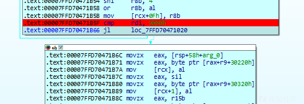

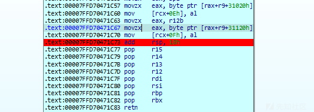

断点轮数判断和最终赋值两个地方，轮数判断下条件断点，条件是`rdi == 0x8000`​，断下时，修改[rcx]指向的16字节数组然后f9，在赋值完成后提取密文

首先需要两个工具

* pip install phoenixAES
* 编译好的<https://github.com/SideChannelMarvels/Stark/blob/master/aes_keyschedule.c>

`phoenixAES`​是一个开源的 Python 工具 / 库，用来对 AES 实现进行 **差分故障分析 (Differential Fault Analysis, DFA)** 的攻击

根据官方文档和源码/描述，它目前包含以下 DFA 模型：

|  |  |  |
| --- | --- | --- |
| 模型 | 目标 | 特点 |
| **simple DFA R9** | 针对 AES-128，在**第 9 轮**（倒数第二轮）进行故障注入（通常是在 MixColumns 和最后一轮之前）。 | 至少需要 “4×2 个故障”（4 个列 × 每列至少 2 个故障），“在 Round 9 的两个 MixColumns 之后”的状态。 |
| **simple DFA R8** | 针对 AES-128，在**第 8 轮**注入单字节故障 | 实现上把第 8 轮的故障视为如果故障在第 9 轮，从而应用 Round-9 的攻击。也就是说，如果可以得到第 8 轮的单字节故障输出，就可以做类似 Round-9 的处理。 |

```
import phoenixAES

with open('tracefile', 'wb') as t:
    t.write("""
0150A8D131E87AE1332AE72A84C28F96
E450A8D131E87A6B332AA62A84608F96
0150A83E31E893E13313E72A7AC28F96
0150FED131537AE12A2AE72A84C28F0E
016BA8D18EE87AE1332AE76084C2D696
01C0A8D1A4E87AE1332AE74E84C2D296
F150A8D131E87A38332A5A2A84718F96
0150A81031E8B6E1335BE72A4CC28F96
0150C2D131ED7AE16F2AE72A84C28F02
015098D131AE7AE1B62AE72A84C28F2C
0141A8D166E87AE1332AE7D484C29796
6A50A8D131E87AB0332A102A84698F96
0150A86031E887E13369E72A47C28F96
0150A82231E8EAE133EBE72A4AC28F96
015075D131477AE1442AE72A84C28F48
015BA8D17BE87AE1332AE79C84C24D96
1E50A8D131E87AB5332A5C2A84718F96
""".encode('utf8'))
phoenixAES.crack_file('tracefile', [], True, False, 3)
```

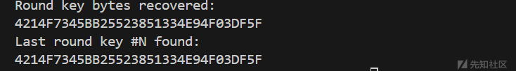

`aes_keyschedule.c`​是一个 **AES 密钥扩展 / 逆扩展（key schedule）的小工具** —— 它能从任意一轮的 **round key**（或直接从主密钥）计算出整个轮密钥表，并把每一轮的 16 字节（或对应长度）轮密钥打印出来。它对 AES-128/192/256 都支持（根据你输入的十六进制长度自动识别）。

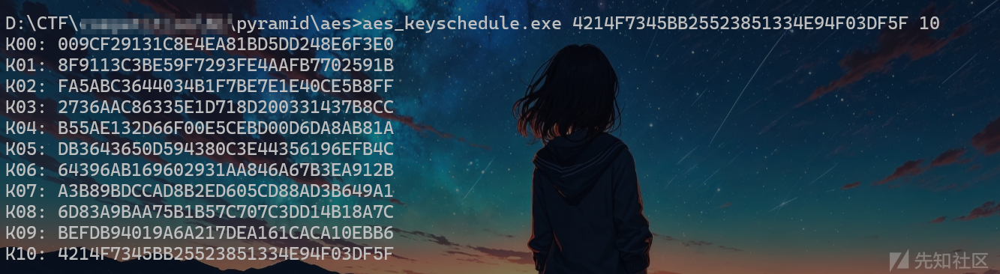

K00就是我们需要的密钥

最后再动态提取一下密文，cyberchef一把梭


‍

%22)%3B%5Cn%20%20%20%20%20%20%20%20for(i%3D0%3Bi%3CKeyLength%3Bi%2B%2B)%5Cn%20%20%20%20%20%20%20%20%20%20%20%20printf(szFmtHex2%2C%20KeyT3%5Bi%5D)%3B%5Cn%5Cn%20%20%20%20%20%20%20%20return%20TRUE%3B%5Cn%20%20%20%20%7D%5Cn%20%20%20%20else%20if(dwCtrlType%20%3D%3D%20CTRL\_BREAK\_EVENT)%5Cn%20%20%20%20%20%20%20%20ShowExecutionTime(TRUE)%3B%5Cn%5Cn%20%20%20%20return%20FALSE%3B%5Cn%7D%5Cn%5Cnvoid%20ShowExecutionTime(BOOL%20bBreaked)%5Cn%7B%5Cn%20%20%20%20int%20i%3B%5Cn%5Cn%20%20%20%20GetLocalTime(%26lt1)%3B%5Cn%20%20%20%20dw1%20%3D%20GetTickCount()%3B%5Cn%5Cn%20%20%20%20if(bBreaked)%20%7B%5Cn%20%20%20%20%20%20%20%20printf(%5C%22%5C%5CnCurrent%20Keys%3A%5C%5Cn%5C%5Ct%5C%22)%3B%5Cn%20%20%20%20%20%20%20%20for(i%3D0%3Bi%3CKeyLength%3Bi%2B%2B)%5Cn%20%20%20%20%20%20%20%20%20%20%20%20printf(szFmtHex2%2C%20Key%5Bi%5D)%3B%5Cn%20%20%20%20%20%20%20%20printf(%5C%22%5C%5Cn%5C%5Ct%5C%22)%3B%5Cn%20%20%20%20%20%20%20%20for(i%3D0%3Bi%3CKeyLength%3Bi%2B%2B)%5Cn%20%20%20%20%20%20%20%20%20%20%20%20printf(szFmtHex2%2C%20KeyT1%5Bi%5D)%3B%5Cn%20%20%20%20%20%20%20%20printf(%5C%22%5C%5Cn%5C%5Ct%5C%22)%3B%5Cn%20%20%20%20%20%20%20%20for(i%3D0%3Bi%3CKeyLength%3Bi%2B%2B)%5Cn%20%20%20%20%20%20%20%20%20%20%20%20printf(szFmtHex2%2C%20KeyT2%5Bi%5D)%3B%5Cn%20%20%20%20%20%20%20%20printf(%5C%22%5C%5Cn%5C%5Ct%5C%22)%3B%5Cn%20%20%20%20%20%20%20%20for(i%3D0%3Bi%3CKeyLength%3Bi%2B%2B)%5Cn%20%20%20%20%20%20%20%20%20%20%20%20printf(szFmtHex2%2C%20KeyT3%5Bi%5D)%3B%5Cn%20%20%20%20%20%20%20%20printf(%5C%22%5C%5Cn%5C%22)%3B%5Cn%20%20%20%20%7D%5Cn%5Cn%20%20%20%20printf(szFmtDate%2C%5C%22Start%3A%5C%22%2C%20lt0.wYear%2C%20lt0.wMonth%2C%20lt0.wDay%2C%20lt0.wHour%2C%20lt0.wMinute%2C%20lt0.wSecond%2C%20lt0.wMilliseconds)%3B%5Cn%20%20%20%20printf(szFmtDate%2C%5C%22End%3A%5C%22%2C%20lt1.wYear%2C%20lt1.wMonth%2C%20lt1.wDay%2C%20lt1.wHour%2C%20lt1.wMinute%2C%20lt1.wSecond%2C%20lt1.wMilliseconds)%3B%5Cn%20%20%20%20printf(%5C%22%5C%5Cn%5C%5CnExecution%20time%3A%5C%5Ct%25d.%25d%20seconds.%5C%5Cn%5C%22%2C%20(dw1%20-%20dw0)%2F1000%2C%20(dw1%20-%20dw0)%251000)%3B%5Cn%7D%5Cn%5Cnvoid%20ShowMatchedKeystream(unsigned%20char%20\*pKey)%5Cn%7B%5Cn%20%20%20%20int%20j%3B%5Cn%5Cn%20%20%20%20printf(%5C%22%5C%5Cn%5C%5CtFound%3A%5C%5Ct%5C%22)%3B%5Cn%20%20%20%20for(j%3D0%3Bj%3CKeyLength%3Bj%2B%2B)%5Cn%20%20%20%20%20%20%20%20printf(szFmtHex2%2C%20pKey%5Bj%5D)%3B%5Cn%5Cn%20%20%20%20dw1%20%3D%20GetTickCount()%3B%5Cn%20%20%20%20printf(%5C%22%5C%5Ct%25d.%25d%20sec.%5C%5Cn%5C%22%2C%20(dw1%20-%20dw0)%2F1000%2C%20(dw1%20-%20dw0)%251000)%3B%5Cn%7D%22%2C%22heightLimit%22%3Atrue%2C%22id%22%3A%22IiprW%22%7D">

解出来经验证密钥流是`B7 BC 71 42`​

再手动解密得到pyd

## 白盒AES

导入ida分析，定位到check函数

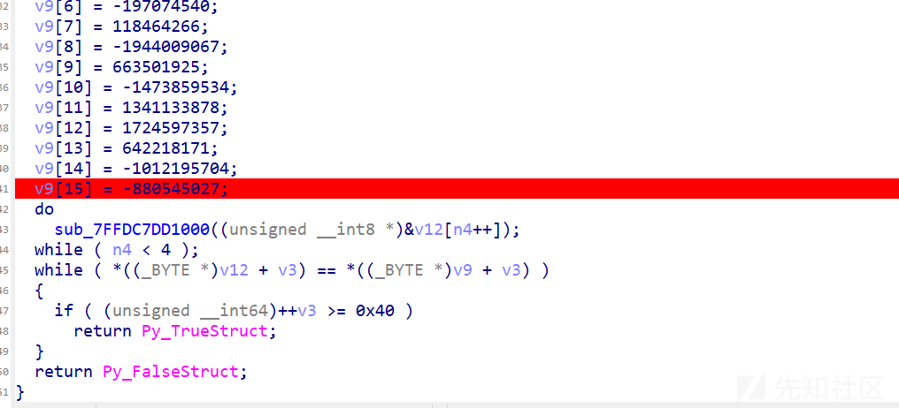

加密逻辑是白盒AES

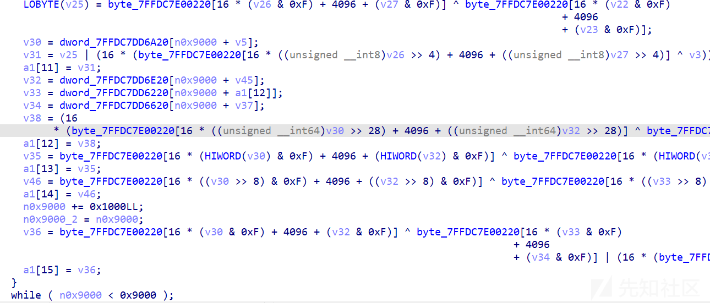

关于白盒AES的解法，参考

[DFA还原白盒AES密钥 | zskのblog](https://www.zskkk.cn/posts/15785/)

[详解白盒AES以及C代码实现（以CTF赛题讲解白盒AES）-先知社区](https://xz.aliyun.com/news/16176)

攻击方法：断点第八次列混淆，修改1字节加密后的结果(共16字节)，再断点得到最终密文的地方，提取密文。再次修改(换一个index)，继续提取。最终得到1个正常密文和16个故障密文

，然后通过差分攻击得到最后一轮轮密钥，再倒推得到第1轮轮密钥也就是AES加密的key


断点轮数判断和最终赋值两个地方，轮数判断下条件断点，条件是`rdi == 0x8000`​，断下时，修改[rcx]指向的16字节数组然后f9，在赋值完成后提取密文

首先需要两个工具

* pip install phoenixAES
* 编译好的<https://github.com/SideChannelMarvels/Stark/blob/master/aes_keyschedule.c>

`phoenixAES`​是一个开源的 Python 工具 / 库，用来对 AES 实现进行 **差分故障分析 (Differential Fault Analysis, DFA)** 的攻击

根据官方文档和源码/描述，它目前包含以下 DFA 模型：

|  |  |  |
| --- | --- | --- |
| 模型 | 目标 | 特点 |
| **simple DFA R9** | 针对 AES-128，在**第 9 轮**（倒数第二轮）进行故障注入（通常是在 MixColumns 和最后一轮之前）。 | 至少需要 “4×2 个故障”（4 个列 × 每列至少 2 个故障），“在 Round 9 的两个 MixColumns 之后”的状态。 |
| **simple DFA R8** | 针对 AES-128，在**第 8 轮**注入单字节故障 | 实现上把第 8 轮的故障视为如果故障在第 9 轮，从而应用 Round-9 的攻击。也就是说，如果可以得到第 8 轮的单字节故障输出，就可以做类似 Round-9 的处理。 |

```
import phoenixAES

with open('tracefile', 'wb') as t:
    t.write("""
0150A8D131E87AE1332AE72A84C28F96
E450A8D131E87A6B332AA62A84608F96
0150A83E31E893E13313E72A7AC28F96
0150FED131537AE12A2AE72A84C28F0E
016BA8D18EE87AE1332AE76084C2D696
01C0A8D1A4E87AE1332AE74E84C2D296
F150A8D131E87A38332A5A2A84718F96
0150A81031E8B6E1335BE72A4CC28F96
0150C2D131ED7AE16F2AE72A84C28F02
015098D131AE7AE1B62AE72A84C28F2C
0141A8D166E87AE1332AE7D484C29796
6A50A8D131E87AB0332A102A84698F96
0150A86031E887E13369E72A47C28F96
0150A82231E8EAE133EBE72A4AC28F96
015075D131477AE1442AE72A84C28F48
015BA8D17BE87AE1332AE79C84C24D96
1E50A8D131E87AB5332A5C2A84718F96
""".encode('utf8'))
phoenixAES.crack_file('tracefile', [], True, False, 3)
```


`aes_keyschedule.c`​是一个 **AES 密钥扩展 / 逆扩展（key schedule）的小工具** —— 它能从任意一轮的 **round key**（或直接从主密钥）计算出整个轮密钥表，并把每一轮的 16 字节（或对应长度）轮密钥打印出来。它对 AES-128/192/256 都支持（根据你输入的十六进制长度自动识别）。


K00就是我们需要的密钥

最后再动态提取一下密文，cyberchef一把梭

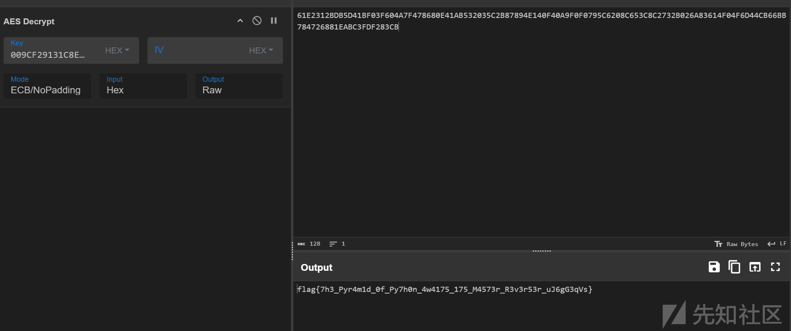

‍
