# 安卓逆向-frida hook Native层-先知社区

> **来源**: https://xz.aliyun.com/news/18954  
> **文章ID**: 18954

---

在 Java 里声明 native 方法时，会用关键字（native）表明该方法的实现由其他语言（通常是 C 或 C++）提供。Java 类中 native 方法的声明不包含实现，只是一个签名，告知 Java 运行时该方法会用本地语言实现。JNI函数才是native方法的具体实现，命名一般 Java\_包名\_类名\_方法名。

### Frida 0x8

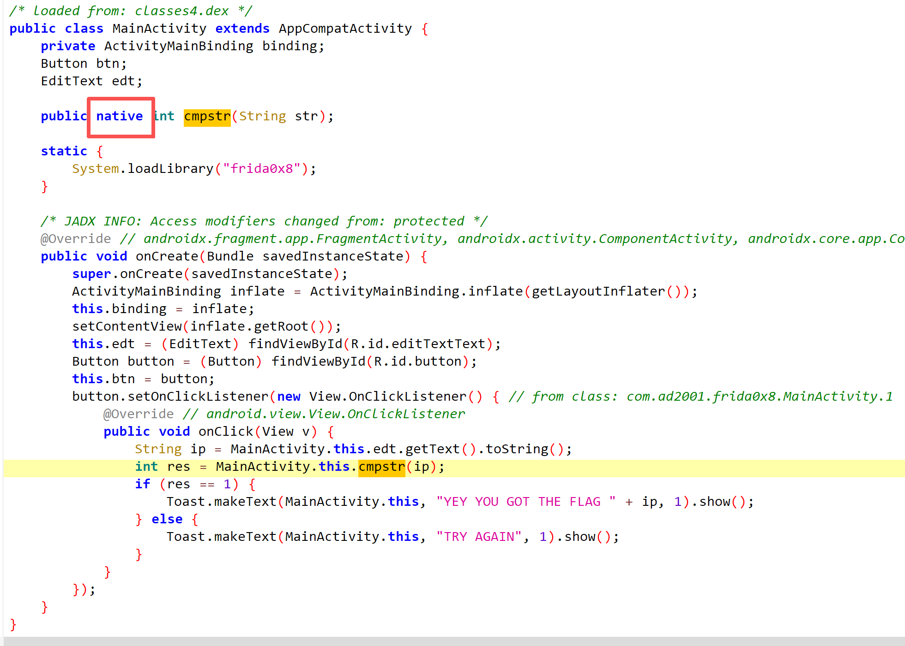

通过校验取决于native层的cmpstr。进入so文件查看。

public native int cmpstr(String str); 传入string类型，返回int类型。

先修改JNI函数（）的参数类型为 如图

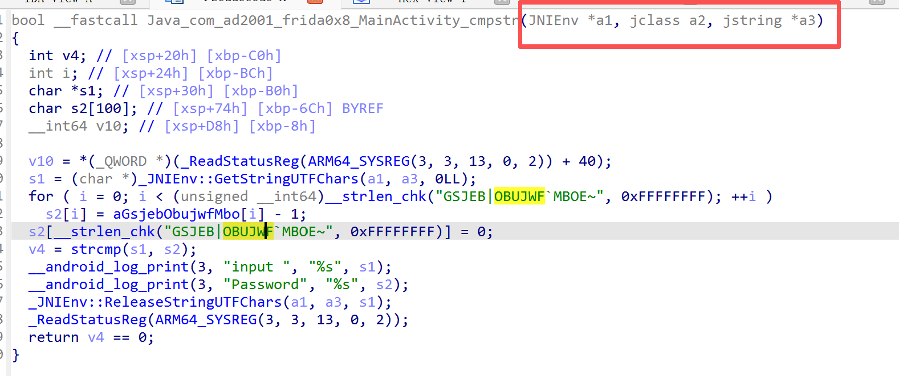

接下来我们就要hook这个Java\_com\_ad2001\_frida0x8\_MainActivity\_cmpstr JNI函数了。

(hook这个JNI函数，后续我只能改变返回值来通过校验)


下面是hook strcmp函数，来拿到s2的值。s1是输入

```
function hook() {


  var target = Module.findExportByName("libc.so", "strcmp"); //查找strcmp的地址
  console.log(target);  //（地址一次查找 ， 下面多次调用/拦截。）


  Interceptor.attach(target, {
    onEnter: function (args) { 


      var input = Memory.readUtf8String(args[0]);//第一个参数


      if (input.includes("aaa")) {//加个限制，不然太多了
        console.log(Memory.readUtf8String(args[1])); //打印strcmp的第二个参数
      }


    },


    onLeave: function (retval) {
       
    }
  })
}


function main() {
  Java.perform(function () {
    hook();
  })
}
setImmediate(main);
```

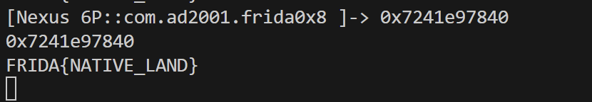

#### 总结：hook native层基础函数 ，打印中间参数

（地址一次查找 ， 下面多次调用。）

### Frida 0x9

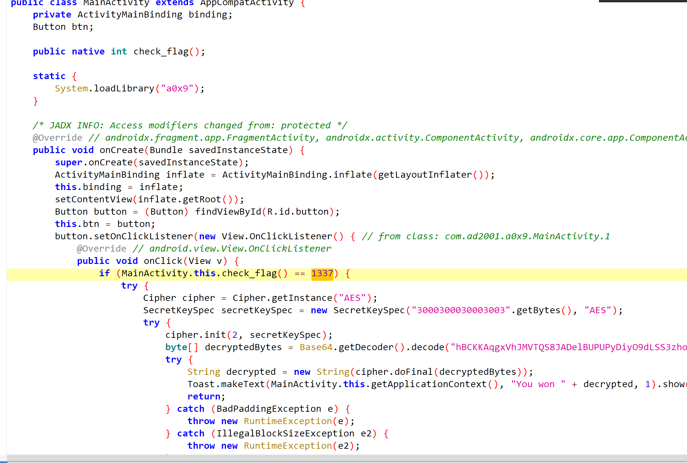

返回值只需为1337，就可以进入if中。

public native int check\_flag(); native层去看so库

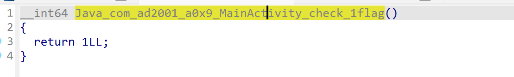

只需改返回值。

```
function hook() {


  var target = Module.findExportByName("liba0x9.so", "Java_com_ad2001_a0x9_MainActivity_check_1flag"); //查找strcmp的地址
  console.log(target);


  Interceptor.attach(target, {
    onEnter: function (args) { 


    console.log("----"); 


    },


    onLeave: function (retval) {
       console.log(retval); 
       retval.replace(1337);
    }
  })
}


function main() {
  Java.perform(function () {
    hook();
  })
}
setImmediate(main);
```

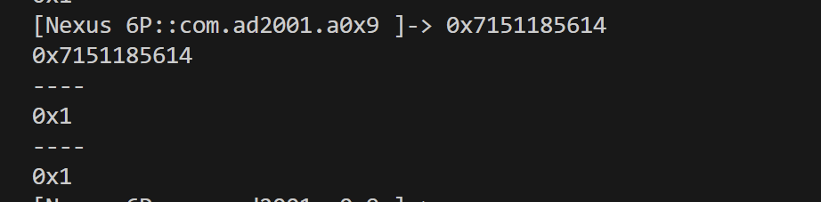

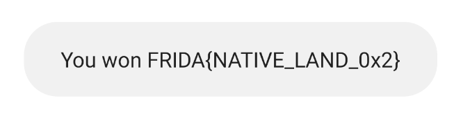

#### 总结：修改返回值

​

### Frida 0xA

没有关键逻辑，但是调用了activityMainBinding.sampleText.setText(stringFromJNI());

由于public final native String stringFromJNI(); 是native层，去看看so

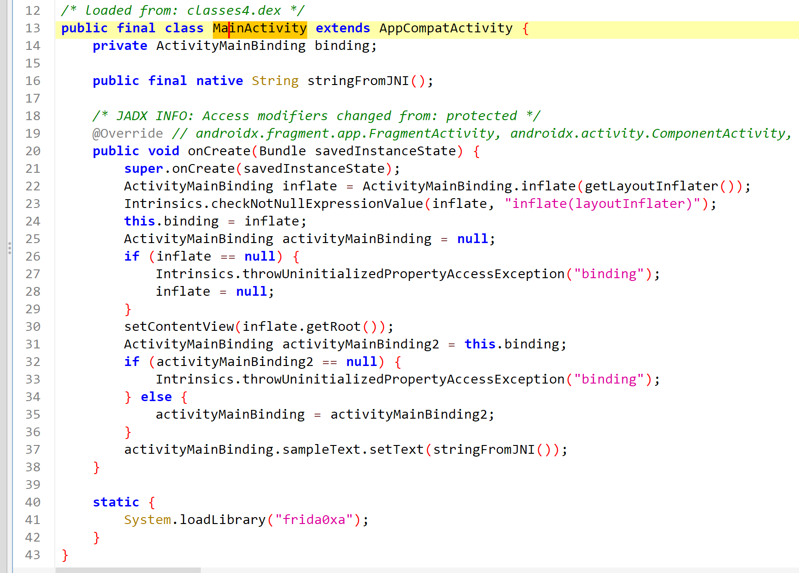

依旧没有加解密

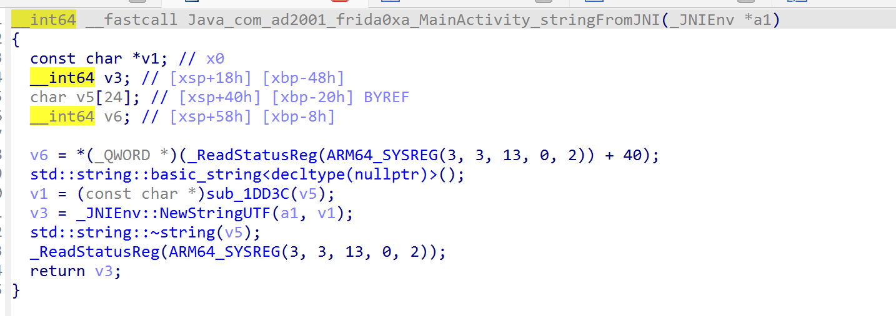

找到一个敏感函数get\_flag()，显然他没有被主动调用。且满足if ( result + a2 == 3 )

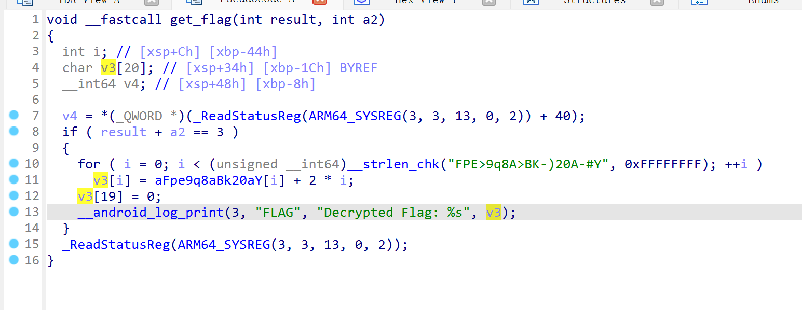

脚本

```
function hook(){
        var adr = Module.findBaseAddress("libfrida0xa.so"); //1DD60 得到了地址


        var get_flag_ptr =adr.add(0x1DD60);
        //var get_flag_ptr = new NativePointer(adr);  //创建对象    可以调用原生函数
        const get_flag = new NativeFunction(get_flag_ptr, 'void', ['int', 'int']);
       // 第一个参数 get_flag_ptr 是原生函数的指针；第二个参数 'void' 表示该原生函数返回值类型是 void（无返回值）；
       // 第三个参数 ['int', 'int'] 表示该原生函数有两个参数，且每个参数的类型都是 int。
       get_flag(1,2);
       console.log("hook success");


}


function main() {
  Java.perform(function () {
    hook();
  })
}
setImmediate(main);
```

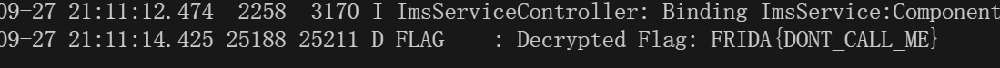

为什么这个函数找地址，要用so基址+偏移地址。但是之前的不用加偏移，可以直接通过API找到？在 Frida 中获取函数地址时，是否需要 “SO 基址 + 偏移”，取决于函数是否被导出（即是否在 SO 的符号表中可见）。如果函数是导出函数（在 SO 的符号表中存在名称），可以直接用 Module.findExportByName("libxxx.so", "函数名") 获取地址。

​

其实我们发现这个函数是导出函数，所以可以直接查找函数地址，无需计算。注意函数名

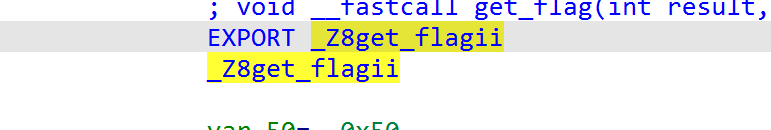

那么 导出函数的脚本为

```
function hook() {
  // 查找导出函数地址
  var target = Module.findExportByName("libfrida0xa.so", "_Z8get_flagii");
  console.log("get_flag address:", target);
  // 声明函数类型（用于主动调用）
  const get_flag = new NativeFunction(target, 'void', ['int', 'int']);
  // 挂钩函数，监控调用
  Interceptor.attach(target, {
    onEnter: function (args) { 
      console.log("---- get_flag 被调用 ----");
      
    },
    onLeave: function (retval) {


    }
  });


  get_flag(1, 2);
}


// 确保在 Java 环境就绪后执行
function main() {
  Java.perform(function () {
    hook();
  });
}


setImmediate(main);
```

const get\_flag = new NativeFunction(target, 'void', ['int', 'int']);

如果需要主动调用这个原生函数（比如在脚本中手动触发 get\_flag(1, 2)），就必须用 NativeFunction 包装。如果你只想 “监控” 函数（比如用 Interceptor.attach 查看谁调用了它、传了什么参数），可以不创建 NativeFunction。

#### 总结：hook未导出函数的主动调用，hook导出函数的主动调用

​

(主动调用)

​

### Frida 0xB

得出的信息是native层，不传入参数不返回值，且程序有主动调用。但是app点击后没有任何返回打印。

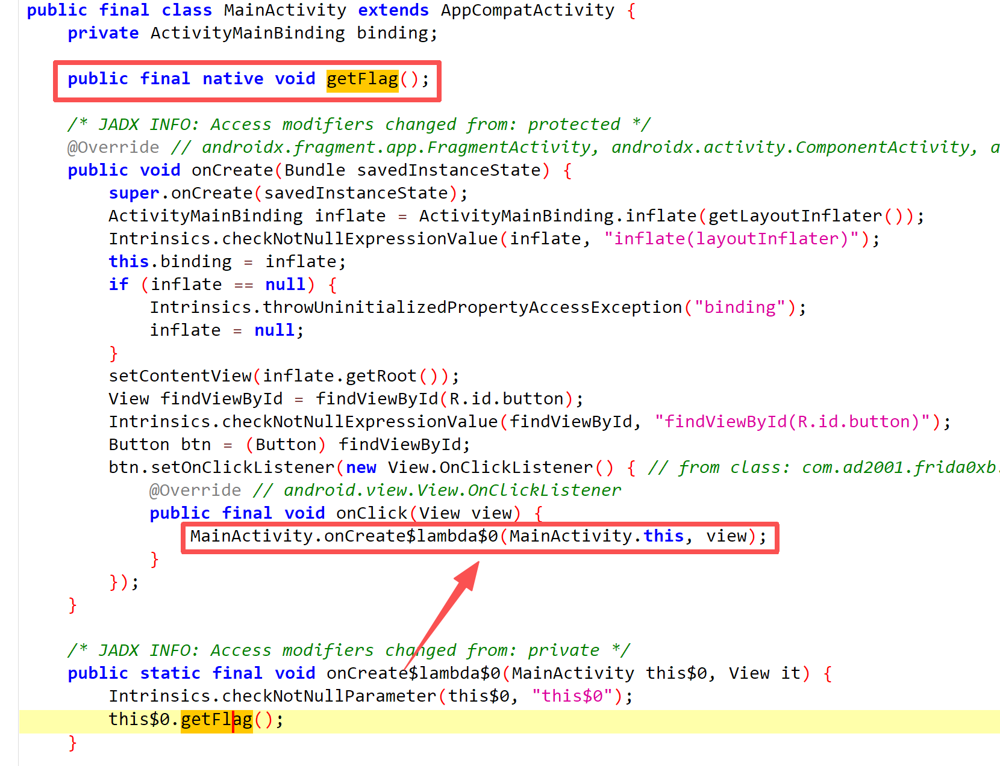

看看c，什么都没有。所以才会返回空吧。但是这个app总要有一个flag ，继续想 找找看

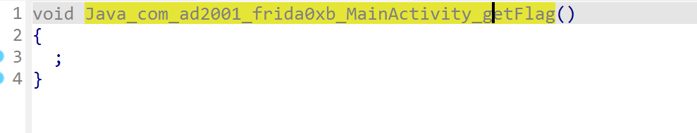

这个汇编有点奇怪，明明有敏感字符串为什么没有伪代码？

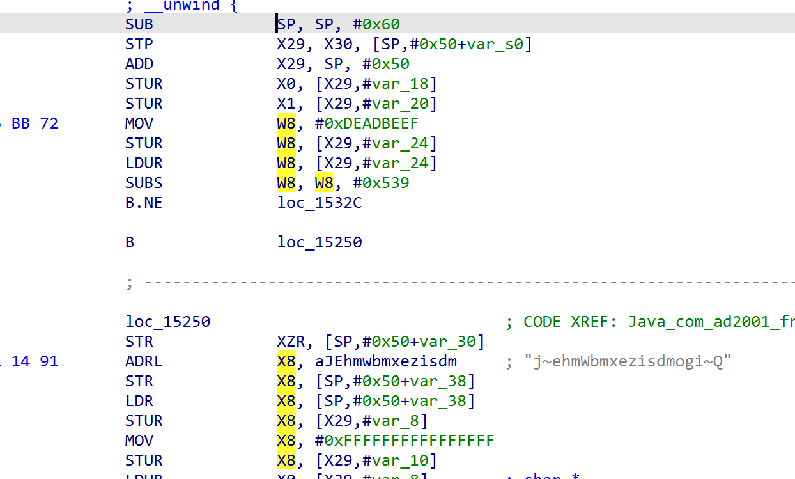

因为这里有一个跳转

计算 W8 = W8 - 0x539（做减法并设置标志位）。若减法结果“不为零”（NE = Not Equal），跳转到 loc\_1532C。

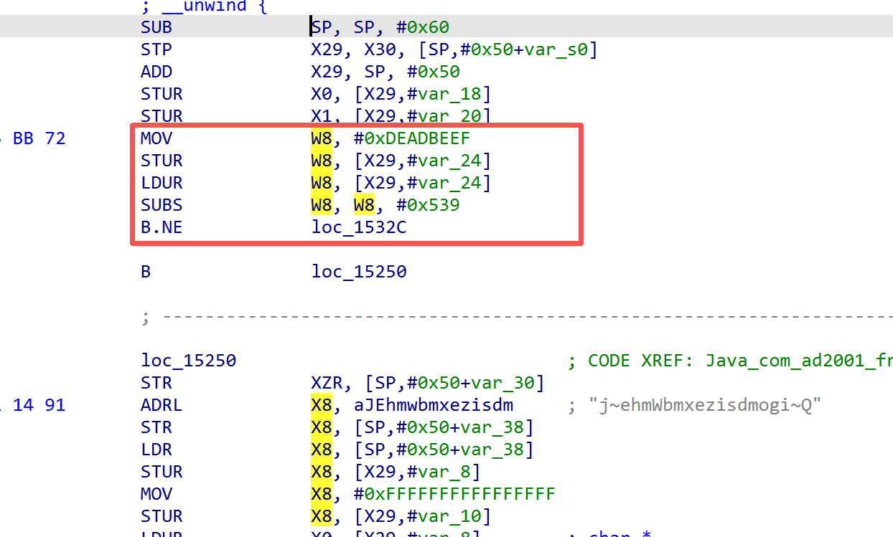

直接跳到函数末尾，跳过了核心逻辑。

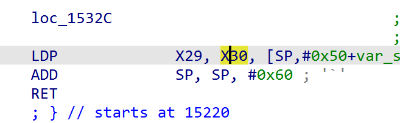

我们知道他永久不为零，所以把这段nop掉。重新反编译

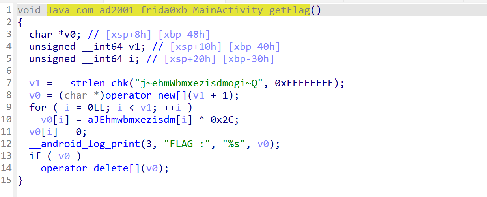

接下来继续hook这个函数。因为需要修改汇编，所以此次的脚本会不同，他不再需要拦截器。

```
function hook() {
  var adr = Module.getBaseAddress("libfrida0xb.so");
  var target =adr.add(0x15248);
  console.log("function address:", target);


        Memory.protect(adr, 0x1000, "rwx");//修改指令需要先赋予写权限，否则会报错。
//我们不会让整个部分都可写。我们只需要更改一个小区域的权限，
//这样我们就可以插入指令而不会使应用程序崩溃。

        var writer = new Arm64Writer(target);
// // 创建Arm64Writer对象，用于在目标地址写入ARM64指令

        try {
            writer.putNop();
          //// nop原来的B.NE（不相等则跳转）指令
            writer.flush();
            console.log("Success!!");
        } finally {
            writer.dispose();
        }
      
    }


// 确保在 Java 环境就绪后执行
function main() {
  Java.perform(function () {
    hook();
  });
}


setImmediate(main);
```

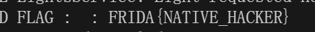

在 ARM64 架构中，每条指令的长度固定为 4 字节（32 位）。无论指令是简单的 NOP（空操作），还是复杂的 B.NE（条件分支），指令长度都是 4 字节。

被替换的 B.NE 指令：是一条 4 字节的条件分支指令。

用于替换的 NOP 指令：也是一条 4 字节的空操作指令。

因此，用 1 条 NOP 指令，恰好能完全覆盖原来的 B.NE 指令的内存空间（4 字节换 4 字节，长度匹配）。

#### 总结：修改汇编hook

​

### Frida 0x7（补充上一篇）

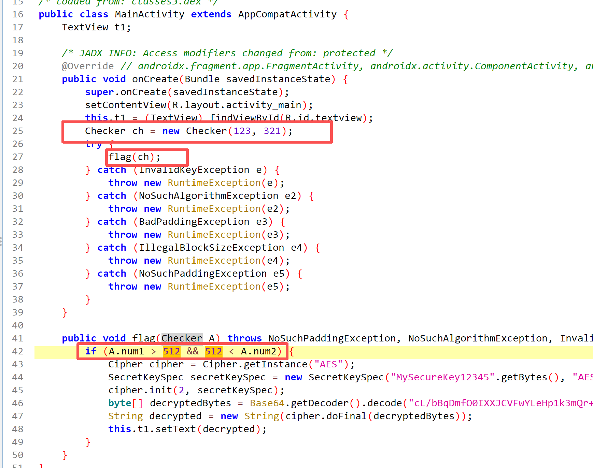

Checker实例已创建，flag方法有主动调用，只需满足if中A.num1 > 512 && 512 < A.num2，所以要修改num1，num2参数。

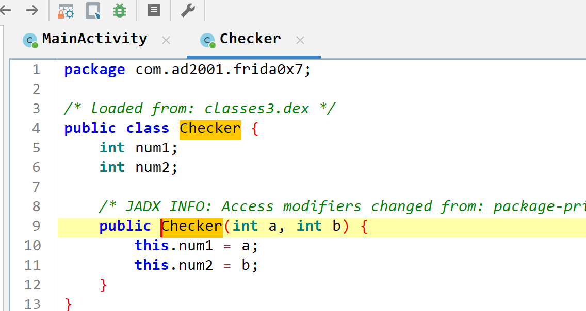

Checker是一个构造函数

```
function hook() {
    Java.perform(function () {
        // 获取Checker类引用
        const Checker = Java.use("com.ad2001.frida0x7.Checker");
        
        // 关键修复：构造函数在Frida中用$init表示，而非类名$Checker
        Checker.$init.overload('int', 'int').implementation = function(a, b) {
            console.log("构造函数原始参数: a=" + a + ", b=" + b);
            
            // 修改参数值
            a = 513;
            b = 513;
            console.log("构造函数修改后参数: a=" + a + ", b=" + b);
            
            // 调用原始构造函数（使用$init）
            this.$init(a, b);
        };
    });
}


function main() {
    Java.perform(function () {
        console.log("开始执行Hook...");
        hook();
    });
}


 setImmediate(main);
```

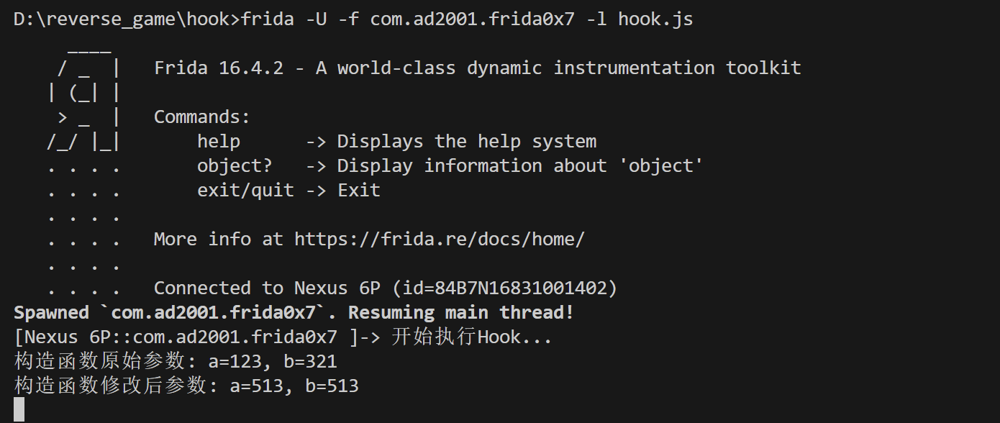


#### 总结:hook构造函数，传参

（这是补充上一篇留下来的小尾巴）
