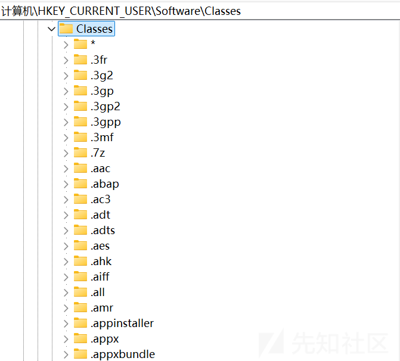
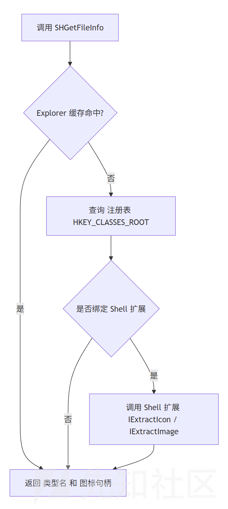
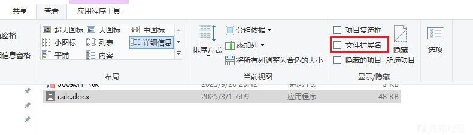
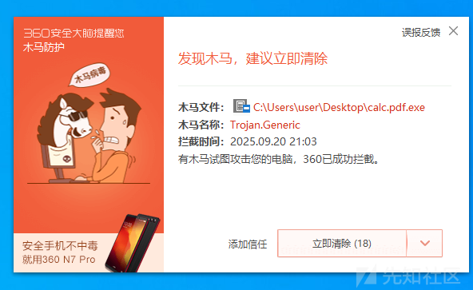
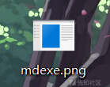
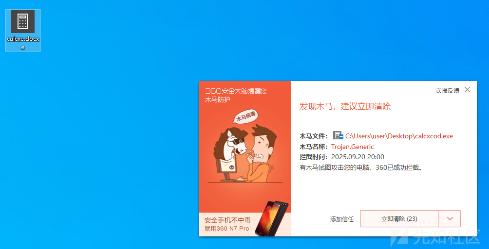
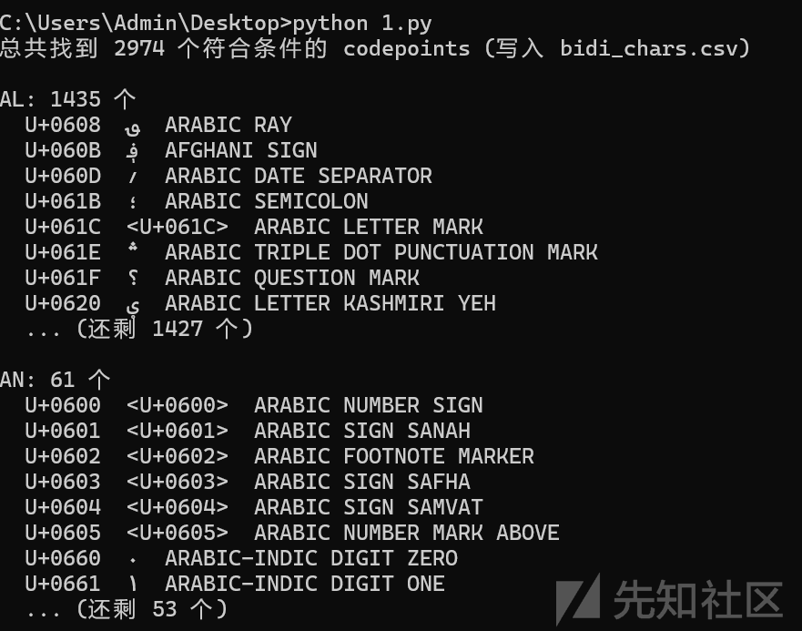
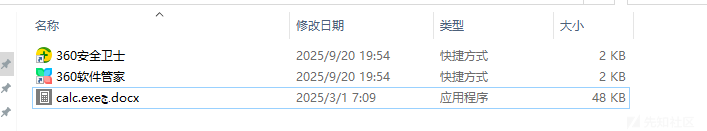
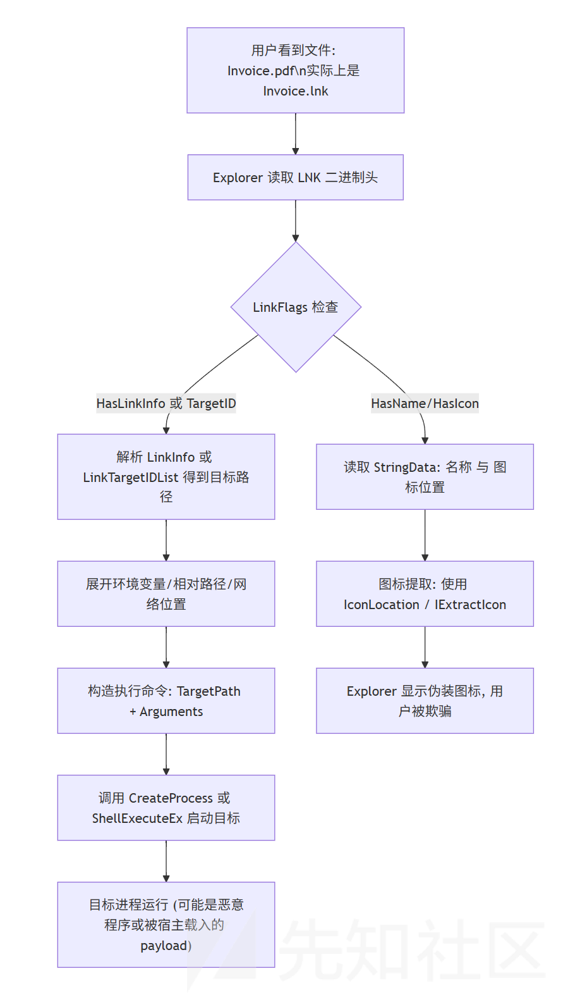

# 钓鱼文件的“视觉欺骗”-先知社区

> **来源**: https://xz.aliyun.com/news/18961  
> **文章ID**: 18961

---

在社会工程学（社工）钓鱼攻击中，通过视觉欺骗“伪造”文件名称后缀是一种常见的手法，其主要目的是误导受害者，让他们误以为文件是安全无害的，从而点击打开或执行该文件。这种技术利用了人们对文件类型和扩展名的信任，以及对特定格式文件的熟悉度来掩盖恶意内容的真实性质。具体来说，这样做的意义包括：

1. **绕过安全意识**：很多用户已经具备了一定的安全意识，知道不要随便打开.exe等可执行文件。通过伪造文件名后缀，比如将一个恶意的.exe文件伪装成.pdf或.docx文档的形式（但实际上可能是"filename.pdf.exe"），可以降低用户的警惕性。
2. **模仿可信来源**：攻击者可能会选择模仿一些知名软件、服务提供商或者机构的文件命名方式，使接收者更容易相信这是一个来自可靠来源的重要文件，进而增加了打开的可能性。
3. **逃避初步检查**：对于那些只简单查看文件名而不仔细检查完整路径的人来说，这种伪造手段能够有效地隐藏实际的文件类型，使得即使是一些基本的安全措施也难以发现异常。
4. **增加传播机会**：如果目标用户被成功诱骗打开了伪装后的恶意文件，并且这个文件还具有自我复制或传播的能力，那么就有可能进一步扩散到其他系统或网络上，造成更大范围的影响。

总之，通过视觉欺骗伪造文件名称后缀是一种旨在利用人类心理弱点和社会工程学技巧来实施攻击的方法。

# 一、Windows 是如何识别文件类型的

在 Windows 上，文件类型的识别最先被放在了一个看似简单但极其核心的点上：扩展名。系统不会像 Unix 那样普遍依赖“`magic number`”去扫文件头，而是通过 **注册表里的映射关系** 将 `.txt`、`.pdf`、`.docx` 等后缀绑定到一个 `ProgID`。Explorer、Shell、Win32 API 调用时首先查的就是这个映射。  
这一机制的最大优势在于速度与一致性：查询注册表的代价极低，用户在界面上看到的“文件类型名称”、双击的“打开方式”，都能保持和系统一致。比如一个 `.txt` 文件，系统立刻能告诉你它是“文本文档”，并找到 Notepad 的路径。这类调用通常通过 `AssocQueryString` 完成，简单调用一下就能拿到默认的打开命令行，效率极高。

文件名的扩展名（例如 `.pdf`、`.txt`）在注册表中有对应条目，Windows 将扩展名映射到一个 **ProgID**（类名），而 ProgID 下定义了 `shellopencommand` 等打开命令、图标、逻辑名等。所有合并视图在 `HKEY_CLASSES_ROOT`（HKCR） 下呈现（本质上合并了 `HKCUSoftwareClasses` 与 `HKLMSoftwareClasses`）。这就是 Explorer 和很多 API 首先查找的地方，好处是速度极快、便于企业统一管理。但是扩展名可被篡改、或文件无扩展名时注册表无能为力（现代 Windows 对直接写 `UserChoice` 做了保护 。



如果说扩展名+注册表的方式是一层最直接的映射关系，那么走到 Shell 层，Windows 给出的就不只是“类型名”那么简单了，而是更贴近用户感受的一整套视图：文件的图标、描述文字、默认操作、属性页……这一切其实都绕不开 `SHGetFileInfo` 这个 API。

```
#include <windows.h>
#include <shlobj.h>
#include <shellapi.h>
#include <stdio.h>

int main() {
    SHFILEINFO shFileInfo;
    ZeroMemory(&shFileInfo, sizeof(SHFILEINFO));

    // 这里换成你要测试的文件路径
    LPCSTR filePath = "C:\Windows\
otepad.exe";

    if (SHGetFileInfoA(filePath, 0, &shFileInfo, sizeof(SHFILEINFO),
                       SHGFI_ICON | SHGFI_TYPENAME | SHGFI_DISPLAYNAME)) {

        printf("文件类型名: %s
", shFileInfo.szTypeName);
        printf("显示名称: %s
", shFileInfo.szDisplayName);
        printf("图标句柄: %p
", shFileInfo.hIcon);

        // 释放图标句柄
        if (shFileInfo.hIcon) {
            DestroyIcon(shFileInfo.hIcon);
        }
    } else {
        printf("调用 SHGetFileInfo 失败。
");
    }

    return 0;
}

```

Windows 在 Shell 层做了一个优化：常见文件类型的图标和类型名，会被缓存到 `IconCache.db` 这样的数据库里（在 Win10 之前还可以直接看到）。Explorer 启动时会把这些缓存映射到内存，调用 `SHGetFileInfo` 时优先查缓存，而不是每次都去注册表、去磁盘翻找资源。这样一来，在资源管理器里滚动上千个文件图标时，性能才不会拖垮。这也是为什么你在自己写文件管理器时，直接用 `SHGetFileInfo` 就能“白嫖”Explorer 的缓存逻辑，而不用担心效率问题。



与 `SHGetFileInfo` 相比，`FindExecutable` 就显得像个“老古董”。它的职责很单一：给你一个文件路径，返回系统认定的默认打开程序路径。逻辑上，它就是帮你去注册表里查 `shellopencommand`，然后把结果拼出来。但在现代 Windows 中，这种做法显得过时，因为用户默认程序选择早已被 `UserChoice` 机制保护起来，直接靠 `FindExecutable` 得到的路径未必可靠，尤其是在多用户环境下。于是微软自己也推荐用更新的 `AssocQueryString` 来取代它。

```
HINSTANCE FindExecutableA(
  LPCSTR lpFile,   // 输入文件路径
  LPCSTR lpDirectory, // 可选，指定起始目录
  LPSTR lpResult   // 输出缓冲区，返回 exe 路径
);

HINSTANCE FindExecutableW(
  LPCWSTR lpFile,
  LPCWSTR lpDirectory,
  LPWSTR lpResult
);

// 成功时：返回大于 32 的 HINSTANCE（其实是个虚拟的值，重点在 lpResult）。
// 失败时：返回 <= 32 的错误码（例如 31 表示没有找到可执行程序）。
```

值得一提的是，Shell 层的“文件类型识别”并不仅仅是查询，还涉及到一种**展示上的一致性**。举个例子：假设某人系统里安装了 Photoshop 并注册了 `.png` 文件类型。Explorer 里 `.png` 的图标会换成 Photoshop 的 logo，你在 `SHGetFileInfo` 里拿到的图标句柄也是一样的。这种一致性是通过 Shell 的注册表映射和缓存机制一起保证的。如果你自己去查注册表，甚至直接扫文件头，你顶多知道“这是个 PNG 文件”，但你显示的图标和 Explorer 可能就不一致了，体验上立刻会让用户觉得“这不是系统风格”。

再深入一点，`SHGetFileInfo` 内部还涉及到 `IExtractIcon`、`IExtractImage` 这样的 COM 接口。如果某些文件类型需要动态生成图标（比如 `.lnk` 快捷方式、视频缩略图、甚至 Office 文档缩略图），Explorer 会调用对应的 Shell 扩展 DLL 来完成。你调用 `SHGetFileInfo` 的时候，Shell 会帮你触发这些扩展并缓存结果，这就是为什么它不仅仅是一个简单的查询函数，而是和整个 Shell 扩展体系绑在了一起。

从开发角度看，依赖 `SHGetFileInfo` 的最大好处就是“省心”：它保证了结果和 Explorer 完全一致，带来统一的用户体验。但缺点同样明显：你要承受它的缓存逻辑，有时候缓存损坏（比如图标显示错乱），调用它也会跟着“中毒”。这就是我们在实践中经常遇到的“重建图标缓存”的操作，本质上就是清理 Explorer 的缓存文件，让 `SHGetFileInfo` 重新走一遍注册表和资源提取的流程。

因此，在 Shell 层，`SHGetFileInfo` 更像是“官方视角的唯一真相”，它把注册表的静态信息、Shell 扩展的动态逻辑、Explorer 的缓存优化揉在一起，提供了一个开发者既省事又风险共担的入口。而 `FindExecutable` 则是那个“历史遗迹”，更多用于兼容代码，真正的现代开发已经逐渐绕过它了。

​

# 二、如何在 Windows 上伪造具有“视觉欺骗”的文件名称

## 双后缀伪装

在安全研究和实战攻防的场景里，`xxx.pdf.exe` 这一类“双后缀”伪装是出现频率最高的手法之一，原因其实很现实：它几乎不依赖复杂的 Unicode 双向控制符，而是借助了**用户认知与系统 UI 显示的差异**。Windows Explorer 默认会隐藏“已知文件类型的扩展名”，用户看到的往往是前半段 `xxx.pdf`，而真正的可执行扩展 `.exe` 被系统掩盖了。当受害者把文件拖到邮件附件里、或者下载到桌面时，文件图标又会进一步放大这种误导效果——由于 Windows 是按照**注册表关联的最后一个扩展名**来决定文件类型，`xxx.pdf.exe` 会被识别为 EXE 程序，显示的图标是可执行文件的小方块，名称却仍旧以 “pdf” 结尾，形成视觉上的“文档”暗示。

攻击者之所以偏爱这种方式，有几个优势：第一，它**兼容性极高**，不依赖特定版本的 Explorer 渲染 bug，几乎所有 Windows 版本都对 `pdf.exe` 解释为可执行；第二，它**不需要控制字符**，因此在邮件网关、杀软的简单基于正则的 Unicode 清洗规则下也不容易被拦截；第三，它和社会工程学结合极为紧密，`pdf`、`docx`、`xls` 这些字样天然地迎合了办公场景中的诱饵需求。换句话说，这是最低成本、最高收益的欺骗手法。



但是，同样这种方式已被 360 等杀软进行了严格监测，当`伪造文件后缀.exe`时，即会提升拦截概率。



可以通过遍历所有零宽字符尝试进行绕过。

## `RLO`技巧

Unicode 里有一组“Bidirectional control characters”（双向控制字符），它们不是普通可见字符，而是控制文本渲染方向的元字符。RLO（Right-to-Left Override，U+202E）就是其中之一。渲染引擎（包括 Windows 的文本渲染栈、Explorer 的文件名显示组件、很多 UI 控件）在遇到 RLO 时，会把随后出现的字符序列视为从右向左绘制，直到遇到相应的终止符（常用的终止符是 PDF，U+202C —— Pop Directional Formatting），或者到字符串结束为止。关键点在于：

* 操作系统文件系统（如 NTFS）并不会因为 RLO 改变文件的字节序列，它只存储字节流/UTF-16 编码；只有渲染层（富文本显示、字体引擎）在输出时根据 Unicode Bidi 算法改变视觉呈现顺序。
* RLO 的典型滥用方式是把它插入文件名中，使得“真正的扩展名字节顺序”在屏幕上被反置，从而把例如 `evil.exe` 字节仍是 `e v i l . e x e`，但渲染成看起来像 `exe.liv e` 或者与其余部分拼接后看起来像 `.docx`。攻击者会把 RLO 放在文件名的中间或接近末尾，利用默认的单行渲染来隐藏真正后缀。
* Explorer、邮件客户端、网页浏览器等都会使用各自的渲染实现，但多数都会遵循 Unicode 隔离/Bidi 流程，因此 RLO 在很多显示环境下都会造成相同的视觉反转效果。少数纯文本环境（例如某些命令行配置或老旧控件）可能不会完全呈现复杂的 Bidi 行为，但主流 GUI 都会。

举个最小例子：字节序列 `["r","e","p","o","r","t",".", U+202E, "e","x","e"]` 在视觉上可能显示成 `report.exe` → 但放置的位置和字体渲染后可能显示为 `reportexe.` 或 `reportexe`（依 UI 而异），关键是对用户而言“看不出来是真正的 .exe”。



RLO 并不是唯一能影响视觉方向的字符，Unicode 中存在多种双向控制与相关字符，它们在不同组合下能达到类似或更复杂的效果。主要族类包括：

* `RLO` (U+202E) — Right-to-Left Override：强制后续字符右到左渲染直到 PDF。
* `LRO` (U+202D) — Left-to-Right Override：与 RLO 相对，强制从左到右。
* `RLE` (U+202B) 和 `LRE` (U+202A) — Right/Left-to-Left Embedding：启动嵌入式双向段落；需要 PDF 终止。
* `PDF` (U+202C) — Pop Directional Formatting：关闭最近的嵌入/覆盖。
* `RLM` (U+200F) / `LRM` (U+200E) — Right/Left-to-Left Mark：较短的方向性标记，影响单字符邻近渲染。
* 现代 Unicode 还引入了“isolate”系列字符来更安全地管理段落方向：`FSI` (U+2068)、`PDI` (U+2069)、`LRI` (U+2066)、`RLI` (U+2067) —— 这些用于在内嵌内容中隔离方向性影响。攻击者可以用 `RLI` + content + `PDI` 来做更精确的反转而不影响全行其它文本。

RLO / RLE / RLI 等都可以用来实现反转或局部反转。实际攻击中，RLO 因为直接且效果明显而被常用；但更微妙的攻击会混合使用 `RLI`/`PDI` 以减小对其它文本的副作用，也能更容易绕过简单的正则检测（比如只查 RLO）。

但是，随着杀软查杀的能力逐步加强，`RLO`控制字符在 360 等安全软件的识别中往往会被重点关注，对木马整体免杀效果造成负面影响。



在 Unicode 中实际上还有大量**本身就属于“右到左（RTL）”类别的字符**（阿拉伯字母、希伯来字母等），它们在 Unicode 双向算法中被认为是“强 RTL”字符，会把包含它们的运行（run）从 LTR 切换成 RTL。把两者区分清楚很重要：

* 一类是**显式控制字符**（RLO/LRO/RLE/LRE/RLI/LRI/FSI/PDF/PDI 等），它们是渲染指令；
* 另一类是**具有 RTL 属性的可见字符**（比如 Arabic/Hebrew 字母、以及部分阿拉伯数字类 `AN`），它们本身会在混合文本中构成 RTL run。



通过添加阿拉伯字符 `ج` 即可绕过杀软查杀执行程序，效果如下：



## `lnk`模式

`LNK` 文件的结构不是随意字符串，而是有明确定义的二进制头和若干可选块。文件以一个固定的 Shell Link Header 开始（包含 LinkFlags 指示哪些可选数据存在），紧接着可选的 LinkTargetIDList（用于表示 shell namespace 中的目标 ID），然后是 LinkInfo（包含本地/远程路径的解析信息），再就是一系列 StringData（例如名称/相对路径/工作目录/命令参数/图标位置等），最后可能跟若干 ExtraData 块（例如环境变量、DarwinData、IconEnvironment、区块对齐等）。最关键的是 LinkFlags 的位域，它指出此 .lnk 是否包含 IconLocation、HasName、HasArguments、HasLinkInfo 等，这些位决定了 Explorer 在渲染或解析时要读取哪些部分。攻击者可以在 StringData 的“名称（NameString）”字段写入任意显示名称（即用户在 Explorer 里看到的名字），这使得 LNK 可以呈现与实际文件名截然不同的显示名；同样，在 IconLocation 字段攻击者可以写入任意 DLL/EXE,iconIndex，Shell 在显示该快捷方式时会尝试从该位置提取图标，从而把快捷方式“披上”任意图标（例如 PDF、Word、图片的图标），进一步欺骗用户。

当用户双击一个 .lnk，Shell 的处理不是把 .lnk 自身当作可执行文件来运行，而是**解析 .lnk、解析出目标路径与参数、再以用户上下文去启动目标**。更精确地说，Explorer 会（或内核通过 Shell 组件会）读取 .lnk，依据 LinkFlags 决定哪些字段有效，优先使用 LinkTargetIDList/LinkInfo 解析出目标（这一步会涉及解析网络位置、已知文件夹 ID 或相对路径的展开），若存在环境变量或字符串模板再做展开，最后构造要执行的命令行（可执行文件路径 + arguments）并调用 CreateProcess / ShellExecuteEx 等来真正启动目标进程。因为 .lnk 中允许携带 arguments，所以一个快捷方式可以把“看起来像是打开文档”的动作映射成 `C:WindowsSystem32cmd.exe /c powershell -enc ...` 之类的真正命令；攻击者会利用这一点把恶意载荷或脚本作为参数传递给合法宿主程序来规避签名检查或白名单（例如以 signed `mshta.exe`、`rundll32.exe` 等作为宿主载入 payload）。另外，LinkTargetIDList 可以指向 Shell 命名空间对象（例如“控制面板项”或特殊 GUID），并在解析时导致 Shell 额外的解析器/COM 调用被触发；史上很多 LNK 漏洞正是因为 Explorer 在解析这些扩展字段时去加载不受信任的 COM 对象或调用了不安全的解析逻辑，从而实现“仅浏览目录即触发”的 RCE。



powershell 创建快捷方式的命令参考如下：

```
$WshShell = New-Object -ComObject WScript.Shell
$Shortcut = $WshShell.CreateShortcut("C:\temp\Invoice.lnk")
$Shortcut.TargetPath = "C:\temp\evil.exe"
$Shortcut.Arguments = "--do-bad"
$Shortcut.IconLocation = "C:\Windows\System32\shell32.dll,137"
$Shortcut.Description = "Invoice.pdf"
$Shortcut.Save()
```

在实际的攻防场景中， 攻击者常用的实现手法在工程上是很直观的：把 `.lnk` 的显示名（NameString / Description）改成 `Invoice.pdf` 这类能诱导人的文本，把 IconLocation 指向一个看起来像 PDF/Office 的图标资源（可指向本地或以往可被访问的网络路径），把 LinkTarget 指向 `cmd.exe`/`powershell.exe`/`mshta.exe`/`rundll32.exe` 等“合法宿主”，并把实际 payload 放在参数里或放在与 `.lnk` 同一目录下的隐藏文件中。这样用户在桌面上看到的就是“一个 PDF 文件的图标和名字”，而真正被执行的却可能是 `cmd /c start "" "%~dp0._payload.exe"` 或 `powershell -NoProfile -WindowStyle Hidden -EncodedCommand <b64>`。把 payload 放在同目录并用相对路径引用是常见技巧，因为它降低了对外部资源的依赖：攻击者只需把 `Invoice.lnk` 和 `._invoice.exe` 一起放在目标目录（比如用户下载文件夹），用户双击看似“打开文档”，实际上就会触发执行。为了进一步隐蔽，攻击者还会把 payload 用 NTFS 的替代数据流（ADS）藏起来或把文件/文件夹设置为系统/隐藏属性（`attrib +h +s <name>`），让不熟悉设置的用户看不到该可执行文件，即便查看目录也不易察觉。

> 注意：远程图标在 Windows11 上无法正确显示。历史上，针对通过快捷方式图标加载触发的 RCE 漏洞（MS17-013、MS10-046 等）推动了对 Shell 在渲染时加载外部资源的严格审查；在随后的若干 Windows 更新中，微软对图标/缩略图的解析路径、网络访问行为与 COM 解析流程引入了更多验证、沙箱化和缓存策略。对于 Windows 11，厂商把用户桌面和资源管理器的渲染路径进一步收紧：一方面优先使用本地缓存的图标并减少对网络路径的同步访问（这既是性能也出于安全考虑）；另一方面在默认配置下会拒绝从未被信任的网络位置动态加载并呈现图标（即使共享有读权限），除非通过明确的策略/组策略允许或把资源事先缓存在本地。社区反馈（从 Microsoft Answers、StackOverflow 和管理员论坛的案例）显示，很多用户在从 Win10 迁移到 Win11 后发现网络共享中的图标不再被直接加载，即便权限正确，这体现了 Shell 在最新版本对网络资源访问采取了更保守的默认态度以减少暴露面。微软的官方答复和社区讨论也表明这类行为有时是更新导致的副作用（例如安全补丁、默认策略更改或对 UNC/URL 处理的改变），并非单纯的 bug。换言之，Windows 11 更倾向于避免在 Explorer 的渲染路径进行远程资源检索以降低被利用的风险；如果企业确有需求，会通过 Group Policy、网络可信域设置或图标缓存策略来恢复或替代这种行为

​

# 三、识别与防御措施

上述介绍可以看成是一种“人机交互漏洞”的集合：攻击者不是要绕过操作系统的内核判定（系统始终按真实扩展名/文件头处理文件），而是要骗过人的直觉与 Shell 的展示/解析路径——所以防御必须同时对“展示面”（UI/Explorer/邮件/浏览器）和“解析面”（图标/缩略/预览/执行流程）下手。

在入口层面的改法最直接也最经济。所有的邮件网关与下载代理都应当把附件做“深度解包 + 内容嗅探”：这意味着不要只看扩展名，而是打开 ZIP/ISO/MHT 等容器、解析 ADS 与 .lnk 内部结构（提取 LinkTarget、Arguments、IconLocation、LinkTargetIDList），并把下列条件视为高风险——指向 UNC/临时目录/Downloads 的相对路径、使用常见宿主（mshta, powershell, rundll32, wscript/cscript, cmd）作为 Target、IconLocation 指向远程路径、或文件名包含不可见控制字符（RLO/零宽）。这些判断既可以在网关层直接隔离附件，也可以在 Office 365 / Exchange 的 Safe Attachments（动态沙箱）里投放样本做动态分析。微软的 Safe Attachments 与 SmartScreen 能在入口和浏览环节做第二道保护（对未知/可疑文件进行阻断或沙箱化判定），将这些功能合理配置（例如把 SmartScreen 设置为强制阻断而不是仅警告）可以显著降低社工投递成功率。

在终端上，Windows 11 相比早期版本在“默认安全态”上做了明显收紧，这直接削弱了很多基于渲染时加载远程资源或调用解析器的利用路径。微软在 Windows 11 的设计里把更多安全特性默认打开并推动解析器/渲染路径的隔离（包括硬件支持的内核保护、核心隔离、Credential Guard 等），这些改动的效果是把系统的攻击面在更低层级上缩小：一方面使得 Exploit 和 RCE 更难在高权限进程里发生，另一方面通过更严格的进程隔离与默认策略限制 Explorer 对不受信任网络资源进行同步拉取，从架构上减少了 LNK 通过 remote Icon/UNC 触发的凭据泄露或远程加载风险。Windows 11 官方文档把这些硬化作为“Secure by design / Secure by default”的一部分进行推广，企业应结合核心隔离与 Credential Guard 等功能把端点防护提升到比 Windows 10 默认更高的基线。

在企业管理中，一是针对双后缀伪装，最有效的短期措施是把“显示已知文件扩展名”设为强制（组策略分发），并在文件管理器/下载器里显式展示“真实扩展名”和“将要执行的程序路径”——因为双后缀靠的正是用户对被隐藏扩展的信任；在企业环境中通过 Group Policy 把 Explorer 的“隐藏已知扩展名”开关关闭，同时在下载交互里拒绝或阻断来自 Internet 区域的可执行扩展（或要求二次管理员确认），这一步能立刻降低百分之几十甚至更高的误点击率。二是对于 RLO / 双向控制字符和零宽字符，入口与终端都要做字符级的净化：邮件网关、下载器、文件服务器在接受/展示文件名之前把不可见控制字符去除或把含有这些字符的文件标注为“可疑来源并隔离”；在 UI 层（例如文件下载列表或附件预览）额外显示“原始 codepoint”或给出一个“显示为纯 ASCII”的选项，能让审查者一眼发现文本被操纵。实现上可以通过在文件入库时对文件名做 `NFKC/NFC` 规范化并剥离所有 `U+200B/200C/200D/202E/FEFF/00AD` 等控制字符来堵住大多数绕过。三是针对 .lnk 的滥用，最佳实践是把两件事结合起来做：在入口处完全禁止 `.lnk` 附件（或自动把其转换为安全文本信息而非直接可点击的资源），并在终端上做运行前验证——任何来自 Internet/Downloads 的快捷方式在用户双击前都应被阻断或弹出安全对话框来展示完整 TargetPath、Arguments 与 IconLocation，且只有在管理员白名单核准后才允许执行。此外，Explorer 在渲染缩略图/图标/预览时不应直接在主进程加载第三方解析器：把 thumbnail/preview handlers 放入隔离进程或沙箱（这已是业界推荐的做法），并对注册的 Shell 扩展强制代码签名与白名单。很多现代攻击正是利用这些渲染回调去触发漏洞或加载远程资源；隔离能把“仅浏览”转变成“需要更高权限的事件”，从而阻断零点击链路。微软和安全厂商也建议在邮件/存储入口处静态解析 .lnk（提取 LinkFlags、IconLocation、TargetPath、Arguments、LinkTargetIDList）并把异常样本送入沙箱做动态分析，这能把许多带参数的“宿主+参数”滥用在到达终端前截掉。
