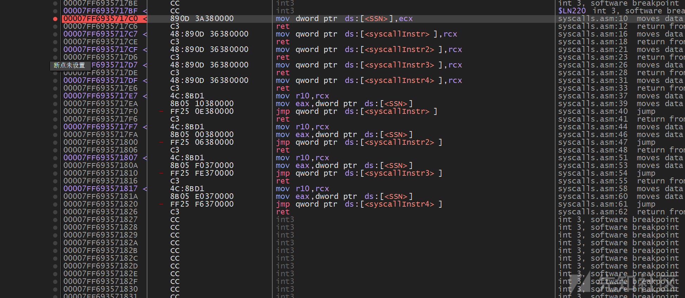
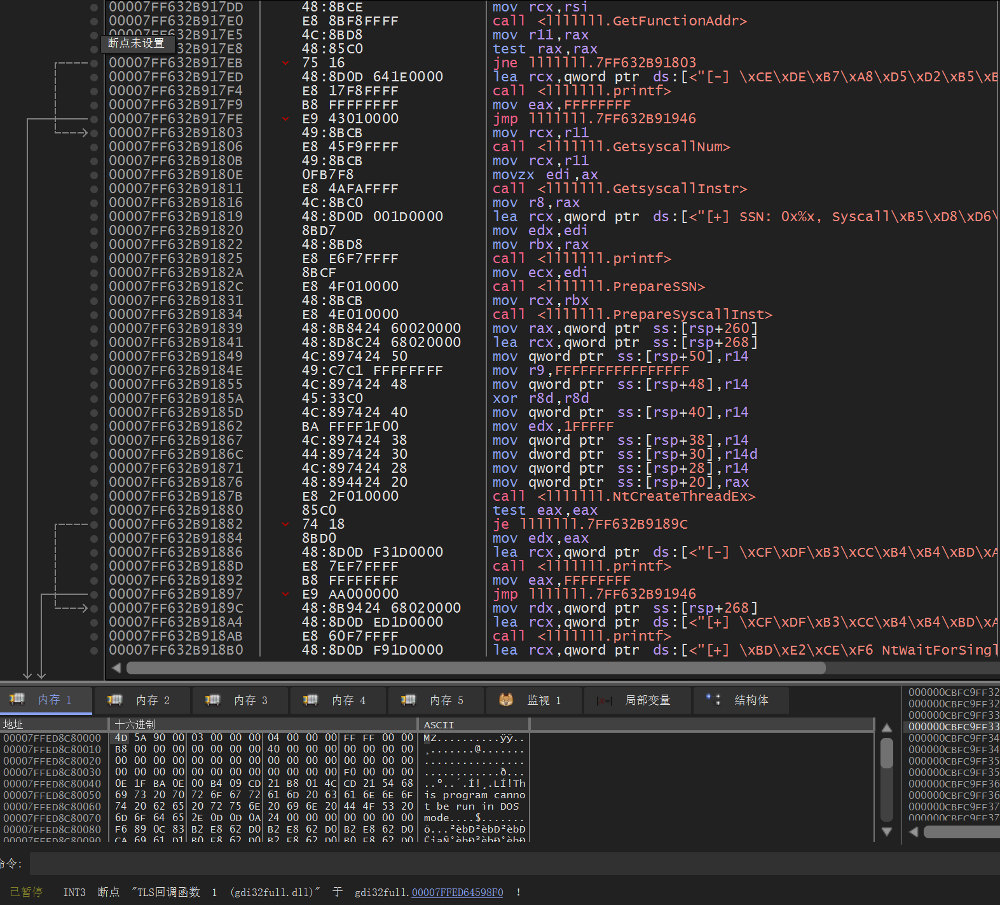

# PEB 和 EAT ，检测syscall stub-先知社区

> **来源**: https://xz.aliyun.com/news/18963  
> **文章ID**: 18963

---

# PEB 和 EAT

Windows系统编程中两个非常重要的概念——PEB和EAT。

传统的API调用方式很容易被各种安全产品检测和拦截。而通过直接操作PEB（进程环境块）和EAT（导出地址表），我们可以实现更加隐蔽和高级的API绕过技术。这种方法不仅能够绕过大多数用户模式的钩子，理解Windows系统的内部工作机制。

## 基础概念：理解Windows的内部世界

### PEB（Process Environment Block，进程环境块）

想象一下，每个Windows进程就像一个独立的"小王国"，而PEB就是这个王国的"政府档案"。它记录了关于这个进程的所有重要信息：有哪些DLL被加载了、堆内存的使用情况、进程的启动参数等等。

PEB是Windows系统为每个进程维护的一个核心数据结构。你可以把它理解为一个"信息中心"，里面存储着进程运行所需的各种环境信息。每个进程都有且仅有一个PEB，操作系统通过它来管理和控制进程的运行环境。

**PEB里都有什么？**

* **模块列表**：记录了当前进程加载了哪些DLL
* **堆信息**：进程内存的使用情况
* **进程参数**：启动时的命令行参数
* **调试信息**：是否被调试器附加等

**如何访问PEB？**

这里有个小技巧，在x86和x64架构下，我们可以通过特定的寄存器直接获取PEB的地址：

* x86架构：`fs:[0x30]`
* x64架构：`gs:[0x60]`

这种直接访问的方式避免了使用可能被钩子的API函数，这也是为什么PEB技术在安全研究中如此受欢迎的原因之一。

### EAT（Export Address Table，导出地址表）

如果说PEB是进程的"政府档案"，那么EAT就是每个DLL的"电话簿"。它记录了DLL中所有对外提供的函数，以及这些函数在内存中的具体位置。

**EAT是什么？**

EAT是每个可执行文件（EXE）或动态链接库（DLL）中的一个重要数据结构。你可以把它想象成一个"函数目录"，里面列出了这个模块对外提供的所有函数，以及每个函数在内存中的确切地址。

**为什么需要EAT？**

当你的程序想要调用某个DLL中的函数时，系统需要知道这个函数在内存中的位置。EAT就是提供这个信息的"地图"。比如，当你想调用`MessageBox`函数时，系统会先查找`user32.dll`的EAT，找到`MessageBox`的地址，然后跳转到那里执行。

**EAT在安全研究中的妙用**

在安全研究中，EAT有着特殊的价值。通过直接解析EAT，我们可以：

1. **绕过API钩子**：传统的`GetProcAddress`可能被安全产品钩子，但直接解析EAT可以绕过这些检测
2. **动态函数解析**：不需要硬编码函数地址，可以在运行时动态获取
3. **隐蔽性更强**：使用底层方法，更难被安全产品检测

**PEB + EAT = 强大的组合**

当我们把PEB和EAT结合起来使用时，就形成了一套完整的"API绕过方案"：

1. 通过PEB找到目标DLL（比如`ntdll.dll`）
2. 解析该DLL的EAT，找到目标函数
3. 直接调用函数，绕过所有可能的钩子

这种方法在高级恶意软件和安全工具中非常常见，因为它能够有效绕过大多数基于API监控的安全检测机制。

## 

在深入技术细节之前，让我们先聊聊一个有趣的现象：为什么我们要费这么大劲去"绕弯子"，而不是直接调用系统函数呢？

**传统方式的困境**

想象一下，你是一个"间谍"，需要执行一些敏感操作。如果你直接大摇大摆地走进目标建筑，很容易被"保安"（安全产品）发现。同样的道理，如果你直接使用`GetModuleHandleA`和`GetProcAddress`这些"明面上的"API，很容易被各种安全产品检测和拦截。

**间接系统调用的巧妙之处**

我们采用的方法更加"隐蔽"：

1. **避免直接查询**：我们不直接查询`ntdll.dll`中的系统调用存根
2. **动态提取**：而是在运行时动态提取我们需要的系统调用指令
3. **保持合法性**：虽然我们绕过了钩子，但我们仍然让系统调用指令从`ntdll.dll`的内存空间执行

**为什么要这样做？**

这样做的好处是，当系统调用执行完毕后，`ntdll.dll`会出现在线程调用堆栈的顶部，这看起来就像是一个"合法"的执行流程。这种"伪装"大大增加了我们的隐蔽性，让安全产品更难发现我们的真实意图。

为了实现这个目标，我们需要重定向执行流程，从`ntdll.dll`中获取并执行真正的系统调用指令。这就像是在"借刀杀人"，我们借用系统的"刀"，但执行我们自己的"任务"。

## 使用哈希值进行"隐身"遍历

现在让我们来看看具体的实现技巧。在实际应用中，我们通常不会直接使用明文的字符串来查找模块和函数，而是使用哈希值。这样做的好处是：

1. **避免字符串检测**：明文字符串容易被静态分析工具发现
2. **提高效率**：哈希比较比字符串比较更快
3. **增加隐蔽性**：混淆后的代码更难被逆向分析

**哈希算法的选择**

我们使用一个简单但有效的哈希算法：

```
import sys

def KHash(data):
    hash = 0x99  # 初始值
    for i in range(0, len(data)):
        hash += ord(data[i]) + (hash << 1)  # 累加字符值并左移
    print(hash) 
    return hash

if __name__ == "__main__":
    KHash(sys.argv[1])
```

这个算法的特点是：

* 简单快速
* 冲突率相对较低
* 易于在C语言中实现

**PEB遍历的巧妙之处**

通过遍历PEB中的模块链表，我们可以根据哈希值找到对应的DLL模块并返回其基地址。这里有个小技巧：在x64系统中，GS寄存器指向TEB（线程环境块），而TEB的偏移0x60处存储着PEB的地址。

这种方法的优势是：

* **避免API调用**：不需要使用`GetCurrentProcess()`等可能被钩子的API
* **直接访问**：通过寄存器直接访问，绕过所有可能的钩子
* **高效可靠**：底层访问方式，稳定性和性能都很好

## 字符串处理的细节：Unicode vs ASCII

在实际编程中，我们经常会遇到一个"小麻烦"：Windows内部使用的字符串格式和我们常用的格式不一样。

**Unicode vs ASCII**

Windows系统内部大量使用Unicode字符串（宽字符），而我们的哈希算法通常处理的是ASCII字符串（窄字符）。这就需要在两者之间进行转换。

**为什么需要转换？**

`LDR_MODULE`结构中的`dllname`字段是`UNICODE_STRING`类型，它使用宽字符（每个字符占2个字节）。而我们的哈希算法期望的是ASCII字符串（每个字符占1个字节）。

**转换的巧妙实现**

```
DWORD calcHashModule(LDR_MODULE* mdll) {
    char name[64];  // ASCII字符串缓冲区
    size_t i = 0;
    
    // 将Unicode字符串转换为ASCII
    while (mdll->dllname.Buffer[i] && i < sizeof(name) - 1) {
        name[i] = (char)mdll->dllname.Buffer[i];  // 强制转换Unicode到ASCII
        i++;
    }
    name[i] = '\0';  // 添加字符串终止符
    
    // 转换为小写并计算哈希
    return calcHash(CharLowerA(name));
}
```

这个函数做了几件重要的事情：

1. **安全转换**：确保不会超出缓冲区边界
2. **类型转换**：将宽字符转换为窄字符
3. **大小写统一**：转换为小写，确保哈希值的一致性
4. **内存安全**：正确添加字符串终止符

**tips：**

在实际项目中，这种字符串转换是非常常见的操作。要始终检查边界条件，避免缓冲区溢出。

## 系统调用存根的"指纹识别"

现在我们来聊聊一个非常有趣的话题：如何识别真正的系统调用存根。

**什么是系统调用存根（syscall stub）？**

系统调用存根是`ntdll.dll`中每个Native API函数开头的固定字节序列。这些字节序列就像函数的"指纹"，我们可以通过识别这些"指纹"来找到真正的系统调用指令。

**x64系统调用存根的标准模式**

在x64架构下，每个系统调用存根都有固定的字节模式：

```
if (*((PBYTE)addr) == 0x4c
            && *((PBYTE)addr + 1) == 0x8b
            && *((PBYTE)addr + 2) == 0xd1
            && *((PBYTE)addr + 3) == 0xb8
            && *((PBYTE)addr + 6) == 0x00
            && *((PBYTE)addr + 7) == 0x00)
```

让我们来解析一下这个"指纹"：

* `0x4c 0x8b 0xd1`：`mov r10, rcx` - 保存第一个参数
* `0xb8`：`mov eax, [SSN]` - 加载系统调用编号
* `0x00 0x00`：SSN的高位部分（通常是0）
* 后面跟着：`0x0f 0x05` - `syscall`指令

main 函数流向程序集stub，将控制权转移到内部的实际指令，然后返回以继续执行。



调用 GetFunctionAddr 以解析内存中函数的绝对地址的部分。该地址是根据从导出目录中提取的基数和相对偏移量计算的。ntdll.dll 调用 PrepareSSN 的点。此函数读取本机 API 解析地址的内存，并尝试根据已知作码模式查找和提取系统服务号 （SSN）。 调用 PrepareSyscallInstr 的部分。此函数确定 中实际系统调用指令的地址，稍后将用于重定向以执行间接系统调用。ntdll.dlljmp [syscallInstr]



## 局限性

通过PEB遍历和EAT解析动态检索SSN确实可以有效地绕过`GetModuleHandleA`和`GetProcAddress`等函数上的用户模式钩子。但是，这种技术也有其局限性。

**​**

EDR不仅hook`GetModuleHandleA`和`GetProcAddress`还hook时`NtAllocateVirtualMemory`、`NtWriteVirtualMemory`等Native API函数本身。在这种情况下，即使我们使用EAT解析找到了这些函数的地址，我们也不能再依赖提取有效的系统调用存根，因为函数本身已经被"污染"了。

## Halos Gate的实现

<https://blog.sektor7.net/#!res/2021/halosgate.md>

**Halos Gate的核心思想**

Halos Gate技术的核心思想是：当目标函数被钩子时，我们可以通过检测EDR钩子（通过JMP指令识别），然后扫描相邻的syscall stubs来找到"干净"的系统调用指令。

这种方法基于一个重要的观察：在`ntdll.dll`中，系统调用函数通常是按顺序排列的，而且它们的SSN（系统调用编号）也是连续的。因此，即使某个函数被钩子了，我们也可以通过分析相邻的"干净"函数来推断出被钩子函数的正确SSN。

现在让我们来看看Halos Gate技术的具体实现。这个技术就像是在"废墟"中寻找"宝藏"，即使目标被"破坏"了，我们也能通过分析周围的环境来找到我们需要的东西。

**钩子检测**

首先，我们需要检测函数是否被钩子。钩子通常会在函数开头插入JMP指令，我们可以通过检测这些指令来识别钩子：

```
if (*((PBYTE)addr) == 0xe9 || *((PBYTE)addr + 3) == 0xe9 || *((PBYTE)addr + 8) == 0xe9 ||
        *((PBYTE)addr + 10) == 0xe9 || *((PBYTE)addr + 12) == 0xe9) {
```

这里我们检查了几个常见的位置，因为钩子可能插入在不同的偏移处。

**相邻扫描**

一旦检测到钩子，我们就开始扫描相邻的函数：

```
// Halos Gate: 扫描相邻的syscall stubs
for (WORD idx = 1; idx <= 500; idx++) {
    // 向下扫描
    if (*((PBYTE)addr + idx * DOWN) == 0x4c
        && *((PBYTE)addr + 1 + idx * DOWN) == 0x8b
        && *((PBYTE)addr + 2 + idx * DOWN) == 0xd1
        && *((PBYTE)addr + 3 + idx * DOWN) == 0xb8
        && *((PBYTE)addr + 6 + idx * DOWN) == 0x00
        && *((PBYTE)addr + 7 + idx * DOWN) == 0x00) {

        return (INT_PTR)addr + 0x12;  // 返回当前地址的syscall指令位置
    }
    
    // 向上扫描
    if (*((PBYTE)addr + idx * UP) == 0x4c
        && *((PBYTE)addr + 1 + idx * UP) == 0x8b
        && *((PBYTE)addr + 2 + idx * UP) == 0xd1
        && *((PBYTE)addr + 3 + idx * UP) == 0xb8
        && *((PBYTE)addr + 6 + idx * UP) == 0x00
        && *((PBYTE)addr + 7 + idx * UP) == 0x00) {

        return (INT_PTR)addr + 0x12;  // 返回当前地址的syscall指令位置
    }
}
```

**扫描策略的巧妙之处**

1. **双向扫描**：我们同时向上和向下扫描，增加找到"干净"函数的概率
2. **模式匹配**：使用我们之前讨论的字节模式来识别真正的系统调用存根
3. **范围限制**：限制扫描范围（最多500个函数），避免无限循环

**为什么这种方法有效？**

* **连续性假设**：系统调用函数在内存中是连续排列的
* **SSN规律**：相邻函数的SSN通常是连续的
* **模式稳定**：真正的系统调用存根有固定的字节模式

**实际应用中的注意事项**

1. **性能考虑**：扫描可能需要一些时间，特别是在大型DLL中
2. **误判风险**：需要确保找到的确实是系统调用存根
3. **版本兼容性**：不同Windows版本的函数排列可能略有不同

## 深入技术细节

### PEB 结构体详解

```
typedef struct _PEB {
    BOOLEAN InheritedAddressSpace;
    BOOLEAN ReadImageFileExecOptions;
    BOOLEAN BeingDebugged;
    union {
        BOOLEAN BitField;
        struct {
            BOOLEAN ImageUsesLargePages : 1;
            BOOLEAN IsProtectedProcess : 1;
            BOOLEAN IsLegacyProcess : 1;
            BOOLEAN IsImageDynamicallyRelocated : 1;
            BOOLEAN SkipPatchingUser32Forwarders : 1;
            BOOLEAN SpareBits : 3;
        };
    };
    HANDLE Mutant;
    PVOID ImageBaseAddress;
    PPEB_LDR_DATA Ldr;  // 指向LDR_DATA结构
    // ... 更多字段
} PEB, *PPEB;
```

### LDR\_DATA 结构体

```
typedef struct _PEB_LDR_DATA {
    ULONG Length;
    BOOLEAN Initialized;
    PVOID SsHandle;
    LIST_ENTRY InLoadOrderModuleList;    // 按加载顺序的模块列表
    LIST_ENTRY InMemoryOrderModuleList;  // 按内存顺序的模块列表
    LIST_ENTRY InInitializationOrderModuleList; // 按初始化顺序的模块列表
    PVOID EntryInProgress;
    BOOLEAN ShutdownInProgress;
    HANDLE ShutdownThreadId;
} PEB_LDR_DATA, *PPEB_LDR_DATA;
```

### LDR\_MODULE 结构体

```
typedef struct _LDR_MODULE {
    LIST_ENTRY InLoadOrderModuleList;
    LIST_ENTRY InMemoryOrderModuleList;
    LIST_ENTRY InInitializationOrderModuleList;
    PVOID BaseAddress;
    PVOID EntryPoint;
    ULONG SizeOfImage;
    UNICODE_STRING FullDllName;
    UNICODE_STRING BaseDllName;
    ULONG Flags;
    USHORT LoadCount;
    USHORT TlsIndex;
    // ... 更多字段
} LDR_MODULE, *PLDR_MODULE;
```

## ​

### 绕过API监控

```
// 传统方式（容易被钩子）
HMODULE hNtdll = GetModuleHandleA("ntdll.dll");
FARPROC pFunc = GetProcAddress(hNtdll, "NtAllocateVirtualMemory");

// PEB/EAT方式（绕过钩子）
HMODULE hNtdll = GetModuleByHash(NTDLL_HASH);
LPVOID pFunc = GetFunctionByHash(hNtdll, NtAllocateVirtualMemory_HASH);
```

### 动态函数解析

```
// 动态获取系统调用编号
WORD GetSyscallNumber(LPVOID funcAddr) {
    // 检查函数开头是否为标准syscall stub
    if (IsValidSyscallStub(funcAddr)) {
        return ExtractSSN(funcAddr);
    }
    
    // 如果被钩子，使用Halos Gate技术
    if (IsHooked(funcAddr)) {
        return FindSSNFromNeighbors(funcAddr);
    }
    
    return 0;
}
```

### 3. 内存保护绕过

```
// 使用间接系统调用绕过用户模式钩子
NTSTATUS IndirectNtAllocateVirtualMemory(
    HANDLE ProcessHandle,
    PVOID* BaseAddress,
    ULONG_PTR ZeroBits,
    PSIZE_T RegionSize,
    ULONG AllocationType,
    ULONG Protect
) {
    // 准备SSN和syscall指令地址
    PrepareSSN(GetSyscallNumber(NtAllocateVirtualMemoryAddr));
    PrepareSyscallInst(GetSyscallInstruction(NtAllocateVirtualMemoryAddr));
    
    // 执行间接系统调用
    return NtAllocateVirtualMemory(ProcessHandle, BaseAddress, ZeroBits, 
                                   RegionSize, AllocationType, Protect);
}
```

## 检测

1. **API钩子检测**

```
BOOL IsApiHooked(LPVOID funcAddr) {
    // 检查函数开头是否为JMP指令
    if (*((PBYTE)funcAddr) == 0xE9) return TRUE;
    if (*((PBYTE)funcAddr) == 0xFF && *((PBYTE)funcAddr + 1) == 0x25) return TRUE;
    return FALSE;
}
```

2. **内存保护检测**

```
BOOL IsMemoryProtected(LPVOID addr) {
    MEMORY_BASIC_INFORMATION mbi;
    VirtualQuery(addr, &mbi, sizeof(mbi));
    return (mbi.Protect & PAGE_EXECUTE_READWRITE) == 0;
}
```

### 对抗技术

**代码混淆**

* 使用哈希值代替明文字符串
* 动态计算函数地址
* 随机化执行流程

**反调试**

```
BOOL IsDebuggerPresent() {
    PPEB peb = (PPEB)__readgsqword(0x60);
    return peb->BeingDebugged;
}
```

## 总结

通过这篇文章，我们深入探讨了PEB和EAT这两个Windows系统编程中的重要概念。这些技术不仅仅是代码技巧，更是一种思维方式——如何在复杂的系统环境中找到"隐藏的通道"。

**​**

1. **PEB**：通过直接访问进程环境块，我们可以绕过大多数用户模式的API钩子
2. **EAT**：导出地址表为我们提供了直接访问系统函数的"后门"
3. **Halos Gate的创新**：当传统方法失效时，我们可以通过分析相邻函数来"重建"被破坏的功能

**技术的双重性**

这些技术既可以被用于恶意目的，也可以被用于正当的安全研究。关键在于使用者的意图和道德准则。在网络安全领域，理解攻击技术是防御的前提，这也是为什么我们需要深入研究这些技术的原因。

PEB和EAT技术代表了系统编程的一个高级领域，它们展示了在复杂系统中寻找"隐藏路径"的艺术。虽然这些技术可能看起来很复杂，但通过逐步学习和实践，任何人都可以掌握它们。

​

## 脚本

### 1. 哈希计算工具

```
#!/usr/bin/env python3
# hash_calculator.py - 计算函数和模块的哈希值

def calc_hash(data):
    """计算字符串的哈希值，对应C代码中的calcHash函数"""
    hash_val = 0x99
    for char in data:
        hash_val += ord(char) + (hash_val << 1)
    return hash_val & 0xFFFFFFFF

def calc_hash_module(module_name):
    """计算模块名称的哈希值"""
    return calc_hash(module_name.lower())

# 常用模块哈希值
modules = {
    "ntdll.dll": calc_hash_module("ntdll.dll"),
    "kernel32.dll": calc_hash_module("kernel32.dll"),
    "user32.dll": calc_hash_module("user32.dll"),
    "advapi32.dll": calc_hash_module("advapi32.dll")
}

# 常用Native API哈希值
functions = {
    "NtAllocateVirtualMemory": calc_hash("NtAllocateVirtualMemory"),
    "NtProtectVirtualMemory": calc_hash("NtProtectVirtualMemory"),
    "NtCreateThreadEx": calc_hash("NtCreateThreadEx"),
    "NtWaitForSingleObject": calc_hash("NtWaitForSingleObject"),
    "NtCreateFile": calc_hash("NtCreateFile"),
    "NtOpenFile": calc_hash("NtOpenFile"),
    "NtReadFile": calc_hash("NtReadFile"),
    "NtWriteFile": calc_hash("NtWriteFile"),
    "NtClose": calc_hash("NtClose")
}

if __name__ == "__main__":
    print("=== 模块哈希值 ===")
    for module, hash_val in modules.items():
        print(f"{module}: {hash_val}")
    
    print("
=== Native API 哈希值 ===")
    for func, hash_val in functions.items():
        print(f"{func}: {hash_val}")
```

### 2. PEB 分析工具

```
// peb_analyzer.c - PEB结构分析工具
#include <windows.h>
#include <stdio.h>

void AnalyzePEB() {
    PPEB peb = (PPEB)__readgsqword(0x60);
    
    printf("=== PEB 分析结果 ===
");
    printf("PEB 地址: 0x%p
", peb);
    printf("进程基址: 0x%p
", peb->ImageBaseAddress);
    printf("LDR 数据: 0x%p
", peb->Ldr);
    printf("是否被调试: %s
", peb->BeingDebugged ? "是" : "否");
    
    // 分析LDR数据
    if (peb->Ldr) {
        printf("
=== LDR 数据 ===
");
        printf("LDR 长度: %lu
", peb->Ldr->Length);
        printf("是否已初始化: %s
", peb->Ldr->Initialized ? "是" : "否");
        
        // 遍历模块列表
        printf("
=== 加载的模块 ===
");
        PLIST_ENTRY moduleList = &peb->Ldr->InLoadOrderModuleList;
        PLIST_ENTRY entry = moduleList->Flink;
        int count = 0;
        
        while (entry != moduleList && count < 20) {
            PLDR_MODULE module = CONTAINING_RECORD(entry, LDR_MODULE, InLoadOrderModuleList);
            printf("[%d] %wZ (0x%p)
", count, &module->BaseDllName, module->BaseAddress);
            entry = entry->Flink;
            count++;
        }
    }
}
```

### 3. 系统调用检测工具

```
// syscall_detector.c - 系统调用检测工具
#include <windows.h>
#include <stdio.h>

BOOL IsSyscallStub(LPVOID addr) {
    // 检查标准syscall stub模式
    if (*((PBYTE)addr) == 0x4c &&
        *((PBYTE)addr + 1) == 0x8b &&
        *((PBYTE)addr + 2) == 0xd1 &&
        *((PBYTE)addr + 3) == 0xb8 &&
        *((PBYTE)addr + 6) == 0x00 &&
        *((PBYTE)addr + 7) == 0x00) {
        return TRUE;
    }
    return FALSE;
}

BOOL IsHooked(LPVOID addr) {
    // 检查是否被钩子
    if (*((PBYTE)addr) == 0xe9 ||
        (*((PBYTE)addr) == 0xff && *((PBYTE)addr + 1) == 0x25)) {
        return TRUE;
    }
    return FALSE;
}

WORD ExtractSSN(LPVOID addr) {
    if (IsSyscallStub(addr)) {
        BYTE high = *((PBYTE)addr + 5);
        BYTE low = *((PBYTE)addr + 4);
        return (high << 8) | low;
    }
    return 0;
}

void AnalyzeFunction(LPVOID funcAddr, const char* funcName) {
    printf("=== 分析函数: %s ===
", funcName);
    printf("函数地址: 0x%p
", funcAddr);
    printf("是否被钩子: %s
", IsHooked(funcAddr) ? "是" : "否");
    printf("是否为syscall stub: %s
", IsSyscallStub(funcAddr) ? "是" : "否");
    
    if (IsSyscallStub(funcAddr)) {
        WORD ssn = ExtractSSN(funcAddr);
        printf("系统调用编号: 0x%x (%d)
", ssn, ssn);
    }
    printf("
");
}
```

### 4. 内存操作

```
// memory_utils.c - 内存操作工具
#include <windows.h>
#include <stdio.h>

// 安全的内存分配
PVOID SafeAllocateMemory(SIZE_T size) {
    PVOID baseAddr = NULL;
    SIZE_T regionSize = size;
    
    // 使用NtAllocateVirtualMemory
    NTSTATUS status = NtAllocateVirtualMemory(
        GetCurrentProcess(),
        &baseAddr,
        0,
        &regionSize,
        MEM_COMMIT | MEM_RESERVE,
        PAGE_EXECUTE_READWRITE
    );
    
    if (status == 0) {
        printf("内存分配成功: 0x%p (大小: %zu)
", baseAddr, size);
        return baseAddr;
    } else {
        printf("内存分配失败: 0x%x
", status);
        return NULL;
    }
}

// 安全的内存保护修改
BOOL SafeProtectMemory(PVOID addr, SIZE_T size, ULONG newProtect) {
    ULONG oldProtect;
    NTSTATUS status = NtProtectVirtualMemory(
        GetCurrentProcess(),
        &addr,
        &size,
        newProtect,
        &oldProtect
    );
    
    if (status == 0) {
        printf("内存保护修改成功: 0x%p (新保护: 0x%x, 旧保护: 0x%x)
", 
               addr, newProtect, oldProtect);
        return TRUE;
    } else {
        printf("内存保护修改失败: 0x%x
", status);
        return FALSE;
    }
}

// 安全的内存写入
BOOL SafeWriteMemory(PVOID dest, PVOID src, SIZE_T size) {
    NTSTATUS status = NtWriteVirtualMemory(
        GetCurrentProcess(),
        dest,
        src,
        size,
        NULL
    );
    
    if (status == 0) {
        printf("内存写入成功: 0x%p (大小: %zu)
", dest, size);
        return TRUE;
    } else {
        printf("内存写入失败: 0x%x
", status);
        return FALSE;
    }
}
```

### ​
