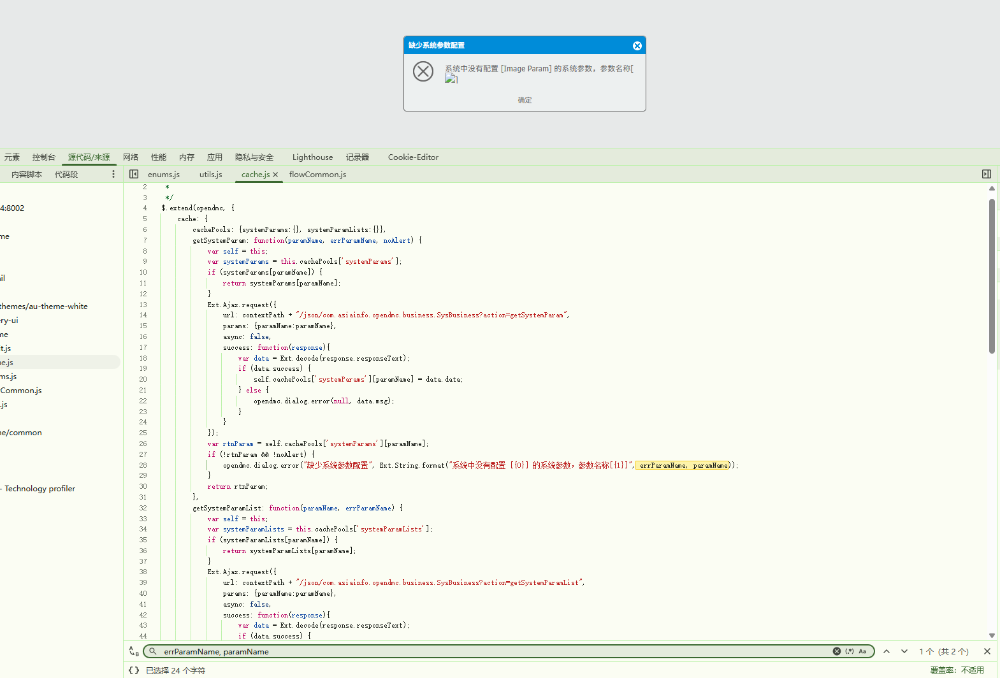
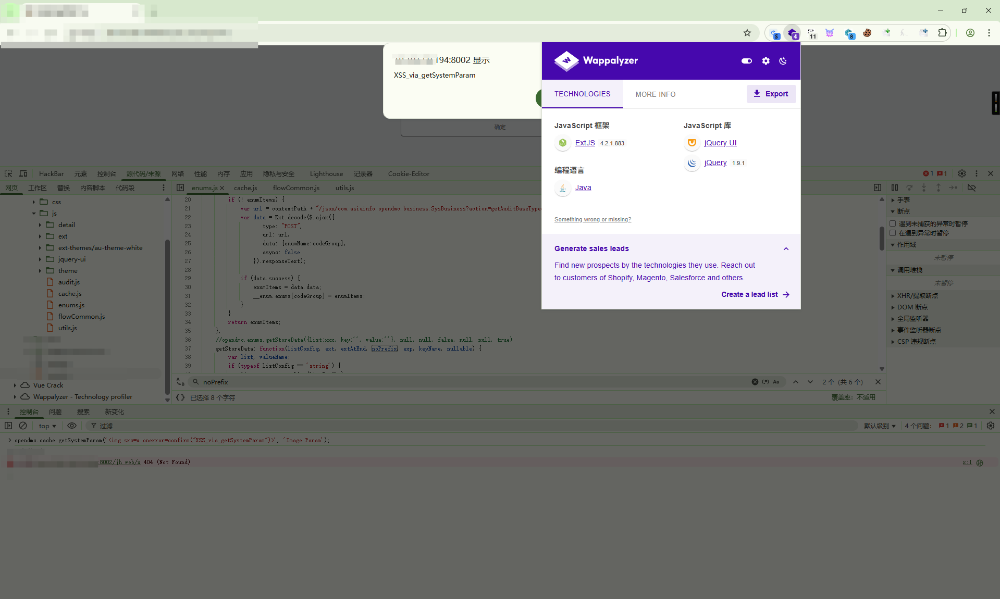
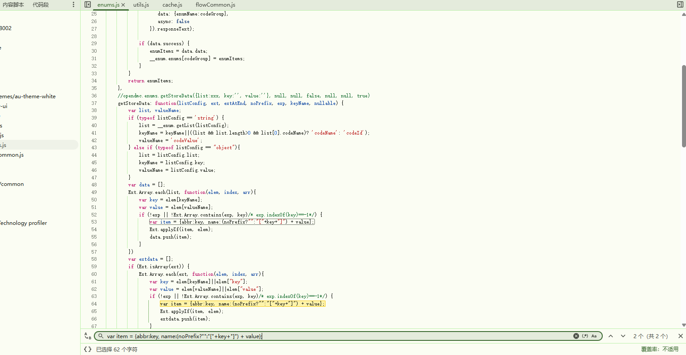
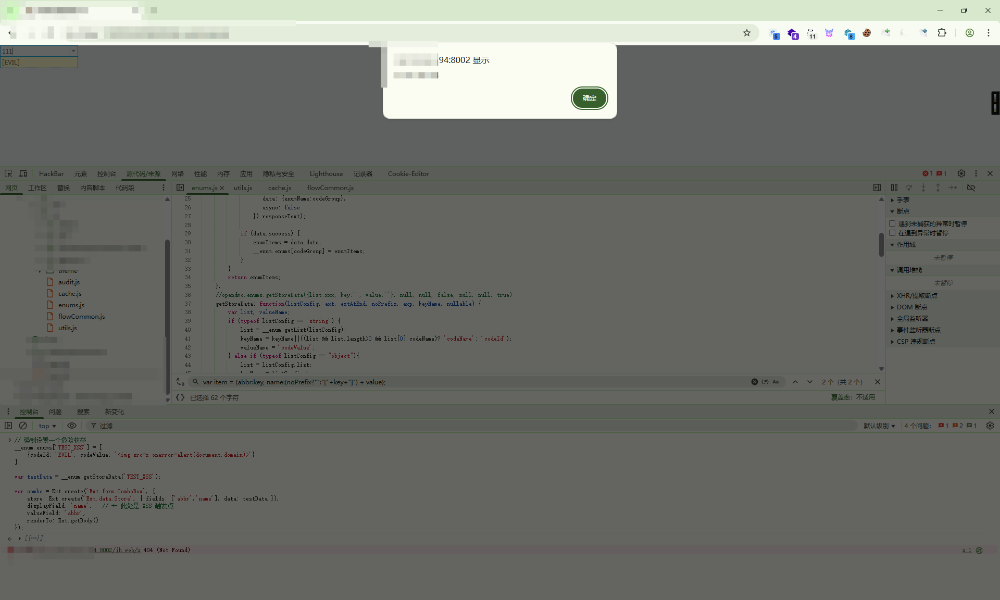
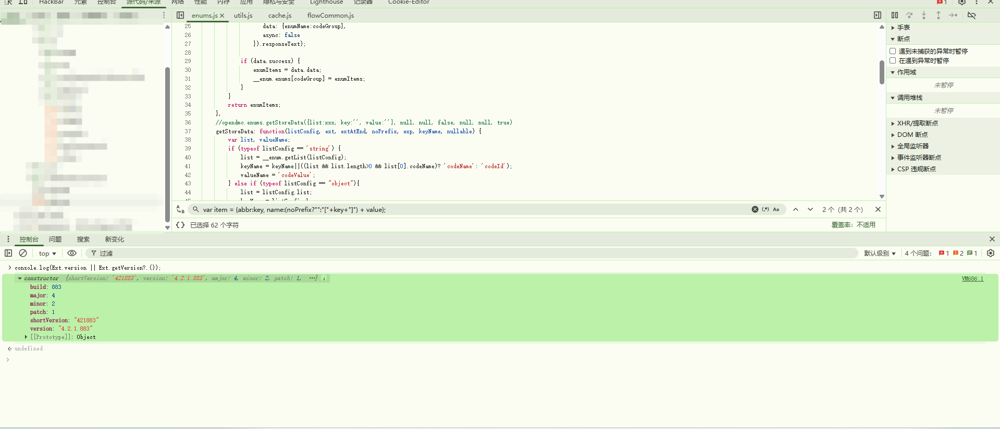

# 基于 ExtJS 框架下 XSS 漏洞分析挖掘-先知社区

> **来源**: https://xz.aliyun.com/news/18967  
> **文章ID**: 18967

---

### 声明

本文章所分享内容仅用于网络安全相关的技术讨论和学习，注意，切勿用于违法途径，所有渗透测试都需要获取授权，违者后果自行承担，与本文章及作者无关，请谨记守法。

## 概述

在某次渗透测试中，进入了一个很老的jsp系统中，发现使用了ExtJS 框架，就想打发时间分析审计js，成功发现了跨站脚本攻击（XSS）漏洞。其中：

* **POC 1** 通过滥用 `opendmc.cache.getSystemParam()` 接口，结合 `Ext.MessageBox` 渲染机制触发；
* **POC 2** 利用枚举模块 `__enum.getStoreData()` 将恶意内容注入 ComboBox 下拉框并自动执行。

这两个漏洞均依赖于 **ExtJS 4.2.x 版本默认支持 HTML 渲染组件的特性**，且暴露了系统在“输入校验”、“输出编码”和“权限控制”方面的多重缺失。本文会详细阐述两个 POC 的发现过程、触发原理及背后深层次的设计缺陷，并总结此类漏洞的通用挖掘方法论。

## 正文：漏洞发现全过程剖析

### 0X1、初始入口：审计 `opendmc.cache` 模块

#### 1. 初始分析：

在分析 `opendmc.cache.getSystemParam()` 函数时，注意到其行为模式存在显著风险特征：



* 使用 `Ext.String.format()` 拼接用户可控字符串；
* 调用 `opendmc.dialog.error()` → 实际调用 `Ext.MessageBox.show({msg: ...})`；
* 关键点：**ExtJS 4.2.x 默认允许 msg 字段解析 HTML**。

一个经典的 **UI 组件安全盲区**：开发者认为“弹窗只是文本提示”，但实际上框架底层默认开启了富文本渲染能力的。

#### 2. 构造如下 POC？

opendmc.cache.getSystemParam('', 'Image Param');

  
 为什么这个样构造(熟悉系统功能点后)：

|  |
| --- |
| paramName 和 errParamName 完全由调用者传入；若页面从 URL 获取参数并直接使用，即构成外部可控输入 |
| 若该参数名不存在，必然进入错误提示流程 → 触发 dialog.error() |
| Ext.MessageBox.msg 在 ExtJS < 4.2.3 中等价于 innerHTML 输出，支持 、<svg> 等自动执行标签 |
| onerror= 属于事件处理器，即使插入在双引号属性内也不影响解析（浏览器会自动匹配语法） |

✅ 因此，判断：**只要能控制任意一个参数名传入恶意字符串，即可在错误提示弹窗中实现 XSS 执行**。

​

### 0X2、深入分析：\_\_enum 枚举模块

#### 1. 发现阶段：数据绑定与 displayField 的致命结合

在审计 \_\_enum.getStoreData() 函数时，注意其返回结构用于构建 ExtJS 数据源：



常用于 ComboBox：displayField: 'name',valueField: 'abbr'

**ExtJS 的** **displayField** **默认以 HTML 方式渲染字段值**（尤其是下拉项列表），这意味着如果 name 包含 HTML 内容，它将被完整解析执行。

#### 2. 构造如下 POC？

```
// 强制设置一个危险枚举
__enum.enums['TEST_XSS'] = [
    {codeId: 'EVIL', codeValue: ''}
];

var testData = __enum.getStoreData('TEST_XSS');

var combo = Ext.create('Ext.form.ComboBox', {
    store: Ext.create('Ext.data.Store', { fields: ['abbr','name'], data: testData }),
    displayField: 'name',   // ← 此处是 XSS 触发点
    valueField: 'abbr',
    renderTo: Ext.getBody()
});
```

|  |
| --- |
| 系统允许手动录入 codeValue（如“状态描述”），而未做过滤 → 可写入恶意 HTML |
| \_\_enum.enums[codeGroup] 将数据缓存在内存中，刷新前一直有效 → 实现“一次注入、多次触发” |
| getStoreData() 自动拼接成 {name: "[EVIL]"} → 赋给 displayField 后被 ExtJS 当作 HTML 解析 |
| 只需打开下拉框（甚至 hover）， 即触发脚本 |



#### 3. ExtJS 数据绑定机制的本质风险

ExtJS 的设计理念是“数据驱动 UI”，但在 v4.x 时代为了灵活性牺牲了安全性：

* 组件不区分 “纯文本字段” 与 “HTML 字段”
* displayField, tpl, html 都统一处理为可能含 HTML 的内容
* 开发者常常忽略这一隐式行为，默认以为 text: "hello" 是安全的

即使原始数据来自 AJAX 请求，只要服务端没过滤，前端又不做转义，就等于开了“后门”。

​

### 0X3、关键前提条件验证：ExtJS 4.2.1 的历史性漏洞土壤

通过运行以下命令确认版本信息：

```
console.log(Ext.version || Ext.getVersion?.());
// 输出：{ version: "4.2.1.883" }
```

  
 通过查询官方文档和公开 CVE 记录可知：

ExtJS 4.2.x 版本的 MessageBox、ComboBox、GridCellRenderer 等组件**默认开启 HTML 内容渲染**，直到 4.2.3+ 才引入部分防护措施。

因此，在该版本下：

* 所有涉及“动态内容显示”的字段都应视为潜在 XSS 输出点；
* 必须显式转义才能保证安全；
* 而本系统的多个模块恰恰忽略了这一点。

2个漏洞共同点：

* 都依赖 ExtJS 旧版本的安全缺陷；
* 都利用了“前端组件自动渲染 HTML”的特性；
* 都规避了传统 DOM-based XSS 检测规则；
* 均属于 **XSS 攻击**，非 self-XSS，具备真实可利用性。

​

## 总结：挖掘此类漏洞的技巧与原理

### 1. **定位技巧**

|  |  |
| --- | --- |
| **方法** | **描述** |
| 查找“错误提示函数” | 如 dialog.error(), showMessage()，关注其是否接收动态参数 |
| 审计“数据转换函数” | 如 list2Map, getStoreData，看是否有字符串拼接用于 UI |
| 搜索关键词 | "format", "innerHTML", "Ext.create", "store", "displayField" |
| 关注同步 Ajax 调用 | async: false 的接口更可能被滥用（阻塞执行、便于构造） |

### 2. **结语**

本次发现的两个 XSS 漏洞虽形式不同，本质却相同：现代 Web 安全不仅是“防 script 标签”，更是“防任何动态内容进入可渲染上下文”。尤其在使用 ExtJS、Dojo 等重型前端框架的老系统中，组件级的 HTML 渲染能力是一把双刃剑。一旦缺乏安全治理，极易成为突破口。

建议所有类似系统立即开展三项工作：

1. 升级前端框架版本；
2. 全面清理历史数据中的恶意内容；
3. 建立“输入-处理-输出”全流程安全审查机制。

部分知识参考来源如下：

* <https://www.sencha.com/forum/showthread.php?263287-HTMl-in-ComboBox-displayField>
* <https://stackoverflow.com/questions/20897899/how-to-show-html-text-in-extjs-combobox>
* [https://docs.sencha.com/extjs/4.2.1/#%21/api/Ext.grid.column.Column-cfg-renderer](https://docs.sencha.com/extjs/4.2.1/#!/api/Ext.grid.column.Column-cfg-renderer)
* [https://docs.sencha.com/extjs/4.2.1/#%21/docs/api/Ext.MessageBox](https://docs.sencha.com/extjs/4.2.1/#!/docs/api/Ext.MessageBox)
* <https://portswigger.net/web-security/cross-site-scripting/dom-based>
* <https://owasp.org/www-project-client-side-security/>
