# 标准验证码渗透测试指南-先知社区

> **来源**: https://xz.aliyun.com/news/18969  
> **文章ID**: 18969

---

# 指南引言

验证码作为账号安全的 “第一道防线”，广泛应用于用户注册、登录验证、密码找回、等核心业务场景。然而，随着攻击技术的迭代，验证码环节的安全漏洞已成为攻击者突破账号体系的重要切入点 —— 从 “验证码明文出现在返回包” 导致的账号直接被盗，到 “短信轰炸” 引发的用户投诉与企业资源浪费，再到 “多步验证绕过” 造成的业务逻辑失控等等

验证码系统的安全性并非仅取决于图像的复杂性，更在于其整个生命周期的逻辑严谨性。渗透测试人员需要从生成、传递、验证、销毁等多个环节进行审视。本文将从初级到高级，逐步分解测试流程。如果大家有遇到其他类型的相关逻辑漏洞，欢迎大家补充。

本次共计使用了9个不同的验证码场景，大家有兴趣可以自行去复现。

# 验证码渗透测试基础理论

## 验证码生命周期

在总结验证码的漏洞之前，我们对验证码的生命周期做一个简单的分析，从而更清楚的了解每个不同的阶段可能产生的漏洞。

手机号验证码在网站中的生命周期（典型场景是登录、注册、找回密码等）一般包括以下几个阶段，其中验证阶段非必要发生：

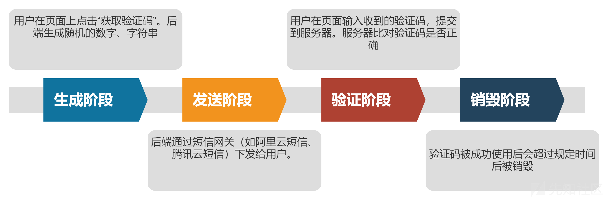

# 测试前期准备与工具集

**靶场环境：**本次使用靶场均来自于[**好靶场**]平台:[http://www.loveli.com.cn](http://www.loveli.com.cn:12531/)

**抓包分析工具：**Burp Suite

**自动化测试工具：**Python+Requests 库（编写验证码爆破、短信轰炸测试脚本的基础框架）

# 各生命周期测试方法与漏洞详解

## 生成阶段

生成规则通常是 4-8 位数字或字母（常见 6 位数字）。使用**随机数生成器**，并避免重复率过高并且和手机号、业务场景（注册/登录/修改密码等）**绑定**。

安全点：

**随机数生成器问题**：导致生成的验证码可以被猜解。可预测可以分为两种类型，一种是生成的验证码本身有规律、一种是生成验证码的随机数种子泄露。

### 验证码生成可预测

**测试方法：**

* 拦截触发验证码的请求（如点击“获取短信验证码”按钮）。
* 多次发送验证码检查其响应包（Response） 的验证验证码字段。
* 查看是否有规律可循。

**案例**：[http://www.loveli.com.cn/see\_bug\_one?id=78](http://www.loveli.com.cn:12531/see_bug_one?id=78)

登录界面如下

访问靶场


输入虚拟手机号码 18888888888 获取验证码

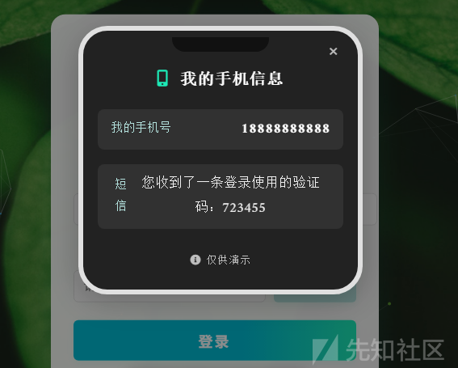

打开 Burp Suite、Fiddler 等抓包工具，确保代理设置正确（浏览器代理指向抓包工具端口，例：`127.0.0.1:8080`），拦截目标网站的 HTTP/HTTPS 请求。 多次发送验证码 多次获取验证码

发现获取到的验证码是**连续**的

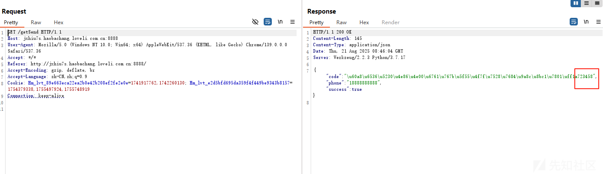

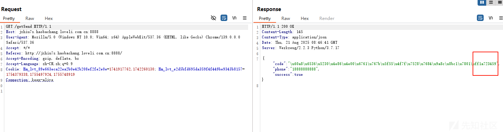

修改手机号为其他手机号 发送验证码，根据找到的规律输入验证码获取到flag

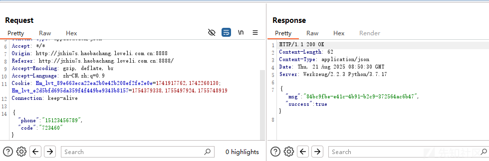

### 首次生成验证码一致

部分系统在生成验证码时依赖伪随机数算法，但未能正确初始化随机种子或使用具备足够熵源的随机数生成机制。这可能导致验证码在系统重启、会话重置或特定操作后，呈现可预测的序列模式。攻击者可通过收集有限数量的验证码样本，推断后续验证码的值，从而绕过验证机制。

**案例：**<http://www.loveli.com.cn/see_bug_one?id=79>

访问靶场


输入虚拟手机号 18888888888 通过“我的手机”获取到验证码


关闭靶场再从新开启靶场 输入其他手机号并点击获取验证码


输入之前获取到的验证码，点击登录获取到flag


### 随机数种子可预测或泄露

该漏洞是指用于初始化验证码生成算法的随机数种子（Seed） 本身是可预测的，或者会通过某种方式泄露给攻击者。伪随机数生成器的特性是：**如果两次使用的种子相同，那么它们产生的随机数序列也将完全相同。**

因此，一旦种子可被预测或泄露，攻击者就可以在本地使用相同的算法和种子，完整复现出整个验证码序列，从而实现对所有验证码的精确预测，彻底绕过验证码防护。

**案例：**<http://www.loveli.com.cn/see_bug_one?id=80>  
访问靶场


输入虚拟手机号 18888888888 获取验证码并“手机”上查看验证码

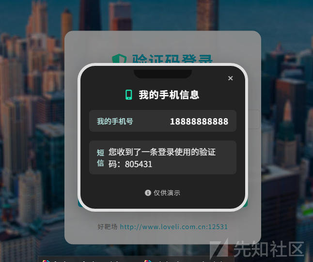

通过题目给的提示 编写python脚本 尝试生成验证码

关键函数如下

```
def generate_verification_codes(seed, count=1):
    # 设置随机种子
    random.seed(seed)

    # 生成指定数量的6位随机数字验证码
    codes = []
    for _ in range(count):
        code = ''.join([str(random.randint(0, 9)) for _ in range(6)])
        codes.append(code)

    return codes
```

发现生成的验证码与靶场生成的验证码不同


尝试连续生成50个验证码

代码如下

```
import random


def generate_verification_codes(seed, count=1):
    # 设置随机种子
    random.seed(seed)

    # 生成指定数量的6位随机数字验证码
    codes = []
    for _ in range(count):
        code = ''.join([str(random.randint(0, 9)) for _ in range(6)])
        codes.append(code)

    return codes


# 使用种子888888生成20个验证码
seed_value = 88888888
verification_codes = generate_verification_codes(seed_value, 50)

print(f"基于种子 {seed_value} 生成50个验证码:")
for i, code in enumerate(verification_codes, 1):
    print(f"{code}")
```

发现生成的验证码中包含了靶场生成的验证码

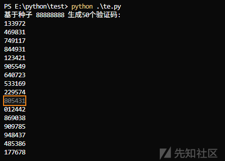

关闭再从新开启靶场，输入其他手机号并发送验证码


打开 Burp Suite、Fiddler 等抓包工具，确保代理设置正确（浏览器代理指向抓包工具端口，例：`127.0.0.1:8080`），拦截目标网站的 HTTP/HTTPS 请求。 随便输入验证码 抓取登录验证的请求包。

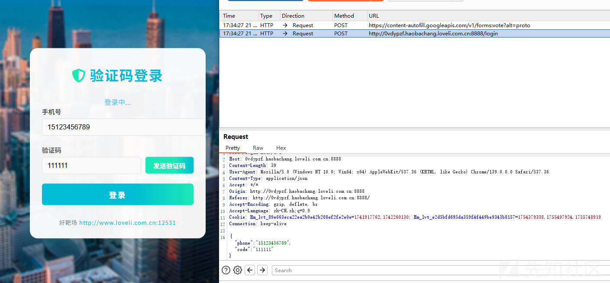

将该请求包发送到Burp的爆破模块并将之前通过脚本生成的50个验证码粘贴到字典中

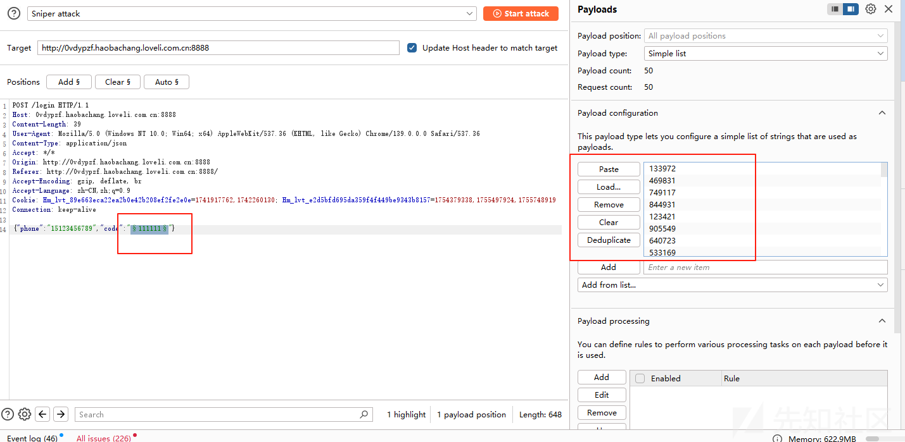

通过爆破完成登录 获取到flag

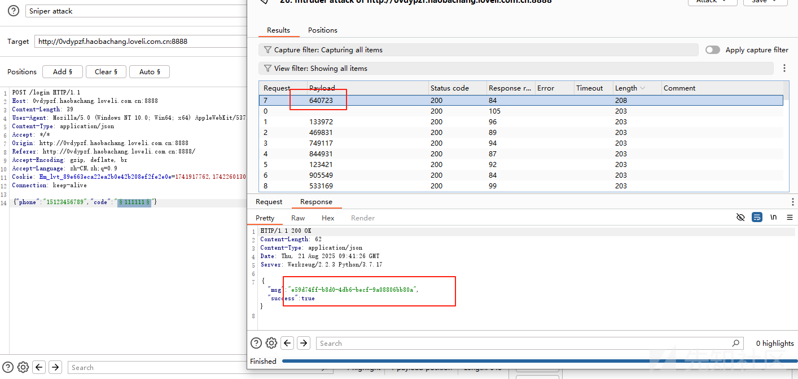

## 发送阶段

验证码发送阶段的核心风险在于其交付渠道的安全性与可靠性存在缺陷。该阶段是验证码离开服务器、抵达用户终端的关键环节，若设计不当，攻击者可在此拦截、窃取或滥用验证码，致使整个验证机制形同虚设。即使验证码本身极为复杂，发送过程的安全漏洞也足以让所有防护功亏一篑。

此阶段主要存在两类问题：一是**信息泄露**，即验证码明文在HTTP响应、错误信息中暴露，或因未使用HTTPS加密而在传输中被中间人截获；二是**逻辑缺陷**，表现为发送请求未与用户会话强绑定，导致攻击者可篡改接收目标进行恶意轰炸（DoS），或通过系统反馈枚举已注册用户账号，造成隐私泄露。

测试发送阶段时，安全人员应重点关注通信链路的**服务器响应内容**、**请求参数的可控性**以及**服务端的频率限制机制**。核心原则是验证系统能否确保验证码安全、准确且受控地送达至真实用户，而非任何可被攻击者操纵的端点。

### 短信验证码回显在数据包

该漏洞是一种极为低级但危害严重的逻辑缺陷。在某些系统的短信验证码发送流程中，服务端在处理完发送请求后，错误地将本次生成的验证码明文包含在后续返回给客户端的HTTP响应包中（常见于JSON数据或HTML源码内）。

这使得攻击者无需接收短信，仅通过拦截网络通信（如使用Burp Suite等代理工具）即可直接从服务器响应中读取到验证码内容。该漏洞完全绕过了短信传输通道的安全假设，使验证码的“知识因子”（Something you know）保护失效。

**案例：**<http://www.loveli.com.cn/see_bug_one?id=64>

首先访问靶场


有手机号错误检查提示


打开 Burp Suite、Fiddler 等抓包工具，确保代理设置正确（浏览器代理指向抓包工具端口，例：`127.0.0.1:8080`），拦截目标网站的 HTTP/HTTPS 请求。

发送验证码，并且获取数据包

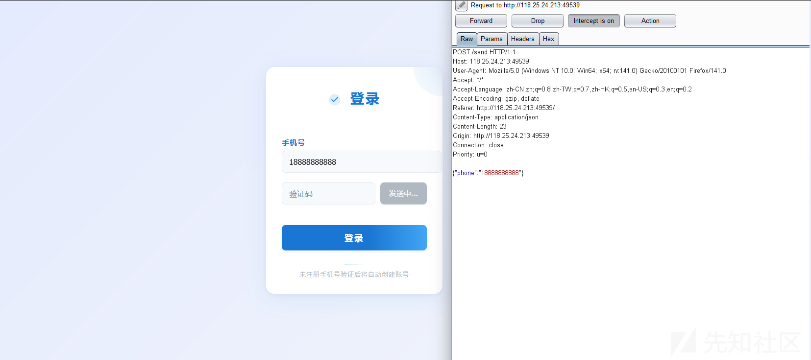

发现验证码在返回包里

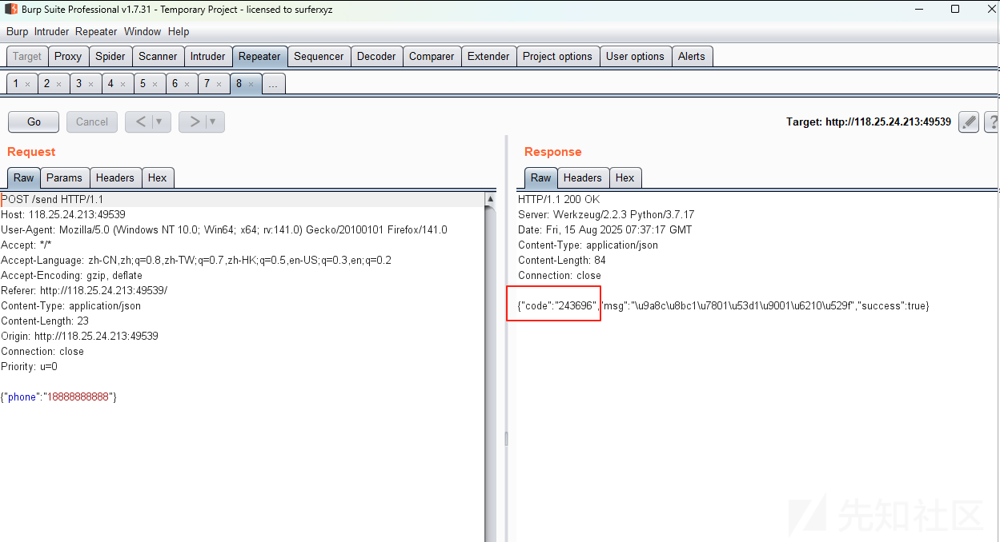

返回靶场的登录 / 验证页面，在验证码输入框中填入从响应包中获取的验证码 ，获取到Flag


### 单手机号信息轰炸

短信轰炸漏洞是一种常见的业务逻辑缺陷，源于系统对验证码发送请求的频率缺乏有效限制。攻击者可以利用此漏洞，在短时间内向特定目标手机号连续、大量地发送短信验证码请求。

其核心成因是服务端未对同一手机号、同一IP或同一会话在单位时间内的请求次数进行严格限制，或者虽然存在限制但阈值设置得过高，且未引入有效的二次验证（如图形验证码）来拦截自动化脚本攻击。

**案例：**<http://www.loveli.com.cn/see_bug_one?id=75>

访问靶场

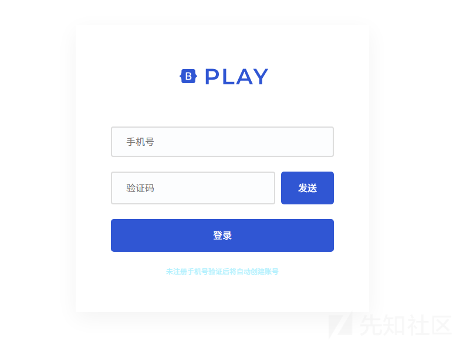

输入任意手机号 点击验证码发送 打开 Burp Suite、Fiddler 等抓包工具，确保代理设置正确（浏览器代理指向抓包工具端口，例：`127.0.0.1:8080`），拦截目标网站的 HTTP/HTTPS 请求。

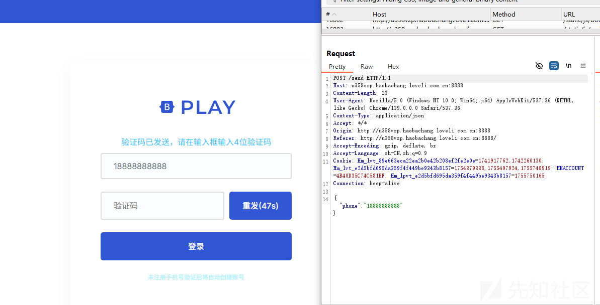

短信轰炸有两种方式：针对单个手机号的轰炸、针对多个手机号的轰炸，此处为前者。将此请求包放到爆破模块

不修改请求包的参数内容，多次重放此请求包，完成针对单个手机号的轰炸，获取到flag

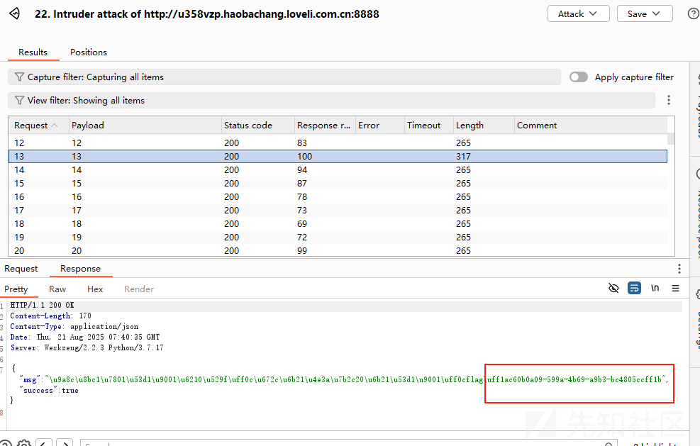

### 批量手机号短信轰炸

批量手机号短信轰炸是“单手机号轰炸”漏洞的一个变种，其攻击模式和目标有所不同。该漏洞源于**系统缺乏对全局范围内短信发送总量和频率的监控与限制。**

攻击者利用此漏洞，并非针对单一手机号，而是使用自动化工具遍历一个庞大的手机号列表，向列表中的每个号码发送1至2条验证码短信。由于每个号码接收的短信数量极少，因此难以触发基于“单手机号”的频率告警机制，但聚合总量极大，从而实现对短信服务的资源消耗型拒绝服务攻击。

**案例：**<http://www.loveli.com.cn/see_bug_one?id=76>

访问靶场


输入随机手机号，点击发送验证码打开 Burp Suite、Fiddler 等抓包工具，确保代理设置正确（浏览器代理指向抓包工具端口，例：`127.0.0.1:8080`），拦截目标网站的 HTTP/HTTPS 请求。

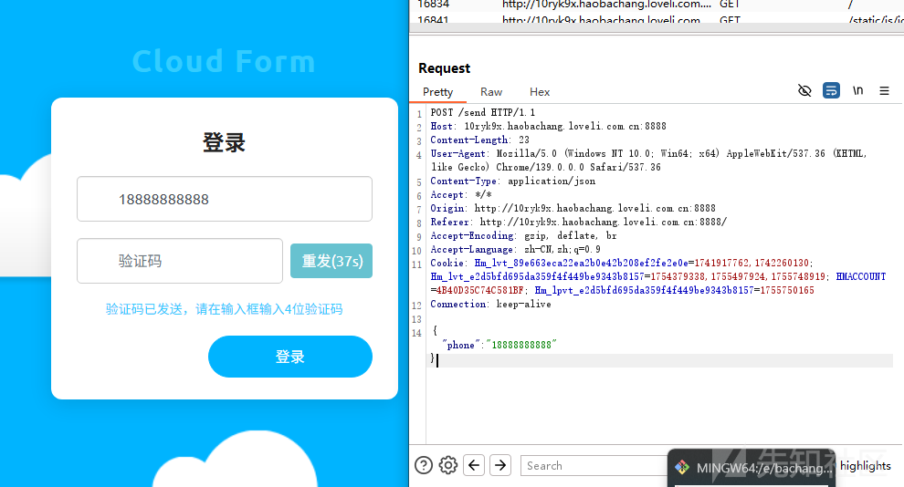

将请求包发到Brup的爆破模块，将手机号设置为爆破的payload

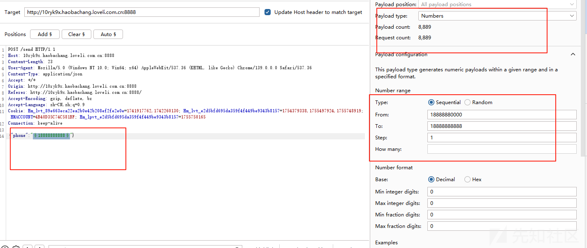

通过爆破获取到flag

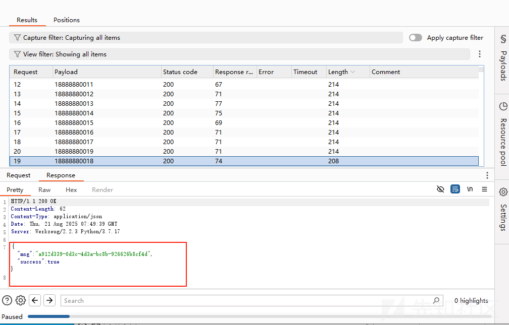

## 验证阶段

验证阶段是验证码防御机制的最终关卡，其最致命的漏洞在于服务端校验逻辑存在缺陷或被完全绕过。例如，系统可能在客户端通过JavaScript进行校验，而服务器端未进行二次验证；或者提交数据包中存在某个参数可直接控制校验结果。攻击者通过修改提交包，即可在不知晓验证码的情况下直接宣告验证成功，使得整个验证流程形同虚设。  
 此阶段的另一类关键问题是验证码生命周期管理不当。主要表现为：验证码在首次使用后未及时在服务端作废（失效），导致其可被重复使用（重放攻击）；或者验证码长期有效，无时间戳约束，给攻击者留下了充足的暴力破解时间。此外，验证码与当前用户会话绑定不牢也至关重要，攻击者可窃取他人的验证码用于自己的会话中进行提交，导致验证码被劫持。  
 测试验证阶段时，安全人员应聚焦于重放攻击（拦截数据包重复提交）、暴力破解（测试验证码位数与锁定机制）、参数篡改（尝试直接修改返回状态或校验参数）以及会话关联性（尝试将他人的验证码用于自身会话）等测试点。总之，一个安全的验证阶段必须确保：校验在服务端完成、每个验证码仅能使用一次且在短时间内过期、验证码与发起请求的用户身份严格绑定。’

**我们用三个案例来说明此阶段的问题。**

### **前端验证码校验可被绕过（修改返回包）**

这是一种典型的“信任客户端”安全反模式漏洞。其核心成因在于：服务端将验证码校验结果的判断逻辑完全交由客户端（浏览器）处理。

攻击者通过代理工具（如Burp Suite）拦截服务器的响应包，将其中的失败状态手动修改为成功状态，然后放行该响应包。客户的浏览器JavaScript代码会信以为真，执行后续的成功逻辑，从而实现了验证码的绕过。

案例：<http://www.loveli.com.cn/see_bug_one?id=69>

访问目标网站，尝试登录提示均为用户或密码错误无法获取有效信息

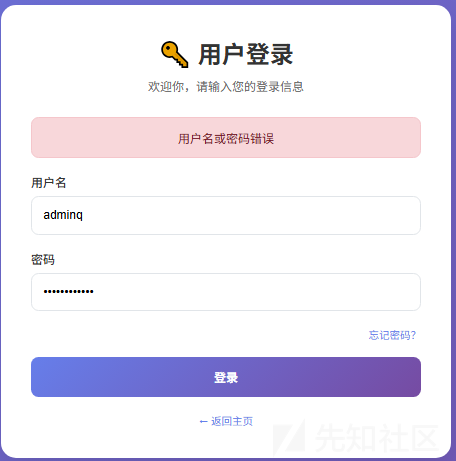

点击忘记密码 随便输入用户名点击发送验证码无响应


按下`F12`键打开浏览器开发者工具，切换至 “网络（Network）” 面板，查看网络请求

输入用户名时会检查用户是否存在

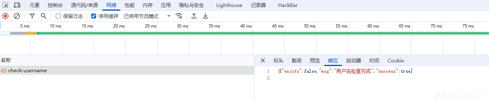

乱输入邮箱验证码后点击验证会 提示 找不到该用户信息

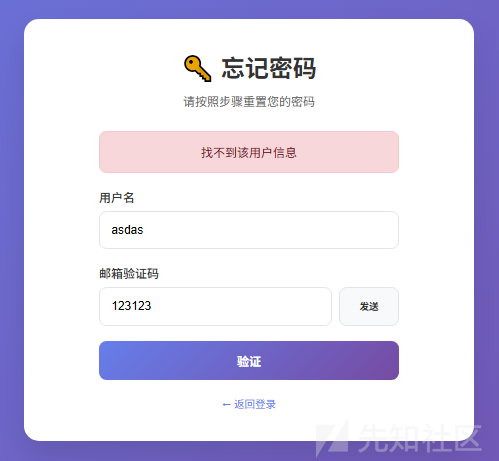

打开 Burp Suite、Fiddler 等抓包工具，确保代理设置正确（浏览器代理指向抓包工具端口，例：`127.0.0.1:8080`），拦截目标网站的 HTTP/HTTPS 请求。

再次点击验证，抓取请求包

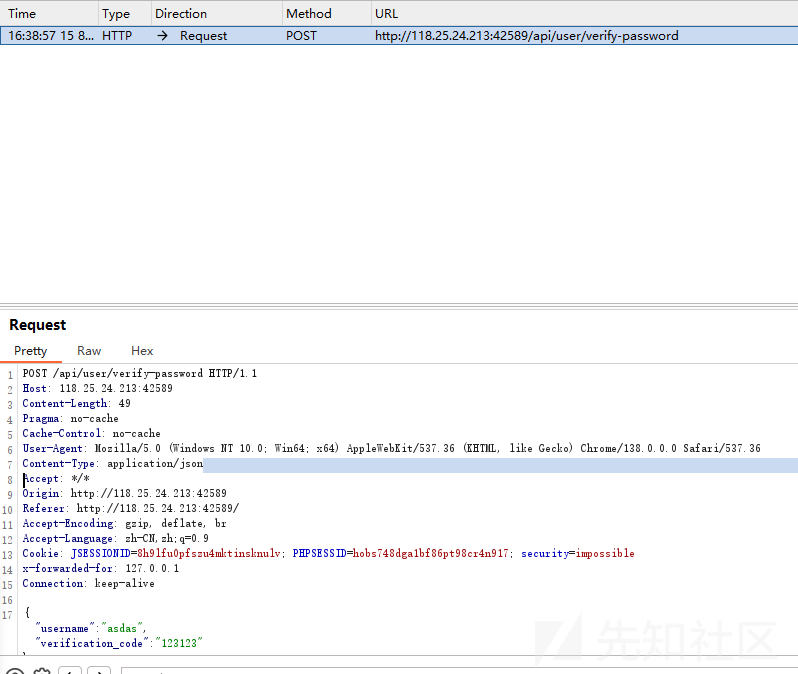

使用Burp Suite的爆破模块

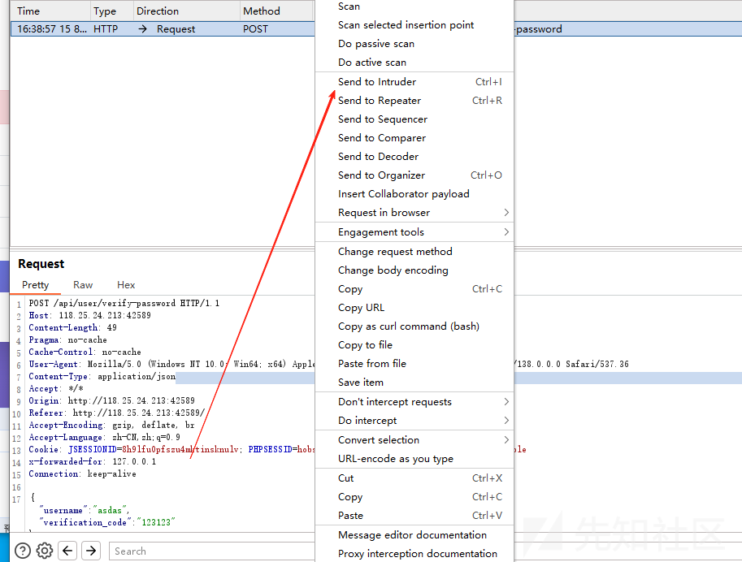

通过爆破用户名爆破出用户 admin

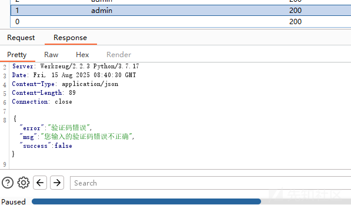

继续开启Burp Suite抓包 输入用户名admin 乱输入验证码 通过Burp Suite 修改响应中的success参数为 “ture”绕过短信验证。

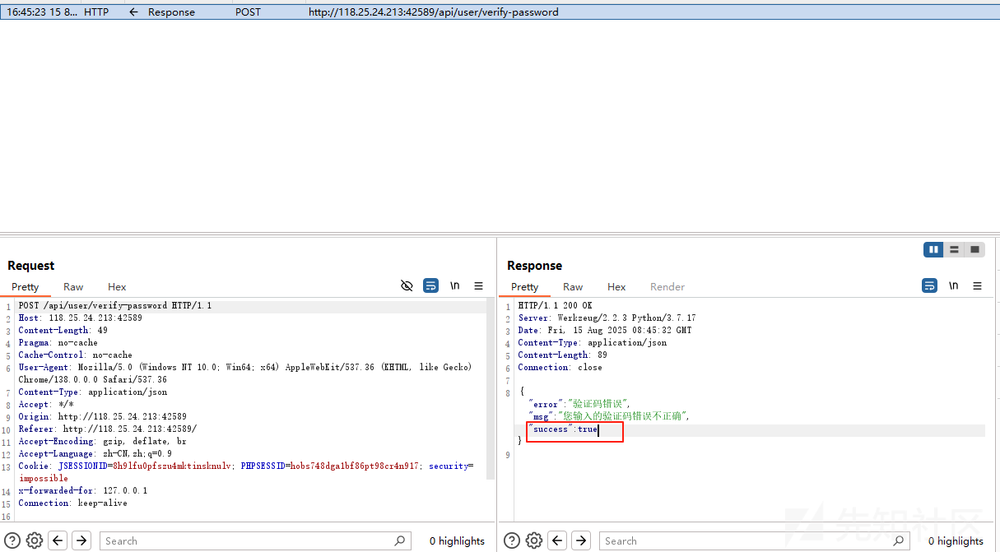


输入新密码成功修改admin的密码


回到登录界面尝试登录 获取到flag

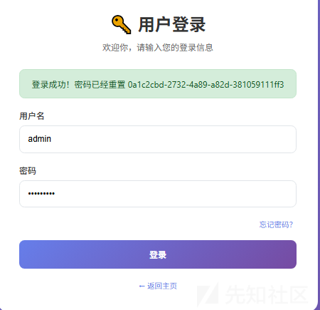

### 验证码暴力破解

验证码暴力破解漏洞是指由于系统未对验证码的提交校验次数实施有效限制，攻击者可以通过自动化工具系统地、频繁地尝试所有可能的验证码组合，直到猜中正确的验证码。

**案例：**<http://www.loveli.com.cn/see_bug_one?id=74>

访问靶场


输入任意手机号点点击发送验证码

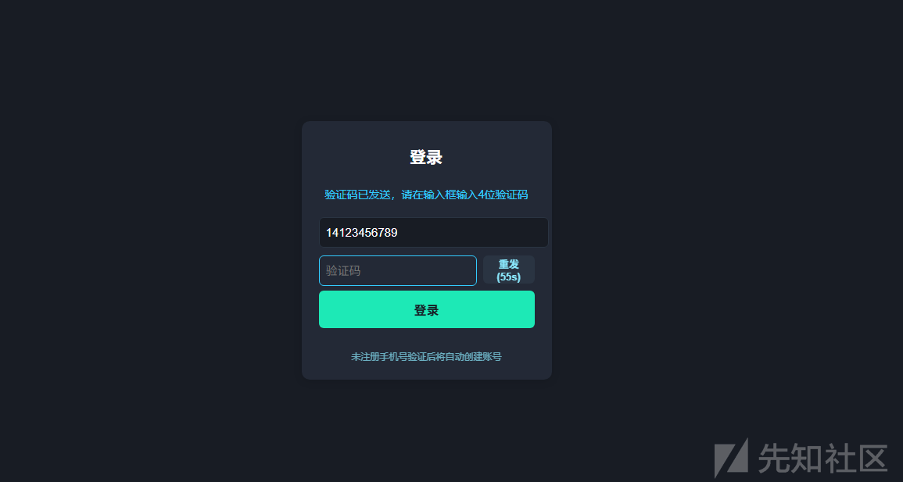

发现验证码为4位，输入任意验证码使用 Burp Suite、Fiddler 等抓包工具，确保代理设置正确（浏览器代理指向抓包工具端口，例：`127.0.0.1:8080`），拦截目标网站的 HTTP/HTTPS 请求。

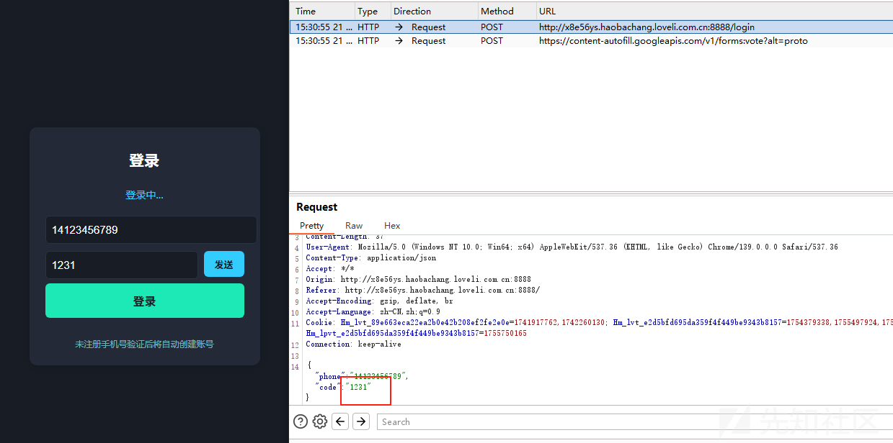

使用Burp的爆破模块，设置验证码位数字从0001到9999

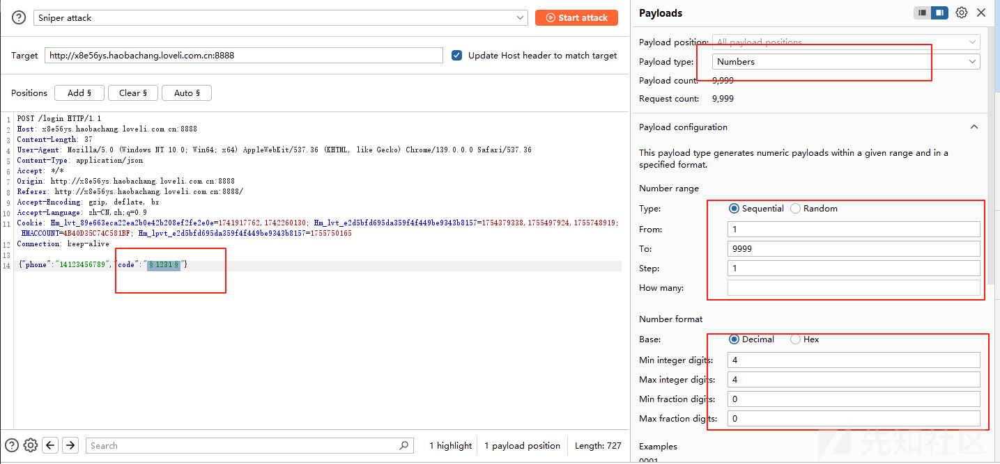成功爆破出验证码并获取到flag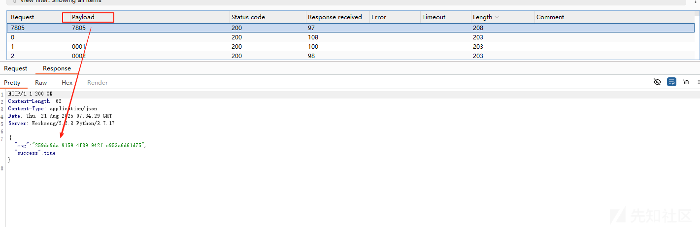

### 验证码混用（会话关联性）

验证码复用漏洞是一种严重的逻辑缺陷，指系统服务端在验证某个验证码成功后，未能立即将其标记为“已使用”并使其失效。这导致攻击者可以通过拦截并重复提交同一个正确的验证码（即“重放攻击”），来多次通过身份验证。

一个安全的验证码机制必须是“一次一验”的。该漏洞的根源在于服务器仅校验了验证码的“正确性”，却忽略了其“一次性”这一核心安全属性。攻击者一旦通过正常方式或暴力破解等手段获取到一个有效的验证码，就可以在该码的有效期内无限次使用，极大地降低了攻击难度。

**案例：**<http://www.loveli.com.cn/see_bug_one?id=77>

访问靶场


点击右上角”我的手机“获取虚拟账号"1888888888”,将此手机号输入到登录框中


查看虚拟手机号获取到的验证码

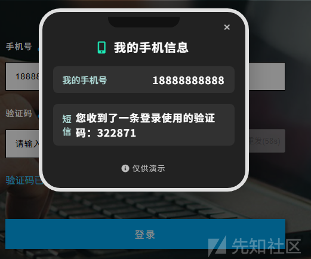

修改手机号为其他手机号，使用此验证码尝试登录，获取到flag


# 总结

验证码渗透测试的本质，是一场针对“身份确认”这一核心环节的攻防思维演练；本指南系统剖析了验证码在生成、发送、验证全生命周期中的常见漏洞，旨在说明其安全性绝非仅依赖于视觉复杂度，而更取决于整体实现逻辑的严谨性与健壮性；因此，构建有效的防护体系必须超越单个漏洞的修补，转而遵循“永不信任客户端”的核心安全哲学，在服务器端实施严格的校验与状态管理，并辅以频率限制、一次性原则等多层次控制措施，方能将验证码从易攻的“形式主义”转化为可靠的安全壁垒。
