# 深入分析调试CVE-2024-30090-ks.sys内核流服务权限提升漏洞-先知社区

> **来源**: https://xz.aliyun.com/news/18977  
> **文章ID**: 18977

---

# 0x00 漏洞信息

1. 漏洞编号：CVE-2024-30090

2. 漏洞介绍：该漏洞是典型的内核竞争条件漏洞，其利用链揭示了Windows 权限验证机制在流媒体服务中的深层缺陷。漏洞位于 Windows 内核流媒体服务（Kernel Streaming）的 ks.sys 驱动程序中，负责处理设备（如摄像头、麦克风）的数据流属性请求。攻击者通过构造恶意 KSEVENTDATA 结构体，利用上述流程实现任意 IOCTL 调用（Arbitrary IOCTL Primitive）。该原语允许以内核权限执行本应受限的操作（如修改进程权限标志）。

# 0x01 基本概念

ks.sys 是 Windows 操作系统中的一个核心驱动程序，它属于 Kernel Streaming (KS) 子系统。Kernel Streaming 提供了一种在内核级别处理多媒体流数据的方法，使得应用程序能够高效地访问音频和视频硬件。这个驱动程序对于多媒体功能的正常运行非常重要，因为它允许操作系统与声卡、摄像头等设备进行通信。

## 1、ks.sys 的功能

实时媒体流处理：它支持实时传输和处理音频和视频流。

低延迟：通过直接在内核级别操作，它可以提供较低的延迟，这对于游戏、视频会议和其他需要即时反馈的应用来说至关重要。

资源管理：ks.sys 也参与了多媒体设备资源的管理和分配。

## 2、ks.sys 的问题

如果 ks.sys 出现问题，可能会导致以下几种情况：

音频或视频播放异常。

系统蓝屏（Blue Screen of Death, BSOD）。

多媒体相关设备无法正常工作。

## 3、目的

ks.sys 的主要目的是为了提供一个高性能的接口来处理音频和视频流，使得这些流能够以尽可能低的延迟和最小的 CPU 使用率进行传输。这对于需要高精度时间同步的应用程序来说非常重要，比如数字音频工作站（DAWs）、专业视频编辑软件以及游戏等。

## 4、条件竞争

条件竞争漏洞（Race condition）官方概念是“发生在多个线程同时访问同一个共享代码、变量、文件等没有进行锁操作或者同步操作的场景中。

## 5、CPU Affinity（CPU 亲和性）

CPU Affinity提高了条件竞争的成功率，在多核的处理器下，可以将不同的线程绑定在不同的核上，使得线程进程不会进行来回切换的操作，提高执行效率。例如有两个线程，可以把线程1绑定在CPU 0上运行，线程2绑定在CPU 1上，那么使得线程1与线程2可以并行运行，那么触发漏洞的可能性会大大提升。

## 6、ks事件

事件集是由可供侦听器请求通知的相关事件组成的组。例如，监听器可以注册以收到设备状态更改的通知，或流位置的更改。当事件发生时，内核流处理会通知所有已注册该事件的客户端。

微型驱动程序通过提供一个包含处理例程指针的KSEVENT\_ITEM 结构来描述它们如何支持事件。

侦听器通过调用内核流代理例程KsSynchronousDeviceControl，使用 IOCTL\_KS\_ENABLE\_EVENT 控制代码以及指向 KSEVENT 和 KSEVENTDATA 结构的指针来注册通知。

# 0x02 工具&&环境

1. 调试工具：IDA pro x64 windbg x64

2. 目标机：Windows 11 23H2 build 10.0.22621.3672

3. 目标模块：ks.sys ksthunk.sys

4. 配置好双机调试模式

# 0x03 利用代码

利用代码分为两部分，Parent部分使用64位编译，为了获取nt!SeDebugPrivilege 在内核中的虚拟地址，Child部分用来实现漏洞核心利用。

## Parent部分

### 1、GetKernelBase函数

该函数用于动态获取 Windows 内核模块 ntoskrnl.exe 在内存中的基地址。ntoskrnl.exe 是 Windows 操作系统的核心内核模块，包含系统关键功能（如进程管理、内存调度等）。获取其基地址是内核级开发（如驱动开发、安全研究、漏洞利用）的基础步骤，常用于计算函数偏移、实现内核 Hook 或绕过安全机制。

（1）获取系统模块信息所需缓冲区大小

目的：通过 NtQuerySystemInformation 查询系统模块信息列表（SystemModuleInformation）所需缓冲区大小。

原理：首次调用时传入空指针和长度 0，函数返回 STATUS\_INFO\_LENGTH\_MISMATCH，并通过 &dwSize 返回实际所需缓冲区大小。

（2）分配内存并获取完整模块列表

关键结构体：PSYSTEM\_MODULE\_INFORMATION 包含模块基址、大小、路径等信息（定义见）。

内存管理：根据 dwSize 动态分配缓冲区，再次调用 NtQuerySystemInformation 填充模块数据。

（3）遍历模块列表定位 ntoskrnl.exe

遍历逻辑：循环检查每个模块的 Name 字段（如 \SystemRoot\system32\
toskrnl.exe），匹配目标模块名。

返回基址：匹配成功后返回 ImageBaseAddress（即基址），并释放缓冲区。

错误处理：若未找到目标模块，调用 error() 终止程序。

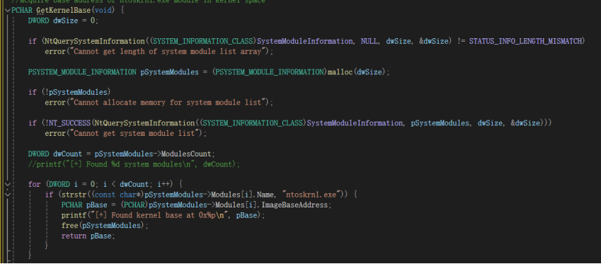

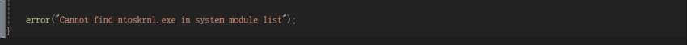

### 2、将获取到的地址通过命令行参数的形式传递给Child进程，然后等待子进程执行。

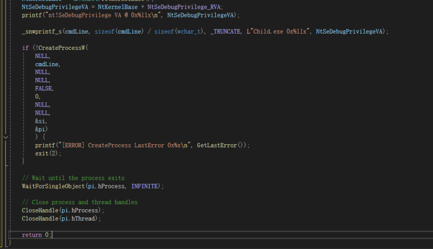

## Child部分

下面来分析Child部分

整体流程

（1）通过Parent部分传过来的基址，放到变量中

（2）检测核数是否大于等于2

目的：竞争条件要求两个线程严格并行执行，主线程触发内核事件处理逻辑，辅助线程在极短时间内篡改全局标志位，单核处理器无法实现真正的并行，线程切换由操作系统调度，竞争窗口极短且不可控，成功率趋近于零。

（3）然后进到核心利用模块ExploitIoctlKsEnableEvent

（4）最后创建系统权限的cmd进程spwan\_cmd\_system

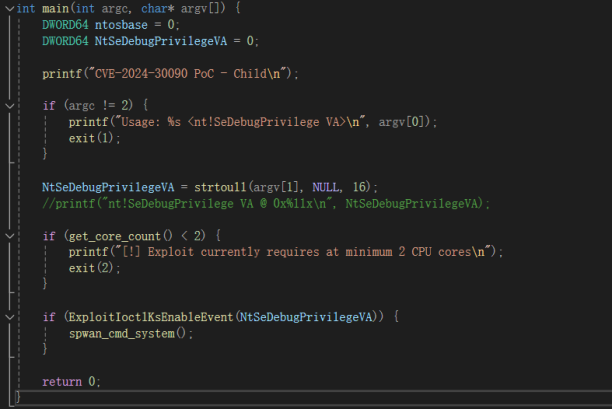

### 1、ExploitIoctlKsEnableEvent函数

函数目的：通过操纵内核时钟驱动（KSCATEGORY\_CLOCK）的事件处理机制，利用竞争条件（Race Condition）漏洞篡改内核工作项对象（KsWorkerObject）指针，最终实现任意内核地址写入或执行目标地址（target\_addr）的代码，完成权限提升或内核控制。

（1）初始化关键数据结构

指定事件类型为KSEVENT\_CLOCK\_INTERVAL\_MARK，触发时钟驱动的周期性事件处理逻辑。

设置KsWorkerObject 为 target\_addr - 0x5C，覆盖内核工作项结构中的回调函数指针（通常位于 KSWORKITEM 结构偏移 0x5C 处）。

（2）绑定CPU核心并启动干扰线程

CPU绑定：确保主线程在固定核心运行，减少调度干扰。

干扰线程（flip\_thread）：高频翻转 g\_ksevent.Flags（如 KSEVENT\_TYPE\_ENABLE 和 KSEVENT\_TYPE\_QUERYBUFFER），破坏内核事件处理的状态一致性，制造竞争窗口。

（3）主循环（3次尝试）

A. 打开设备并启动：激活时钟驱动的内部事件处理流程。

B. 发送恶意IOCTL请求：

缓冲区溢出：输入缓冲区长度sizeof(KSEVENT) + 0x100 超过实际结构大小，可能触发内核越界写入。

竞争条件：flip\_thread 高频修改 Flags，干扰内核解析 IOCTL\_KS\_ENABLE\_EVENT 时的逻辑分支，绕过安全检查。

C. 成功条件：

若DeviceIoControl 返回成功，说明竞争窗口命中，内核错误地将用户态 g\_eventData 作为工作项处理。

后续Sleep(1500) 等待内核调度篡改后的工作项，执行 target\_addr 处的代码。

（4）清理与重试

每次尝试后重置设备状态，避免残留状态影响后续攻击。

3次尝试机制提升稳定性（竞争条件成功率依赖硬件时序）。

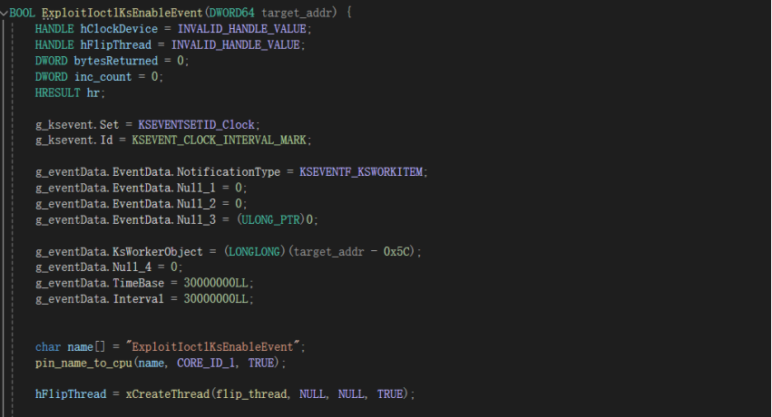

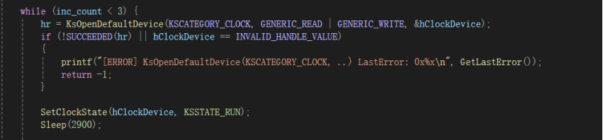

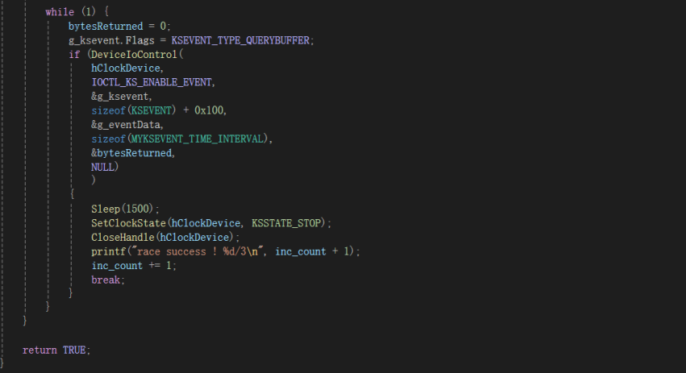

### 2、pin\_name\_to\_cpu函数

核心功能是将当前线程绑定到指定的CPU 核心，确保线程仅在目标核心上运行。

（1）GetCurrentThread获取当前线程句柄

调用Windows API 获取当前线程的句柄，用于后续设置亲和性。

（2）生成CPU 亲和性掩码

通过位运算生成掩码，例如cpuid=0 对应掩码 0x01（绑定到 CPU 0），cpuid=1 对应 0x02（绑定到 CPU 1），以此类推。

（3）设置线程亲和性

调用SetThreadAffinityMask 将线程绑定到目标核心：

成功时返回原亲和性掩码（非零值）。

失败时返回0，触发错误处理。

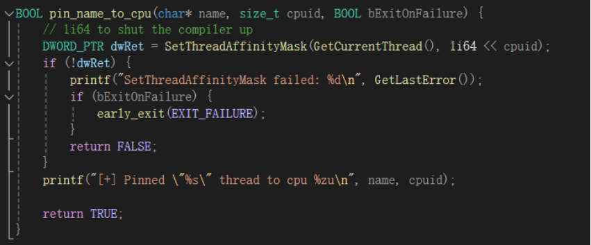

### 3、xCreateThread 函数

是对Windows API CreateThread 的封装，旨在简化线程创建流程并增强错误处理机制。

（1）调用CreateThread 创建线程

func：线程函数地址，需强制转换为 LPTHREAD\_START\_ROUTINE 类型（符合 Windows 线程函数原型 DWORD WINAPI ThreadProc(LPVOID)）。

lpParam：用户自定义参数，线程函数可通过 LPVOID 接收该参数。

pThreadId：输出参数，用于返回新线程的 ID（若为 NULL 则不返回）。

（2）检查线程创建结果

若CreateThread 返回 INVALID\_HANDLE\_VALUE，打印错误信息。

根据bExitOnFailure 参数决定是否调用 early\_exit 终止程序，成功则返回线程句柄

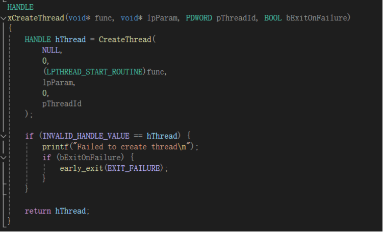

### 4、触发

该代码段是一个嵌套循环结构，旨在通过重复操作内核时钟设备触发竞争条件漏洞，实现内核地址篡改或权限提升。

（1）外层循环：保证成功3次（inc\_count < 3），为什么是三次，后面会解释......

A. 打开时钟设备

调用 KsOpenDefaultDevice 打开默认时钟设备（类别 KSCATEGORY\_CLOCK），获取句柄 hClockDevice。

失败时打印错误并退出（return -1）。

B. 启动设备并等待

SetClockState(hClockDevice, KSSTATE\_RUN)：将设备状态设为运行（KSSTATE\_RUN），激活内核事件处理逻辑。

Sleep(2900)：等待设备稳定进入运行状态，为后续竞争窗口做准备。

（2）内层循环：竞争条件触发（while (1)）

设置事件标志位

A. g\_ksevent.Flags = KSEVENT\_TYPE\_QUERYBUFFER：标记事件类型为“查询缓冲区”，干扰内核状态机。

B. 发送恶意 IOCTL 请求

通过 DeviceIoControl 发送 IOCTL\_KS\_ENABLE\_EVENT 控制码：

输入缓冲区溢出：长度 sizeof(KSEVENT) + 0x100 故意超出结构大小，可能触发内核越界写入。

目标地址注入：输出缓冲区 g\_eventData 包含篡改后的回调指针（如 KsWorkerObject = target\_addr - 0x5C）。

C. 成功处理

若 DeviceIoControl 返回成功（竞争窗口命中）：

Sleep(1500)：等待内核调度篡改后的工作项（如执行目标地址代码）。

SetClockState(..., KSSTATE\_STOP)：停止设备，重置状态。

CloseHandle(hClockDevice)：释放资源。

打印 race success 并递增计数器 inc\_count，跳出内层循环。

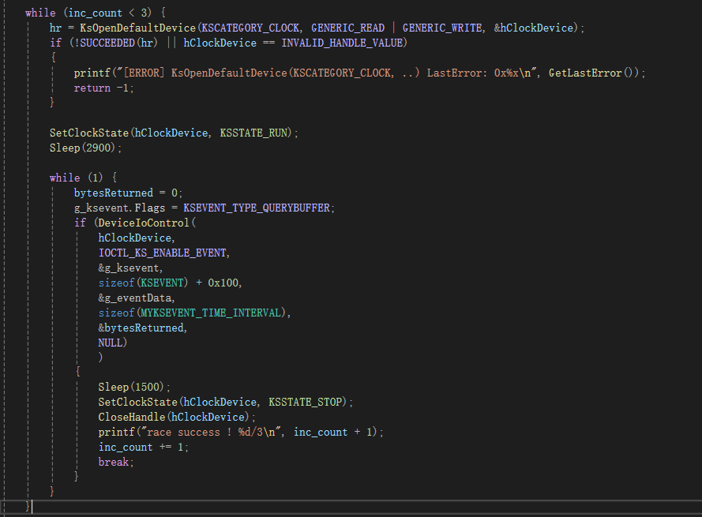

### 5、spwan\_cmd\_system

通过打开winlogon进程，去创建高权限cmd进程

（1）获取winlogon.exe 的进程ID（PID）

调用GetProcessIDByName(L"winlogon.exe") 通过进程名查找PID。

若失败（返回0），打印错误并退出（返回 1）。

目的：定位关键系统进程winlogon.exe（负责登录界面和安全桌面，通常以 SYSTEM 权限运行）。

（2）打开进程句柄

通过 OpenProcess(PROCESS\_CREATE\_PROCESS, FALSE, winlogonPID) 获取进程句柄。

PROCESS\_CREATE\_PROCESS 权限允许以目标进程为父进程创建新进程。

若失败（返回 NULL），打印错误并退出（返回 1）。

目的：获取对 winlogon.exe 的控制权，为后续进程创建做准备。

（3）创建新进程

调用 CreateProcessFromHandle(hProcess)（非Windows标准API，应为自定义函数）。

推测功能：以 winlogon.exe 为父进程启动新进程（如 cmd.exe），新进程将继承 SYSTEM 权限。

目的：实现权限提升（LPE），使新进程获得系统最高权限。

（4）清理资源

·CloseHandle(hProcess) 释放进程句柄。

·返回 0 表示成功。

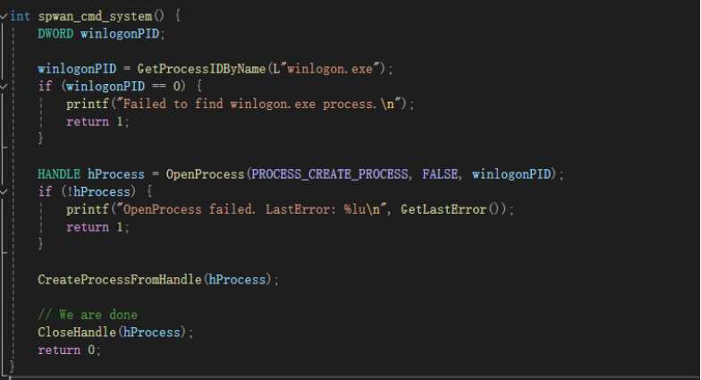

### 6、GetProcessIDByName函数

核心功能：通过进程名称（如notepad.exe）获取其对应的进程 ID（PID）。

（1）创建系统进程快照

作用：获取当前系统中所有进程的静态快照。

（2）初始化进程信息结构体

（3） 遍历进程快照

Process32First：获取快照中第一个进程信息。

Process32Next：循环获取后续进程信息，直到遍历完成。

（4）进程名匹配

匹配成功：

关闭快照句柄（避免资源泄露）。

返回目标进程的 PID。

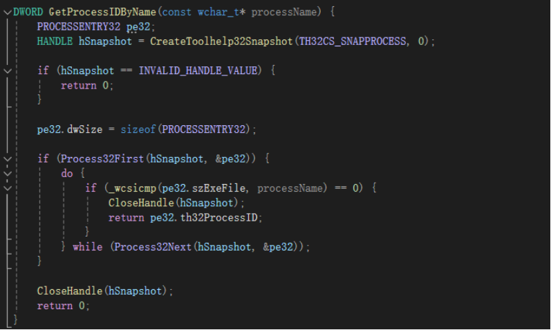

### 7、CreateProcessFromHandle函数

核心功能：通过传入的进程句柄 hProcess，创建一个新的 cmd.exe 进程，并将其父进程伪装为 hProcess 指向的进程。

（1）初始化启动信息结构体

（2） 动态分配并初始化进程属性列表

作用：初始化进程属性列表，为后续指定父进程做准备。

动态分配机制：

首次调用 InitializeProcThreadAttributeList 时传入 NULL，函数返回所需缓冲区大小 size。

根据 size 分配堆内存，并重新初始化属性列表。

（3）设置父进程属性

关键参数：

PROC\_THREAD\_ATTRIBUTE\_PARENT\_PROCESS：属性类型，表示新进程的父进程。

lpValue：指向传入的 hProcess 句柄的指针。

作用：将新进程的父进程强制设置为 hProcess 指向的进程（而非调用者进程）。

（4）创建新进程

关键标志：

EXTENDED\_STARTUPINFO\_PRESENT：启用扩展启动信息（属性列表生效）。

CREATE\_NEW\_CONSOLE：为新进程创建独立控制台窗口。

进程创建：启动 cmd.exe，其父进程被伪装为 hProcess 对应的进程。

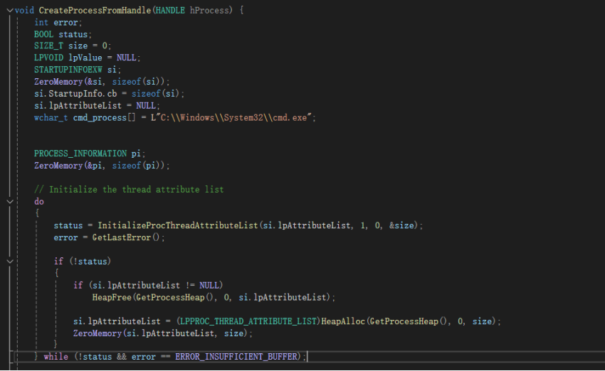

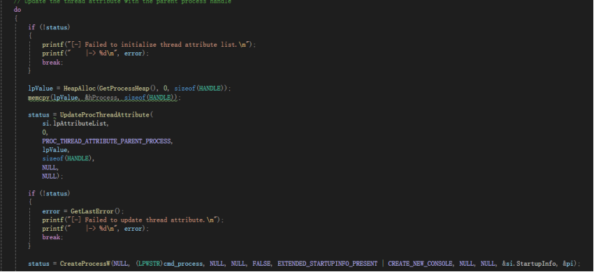

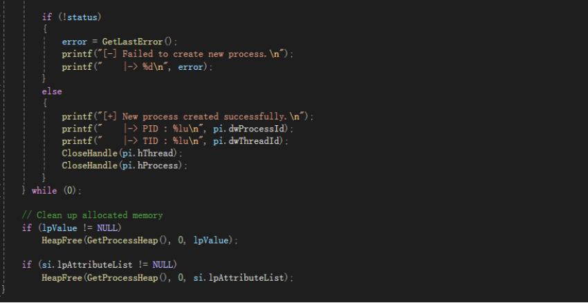

# 0x04 调试分析&&原理解析

**1. 调用链**

漏洞利用：

```
DeviceIoControl(
hClockDevice,
 IOCTL_KS_ENABLE_EVENT,
&g_ksevent,
sizeof(KSEVENT) + 0x100,
&g_eventData,
sizeof(MYKSEVENT_TIME_INTERVAL),
&bytesReturned,
NULL)
)
KsGenerateEvent(PKSEVENT_ENTRY EventEntry)    
KsIncrementCountedWorker(eventdata->KsWorkItem.KsWorkerObject) 
```

KsIncrementCountedWorker中存在增量原语InterlockedIncrement

触发后，ks 将增加我们提供的内存地址处的内容。因此，我们这里有一个内核任意增量原语。

**2、原理简述**

通过事先设置DeviceIoControl函数input的flags为KSEVENT\_TYPE\_QUERYBUFFER，走到数据复制处理分支，该flags代表着高权限，会有二次检查，所以避免二次检查，就通过竞争窗口，在复制数据之前，将flags转为KSEVENT\_TYPE\_ENABLE低权限，从而绕过二次检查，此时输入中含有目标NtSeDebugPrivilegeVA，目标是为了将它传入InterlockedIncrement 函数进行递增，循环至成功三次是为了将其从0x14转到0x17，进而提权。

**3、断点**

```
bp ksthunk!CKSAutomationThunk::ThunkEnableEventIrp
bp ks!KsSynchronousIoControlDevice
bp ks!ksGenerateEvent
bp ks!KsIncrementCountedWorker
```

CKSThunkDevice::DispatchIoctl部分代码

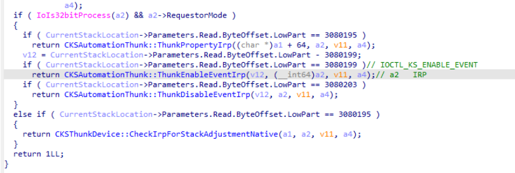

可以看到如果是32位进程发来的请求，并且请求码是IOCTL\_KS\_ENABLE\_EVENT的话，就会调用CKSAutomationThunk::ThunkEnableEventIrp，参数a2传进去的是IRP结构。

**4、首先断点断在CKSAutomationThunk::ThunkEnableEventIrp函数**

Kb查看栈回溯，看到是从CKSThunkDevice::DispatchIoctl传过来的。

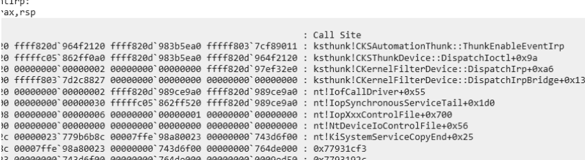

然后单步跟进到关键部分

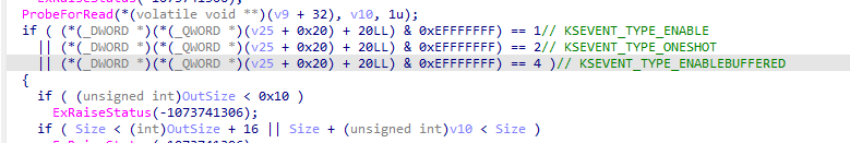

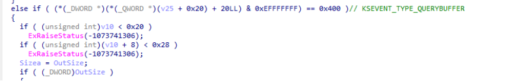

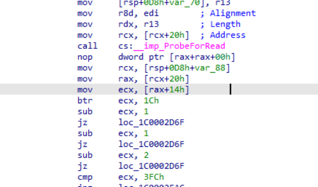

看到IDA对应的汇编代码，if条件中比较的变量最终放到了ecx，所以windbg跟进到对应位置，查看内容

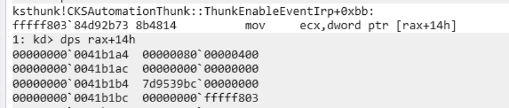

看到值为0x0000008000000400，经过与运算后发现匹配到了下面的分支中。

**5、在下面的分支中主要进行了两步关键操作，首先是将****原始请求首先被复制到新分配的缓冲区中，即v17，然后，通过KsSynchronousIoControlDevice函数，调用新的IOCTL。此时当调用新的IOCTL时，RequestorMode已经变为KernelMode（0）了。这里存在一个问题，即KsSynchronousIoControlDevice函数是直接获取的v17，也就是存在如果在调用前v17的内容是可以被修改的，这个后面会利用到。**

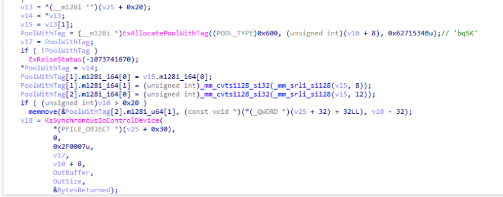

也就是说，现在这条路径允许我们使用 KernelMode 执行任意操作，但是前提是输入缓冲区里的Flags要为0x400，也就是KSEVENT\_TYPE\_QUERYBUFFER，但是这个Flags意味着不是常规操作，即对输入进行一些合规检验。在下面会分析如何绕过......

**6、Windbg接下来断点断到KsSynchronousIoControlDevice函数，kb查看调用链，看到是从****CKSAutomationThunk::ThunkEnableEventIrp函数调用过来的**

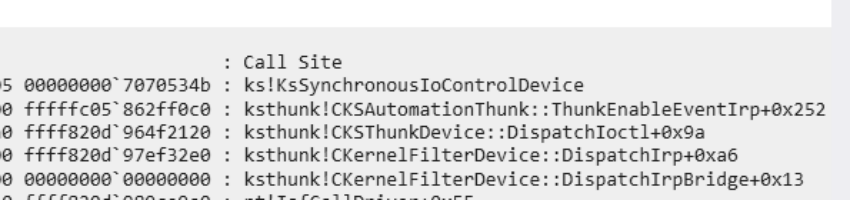

然后dps r9查看传过来的第四个参数也就是输入缓冲区

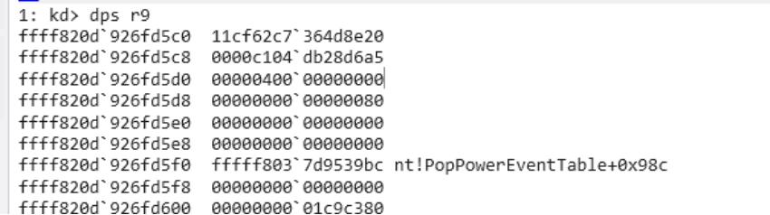

与代码中一一对应，上面是KSEVENTSETID\_CLOCK，0x400为KSEVENT\_TYPE\_QUERYBUFFER

**7、接下来断点断到KspEnableEvent，kb查看栈回溯，**

发现是从KsSynchronousIoControlDevice调用过来的，也就是说，CKSAutomationThunk::ThunkEnableEventIrp函数中将输入放到输入缓冲区后，调用KsSynchronousIoControlDevice会对输入进行检验，所以要想办法绕过这个检验，也就是绕过KspEnableEvent中的检验。

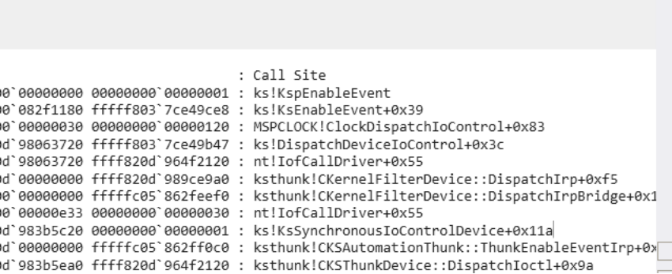

**8、接下来看KsEnableEvent函数内部，由于是KsSynchronousIoControlDevice调用过来的，那么RequestorMode就为KernelMode，当为KernelMode时，就绕过了很多校验，如下图。**

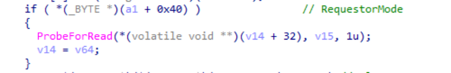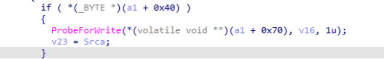

**9、接下来找到Flags为KSEVENT\_TYPE\_QUERYBUFFER时会进入的分支，可以看到里面有很多的校验操作，包括对缓冲区、线程的资源访问等等。**

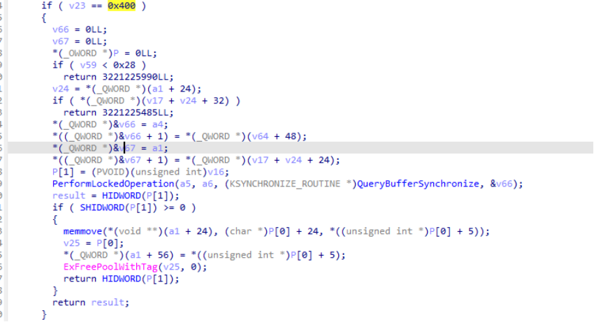

但是看到另一个分支中，即Flags为KSEVENT\_TYPE\_ENABLE，一点检查也没有。所以思路就是将Flags先置为KSEVENT\_TYPE\_QUERYBUFFER获得kernelMode，然后在调用KsSynchronousIoControlDevice之前，将Flags改为KSEVENT\_TYPE\_ENABLE来绕过KsEnableEvent函数的检查。这里就用到了上面提到的双重获取的缺陷。

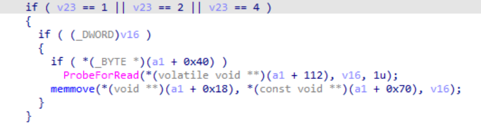

**10、接下来断点断在KsGenerateEvent函数，该函数是在事情触发后被调用，接下来查看函数内部实现，可以看到rcx为EventEntry，偏移0x28地方为NotificationType**

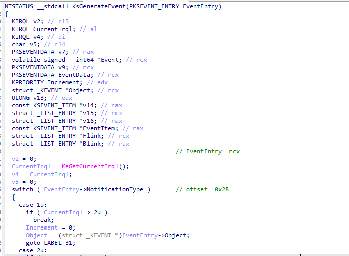

**11、接下来通过windbg查看相应数据**

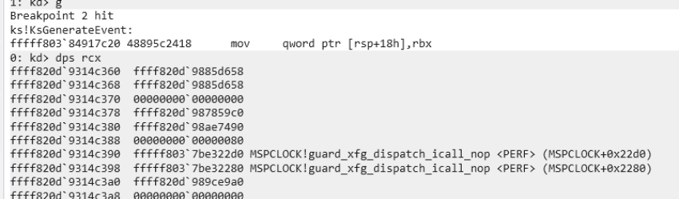

可以看到偏移0x28处为0x80，那么就会进到如下分支

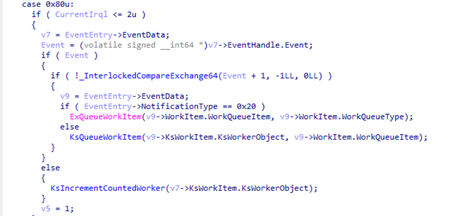

对照利用脚本中的数据构造，可以确定最后走到的是KsIncrementCountedWorker，并且参数是脚本中的NtSeDebugPrivilegeVA-0x5C，为什么是-0x5C，接下来进到函数内部就知道了。

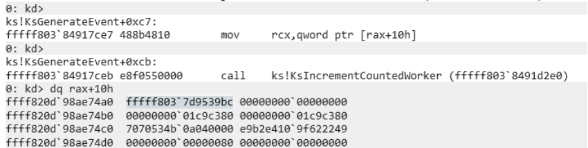

可以看到这里是一个增量原语，可以把目标地址的数据进行自增，可以看到这里是将传过来的Worker进行了一个偏移的操作，0x17\*4刚好为0x5C，所以该增量原语指向的就正好是NtSeDebugPrivilegeVA。

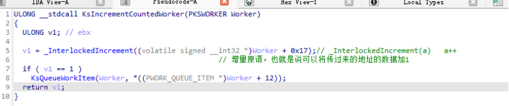

**11、那为什么要传入这个地址呢？**

因为利用代码的最后要打开winlogon进程，然后用winlogon去创建高权限cmd进程达到提权的效果，想要打开winlogon进程就需要SeDebugPrivilege权限，我们发现它是一个全局变量为0x14。

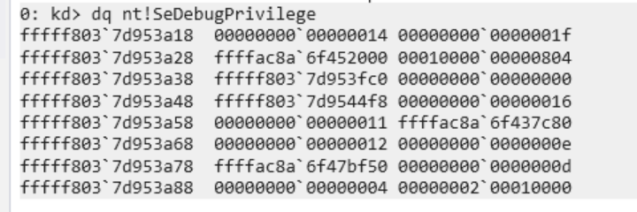

那么这里就需要查看一个函数nt!PsOpenProcess，在这个函数中又调用了nt!SeSinglePrivilegeCheck函数对进程的权限进行检查，可以看到调用之前还传进了一个参数，就是全局变量nt!SeDebugPrivilege，也就是说这是通过检测进程权限和nt!SeDebugPrivilege相等的判断，并且它还位于可写的部分！

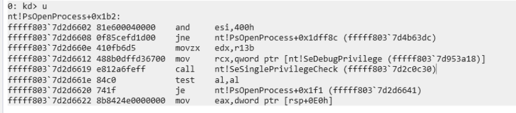

那么也就是说，现在的目标就变成将这个全局变量变得和进程变量一致即可达到获得权限的操作.

**12、在网上查阅资料得到，一般进程的SeChangeNotifyPrivilege的特权都是启用的，并且被初始化函数（SepVariableInitialization）初始化为23也就是0x17，并且SeDebugPrivilege被初始化为20，也就是0x14，那么回到上面的利用分析，只需要将SeDebugPrivilege传到里面并进行三次自增即可实现和我们的特权相等，等效于完成获取权限。所以这也是上面大循环为什么为3次的原因。**

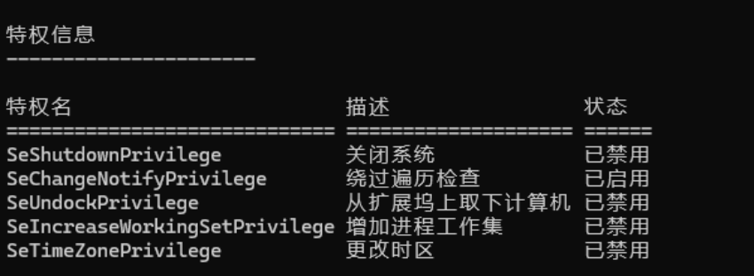

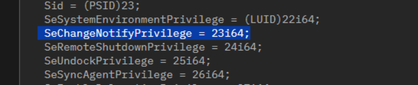

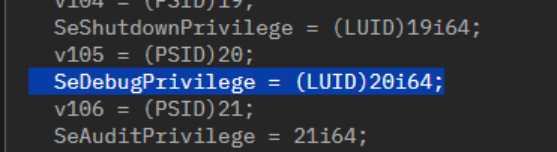

**13、所以分析完这一切后，只需要接着跟踪断点，查看nt!SeDebugPrivilege的值即可。**

初始值

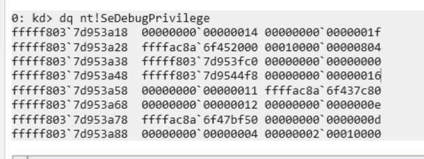

第一次自增

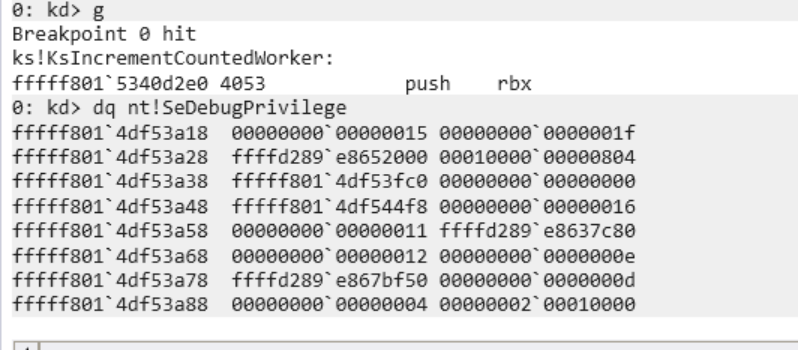

第二次自增

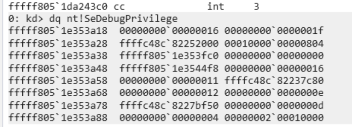

再自增一次，就会到0x17

最后就会启动winlogon进程然后弹出高权限cmd。

# 0x05 复现结果

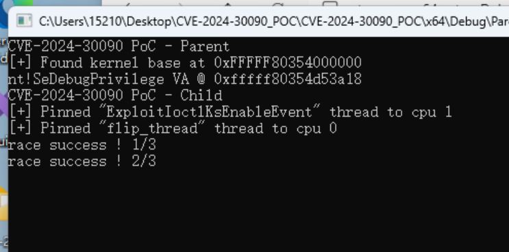

第三次成功后直接弹出高权限cmd

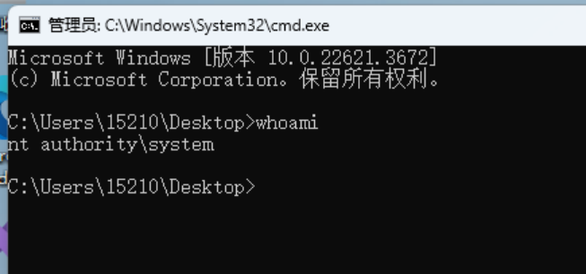
