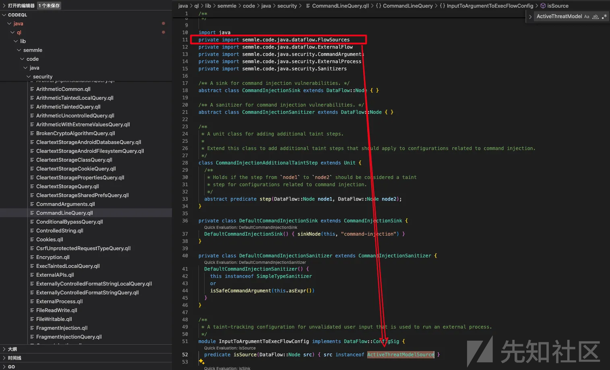
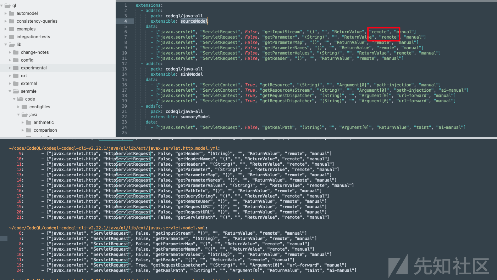
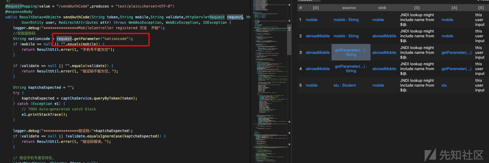
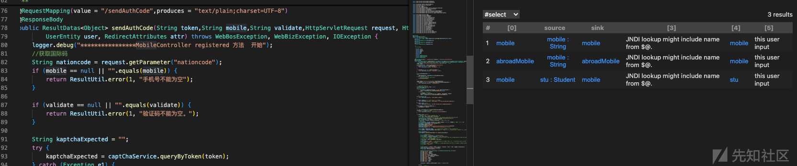

# CodeQL中Source点的实现逻辑与Spring框架污点源分析-先知社区

> **来源**: https://xz.aliyun.com/news/18994  
> **文章ID**: 18994

---

codeql有很多讲解使用的文章，这个就不做过多说明了。很多时候是需要我们去写对应的规则，大部分都是使用官方的qls检测套件，有时候要去写一个通用的检测的话也是需要去了解下官方的整体规则。只能说当前的规则在框架上提供了很多接入的优点，但是就安全去实现整个污点跟踪来说还有需要要去做；本次就拿上次iast中遇到的source去看下codeql中关于source点的实现逻辑；

# source

> 这里只针对codeql中使用的source做下查看说说明

## 官方基础source

首先说明java的扫描套件一般是位于 `/codeql/java/ql/src/codeql-suites` 目录中（当然也可以自定义[规则套件](https://www.notion.so/1f1fb4bfe24a803ab39ec9169a9c4b61?pvs=21) ），通过扫描套件qls去查找扫描规则ql，基本也就是在 `codeql/java/ql/src/Security/CWE` 目录里面；使用的也基本默认是 `semmle.code.java.dataflow.FlowSources.ActiveThreatModelSource`​


CWE的ql扫描规则



这里可以看下`semmle.code.java.dataflow.FlowSources`的相关内容部分实现，其中包括了`semmle.code.java.dataflow.FlowSources.ActiveThreatModelSource`

```
abstract class SourceNode extends DataFlow::Node {
  /**
   * Gets a string that represents the source kind with respect to threat modeling.
   */
  abstract string getThreatModel();
}

class ActiveThreatModelSource extends DataFlow::Node {
  ActiveThreatModelSource() {
    exists(string kind |
      // Specific threat model.
      currentThreatModel(kind) and
      (this.(SourceNode).getThreatModel() = kind or sourceNode(this, kind))
    )
  }
}

//通过abstract定义一个范围
abstract class RemoteFlowSource extends SourceNode {
  /** Gets a string that describes the type of this remote flow source. */
  abstract string getSourceType();

  override string getThreatModel() { result = "remote" }
}

//这里找一个经常会使用的Spring看下，可以看到有个isTaintedInput的谓词，这个后面可以做下记录。这个实现很有意义；
private class SpringServletInputParameterSource extends RemoteFlowSource {
  SpringServletInputParameterSource() {
    this.asParameter() = any(SpringRequestMappingParameter srmp | srmp.isTaintedInput())
  }

  override string getSourceType() { result = "Spring servlet input parameter" }
}

//这里记录的可能就是当source是本地触发的相关内容了
abstract class LocalUserInput extends UserInput {
  override string getThreatModel() { result = "local" }
}

private class DbInput extends LocalUserInput {
  DbInput() { sourceNode(this, "database") }

  override string getThreatModel() { result = "database" }
}
```

在该文件`semmle.code.java.dataflow.FlowSources`下其实还有大量其他的source实现。source的定义基本是通过abstract SourceNode来去规定一个范围，而 通过 `RemoteFlowSource` 我们会看到各种自定义类型为remote的规则：external、RMI method parameter、Spring servlet input parameter、Struts2 ActionSupport field、Android external storage；同时还会看到类型为local的规则（file、database、environment）；

因此正常来说使用官方的规则即可，但是有时候需要去理解官方规则实现的原理。因为有时候也需要自定义某种类型的自定义source（如file、database等），还有就是官方的有时候其实也会有一定bug；

再说下关键点`ActiveThreatModelSource` ：

* 只有当节点的威胁模型 `getThreatModel()` 返回的字符串等于**当前激活的威胁模型 kind**（如 "remote"、"local"、"file" 等），或者通过 `sourceNode(this, kind)` 明确标记为该 kind，才会被选中。
* `currentThreatModel(kind)` 决定了当前分析时关注哪些 kind。

`codeql.threatmodels.ThreatModels.currentThreatModel` 谓词实现

```
extensible predicate threatModelConfiguration(string kind, boolean enable, int priority);

extensible private predicate threatModelGrouping(string kind, string group);

predicate knownThreatModel(string kind) {
  threatModelConfiguration(kind, _, _) or
  threatModelGrouping(kind, _) or
  threatModelGrouping(_, kind) or
  kind = "all"
}
/**
 * Gets the threat model group that directly contains the specified threat model.
 */
private string getParentThreatModel(string child) {
  threatModelGrouping(child, result)
  or
  knownThreatModel(child) and child != "all" and result = "all"
}

/**
 * Holds if the `enabled` column is set to `true` of the highest-priority configuration row
 * whose `kind` column includes the specified threat model kind.
 */
private predicate threatModelEnabled(string kind) {
  // Find the highest-priority configuration row whose `kind` column includes the specified threat
  // model kind. If such a row exists and its `enabled` column is `true`, then the threat model is
  // enabled.
  knownThreatModel(kind) and
  max(boolean enabled, int priority |
    exists(string configuredKind | configuredKind = getParentThreatModel*(kind) |
      threatModelConfiguration(configuredKind, enabled, priority)
    )
  |
    enabled order by priority
  ) = true
}

/**
 * Holds if the source model kind `kind` is relevant for generic queries
 * under the current threat model configuration.
 */
bindingset[kind]
predicate currentThreatModel(string kind) {
  threatModelEnabled(kind)
  or
  // For any threat model kind not mentioned in the configuration or grouping tables, its state of
  // enablement is controlled only by the entries that specifiy the "all" kind.
  not knownThreatModel(kind) and threatModelEnabled("all")
}
```

首先说明下currentThreatModel谓词的内容

* 首先看 `threatModelEnabled(kind)`，即该 kind 是否被配置为启用。
* 如果 kind 没有在配置或分组表中出现（`not knownThreatModel(kind)`），则看 `"all"` 是否启用（即默认启用所有 kind）。

结合上面可以知道默认情况直接采用`ActiveThreatModelSource` 则代表就是`"all"` 默认全部启用。开启自定义的威胁模型则需要实现getThreatModel

```
class MyCustomSource extends ActiveThreatModelSource, SourceNode {
  MyCustomSource() {
    // 你的自定义匹配逻辑
  }
  override string getThreatModel() { result = "remote" }
}
```

**默认配置（通常包含）：**

```
# .github/codeql/codeql-config.yml
threat-models:
  - remote        # 启用远程威胁源
  - local         # 启用本地威胁源（可选）
  - commandargs   # 启用命令行参数（可选）
  - environment   # 启用环境变量（可选）
  
  宽松配置（包含更多本地威胁）：
  threat-models:
  - remote
  - local
  - commandargs
  - environment
  - file
  - database
  - reverse-dns
```

## spring框架的source

### SpringRequestMappingParameter

看之前iast的漏洞，感觉source的选择很重要，之后在自定义codeql中查看对应api的路由的时候发现codeql官方的规则对于source的定义是有一定思考的，因此做下记录说明，这说明相关应用安全的工具在这方面其实是通用的；codeql能有比较高的准确率感觉这个占了很大比重；

semmle.code.java.dataflow.FlowSources.ActiveThreatModelSource

`semmle.code.java.frameworks.spring.SpringController` 这里面是对于spring web框架的source的实现，之前看source大部分是通过自定义库的形式实现。如前文介绍中是有isTaintedInput这个谓词；也是在该文件内；

可以尝试下面的方式定义spring框架常见的source点；

```
  //默认的source规则
  //predicate isSource(DataFlow::Node src) { src instanceof ActiveThreatModelSource }
  //predicate isSource(DataFlow::Node src) { src.asParameter() instanceof SpringRequestMappingParameter }

  predicate isSource(DataFlow::Node src) { 
    src.asParameter() = any(SpringRequestMappingParameter srmp | srmp.isTaintedInput()) 
  }
```

本次的主要内容都可以在 `semmle.code.java.frameworks.spring.SpringController`中找到；

```
class SpringControllerAnnotation extends AnnotationType {
  SpringControllerAnnotation() {
    this.hasQualifiedName("org.springframework.stereotype", "Controller")
    or
    this.getAnAnnotation().getType() instanceof SpringControllerAnnotation
  }
}


class SpringRestControllerAnnotation extends SpringControllerAnnotation {
  SpringRestControllerAnnotation() { this.hasName("RestController") }
}


class SpringController extends Class {
  SpringController() { this.getAnAnnotation().getType() instanceof SpringControllerAnnotation }
}


class SpringRestController extends SpringController {
  SpringRestController() {
    this.getAnAnnotation().getType() instanceof SpringRestControllerAnnotation
  }
}

abstract class SpringControllerMethod extends Method {
  SpringControllerMethod() { this.getDeclaringType() instanceof SpringController }
}
```

可以看到上面就是针对spring框架的`SpringControllerMethod`的定义实现；在实际场景中接触更多的是下面的关于`SpringRequestMappingMethod`的定义

```

class SpringRequestMappingMethod extends SpringControllerMethod {
  SpringRequestMappingAnnotation requestMappingAnnotation;

  SpringRequestMappingMethod() {
    // Any method that declares the @RequestMapping annotation, or overrides a method that declares
    // the annotation. We have to do this explicit check because the @RequestMapping annotation is
    // not declared with @Inherited.
    exists(Method superMethod |
      this.overrides*(superMethod) and
      requestMappingAnnotation = superMethod.getAnAnnotation()
    )
  }

  /** Gets a request mapping parameter. */
  SpringRequestMappingParameter getARequestParameter() { result = this.getAParameter() }

  /** Gets the "produces" @RequestMapping annotation value, if present. If an array is specified, gets the array. */
  Expr getProducesExpr() {
    result = requestMappingAnnotation.getValue("produces")
    or
    requestMappingAnnotation.getValue("produces").(ArrayInit).getSize() = 0 and
    result = getProducesExpr(this.getDeclaringType())
  }

  /** Gets a "produces" @RequestMapping annotation value. If an array is specified, gets a member of the array. */
  Expr getAProducesExpr() {
    result = this.getProducesExpr() and not result instanceof ArrayInit
    or
    result = this.getProducesExpr().(ArrayInit).getAnInit()
  }

  /** Gets the "produces" @RequestMapping annotation value, if present and a string constant. */
  string getProduces() {
    result = this.getProducesExpr().(CompileTimeConstantExpr).getStringValue()
  }

  /** DEPRECATED: Use `getAValue()` instead. */
  deprecated string getValue() { result = requestMappingAnnotation.getStringValue("value") }

  /**
   * Gets a "value" @RequestMapping annotation string value, if present.
   *
   * If the annotation element is defined with an array initializer, then the result will be one of the
   * elements of that array. Otherwise, the result will be the single expression used as value.
   */
  string getAValue() { result = requestMappingAnnotation.getAStringArrayValue("value") }

  /** Gets the "method" @RequestMapping annotation value, if present. */
  string getMethodValue() {
    result = requestMappingAnnotation.getAnEnumConstantArrayValue("method").getName()
  }

  /** Holds if this is considered an `@ResponseBody` method. */
  predicate isResponseBody() {
    this.getAnAnnotation().getType() instanceof SpringResponseBodyAnnotationType or
    this.getDeclaringType().getAnAnnotation().getType() instanceof SpringResponseBodyAnnotationType or
    this.getDeclaringType() instanceof SpringRestController
  }
}
```

> 之前想通过`SpringRequestMappingMethod`去实现返回当前的api接口（getValue这个谓词），但是会发现这里的getValue其实是有个问题的，这里关于value其实是个数组，导致明明这里有定义却一直查询不出来，后面给官方提pr后面做了更改处理，如果相关师傅有获取api的需求，可以再试下官方这里的；

其余的这里就先不做过多介绍，先着重介绍下`SpringRequestMappingParameter`的定义，在业务代码审计中应该知道这里通常就是我们的source点定义。如果codeql只是把涉及`SpringRequestMappingMethod`相关的所有的`Parameter`都作为source的污点源的话，就会出现类似之前dongtai iast相关的大量误报，但是从下面的相关定义可以看到codeql的官方规则是很有实际意义的；

```
/** A parameter of a `SpringRequestMappingMethod`. */
class SpringRequestMappingParameter extends Parameter {
  SpringRequestMappingParameter() { this.getCallable() instanceof SpringRequestMappingMethod }

  /** Holds if the parameter should not be consider a direct source of taint. */
  predicate isNotDirectlyTaintedInput() {
    this.getType().(RefType).getAnAncestor() instanceof SpringWebRequest or
    this.getType().(RefType).getAnAncestor() instanceof SpringNativeWebRequest or
    this.getType().(RefType).getAnAncestor().hasQualifiedName("javax.servlet", "ServletRequest") or
    this.getType().(RefType).getAnAncestor().hasQualifiedName("javax.servlet", "ServletResponse") or
    this.getType().(RefType).getAnAncestor().hasQualifiedName("javax.servlet.http", "HttpSession") or
    this.getType().(RefType).getAnAncestor().hasQualifiedName("javax.servlet.http", "PushBuilder") or
    this.getType().(RefType).getAnAncestor().hasQualifiedName("java.security", "Principal") or
    this.getType()
        .(RefType)
        .getAnAncestor()
        .hasQualifiedName("org.springframework.http", "HttpMethod") or
    this.getType().(RefType).getAnAncestor().hasQualifiedName("java.util", "Locale") or
    this.getType().(RefType).getAnAncestor().hasQualifiedName("java.util", "TimeZone") or
    this.getType().(RefType).getAnAncestor().hasQualifiedName("java.time", "ZoneId") or
    this.getType().(RefType).getAnAncestor().hasQualifiedName("java.io", "OutputStream") or
    this.getType().(RefType).getAnAncestor().hasQualifiedName("java.io", "Writer") or
    this.getType()
        .(RefType)
        .getAnAncestor()
        .hasQualifiedName("org.springframework.web.servlet.mvc.support", "RedirectAttributes") or
    // Also covers BindingResult. Note, you can access the field value through this interface, which should be considered tainted
    this.getType()
        .(RefType)
        .getAnAncestor()
        .hasQualifiedName("org.springframework.validation", "Errors") or
    this.getType()
        .(RefType)
        .getAnAncestor()
        .hasQualifiedName("org.springframework.web.bind.support", "SessionStatus") or
    this.getType()
        .(RefType)
        .getAnAncestor()
        .hasQualifiedName("org.springframework.web.util", "UriComponentsBuilder") or
    this.getType()
        .(RefType)
        .getAnAncestor()
        .hasQualifiedName("org.springframework.data.domain", "Pageable") or
    this instanceof SpringModel
  }

  private predicate isExplicitlyTaintedInput() {
    // InputStream or Reader parameters allow access to the body of a request
    this.getType().(RefType).getAnAncestor() instanceof TypeInputStream or
    this.getType().(RefType).getAnAncestor().hasQualifiedName("java.io", "Reader") or
    // The SpringServletInputAnnotations allow access to the URI, request parameters, cookie values and the body of the request
    this.getAnAnnotation() instanceof SpringServletInputAnnotation or
    // HttpEntity is like @RequestBody, but with a wrapper including the headers
    // TODO model unwrapping aspects
    this.getType().(RefType).getASourceSupertype*() instanceof SpringHttpEntity or
    this.getAnAnnotation()
        .getType()
        .hasQualifiedName("org.springframework.web.bind.annotation", "RequestAttribute") or
    this.getAnAnnotation()
        .getType()
        .hasQualifiedName("org.springframework.web.bind.annotation", "SessionAttribute")
  }

  private predicate isImplicitRequestParam() {
    // Any parameter which is not explicitly handled, is consider to be an `@RequestParam`, if
    // it is a simple bean property
    not this.isNotDirectlyTaintedInput() and
    not this.isExplicitlyTaintedInput() and
    (
      this.getType() instanceof PrimitiveType or
      this.getType() instanceof TypeString
    )
  }

  private predicate isImplicitModelAttribute() {
    // Any parameter which is not explicitly handled, is consider to be an `@ModelAttribute`, if
    // it is not an implicit request param
    not this.isNotDirectlyTaintedInput() and
    not this.isExplicitlyTaintedInput() and
    not this.isImplicitRequestParam()
  }

  /** Holds if this is an explicit or implicit `@ModelAttribute` parameter. */
  predicate isModelAttribute() {
    this.isImplicitModelAttribute() or
    this.getAnAnnotation() instanceof SpringModelAttributeAnnotation
  }

  /** Holds if the input is tainted. */
  predicate isTaintedInput() {
    this.isExplicitlyTaintedInput()
    or
    // Any parameter which is not explicitly identified, is consider to be an `@RequestParam`, if
    // it is a simple bean property) or a @ModelAttribute if not
    not this.isNotDirectlyTaintedInput()
  }
}
```

`SpringRequestMappingParameter` 中的 `isTaintedInput()` 方法用于判断**Spring Controller 请求方法的参数是否属于“用户可控输入”**，即是否应被视为潜在的外部输入源。实现非常细致，涵盖了 Spring MVC 常见的用户输入场景。

### 1. 明确的用户输入（显式 taint）

* 参数类型为 `InputStream` 或 `Reader`（可直接读取请求体内容）

```
@PostMapping
public void handle(InputStream inputStream, Reader reader) { }
```

* 参数上有如下注解（即 `SpringServletInputAnnotation`）：

```
@GetMapping
public void handle(
    @RequestParam String param,     // 请求参数
    @RequestHeader String header,   // 请求头
    @PathVariable String id,        // 路径变量
    @RequestBody User user,         // 请求体
    @CookieValue String cookie,     // Cookie值
    @RequestPart MultipartFile file,// 文件上传
    @MatrixVariable String matrix   // 矩阵变量
) { }
```

* 参数类型为 `HttpEntity`（类似 `@RequestBody`，包含请求体和头部）

```
@PostMapping
public void handle(HttpEntity<User> entity) { }
```

* 参数上有 `@RequestAttribute` (请求属性) 或 `@SessionAttribute` (会话属性)(我个人理解这两个参数算作污点会有误报的情况，这个可能是避免漏报吧)

```
@GetMapping
public void handle(
    @RequestAttribute String attr,     // 请求属性
    @SessionAttribute String sessionAttr // 会话属性
) { }
```

### 2. 隐式的用户输入（隐式 taint）

> 这里的隐式taint其实感觉比较特殊，主要是由于这里的or通过not this.isNotDirectlyTaintedInput()决定了。这里意味着所有不在排除列表中的参数都被视为污点输入。
>
> predicate isTaintedInput() {
>
> this.isExplicitlyTaintedInput()
>
> or
>
> not this.isNotDirectlyTaintedInput()
>
> }

* **如果参数不是“特殊类型”**（如 `ServletRequest`、`ServletResponse`、`HttpSession`、`Principal`、`Locale`、`TimeZone`、`OutputStream`、`Writer`、`Pageable` 等），
* 并且不是显式 taint，
* 那么：

* 如果参数类型是基本类型，通常简单类型参数（如 `int`、`String`），**视为隐式** `@RequestParam`，即用户输入。（严格来看其实只有string的场景会有问题，对int等基本类型应该排除，这里可能还是类似上面属性注解的问题，避免漏报。当然这个也可以依靠净化流isBarrier来解决）
* 如果不是基本类型，另一种则是复杂对象参数，则视为隐式 `@ModelAttribute`，也属于用户输入。

### 3. 例外（不会被视为 taint）

* 参数类型为 `ServletRequest`、`ServletResponse`、`HttpSession`、`Principal`、`Locale`、`TimeZone`、`OutputStream`、`Writer`、`RedirectAttributes`、`Errors`、`SessionStatus`、`UriComponentsBuilder`、`Pageable`、`Model`、`ModelMap` 等，这些不会被视为 taint。

```
@GetMapping
public void handle(
    HttpServletRequest request,      // Servlet请求对象
    HttpServletResponse response,    // Servlet响应对象
    HttpSession session,             // 会话对象
    Principal principal,             // 认证主体
    Model model,                     // Spring模型
    BindingResult bindingResult,     // 绑定结果
    RedirectAttributes redirectAttrs // 重定向属性
) { }
```

* 请求响应，`ServletRequest`、`ServletResponse` 这个之前IAST关于误报里就遇到过。当然这里其实也有个问题就是`jakarta.servlet.ServletRequest` 高版本的问题。
* HttpSession 会话对象，不是直接用户输入
* Principal 认证主体，经过框架验证
* PushBuilder HTTP/2 推送构建器
* HttpMethod 枚举类型，表示HTTP方法(GET, POST等)
* `Locale`、`TimeZone`、`ZoneId` 国际化和时区
* `OutputStream`、`Writer`输出流
* `RedirectAttributes`、`Errors`、`SessionStatus`、`UriComponentsBuilder`主要是spring mvc特定对象，重定向属性、错误验证、会化管理，URI构建器
* `Pageable`、`Model`、`ModelMap` Spring Data 或者Spring Model的对象

当然这里还有个问题，就是虽然`ServletRequest`这个确实在controller中作为入参确实不太行，但是现实业务中确实有很多业务是ServletRequest.getParameter()这种形式。这时候其实就是ActiveThreatModelSource和SpringServletInputParameterSource关系的问题。这里就用到我认为codeql最大升级的地方，库模型。codeql在库模型中定义了很多source点，这里就包括了上面提到的。

## ActiveThreatModelSource

### currentThreatModel

这里其实主要还是RemoteFlowSource.getThreatModel()这个谓词的定义，在ActiveThreatModelSource中枚举相关字符串，这时命中sourceNode(this, kind))逻辑的话就会启用库模型中source是remote的定义，而库模型中则定义了上文中提到的ServletRequest.getParameter()的相关source点。

```
abstract class SourceNode extends DataFlow::Node {
  /**
   * Gets a string that represents the source kind with respect to threat modeling.
   */
  abstract string getThreatModel();
}

class ActiveThreatModelSource extends DataFlow::Node {
  ActiveThreatModelSource() {
    exists(string kind |
      // Specific threat model.
      currentThreatModel(kind) and
      (this.(SourceNode).getThreatModel() = kind or sourceNode(this, kind))
    )
  }
}

//通过abstract定义一个范围
abstract class RemoteFlowSource extends SourceNode {
  /** Gets a string that describes the type of this remote flow source. */
  abstract string getSourceType();

  override string getThreatModel() { result = "remote" }
}

//这里找一个经常会使用的Spring看下，可以看到有个isTaintedInput的谓词，这个后面可以做下记录。这个实现很有意义；
private class SpringServletInputParameterSource extends RemoteFlowSource {
  SpringServletInputParameterSource() {
    this.asParameter() = any(SpringRequestMappingParameter srmp | srmp.isTaintedInput())
  }

  override string getSourceType() { result = "Spring servlet input parameter" }
}
```

关于currentThreatModel相关定义在codeql.threatmodels.ThreatModels中。其实可以理解为如果没有相关明确配置，则默认kind为"all",这就意味着肯定会有"remote"的source点，当然也包含其他的比如file等。但是说实话这里的逻辑其实一直没看太明白，感觉可能是这样。

```

predicate knownThreatModel(string kind) {
  threatModelConfiguration(kind, _, _) or
  threatModelGrouping(kind, _) or
  threatModelGrouping(_, kind) or
  kind = "all"
}

private predicate threatModelEnabled(string kind) {
  // Find the highest-priority configuration row whose `kind` column includes the specified threat
  // model kind. If such a row exists and its `enabled` column is `true`, then the threat model is
  // enabled.
  knownThreatModel(kind) and
  max(boolean enabled, int priority |
    exists(string configuredKind | configuredKind = getParentThreatModel*(kind) |
      threatModelConfiguration(configuredKind, enabled, priority)
    )
  |
    enabled order by priority
  ) = true
}


bindingset[kind]
predicate currentThreatModel(string kind) {
  threatModelEnabled(kind)
  or
  // For any threat model kind not mentioned in the configuration or grouping tables, its state of
  // enablement is controlled only by the entries that specifiy the "all" kind.
  not knownThreatModel(kind) and threatModelEnabled("all")
}

```

库模型的相关定义（）



### 测试

* 这里使用`predicate isSource(DataFlow::Node source) { source instanceof ActiveThreatModelSource }`进行source的定义



* 这里使用`source.asParameter() = any(SpringRequestMappingParameter srmp | srmp.isTaintedInput())`官方规则中spring的污点定义。



从上面可以看到最大的区别就是ServletRequest.getParameter()这些库模型规则的定义；

# 总结

从codeql的官方规则上可以看出来，当前AST相关的检测可能还是从两方面着手：1、类似codeql的库模型对于ServletRequest.getParameter()这种通用节点定义；2、剩余的就是各种框架场景的定义，最常见的就是spring框架。当前来看codeql的官方规则满足大部分检测是没有问题的，但是深入业务实践上来看有些场景还是没有完全覆盖到，有些比如rpc场景。并且很多规则还有各种bug待优化（等着各位师傅提pr）；在企业级的应用安全建设上（菜鸟只是说java这种）还需要进行再次的适配改造；
