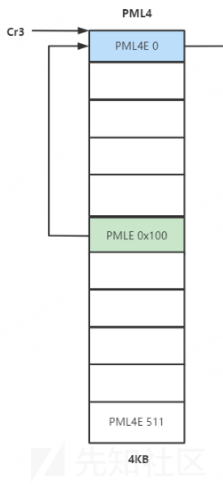
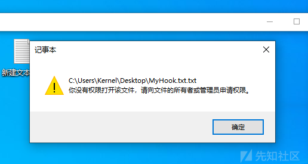

# PTE Hook：一种利用页表重映射攻击实现的内核函数Hook-先知社区

> **来源**: https://xz.aliyun.com/news/18999  
> **文章ID**: 18999

---

## 什么是PTE Hook

常规的inlineHook思路是直接修改目标函数的代码，使其先执行我们自己的函数，再跳转回来执行原函数。这种Hook是全局的，即Windows中每一个进程一旦调用被Hook的函数，就会受到我们的影响，也很容易被PatchGuard检查到。

因此提出一种新的Hook思路，**隔离具体进程的四级页表，使我们的Hook不影响全局**。当然具体的Hook方法依然是inlineHook

## 理论知识

### CPU访问物理地址

首先解释一下x64架构下，CPU访问一个虚拟地址（也称线性地址）时的流程。Windows使用了四级页表结构，分别是PML4 (Page Map Level 4)、PDPT (Page Directory Pointer Table)、PD (Page Directory)、PT (Page Table)。我们知道一个虚拟地址共64位，其中高16位是不使用的，因此总共只有48位，这48位按照9-9-9-9-12的结构拆分，前四个9表示四级页表的索引，最后一个12表示一个物理页（通常是4K）的页内偏移，这样CPU就找到了一个虚拟地址对应的物理地址。下面演示一个虚拟地址是如何拆分的。

```
比如这样一个虚拟地址 : 0xfffff8037888e000
    高16位不使用，可以看到全部被置为了1，因此有效地址为 ： 0xf8037888e000
    转为二进制： 1111 1000 0000 0011 0111 1000 1000 1000 1110 0000 0000 0000
    第一个9位: 1 1111 0000 -> 0x1f0  PML4 Index
第二个9位: 0 0000 1101 -> 0xd   PDPT Index
第三个9位: 1 1100 0100 -> 0x1c4 PT Index
第四个9位: 0 1000 1110 -> 0x8e  PD Index
最后12位页内偏移: 00 0000 0000 -> 0    Offset
```

CR3寄存器是x64架构下一个重要的系统寄存器，其中存储的值是当前进程PML4表的物理基地址，之前已经计算出Index，因此通过CR3拿到基地址后，可以逐层的索引到物理地址。

### 页表自映射

根据上面讲的，我们明白CPU是这样找到物理地址的：PML4->PDPT->PD->PT->Physical Page，共有4次访问内存。由于CPU寻址是一个高频操作，为了简化这一流程，Windows引入了一个很精妙的机制：**页表自映射**。

页表自映射，即在PML4这张表的其中一项中，存储PML4表基地址。比如假设在索引0x100处存储：



因此，在访问PML4索引0x100处，其实就是在访问PML4自身，所以被称为页表自映射。

你可能会想，这么做白白浪费了8字节空间，为什么要设置一个这样的页表项，他的精妙之处是这样的：

我们先从PML4入手，我们知道一个48位有效地址的高9位是PML4的索引，这个索引对应的页表项存储的本应该是下一级页表，即PDPT的物理基地址，但是由于引入了页表自映射，因此就必然有一个索引对应的页表项存储的是PML4自身的基地址，不妨将这一索引设为S（在上图中这个索引是0x100）。

我们先采用这样的格式表示一个48位的虚拟地址(A)(B)(C)(D)(Offset)，其中A是PML4的索引

当 A == B == C == D == S && Offset == 0 时，CPU访问这个虚拟地址时会出现这样的寻址情况：

PML4 Index == S，指向PML4表物理基地址，PDPT Index == S ，又指向PML4表物理基地址，以此类推，PD和PT也都指向PML4表物理基地址。因此(S)(S)(S)(S)(000000000000)对应的物理地址就是PML4表的**物理基地址**，不妨把这个虚拟地址称作**PML4的表虚拟基地址**。用数学公式将之表达：

```
PML4_VirtualBase = (S << 39) | (S << 30) | (S << 21) | (S << 12)
    //S << 39 就是将一串48位的二进制数的高9位设为S，或运算就是将每次设置的值连起来放在一个数上
    //假设 S << 39 == 0xF6E0000000000000 S << 30 == 0x0000074000000000
    //那么 (S << 39) | (S << 30) == 0xF6E0074000000000
```

根据上面的理论，显然当A == B == C == S && D == PDPT\_Index && Offset == 0时，也就是说其中一位指向了PDPT的基地址，可以得到PDPT的表虚拟基地址

PDPT\_VirtualBase = (S << 39) | (S << 30) | (S << 21) | (PDPT\_Index << 12)

以此类推，我们就可以得到计算最低一级的页表PT的表虚拟基地址的计算公式，这里顺便展示PD的计算公式：

```
PT_VirtualBase = (S << 39) | (PDPT_Index << 30) | (PD_Index << 21) | (PT_Index << 12)
    PD_VirtualBase = (S << 39) | (S << 30) | (PDPT_Index) | (PD_Index << 12)
```

以上是利用页表自映射机制定位到PT表基地址，实际上也可以利用这个原理定位到任意一个VA（虚拟地址）对应的PTE（Page Table Entry，即PT条目，也即PT表中的一项）。

显然以下公式成立：

```
PTE_VirtualAddress = (S << 39) | (PML4_Index << 30) | (PDPT_Index << 21) | (PD_Index << 12) | (PT_Index << 3)
    /*
理解最后的(PT_Index << 3)的这一项，因为每个PTE占8字节，左移3位即乘8，也理解为i*8作为偏移来找到具体的
的PTE，实际上就是通过自映射机制将PT表当作了原来的物理页面进行查找
*/
```

通过我们构造出的这个虚拟地址，可以直接读写PTE而不需要知道其物理地址。

最后再将一个很简洁的通过PML4的表虚拟基地址得到其他三级页表虚拟基地址的公式，我们知道：

PML4\_VirtualBase = (S << 39) | (S << 30) | (S << 21) | (S << 12)

如果将后两个S置为0，即不考虑偏移且往后找一级页表，就可以得到PDPT的表虚拟基地址

PDPT\_VirtualBase = (S << 39) | (S << 30) | (0 << 21) | (0 << 12)

数学上，上面这个式子实际上等价于PML4的虚拟基地址的低21位置0，即

PDPT\_VirtualBase = (PML4\_VirtualBase >> 21) << 21

同理：

```
PD_VirtualBase = (PML4_VirtualBase >> 30) << 30
    PT_VirtualBase = (PML4_VirtualBase >> 39) << 39
```

另外，由于上面计算VA对应的PTE公式过于复杂，是主动构造了9-9-9-9-12的虚拟地址结构，还有一个通过基地址+偏移的方法来计算：

```
PTE_VirtualAddress = PTE_Base + (VA >> 12) << 3
    /*
VA >> 12 其实就是 VA / 4096，我们知道一个页就是4096K，所以VA >> 12 就是虚拟页号，每一页对应一个PTE，
一个PTE是8字节，那么上式就变成了：
*/
    PTE_VirtualAddress = PTE_Base + Offset * 8
```

由于Windows开启了基址随机化，页表的虚拟基地址每次开机都不一样，因此需要一个巧妙的方法定位页表基地址，这里给出鹅厂的方法：利用页表自映射定位。由于存在页表自映射这一机制，因此，在PML4表的512个地址中，必然有一个存放着PML4的表物理地址，即CR3的值。所以可以通过映射CR3物理地址的虚拟地址，遍历这个地址页面的512个地址，哪个地址等于CR3的值，哪个地址就是PML4的表虚拟基地址。考虑以下算法：

```
ULONG64 GetPml4Base()
{
    PHYSICAL_ADDRESS pCr3 = { 0 };
    pCr3.QuadPart = __readcr3();
    PULONG64 pCmpArr = (PULONG64)MmGetVirtualForPhysical(pCr3);

    int count = 0;
    /*
    *pCmpArr（当前条目，即PML4E的值）表示指向下一级页表的物理地址
    &0xFFFFFFFFF000即获取Page_Frame_Number 页帧号
    */
    while ((*pCmpArr & 0xFFFFFFFFF000) != pCr3.QuadPart)
    {
        if (++count >= 512)
        {
            return -1;
        }
        pCmpArr++;
    }

    return (ULONG64)pCmpArr & 0xFFFFFFFFFFFFF000;//忽略后12位标志位
}
```

理论知识就到这里了。

## PTE Hook原理

首先思考一个问题，为什么常规Hook只是修改了一个进程的内核函数，却导致全局的内核函数被修改而被PG检查到。这是因为，用户态下的进程对应的PML4表的高256项都是相同的，指向了共享的内核PDPT，一旦我们修改任意一项PTE，就会产生连锁的影响PT->PD->PDPT->PML4，又由于PML4是共享的，所以全局的函数都被修改了。

因此我们可以先替换掉一项PML4E，这一项PML4E被我们替换后，指向一个伪造的PDPT表，再指向一个伪造的PD表，一个伪造的PT表，最后指向我们Hook的函数。这样被修改的函数只局限于这一个进程，在一定程度上可以规避PG。

此外，还需要考虑大小页的问题。小页指的就是一般的4K大小的页，大页指的是2M的页，是操作系统为了提高访问内存性能而开发的。根据上面的伪造替换规则，一般来说会想到：**大页换大页，小页换小页**。但是由于页表的物理内存需要是连续的，而Windows的物理内存机制是碎片化的，开机越久越难申请到2M的连续内存，所以考虑使用页表分割的方法，即将一个2M的大页分成512个小页。在如下的代码中，我们只申请了一页连续的内存，用来存放指向512个小页的PTE，每个都用来指向原大页的不同4K部分。

## 实战

页表分割：

```
bool splitLargePages(pde_64* in_pde, pde_64* out_pde)
{
    PHYSICAL_ADDRESS MaxAddrPa{ 0 }, LowAddrPa{ 0 };
    MaxAddrPa.QuadPart = MAXULONG64;
    LowAddrPa.QuadPart = 0;
    pt_entry_64* Pt;
    auto start_pfn = in_pde->page_frame_number;
    Pt = (pt_entry_64*)MmAllocateContiguousMemorySpecifyCache(PAGE_SIZE, LowAddrPa, MaxAddrPa, LowAddrPa, MmCached);//默认对齐
    if (!Pt) {
        DbgPrintEx(77, 0, "failed to alloc contiguous for new pt.\r
");
        return false;
    }
    for (int i = 0; i < 512; i++) {
        //分割成小页，构建Pt
        Pt[i].flags = in_pde->flags;
        Pt[i].large_page = 0;
        Pt[i].global = 0;
        Pt[i].page_frame_number = start_pfn + i;
    }
    out_pde->flags = in_pde->flags;
    out_pde->large_page = 0;
    out_pde->page_frame_number = va_to_pa(Pt) / PAGE_SIZE;
    return true;
}
```

下面是页表伪造部分的代码：

```
typedef struct _PTE_TABLE {
    void* LineAddress;
    pte_64* PteAddress;
    pde_64* PdeAddress;
    pdpte_64* PdpteAddress;
    pml4e_64* Pml4eAddress;
}PTE_TABLE, * PPTE_TABLE;
```

```
bool isolationPageTable(cr3 cr3_reg, void* replaceAlignAddr, pde_64* splitPDE)
{
    //均指向4kb内存
    uint64_t* VaPt, * Va4kb, * VaPdt, * VaPdpt, * VaPml4t;

    PTE_TABLE Table{ 0 };
    PHYSICAL_ADDRESS MaxAddrPa{ 0 }, LowAddrPa{ 0 };
    MaxAddrPa.QuadPart = MAXULONG64;
    LowAddrPa.QuadPart = 0;
    //这里申请伪造页表的内存
    VaPt = (uint64_t*)MmAllocateContiguousMemorySpecifyCache(PAGE_SIZE, LowAddrPa, MaxAddrPa, LowAddrPa, MmCached);
    Va4kb = (uint64_t*)MmAllocateContiguousMemorySpecifyCache(PAGE_SIZE, LowAddrPa, MaxAddrPa, LowAddrPa, MmCached);
    VaPdt = (uint64_t*)MmAllocateContiguousMemorySpecifyCache(PAGE_SIZE, LowAddrPa, MaxAddrPa, LowAddrPa, MmCached);
    VaPdpt = (uint64_t*)MmAllocateContiguousMemorySpecifyCache(PAGE_SIZE, LowAddrPa, MaxAddrPa, LowAddrPa, MmCached);
    VaPml4t = (uint64_t*)pa_to_va(cr3_reg.address_of_page_directory * PAGE_SIZE);

    if (!VaPt || !Va4kb || !VaPdt || !VaPdpt) {
        DbgPrintEx(77, 0, "failed to alloc page table entry.\r
");
        return false;
    }
    Table.LineAddress = replaceAlignAddr;
    getPagesTable(Table);//这个函数是利用理论知识讲的公式获取任意VA对应的PTE、PDPTE、PDE、PXE

    //获取索引
    UINT64 pml4eindex = ((uint64_t)replaceAlignAddr & 0x0000FF8000000000) >> 39;
    UINT64 pdpteindex = ((uint64_t)replaceAlignAddr & 0x0000007FC0000000) >> 30;
    UINT64 pdeindex = ((uint64_t)replaceAlignAddr & 0x000000003FE00000) >> 21;
    UINT64 pteindex = ((uint64_t)replaceAlignAddr & 0x00000000001FF000) >> 12;

    //判断是否为大页，因为大页的PT是没有值的，所以要将VaPt指向分割成小页后的PT表，就是上面代码展示的
    if (Table.PdeAddress->large_page) {
        MmFreeContiguousMemorySpecifyCache(VaPt, PAGE_SIZE, MmCached);
        VaPt = (uint64_t*)pa_to_va(splitPDE->page_frame_number * PAGE_SIZE);
    }
    else {
        //小页，Pt数组是有值的，先复制
        memcpy(VaPt, Table.PteAddress - pteindex, PAGE_SIZE);
    }
    //这里我的Table结构中的页表均为指针，因此这里做的减法是指针减法，不需要乘以8
    //另外这里做减法的意思是获取页表的起始地址，即基地址
    memcpy(Va4kb, replaceAlignAddr, PAGE_SIZE);
    memcpy(VaPdt, Table.PdeAddress - pdeindex, PAGE_SIZE);//指针减法
    memcpy(VaPdpt, Table.PdpteAddress - pdpteindex, PAGE_SIZE);

    //替换页表的页框号，从Pte开始一直到Pml4e
    _disable();//关中断防止替换被打断
    auto pReplacePte = (pte_64*)&VaPt[pteindex];
    pReplacePte->page_frame_number = va_to_pa(Va4kb) / PAGE_SIZE;
    auto pReplacePde = (pde_64*)&VaPdt[pdeindex];
    pReplacePde->page_frame_number = va_to_pa(VaPt) / PAGE_SIZE;
    pReplacePde->large_page = 0;
    pReplacePde->ignored_1 = 0;
    pReplacePde->page_level_cache_disable = 1;
    auto pReplacePdpte = (pdpte_64*)&VaPdpt[pdpteindex];
    pReplacePdpte->page_frame_number = va_to_pa(VaPdt) / PAGE_SIZE;
    auto pReplacePml4e = (pml4e_64*)&VaPml4t[pml4eindex];
    pReplacePml4e->page_frame_number = va_to_pa(VaPdpt) / PAGE_SIZE;

    //刷新TLB
    __invlpg(pReplacePml4e);

    _enable();
    return true;

}
```

最后写一段代码调用上面两个函数：

```
bool isolationPages(HANDLE pid, void* iso_address)
{
    if (!MmIsAddressValid(iso_address)) {
        DbgPrintEx(77, 0, "Invalid address: %p\r
", iso_address);
        return false;
    }

    PEPROCESS Process;
    KAPC_STATE Apc{ 0 };
    NTSTATUS status;
    void* AliginIsoAddr;
    PTE_TABLE Table{ 0 };
    status = PsLookupProcessByProcessId(pid, &Process);
    //附加要隔离的进程，每个进程的空间是独立的，这一步一定要做
    KeStackAttachProcess(Process, &Apc);
    AliginIsoAddr = PAGE_ALIGN(iso_address);
    Table.LineAddress = AliginIsoAddr;

    getPagesTable(Table);

    bool bSuc = false;
    while (1) {
        //大页分割
        pde_64 splitPDE{ 0 };
        if (Table.PdeAddress->large_page) {
            bSuc = splitLargePages(Table.PdeAddress, &splitPDE);
            if (!bSuc)break;
            if (Table.PdeAddress->flags & 0x100) {
                Table.PdeAddress->flags &= ~0x100;
                /*
                这里以及下面的的Table.PteAddress->global = 0;是在关闭G位
                */
            }
        }
        else {
            if (Table.PteAddress->global) {
                Table.PteAddress->global = 0;
            }
        }

        cr3 Cr3;
        Cr3.flags = __readcr3();
        bSuc = isolationPageTable(Cr3, AliginIsoAddr, &splitPDE);

        if (bSuc) {
            DbgPrintEx(77, 0, "isolation succeed.\r
");
            break;
        }
        else {
            DbgPrintEx(77, 0, "failed to isolation pages.\r
");
            break;
        }
    }
    KeUnstackDetachProcess(&Apc);
    ObDereferenceObject(Process);
    return bSuc;
}
```

这里有一步之前没讲的操作，设置了G位。在CPU的内部有一个表叫做TLB，学过计组的都知道，这玩意叫做快表，其实是一个Cache，内部记录了很多东西，比如直接记录一个虚拟地址对应的物理地址，而不需要通过四级页表机制来查找。每次切换进程时，CR3都会改变，而TLB是跟着CR3变的。但是由于操作系统的高位映射是基本不变的，如果每次切换CR3都重新维护一个TLB，就会造成很大开销。

因此诞生了Global，即全局位。这个位一旦被置1，那么切换进程CR3的时候，就不会刷新PDE或PTE的G位为1的页。这将导致：进程A切换到进程B，而进程A的某个虚拟地址还是保存在进程B的TLB中，下次进程B查找这个虚拟地址的值后，就会在TLB中找到进程A虚拟地址中对应的物理地址。

这对我们的隔离操作是有害的， 因为若进程A恰好是我们隔离的进程，我们Hook了某个函数后，其他进程又从TLB中找到了被Hook的这个函数，那么隔离就失效了。因此，我们关闭伪造页对应的PTE或PDE的G位，强制切换进程时刷新TLB，其他进程就找不到我们的Hook了。

讲完上面的代码，PTE Hook的核心进程隔离部分已经实现了，接下来只需要使用inlineHook框架就好了。下面是一个例子：

```
bool PTEHookManager::PTEHook(HANDLE pid, void** oFuncAddr, void* targetFuncAddr)
{
    static bool bFirst = true;
    if (bFirst) {
        m_PTEBase = nullptr;
        m_trampLine = (char*)ExAllocatePoolWithTag(NonPagedPool, PAGE_SIZE * 5, 'Line');
        if (!m_trampLine) {
            DbgPrintEx(77, 0, "failed to create trampline.\r
");
            return false;
        }
        memset(&m_info, 0, sizeof(m_info));
        memset(&m_globalBit, 0, sizeof(m_globalBit));
        m_trampLineUsed = 0;
        bFirst = false;
    }
    PEPROCESS Process{ 0 };
    KAPC_STATE Apc{ 0 };
    NTSTATUS status;
    const uint32_t breakBytesLeast = 14;//ff 25
    const uint32_t trampLineBreakBytes = 20;
    uint32_t uBreakBytes = 0;
    char* TrampLine = m_trampLine + m_trampLineUsed;
    hde64s hde_info{ 0 };
    char* JmpAddrStart = (char*)*oFuncAddr;
    if (m_curHookCount == MAX_HOOK_COUNT) {
        DbgPrintEx(77, 0, "Hook too many.\r
");
        return false;
    }
    status = PsLookupProcessByProcessId(pid, &Process);
    if (!NT_SUCCESS(status)) {
        DbgPrintEx(77, 0, "failed to get pid.\r
");
        return false;
    }
    auto ret = isolationPages(pid, *oFuncAddr);
    if (!ret)return false;
    DbgPrintEx(77, 0, "ready to diasm.\r
");
    while (uBreakBytes < breakBytesLeast) {
        if (!hde64_disasm(JmpAddrStart + uBreakBytes, &hde_info)) {
            DbgPrintEx(77, 0, "failed to diasm addr.\r
");
            ObDereferenceObject(Process);
            return false;
        }
        uBreakBytes += hde_info.len;
    }
    DbgPrintEx(77, 0, "finish disasm.\r
");
    unsigned char trampLineCode[trampLineBreakBytes] = {
        0x6A, 0x00,                                                // push 0
        0x3E, 0xC7, 0x04, 0x24, 0x00, 0x00, 0x00, 0x00,            // mov dword ptr ss : [rsp] , 0x00
        0x3E, 0xC7, 0x44, 0x24, 0x04, 0x00, 0x00, 0x00, 0x00,      // mov dword ptr ss : [rsp + 4] , 0x00
        0xC3                                                       // ret
        };
    char absolutejmpCode[14] = { 0xFF,0x25,0x00,0x00,0x00,0x00,0x00,0x00,0x00,0x00,0x00,0x00,0x00,0x00 };
    *((PUINT32)&trampLineCode[6]) = (UINT32)(((uint64_t)JmpAddrStart + uBreakBytes) & 0XFFFFFFFF);
    *((PUINT32)&trampLineCode[15]) = (UINT32)((((uint64_t)JmpAddrStart + uBreakBytes) >> 32) & 0XFFFFFFFF);

    memcpy(TrampLine, JmpAddrStart, uBreakBytes);
    memcpy(TrampLine + uBreakBytes, trampLineCode, trampLineBreakBytes);
    //添加Hook信息
    for (int i = 0; i < MAX_HOOK_COUNT; i++) {
        if (m_info[i].pid == 0) {
            m_info[i].oriAddr = JmpAddrStart;
            memcpy(m_info[i].oriBytes, JmpAddrStart, 14);
            m_info[i].pid = pid;
            m_curHookCount++;
            break;
        }
    }
    DbgPrintEx(77, 0, "ready to create trampline.\r
");
    *((ULONG64*)(&absolutejmpCode[6])) = (ULONG64)targetFuncAddr;
    KeStackAttachProcess(Process, &Apc);
    //auto oIrpl = WPOFF();
    //memcpy(JmpAddrStart, absolutejmpCode, 14);
    //DbgPrintEx(77, 0, "[JmpAddrStart]%p\r
",JmpAddrStart);
    DbgPrintEx(77, 0, "[absolutejmpCode]");
    for (int i = 0; i < 14; i++) {
        DbgPrintEx(77, 0, "%02X", (unsigned char)absolutejmpCode[i]);
    }
    DbgPrintEx(77, 0, "\r
");
    BOOLEAN success = MDLWriteMemory(JmpAddrStart, absolutejmpCode, 14);
    if (!success) {
        DbgPrintEx(77, 0, "failed to MDL write jmpcode.\r
");
        return false;
    }
    KeUnstackDetachProcess(&Apc);
    *oFuncAddr = TrampLine;
    m_trampLineUsed += uBreakBytes + trampLineBreakBytes;
    ObDereferenceObject(Process);
    return true;
}
```

下面我尝试Hook explore.exe进程的NtCreateFile函数看看效果，系统版本：Win10 1903，另外我还测试了Win10 21H2、Win11 21H2，挂了6小时左右未出现PG

```
NTSTATUS HookNtCreateFile(
    OUT PHANDLE FileHandle,
    IN ACCESS_MASK DesiredAccess,
    IN POBJECT_ATTRIBUTES ObjectAttributes,
    OUT PIO_STATUS_BLOCK IoStatusBlock,
    IN PLARGE_INTEGER AllocationSize OPTIONAL,
    IN ULONG FileAttributes,
    IN ULONG ShareAccess,
    IN ULONG CreateDisposition,
    IN ULONG CreateOptions,
    IN PVOID EaBuffer OPTIONAL,
    IN ULONG EaLength)
{
    DbgPrintEx(77, 0, "[+]Create Files.\r
");
    if (ObjectAttributes && ObjectAttributes->ObjectName && ObjectAttributes->ObjectName->Buffer) {
        wchar_t* name = (wchar_t*)ExAllocatePoolWithTag(NonPagedPool, ObjectAttributes->ObjectName->Length + sizeof(wchar_t), 'name');
        RtlZeroMemory(name, ObjectAttributes->ObjectName->Length + sizeof(wchar_t));
        RtlCopyMemory(name, ObjectAttributes->ObjectName->Buffer, ObjectAttributes->ObjectName->Length);
        if (wcsstr(name, L"MyHook.txt")) {
            ExFreePool(name);
            return STATUS_ACCESS_DENIED;
        }
        ExFreePool(name);
    }

    return g_OriginNtCreateFile(FileHandle, DesiredAccess, ObjectAttributes, IoStatusBlock, AllocationSize, FileAttributes, ShareAccess, CreateDisposition, CreateOptions, EaBuffer, EaLength);
}
```

效果图：



## 结语

PTE Hook其实已经是一种比较老的方法了，不过研究完之后，我觉得对于x64架构的认识以及Windows内核的入门还挺有帮助的。
