# Spring Cloud GateWay CVE-2025-41243 分析-先知社区

> **来源**: https://xz.aliyun.com/news/19006  
> **文章ID**: 19006

---

## 前言

微信公众号刷到了这个 cve，cvss 10 分，一个满分漏洞，去看了下其官方通告

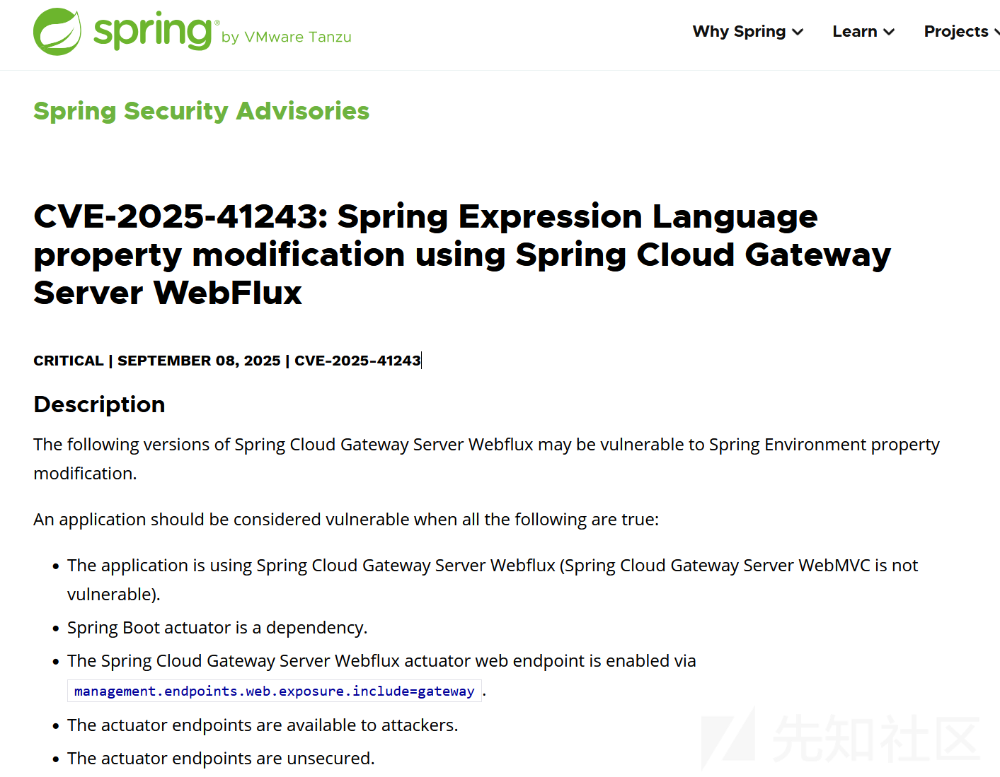

发现之前在学习 springboot 的利用时简单看了下和这个 cve 类似的一个洞， cve-2022-22947 ，当时是学了下咋打，没具体分析源码，这个满分漏洞其实就是对 2022 那个 cve 的一个，先分析下 2022 的洞，方便后续分析这个 cve

## CVE-2022-22947 SPEL RCE

环境：<https://github.com/spring-cloud/spring-cloud-gateway/>

spring-cloud-gateway-sample/src/main/java/org/springframework/cloud/gateway/sample/GatewaySampleApplication.java 可以直接启动

这里用 3.1.0 版本演示

看下官方的修复：<https://github.com/spring-cloud/spring-cloud-gateway/commit/337cef276bfd8c59fb421bfe7377a9e19c68fe1e>

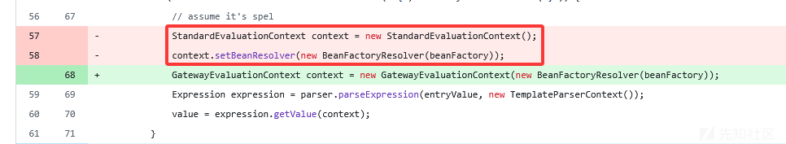

将 StandardEvaluationContext 更换为了 GatewayEvaluationContext 去执行 Spel 表达式

这段代码位于 org/springframework/cloud/gateway/support/ShortcutConfigurable.java#getValue() 方法中

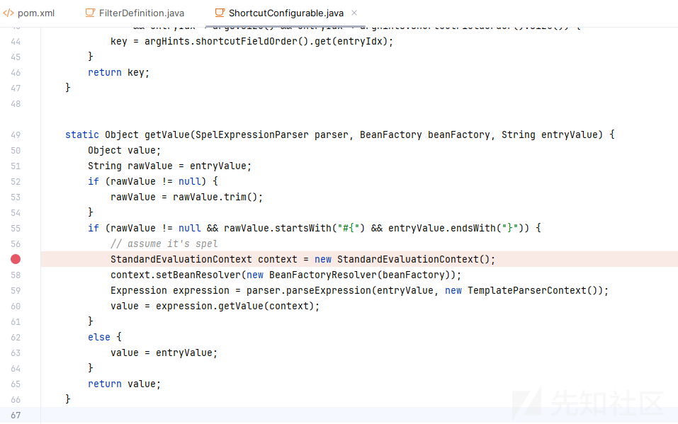

这个方法的作用判断传入的 entryValue 是否是一个 SpEL 表达式，如果是，就解析并执行 SpEL 表达式，反之直接返回原值。

有三个枚举值都调用了 getValue ，这三处就在同接口的枚举类 ShortcutType 中，这三处都重写了 normalize 函数，而且在同接口类中的 shortcutType 方法处调用了其中一个枚举值

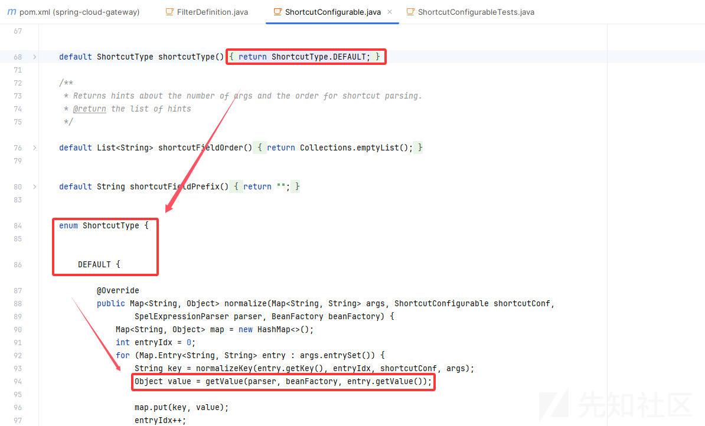

继续向上找，最终在 org/springframework/cloud/gateway/support/ConfigurationService.java#normalizeProperties 中对 filter 的配置属性进行解析，最后进入 getValue 执行 SPEL 表达式造成 SPEL 表达式注入

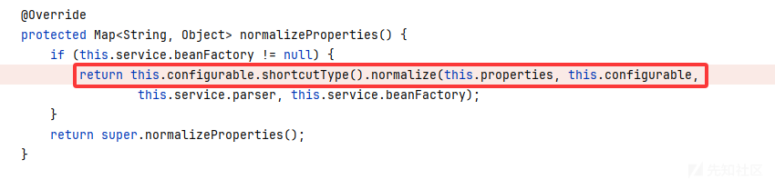

接下来看下怎么设置 filter 配置属性值，通过查看官方文档：<https://cloud.spring.io/spring-cloud-gateway/multi/multi__actuator_api.html>，发现用户可以通过 actuator 在网关中创建和删除路由（上面路由格式）

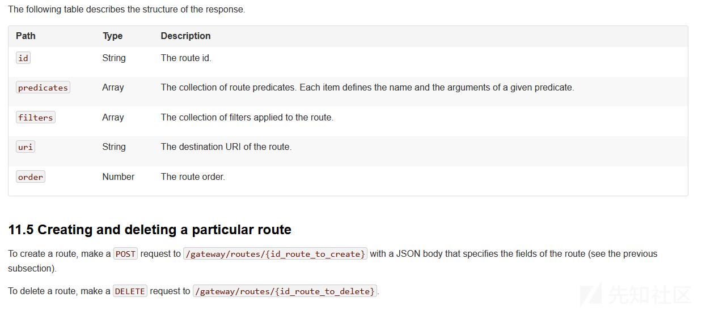

最后发现 org.springframework.cloud.gateway.actuate.AbstractGatewayControllerEndpoint#save 方法用来处理这个路由的 post 请求

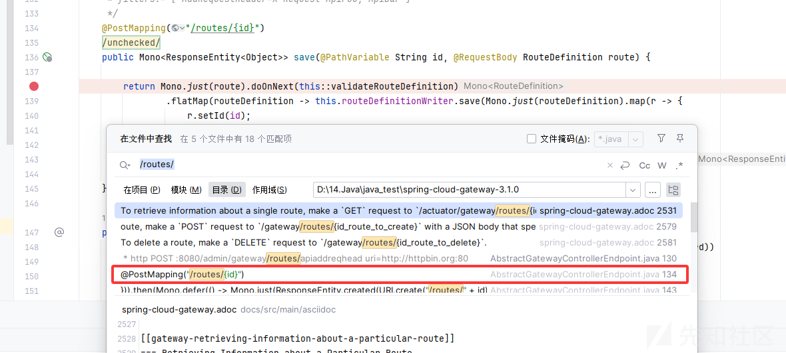

这个方法用来验证并保存路由，请求体包含需 RouteDefinition，看下 RouteDefinition

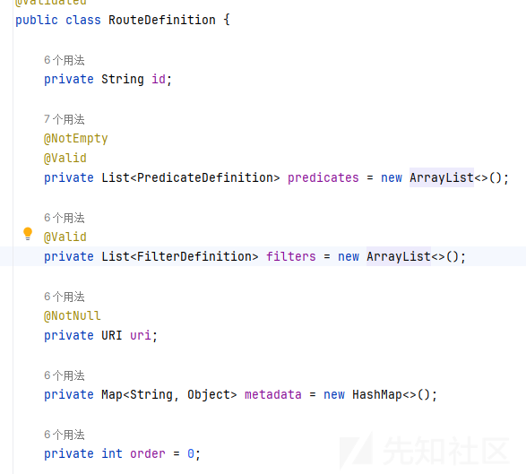

继续看下 FilterDefinition

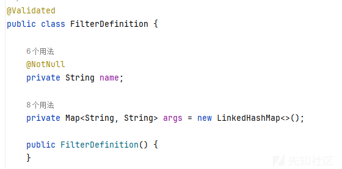

这里需要有一个 name 和 args 键值对，这里在创建路由时对 name 值进行了校验，必须是 GatewayFilters 中的某个 gatewayFilterFactory 值

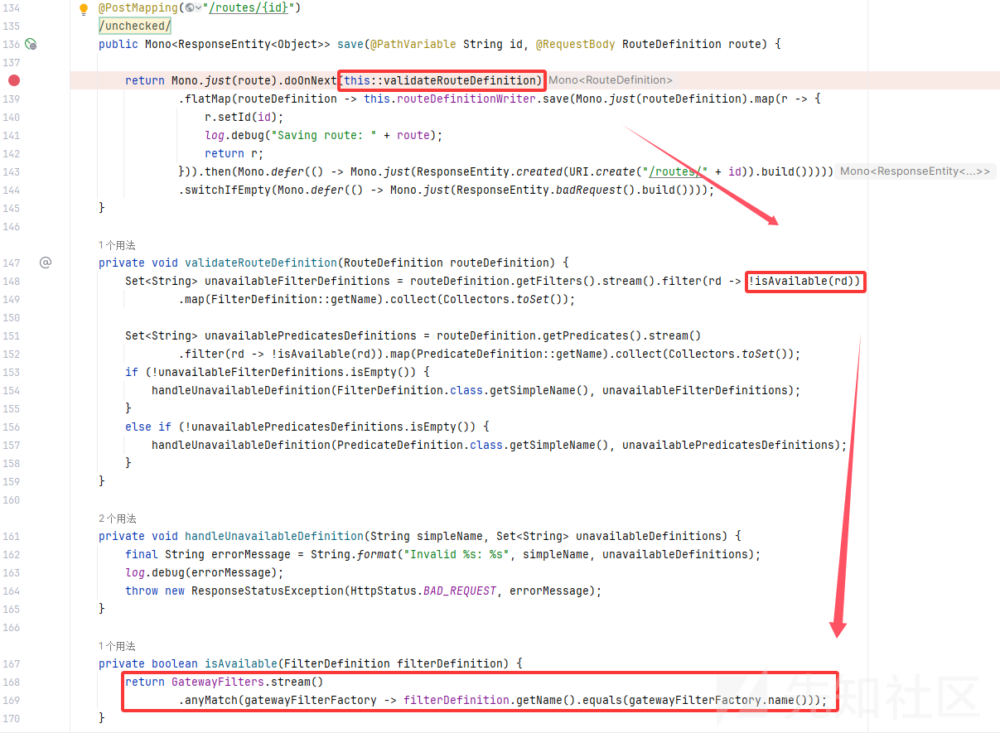

看下所有的 gatewayFilterFactory 值

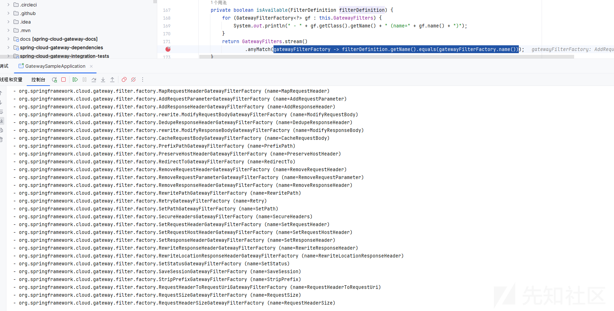

这里我们选择用 AddResponseHeader ，其 apply 方法可以将 config 的键值对添加到 header 中，访问该路由时会回显其 header 值

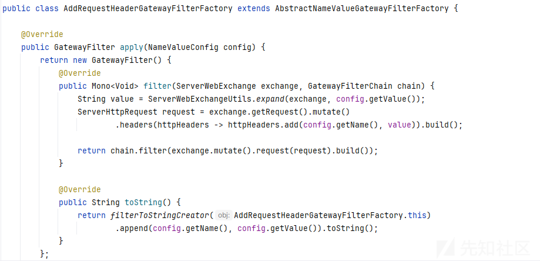

这里在添加路由时需要注意几点，一是需要传 uri 和 order 值，在org.springframework.cloud.gateway.route.Route#async 方法中对 RouteDefinition 参数进行了处理，所以必须要有 uri 和 order，不然会报空指针错误，且 uri 必须满足正常 url 格式

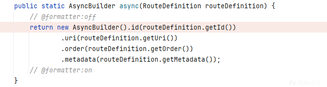

二是 AddResponseHeader 接收的值类型是 NameValueConfig ，其 value 值必须是 string

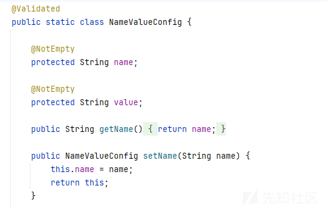

综上，先添加路由，刷新一下，访问创建好的路由就能看到回显，先是添加路由

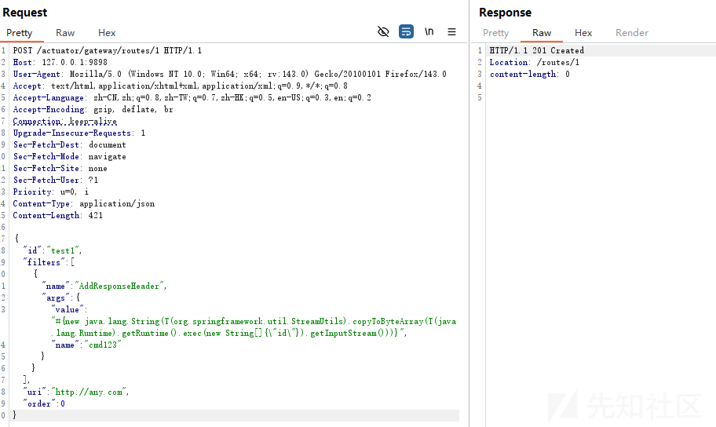

然后刷新访问即可

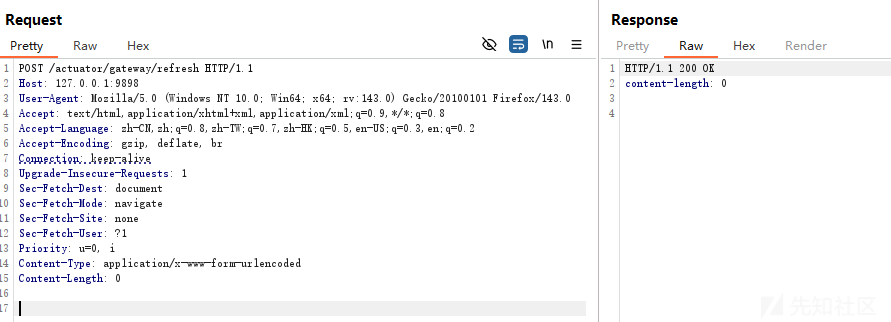

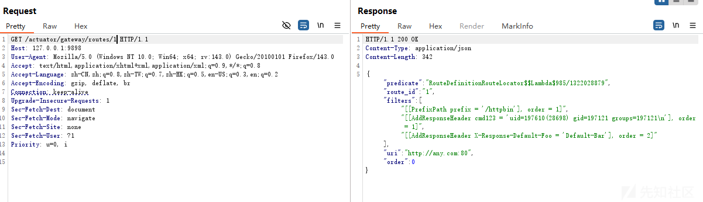

调试一下，先是在 org.springframework.cloud.gateway.support.ConfigurationService.ConfigurableBuilder#normalizeProperties 遍历 filters 属性

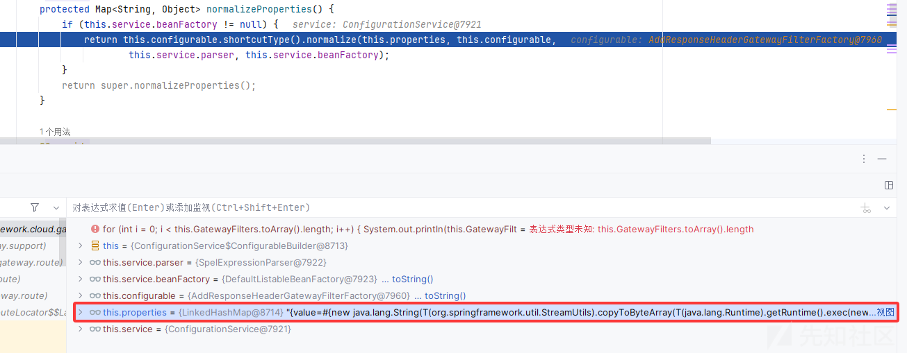

然后在 org.springframework.cloud.gateway.support.ShortcutConfigurable.ShortcutType#normalize 调用 getValue 解析属性

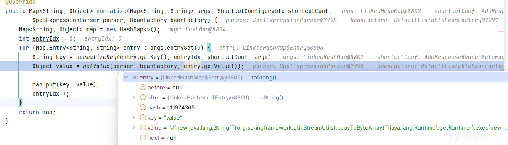

最后实现 spel 表达式注入

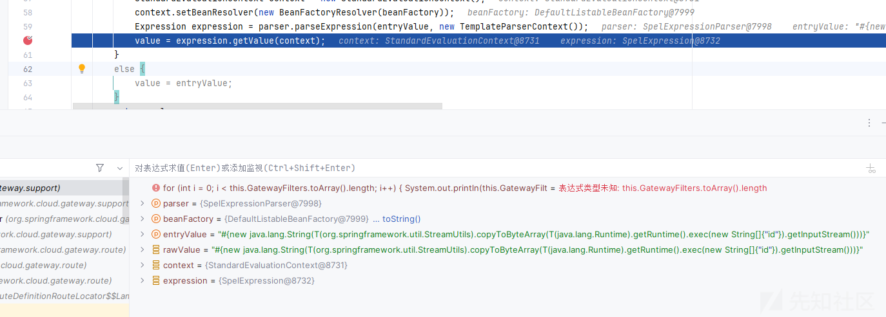

## CVE-2025-41243 SPEL Property Modification

这里以 3.1.9 版本来分析，现在是 GatewayEvaluationContext 来执行 spel 表达式，可以看到GatewayEvaluationContext 实际上是将 spel 表达式的执行委托给 [SimpleEvaluationContext](https://docs.spring.io/spring-framework/docs/current/javadoc-api/org/springframework/expression/spel/support/SimpleEvaluationContext.html)，这个类旨在仅支持 SpEL 语言语法的一个子集，它不包括 Java类型引用，构造函数和 bean 引用，所以它不像 StandardEvaluationContext 那样支持 T 操作符

并默认通过 RestrictivePropertyAccessor 进行一些额外的安全控制

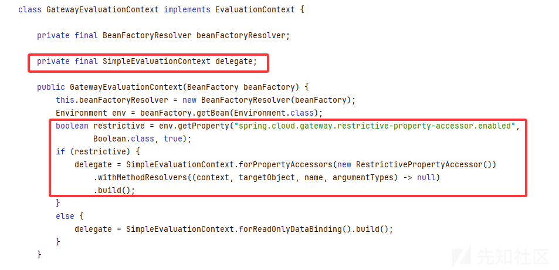

RestrictivePropertyAccessor 方法这里重写了 ReflectivePropertyAccessor 中的 canRead 方法，其作用是在执行 spel 表达式时将所有尝试读取目标对象的属性的操作都拒绝，也就是不可读

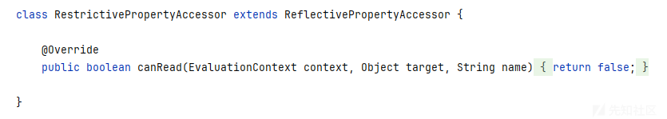

但其没有重写 canWrite 方法

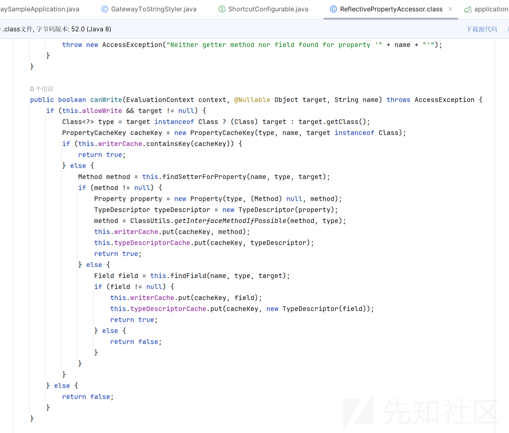

也就是说现在依旧有可写权限

SimpleEvaluationContext 可以通过 SpEL 表达式访问和调用 Spring Bean，而且这里已注册的 Bean 列表不仅限于 Spring Cloud Gateway 本身注册的 Bean，还包括 Spring Framework 核心注册的 Bean，在 application.yml 中设置

```
management:
  endpoints:
    web:
      exposure:
        include: '*' 
  endpoint:
    beans:
      enabled: true
```

访问 /actuator/beans 就可以看到所有的 bean

这里用到的是两个特殊的 bean，systemProperties 和 environment，systemProperties 可用于修改系统属性， environment 的 getPropertySources 方法可用于访问环境变量等信息

综上，答案也就呼之欲出了，先用 systemProperties 可用于修改系统属性 spring.cloud.gateway.restrictive-property-accessor.enabled 为 true，然后就可以用 getPropertySources 来访问系统属性和相关敏感信息了

先是将 restrictive 设置为 false

```
#{ @systemProperties['spring.cloud.gateway.restrictive-property-accessor.enabled'] = false}
```

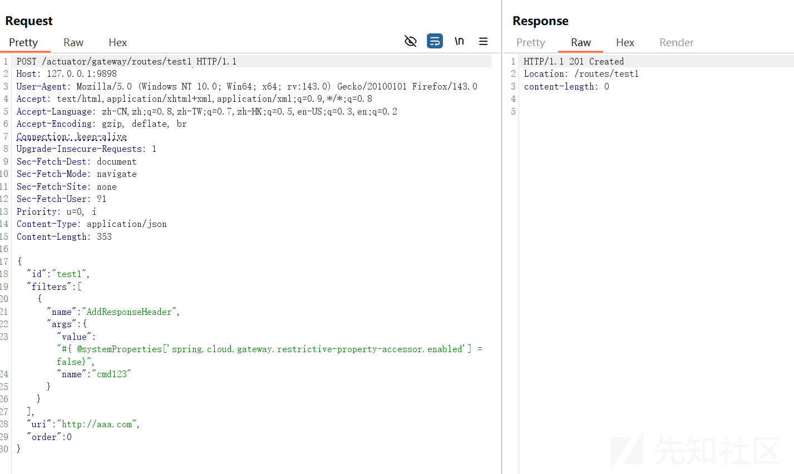

然后在 /actuator/gateway/refresh 路由刷新一下，此时就可以利用 environment.getPropertySources 去读信息了

```
#{ @environment.getPropertySources.?[#this.name matches '.*optional:classpath:.*' ][0].source.![{#this.getKey+'='+#this.getValue.toString}] }
```

​

记得刷新一下，成功读到配置信息

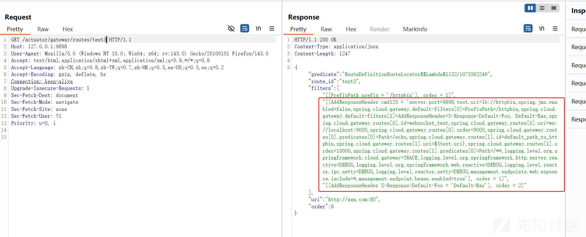

### RCE

既然可以修改系统属性了，那部分需要满足一定属性值的 rce 手法也就能打通了，如 h2 database console jndi，开启 h2 console 并允许外部访问

```
#{ @systemProperties['spring.h2.console.enabled'] = true}
#{ @systemProperties['spring.h2.console.settings.web-allow-others'] = true}
```

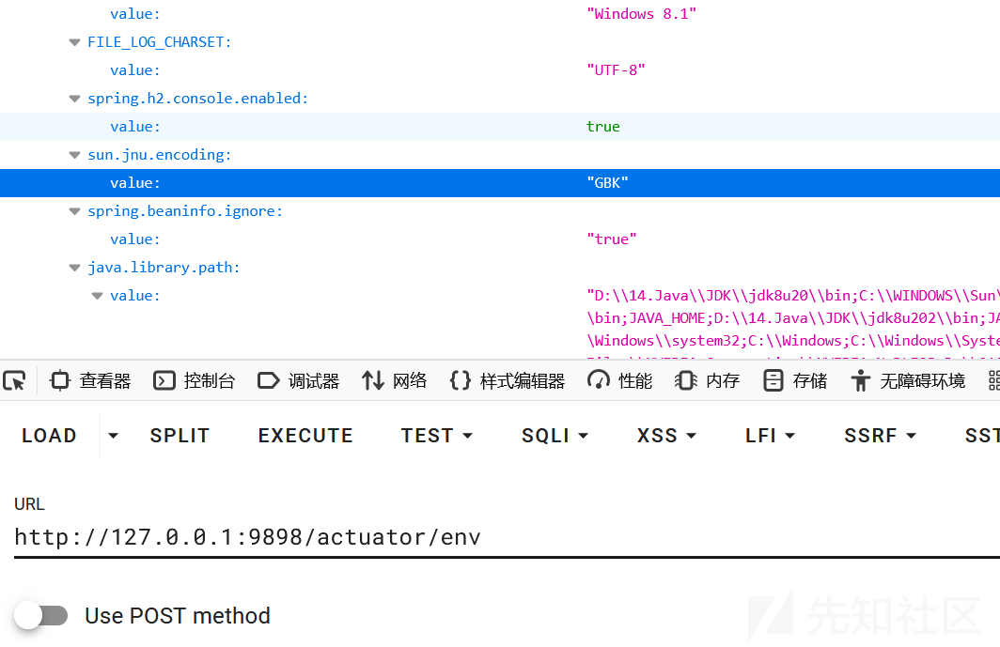

然后打 jndi

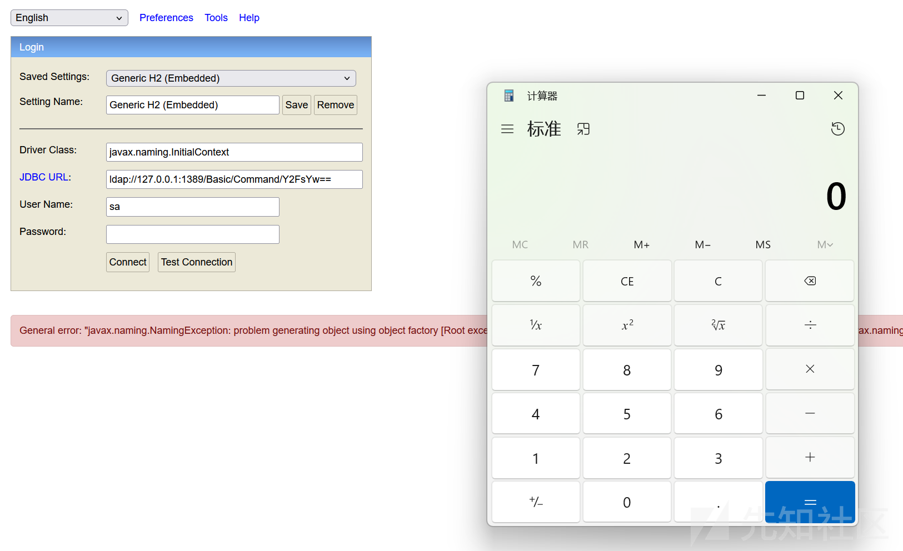

除此之外还有 jmxrmi 来 rce 等，更改需要改的属性即可，如果想要探索更多的利用方法，需要找一下恶意的 bean

### 修复

官方修复：<https://github.com/spring-cloud/spring-cloud-gateway/commit/b957599edcb26107d0e16d2675f7139a2be4d996>

构建 SimpleEvaluationContext 时新增 withAssignmentDisabled()，禁用了表达式中的赋值操作，也就是不能修改属性值了

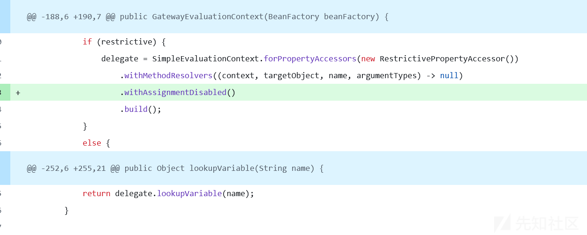

同时补充了相关委托方法，并新增方法 testNormalizeDefaultTypeWithSpelAssignmentAndInvalidInputFails 验证赋值行为被拦截

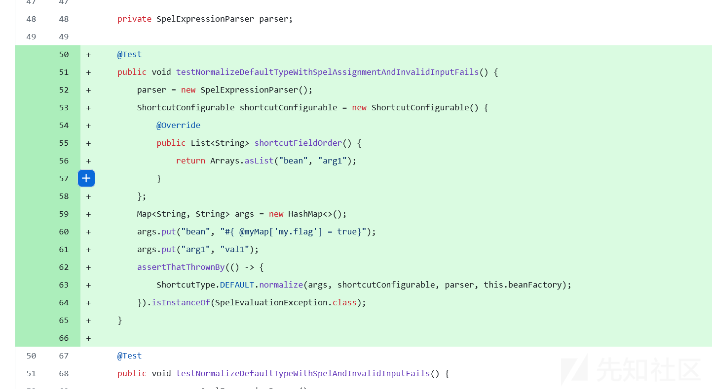

## 参考

<https://y4er.com/posts/cve-2022-22947-springcloud-gateway-spel-rce-echo-response/>

<https://blog.z3r.ru/posts/spring-cloud-gateway-spel-vuln/>
