# 某App中关键请求参数Java层面逆向分析-先知社区

> **来源**: https://xz.aliyun.com/news/19012  
> **文章ID**: 19012

---

## 一、x-bili-trace-id

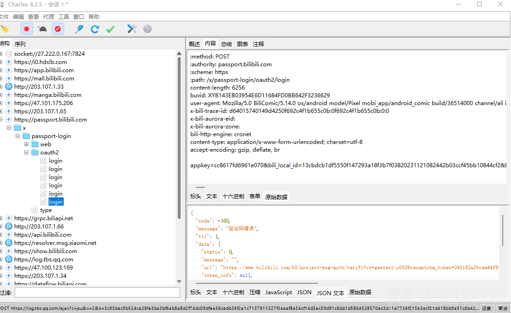

在jadx里搜索x-bili-trace-id可得

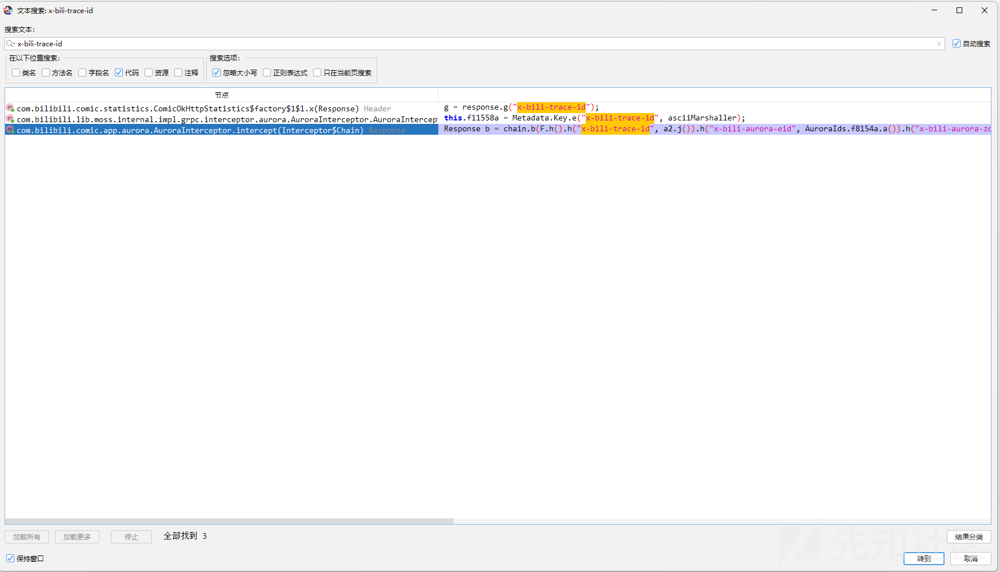进入看看

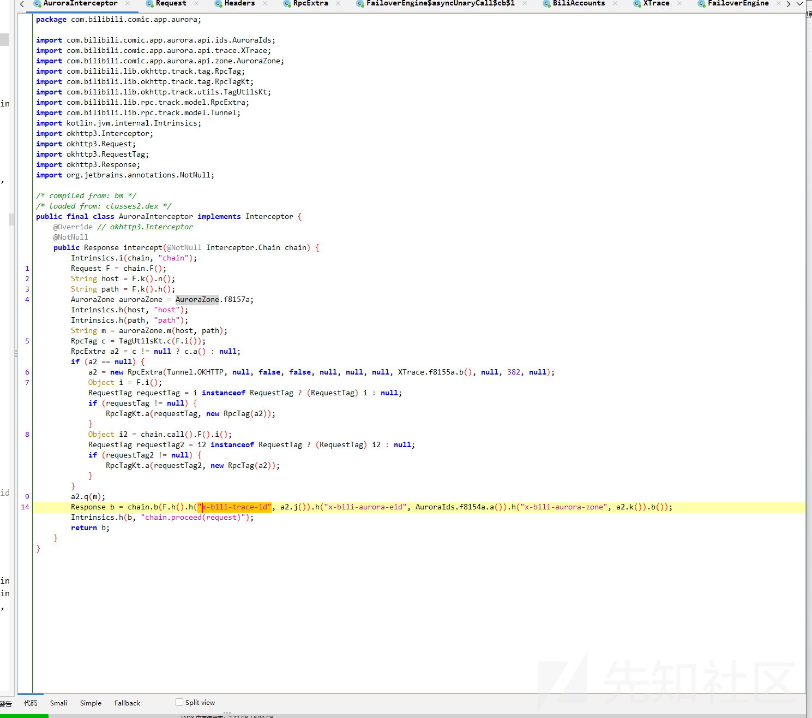

跳进j函数看看

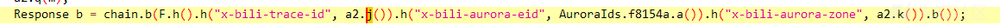

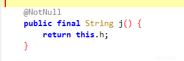

跳进h看看

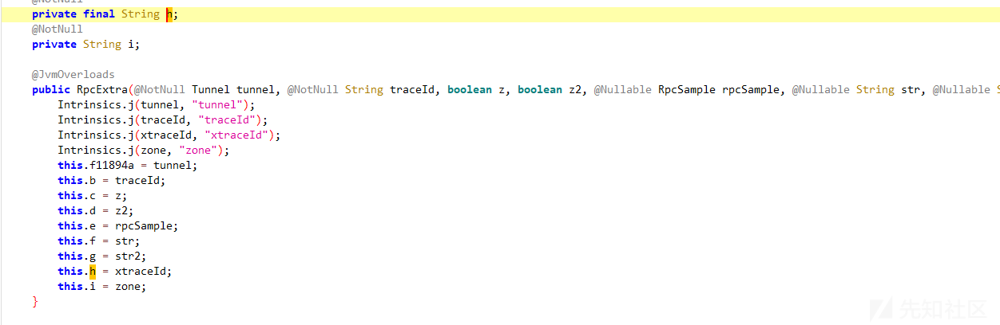

查找RpcExtra用例看看

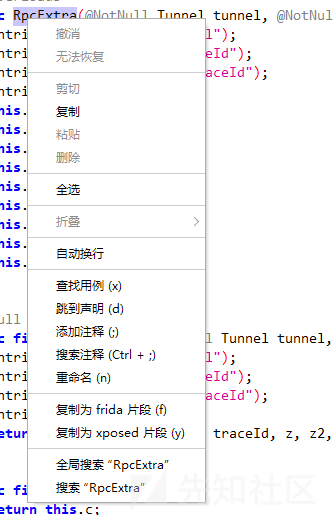

有两个。

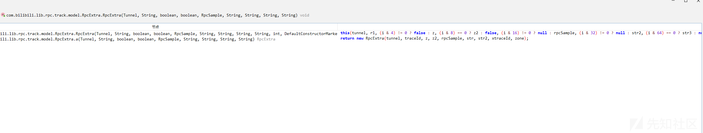

因为数量不多，可以使用frida去hook，确定为第一个

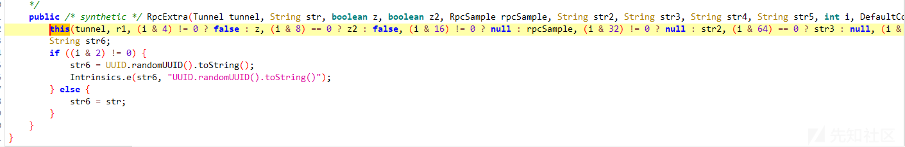

右键查看引用

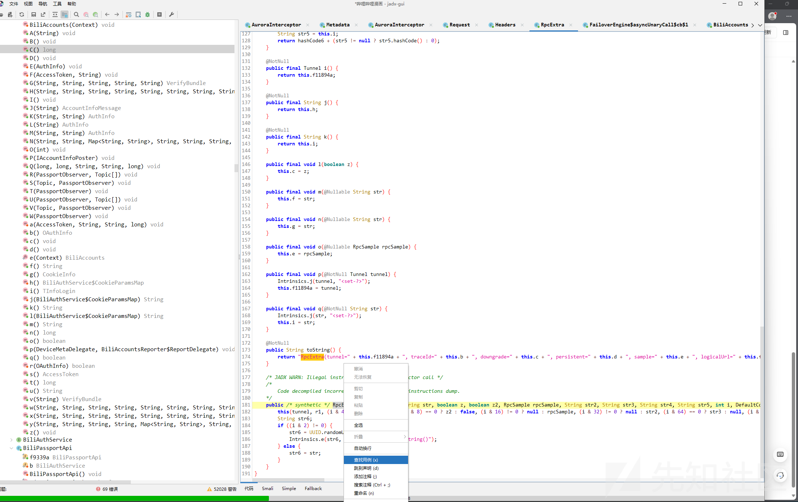

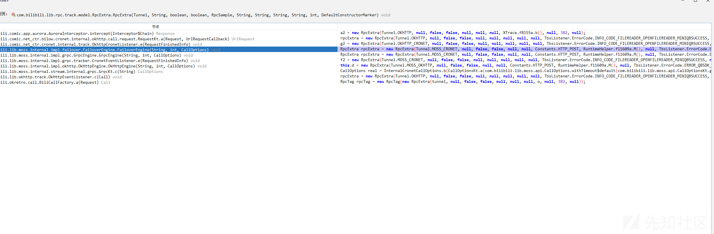

第一个非常可疑，拦截器嘛

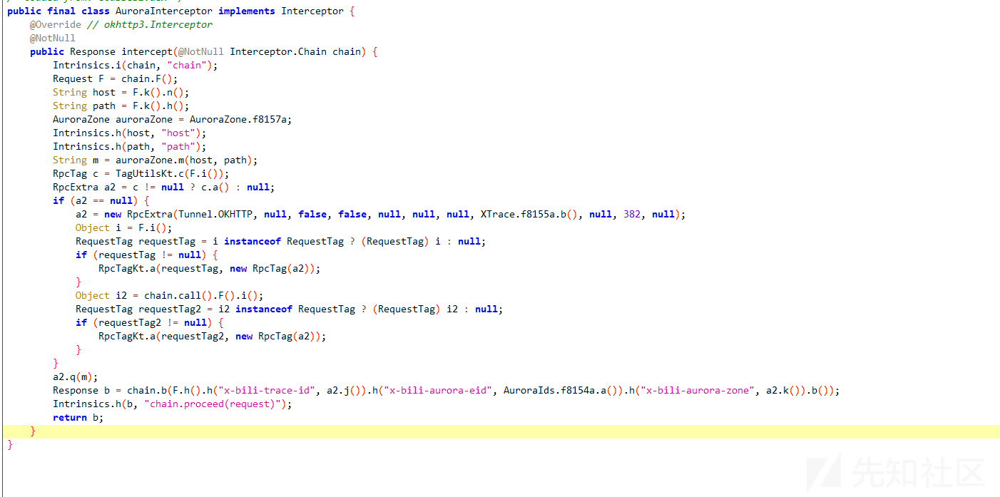

奶贝的，跑回来了，给我干无语了。继续尝试

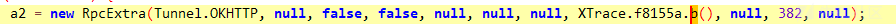

去b函数看看，一眼顶针了

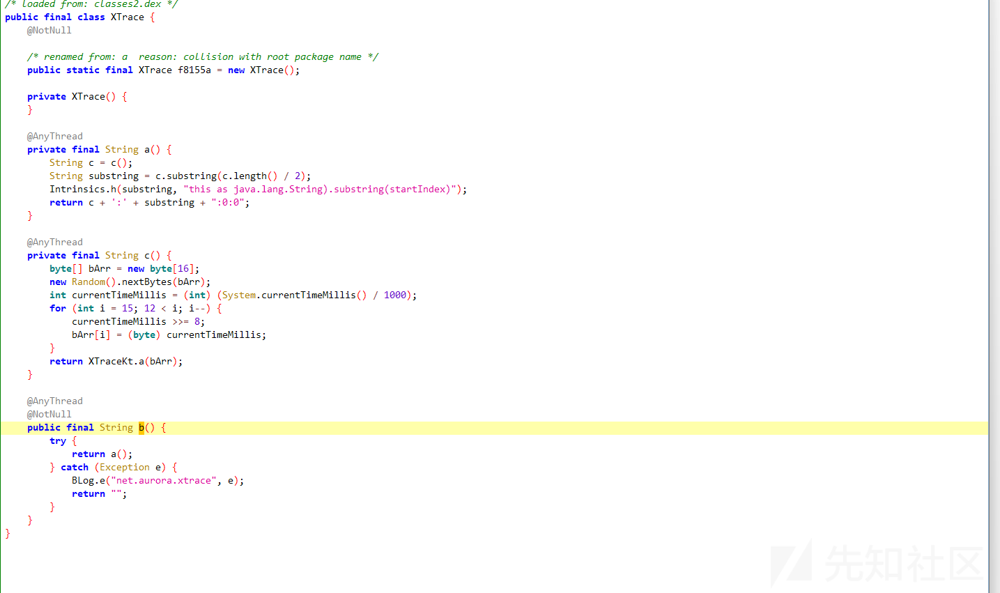

frida hook看看

```
    let XTrace = Java.use("com.bilibili.comic.app.aurora.api.trace.XTrace");
    XTrace["b"].implementation = function () {
        console.log(`XTrace.b is called`);
        let result = this["b"]();
        console.log(`XTrace.b result=${result}`);
        return result;
    };
```

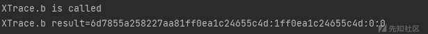

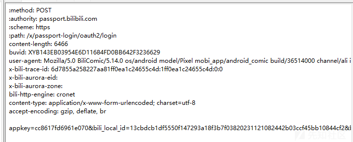

**very is it！**

先瞅瞅b方法内调用的a方法内调用的c方法：

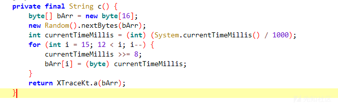

跳到XTraceKt下的a方法，可知是将字节数组转换为16进制字符串的函数,Kotlin写的。​

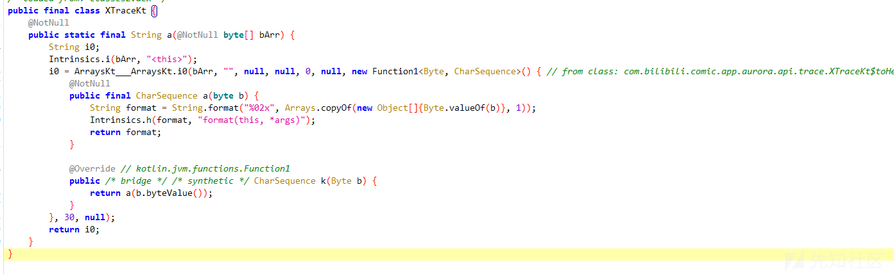

> 先定义一个16位byte数组，再Random填充随机数，还得定义获取当前时间戳，除以1000是将毫秒单位转换为秒，强转int后赋值给currentTimeMillis，最后for循环，从数组最后一个元素开始，向第13个元素位置倒序遍历。每次迭代过程中，将currentTimeMillis右移8位，得到后8位，赋值到数组的索引位置。最后调用XTraceKt下的a方法转换为16进制字符串。

继续看b方法内调用的a方法：

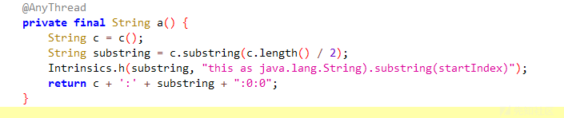

> 先取c方法生成的字符串，在切割其一半，最后返回c字符串拼接":"加上一半字符串再拼接上":0:0"

## 二、Authorization

### 搜索定位

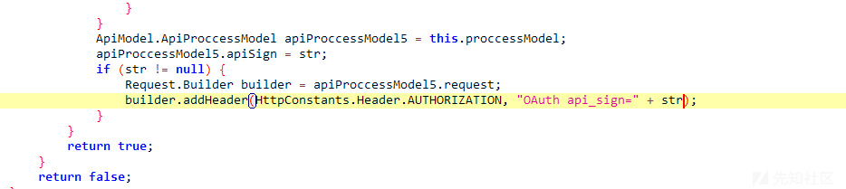

跳转寻找一下str，可知是下图方法生成


frida hook确认

```
let b = Java.use("t8.b");
b["d"].implementation = function (context, treeMap, str, str2) {
    console.log(`b.d is called: context=${context}, treeMap=${treeMap}, str=${str}, str2=${str2}`);
    let result = this["d"](context, treeMap, str, str2);
    console.log(`b.d result=${result}`);
    return result;
};
```

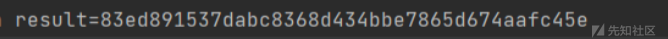

那就接着往下走吧，进入d方法看看。

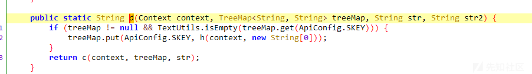

往c方法跳转

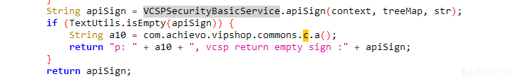

这一块是关键点，去apiSign方法里面找找看

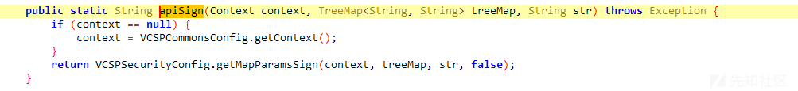

接着就是getMapParamsSign方法，找到关键点

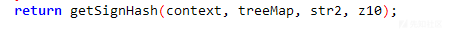

进入

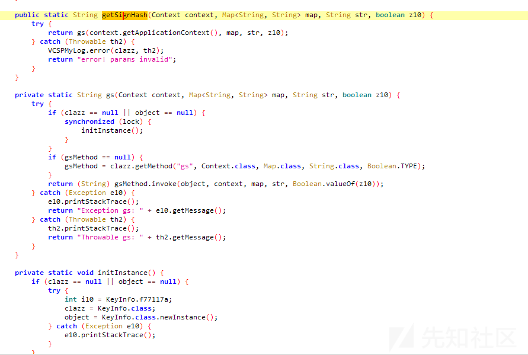

这一块比较有意思，可以简单分析一下。

> getSignHash方法返回调用了gs方法，而gs方法在下文中使用了initInstance反射初始化，最终定位反射点clazz。

进入KeyInfo中找到了gs方法

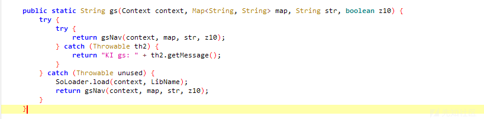

是个native方法，本篇按下不表，下次再议

## 三、key

key参数生成在com.kugou.android.app.common.comment.b.i的b方法内。

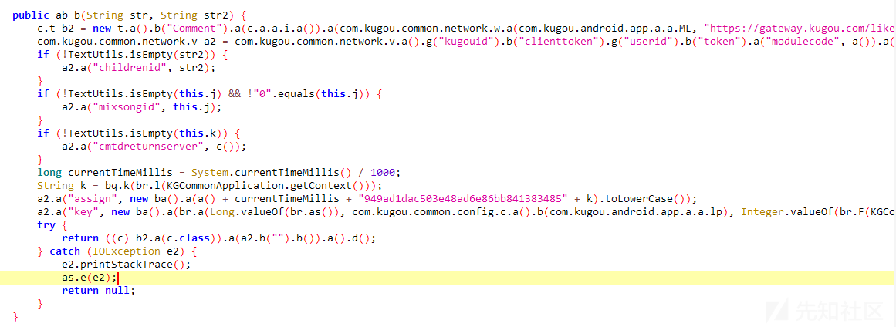

完整方法为:

```
a2.a("key", new ba().a(br.a(Long.valueOf(br.as()), com.kugou.common.config.c.a().b(com.kugou.android.app.a.a.lp), Integer.valueOf(br.F(KGCommonApplication.getContext())), Long.valueOf(currentTimeMillis))));
```

层层分解为:

```
ba().a()
```

```
br.a()
```

```
Long.valueOf(br.as()), com.kugou.common.config.c.a().b(com.kugou.android.app.a.a.lp), Integer.valueOf(br.F(KGCommonApplication.getContext())), Long.valueOf(currentTimeMillis)
```

分析as()函数:

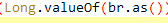、

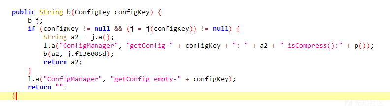

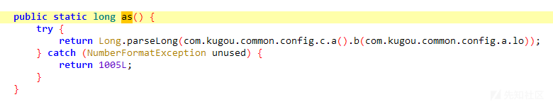

看lo的内容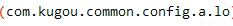：

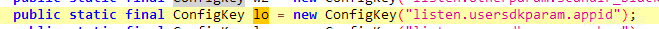

再看外围的b函数:

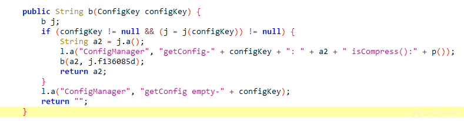

使用frida打印b函数的结果:

```
let g = Java.use("com.kugou.common.config.g");
g["b"].overload('com.kugou.common.config.ConfigKey').implementation = function (configKey) {
    console.log('b is called' + ', ' + 'configKey: ' + configKey);
    let ret = this.b(configKey);
    console.log('b ret value is ' + ret);
    return ret;
};
```

获得定值:

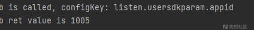

第二个参数:

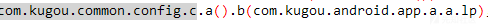

lp内容:

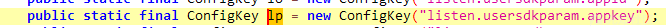

b函数和上一个一样内容:


frida打印获得结果:

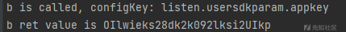

第三个参数主要内容看F函数:

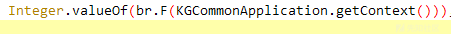

F函数的内容:

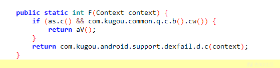

frida打印:

```
let br = Java.use("com.kugou.common.utils.br");
br["F"].overload('android.content.Context').implementation = function (context) {
    console.log('F is called' + ', ' + 'context: ' + context);
    let ret = this.F(context);
    console.log('F ret value is ' + ret);
    return ret;
};
```

获得结果，为定值:

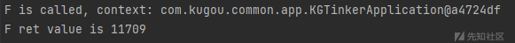

最后一个参数为时间戳:

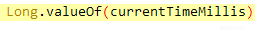

些许不同,该函数运行的结果是毫秒级别的，代码需要转换为秒级:

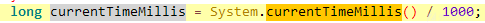

内部都分析完了，该br.a()函数了。

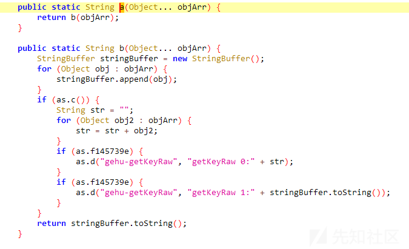

初步分析是简单的拼接，但出了小问题，在frida的过程中，莫名其妙打印不出来，比较担忧，为了确认，可以复现复现源代码。

```
package key;
public class keye {
    private static final String[] f145777e = {"0", "1", "2", "3", "4", "5", "6", "7", "8", "9", "a", "b", "c", "d","e" ,"f"};
    public static String b(Object... objArr) {
        StringBuffer stringBuffer = new StringBuffer();
        for (Object obj : objArr) {
            stringBuffer.append(obj);
        }
        if (false) {
            String str = "";
            for (Object obj2 : objArr) {
                str = str + obj2;
            }
            if (false) {
                d("gehu-getKeyRaw", "getKeyRaw 0:" + str);
            }
            if (false) {
                d("gehu-getKeyRaw", "getKeyRaw 1:" + stringBuffer.toString());
            }
        }
        return stringBuffer.toString();

    }


    public static void d(String str, String str2) {
        if (false) {
            String str3 = "";
            if (false) {
                if (str2 != null) {
                    str3 = str2 + a(4);
                }
                System.out.println("str ="+str);
                System.out.println("str3 ="+ str3);
                return;
            }
            if (str2 != null) {
                str3 = str2 + a(4);
            }
            System.out.println("str ="+str);
            System.out.println("str3 ="+ str3);

        }
    }


    private static String a(byte b2) {
        int i = 0;
        if (b2 < 0) {
            i = b2 + 256;
        }
        return f145777e[i / 16] + f145777e[i % 16];
    }


    private static String a(int i2) {
        StackTraceElement[] stackTrace;
        if (false && (stackTrace = Thread.currentThread().getStackTrace()) != null && i2 >= 0 && i2 < stackTrace.length) {
            return "
==> at " + stackTrace[i2];
        }
        return "";
    }
    public static void main(String[] args) {
        Object[] objArr = new Object[4];

        long currentTimeMillis = System.currentTimeMillis() / 1000;
        keye kk = new keye();
        long as = Long.valueOf(1005);
        String lp = "OIlwieks28dk2k092lksi2UIkp";
        int f = Integer.valueOf(11709);
        long time = Long.valueOf(currentTimeMillis);
        objArr[0] = as;
        objArr[1] = lp;
        objArr[2] = f;
        objArr[3] = time;
        String res = kk.b(objArr);
        System.out.println(res);


    }

}
```

打印发现:

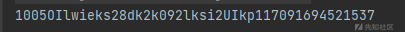

最外围的a函数，是md5加密:

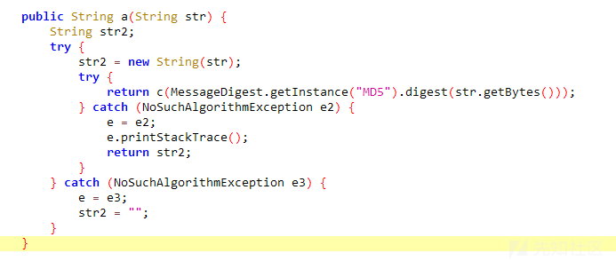

md5加密后的哈希字节数组传入c函数:

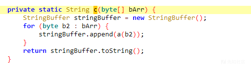

再遍历数组后将每个函数传入a方法内:

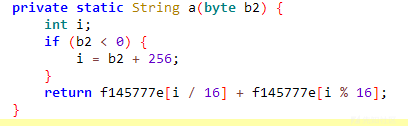

a方法将输入的字节表示为十六进制的字符串形式，将字节值拆分为两个十六进制字符，并以字符串形式返回它们拼接的结果。

**——————————————————————————————————————————————**

文章结束，差强人意，但还能更好。

继续学习，再接再厉。
