# 某行业赛MISC部分题解-先知社区

> **来源**: https://xz.aliyun.com/news/19014  
> **文章ID**: 19014

---

## MISC1

题目描述

> 某日,公司入侵检测系统检测到公司某服务器存在异常的访问流量,根据安全工程师确认,该服务器确有遭到入侵,于是公司立刻安全服务器管理人员你和小明对该事件着手调查。接到通知后,你们立即对服务器进行了取证处理,并在服务器的日志留存中找到了攻击者的访问记录,你们对此开展了进一步的调查!将攻击者的IP作为答案提交

提示是Redis未授权访问数据分析

文件结构如下

```
├── access.log
├── access_1.log
├── error.log
├── redis-server.log
```

已经确认被入侵，故优先查看access.log。

先统计IP出现次数

```
$ grep -Eo '([0-9]{1,3}\.){3}[0-9]{1,3}' access.log | sort | uniq -c | sort -nr
   8715 100.13.14.103
   2298 201.21.111.152
   2115 192.168.0.1
   2072 101.212.10.12
   1982 11.21.211.156
   1442 110.11.10.123
   1205 211.201.211.156
   1155 101.212.10.15
    785 101.221.101.15
    765 211.201.211.155
    218 201.21.111.151
    201 101.212.10.123
    135 92.18.184.103
    128 201.21.111.155
     12 2.11.8.1
      8 2.11.7.1
      4 2.8.0.4
      4 2.8.0.3
      4 2.8.0.2
      4 2.8.0.1
      4 2.11.5.1
      1 122.16.184.20
      
$ grep -Eo '([0-9]{1,3}\.){3}[0-9]{1,3}' access_1.log | sort | uniq -c | sort -nr
 179323 192.168.184.1
 179320 108.0.0.0
 179313 192.168.184.176
     58 192.168.184.169
```

其中122.16.184.20仅出现了一次，优先确认

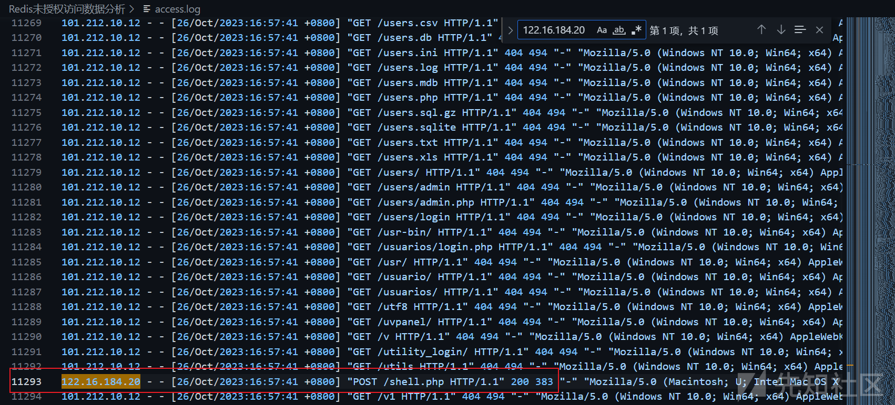

访问了shell.php且状态码为200，确认为攻击者的IP。

flag{122.16.184.20}

## MISC2

题目描述

> 背景:  
> 公司内网的一台 MySQL服务器在 2023-10-26 下午 出现数据异常，怀疑遭受恶意攻击。作为运维工程师，你需要通过分析 MySQL 的错误日志，排查可能的攻击行为。  
> 任务要求:  
> 1、定位 MySQL 错误日志文件  
> 请找出该日志文件的文件名(全小写格式，如error.log或 mysqld.log)  
> 2、 分析攻击源 IP，(如暴力破解)。  
> 检查日志中是否存在大量异常登录尝试找攻击源 IP 地址(如 192.168.1.100)  
> 3、 确定爆破成功的时间  
> 如果攻击者成功登录数据库，请从日志中提取首次爆破成功的本地时间(格式: 2023-10-26 15:30:45)提交内容:请根据以上信息，完成攻击溯源分析，并将三个参数组合作为答案提交。

题目文件结构如下

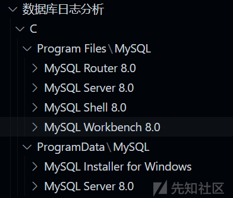

直接给了MySQL在Windows系统上的安装目录结构。

如果不熟悉结构的话，可以使用tree命令输出文件树后，发送给AI。效果如下


### 问1

MySQL 的日志文件（如错误日志、慢查询日志等）默认位于 **MySQL 的数据目录** 中。这个数据目录的默认路径通常是：

`C:ProgramDataMySQLMySQL Server 8.0Data`。

显然错误日志文件名为`err`。

### 问2

general是通用查询日志，它记录所有连接到 MySQL 服务器的连接尝试和客户端执行的所有 SQL 语句。

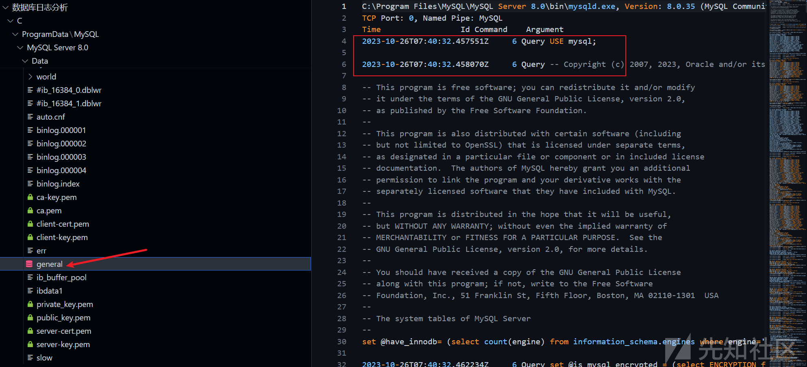

还是先做IP统计筛选：

```
$  grep -Eo '([0-9]{1,3}\.){3}[0-9]{1,3}' general | sort | uniq -c | sort -nr
   1373 10.10.88.101
     12 10.0.5.9
      2 127.0.0.1
      1 198.51.100.106
      1 198.51.100.103
      1 10.0.5.256
      1 10.0.0.1
```

发现10.10.88.101大量出现，跟进确认10.10.88.101为攻击源IP。

```
2023-10-26T08:13:13.166902Z	   10 Connect	root@localhost on  using SSL/TLS
2023-10-26T08:13:13.166980Z	   10 Connect	Access denied for user 'root'@'localhost' (using password: NO)
2023-10-26T08:13:25.911058Z	    9 Connect	webuser@10.10.88.101 on -V using TCP/IP
2023-10-26T08:13:25.911109Z	    9 Connect	Access denied for user 'webuser'@'10.10.88.101' (using password: YES)
2023-10-26T08:13:42.721296Z	   12 Connect	webuser@10.10.88.101 on -V using TCP/IP
2023-10-26T08:13:42.721350Z	   12 Connect	Access denied for user 'webuser'@'10.10.88.101' (using password: YES)
2023-10-26T08:13:42.971008Z	   14 Connect	webuser@10.10.88.101 on -V using TCP/IP
```

### 问3

已知登录成功，推测进入数据库一定会进行查表操作，筛选关键词“SHOW VARIABLES”

```
$ grep "SHOW VARIABLES" general
2023-10-26T07:40:33.644067Z         6 Query     INSERT INTO help_topic (help_topic_id,help_category_id,name,description,example,url) VALUES (686,3,'SHOW VARIABLES','Syntax:
SHOW [GLOBAL | SESSION] VARIABLES
    [LIKE \'pattern\' | WHERE expr]

SHOW VARIABLES shows the values of MySQL system variables (see
https://dev.mysql.com/doc/refman/8.0/en/server-system-variables.html).
This statement does not require any privilege. It requires only the
ability to connect to the server.

System variable information is also available from these sources:

o Performance Schema tables. See
  https://dev.mysql.com/doc/refman/8.0/en/performance-schema-system-var
  iable-tables.html.

o The mysqladmin variables command. See
  https://dev.mysql.com/doc/refman/8.0/en/mysqladmin.html.

For SHOW VARIABLES, a LIKE clause, if present, indicates which variable
names to match. A WHERE clause can be given to select rows using more
general conditions, as discussed in
https://dev.mysql.com/doc/refman/8.0/en/extended-show.html.

SHOW VARIABLES accepts an optional GLOBAL or SESSION variable scope
modifier:

o With a GLOBAL modifier, the statement displays global system variable
  values. These are the values used to initialize the corresponding
  session variables for new connections to MySQL. If a variable has no
  global value, no value is displayed.

o With a SESSION modifier, the statement displays the system variable
  values that are in effect for the current connection. If a variable
  has no session value, the global value is displayed. LOCAL is a
  synonym for SESSION.

o If no modifier is present, the default is SESSION.

The scope for each system variable is listed at
https://dev.mysql.com/doc/refman/8.0/en/server-system-variables.html.

SHOW VARIABLES is subject to a version-dependent display-width limit.
For variables with very long values that are not completely displayed,
use SELECT as a workaround. For example:

SELECT @@GLOBAL.innodb_data_file_path;

Most system variables can be set at server startup (read-only variables
such as version_comment are exceptions). Many can be changed at runtime
with the SET statement. See
https://dev.mysql.com/doc/refman/8.0/en/using-system-variables.html,
and [HELP SET].

With a LIKE clause, the statement displays only rows for those
variables with names that match the pattern. To obtain the row for a
specific variable, use a LIKE clause as shown:

SHOW VARIABLES LIKE \'max_join_size\';
SHOW SESSION VARIABLES LIKE \'max_join_size\';

To get a list of variables whose name match a pattern, use the %
wildcard character in a LIKE clause:

SHOW VARIABLES LIKE \'%size%\';
SHOW GLOBAL VARIABLES LIKE \'%size%\';

Wildcard characters can be used in any position within the pattern to
be matched. Strictly speaking, because _ is a wildcard that matches any
single character, you should escape it as \_ to match it literally. In
practice, this is rarely necessary.

URL: https://dev.mysql.com/doc/refman/8.0/en/show-variables.html

','','https://dev.mysql.com/doc/refman/8.0/en/show-variables.html');
2023-10-26T07:43:35.581975Z        24 Query     SHOW VARIABLES
2023-10-26T07:45:54.285218Z        29 Query     SHOW VARIABLES
2023-10-26T08:13:51.607446Z       585 Query     SHOW VARIABLES
```

在文件中查看上下文二次确认，爆破成功时间为2023-10-26 08:13:51。

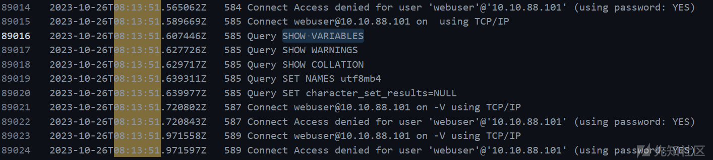

注意这里要+8转换成北京时间。

得到最终flag：flag{err\_10.10.88.101\_2023-10-26\_16:13:51}

## MISC3

题目描述

> 某公司安全设备告警了大量可疑流量,通过初步排查发现备份数据库可能遭到泄漏,请你对这起数据安全事件进行一个分析和取证。提交flag格式:flag{md5加密(泄漏有效用户身份证的数量:黄燕的身份证)}

流48得到密钥，是冰蝎默认key

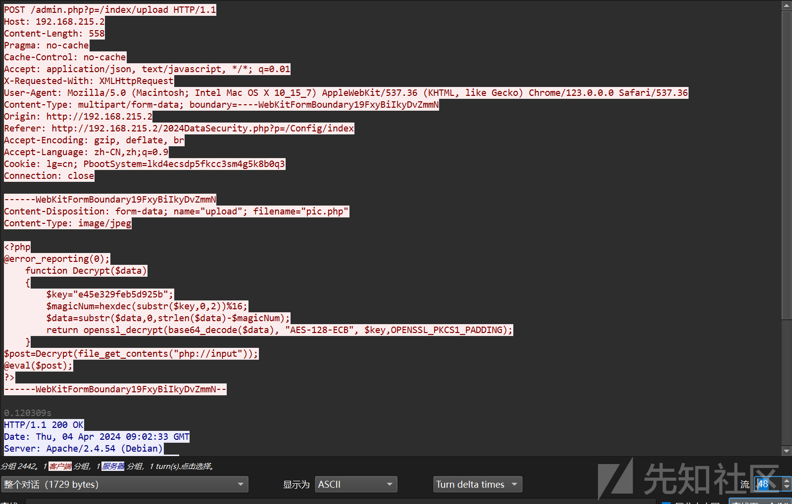

逐个查看可以得到数据库配置信息(流59)

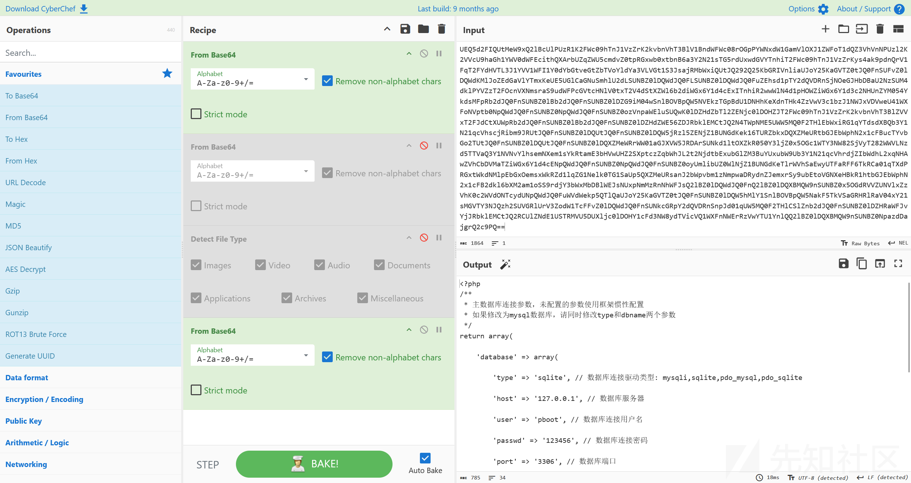

```
<?php
/**
 * 主数据库连接参数，未配置的参数使用框架惯性配置
 * 如果修改为mysql数据库，请同时修改type和dbname两个参数
 */
return array(
    
    'database' => array(
        
        'type' => 'sqlite', // 数据库连接驱动类型: mysqli,sqlite,pdo_mysql,pdo_sqlite
        
        'host' => '127.0.0.1', // 数据库服务器
        
        'user' => 'pboot', // 数据库连接用户名
        
        'passwd' => '123456', // 数据库连接密码
        
        'port' => '3306', // 数据库端口
        
        //'dbname' => 'pbootcms' // 去掉注释，启用mysql数据库，注意修改前面的连接信息及type为mysqli
        
        'dbname' => '/data/d5d4340d23089fdc6d9e795d60b7f368.db' // 去掉注释，启用Sqlite数据库，注意修改type为sqlite
        
    ),
    // AES加密配置
    'aes' => array(
        'key' => '2024DataSecurity', // AES密钥
        'iv' => '2024', // IV
        'method' => 'AES-128-CBC', //数据库加密方式
    ),
    
);
?>
```

流62传输了很大的gzip数据，导出来

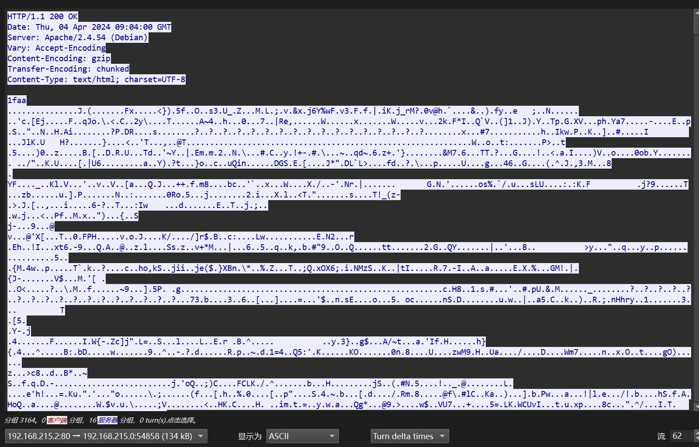

转为原始数据，如下图所示层层解密

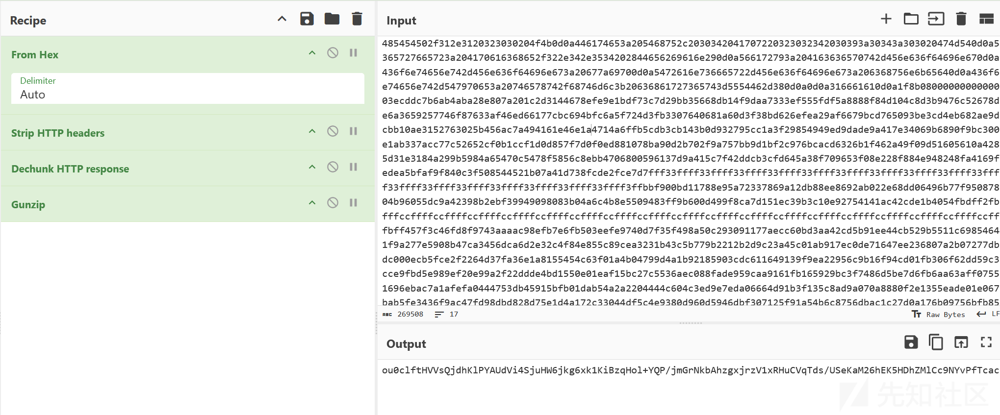

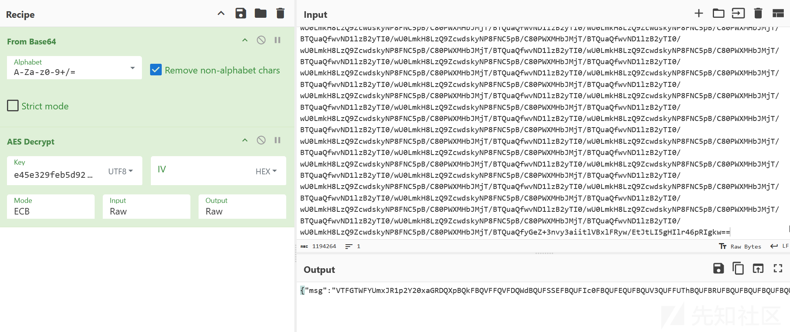

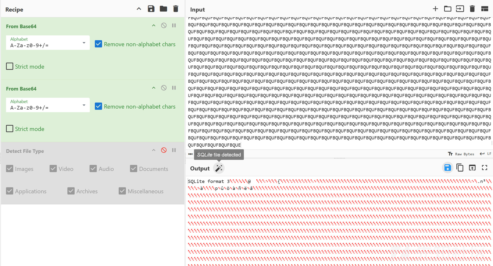

得到SQLite文件，导入navicat

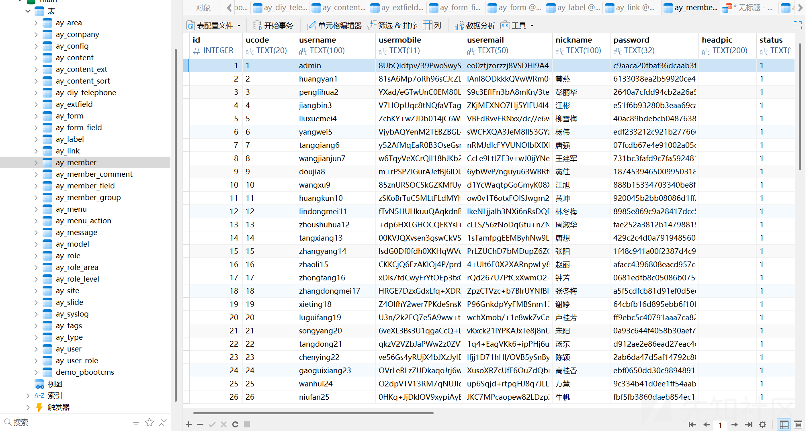

拿到黄燕的身份证，再通过数据库配置中的aeskey和vi解密

```
import base64
from Crypto.Cipher import AES
from Crypto.Util.Padding import unpad

# 密文
encrypted_data = "AwzqHMb3htntFHkwB4rDdJ3+y69ajMUZHiwRUGfk18E="

# 密钥和 IV
key = "2024DataSecurity".encode('utf-8')  # 16字节（AES-128）
iv = "2024".encode('utf-8').ljust(16, b'\0')  # IV 必须是16字节，不足补零

# Base64 解码
encrypted_bytes = base64.b64decode(encrypted_data)

# AES-128-CBC 解密
cipher = AES.new(key, AES.MODE_CBC, iv)
decrypted = cipher.decrypt(encrypted_bytes)

# 去除 PKCS#7 填充
plaintext = unpad(decrypted, AES.block_size).decode('utf-8')

print("解密结果:", plaintext)
#31010119841012143X
```

减去管理员，泄露50个用户

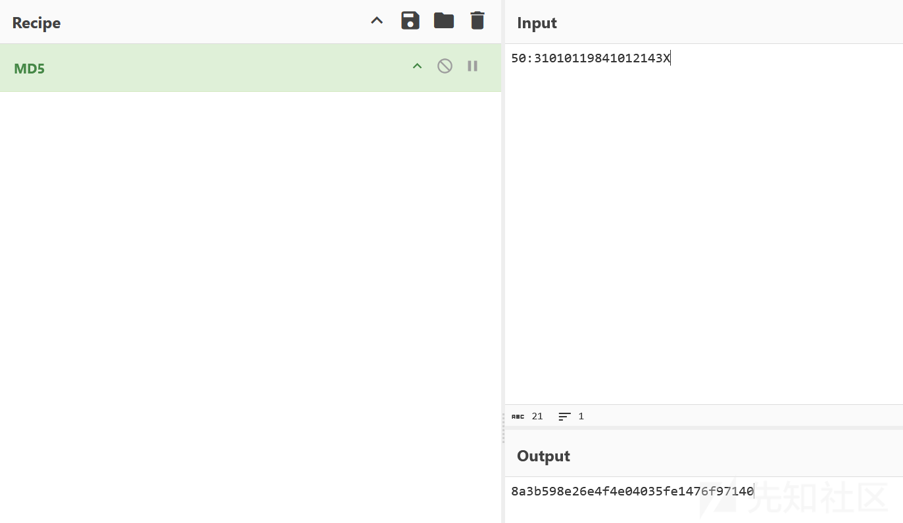

flag{8a3b598e26e4f4e04035fe1476f97140}

## MISC4

```
环境：
administrator/1q2w3e4r?
RDP 连接端口3389
```

### 问1

注册表权限维持

```
Run注册键
HKEY_CURRENT_USER＼Software＼Microsoft＼Windows＼CurrentVersion＼Run
HKEY_LOCAL_MACHINE＼Software＼Microsoft＼Windows＼CurrentVersion＼Run
Run是自动运行程序最常用的注册键，HKEY_CURRENT_USER下面的Run键紧接HKEY_LOCAL_MACHINE下面的Run键运行，但两者都在处理“启动”文件夹之前。
```

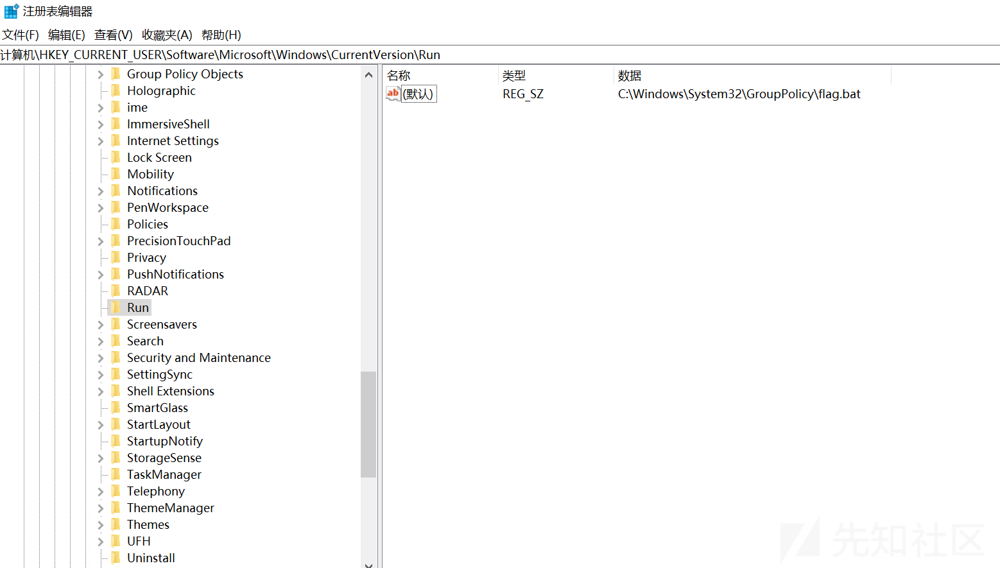

查看，在C:WindowsSystem32GroupPolicy下有flag.bat

这个目录 是 Windows 系统中存储 **本地组策略（Local Group Policy）配置** 的核心目录，主要用于管理和应用计算机本地的策略设置 。

在首次登录时，WIN+R打开

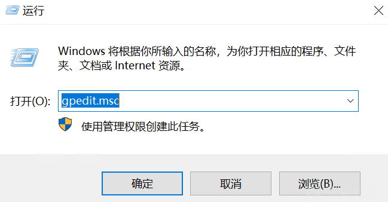

默认展示的就有gpedit.msc

> `gpedit.msc` 是 **Windows 本地组策略编辑器**（Local Group Policy Editor）的微软管理控制台（MMC）文件，用于配置和管理计算机的本地组策略设置。

所以也提示了我们他此路径下可能存在变动。

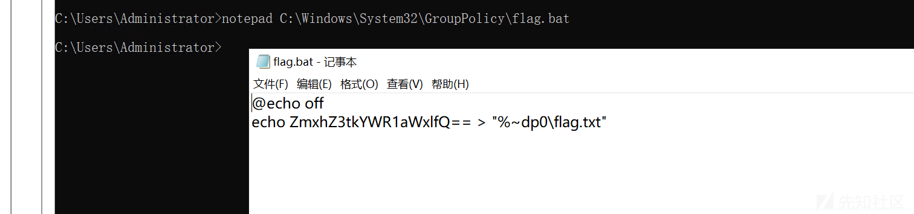

flag{daduile}

也解释一下这个脚本

```
@echo off
● 作用：关闭命令回显，执行时不会显示脚本的具体命令（仅显示结果）。
● 说明：@ 表示当前行不显示，echo off 表示后续命令不显示。

> "%~dp0\flag.txt"
● >：将 echo 的输出重定向到文件（覆盖写入）。
● "%~dp0\flag.txt"： 
  ○ %~dp0 是批处理脚本的特殊变量，表示当前脚本所在的目录路径。
```

### 问2

计划任务权限维持

查看所有计划任务

```
schtasks /query
```

把结果发给ai分析

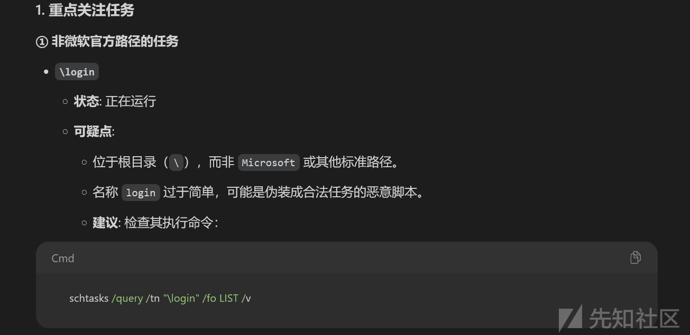

```
C:\Users\Administrator>schtasks /query /tn "\login" /fo LIST /v

文件夹: \
主机名:                             WIN-4K8FN05NEAI
任务名:                             \login
下次运行时间:                       2025/7/17 22:40:00
模式:                               正在运行
登录状态:                           交互方式/后台方式
上次运行时间:                       2025/7/17 22:39:00
上次结果:                           -2147020576
创建者:                             WIN-4K8FN05NEAI\Administrator
要运行的任务:                       C:\Program Files\windows nt\accessories\w0rdpad.exe
起始于:                             N/A
注释:                               N/A
计划任务状态:                       已启用
空闲时间:                           已禁用
电源管理:                           在电池模式停止, 不用电池启动
作为用户运行:                       SYSTEM
删除没有计划的任务:                 已禁用
如果运行了 X 小时 X 分钟，停止任务: 72:00:00
计划:                               计划数据在此格式中不可用。
计划类型:                           一次性, 分钟
开始时间:                           13:38:00
开始日期:                           2025/2/23
结束日期:                           N/A
天:                                 N/A
月:                                 N/A
重复: 每:                           0 小时， 1 分钟
重复: 截止: 时间:                   无
重复: 截止: 持续时间:               已禁用
重复: 如果还在运行，停止:           已禁用
```

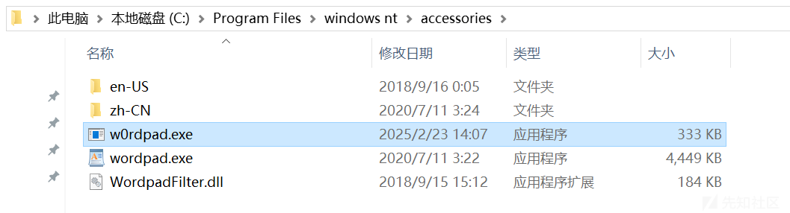wordpad.exe是富文本编辑器，显然w0rdpad.exe是可疑exe

放入云沙箱

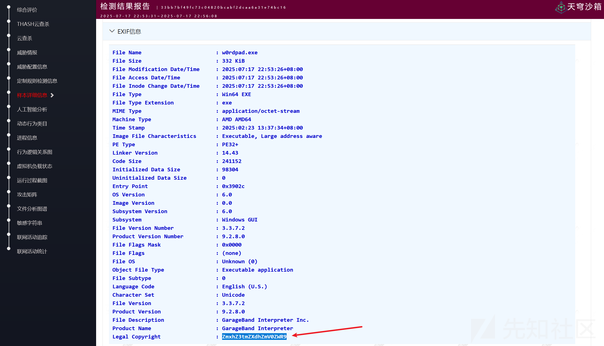flag在EXIF信息中

flag{fewafeted}

### 问3

自启动服务权限维持

```
sc query state= all
```

查询系统中所有服务的状态信息。

同样的发个ai分析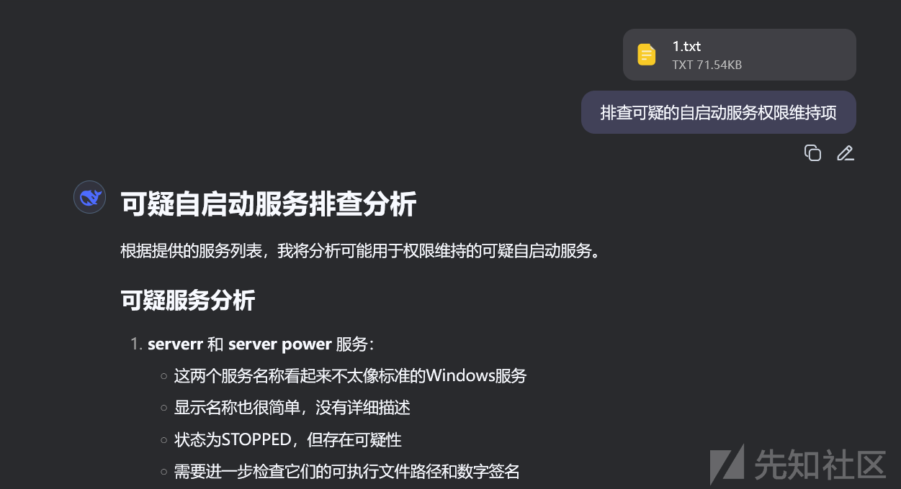跟进查看serverr

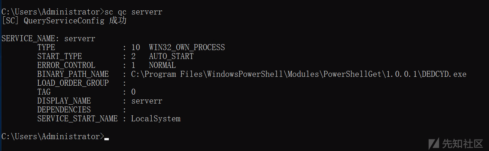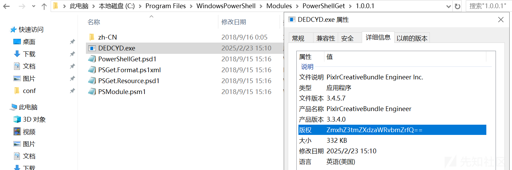

flag{fewsidonfk}

## MISC5

> 密钥隐藏在 Image 中。探索图像以查找密钥。

RS扫描，发现在Images文件夹中图片0被删了，但是有Thumbs.db。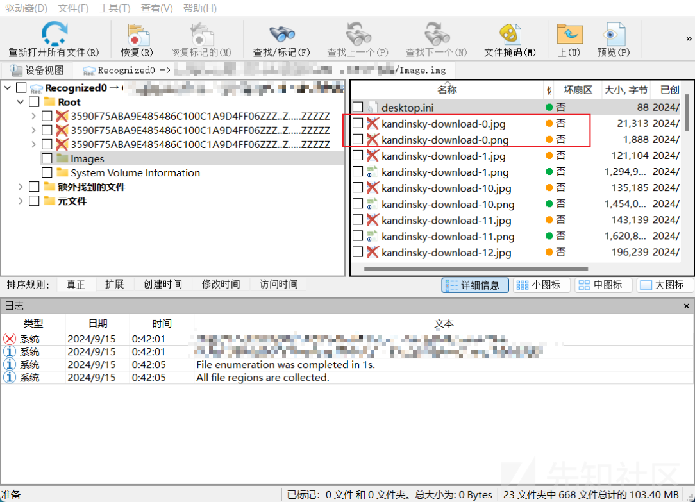Thumbs.db是一个用于MicrosoftWindows XP 或mac os x缓存Windows Explorer的缩略图的文件。把他恢复出来

工具：<https://thumbsviewer.github.io/>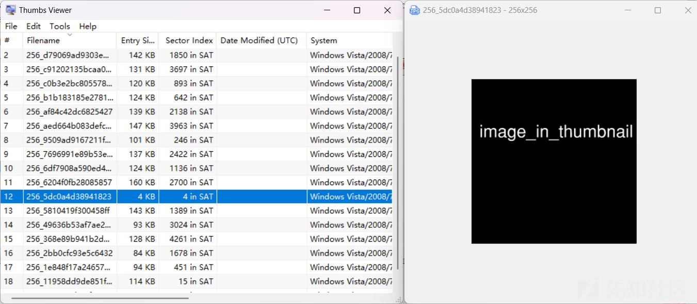flag{image\_in\_thumbnail}
