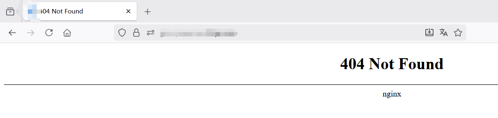
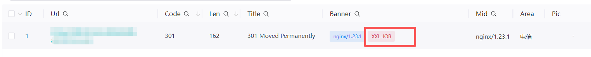
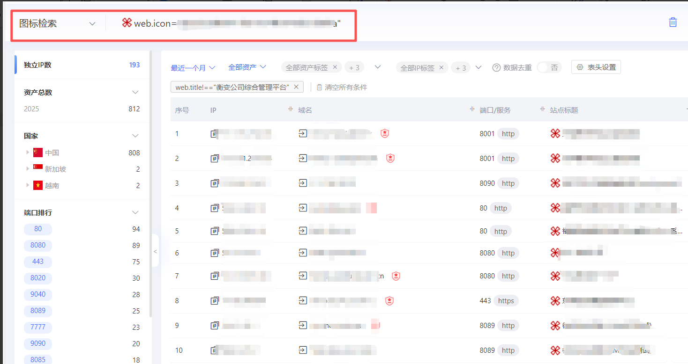
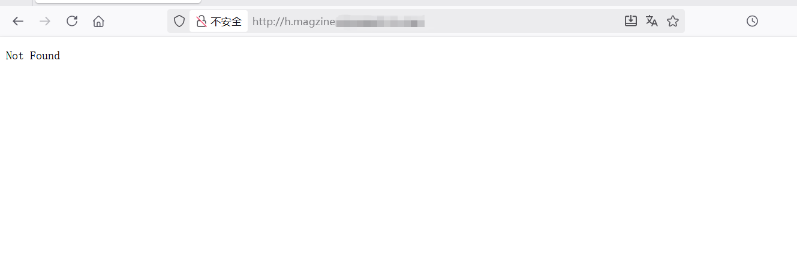
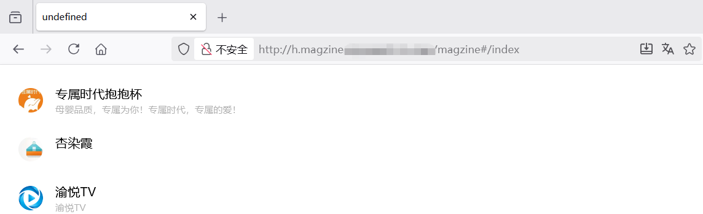
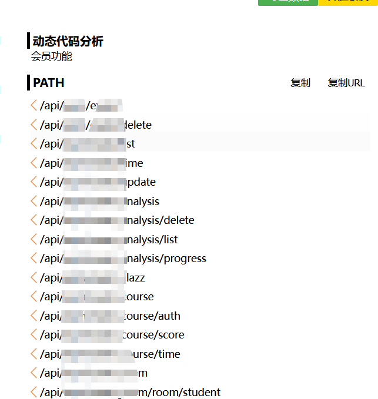
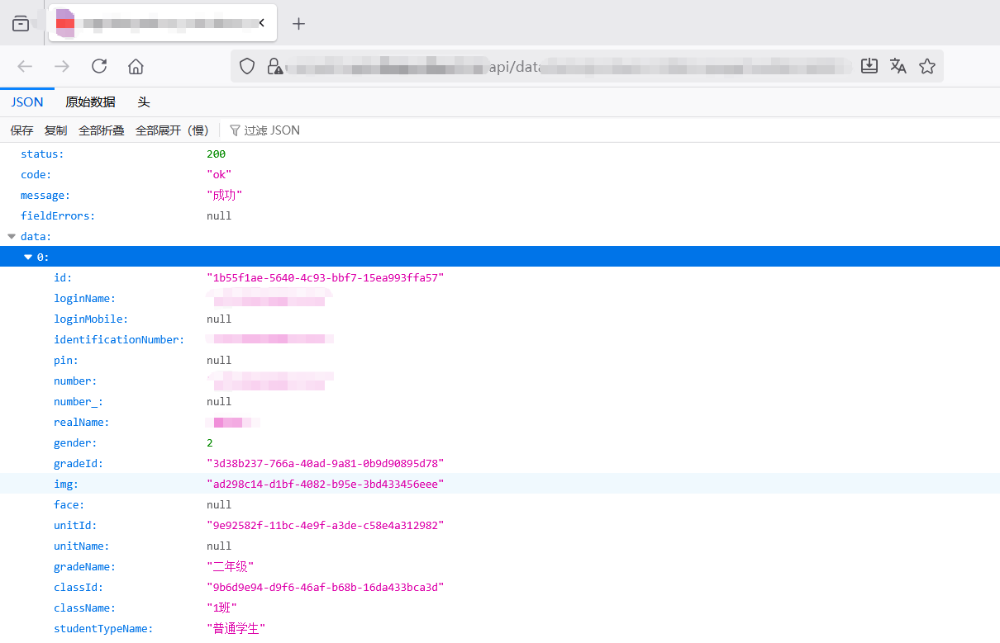
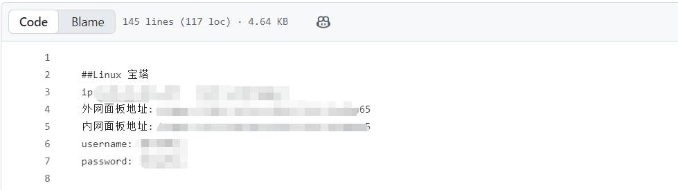

# 从“空白页”到突破口：渗透测试中的信息发现七种思路-先知社区

> **来源**: https://xz.aliyun.com/news/19025  
> **文章ID**: 19025

---

# **前言**

在日常的渗透测试中，我们常会遇到一片空白的页面，让许多师傅感到无从下手。其实，这种“空白”往往只是表象，背后可能隐藏着未被发现的管理后台、API接口甚至是安全漏洞。本文总结了几种实用的思路，旨在将“空白页”变为突破口，打开渗透测试的新视角。

# 一、**目录扫描**

使用dirsearch、Tscan等自动化目录扫描工具。这些工具能够系统地遍历网站目录结构，尝试访问可能存在的隐藏目录或文件。

常见目标路径：

目录： /admin, /login, /api, /test

文件： robots.txt, .git/, .env, web.config

## 案例

直接访问某网站时返回404错误，但通过dirsearch扫描发现存在/admin路径，拼接后成功定位到后台管理界面。

​

# 二、**指纹识别**

利用指纹识别工具（如ehole、Tscan 等）探测目标网站所使用的技术栈、中间件、开发框架或特定 CMS（内容管理系统）。识别出特定 CMS 或框架后，可进一步利用其公开漏洞（Nday）或进行代码审计。

## 案例

通过Tscan的Web职位识别功能识别出某网站使用xxljob系统，拼接xxljob后台地址/xxl-job-admin/toLogin后成功访问。




# 三、**icon搜索**

网站的 icon，也就是通常所说的网站图标，通常位于根目录下，一般路径为/favicon.ico。通过访问该路径可以看到网站的图标，将其下载下来放到hunter或者fofa里面搜索相同站点，可以发现隐藏路径。

## 案例

通过下载网站的icon文件并利用hunter进行哈希值反向查询，可以发现使用相同图标的网站，进而推断出可能存在的相同系统或隐藏路径，扩大攻击面。

​

# 四、**域名拼接**

某些站点可能使用域名的一部分作为路径，分析目标的域名结构，尝试将子域名或其关键部分作为路径拼接到主域名后进行访问。此方法常用于发现基于域名逻辑划分的测试、预发布或特定功能页面。

## 案例

目标域名为h.magzine.example.com，尝试在后面拼接路径magzine，即访问 example.com/magzine，成功发现一个隐藏的功能页面。





# 五、**路由拼接**

对于采用前端框架（如 Vue.js、WebPack）的网站，其路由通常由 #管理。通过分析前端 js 文件（如 app.js、main.js）中的路由定义，可以发现隐藏的功能路径。

## 案例

目标网站为空白页，检查并分析其引用的 JS 文件，全局搜索 path: 等路由定义关键字，发现前端定义的路由路径（如 /login），直接在原 URL 后拼接 #/login 进行访问，成功跳转到登录页面。

​

# 六、**js****接口**

前端js文件中通常硬编码了大量的 API 接口、API 密钥等敏感信息。可以通过findsomething从 JS 文件中提取出所有接口端点。随后，重点测试这些接口是否存在未授权访问、越权等安全漏洞。

## 案例

通过findsomething提取出完整的 API 接口列表，拼接访问或构造参数进行测试，发现某个数据列表接口未实施有效的身份验证，可未授权获取敏感数据。

​

# 七、**历史记录**

通过搜索网站的历史信息（如旧页面、备份文件、代码仓库记录），往往能发现已被删除或隐藏的资产、配置信息甚至敏感数据。常见方法有谷歌语法搜索和GitHub搜索。

常见的谷歌语法：

```
site：限定在特定网站或域名搜索。例如 site:example.com
inurl：搜索URL中包含特定关键词的页面。例如 inurl:login 或 inurl:.bash_history
filetype：搜索特定文件类型。例如 filetype:sql、filetype:log、filetype:bak
intitle：搜索标题中包含特定关键词的页面。例如 intitle:"index of"
```

GitHub信息收集可以使用GitDorker工具

GitDorker是一款github自动信息收集工具，它利用 GitHub 搜索 API 和作者从各种来源编译的大量 GitHub dorks 列表，以提供给定搜索查询的 github 上存储的敏感信息的概述。

```
使用方法：python GitDorker.py -tf ./tf/TOKENSFILE -d ./Dorks/alldorksv3 -q example.com -o example.com
```

## 案例

通过GitDorker工具成功查询到一处系统的linux宝塔账号密码，成功接管多个网站。


