# 记一次全方位的漏洞挖掘——接管全站数万账号-先知社区

> **来源**: https://xz.aliyun.com/news/19026  
> **文章ID**: 19026

---

漏洞挖掘详细流程。

​

**一：资产证明：**

企查查搜索www.xxxxxx.com找到第一个单位，进股权穿透图找到第二个单位

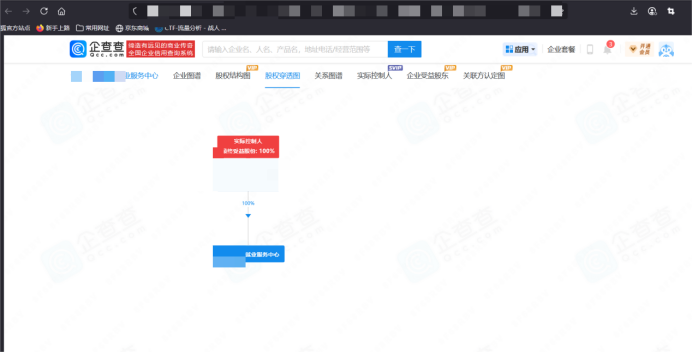

​

发现最终归属为某省教育厅级单位

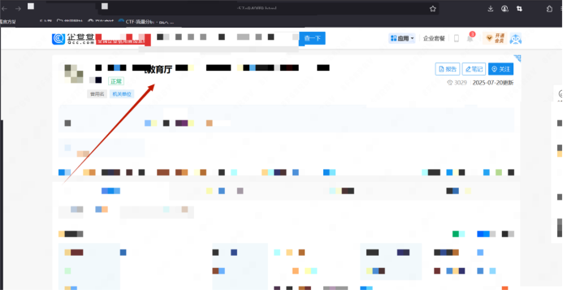

用www.aizhan.com查询权重，完全符合标准

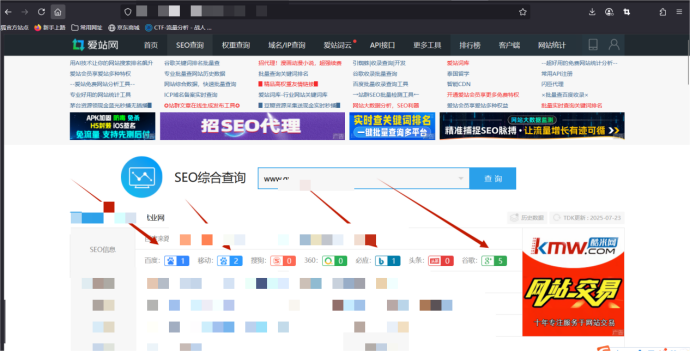

​

​

​

**二：挖掘过程**

漏洞网站首页，先点击学生登录，然后注册一个账号登录进来

​

很多时候师傅们挖掘网站漏洞觉得没有账号就放弃了，其实完全不是这样，没有账号我们就注册账号即可。

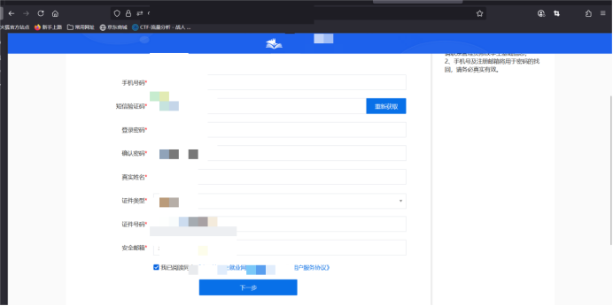

注册成功

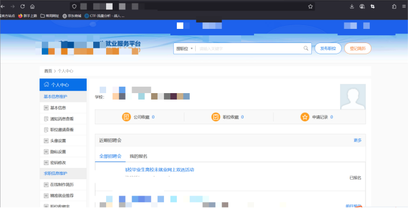

此网页找到职位信息，随便选一个公司进去看到联系人电话,这里需要注意，一定要先注册学生账号登录后才可以看到企业联系人手机号码，不然看不全信息，这个网站的权限大概分为三个级别，1-未登录，2-学生账号登录，3-企业账号登录，每个不同的权限可以看到的信息不同，权限1什么都看不见，所以我们需要自己注册一个学生账号登录进来，此时我们为权限2，这样我们就可以通过招聘信息拿到企业负责人的联系电话，拿到电话号码之后，尝试越权登录企业账号，至此，形成权限1到权限2再到权限3的逐级递增。

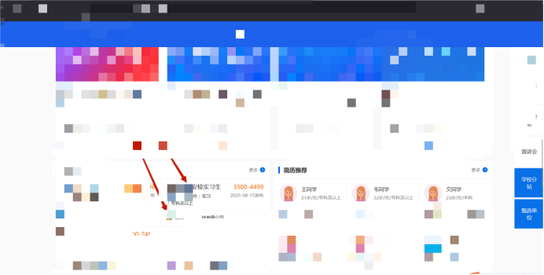

选择一个企业后，发现企业负责人手机号，这里只有权限2能看到，权限1是看不到的

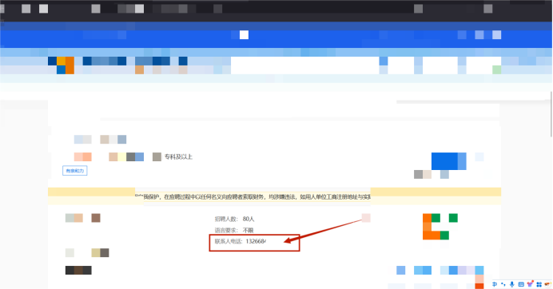

手机号：13266\*\*\*\*\*\*\*\*

此时选择单位登录，用刚刚得到的手机号登录，然后验证码的时候抓包改自己验证码，登录企业账号

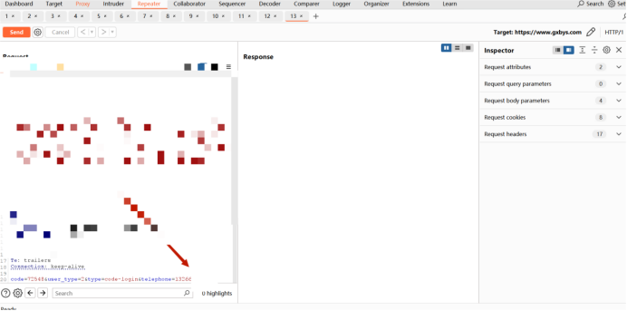

​

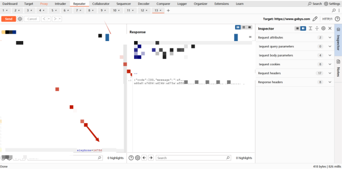

​

成功验证码绕过接收短信

​

成功越权登录企业账号

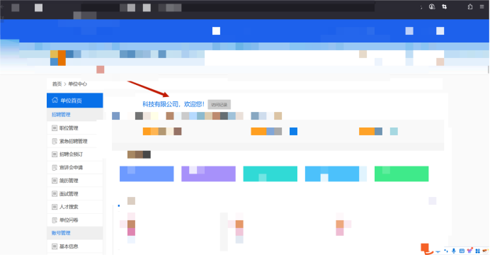

​

找到简历相关

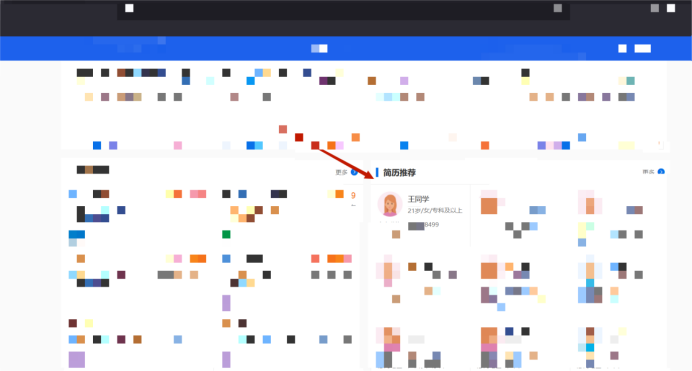

​

随意点击一个简历，发现敏感信息被隐藏，当我们下载之后，敏感信息出现，这就造成了全系统信息泄露，注意，这里的简历一定是需要企业账户，也就是权限3才可以查看，因为只有企业账户可以下载简历！

​

点击简历下载后，全部信息出现

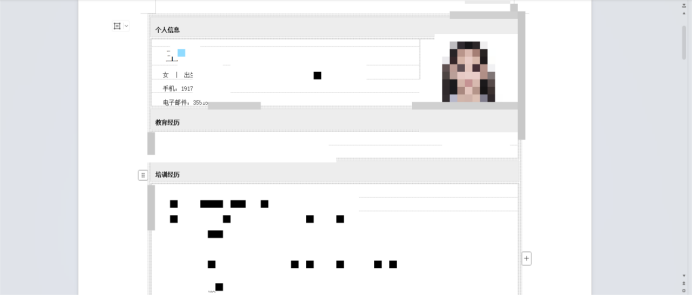

​

​

多测试几个简历

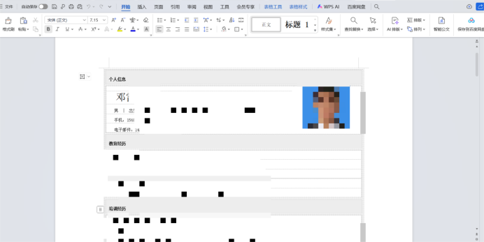

​

拿到学生简历，就拿到了学生的手机号，可以去学生登录哪里，通过改手机号方式得到验证码，再次全部大规模登录学生账号获得学生的身份证号

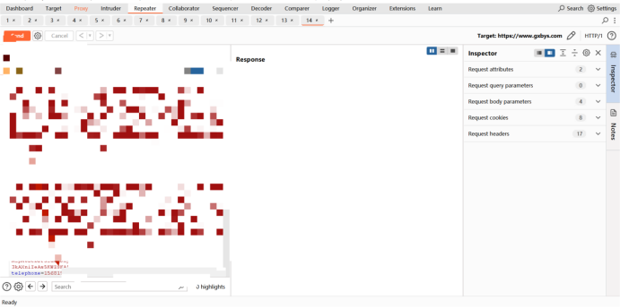

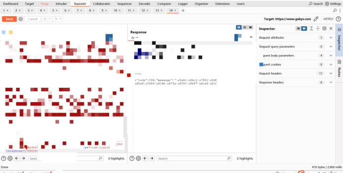

​

成功登录学生账号

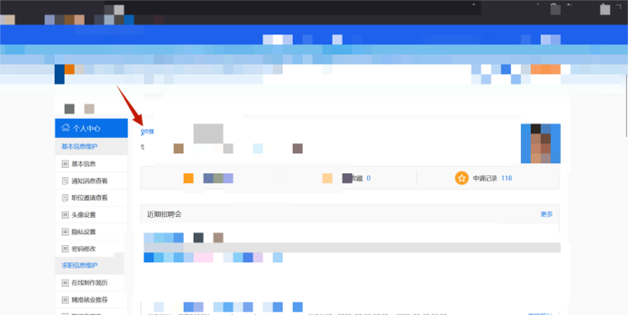

可以看到所有学生身份证号以及所有敏感信息以及修改全部学生密码

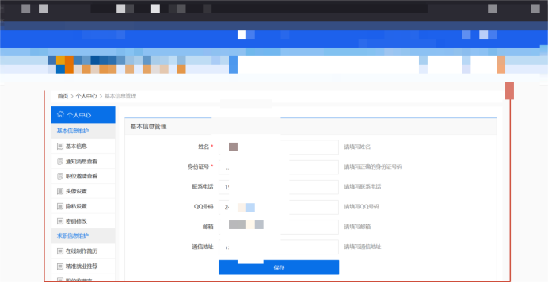

​

**三****:****总结**

此次漏洞挖掘到某省教育厅全站账号接管的漏洞，经过查看，这个网站至少有数百个企业的账号可以被接管，同时，每家企业账号里面平均有一百个待就业学生的详细简历，这也就意味着可以接管全站学生账号!

​

验证码绕过不算什么很新的思路，但是很多时候，用好了也能起到意向不到的作用。

​

下面总结一下挖掘验证码绕过时候的思路以及方法。

1：直接替换手机号绕过

2：双写手机号绕过

3：添加相同数据结构手机号绕过

​

注：此次分享仅为技术分享，请自觉遵守法律法规，严禁私自进行违规活动，如有违规，责任自负，与本人无关。
