# 某系统sign值js逆向实战-先知社区

> **来源**: https://xz.aliyun.com/news/19029  
> **文章ID**: 19029

---

### js逆向调试

1、存在sign验证

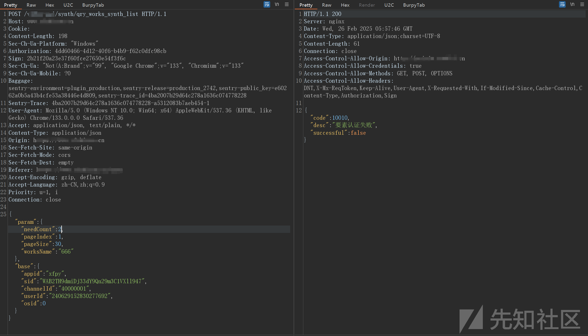

搜索关键字无效，Js做了混淆

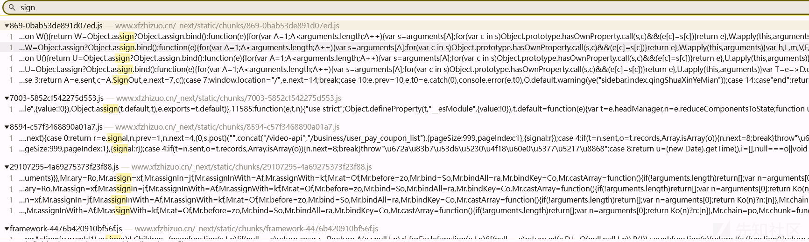

触发接口

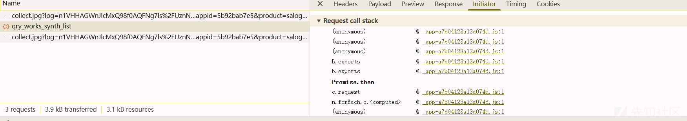

通过Initiator来断点

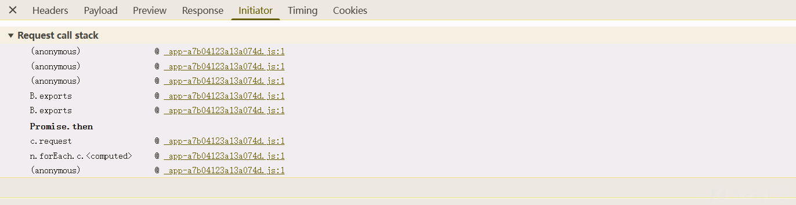

发现接口名

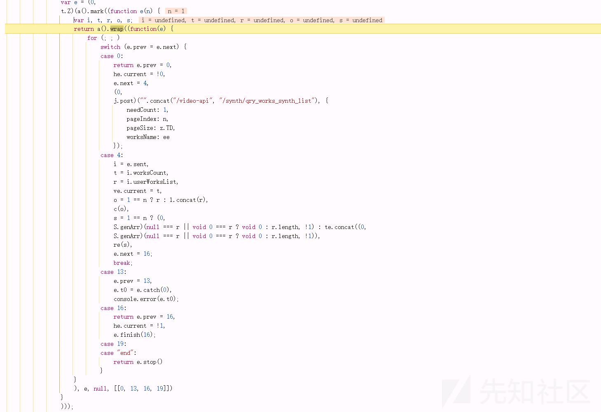

拼接了接口

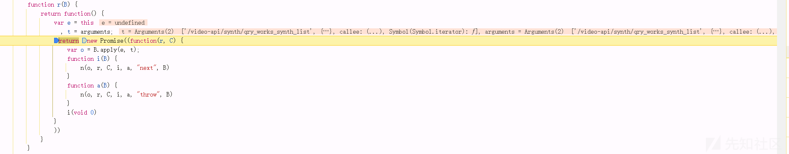

输出t，可以发现参数跟接口被赋值

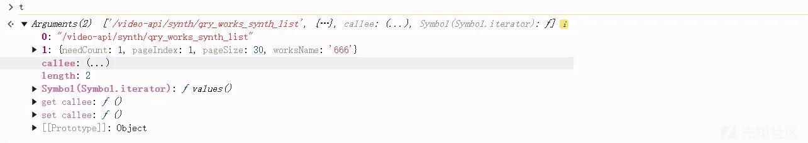​

继续往下

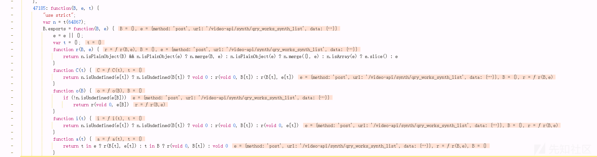

创建对象，似乎是将值放入到一个http对象

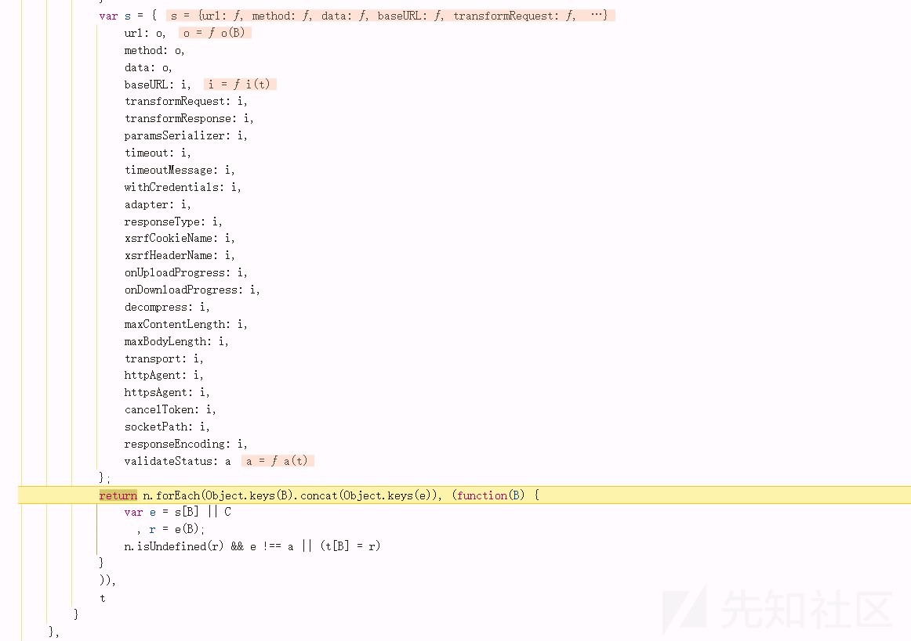

u(B，e)函数看起来像是请求方法、接口路径、参数体的结合

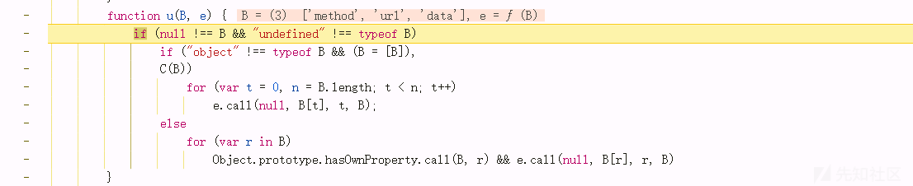

64867

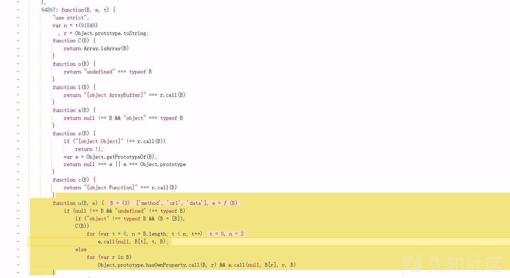

forEach: u, merge 对参数进行循环遍历

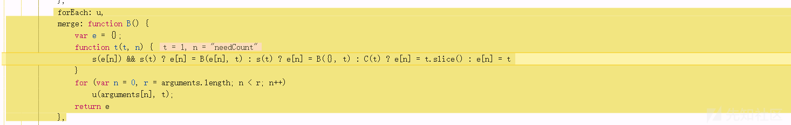

获取cookie当中的一些参数

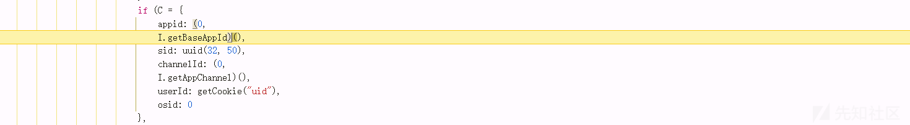

进行正则匹配，继续往下

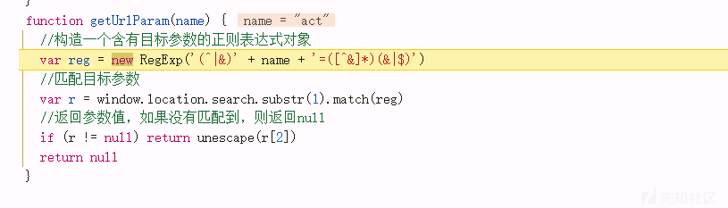

看起来是统计与遍历uid长度

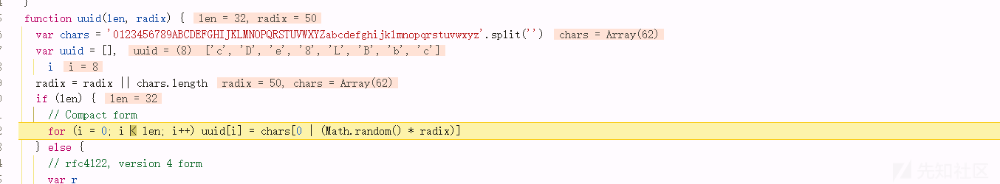

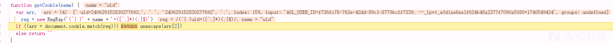

S函数用于md5加密，加密的是cookie前面遍历的一些键值对

```
处理B得到字符串t。
如果有e，则拼接到t后面。
计算t的MD5哈希。
返回哈希的字符串形式。
```

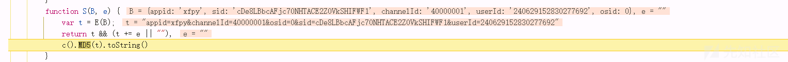

继续往下，是一个加密算法定义

```
blockSize: 16 定义算法处理的 ​数据块大小​ 为 16 字节。
_createHelper 方法:调用加密算法
```

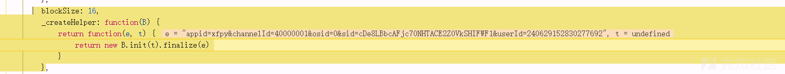

循环转换，作用：将字符串转换为32位整数数组

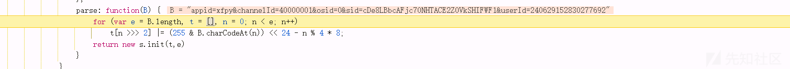

python实现上面

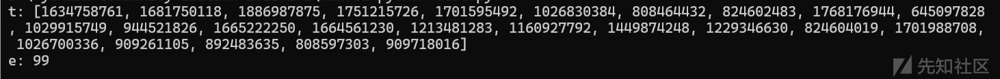

拼接那个二进制参数

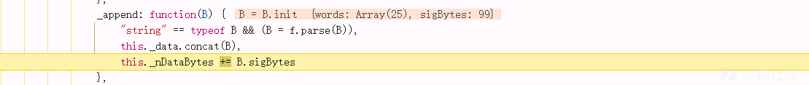

继续调式，可以发现前面转换的数组被复制给B

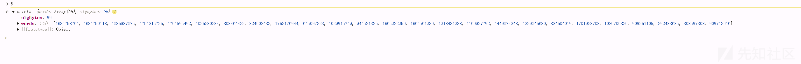

将参数 `B` 的数据合并到当前对象中，处理字节到32位整数的转换。看不懂，不管它

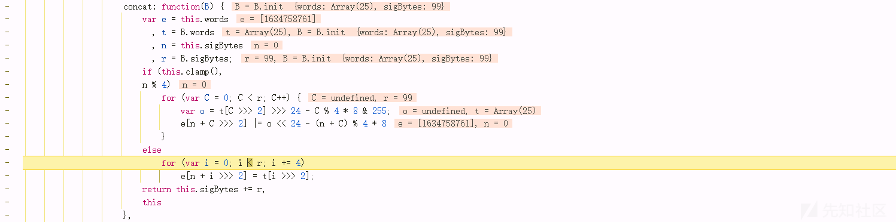

从这里的函数以及循环，可以推测这里大概就是加密的

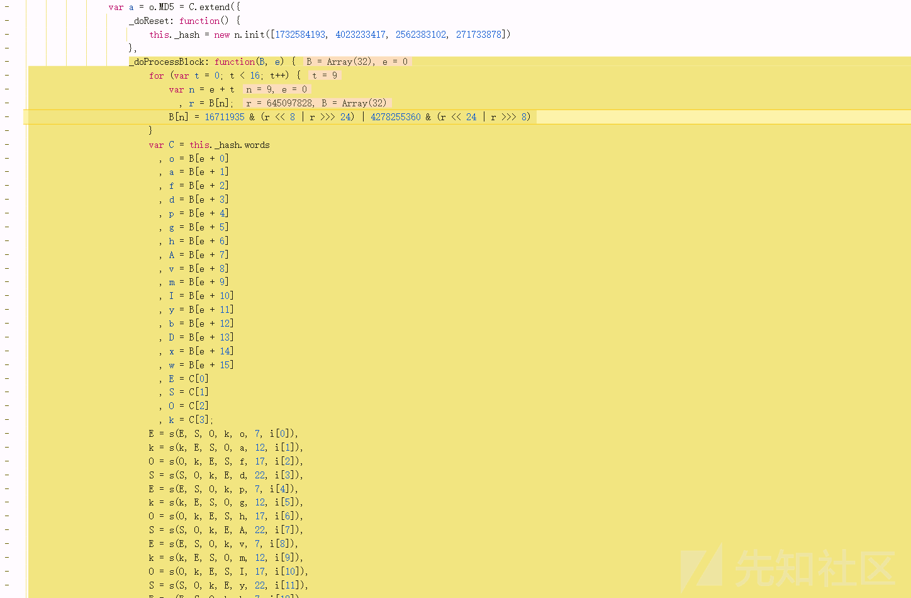

执行一次上面的流程后，进入了一个for循环加密，应该是重复了几次上面的编码流程

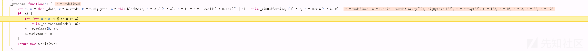

继续往下，数组循环，看不懂，不管他 继续往下

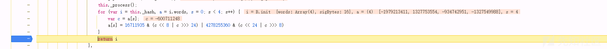

再往下

`stringify` 方法，该方法的功能是将一个包含二进制数据（以 `words` 数组形式存储）的对象转换为十六进制字符串表示，不懂继续往下

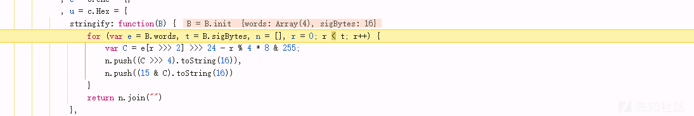

得到前面字符串的加密后的md5值

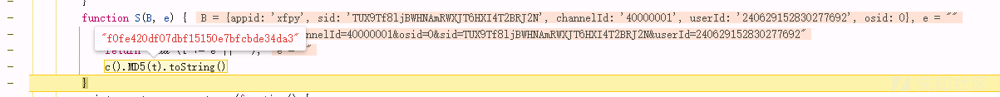

继续往下，发现现在是body当中的参数了

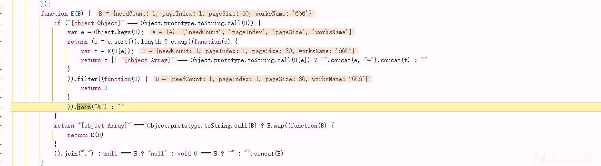

循环body当中的参数之后，又与前面的参数拼接了

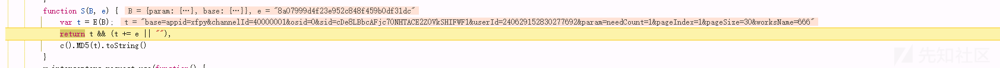

再继续往下，发现workname参数转换成疑似md5的加密字符串，

经过几次调试后，发现workname的加密字节是将 base数组md5值拼接在param数组转换后的字符串后面

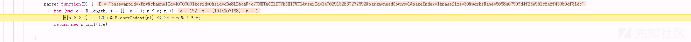

再继续调试得出sign=md5（str(param)+md5(base)）

### python脚本实现

在上面得知加密流程后，开始写加密脚本。

首先写出md5加密函数：

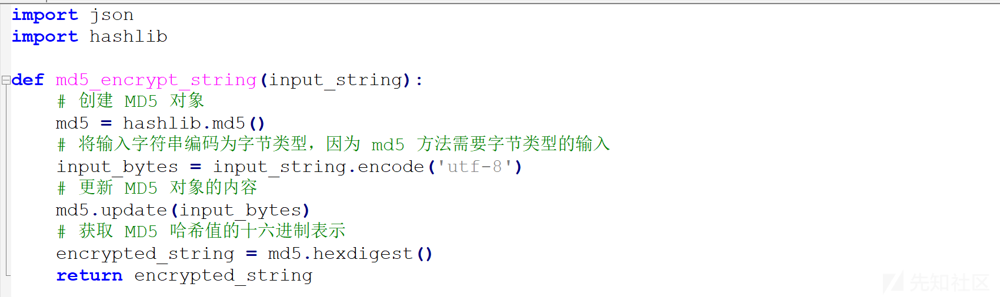

用于解析json对象的代码以及扩大代码健壮性

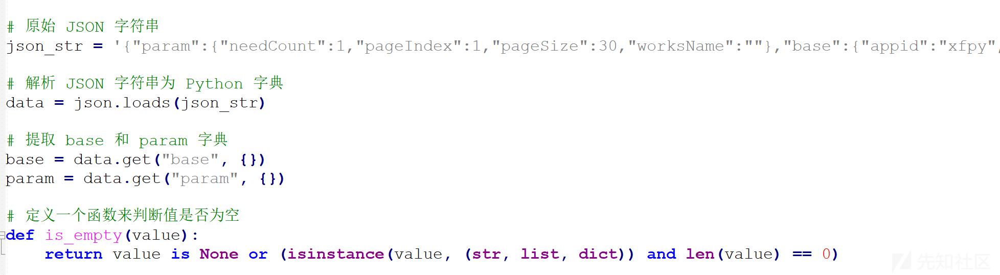

再加入对参数字符串进行排序的代码

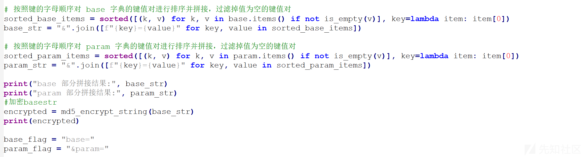

完整代码如下：

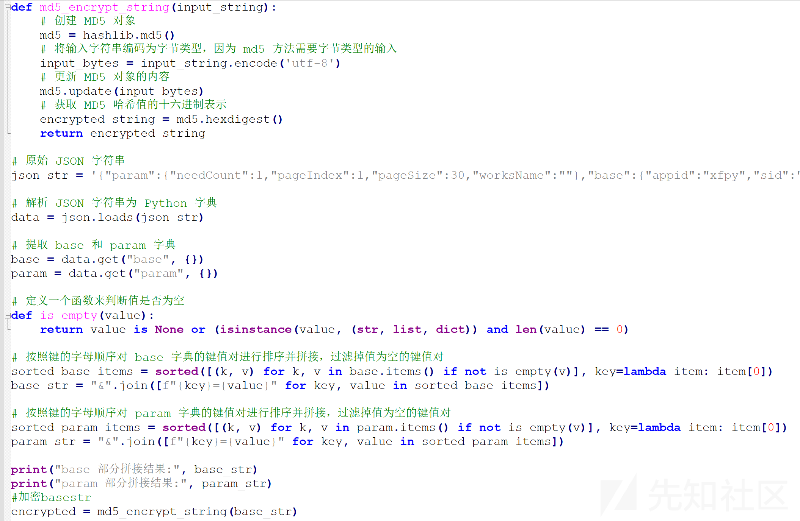

验证代码可用性

修改userid后，提示认证失败

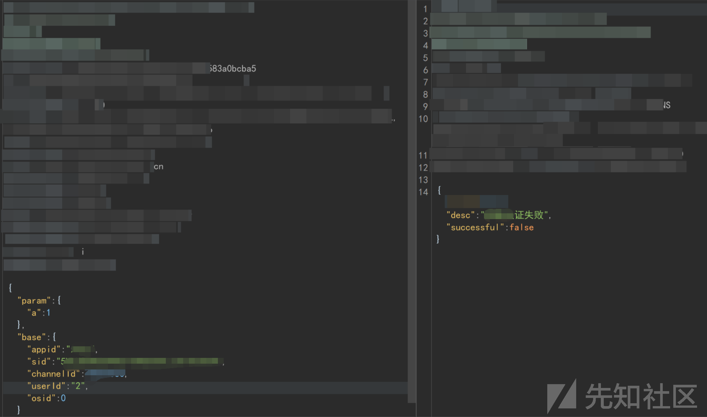

运行python脚本计算出sign值

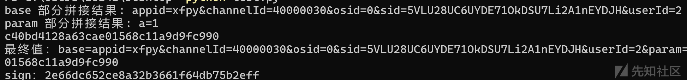

写入，成功绕过sign值校验

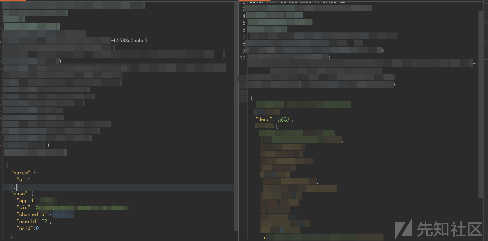
