# 某数据泄露防护系统审计-先知社区

> **来源**: https://xz.aliyun.com/news/19040  
> **文章ID**: 19040

---

好久没写审计文章了，最近目录扫描泄露了一套源码，尝试本地审计，其中漏洞均以修复。

提指纹后去fofa查询大概有1300左右独立ip，系统算是中小型的系统了。

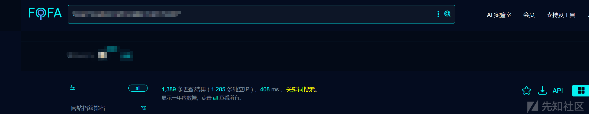

## 整体架构及依赖分析

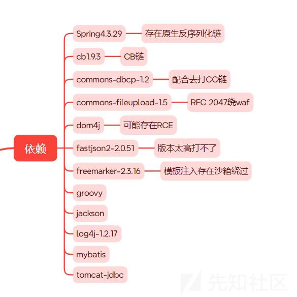

经过查看lib库可以总结如上图所示依赖项。该系统总体上是MVC架构、Spring的框架，路由是`*.do`的形式。

对于反序列化漏洞来说，本地Spring4.3.29，可打原生反序列化链；cb1.9.3+cc3.2.2，可打CB链，但问题在于fastjson版本太高，似乎没法打，遂放弃fastjson的反序列化入口。

另外，笔者使用了一个小trick来绕过一处JDBC的连接，打cb链实现了反序列化，这个后文中会提到。

## 鉴权分析

下面来分析一下鉴权。我们依旧从web.xml入手。上文中提到Controller中的路由形式为`*.do`。

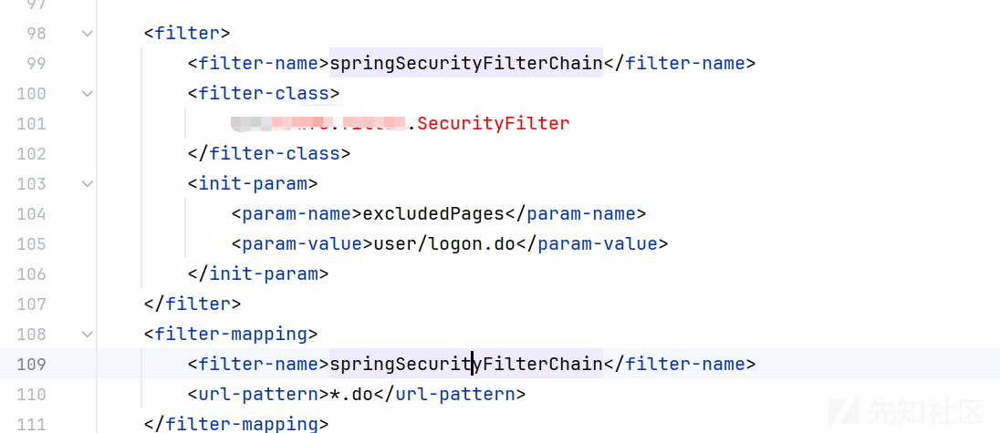

`*.do`的路由全被springSecurityFilterChain过滤，不妨跟进看看逻辑。

### 解析绕过

如下图所示，在SecurityFilter#doFilter中存在对url的解析，众所周知，这里不安全，存在解析绕过。

对解析过的url将其送入SessionFilter.isNoNeedValidate进行校验，如果返回true则chain.doFilter鉴权通过，反之进行`Authorization`的方式鉴权，其实也就是JWT方式鉴权。

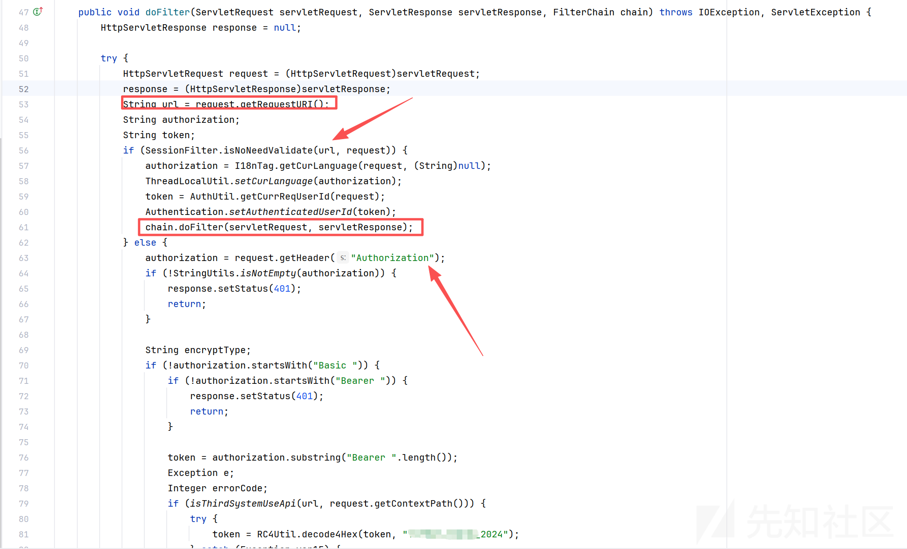

继续跟进SessionFilter.isNoNeedValidate。

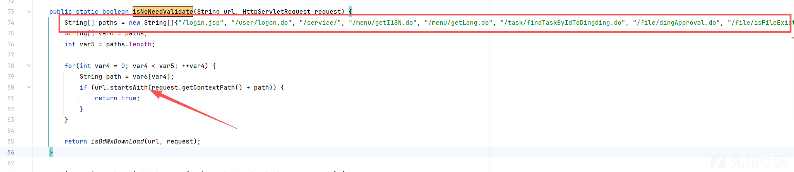

那这里就是很明显的解析绕过了。我们可以采用`/login.jsp/..;/xxx`进行绕过。

至此这套系统鉴权也就没了，所有的后台功能点全部变成了前台。

但是我不满足这样的方式，使用解析绕过的方式太low，于是我尝试继续分析下面的jwt鉴权，看看是否存在伪造的情况呢？

### 失败的JWT伪造绕过

从标题就看出来了，这里的绕过我是失败了的，但是我希望你能够继续往下看，至少清除我是怎么失败的，如果换你来操作，你会不会失败呢？

看一处即可。

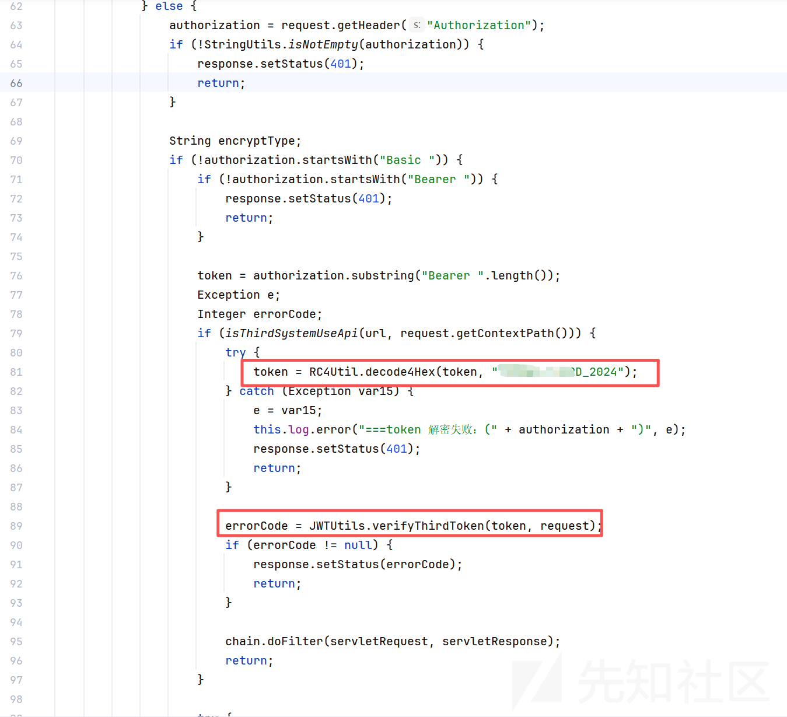

通过`request.getHeader("Authorization")`拿到token，随即进行RC4的解密。解密成功后校验jwt的数字签名以此判断是否存在伪造的情况。

对于使用JWT鉴权的脆弱点，我在<https://mp.weixin.qq.com/s/rkxruV2xEpY02MPi7okLLQ>一文中依旧解释的很清楚了，就是找密钥的硬编码。

不妨跟进这里的JWTUtils类，看看是否存在硬编码的密钥及存在生成jwt的方法。

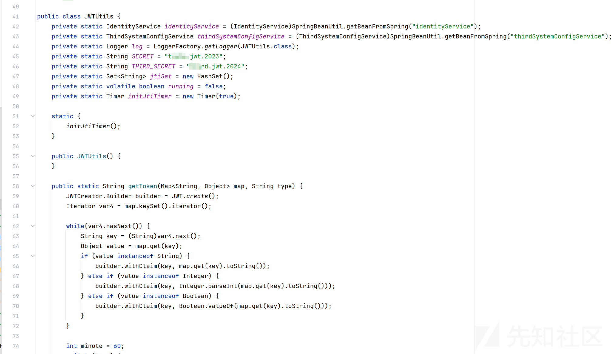

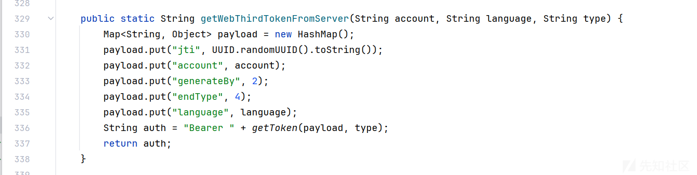

很明显，这里密钥硬编码并且这里生成jwt的方法也很简单，你或许和我一样觉得可以梅开二度了。

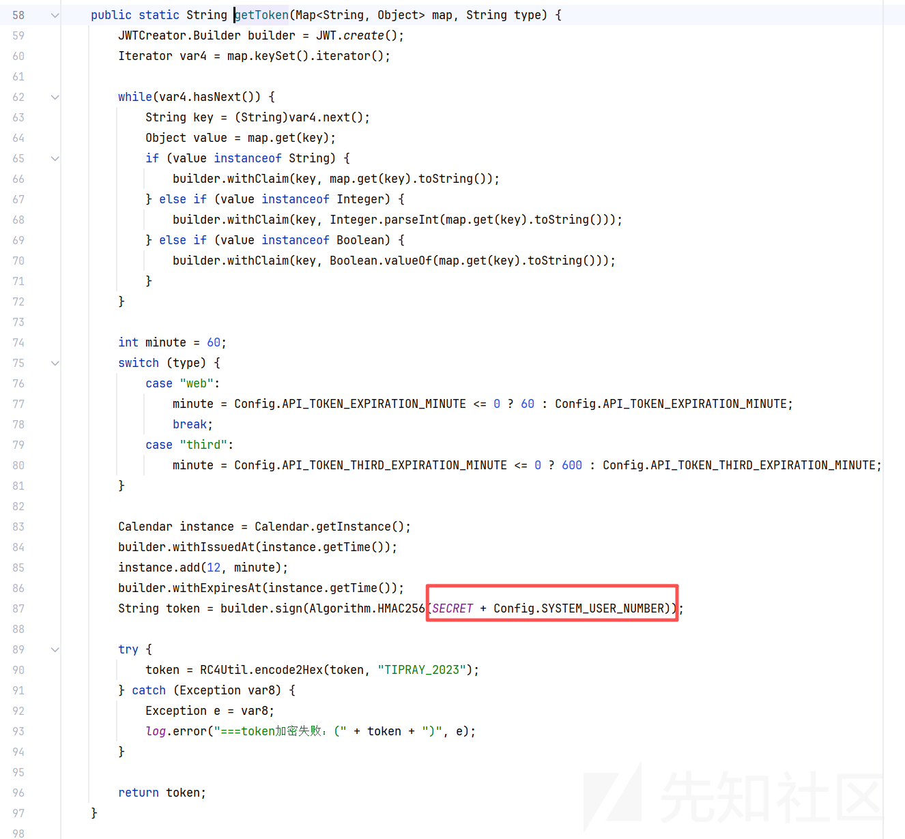

问题出现在JWTUtils#getToken方法中使用密钥通过HMAC256算法对jwt进行签名时除了`SECRET`还加了另外一个参数，就是`Config.SYSTEM_USER_NUMBER`，而这个参数，在不同系统中是不同的。~~（当然也可能是我没找到这个这个参数最终存在点的问题，如果有牛子分析过可以提出来的，笔者也学习一下）~~

由于密钥是动态的，所以我就没能伪造成功，不过这也是种思路，可能这套系统失败了，下套系统就不失败了？

还是使用low的方式来进行绕过吧。

## 漏洞挖掘

这套系统洞还是比较多的，下面以sql及文件上传为例。

### 9处SQL注入

由于使用了mybatis，全局搜索`${`找漏网之鱼即可。

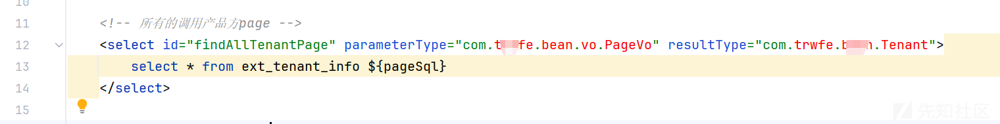

还真被我找到了。看一下来源`PageVo`。

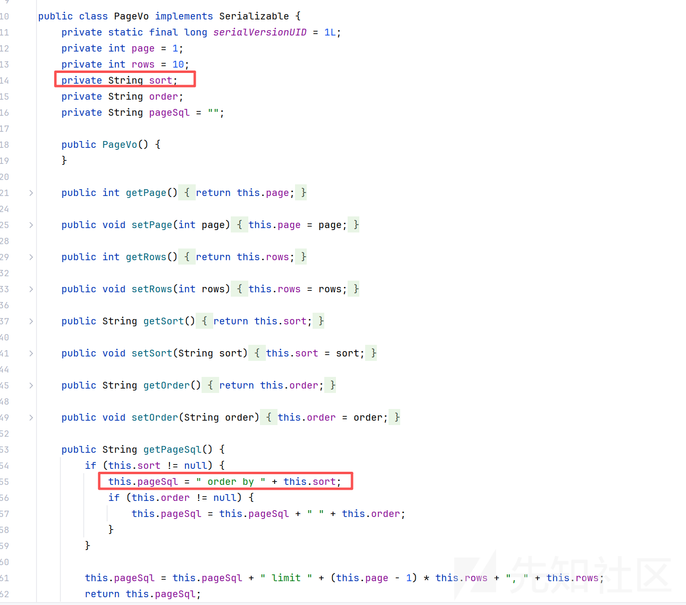

这是一个实体类，按道理来说，前后端交互是传的这个类，该类参数用户可控。

并且该类中存在拼接sort到pageSql中，最终加入到上述mapper中造成注入，那就很明显了，直接找Controller中，哪里用到这类即可。

直接全局搜索`import com.xxxx.bean.p000vo.PageVo`，看看哪里用到了这个`PageVo`。

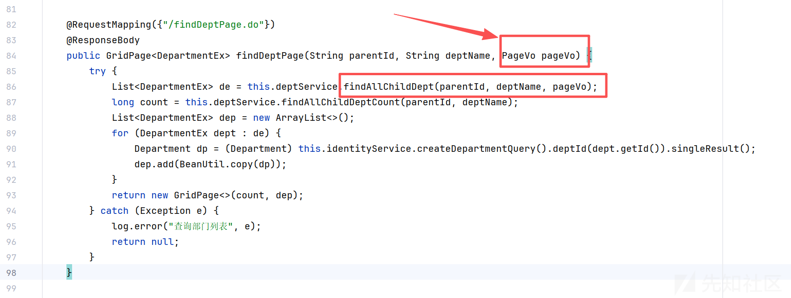

同Mapper层交互。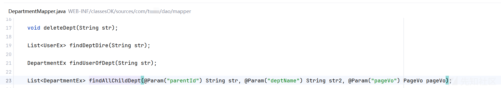

尝试构造payload来注入。

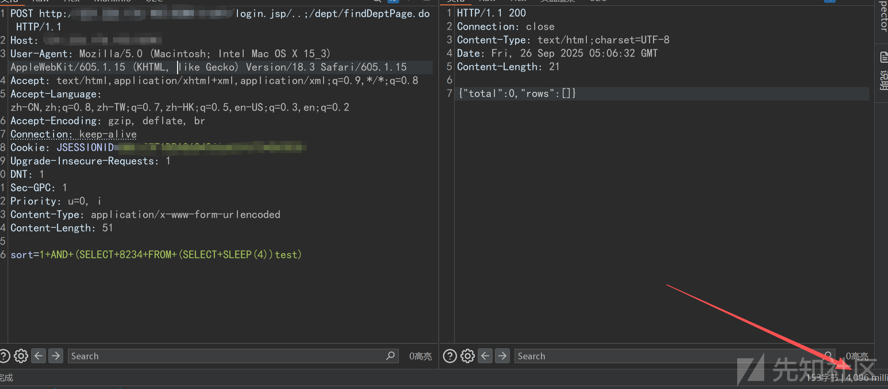

got，一切顺利的。

像这样点，笔者测试了一下总共有9处。

```
1、findDeptPage.do  sql注入漏洞

2、findFileServerPage.do  sql注入漏洞

3、findTenantPage.do sql注入漏洞

4、findModulePage.do sql注入漏洞

5、findRolePage.do sql注入漏洞

6、findSingConfigPage.do sql注入漏洞

7、findUserPage.do sql注入漏洞

8、findCategoryPage.do sql注入漏洞

9、findSingConfigPage.do sql注入漏洞
```

### 任意文件上传

从依赖中可以看出来，该系统文件上传靠的是`MultipartFile`，全局搜索这个关键词。

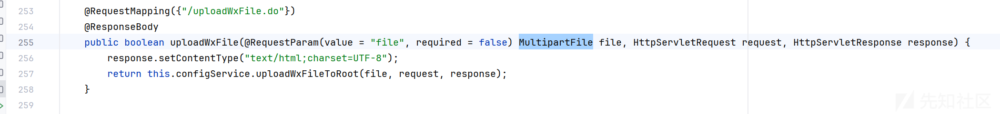

从前端接收了一个`MultipartFile`，随即送入uploadWxFileToRoot中，跟进看看实现，重点关注是否对后缀的限制。

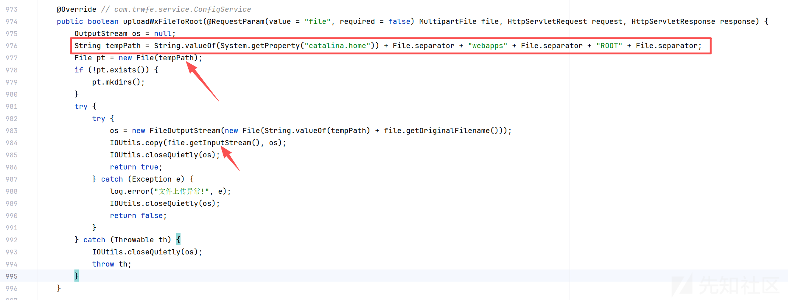

很明显，这里并未对后缀做任何限制，存储的路径是`String.valueOf(System.getProperty("catalina.home")) + File.separator + "webapps" + File.separator + "ROOT" + File.separator`，其实也就是当前项目的上一级文件夹中。

基于此，构造数据包。

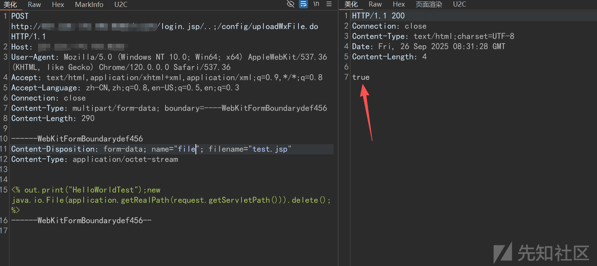

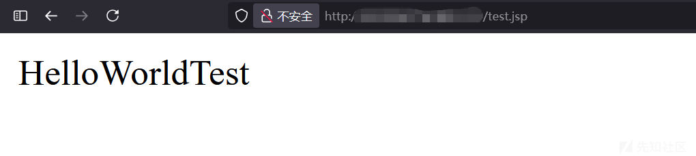

### jdbc反序列化

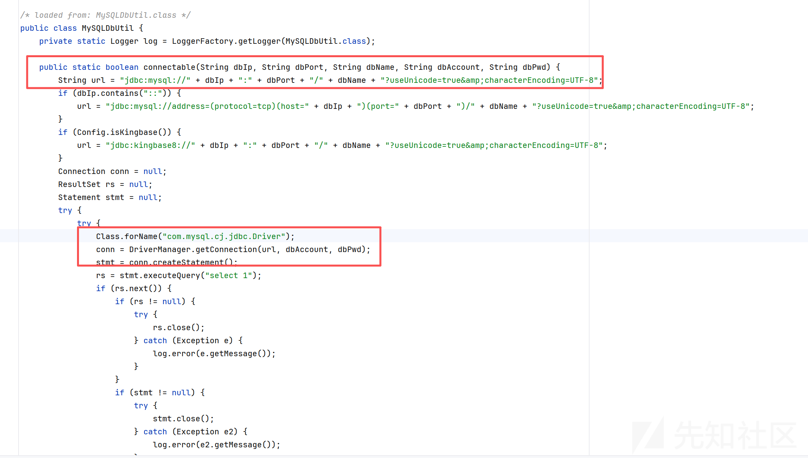

该类参数全部外部可控，不妨将代码扣下来本地来测试一下，其中mysql的版本为8.0.15。

该jdbc的连接中url只有部分可控，但由于jdbc连接为拼接，并且支持注释`#`来注释掉后面的内容。

于是笔者就构造如下所示payload，打cb链实现了rce。

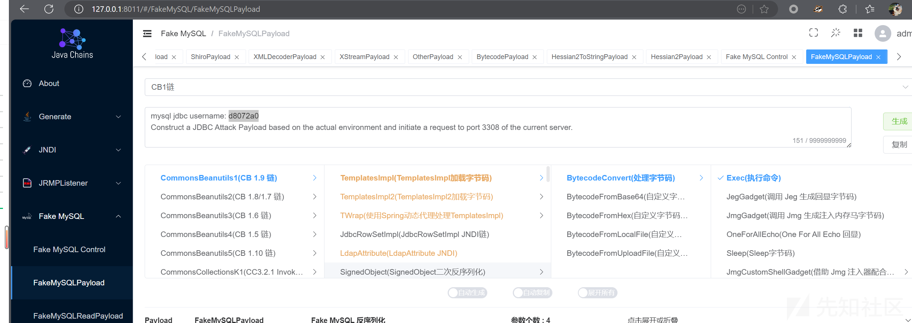

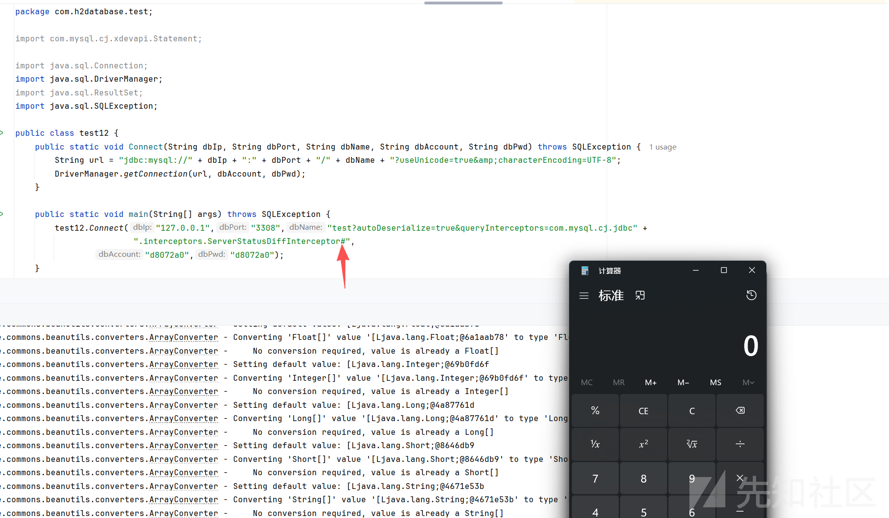

## 总结

审完一套系统要问到自己学到了什么？有没有总结审计同框架系统的方法论？是否弥补了开发知识上面的不足?

共勉。
