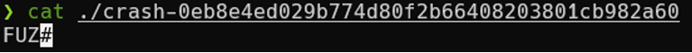
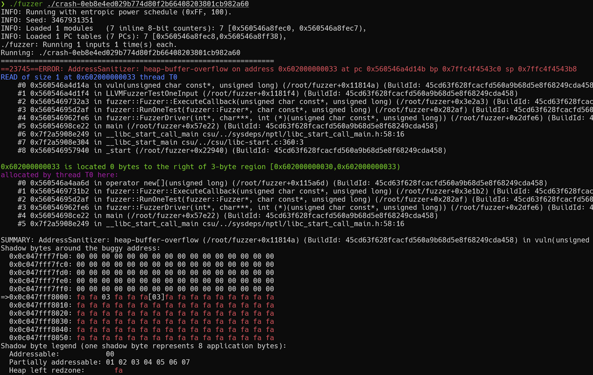

# libFuzzer模糊测试基础教程：从入门到实战-先知社区

> **来源**: https://xz.aliyun.com/news/19043  
> **文章ID**: 19043

---

## 引言：从随机到智能的测试进化

初次接触模糊测试时，很多人会有一个直观的想法：向程序输入大量随机数据，观察是否会产生异常行为。这种思路虽然正确，但实施过程中会遇到效率问题——大多数随机输入无法通过程序的基础校验，难以触达核心业务逻辑，更无法有效发现深层漏洞

libFuzzer通过引入覆盖率驱动的智能变异机制，有效解决了传统随机测试的效率瓶颈。它能够动态跟踪程序执行路径，识别能够扩展代码覆盖面的输入，并将这些高价值输入作为后续变异的基础。这种反馈机制使得测试过程从盲目的随机搜索演进为有针对性的智能探索

## Step 1：核心技术原理

### Step 1.1：覆盖率驱动机制

libFuzzer的核心优势在于其覆盖率驱动的反馈机制。与传统的盲目随机测试不同，libFuzzer通过实时监控程序执行路径，动态调整输入生成策略

具体而言，libFuzzer通过LLVM的SanitizerCoverage插件在目标程序中插入覆盖率收集代码。每次程序执行时，这些插桩代码会记录经过的基本块、分支条件和函数调用等信息。当某个输入能够触发之前未覆盖的代码区域时，该输入会被标记为高价值样本并加入语料库

这种机制的效果显著：传统随机测试可能需要数天才能偶然触及的边界条件，libFuzzer往往能在几小时内系统性地发现。原因在于它将"有效输入"的定义从语法正确性转向了代码覆盖增量，这更符合漏洞发现的实际需求

### Step 1.2：进化式变异策略

libFuzzer采用进化式变异算法来生成测试输入。算法维护一个高质量的语料库，每轮测试时随机选择种子样本作为变异基础，通过插入、删除、替换、拼接等操作生成新的测试用例

变异后的输入会被送入目标程序执行。如果能够触发新的代码路径，则被保留并加入语料库；否则被丢弃。这种选择机制确保了语料库质量的持续提升和代码覆盖面的不断扩展。经过足够多的迭代后，某些变异输入可能会触及程序的边界条件或异常处理逻辑，从而暴露潜在的安全漏洞

### Step 1.3：库形式集成架构

libFuzzer采用库链接的方式集成到目标程序中，这与AFL等基于进程重启的工具形成鲜明对比。这种设计带来三个显著优势：

**性能优势**：避免了频繁的进程创建和销毁开销，显著提升测试执行效率

**精确度优势**：能够针对特定函数或模块进行精准测试，而不是整个程序的黑盒测试

**简化优势**：无需复杂的进程间通信机制，降低了部署和维护的复杂度

当然，这种集成方式要求开发者为每个测试目标编写标准化的测试入口函数。虽然增加了一定的前期工作量，但换来的是更高的测试精度和更好的可控性

## Step 2：环境配置与工具链

### Step 2.1：编译器选择：为什么必须使用Clang

libFuzzer作为LLVM项目的组成部分，与Clang编译器实现了深度集成。这种集成关系并非简单的兼容性考虑，而是基于技术架构的必然选择

libFuzzer的覆盖率收集机制依赖于LLVM的SanitizerCoverage插件，该插件能够在编译期间向目标程序注入精细化的插桩代码。这些插桩代码负责实时收集程序执行过程中的覆盖率信息，包括基本块覆盖、边缘覆盖和路径覆盖等多个维度的数据

虽然GCC也提供类似的覆盖率收集功能，但在插桩精度、性能开销和兼容性方面与LLVM原生方案存在差距。因此，选择Clang并非"技术路线偏好"，而是确保libFuzzer功能完整性的技术要求

### Step 2.2：环境配置流程

**Ubuntu/Debian系统**：

```
# 安装LLVM工具链
sudo apt update && sudo apt install clang-12 lldb-12

# 验证安装
clang++ --version
```

**CentOS/RHEL系统**：

```
# 使用包管理器安装
sudo yum install clang llvm

# 或者用更新的版本
sudo dnf install clang llvm
```

**macOS系统**：

```
# 使用Homebrew（推荐）
brew install llvm

# 或者直接用Xcode自带的clang（功能可能不完整）
xcode-select --install
```

验证一下fuzzer支持：

```
# 这条命令能正常执行说明环境OK
echo 'int main(){return 0;}' | clang++ -fsanitize=fuzzer -x c++ -
```

### Step 2.3：编译选项：每个参数都有它存在的理由

libFuzzer的强大来自于编译期的各种"魔法"，这些魔法通过编译选项控制：

```
# 最简单的fuzzer编译
clang++ -fsanitize=fuzzer -g target.cpp -o fuzzer

# 推荐的生产环境配置
clang++ -fsanitize=fuzzer,address,undefined \
        -fno-omit-frame-pointer \
        -g -O1 target.cpp -o fuzzer
```

**各选项的作用**：

* `-fsanitize=fuzzer`：这是核心，启用libFuzzer引擎和覆盖率收集
* `-fsanitize=address`：启用AddressSanitizer，能检测各种内存错误
* `-fsanitize=undefined`：启用UBSan，检测未定义行为
* `-fno-omit-frame-pointer`：保留栈帧信息，crash时能看到完整调用栈
* `-g`：生成调试信息，方便定位问题
* `-O1`：轻度优化，在性能和调试友好性之间平衡

需要特别注意的是，这些sanitizer工具在漏洞发现中发挥着关键作用。它们能够将原本可能导致数据损坏但不会立即显现的内存错误转化为可检测的程序崩溃，大大提高了问题发现的及时性和准确性

## Step 3：实战应用：从接口设计到漏洞发现

### Step 3.1：核心接口设计

LibFuzzer 不是对整个程序进行模糊测试，而是测试一个格式为如下签名的函数：

```
extern "C" int LLVMFuzzerTestOneInput(const uint8_t *data, size_t size);
```

我们需要自己实现这个函数，LibFuzzer 会不断调用它，并提供不同的 Data 和 Size 。 libFuzzer以 LLVMFuzzerTestOneInput() 作为用户自定义的模糊测试入口点，只需要关注为 libFuzzer 生成的数据编写接口调用逻辑，而 libFuzzer 会通过自己实现的数据生成和变异逻辑来进行fuzz

**参数解释**：

* `data`: 指向输入数据的指针
* `size`: 输入数据的大小（字节数）
* 返回值: 永远返回0（非0值会被当作崩溃处理）

**几个重要原则**：

1. **函数必须是确定性的**：相同输入必须产生相同行为
2. **不要有副作用**：不要写文件、修改全局状态、发网络请求
3. **快速执行**：单次执行应该在1秒内完成

### Step 3.1.1：设计测试目标

让我们先设计一个简单的测试目标函数，这样更容易理解fuzzer是如何工作的。我们会创建一个函数来检查输入是否以"FUZ"开头，这个简单的逻辑足以演示覆盖率驱动的效果

### Step 3.1.2：编写完整的Fuzzer

现在让我们编写一个完整的fuzzer来测试这个函数。这个示例包含目标测试函数和libFuzzer入口函数。`vulnParser`函数检查输入数据的前三个字节是否为'F'、'U'、'Z'。这种条件判断可以用来观察libFuzzer如何通过覆盖率反馈逐步发现能触发不同代码路径的输入：

```
// basic_fuzzer.cpp
#include <cstdint>
#include <cstddef>

bool vulnParser(const uint8_t* data, size_t size) {
    bool result = false;
    if (size >= 3) {
        result = data[0] == 'F' && 
                 data[1] == 'U' &&
                 data[2] == 'Z';
    }
    return result;
}

```

这里只需要将要测试的函数添加即可

```
#include <stdint.h>
#include <stddef.h>
#include "vuln.h"

//通过接口将数据投喂到目标函数
extern "C" int LLVMFuzzerTestOneInput(const uint8_t *data, size_t size) {
    vulnParser(data, size);
    return 0;
}
```

### Step 3.1.3：编译和运行

**编译命令**：

```
clang++ -fsanitize=fuzzer,address -g basic_fuzzer.cpp -o fuzzer
```

编译参数解释：

* `-fsanitize=fuzzer`：启用libFuzzer驱动
* `-fsanitize=address`：启用AddressSanitizer检测内存错误

**配置语料**：  
创建一个空目录用于存放初始语料，并运行 fuzzer 程序。libFuzzer 会递归遍历指定的目录，读取所有文 件作为初始输入:

```
mkdir corpus
echo "a" > corpus/seed

# 开始Fuzzing
./fuzzer corpus
```

**正常运行会看到类似输出**：

```
INFO: Running with entropic power schedule (0xFF, 100).
INFO: Seed: 1698765432
INFO: Loaded 1 modules   (8 inline 8-bit counters): 8 [0x55c..., 0x55c...)
INFO: Loaded 1 PC tables (8 PCs): 8 [0x55c..., 0x55c...)
INFO:        1 files found in corpus
INFO: -max_len is not provided; libFuzzer will not generate inputs larger than 4096 bytes
INFO: seed corpus: files: 1 min: 1b max: 1b avg: 1b rss: 30Mb
#2      INITED cov: 3 ft: 3 corp: 1/1b exec/s: 0 rss: 30Mb
#8      NEW    cov: 4 ft: 4 corp: 2/2b lim: 4 exec/s: 0 rss: 30Mb L: 1/1 MS: 1 ChangeBinInt-
#2097152 pulse  cov: 4 ft: 4 corp: 2/2b lim: 4096 exec/s: 1048576 rss: 30Mb
#4194304 pulse  cov: 4 ft: 4 corp: 2/2b lim: 4096 exec/s: 1048576 rss: 30Mb
```

这些输出信息告诉我们fuzzer正在正常工作，并逐渐发现新的代码路径

### Step 3.2：基础示例：缓冲区溢出检测

通过一个包含典型安全漏洞的示例来演示libFuzzer的实际应用效果：

```
// fuzzer_demo.cpp
#include <cstdint>
#include <cstring>
#include <cstdlib>

// 这是一个故意写错的函数，包含典型的缓冲区溢出漏洞
bool ProcessInput(const char* input, size_t len) {
    char buffer[32];  // 固定大小的缓冲区
    
    // 危险操作1：没有长度检查的strcpy
    if (len >= 4 && memcmp(input, "FUZZ", 4) == 0) {
        strcpy(buffer, input);  // 这里会溢出！
        return true;
    }
    
    // 危险操作2：基于用户输入的memcpy
    if (len > 10 && input[len-1] == '!') {
        memcpy(buffer, input, len);  // len可能大于32
        return true;
    }
    
    return false;
}

// libFuzzer的测试入口
extern "C" int LLVMFuzzerTestOneInput(const uint8_t *data, size_t size) {
    // 输入验证：太小或太大的输入没意义
    if (size == 0 || size > 1000) {
        return 0;
    }
    
    // 确保字符串以null结尾（安全做法）
    char* null_terminated = (char*)malloc(size + 1);
    memcpy(null_terminated, data, size);
    null_terminated[size] = '\0';
    
    // 调用有漏洞的函数
    ProcessInput(null_terminated, size);
    
    free(null_terminated);
    return 0;
}
```

编译并运行：

```
# 编译fuzzer（注意sanitizer很重要）
clang++ -fsanitize=fuzzer,address -g -O1 fuzzer_demo.cpp -o demo_fuzzer

# 运行测试
./demo_fuzzer
```

如果一切正常，你很快就会看到类似这样的输出：

```
=================================================================
==12345==ERROR: AddressSanitizer: stack-buffer-overflow on address 0x7fff12345678
WRITE of size 5 at 0x7fff12345678 thread T0
    #0 0x4a5c8e in ProcessInput fuzzer_demo.cpp:224:9
    #1 0x4a5a1c in LLVMFuzzerTestOneInput fuzzer_demo.cpp:250:5
```

这就是libFuzzer发现的第一个bug。AddressSanitizer告诉你确切的问题：栈缓冲区溢出，发生在哪一行，什么操作

### Step 3.2.1：crash分析

程序崩溃后会生成crash文件，可以用以下方式来复现crash：



我们可以直接用fuzzer指定crash文件来复现crash：

```
./fuzzer ./crash-0eb8e4ed029b774d80f2b664082030301cb982a60
```



AddressSanitizer会显示出当前crash的详细信息

我们还可以通过symbolize=1启用地址符号化解析，将二进制地址转换为可读的代码位置（如函数名、源文件行号）：

```
ASAN_OPTIONS=symbolize=1 ./fuzzer ./crash-0eb8e4ed029b774d80f2b664082030301cb982a60
```

### Step 3.3：理解Fuzzer的输出：每个数字都有意义

当你运行fuzzer时，会看到一堆滚动的数字。别被这些信息吓到，它们其实很有用：

```
INFO: Loaded 1 modules (456 inline 8-bit counters): 456 [0x4a5c8e, 0x4a5e56)
INFO: Loaded 1 PC tables (456 PCs): 456 [0x4a5e58, 0x4a64d8)
#2      INITED cov: 12 ft: 13 corp: 1/1b exec/s: 0 rss: 25Mb
#8      NEW    cov: 15 ft: 16 corp: 2/5b lim: 4 exec/s: 0 rss: 25Mb L: 4/4 MS: 1 InsertByte-
#16     NEW    cov: 18 ft: 19 corp: 3/9b lim: 4 exec/s: 0 rss: 25Mb L: 4/4 MS: 1 ChangeByte-
```

**关键指标解读**：

* `cov: 15`：当前覆盖了15个代码基本块，这个数字越大说明测试越全面
* `ft: 16`：发现了16个特征（features），这是更细粒度的覆盖指标
* `corp: 2/5b`：语料库里有2个输入，总共5字节
* `exec/s: 0`：每秒执行次数（初期会显示0，后面会有正常数值）
* `rss: 25Mb`：内存使用量

这些数字就像是fuzzer的"体检报告"。覆盖率停止增长说明可能需要更好的种子或者字典；内存使用过高可能需要调整参数；执行速度过慢可能是sanitizer开销太大

## Step 4：实战进阶：优化策略与技巧

### Step 4.1：种子语料库：给Fuzzer一个好的起点

虽然libFuzzer可以从零开始，但给它一些"启发"会让效果更好。就像GPS导航，有了起点和目标，路径规划会更准确。

```
# 创建语料库目录
mkdir corpus

# 准备一些有意义的种子输入
echo "FUZZ" > corpus/basic.txt
echo "Hello World!" > corpus/normal.txt  
echo "" > corpus/empty.txt

# 运行时指定语料库
./demo_fuzzer corpus/
```

好的种子应该：

* **能触发不同的代码路径**：不要都是类似的输入
* **覆盖边界条件**：空输入、超长输入、特殊字符
* **符合输入格式**：如果测试JSON解析器，种子最好是有效的JSON

### Step 4.2：字典文件：教会Fuzzer说"行话"

如果你的程序处理特定格式的数据，字典文件能大大提升效率。它告诉libFuzzer哪些字符串或字节序列可能是有意义的：

```
# 创建字典文件 demo.dict
cat > demo.dict << 'EOF'
"FUZZ"
"BUZZ"
"TEST"
"ERROR"
"DEBUG"
"!"
"?"
"\x00\x01\x02\x03"
EOF

# 使用字典运行
./demo_fuzzer corpus/ -dict=demo.dict
```

字典特别适合：

* **协议测试**：HTTP头、SQL关键字、网络协议字段
* **文件格式**：魔数、标准字段名、常见值
* **API测试**：参数名、常见值、错误码

### Step 4.3：参数调优：性能与效果的平衡

libFuzzer有很多参数可以调整，了解几个关键的就够用了：

### Step 4.3.1：基础参数调优

几个最常用的参数：

```
# 限制运行时间（秒）
./demo_fuzzer corpus/ -max_total_time=600

# 限制输入最大长度（字节）  
./demo_fuzzer corpus/ -max_len=1024  

# 设置运行次数上限
./demo_fuzzer corpus/ -runs=100000

# 控制内存使用
./demo_fuzzer corpus/ -rss_limit_mb=2048

# 设置超时时间（防止hang）
./demo_fuzzer corpus/ -timeout=10
```

### Step 4.3.2：基础并行化

如果你有多核机器，可以简单地并行运行多个fuzzer实例：

```
# 简单的并行运行
./demo_fuzzer corpus/ &
./demo_fuzzer corpus/ &
./demo_fuzzer corpus/ &
./demo_fuzzer corpus/ &
```

或者使用内置的jobs参数：

```
# 自动并行4个实例
./demo_fuzzer -jobs=4 corpus/
```

### Step 4.3.3：基础覆盖率查看

libFuzzer会自动输出覆盖率信息，你可以通过这些数字了解测试进展：

```
#2      INITED cov: 12 ft: 13 corp: 1/1b exec/s: 0 rss: 25Mb
#8      NEW    cov: 15 ft: 16 corp: 2/5b lim: 4 exec/s: 0 rss: 25Mb
```

关键指标：

* `cov: 15` - 当前覆盖的代码块数量
* `corp: 2/5b` - 语料库中有2个文件，总共5字节
* `exec/s: 0` - 每秒执行次数

### Step 4.3.4：进阶学习建议

对于更复杂的场景，比如：

* **复杂协议的模糊测试**（如SSL/TLS、HTTP解析器）
* **大规模并行化配置**（多机器、多进程协调）
* **深度覆盖率分析**（热点路径、代码覆盖度优化）
* **高级语料库优化策略**（智能种子筛选、分层测试）

一般的调优策略：

* **开发阶段**：较短的运行时间，快速迭代
* **CI集成**：固定的运行次数，确保稳定性
* **深度挖掘**：长时间运行，不限制次数

## Step 5：调试分析：漏洞发现后的处理流程

### Step 5.1：Crash复现：第一步是能稳定重现

libFuzzer找到bug后会生成crash文件，文件名类似 `crash-da39a3ee5e6b4b0d3255bfef95601890afd80709`。这个文件包含了触发bug的确切输入：

```
# 使用crash文件复现问题
./demo_fuzzer crash-da39a3ee5e6b4b0d3255bfef95601890afd80709

# 查看crash文件内容（通常是二进制数据）
hexdump -C crash-da39a3ee5e6b4b0d3255bfef95601890afd80709
```

能稳定复现是分析bug的前提。如果crash不能稳定复现，可能是：

* 依赖于未初始化的内存状态
* 存在竞态条件
* 有全局状态污染

### Step 5.2：AddressSanitizer报告解读：每行都有关键信息

AddressSanitizer的错误报告已经在前面展示过了，关键是要理解这些信息：

* **错误类型**：告诉你是什么类型的内存错误
* **调用栈**：精确到行号的错误位置
* **内存布局**：帮助理解为什么会越界

### Step 5.3：输入最小化：找到触发bug的最小输入

libFuzzer生成的crash输入可能很大，但触发bug可能只需要很小的部分：

```
# 最小化crash输入
./demo_fuzzer -minimize_crash=1 crash-da39a3ee5e6b4b0d3255bfef95601890afd80709

# 指定输出文件名
./demo_fuzzer -minimize_crash=1 -exact_artifact_path=minimal.crash crash-original
```

最小化的好处：

* **方便分析**：更容易理解触发条件
* **方便修复**：能写出精确的单元测试
* **方便报告**：向开发者报告时更清晰

## Step 6：最佳实践：工程化集成与团队协作

### Step 6.1：CI集成：自动化的安全检查

把fuzzing集成到CI流水线里，让每次代码提交都自动进行安全检查：

```
# .github/workflows/fuzzing.yml 示例
name: Fuzzing
on: [push, pull_request]

jobs:
  fuzz:
    runs-on: ubuntu-latest
    steps:
    - uses: actions/checkout@v2
    - name: Install dependencies
      run: sudo apt-get install clang-12
    - name: Build fuzzer
      run: clang++ -fsanitize=fuzzer,address -g basic_fuzzer.cpp -o fuzzer
    - name: Run fuzzing
      run: timeout 300 ./fuzzer || true  # 运行5分钟
    - name: Archive crash files
      uses: actions/upload-artifact@v2
      with:
        name: crash-files
        path: crash-*
```

### Step 6.2：监控和告警：及时发现新问题

对于长期运行的fuzzing任务，监控很重要：

```
#!/bin/bash
# fuzzing_monitor.sh - 简单的监控脚本

LOG_FILE="fuzzing.log"
CRASH_DIR="crashes"

# 启动fuzzer并记录日志
./fuzzer corpus/ -artifact_prefix=$CRASH_DIR/ -print_final_stats=1 > $LOG_FILE 2>&1 &
FUZZER_PID=$!

# 监控循环
while kill -0 $FUZZER_PID 2>/dev/null; do
    # 检查是否有新的crash
    CRASH_COUNT=$(ls $CRASH_DIR/crash-* 2>/dev/null | wc -l)
    if [ $CRASH_COUNT -gt 0 ]; then
        echo "发现 $CRASH_COUNT 个crash文件！"
        # 这里可以发送告警邮件或消息
    fi
    
    # 检查覆盖率是否还在增长
    LAST_COV=$(tail -1 $LOG_FILE | grep -o 'cov: [0-9]*' | cut -d' ' -f2)
    echo "当前覆盖率: $LAST_COV"
    
    sleep 300  # 5分钟检查一次
done
```

### Step 6.3：团队协作：让Fuzzing的收益最大化

**建立Fuzzing规范**：

* 每个新功能都要写对应的fuzzer
* Critical路径的代码必须达到一定的fuzzing覆盖率
* Crash处理有明确的SLA和负责人

**知识分享**：

* 定期分享fuzzing发现的有趣bug
* 建立内部的fuzzing最佳实践文档
* 组织安全编码培训

## 总结：Fuzzing不是银弹，但是一把好枪

模糊测试不是万能的——它主要擅长发现内存错误、边界问题、异常处理bug，对于逻辑漏洞和设计缺陷就没那么有效了

**libFuzzer的优势**：

* 能自动发现深度的、难以手工测试的bug
* 覆盖率引导让测试更有针对性
* 与LLVM生态深度集成，工具链成熟

**适用场景**：

* 解析器、编解码器等数据处理代码
* 网络协议实现
* 文件格式处理
* 加密算法实现

**局限性**：

* 需要编写测试入口代码
* 主要发现崩溃类bug，难以检测逻辑错误
* 对复杂的程序状态依赖处理不够好

最重要的是，把fuzzing当作一种"日常习惯"而不是"应急手段"。就像单元测试一样，越早开始，收益越大。当你的代码在上线前就被fuzzer"蹂躏"过几轮，线上的稳定性会好很多

**下一步学习方向**：

* 尝试对真实项目的关键模块写fuzzer
* 学习结构化fuzzing（libprotobuf-mutator等）
* 了解其他类型的fuzzer（AFL、Syzkaller等）
* 探索符号执行和模糊测试的结合

## Step 7：深度实战：JSON解析器完整案例分析

### Step 7.1：真实场景：为什么选择JSON解析器

JSON解析是一个经典的fuzzing目标，原因很现实：它处理用户输入、有复杂的状态机、容易出现边界问题，而且几乎每个项目都会用到。更重要的是，JSON解析器的bug往往直接暴露给外部攻击者——想想有多少Web API直接接收JSON数据

我们来写一个"故意有问题"的JSON解析器，然后用libFuzzer来找出这些问题。真实代码中的bug往往就藏在这些"看起来正常"的逻辑里

### Step 7.2：设计一个有漏洞的解析器

```
// json_parser_fuzzer.cpp
#include <cstdint>
#include <string>
#include <map>
#include <stdexcept>
#include <cstring>

class VulnerableJSONParser {
private:
    std::string data;
    size_t pos;
    
public:
    VulnerableJSONParser(const std::string& input) : data(input), pos(0) {}
    
    std::map<std::string, std::string> parse() {
        std::map<std::string, std::string> result;
        
        skipWhitespace();
        if (pos >= data.size() || data[pos] != '{') {
            throw std::runtime_error("Expected '{'");
        }
        pos++; // 跳过 '{'
        
        while (pos < data.size() && data[pos] != '}') {
            skipWhitespace();
            
            // 解析key
            std::string key = parseString();
            
            skipWhitespace();
            if (pos >= data.size() || data[pos] != ':') {
                throw std::runtime_error("Expected ':'");
            }
            pos++; // 跳过 ':'
            
            skipWhitespace();
            std::string value = parseString();
            
            result[key] = value;
            
            skipWhitespace();
            if (pos < data.size() && data[pos] == ',') {
                pos++; // 跳过 ','
            }
        }
        
        return result;
    }
    
private:
    void skipWhitespace() {
        while (pos < data.size()) {
            char c = data[pos];
            if (c == ' ' || c == '\t' || c == '
' || c == '\r') {
                pos++;
            } else {
                break;
            }
        }
    }
    
    std::string parseString() {
        if (pos >= data.size() || data[pos] != '"') {
            throw std::runtime_error("Expected '"'");
        }
        pos++; // 跳过开始引号
        
        std::string result;
        while (pos < data.size() && data[pos] != '"') {
            if (data[pos] == '\') {
                // 转义处理 - 这里有bug！
                pos++;
                if (pos >= data.size()) {
                    throw std::runtime_error("Incomplete escape");
                }
                
                char escaped = data[pos];
                switch (escaped) {
                    case 'n': result += '
'; break;
                    case 't': result += '\t'; break;
                    case 'r': result += '\r'; break;
                    case '\': result += '\'; break;
                    case '"': result += '"'; break;
                    case 'u': {
                        // Unicode转义 - 危险区域！
                        char hex_buffer[5] = {0};
                        for (int i = 0; i < 4; i++) {
                            pos++;
                            if (pos >= data.size()) {
                                throw std::runtime_error("Incomplete unicode");
                            }
                            hex_buffer[i] = data[pos];  // 没有验证是否为hex字符
                        }
                        // 简单粗暴地添加，可能导致问题
                        result += hex_buffer;
                        break;
                    }
                    default:
                        // 潜在bug：直接添加未知转义字符
                        result += escaped;
                        break;
                }
            } else {
                result += data[pos];
            }
            pos++;
        }
        
        if (pos >= data.size()) {
            throw std::runtime_error("Unterminated string");
        }
        
        pos++; // 跳过结束引号
        return result;
    }
};

// 另一个有问题的处理函数
void processJSONResult(const std::map<std::string, std::string>& json_data) {
    char buffer[256];  // 固定大小缓冲区
    
    for (const auto& pair : json_data) {
        // 危险操作1：没有长度检查的字符串操作
        if (pair.first == "command" && pair.second == "admin") {
            strcpy(buffer, "ADMIN_MODE_ENABLED");  // 相对安全
        }
        
        // 危险操作2：基于用户输入的buffer操作
        if (pair.first == "message") {
            // 这里会有缓冲区溢出！
            sprintf(buffer, "User message: %s", pair.second.c_str());
        }
        
        // 危险操作3：整数溢出可能性
        if (pair.first == "repeat_count") {
            int count = std::stoi(pair.second);
            if (count > 0 && count < 1000) {  // 看似安全的检查
                for (int i = 0; i < count; i++) {
                    strcat(buffer, "X");  // 但这里可能溢出
                }
            }
        }
    }
}

// libFuzzer入口
extern "C" int LLVMFuzzerTestOneInput(const uint8_t *data, size_t size) {
    if (size == 0 || size > 2048) {
        return 0;
    }
    
    std::string json_input(reinterpret_cast<const char*>(data), size);
    
    try {
        VulnerableJSONParser parser(json_input);
        auto result = parser.parse();
        
        // 进一步处理解析结果，可能触发更多bug
        processJSONResult(result);
        
    } catch (const std::exception& e) {
        // 捕获解析异常，但不影响fuzzing继续
        // 这里可以添加日志记录
    }
    
    return 0;
}
```

### Step 7.3：种子文件与字典：给Fuzzer正确的引导

有了目标代码，现在需要给fuzzer提供一些"启发"：

```
# 创建测试环境
mkdir json_fuzz_test && cd json_fuzz_test

# 准备种子语料库
mkdir corpus
echo '{"key":"value"}' > corpus/basic.json
echo '{"name":"test","message":"hello"}' > corpus/message.json
echo '{"command":"admin","token":"secret"}' > corpus/admin.json
echo '{"repeat_count":"5","data":"test"}' > corpus/repeat.json
echo '{"unicode":"\u0041\u0042"}' > corpus/unicode.json
echo '{}' > corpus/empty.json

# 创建JSON字典
cat > json.dict << 'EOF'
"{"
"}"
":"
","
"""
"\"
"key"
"value" 
"name"
"message"
"command"
"admin"
"user"
"token"
"repeat_count"
"data"
"unicode"
"\
"
"\t"
"\r"
"\u0000"
"\u0041"
"\u005c"
EOF
```

### Step 7.4：编译与运行：看Fuzzer如何工作

```
# 编译fuzzer（完整的sanitizer配置）
clang++ -fsanitize=fuzzer,address,undefined \
        -fno-omit-frame-pointer \
        -g -O1 json_parser_fuzzer.cpp -o json_fuzzer

# 基础运行
./json_fuzzer corpus/

# 使用字典运行
./json_fuzzer corpus/ -dict=json.dict

# 设置合理的参数运行
./json_fuzzer corpus/ \
    -dict=json.dict \
    -max_total_time=300 \
    -max_len=512 \
    -print_final_stats=1 \
    -artifact_prefix=crashes/
```

### Step 7.5：理解Crash：每个错误都在教你什么

运行一段时间后，fuzzer很可能会发现几类问题：

**缓冲区溢出（最常见）**：

```
==ERROR: AddressSanitizer: stack-buffer-overflow
WRITE of size X at 0x7fff... thread T0
    #0 in sprintf
    #1 in processJSONResult
    #2 in LLVMFuzzerTestOneInput
```

这个错误告诉你`sprintf`调用没有检查目标缓冲区大小

**Unicode处理错误**：

```
==ERROR: AddressSanitizer: heap-buffer-overflow  
READ of size 1 at 0x... thread T0
    #0 in VulnerableJSONParser::parseString
```

这可能是Unicode转义处理中的边界检查问题

**整数溢出导致的问题**：

```
==ERROR: AddressSanitizer: stack-buffer-overflow
WRITE of size 1 at 0x... thread T0
    #0 in strcat
    #1 in processJSONResult  
```

`repeat_count`可能被设置为一个看似合理但实际会导致溢出的值

### Step 7.6：修复与验证：完整的安全开发循环

发现问题后，让我们看看如何修复：

```
// 修复后的安全版本（关键部分）
void processJSONResultSafe(const std::map<std::string, std::string>& json_data) {
    char buffer[256];
    buffer[0] = '\0';  // 初始化
    
    for (const auto& pair : json_data) {
        if (pair.first == "command" && pair.second == "admin") {
            strncpy(buffer, "ADMIN_MODE_ENABLED", sizeof(buffer) - 1);
            buffer[sizeof(buffer) - 1] = '\0';
        }
        
        if (pair.first == "message") {
            // 使用安全的格式化函数
            snprintf(buffer, sizeof(buffer), "User message: %.200s", 
                    pair.second.c_str());
        }
        
        if (pair.first == "repeat_count") {
            try {
                int count = std::stoi(pair.second);
                // 严格的边界检查
                if (count > 0 && count <= 10 && 
                    strlen(buffer) + count < sizeof(buffer) - 1) {
                    for (int i = 0; i < count; i++) {
                        strncat(buffer, "X", sizeof(buffer) - strlen(buffer) - 1);
                    }
                }
            } catch (const std::exception&) {
                // 处理转换异常
            }
        }
    }
}
```

修复后再次运行fuzzer验证：

```
# 重新编译修复版本
clang++ -fsanitize=fuzzer,address,undefined \
        -DSAFE_VERSION \
        -fno-omit-frame-pointer \
        -g -O1 json_parser_fuzzer.cpp -o json_fuzzer_safe

# 用同样的语料库测试
./json_fuzzer_safe corpus/ -dict=json.dict -max_total_time=300
```

如果修复正确，fuzzer应该不再发现之前的那些crash

## 经验总结：从这个案例学到什么

### Step 7.7：Bug的真实面目

通过这个JSON解析器例子，我们看到了几个重要现实：

**Bug往往藏在"正常"的代码里**：`sprintf`、`strcat`这些函数在大部分情况下都工作正常，只有在特定输入下才会出问题

**组合攻击更危险**：单独的`repeat_count`或`message`字段可能都是安全的，但组合起来就能触发溢出

**边界检查是个系统工程**：不是加一个`if (size < 100)`就完事了，你需要考虑所有可能的代码路径

### Step 7.8：Fuzzer的价值所在

**发现"想不到"的输入组合**：手工测试很难覆盖`{"repeat_count":"200","message":"很长的字符串..."}`这样的组合

**暴露假设的脆弱性**：代码里那些"用户不会这样输入"的假设，fuzzer会一一验证

**提供可重现的问题**：每个crash文件都是一个精确的测试用例，可以直接用于调试和回归测试

### Step 7.9：工程化的关键点

**渐进式修复**：不要试图一次修复所有问题，先修复最严重的，然后重新fuzzing

**回归验证**：每次修复后都要重新运行fuzzer，确保没有引入新问题

**文档化**：记录每个发现的问题和修复方法，建立团队知识库

记住：好的安全工程师不是那种"发现最多bug"的人，而是那种"让bug越来越少"的人。Fuzzing是实现这个目标的重要工具，用好它

## 后言

libFuzzer可以与AFL提供的Fuzz方式结合，也可以配合其他工具进行深入测试，对目标程序进行更全面的安全测试

**适用场景和建议**：

1. **内容解析、格式处理相关的模糊测试**
2. **对新的库/API进行安全检测**
3. **集成到开发回归测试流程**

**使用libFuzzer的几个关键要点**：

1. **理解目标程序的工作原理** - 在实际fuzzing之前，需要先熟悉程序的输入格式、处理逻辑和潜在的风险点
2. **正确配置fuzzing环境和分析方法** - 合适的编译选项、sanitizer配置和种子文件都很重要
3. **建立有效的crash分析流程** - 发现问题只是第一步，正确分析和修复才是关键
4. **持续优化和改进** - fuzzing是个迭代过程，需要根据结果不断调整策略

希望这篇教程能帮助各位师傅在安全测试的道路上走得更远。有些地方理解错误的话也多多包涵，libFuzzer是个强大的工具，但工具再好也需要正确的使用方法。实践出真知，多动手、多思考，你会发现更多有价值的东西
