# edu漏洞挖掘实战：三个典型案例的思路分享-先知社区

> **来源**: https://xz.aliyun.com/news/19045  
> **文章ID**: 19045

---

## 前言

最近整理了几个edu系统的漏洞案例，也不能说有意思吧，反正都是大部分会遇到的类型，edu系统一直是个很好的练手场景，系统多、类型丰富，也经常能碰到一些意想不到的安全问题，其中有两个就是证书站的洞

分享出来主要是想和师傅们交流一下思路，牛子师傅可以忽略，毕竟edu系统的安全问题往往具有共性，掌握了基本套路在实际测试中经常能举一反三。漏洞挖掘很多时候就是这样，看似简单的问题组合起来威力就很大，关键还是要把信息收集做细！

## 案例一：从学生账号到6000+教师身份证信息泄露

测试目标：某某学院一站式服务大厅

### 第一步：登录后的信息观察

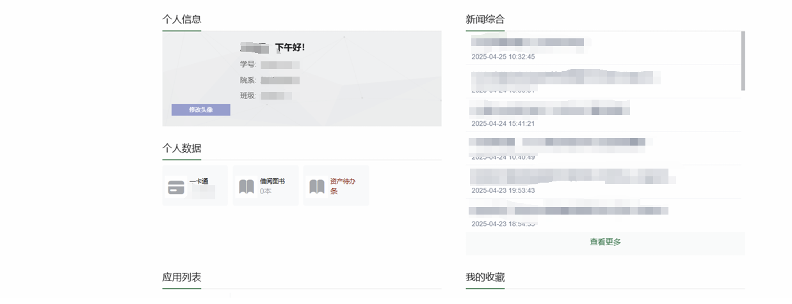

**这一步要干什么：**  
登录成功后，先不要着急点各种功能，花几分钟时间仔细观察这个门户的设计和信息暴露情况

**重点观察的地方：**

1. **个人信息展示区域** - 看看系统直接显示了哪些信息，学号格式是什么样的
2. **左侧功能菜单** - 统计有多少个子系统，哪些可能涉及敏感数据
3. **URL结构** - 观察路径设计，判断是否使用框架，API设计风格
4. **页面加载的资源** - 注意JS文件、CSS文件，有时候能发现一些有用信息

**可能存在的漏洞点：**

* 个人信息过度暴露（比如直接显示完整学号、身份证等）
* 功能模块越多，攻击面越大，权限控制容易出问题
* portal框架通常意味着后面有API接口，可能存在越权问题

**技巧思路：**  
edu系统这种"大而全"的门户设计，为了用户体验会把很多信息直接展示出来。多系统集成意味着数据要在不同模块间流转，权限控制容易出现边界模糊的问题

### 第二步：开启流量监听，观察API调用

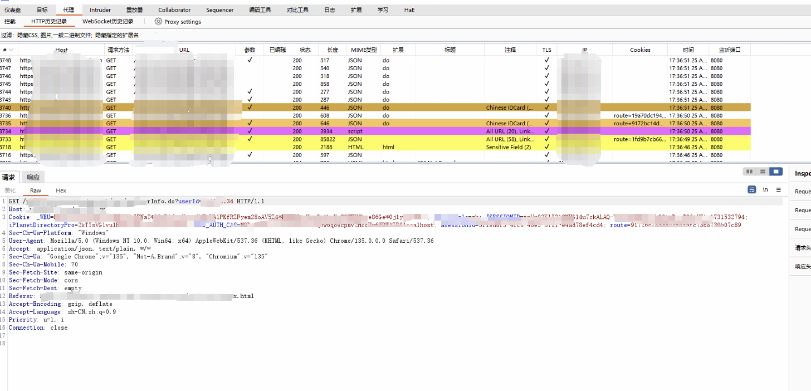

**这一步要干什么：**  
开启Burp Suite代理，正常点击系统的各个功能模块，观察后台的API调用情况。不要用任何扫描器，就是正常用户操作

**重点观察的地方：**

1. **HTTP History** - 看看每个功能对应了多少个API请求
2. **API路径规律** - 观察接口命名规则，比如getUserInfo这种明显的功能接口
3. **请求参数** - 重点关注带有ID、userid、studentid这类参数的接口
4. **响应数据** - 看看返回的JSON数据里有没有多余的敏感字段

**可能存在的漏洞点：**

* API响应包含前端不需要的敏感字段（开发者图省事，直接返回整个对象）
* 带ID参数的接口可能存在IDOR漏洞
* 某些"内部"API可能权限控制不严格

**技巧思路：**  
edu系统很多都是前后端分离设计，这给我们提供了很好的测试机会。前端需要什么数据，后端API就会返回什么，而且往往为了开发方便，会返回比前端实际需要更多的字段。重点关注那些看起来像是查询用户信息的接口，这类接口最容易出现越权问题

### 第三步：重点分析可疑接口

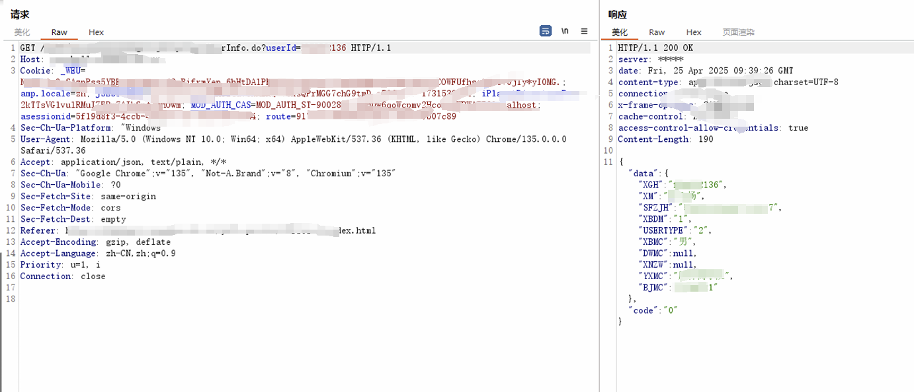

**这一步要干什么：**  
从众多API调用中筛选出最有价值的接口进行深入分析。重点关注那些明显是查询用户信息的接口

**重点观察的地方：**

1. **接口命名** - getUserInfo很明显是获取用户信息的
2. **参数设计** - userid=xxxx136，学号
3. **请求方式** - GET请求，参数直接在URL里，没有加密
4. **响应内容** - 看看返回了哪些敏感信息

**发现的问题：**

1. **敏感信息直接返回** - SFZJH字段直接返回完整身份证号
2. **参数可控性强** - userid参数没有加密，理论上可以修改
3. **权限验证缺失** - 接口可能没有验证当前用户是否有权查看指定userid的信息

**技巧思路：**  
这种getUserInfo类型的接口在edu系统中非常常见，而且经常存在IDOR问题。关键是要判断这个userid参数是否可以修改，以及系统是否会验证当前登录用户和要查询的userid是否匹配

### 第四步：IDOR漏洞验证测试

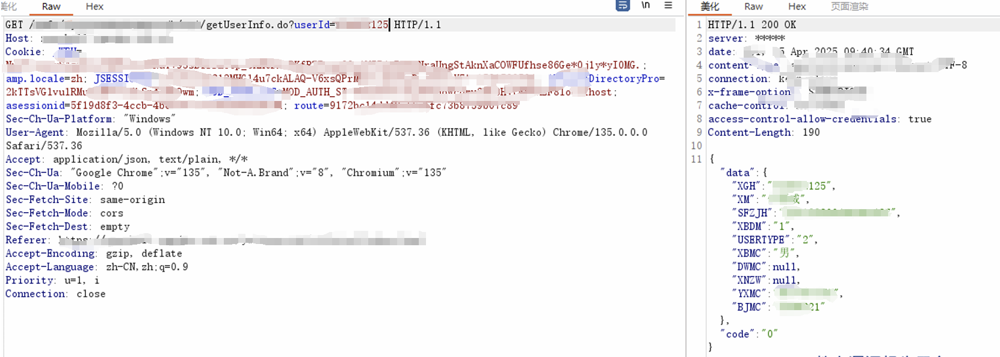

**这一步要干什么：**  
验证之前发现的可疑接口是否真的存在越权。尝试修改userid参数，看能否获取其他用户的信息

**测试方法：**

1. **找一个测试目标** - 可以随便编一个学号，或者用观察到的其他学号格式
2. **修改参数发送请求** - 把userid改成其他值
3. **观察响应结果** - 看系统是否返回了其他用户的信息

**重点观察的地方：**

1. **HTTP状态码** - 是200成功还是403拒绝？
2. **响应内容** - 如果成功，返回的是不是当前登录用户的信息？
3. **错误信息** - 如果失败，错误提示是什么？权限问题还是用户不存在？

**测试结果：**  
系统直接返回了指定userid用户的完整信息，包括身份证号码！说明：

* 系统没有验证当前登录用户是否有权查看指定用户信息
* 接口直接根据userid参数查询并返回数据
* 典型的越权漏洞确认存在

**技巧思路：**  
edu系统的越权漏洞比较常见，因为开发者往往认为"登录用户都是可信的"，忽略了用户间的权限隔离

### 第五步：信息收集的意外收获

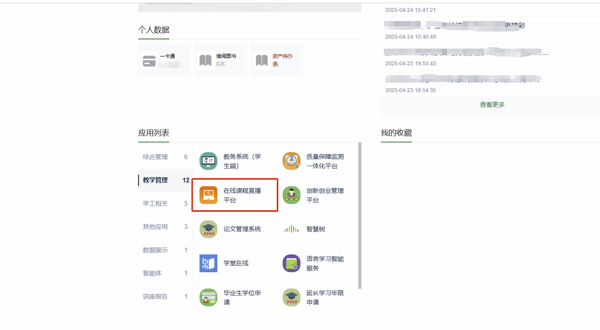

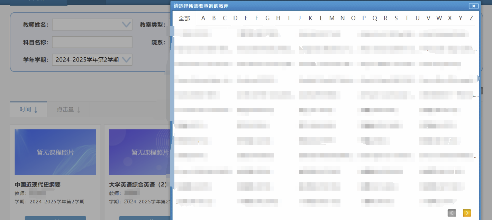

**这一步要干什么：**  
继续探索系统的其他功能模块，寻找更多有价值的信息。重点关注那些可能暴露用户列表或ID信息的页面

**重点观察的地方：**

1. **课程选择页面** - 看看是否显示任课教师信息
2. **教师列表页面** - 观察教师信息的展示方式和字段
3. **搜索功能** - 测试能否通过搜索获取更多信息
4. **工号格式规律** - 分析工号的命名规则和格式特征

**意外发现：**  
在学校的在线课程/直播选课页面，系统直接展示了所有教师的详细信息：

* 教师姓名
* 完整工号
* 所属院系
* 6000+条教师记录

**可能存在的漏洞点：**

* 教师工号信息过度暴露，为批量攻击提供了目标列表
* 系统设计时没有考虑信息泄露风险

**技巧思路：**  
信息收集是漏洞挖掘中极其重要的一环。很多时候单个漏洞的威力有限，但结合充分的信息收集，就能实现批量利用。edu系统经常会在各种功能页面无意中暴露用户ID信息，这些信息与越权漏洞结合，威力会成倍放大

### 第六步：手工验证确认

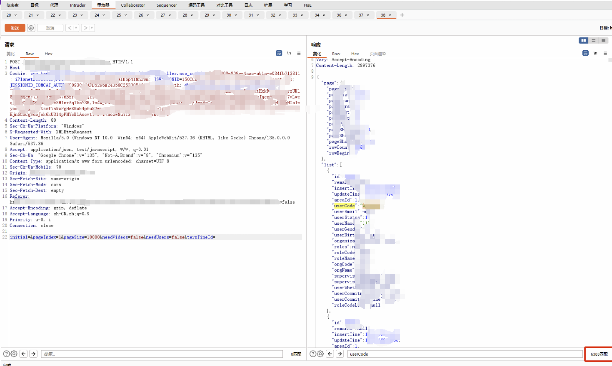

**这一步要干什么：**  
记录关键的proof-of-concept

**验证目的：**

1. **评估数据敏感度** - 确认泄露数据的具体内容和敏感程度

**手工测试：**

同上接口进行测试，就能泄露敏感数据

## 这个案例的几个防护要点

### 接口权限要做细

这个问题的根本在于接口缺乏权限验证。简单来说，系统应该检查当前用户是否有权限查看指定用户的信息，而不是来者不拒

```
# 有问题的写法
def get_user_info(userid):
    return database.query(f"SELECT * FROM users WHERE id={userid}")

# 应该这样写
def get_user_info(userid, current_user):
    if not can_access_user_info(current_user, userid):
        raise PermissionDenied("无权访问该用户信息")
    
    user_data = database.query(f"SELECT name,department FROM users WHERE id={userid}")
    return user_data
```

### 敏感信息别乱返回

API响应里包含身份证号这种敏感信息，在大多数场景下都是不必要的。前端通常只需要脱敏后的部分信息，或者根本不需要。系统设计时应该按照"最小必要"原则，只返回业务真正需要的字段

## 从这个案例能学到什么

这个攻击过程其实很简单，没用什么高深技术。关键在于两个点：一是发现了不做权限检查的API接口，二是找到了大量目标用户ID。两个信息一结合，就变成了批量敏感数据泄露

edu系统经常会出现这种问题，开发者更关注功能实现，权限控制往往比较粗糙。再加上这种"一站式"门户需要整合各种子系统，为了数据共享方便，API设计上经常会比较"开放"

对防守方来说，重点要关注几个地方：接口权限控制要做到对象级别，不能只是角色级别；敏感数据的返回要按需提供，不能图省事全部返回；各个子系统之间的安全标准要统一，不能各搞各的

# 案例二：某大学就业系统的SQL注入利用

这个案例展示了在某大学学生就业综合管理服务平台中发现SQL注入漏洞，并成功获取交互式SQL shell

### 第一步：进入个人中心观察数据

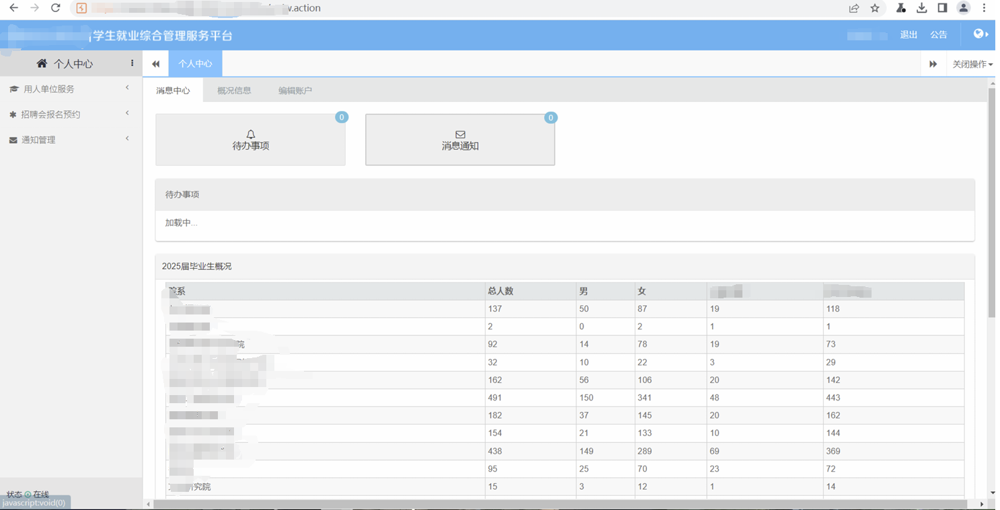

**这一步要干什么：**  
成功登录后进入个人中心，观察系统显示的数据内容和功能模块，寻找可能存在安全问题的功能点

**内容：**

* 页面显示了2025届毕业生的详细统计数据
* 包含各个院系的人数统计，如总人数、男女比例、上届对接等信息
* 左侧有功能菜单，包括"用人单位信息"、"应聘学生任务"、"简历维护"等模块
* 页面底部有版权和联系信息

**重点观察的地方：**

1. **数据展示** - 系统直接显示了详细的统计数据，说明后台有复杂的数据查询
2. **功能模块** - 左侧菜单显示了多个可能涉及数据库操作的功能
3. **用户权限** - 观察当前用户能访问哪些敏感信息
4. **数据格式** - 注意统计数据的展示方式，可能暴露数据库结构信息

**可能存在的漏洞点：**

* 统计查询功能可能存在SQL注入
* 简历维护和信息更新功能可能缺乏输入验证
* 用人单位信息查询可能存在越权访问
* 数据导出和报表功能经常是安全薄弱环节

**技巧思路：**  
就业系统的统计功能通常比较复杂，需要根据不同条件进行数据筛选和汇总。开发者为了实现灵活的查询，可能会动态构造SQL语句，这就为SQL注入创造了条件

### 第二步：发现功能点跳转中的注入点

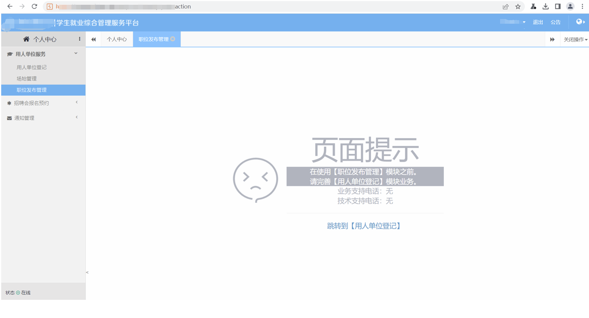

**这一步要干什么：**  
在测试系统功能时发现了页面跳转异常

**重点观察的地方：**

1. **错误页面** - 系统显示错误提示，可能是SQL语句执行失败
2. **功能位置** - 问题出现在就业数据统计模块，这类功能经常存在注入
3. **抓包分析** - 通过Burp分析HTTP请求
4. **参数识别** - 确定哪些参数可能存在注入漏洞

**技巧思路：**  
当页面出现异常或错误提示时，往往意味着后台处理出现了问题。这种情况下要及时进行抓包分析，查看具体的HTTP请求参数，很可能就能发现SQL注入点。特别是统计类功能，经常需要根据用户输入构造复杂的SQL查询

### 第三步：使用Burp Suite详细分析请求

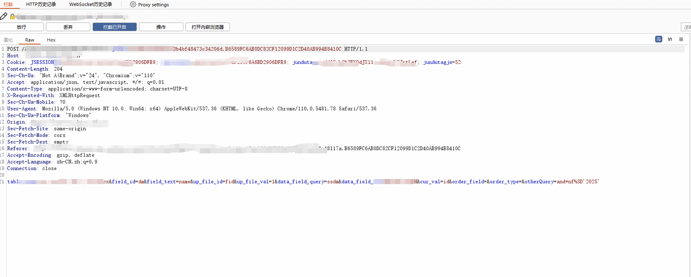

**这一步要干什么：**  
使用Burp Suite抓包放包发现一个包里有注入点

**重点观察的地方：**

1. **请求方法** - 这是一个POST请求，参数在请求体中
2. **数据格式** - 观察参数的编码方式和数据结构
3. **注入点识别** - 确定哪些参数可能被直接拼接到SQL语句中

**分析要点：**

* 识别所有用户可控的输入参数
* 分析参数的处理流程和用途
* 确定最有可能存在注入的参数
* 准备构造测试payload

**技巧思路：**  
复杂的POST请求往往包含多个参数，不是每个参数都存在注入。要根据参数名称和功能推测其用途，优先测试那些明显用于数据查询的参数，如id、name、type等

### 第四步：使用sqlmap获取交互式SQL shell

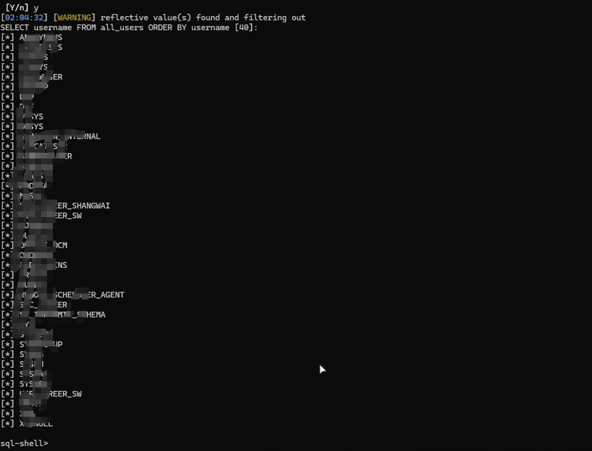

**这一步要干什么：**  
直接sqlmap一把梭拿了交互式的SQL shell

**内容：**

* 可以看到数据库中的用户列表，包含多个Oracle用户账号

**重点观察的地方：**

1. **用户枚举** - 显示了数据库中的所有用户账号，包括系统用户和业务用户
2. **权限确认** - 能够获取shell说明当前数据库用户权限较高
3. **数据库信息** - 从用户列表可以推测数据库的规模和结构

**利用成果：**

* 成功获取了Oracle数据库的交互式shell
* 可以执行SQL查询获取敏感数据
* 具备了进一步渗透的基础条件
* 确认了数据库用户权限配置存在问题

## 案例三：逻辑缺陷导致的越权访问与任意文件下载

这个案例展示了edu系统中常见的逻辑验证缺陷，通过简单的参数修改就能绕过权限检查，进而发现更多高危漏洞。

### 第一步：测试登录


### 第二步：发现参数修改可绕过验证

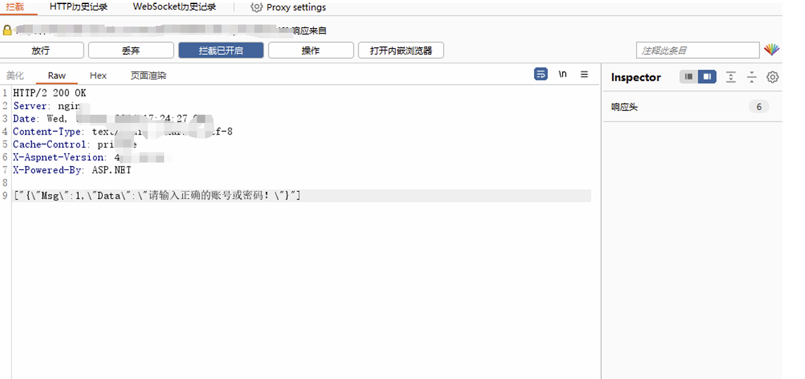

**这一步要干什么：**  
通过测试发现，修改URL中的参数从-1改为1，可以绕过某些权限验证直接进入后台系统

**重点观察的地方：**

1. **URL参数** - 观察哪个参数的修改导致了权限绕过
2. **响应变化** - 比较参数修改前后系统响应的差异
3. **验证逻辑** - 分析系统的权限验证机制
4. **访问控制** - 确认绕过验证后能访问哪些功能

**技巧思路：**  
这种简单的参数修改绕过验证在edu系统中很常见。开发者可能使用简单的数字标识来区分不同的权限级别，但没有在服务端进行严格的权限校验。测试时要多尝试修改各种参数值，特别是那些看起来像是权限标识的参数

### 第三步：发现管理员路径访问

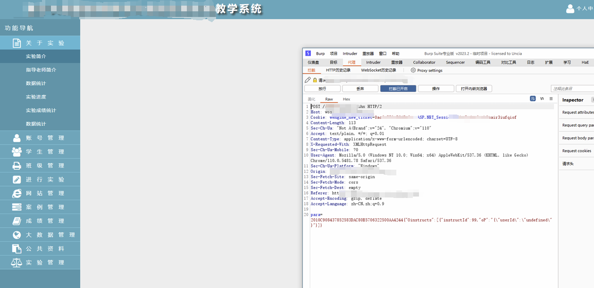

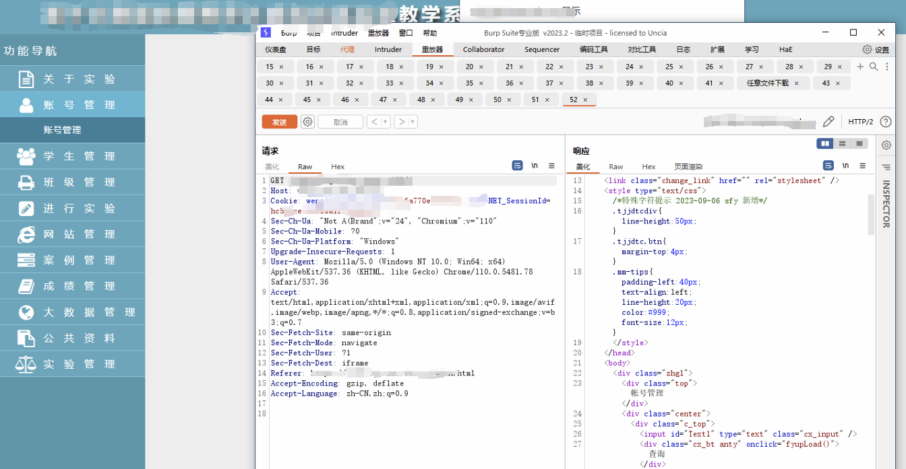


**这一步要干什么：**  
但该站点对身份校验严格，还是被踢出登录，但得到了账号管理的路径/admin/xxxxx.html

**重点观察的地方：**

1. **路径信息** - 获得了管理员功能的具体路径
2. **验证机制** - 观察系统如何检测和阻止未授权访问
3. **响应信息** - 分析被踢出时系统的响应内容
4. **路径结构** - 了解系统的URL设计模式

**技巧思路：**  
即使被系统踢出，但获得的路径信息仍然有价值。这些路径可以用于进一步的测试，比如尝试直接访问、参数修改、或者寻找相似的功能模块。edu系统的开发者往往会使用相似的命名规则，一个路径的发现可能导致更多路径的发现

### 第四步：使用专家通道绕过限制

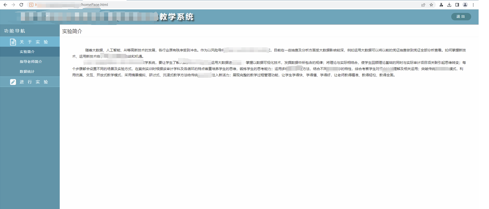

**这一步要干什么：**  
发现并使用专家通道登录后台，看看专家通道有什么可以利用的点

**重点观察的地方：**

1. **功能访问** - 通过专家通道能够访问哪些功能
2. **系统内容** - 观察系统内部的数据和功能设计
3. **安全检测** - 确认哪些地方没有进行安全检测

**技巧思路：**  
edu系统经常会设置多个访问入口，比如学生入口、教师入口、管理员入口、专家入口等。不同入口的安全检测可能不一致，某些"特殊"入口可能存在验证缺陷。在测试时要尝试发现和利用这些不同的访问通道

### 第五步：发现账号管理功能的越权访问

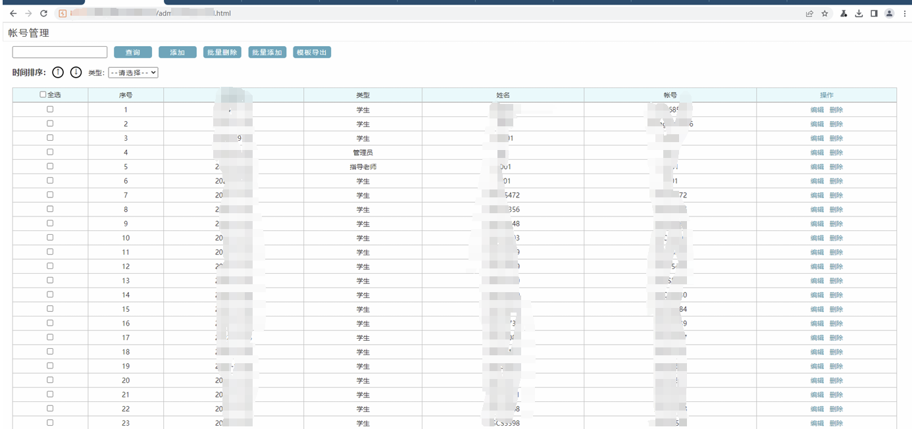

**这一步要干什么：**  
将之前得到的账号管理路径拼接到当前URL下，成功发现了可以越权访问的账号管理功能

**重点观察的地方：**

1. **越权成功** - 确认可以不通过正常权限检查访问管理功能
2. **敏感数据** - 观察泄露的用户账号和密码信息
3. **管理权限** - 查看可以进行哪些用户管理操作
4. **数据规模** - 评估涉及的用户数量和信息范围

**技巧思路：**  
路径拼接是一种常用的越权测试方法。当发现某个功能路径后，可以尝试将其与不同的base URL组合，看是否能绕过权限检查。edu系统中这种方法经常有效，因为开发者可能只在某些入口设置了权限验证，而忽略了其他访问路径

### 第六步：成功添加管理员账号

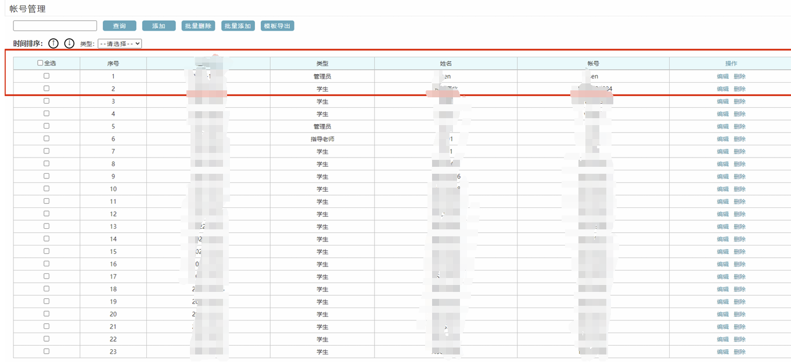

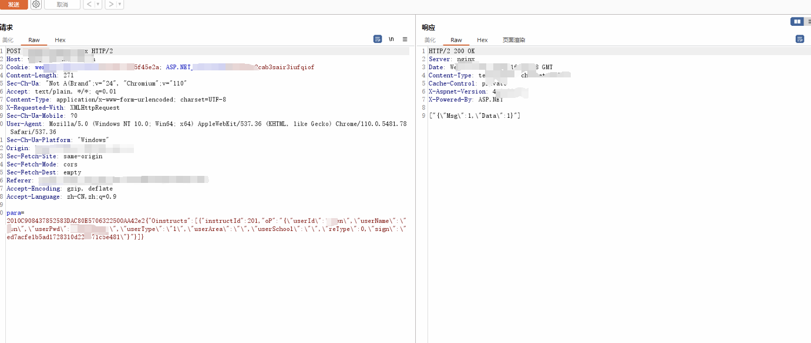


**这一步要干什么：**  
利用越权访问的账号管理功能，成功添加了一个具有管理员权限的用户账号

**重点观察的地方：**

1. **权限提升** - 成功创建了具有管理员权限的账号
2. **操作确认** - 验证添加操作是否真正生效
3. **权限设置** - 观察新账号的权限级别和功能范围
4. **系统响应** - 查看系统对添加操作的处理和反馈

### 第七步：发现密码编辑功能缺陷

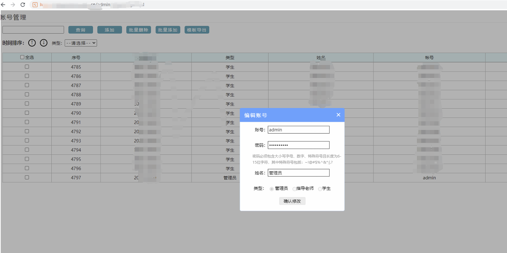

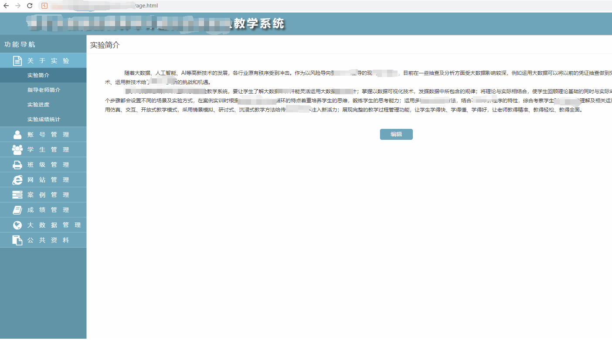

**这一步要干什么：**  
在测试管理功能时发现，可以编辑最初管理员的账号密码，都没有什么身份校验的限制，获得完整管理员权限

**重点观察的地方：**

1. **权限确认** - 最终确认获得了完整的管理员权限
2. **功能范围** - 观察可以访问的完整功能列表
3. **系统控制** - 评估对系统的控制程度
4. **后续利用** - 考虑进一步的安全测试方向

**技巧思路：**  
获得完整管理员权限后，可以进行更深入的安全测试，比如寻找文件上传漏洞、任意文件下载、数据导出等高危功能。但要注意控制测试范围，避免对系统造成实际损害

### 第八步：发现任意文件下载漏洞

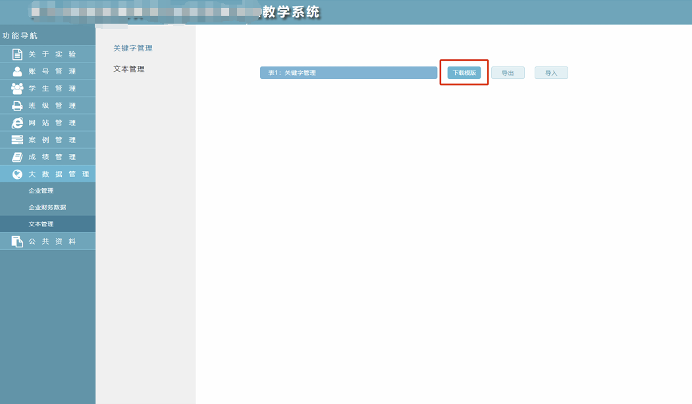

**这一步要干什么：**  
在大数据管理模块中发现了一个下载模板功能，准备对其进行抓包测试，寻找可能的任意文件下载漏洞

**重点观察的地方：**

1. **下载功能** - 确认系统提供的文件下载功能位置
2. **参数分析** - 准备分析下载请求中的参数
3. **路径控制** - 观察下载功能是否限制了文件路径
4. **权限检查** - 确认下载功能的权限验证机制

**技巧思路：**  
文件下载功能经常存在任意文件下载漏洞，特别是当下载路径可以由用户控制时。在edu系统中，这类功能往往缺乏足够的路径验证，可能允许下载系统的敏感文件

### 第九步：分析下载请求参数

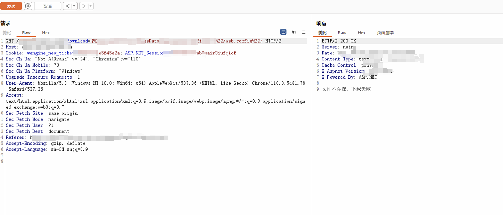

**这一步要干什么：**  
使用Burp Suite抓取下载模板的HTTP请求，分析其中的参数结构，返回文件不存在，下载失败

**重点观察的地方：**

1. **请求结构** - 分析HTTP请求的完整格式
2. **关键参数** - 识别控制下载文件的参数
3. **路径格式** - 观察文件路径的表示方式
4. **编码方式** - 确认参数的编码和传输格式

**技巧思路：**  
通过分析正常的下载请求，可以了解系统如何处理文件下载参数。这为构造恶意的下载请求提供了基础，比如尝试修改路径参数来下载系统的敏感文件

### 第十步：成功实现任意文件下载

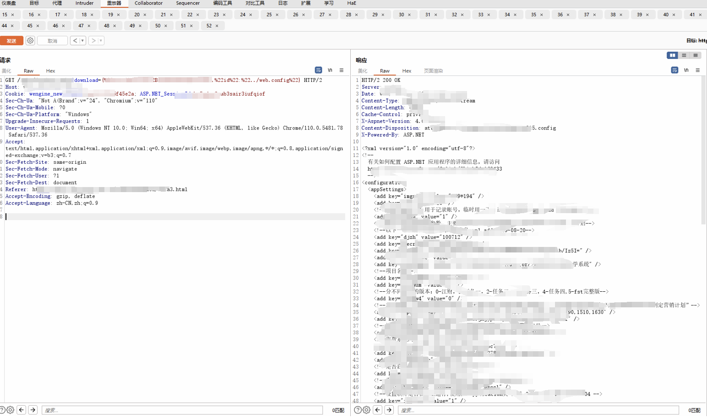

**这一步要干什么：**  
通过修改下载请求中的参数，成功实现了任意文件下载，可以下载系统中的敏感配置文件

**重点观察的地方：**

1. **参数构造** - 观察如何构造恶意的下载参数
2. **路径遍历** - 确认可以使用../进行目录遍历
3. **文件内容** - 查看成功下载的敏感文件内容
4. **漏洞确认** - 最终确认任意文件下载漏洞存在

**技巧思路：**

对比这两张图可以看出参数修改的关键：

**原始参数（修改前）：**

```
{"excel":"xxxxDataTemplate","id":"正常的模板文件名"}
```

**修改后的参数：**

```
{"excel":"xxxxDataTemplate","id":"../web.config"}
```

关键就是把id参数从正常的模板文件名改成了`../web.config`，利用目录遍历符号`../`跳出当前目录，直接访问上级目录的web.config配置文件

成功下载web.config文件,右侧显示了下载到的完整配置文件内容，包含了系统的各种配置信息

## 案例三的关键收获

### 逻辑缺陷的发现方法

这个案例最重要的经验是如何发现和利用逻辑验证缺陷。通过简单的参数修改（-1改成1）就能绕过权限验证，说明开发者在设计权限控制时缺乏安全意识。这类问题在edu系统中也是很常见

### 多入口的安全隐患

edu系统经常会设置多个访问入口（学生、教师、管理员、专家等），不同入口的安全检测标准可能不一致。测试时要尝试发现和利用这些不同的访问通道，往往能发现意想不到的安全问题

## 总结与思考

三个案例都是常见的一些漏洞，可以说edu系统的漏洞挖掘是一个很好的练手场景，系统多、漏洞类型丰富，而且通常有些高校不会有太复杂的WAF。希望师傅们能从这三个案例中获得一些启发，在实际测试中发现更多有价值的安全问题！

\*本文所涉及的漏洞均为已修复漏洞，分享仅用于安全研究和学习交流，请勿用于非法用途。
