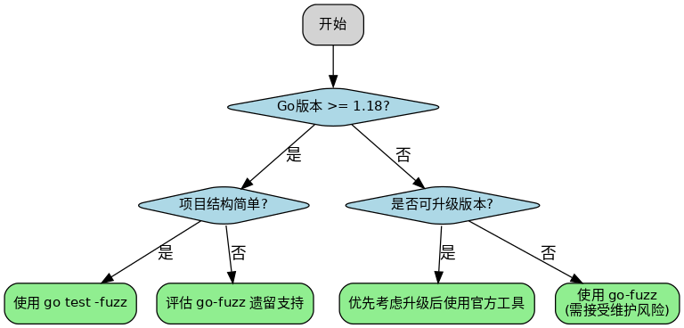
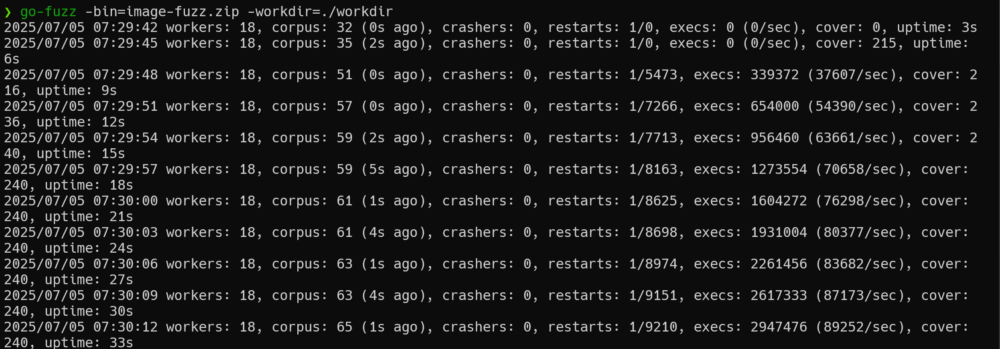
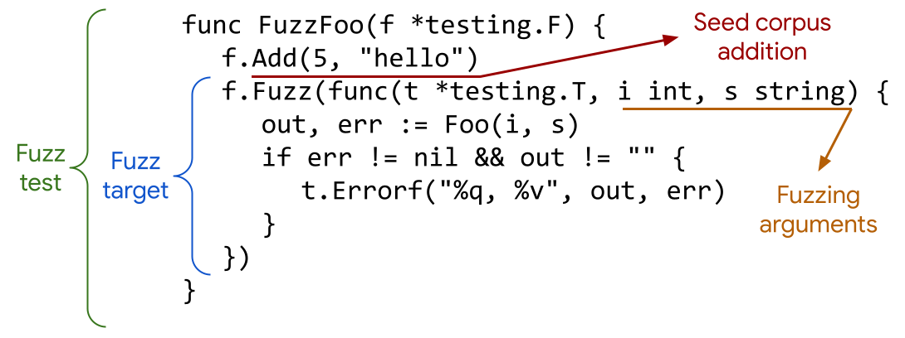

# Go语言模糊测试实战：从go-fuzz到官方工具链的漏洞挖掘之路-先知社区

> **来源**: https://xz.aliyun.com/news/19046  
> **文章ID**: 19046

---

## 技术背景

传统的AFL、libFuzzer和honggfuzz主要支持C/C++语言开发的项目。随着Rust、Go等新兴编译型语言的兴起，出现了对这些语言开发项目进行模糊测试的需求。因此，基于传统Fuzz工具的基础，逐步为这些语言构建了专用的Fuzz工具。

对Go程序的Fuzz工具主要有官方提供的go test -fuzz和第三方的go-fuzz。go-fuzz由Dmitry Vyukov开发，是较早的Go语言模糊测试解决方案，目前仍有社区维护。Go 1.18版本引入的官方工具go test -fuzz则成为Go生态的主流选择。

Go官方团队的go test -fuzz实现借鉴了go-fuzz的设计思想，将Fuzzing整合到了go test工具链和testing包中。go-fuzz基于AFL/libFuzzer的变异策略，而go test -fuzz实现了自己的变异算法。

## 引言：Go语言模糊测试生态概述

Go语言的设计哲学强调简洁性和工程实用性，这一特性在模糊测试领域同样体现得淋漓尽致。与C/C++项目需要复杂的编译配置和运行时环境不同，Go语言的模糊测试工具链更加简洁直观，但这种简洁背后仍需要深入理解其技术原理和最佳实践。

传统模糊测试工具如AFL通过进程级别的插桩和反馈机制实现覆盖率驱动的测试，而Go语言的垃圾回收机制和runtime特性使得直接移植这些工具面临技术挑战。因此，Go生态发展出了两条并行的技术路线：第三方工具go-fuzz和官方工具go test -fuzz。

go-fuzz由Dmitry Vyukov开发，借鉴了AFL和libFuzzer的核心思想，但专门针对Go语言特性进行了适配。该工具通过Go编译器的插桩机制收集覆盖率信息，实现了高效的变异策略和crash检测。该工具仍在维护中，其设计理念对Go官方工具的发展产生了深远影响。

Go 1.18版本正式引入的go test -fuzz则代表了官方的技术选择。该工具将模糊测试功能直接集成到标准测试框架中，提供了更加统一的开发体验。虽然在某些高级特性方面相比go-fuzz有所简化，但其与Go工具链的深度集成使其成为未来发展的主流方向。

## Step 1：工具生态与技术选型

### Step 1.1：Go模糊测试技术背景

Go语言的模糊测试需求源于其在关键基础设施中的广泛应用。从Docker、Kubernetes到Ethereum、Bitcoin节点实现，Go项目承载着巨大的安全责任。这些项目通常处理复杂的网络协议、文件格式或加密算法，传统的单元测试难以覆盖所有边界条件。

模糊测试通过大量随机或半随机输入来探索程序的异常执行路径，能够发现那些在正常测试中被忽略的边界情况。对于Go项目而言，模糊测试特别适合以下场景：

**协议解析测试**：HTTP、gRPC、protobuf等协议解析器经常处理不可信输入，需要验证对恶意构造数据的处理能力。

**文件格式处理**：PDF、图像、压缩文件等二进制格式解析器存在大量复杂的状态转换，容易出现边界条件错误。

**加密算法实现**：密码学库的实现需要验证对异常输入的处理，确保不会泄露敏感信息或导致拒绝服务。

**网络服务接口**：Web API、数据库接口等需要验证对异常请求的处理能力。

### Step 1.2：工具选择决策树

选择合适的Go模糊测试工具需要考虑多个技术因素：

**项目兼容性**：Go版本要求、依赖库支持、编译环境配置复杂度。

**功能完整性**：变异策略丰富度、覆盖率收集精度、crash分析能力。

**性能表现**：测试执行效率、内存占用、并发处理能力。

**维护状态**：社区活跃度、bug修复响应、功能更新频率。

**集成难度**：CI/CD流水线集成、现有测试框架兼容性、学习成本。

###### 决策流程：



### Step 1.3：技术架构对比分析

go-fuzz和go test -fuzz在技术架构上存在显著差异，这些差异直接影响了工具的适用场景和性能表现。

**覆盖率收集机制**：

* go-fuzz：通过编译时插桩收集基本块覆盖率，精度较高但编译开销大
* go test -fuzz：集成到Go runtime中，覆盖率收集开销更小但精度略低

**变异策略**：

* go-fuzz：基于AFL的变异算法，支持字典文件和自定义变异函数
* go test -fuzz：Go团队自研的变异算法，优化了对Go数据类型的支持

**并发处理**：

* go-fuzz：支持多进程并行，可充分利用多核CPU资源
* go test -fuzz：基于goroutine的并发模型，内存开销更小

**crash处理**：

* go-fuzz：提供详细的crash分析工具，支持自动最小化
* go test -fuzz：集成到测试框架中，crash处理相对简化

这些技术差异决定了两个工具的适用场景：go-fuzz更适合专业的安全测试场景，而go test -fuzz更适合日常开发流程中的集成测试。

## Step 2：go-fuzz深度解析与实践

### Step 2.1：接口设计与数据流

go-fuzz要求目标程序实现标准化的测试接口，这种设计借鉴了libFuzzer的LLVMFuzzerTestOneInput函数概念。标准接口定义如下：

```
func Fuzz(data []byte) int
```

返回值语义（根据官方文档）：

* `1`：fuzzer应该增加此输入在后续fuzzing中的优先级（例如，输入在词法上正确并成功解析）
* `-1`：即使提供了新的覆盖率，输入也不得添加到语料库中
* `0`：其他情况，中性处理

除此之外，go-fuzz还会自动捕获panic、程序崩溃等异常情况作为bug发现的主要机制。

### Step 2.2：环境搭建与依赖管理

go-fuzz的安装需要特定的依赖库支持，其中go-fuzz-dep是运行时必需的覆盖率收集库：

```
# 安装核心工具
go install github.com/dvyukov/go-fuzz/go-fuzz@latest
go install github.com/dvyukov/go-fuzz/go-fuzz-build@latest

# 初始化项目依赖
go mod init fuzz_target
go get github.com/dvyukov/go-fuzz/go-fuzz-dep
```

go-fuzz-dep库通过编译时插桩机制在目标代码中注入覆盖率收集逻辑。这种实现方式要求所有参与测试的代码都必须通过go-fuzz-build进行重新编译，生成包含插桩代码的测试二进制文件。

### Step 2.3：实战案例：PNG解码器测试

以PNG图像解码为例，展示go-fuzz的完整使用流程：

```
//测试PNG包
package png

import (
    "bytes"
    "image/png"
)

func Fuzz(data []byte) int {
    img, err := png.Decode(bytes.NewReader(data))
    if err != nil {
        if img != nil {
            panic("解码出错但img不为nil")
        }
        return 0
    }
    
    var w bytes.Buffer
    err = png.Encode(&w, img) //目标函数
    if err != nil {
        panic(err)
    }
    return 1
}
```

这个示例体现了几个关键设计原则：

**状态一致性检查**：验证错误条件下的内部状态，发现潜在的内存安全问题。

**往返测试**：通过重新编码验证解码结果的有效性，确保数据处理的完整性。

**明确的返回值策略**：成功解码返回1，失败但状态正常返回0，异常情况触发panic。

### Step 2.4：构建与语料库配置

构建过程需要生成专用的测试二进制文件：

```
# 构建插桩版本的测试程序
go-fuzz-build -o png-fuzz.zip

# 创建工作目录结构
mkdir -p workdir/corpus

# 准备初始种子文件
cp sample.png workdir/corpus/
echo -n "PNG_HEADER" > workdir/corpus/minimal.txt
```

语料库目录结构对测试效果有直接影响：

* 高质量的种子文件能加速覆盖率增长
* 多样化的输入格式有助于探索不同的代码路径
* 最小有效输入可以提高变异效率

### Step 2.5：执行监控与性能调优

启动模糊测试并监控执行状态：

```
go-fuzz -bin=png-fuzz.zip -workdir=./workdir
```

执行过程中的关键指标：



指标解读：

* `workers`：并行执行的测试进程数量，使用-procs标志设置，应与CPU核心数匹配
* `corpus`：模糊测试程序发现的有趣输入的当前数量，括号内的时间表示发现最后一个有趣输入的时间
* `crashers`：发现的bug数量，可查看workdir/crashers目录获取详细信息
* `restarts`：模糊测试程序重新启动测试进程的速率，过高可能表示内存泄漏或程序不稳定
* `execs`：总执行次数和执行速率，反映测试效率
* `cover`：在经过哈希处理的覆盖率位图中设置的位数，衡量代码覆盖广度

### Step 2.6：Crash分析与复现流程

当go-fuzz检测到crash时，会生成三个关联文件：

1. **原始输入文件**（如`a1b2c3d4`）：触发crash的二进制数据
2. **可读格式文件**（如`a1b2c3d4.quoted`）：使用Go字符串语法转义的输入内容
3. **输出日志文件**（如`a1b2c3d4.output`）：panic信息和调用栈

典型的crash分析流程：

```
# 查看crash输出
cat workdir/crashers/a1b2c3d4.output

# 复现特定crash
go-fuzz -bin=png-fuzz.zip -workdir=workdir -crash=workdir/crashers/a1b2c3d4

# 最小化crash输入
go-fuzz -bin=png-fuzz.zip -workdir=workdir -crash=workdir/crashers/a1b2c3d4 -reduce=1
```

最小化功能通过逐步删除输入数据的非关键部分，生成能触发相同crash的最小输入。这对漏洞分析和补丁验证具有重要价值。

### Step 2.7：libFuzzer集成与跨平台兼容

在Linux环境下，go-fuzz支持生成libFuzzer兼容的目标文件：

```
# 构建libFuzzer兼容目标
go-fuzz-build -libfuzzer -o png.a .

# 使用Clang编译最终可执行文件
clang -fsanitize=fuzzer png.a -o png_libfuzzer

# 运行模糊测试
mkdir -p corpus
./png_libfuzzer

# 高级运行参数
./png_libfuzzer -max_total_time=3600 -print_final_stats=1

# 最小化复现崩溃
./png_libfuzzer -minimize_crash=1 -runs=100 crash_input
```

这种集成模式允许将Go项目纳入基于libFuzzer的现有测试流水线，特别适合多语言混合项目的统一测试管理。libFuzzer模式相比go-fuzz原生模式具有以下优势：

**技术优势**：

* 统一的命令行接口和参数格式
* 更丰富的运行时配置选项
* 与LLVM工具链的深度集成
* 支持AddressSanitizer等检测工具

**应用场景**：

* 多语言项目的统一测试框架
* 需要与现有libFuzzer基础设施集成
* 要求详细的崩溃分析和最小化功能

## Step 3：go test -fuzz官方工具链实践

go test -fuzz是官方test工具的集成，也有很多地方参考了go-fuzz。

### Step 3.1：基础实例

下面是官方模糊测试的示例，突出显示了其主要的组件



使用 go test fuzz，首先需要创建一个以\_test.go结尾的测试文件。然后我们需要编写它的测试入口函数，要求必须以Fuzz字段开头。然后通过f.Add指定初始种子，然后通过f.Fuzz的s参数进行数据的投喂。

```
package fuzz

import (
    "testing"
    "net/url"
)

func FuzzParseURL(f *testing.F) {
    f.Add("https://example.com") // 种子输入
    f.Fuzz(func(t *testing.T, s string) {
        if _, err := url.Parse(s); err != nil { //目标函数
            t.Skip() // 忽略无效输入
        }
    })
}
```

编写测试文件我们必须遵循以下规则：

* 测试函数必须命名为FuzzXXX格式，仅接受\*testing.F参数，无返回值。
* 测试代码必须位于\*\_test.go文件中才能执行。
* 测试目标必须是通过(*testing.F).Fuzz调用的方法，第一个参数为*testing.T，后接模糊参数，无返回值。
* 每个文件只能有一个测试目标。
* 所有种子语料条目必须与模糊参数类型完全匹配且顺序一致（适用于(\*testing.F).Add调用和testdata/fuzz目录中的语料文件）。

我们可以直接使用f.Add来添加种子用例，但是如果我们想要将文件添加为种子则需要自己实现这部分代码。

如：

```
package fuzz

import (
    "bytes"
    "os"
    "testing"
    "net/url"
)

func FuzzParseURL(f *testing.F) {
    if data, err := os.ReadFile("/corpus/url.txt"); err == nil {
        f.Add(string(data))
    }

    f.Add("https://example.com") // 种子输入
    f.Fuzz(func(t *testing.T, s string) {
        if _, err := url.Parse(s); err != nil {
            t.Skip() // 忽略无效输入
        }
    })
}
```

### Step 3.2：Fuzzing

通过-fuzz参数指定要测试的目标函数名开始模糊测试。

```
#初始包
go mod init fuzz_url
go mod tidy

# 运行模糊测试（默认会无限运行）
go test -fuzz=FuzzParseURL
```

常用参数：

* -fuzz: 指定要运行的模糊测试函数名。
* -fuzztime：设置运行持续时间（如 "10s"、"1h"，默认为无限）。
* -fuzzminimizetime：最小化崩溃用例的时间（默认60秒，0表示禁用）。
* -parallel：并行进程数（默认GOMAXPROCS）

默认情况下，每个种子语料条目都会作为单元测试执行。启用模糊测试后，匹配的测试会持续运行直到发现 crash 为止。

### Step 3.3：Crash分析

当出现以下情况会触发 crash：

* 代码或测试发生panic
* 调用t.Fail等失败方法
* 不可恢复错误（如os.Exit）
* 执行超时（默认1秒）

crash 时会自动最小化输入并保存到testdata/fuzz/目录，可作为回归测试用例。

通过运行目标函数可以复现 crash：

```
go test -run=FuzzPDF 
```

然后通过分析 crash 的调用栈，可以定位到漏洞函数部分。

## Step 3小结：工具对比与选择建议

### go test fuzz 与 go-fuzz 的对比：

* 目前仅支持`[]byte` 和`string` 作为模糊测试输入类型。而 go-fuzz 支持更多的复杂输入类型，可以通过自定义的变异函数来处理各种自定义格式； go test fuzz 相比 go-fuzz 缺少一些高级功能（如自定义变异策略、覆盖率可视化、并发控制等）； go test fuzz 性能不如编译为独立二进制的 go-fuzz（`go-fuzz` 避开了 testing 框架的调度开销）； go test fuzz 触发一个 crash 就会停止，无法像 go-fuzz 一样自动化的持续模糊测试。

## Step 4：pdfcpu漏洞发现实战案例

### Step 4.1：目标分析与测试范围确定

pdfcpu是一个纯Go实现的PDF处理库，提供了完整的PDF读取、写入、验证、优化等功能。作为处理复杂二进制格式的库，pdfcpu具有理想的模糊测试特征：

**复杂输入格式**：PDF格式包含多层嵌套结构、交叉引用表、对象流等复杂组件  
**状态机处理**：PDF解析涉及大量状态转换和错误处理分支  
**内存操作密集**：字符串解析、缓冲区管理、切片操作频繁  
**安全敏感性**：作为文档处理库，经常接触不可信输入数据

选择pdfcpu作为测试目标的技术考量：

* Go语言编写，便于集成模糊测试工具
* 开源项目，可以深入分析源码和调用栈
* 复杂的输入格式，容易触发边界条件
* 活跃维护，发现的漏洞具有实际修复价值

### Step 4.2：Fuzzer实现与种子策略

针对pdfcpu的模糊测试实现需要选择合适的API入口点。经过分析，选择`api.Validate`函数作为测试目标，原因如下：

**覆盖范围广**：Validate函数会调用完整的PDF解析流程  
**错误处理完整**：包含了大多数异常情况的处理逻辑  
**接口简洁**：只需要提供PDF数据，无需复杂的参数配置

```
package fuzz

import (
    "bytes"
    "os"
    "testing"

    "github.com/pdfcpu/pdfcpu/pkg/api"
    "github.com/pdfcpu/pdfcpu/pkg/pdfcpu/model"
)

func FuzzPDF(f *testing.F) {
    if data, err := os.ReadFile("/root/corpus/pdf/pdf.pdf"); err == nil {
        f.Add(data)
    }

    f.Fuzz(func(t *testing.T, data []byte) {
        r := bytes.NewReader(data)
        conf := model.NewDefaultConfiguration()
        _ = api.Validate(r, conf)
    })
}
```

### Step 4.3：漏洞触发与分析

通过执行`go test -fuzz=FuzzPDF`，成功触发了一个runtime panic：

```
panic: runtime error: slice bounds out of range [-1:]

goroutine 1 [running]:
github.com/pdfcpu/pdfcpu/pkg/pdfcpu/model.skipStringLit({0xc0001a9c00?, 0xf9c8e8?}, 0xc0001a9c00?, 0x400?, 0x0?, 0xc0001a9c00?)
    /root/.local/go/pkg/mod/github.com/pdfcpu/pdfcpu@v0.11.0/pkg/pdfcpu/model/parse.go:1273 +0xd4
github.com/pdfcpu/pdfcpu/pkg/pdfcpu/model.skipCommentOrStringLiteral({0xc0001a9c00?, 0x400?}, 0xf9c8e8?, 0x1?, 0x1299540?, 0xc0001a9c00?, 0x0?)
    /root/.local/go/pkg/mod/github.com/pdfcpu/pdfcpu@v0.11.0/pkg/pdfcpu/model/parse.go:1302 +0x65
github.com/pdfcpu/pdfcpu/pkg/pdfcpu/model.DetectKeywordsWithContext({0xfa59b8, 0x12b9280}, {0xc0001a9c00?, 0x400?})
    /root/.local/go/pkg/mod/github.com/pdfcpu/pdfcpu@v0.11.0/pkg/pdfcpu/model/parse.go:1349 +0x1b7
github.com/pdfcpu/pdfcpu/pkg/pdfcpu.buffer({0xfa59b8, 0x12b9280}, {0xfa1c80, 0xc0001b0ae0})
    /root/.local/go/pkg/mod/github.com/pdfcpu/pdfcpu@v0.11.0/pkg/pdfcpu/read.go:1752 +0x191
github.com/pdfcpu/pdfcpu/pkg/pdfcpu.parseXRefStream({0xfa59b8, 0x12b9280}, 0xc00027a900, {0xfa1c80?, 0xc0001b0ae0?}, 0xc00019da08, 0x0, 0x1)
    /root/.local/go/pkg/mod/github.com/pdfcpu/pdfcpu@v0.11.0/pkg/pdfcpu/read.go:696 +0x132
github.com/pdfcpu/pdfcpu/pkg/pdfcpu.buildXRefTableStartingAt({0xfa59b8, 0x12b9280}, 0xc00027a900, 0xc00019da08)
    /root/.local/go/pkg/mod/github.com/pdfcpu/pdfcpu@v0.11.0/pkg/pdfcpu/read.go:1606 +0x3c9
github.com/pdfcpu/pdfcpu/pkg/pdfcpu.readXRefTable({0xfa59b8, 0x12b9280}, 0xc00027a900)
    /root/.local/go/pkg/mod/github.com/pdfcpu/pdfcpu@v0.11.0/pkg/pdfcpu/read.go:1643 +0x12e
github.com/pdfcpu/pdfcpu/pkg/pdfcpu.ReadWithContext({0xfa59b8, 0x12b9280}, {0xfa34c8?, 0xc0001abc20?}, 0xc000035dd0?)
    /root/.local/go/pkg/mod/github.com/pdfcpu/pdfcpu@v0.11.0/pkg/pdfcpu/read.go:107 +0x1a5
github.com/pdfcpu/pdfcpu/pkg/pdfcpu.Read(...)
    /root/.local/go/pkg/mod/github.com/pdfcpu/pdfcpu@v0.11.0/pkg/pdfcpu/read.go:78
github.com/pdfcpu/pdfcpu/pkg/api.ReadContext({0xfa34c8?, 0xc0001abc20?}, 0x120?)
    /root/.local/go/pkg/mod/github.com/pdfcpu/pdfcpu@v0.11.0/pkg/api/api.go:74 +0x9f
github.com/pdfcpu/pdfcpu/pkg/api.Validate({0xfa34c8, 0xc0001abc20}, 0xc0001d3f40?)
    /root/.local/go/pkg/mod/github.com/pdfcpu/pdfcpu@v0.11.0/pkg/api/validate.go:44 +0x9a
main.main()
    /root/project/pdfcpu/demo.go:17 +0xb9
exit status 2
```

**最小化复现代码**：

```
package main

import (
    "bytes"
    "fmt"

    "github.com/pdfcpu/pdfcpu/pkg/api"
    "github.com/pdfcpu/pdfcpu/pkg/pdfcpu/model"
)

func main() {
    data := []byte("%PDF-1.0stream
0000")
    r := bytes.NewReader(data)
    conf := model.NewDefaultConfiguration()
    if err := api.Validate(r, conf); err != nil {
        fmt.Printf("Validation error: %v
", err)
    } else {
        fmt.Println("Validation succeeded.")
    }
}
```

### Step 4.4：源码分析与根因定位

通过分析pdfcpu v0.11.0的实际源码，定位到问题的根本原因：

**实际的漏洞触发链**：

```
// pkg/pdfcpu/model/parse.go:1272 实际源码
func skipStringLit(line string, strLitPos int, off, endInd, streamInd *int) (string, error) {
    l, i, err := positionAfterStringLiteral(line[strLitPos:])  // 关键：line[strLitPos:]
    if err != nil {
        return "", err
    }
    delta := strLitPos + i
    *off += delta
    // ... 其他处理逻辑
    return l, nil
}

func positionAfterStringLiteral(line string) (string, int, error) {
    i := balancedParenthesesPrefix(line)
    if i < 0 {
        return "", 0, errStringLiteralCorrupt
    }
    line = forwardParseBuf(line[i:], 1)
    return line, i + 1, nil
}

// balancedParenthesesPrefix函数中的实际逻辑
func balancedParenthesesPrefix(s string) int {
    var j int
    escaped := false
    
    for i := 0; i < len(s); i++ {
        c := s[i]
        if !escaped && c == '\' {
            escaped = true
            continue
        }
        if escaped {
            escaped = false
            continue
        }
        if c == '(' {
            j++
        }
        if c == ')' {
            j--
        }
        if j == 0 {
            return i  // 返回闭合括号位置
        }
    }
    return -1  // 未找到匹配的闭合括号
}
```

**根因分析**：

根据真实源码分析，漏洞的实际触发机制是：

1. **切片越界的直接原因**：在`skipStringLit`函数第1273行，`line[strLitPos:]`切片操作未检查`strLitPos`的边界
2. **触发条件**：当`strLitPos`为-1时（来自上层调用链中的`detectNonEscaped`函数返回值）
3. **调用链分析**：

* `DetectKeywordsWithContext` → `skipCommentOrStringLiteral` → `skipStringLit`
* `detectNonEscaped(line, "(")`返回-1表示未找到字符串字面量
* 这个-1值直接传递给`skipStringLit`作为`strLitPos`参数

1. **实际问题**：缺少对`strLitPos < 0`的边界检查，导致`line[-1:]`触发panic

**核心问题代码**：

```
// 当strLitPos为-1时，line[strLitPos:]即line[-1:]会触发panic
l, i, err := positionAfterStringLiteral(line[strLitPos:])
```

**漏洞特征总结**：

* **触发条件**：恶意构造的PDF文件导致字符串位置检测返回-1
* **错误类型**：slice bounds out of range [-1:]
* **影响范围**：PDF关键字检测和字符串解析过程
* **安全影响**：拒绝服务攻击，程序崩溃
* **利用输入**：`%PDF-1.0stream\
  0000`（最小化测试用例）
* **修复方案**：在`skipStringLit`函数中添加边界检查：

```
if strLitPos < 0 {
    return "", errors.New("invalid string literal position")
}
```

### Step 4.5：漏洞利用与影响评估

该漏洞属于拒绝服务(DoS)类型，具体影响如下：

**直接影响**：

* 任何处理恶意PDF文件的应用程序会崩溃
* 基于pdfcpu构建的Web服务可能被恶意PDF请求攻击
* 批量PDF处理任务会中断

**安全影响评估**：

* 影响范围：所有使用pdfcpu v0.11.0及以下版本的应用
* 触发条件：处理包含特定格式字符串的PDF文件
* 攻击复杂度：低，可以构造小于100字节的恶意PDF
* 权限要求：无，只需要能够提供PDF输入

**实际利用场景**：

```
// 基于issue中的最小化测试用例
maliciousPDF := []byte("%PDF-1.0stream
0000")

// 触发漏洞的函数调用
func triggerVulnerability() {
    r := bytes.NewReader(maliciousPDF)
    conf := model.NewDefaultConfiguration()
    // 这将导致slice bounds out of range [-1:] panic
    api.Validate(r, conf)
}
```

### Step 4.6：修复建议与防护措施

**代码修复方案**：

```
func skipStringLit(line string, strLitPos int, off, endInd, streamInd *int) (string, error) {
    // 修复：添加边界检查
    if strLitPos < 0 || strLitPos >= len(line) {
        return "", errors.New("invalid string literal position")
    }
    
    l, i, err := positionAfterStringLiteral(line[strLitPos:])
    if err != nil {
        return "", err
    }
    delta := strLitPos + i
    *off += delta
    
    // 调整索引位置的边界检查
    if *endInd > delta {
        *endInd -= delta
    } else if *endInd != -1 {
        *endInd = 0
    }
    if *streamInd > delta {
        *streamInd -= delta
    } else if *streamInd != -1 {
        *streamInd = 0
    }
    
    return l, nil
}
```

**应用层防护措施**：

1. **输入验证**：在处理PDF文件前进行基础格式检查
2. **异常处理**：使用recover机制捕获panic，避免程序崩溃
3. **资源限制**：限制PDF文件大小和处理时间
4. **版本管理**：及时更新到修复版本

```
func safePDFValidate(data []byte) (err error) {
    // 基础格式检查
    if len(data) < 5 || !bytes.HasPrefix(data, []byte("%PDF-")) {
        return errors.New("invalid PDF header")
    }
    
    // 大小限制
    if len(data) > 100*1024*1024 { // 100MB限制
        return errors.New("PDF file too large")
    }
    
    // panic恢复机制
    defer func() {
        if r := recover(); r != nil {
            err = fmt.Errorf("PDF validation panic: %v", r)
        }
    }()
    
    reader := bytes.NewReader(data)
    conf := model.NewDefaultConfiguration()
    return api.Validate(reader, conf)
}

// 使用示例
func handlePDFUpload(data []byte) error {
    if err := safePDFValidate(data); err != nil {
        if strings.Contains(err.Error(), "panic") {
            // 记录潜在的安全问题
            log.Printf("Potential security issue in PDF: %v", err)
        }
        return err
    }
    return nil
}
```

### Step 4.7：漏洞影响评估

**漏洞影响评估**：

* **严重程度**：中等（DoS攻击）
* **影响范围**：所有使用pdfcpu v0.11.0的应用
* **修复紧迫性**：较高（易于触发，影响可用性）

### Step 4.8：测试用例与回归验证

基于发现的漏洞，可以构建完整的回归测试用例：

```
func TestPDFStringLiteralParsing(t *testing.T) {
    testCases := []struct {
        name        string
        input       []byte
        expectPanic bool
    }{
        {
            name: "minimal_crash_case",
            input: []byte(`%PDF-1.4
1 0 obj<</Contents(\`)
            expectPanic: false, // 修复后不应该panic
        },
        {
            name: "escaped_parenthesis",
            input: []byte(`%PDF-1.4
1 0 obj<</Contents(\)test)>>`)
            expectPanic: false,
        },
        {
            name: "empty_string",
            input: []byte(`%PDF-1.4
1 0 obj<</Contents()>>`)
            expectPanic: false,
        },
    }
    
    for _, tc := range testCases {
        t.Run(tc.name, func(t *testing.T) {
            defer func() {
                r := recover()
                if (r != nil) != tc.expectPanic {
                    t.Errorf("Expected panic=%v, got panic=%v", tc.expectPanic, r != nil)
                }
            }()
            
            _, _ = api.Validate(bytes.NewReader(tc.input), nil)
        })
    }
}
```

这个案例展示了Go模糊测试在实际漏洞发现中的完整流程：从目标选择、fuzzer编写、漏洞触发到根因分析和修复验证，体现了模糊测试在提升软件安全性方面的实际价值。

## Step 5：工具选择与实践总结

在Go模糊测试的实践过程中，工具选择往往决定了测试效果和开发效率。本章节将基于实际项目经验，对主流工具进行客观对比，并分享一些实战心得，希望能为各位师傅的技术选型提供参考。

### Step 5.1：工具特性对比分析

经过在多个项目中的实际使用，go-fuzz和go test -fuzz各有其适用场景：

|  |  |  |  |
| --- | --- | --- | --- |
| 对比维度 | go-fuzz | go test -fuzz | 推荐场景 |
| **部署复杂度** | 需要额外安装和配置 | Go 1.18+内置 | 新项目首选官方工具 |
| **学习成本** | 需要理解AFL机制和插桩原理 | 遵循标准testing框架 | 团队快速上手选官方 |
| **执行性能** | 独立进程，性能更高 | testing框架有调度开销 | 长期测试选go-fuzz |
| **变异算法** | 基于AFL，算法成熟 | Go团队优化的算法 | 算法质量相当 |
| **崩溃分析** | 提供专门的分析工具 | 集成在go test中 | 深度分析需go-fuzz |
| **工具生态** | 第三方生态丰富 | 官方生态支持 | CI/CD集成选官方 |

### Step 5.2：选择决策建议

根据不同项目特点，推荐以下选择策略：

**go test -fuzz适用场景**：

* Go版本≥1.18的新项目
* 需要集成到现有测试流程中
* 团队Go经验相对有限
* 重视官方支持和长期维护

**go-fuzz适用场景**：

* 专业的安全测试需求
* 需要自定义变异策略
* 长时间无人值守的fuzz测试
* 对性能要求较高的场景

### Step 5.3：实践经验分享

在pdfcpu漏洞发现过程中，积累了一些实用经验：

**测试策略**：

* 选择合适的API入口点，避免过于底层或过于上层的接口
* 准备有效的种子文件，提高变异的起始质量
* 结合静态分析，针对性地测试高风险代码路径

**效率提升**：

* 设置合理的超时时间，避免在无效输入上浪费资源
* 定期清理生成的语料库，控制磁盘空间使用
* 建立crash去重机制，避免重复分析相同问题

**问题处理**：

* 建立standardized的漏洞报告流程
* 保留完整的复现环境和步骤
* 与项目维护者保持良好的沟通

### Step 5.4：技术发展趋势

Go模糊测试技术正朝着更加成熟和易用的方向发展：

**官方工具完善**：go test -fuzz功能持续增强，逐步缩小与第三方工具的差距

**生态系统建设**：更多开源项目开始集成模糊测试，形成良性循环

**安全意识提升**：开发团队对模糊测试的接受度和重视程度不断提高

## 结论与展望

本文从技术选型、工具使用到实际漏洞发现，展示了Go语言模糊测试的应用价值。pdfcpu案例证明了模糊测试在实际项目中发现安全问题的有效性，为Go生态的安全建设提供了可行的技术路径。

希望本文的技术分析和实战经验能为各位师傅在安全研究和开发实践中提供有用的参考。Go语言模糊测试技术仍在快速发展中，期待与各位师傅共同探索更多的应用场景和优化方案。
