# 通过某钓鱼文件样本分析获取到白加黑免杀思路-先知社区

> **来源**: https://xz.aliyun.com/news/19050  
> **文章ID**: 19050

---

### 前言

```
学习两年半的网安练习生，最近通过在微步社区获取到的钓鱼文件，
对其进行样本分析，并学习相关的免杀思路。
```

### 钓鱼样本分析

#### 样本概况

```
SHA256:d9f8999a6325a144f051f865ca220a05636ae99e1c62d136cfec1e4bc92702f0
MD5:343d4a9bdace05b20e15d11fe4a5d578
SHA1:2a8f9156c094a303031c6826ef41df94f3723b94
```

##### 网络行为

远程连接C2地址：[47.93.134.232](https://x.threatbook.com/v5/ip/47.93.134.232)

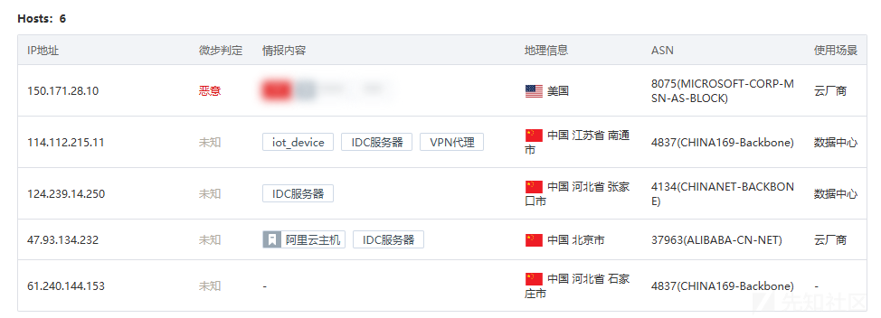

##### 行为分析

开局一个压缩包，解压之后存在两个pdf文件、一个docx后缀的快捷方式以及一个隐藏文件夹a

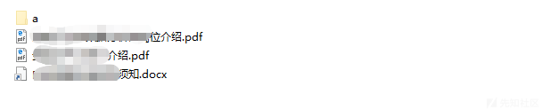

右键查看快捷方式

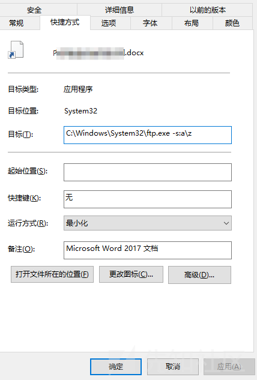

快捷方式（xxx.docx)关联命令如下：

s:a\z：-s参数用于指定一个包含 FTP 命令的文本文件（即 “脚本文件”），这里的a\z表示该脚本文件的路径和文件名：

a\z是相对路径，指当前执行命令的目录下，a文件夹中的z文件（无后缀，本质是文本文件）。

脚本文件z中应包含一系列 FTP 命令（如open 服务器地址、user 用户名 密码、get 文件名（下载）、

put 文件名（上传）等），ftp.exe会自动按顺序执行这些命令，

实现自动化的 FTP 操作（如批量上传 / 下载文件）。

```
C:\Windows\System32\ftp.exe -s:a\z
```

查看隐藏目录a下面的z文件内容，为

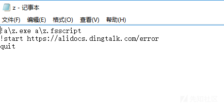

具体解释如下：

```
1. !a\z.exe a\z.fsscript
!在 FTP 命令行中是一个特殊符号，用于临时退出 FTP 环境并执行系统命令（如 CMD 命令），
执行完成后会自动返回 FTP 环境。
因此，!a\z.exe a\z.fsscript的意思是：
调用当前目录下a文件夹中的z.exe程序，并将a文件夹中的z.fsscript文件作为参数传递给它。
z.exe是一个可执行程序（具体功能未知，可能是自定义工具或脚本解释器）；
z.fsscript是作为参数的文件（可能是z.exe对应的脚本文件，内容取决于程序设计）。
2. !start https://alidocs.dingtalk.com/error
同样以!开头，执行系统命令：
start是 Windows CMD 中的命令，用于启动程序或打开文件 / URL；
因此，该命令会调用默认浏览器打开链接https://alidocs.dingtalk.com/error（这是钉钉文档的一个错误页面）。
3. quit
这是 FTP 的内置命令，用于退出当前 FTP 会话，结束与 FTP 服务器的连接。
```

查看z.fsscript文件如下，疑似shellcode文件，暂时不管

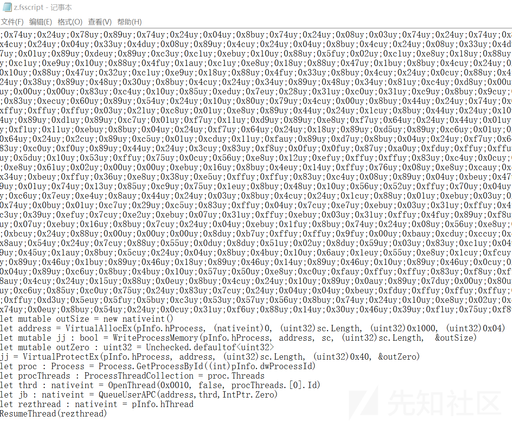

查看z.exe为32位程序，看不出其他内容

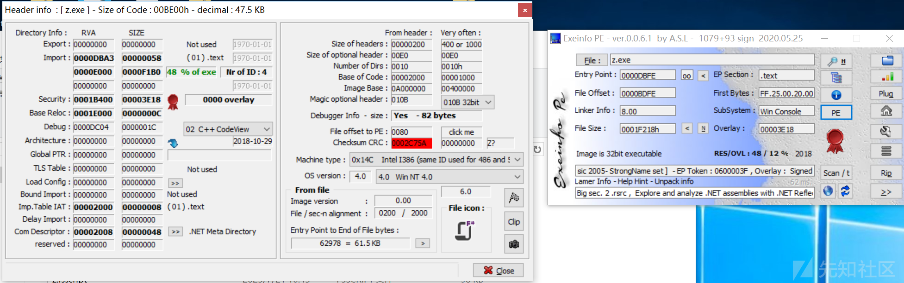

z.exe是白名单文件，原文件名为fsi.exe，典型的白加黑。

通过查阅相关资料得知，fsi.exe与fsianycpu.exe是FSharp解释器，这些具有Microsoft签名的二进制文件包含在Visual Studio中，可用于在命令行下直接执行FSharp脚本（.fsx 或.fsscript）。Fsi.exe在64位的环境中执行，Fsianycpu.exe则使用“机器体系结构来确定是作为32位还是64位进程运行”。

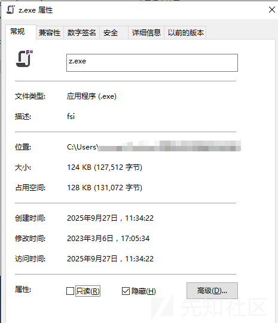

并且fsi.exe、fsianycpu.exe文件提取出来执行时还需要在当前目录下同时拷贝以下几个文件，否则在执行时会提示缺少FSharp.Core.dll、FSharp.Compiler.Private.dll等文件。

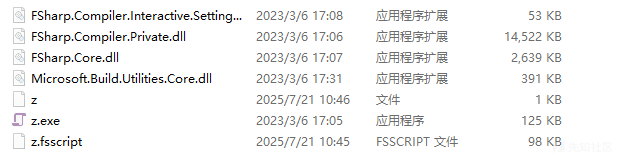

实际运行效果如下：

运行快捷方式后，就会调用ftp.exe从而执行z.exe进行上线行为

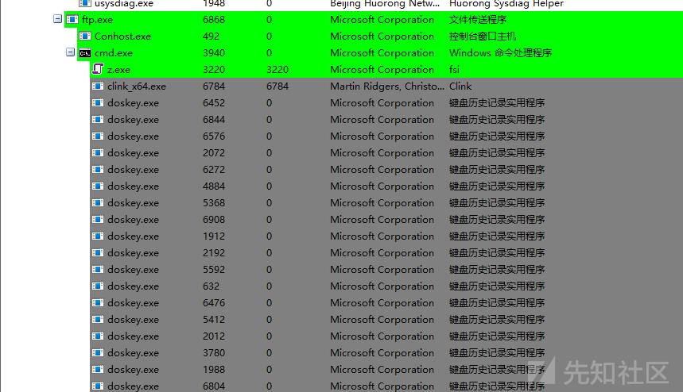

并且打开钉钉的报错页面

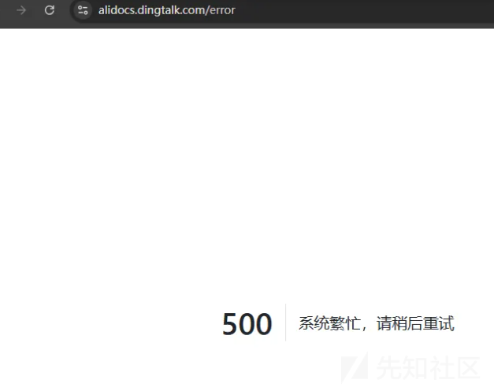

分析到此为止。

### 免杀思路

通过样本分析后，结合搜索引擎收集到相关免杀文章，用于学习

<https://blog.csdn.net/ahhacker86/article/details/148000197>

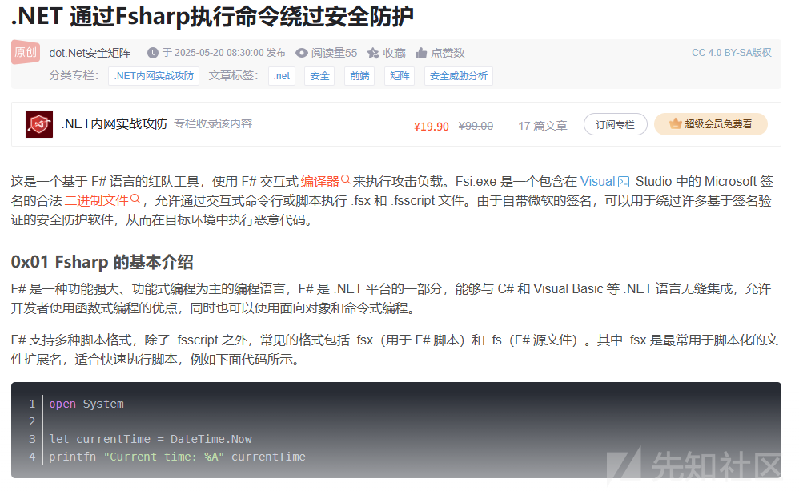

<https://cloud.tencent.com.cn/developer/article/1971110>

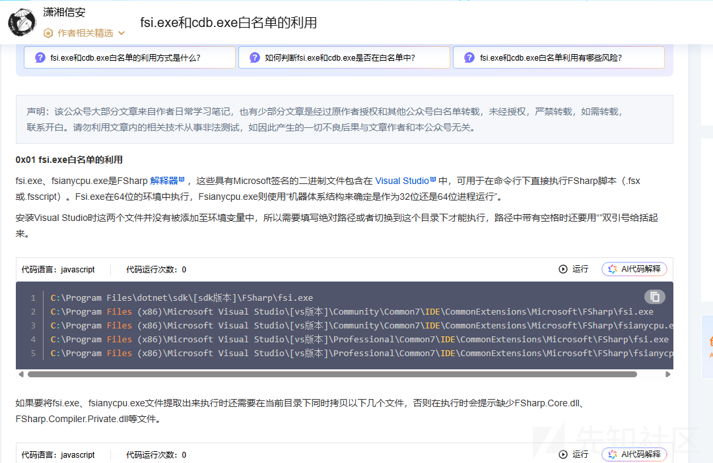

<https://mp.weixin.qq.com/s/APcjQTBfNKkiF-I30EWlqQ>

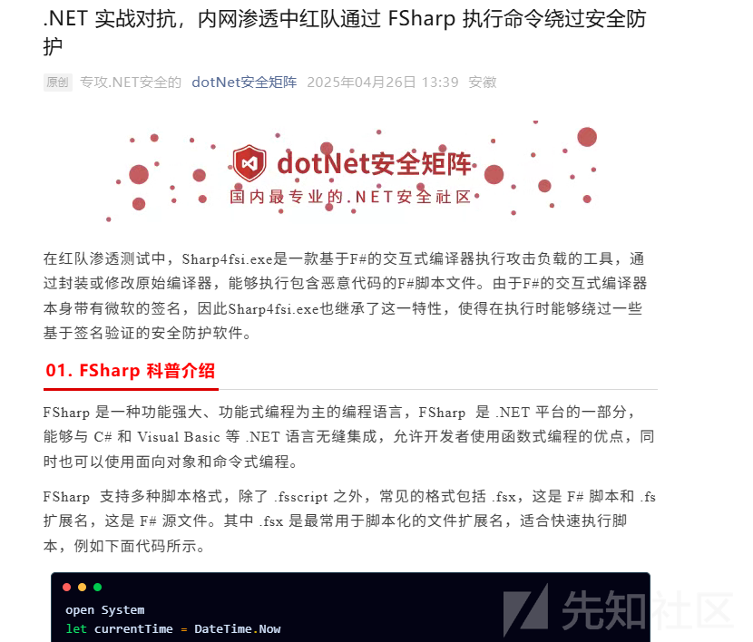

​
