# Cobalt Strike内存加载.NET程序集功能原理分析并重构-先知社区

> **来源**: https://xz.aliyun.com/news/19052  
> **文章ID**: 19052

---

# Cobalt Strike execute-assembly功能原理及重构

## 0x01.前言

CobaltStrike的内存加载相关功能，从dllinject反射式注入Dll到execute-assembly内存执行.NET程序集，再到inline-execute内存加载Coff，使执行内容不会落地到磁盘，可以帮助渗透测试人员隐蔽地执行一些后渗透功能。execute-assembly就是允许beacon这样的非托管程序加载.NET程序集的功能，本文将分析execute-assenbly原理即内存加载.NET程序集原理。以及通过逆向beacon来开发我们C2的execute-assemly功能。

## 0x02.内存加载.NET程序集

可以选择从磁盘或者从内存加载.NET程序集，CobaltStrike显然不会将.NET程序集落地在从磁盘加载，所以着重介绍从内存加载.NET程序集。能够在非托管程序中加载，主要是通过COM接口初始化CLR环境，主要有下面的COM接口：

1.ICLRMetaHost接口，这个接口用于在托管代码中获取关于加载的CLR的信息。它提供了一个入口点，允许我们枚举加载到进程中的所有CLR版本，并为特定版本的CLR获取ICLRRuntimeInfo接口。

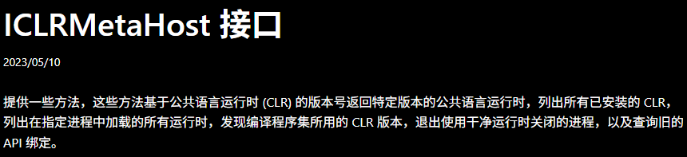

2.ICLRRuntimeInfo接口，以拥有特定CLR版本的ICLRRuntimeInfo接口，就能够用它来获取CLR运行时的其他接口，例如ICLRRuntimeHost。

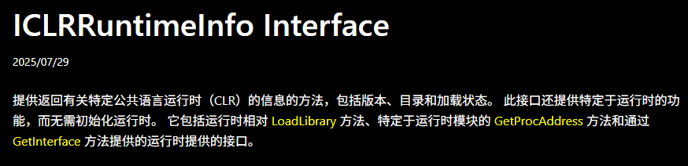

3.ICLRRuntimeHost接口，这是主要的接口，可以启动托管代码的执行环境，加载.NET程序集，并执行它。

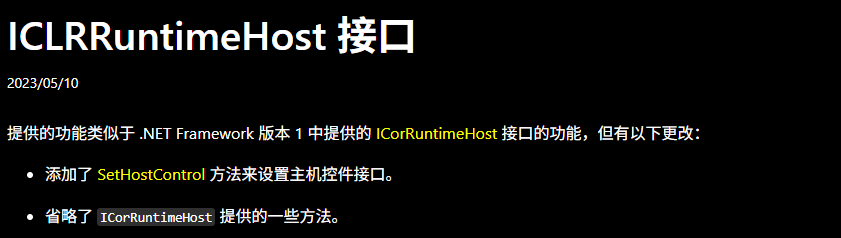

.NET框架里有一个叫公共语言运行时（CLR）的执行环境，它负责运行代码，并且提供很多便利的功能，让开发和调试过程更简单。使用面向运行时的语言编译器开发的代码称为托管代码。

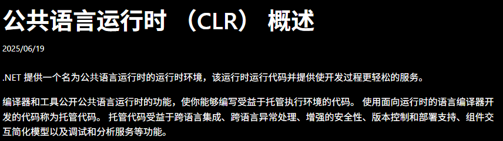

PowerShell就是这样一个基于.NET的托管程序，所以它运行时必须加载CLR才能工作。如果你打开一个PowerShell实例，再用Process Hacker这样的工具查看，就能发现里面已经加载了CLR、AppDomain，还有一堆托管组件。

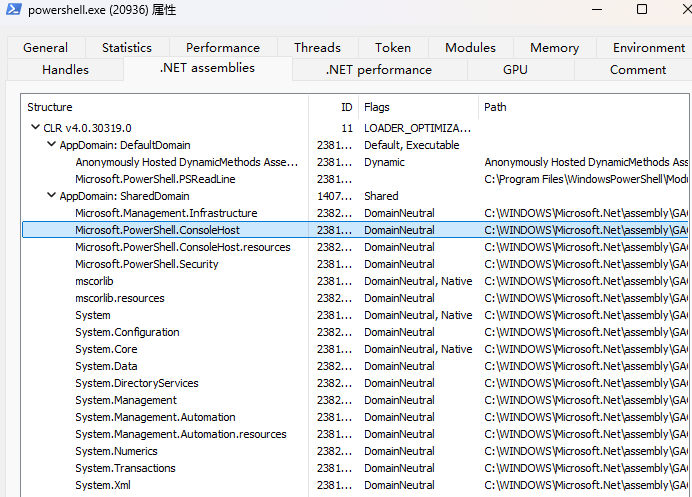

CLR并不会在进程中自动出现。想要在一个程序里运行托管代码，第一步就是利用这些COM接口API主动把CLR加载进来。

```
// 创建 CLR MetaHost
CLRCreateInstance(CLSID_CLRMetaHost, IID_ICLRMetaHost, (VOID**)&iMetaHost);
// 获取指定版本 CLR 的 RuntimeInfo
iMetaHost->GetRuntime(L"v4.0.30319", IID_ICLRRuntimeInfo, (VOID**)&iRuntimeInfo);
// 加载 CLR 到当前进程中
iRuntimeInfo->GetInterface(CLSID_CorRuntimeHost, IID_ICorRuntimeHost, (VOID**)&iRuntimeHost);
// 启动 CLR
iRuntimeHost->Start();
```

​第二步是加载AppDomain，AppDomain是系统和运行时环境通常提供应用程序之间的某种形式的隔离。

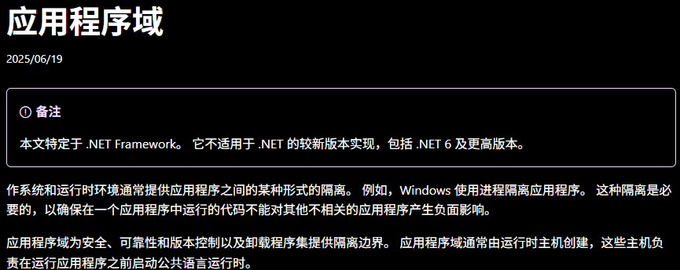

AppDomain提供了运行应用程序的隔离环境。每个.NET应用程序至少有一个默认的应用程序域，但可以创建更多的应用程序域以隔离执行的代码。如下代码是加载默认程序域加载.NET程序集：

```
iRuntimeHost->GetDefaultDomain(&pAppDomain);
// 获取当前的AppDomain
pAppDomain->QueryInterface(__uuidof(_AppDomain), (VOID**)&pDefaultAppDomain);
```

成功加载AppDomain后，就可以装载程序集了，将.NET程序集到这个程序域。

```
//为 SafeArray 建立边界（定义数组的大小和下界）
saBound[0].cElements = ASSEMBLY_LENGTH;
saBound[0].lLbound = 0;

// 创建一个 SafeArray，并用 .NET 程序集的字节数据填充它
SAFEARRAY* pSafeArray = SafeArrayCreate(VT_UI1, 1, saBound);
SafeArrayAccessData(pSafeArray, &pData);
memcpy(pData, dotnetRaw, ASSEMBLY_LENGTH);
SafeArrayUnaccessData(pSafeArray);

// 将程序集加载到 AppDomain 中
// Assembly 实例对象 get_EntryPoint 方法获取描述入口点的 MethodInfo 实例对象
pDefaultAppDomain->Load_3(pSafeArray, &pAssembly);
pAssembly->get_EntryPoint(&pMethodInfo);
```

最后，创建参数安全数组后，通过描述入口点的MethodInfo实例对象的Invoke方法执行入口点。

```
// 创建参数安全数组
ZeroMemory(&vRet, sizeof(VARIANT));
ZeroMemory(&vObj, sizeof(VARIANT));
vObj.vt = VT_NULL;

vPsa.vt = (VT_ARRAY | VT_BSTR);
args = SafeArrayCreateVector(VT_VARIANT, 0, 1);

if (argc > 1)
{
    vPsa.parray = SafeArrayCreateVector(VT_BSTR, 0, argc);
    for (long i = 0; i < argc; i++)
    {
        SafeArrayPutElement(vPsa.parray, &i, SysAllocString(argv[i]));
    }

    long idx[1] = { 0 };
    SafeArrayPutElement(args, idx, &vPsa);
}
// 执行
HRESULT hr = pMethodInfo->Invoke_3(vObj, args, &vRet);
```

下面通过上面的步骤，可以在内存中加载下面的.NET程序集。

```
using System;

namespace Project1
{
    internal class Class
    {
        static int Main(String[] args)
        {
            Console.WriteLine("hello world!");
            foreach (var s in args)
            {
                Console.WriteLine(s);
            }
            return 1;
        }
    }
}
```

将编译好的.NET程序集的16进制数据放到代码中，按照上面的步骤加载，成功打印hello world!，内存加载.NET程序集成功。

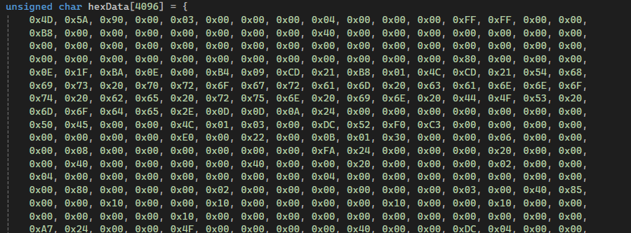

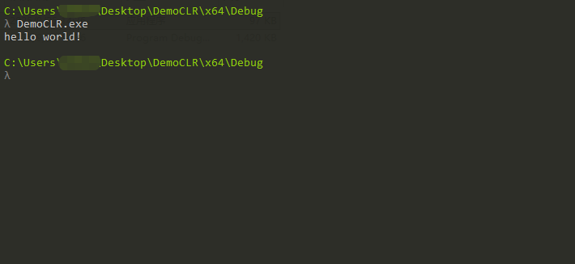​

## 0x03.Cobalt Strike中的处理

逆向CobaltStrike Beacon（以下都是4.4版本）的这个功能可以发现实现很复杂，判断一大推东西，我的beacon实现是x64，所以我实现只会关注x64。

需要知道的是上面的加载CLR的那一大推操作，CobaltStrike中的处理是放在待执行的.NET程序集之中执行的，所以beacon主进程以及待注入进程并不会加载CLR环境。

通过逆向，大致推断出：

1.CobaltStrike客户端会先处理.NET程序集，将加载CLR环境等代码放在.NET程序集中，然后添加ReflectiveLoader函数，会将.NET程序集RDI到目标进程中，

如下是Server端发送到Beacon的待注入Dll，其导出了ReflectiveLoader函数，用于模拟LoadLobrary注入Dll，执行功能

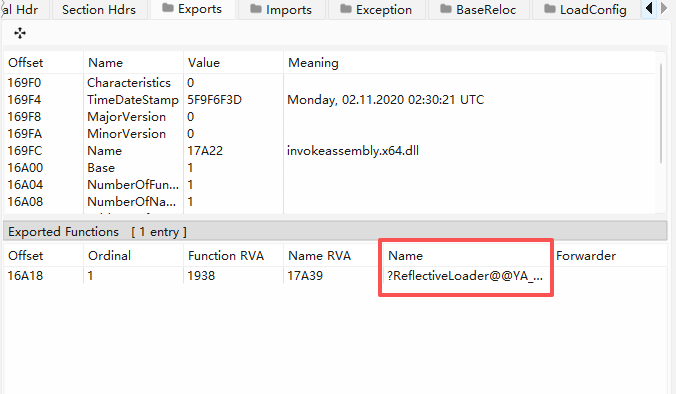2.反射式注入的进程并不是beacon自身进程，而是根据spawn配置，注入当相应进程中，是一个fork&run模式

根据java客户端，不难分析出beacon会从数据包中解析出哪些数据，包括callbackType、waitTime、RDI offset等关键信息。

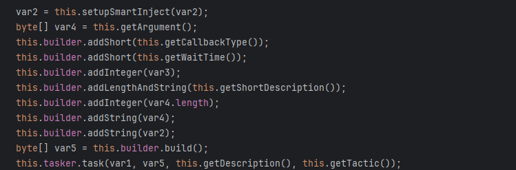  
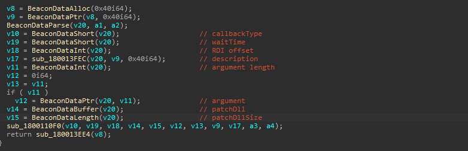  
进入到sub\_1800110F0关键函数中，首先创建STARTUPINFO、PROCESS\_INFORMATION用于sub\_1800189B0启动注入的目标进程，目标进程的标准输出、标准错误输出到创建的管道中，然后在sub\_18001170C将patch后的.NET程序集注入通过RDI注入目标进程中。

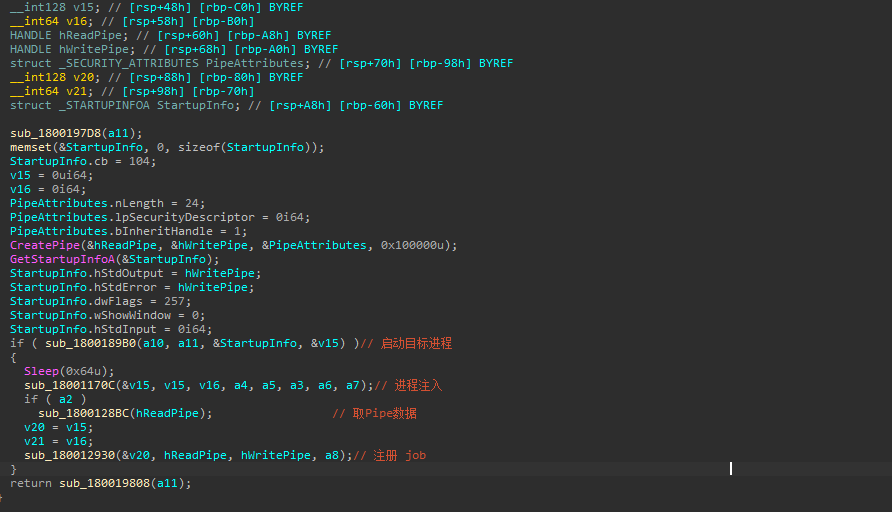  
启动待注入进程（目标进程）相关函数，beacon处理想当复杂，当然对于一个完善的大马，以及CobaltStrike的可配置性，这是必要的，具体处理如下：

* 首先会根据profile配置决定启动哪一个进程
* 判断是否启用了BlockDlls功能，启用的话，创建的进程需要BlockDlls
* 判断是否依赖传入Token
* ......

我在实现时，会采取最简单的方法，启动进程我指定为C:WindowsSystem32undll32.exe，并且没有BlockDlls流程，忽略Token，直接CreateProcessA。其实execute-assembly对应四个功能号，本文要实现的是88，即忽略token创建目标进程，并且是在x64上内存加载.NET程序集。

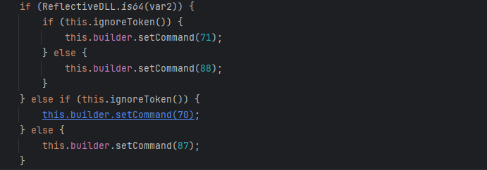进程注入时，beacon的处理也是想当复杂：

* 判断是否开启smart inject
* 判断是否是注入beacon本地进程，还是其余进程
* 根据第二条结果，判断是否在本地分配内存，还是远程分配内存
* 判断远程进程分配内存的方式
* 判断采取什么方法进程进程注入
* ......

同样，我会采取最简单的方法，没有smart inject，内存分配方式采取经典的VirtualAlloc或VirtualAllocEx，进程注入采取CreateThread或CreateRemoteThread，但我在调试发现默认配置下，CobaltStrike对于execute-assembly的注入方式为SetThreadContext&ResumeThreadContext，所以我也将采取这种注入方式。

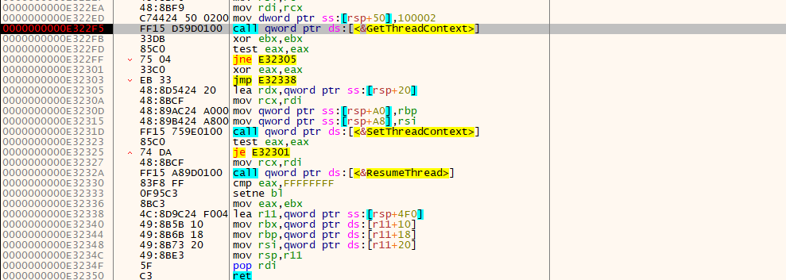

最后如果有回显，通过Write端写入到管道的数据如何回传？注意到进程注入后，调用sub\_180012930注册一个job。.NET程序集之后产生的数据，还是会发送到Read Pipe中，标识job结构体的一个字段保存了Read Pipe，每次向Server发送响应数据时，都会检查所有job的Read Pipe，然后判断job中某个表示回传数据类型的字段，读取Read Pipe管道数据，最后向Server响应数据。

我在实现时，先不考虑job相关的东西，对于有数据产生的.NET程序集，在2s内等待数据传入到Read Pipe，这一步和CobaltStrike处理方式一样，然后读取Read Pipe直接发送到Server。显然这样会有一个很大的弊端，对于有持续数据产生的.NET程序集，2s显然只能读取部分数据，比如keylogger这样的功能，这样就会出现问题，但本文所实现的execute-assenmbly也只是一个大致的框架，还需要实现job相关的东西，才能达到完全的功能。

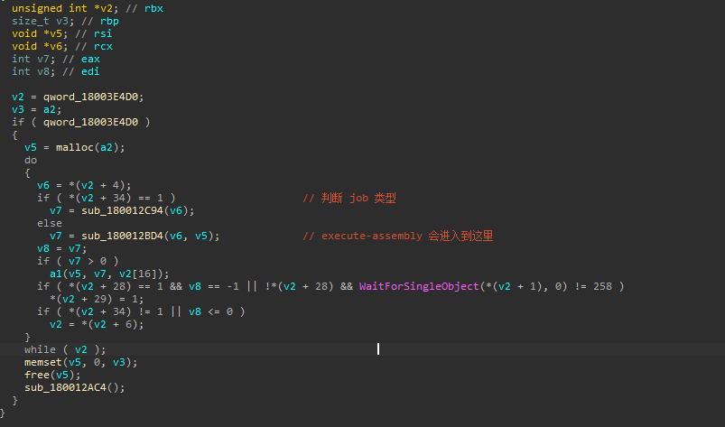

## 0x04.实现execute-assembly

实现的execute-assembly阉割了很多，只能算得上是一个最简单的execute-assembly框架。

首先解析数据包，和IDA逆向的代码基本一致，关于这些Beacon API的实现，github上关于一些CoffLoader的项目能找到。

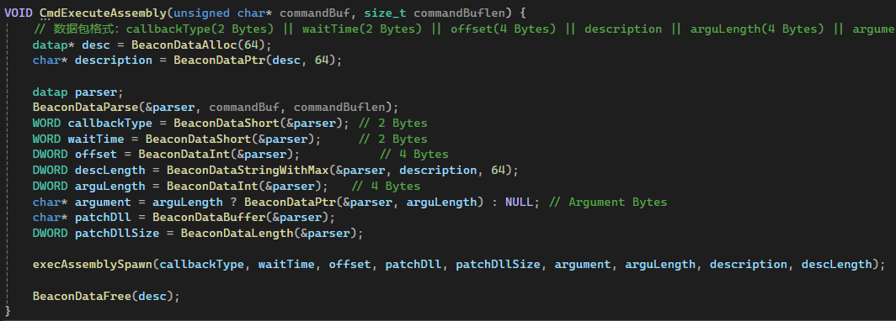

在execAssemblySpawn中，使用赋值好的STARTUPINFOA、PROCESS\_INFORMATION以CREATE\_SUSPENDED标志启动rundll32进程。

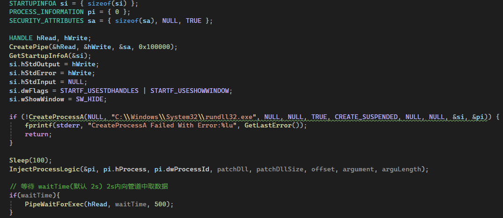

InjectProcessLogic的实现主要就是远程分配内存并使用SetThreadContext&ResumeThread进程注入方法进行注入。

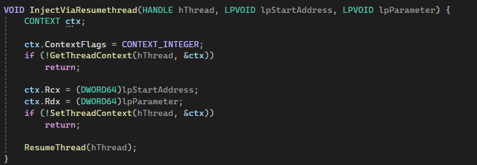

PipeWaitForExec在2s内等待数据输入到Read Pipe。

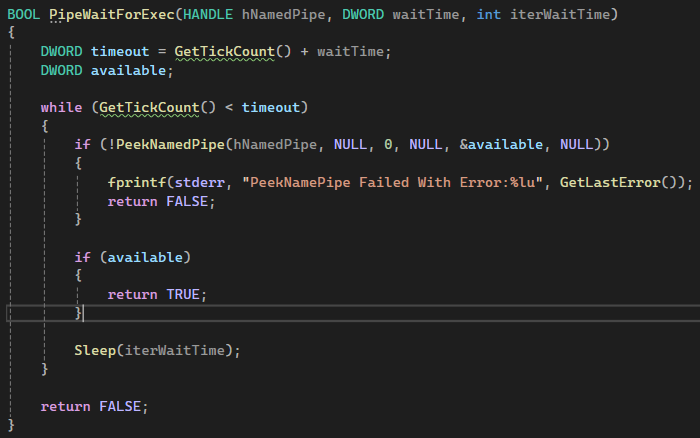

最后直接读取Read Pipe数据返回到Server。

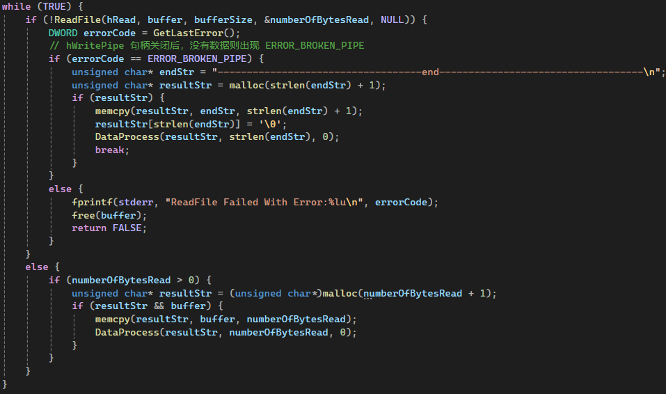

最终效果如下，执行打印hello world!的.NET程序集。

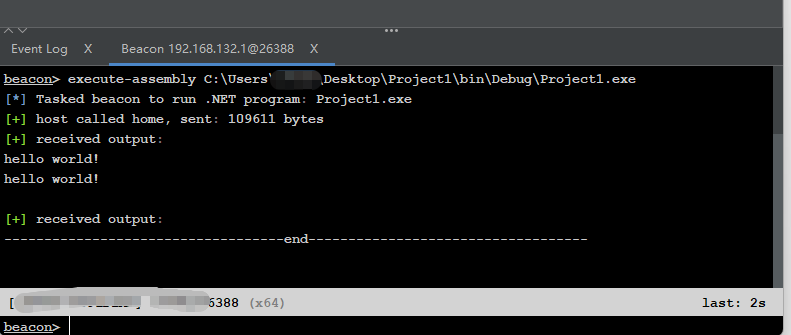

## 0x05.总结

本文分析了execute-assembly原理，对于重构beacon此功能，提供了一些思路。但实现的execute-assembly只是一个大致框架，不能成功获取长时间运行的.NET程序集的数据，对于一些短时间运行的.NET程序集，可以成功获取响应数据。如果你是正在开发C2的渗透测试人员，相信读完本文，会对开发execute-assembly功能有个很好的理解。
