# 深入SleepObfs的检测与绕过-先知社区

> **来源**: https://xz.aliyun.com/news/19057  
> **文章ID**: 19057

---

# 睡眠混淆的背景

提到睡眠混淆，那么就一定离不开EKKO，逆向了NighthawkC2的Sleepobf技术，后续的许多改动和提出都是站在了C5这位"巨人"的肩膀上。

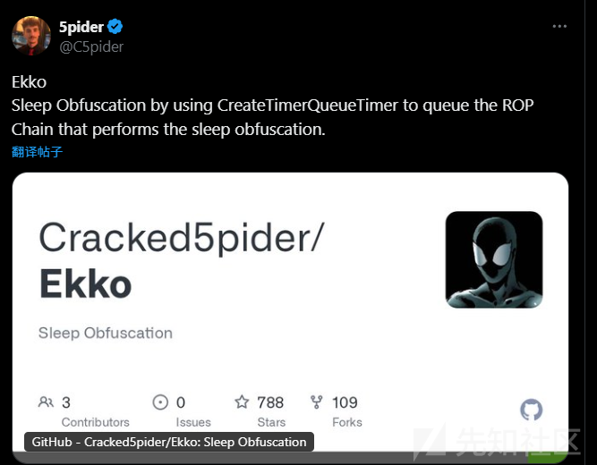

以及BRC4 和 Nighthawk 的互撕

Mdsec :

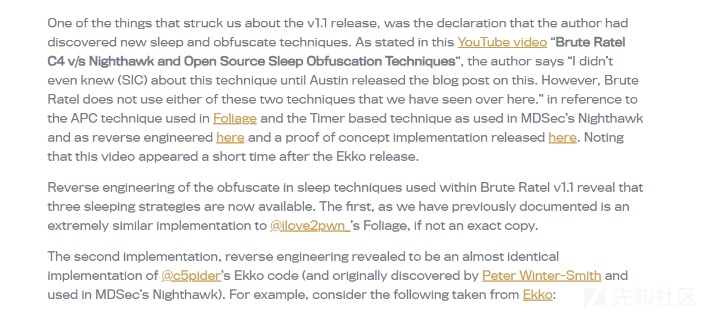

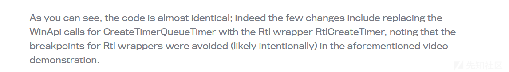

BRC4:

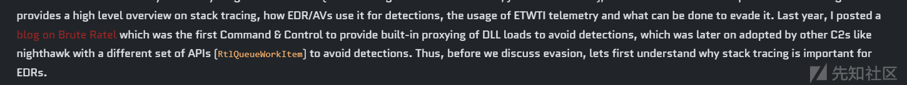

# SleepObfs 的实现

从网上的文章，以及最新的BRC4泄露来看，基本上可以分为两种

1. APC
2. ThreadPool

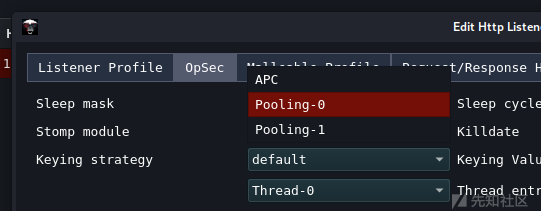

## APC

首先就是APC，这里不会说他的详细原理，源代码被删掉了，可以参考C5在Havoc的实现

```
https://github.com/HavocFramework/Havoc/blob/main/payloads/Demon/src/core/Obf.c 
```

其中NtCreateThreadEx的函数原型如下

```
/**
 * Creates a new thread in the specified process.
 *
 * \param ThreadHandle A pointer to a handle that receives the thread object handle.
 * \param DesiredAccess The access rights desired for the thread object.
 * \param ObjectAttributes Optional. A pointer to an OBJECT_ATTRIBUTES structure that specifies the attributes of the new thread.
 * \param ProcessHandle A handle to the process in which the thread is to be created.
 * \param StartRoutine A pointer to the application-defined function to be executed by the thread.
 * \param Argument Optional. A pointer to a variable to be passed to the thread.
 * \param CreateFlags Flags that control the creation of the thread. These flags are defined as THREAD_CREATE_FLAGS_*.
 * \param ZeroBits The number of zero bits in the starting address of the thread's stack.
 * \param StackSize The initial size of the thread's stack, in bytes.
 * \param MaximumStackSize The maximum size of the thread's stack, in bytes.
 * \param AttributeList Optional. A pointer to a list of attributes for the thread.
 * \return NTSTATUS Successful or errant status.
 */
NTSYSCALLAPI
NTSTATUS
NTAPI
NtCreateThreadEx(
    _Out_ PHANDLE ThreadHandle,
    _In_ ACCESS_MASK DesiredAccess,
    _In_opt_ PCOBJECT_ATTRIBUTES ObjectAttributes,
    _In_ HANDLE ProcessHandle,
    _In_ PUSER_THREAD_START_ROUTINE StartRoutine,
    _In_opt_ PVOID Argument,
    _In_ ULONG CreateFlags, // THREAD_CREATE_FLAGS_*
    _In_ SIZE_T ZeroBits,
    _In_ SIZE_T StackSize,
    _In_ SIZE_T MaximumStackSize,
    _In_opt_ PPS_ATTRIBUTE_LIST AttributeList
    );

```

通过在Arg 7 传入 TRUE([THREAD\_CREATE\_FLAGS\_CREATE\_SUSPENDED](https://ntdoc.m417z.com/thread_create_flags_create_suspended)) ，创建一条挂起的线程

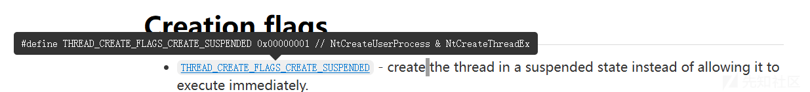

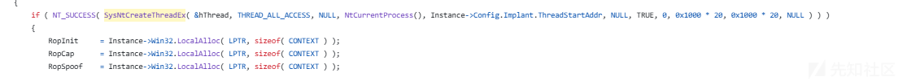

然后通过NtQueueApcThread给他插入一系列的APC，让这条线程帮我们进行睡眠混淆

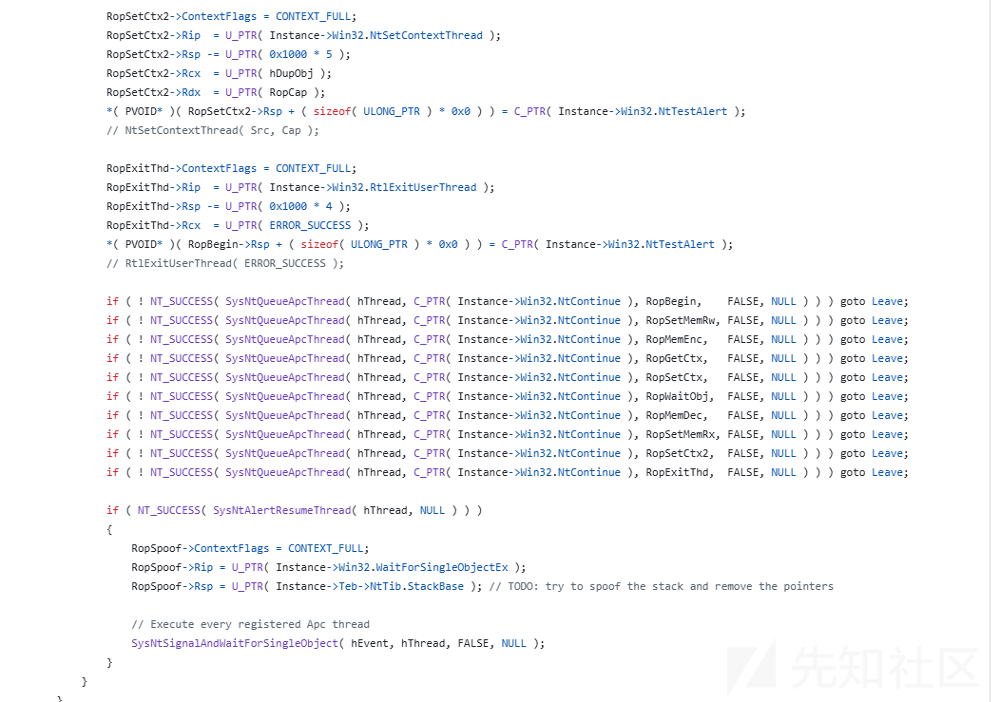

讲完了实现，讲检测 。检测这种技术的方法，或者说捕获这种技术产生的遥测数据然后分析可谓是十分简单

### Ring3 Hook

首先我们每次在Sleep之前都得去Create Suspend Thread， 这个就可以通过Hook检测，下图是SentinelOne EDR 在NtCreateThreadEx放置的Hook

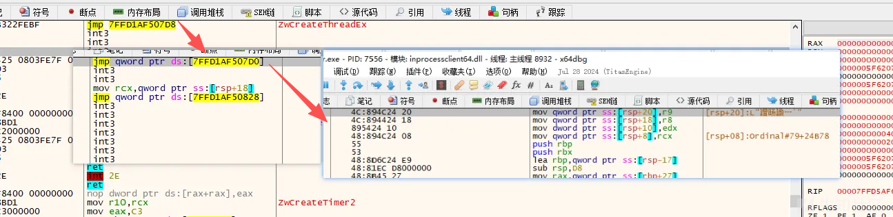

### Kernel CallBack

如果说Hook 能被轻易的绕过的话，那么内核回调以及接下来的Ring 0 ETW就不太可能在Ring3 被轻易绕过了

通过PsSetCreateThreadNotifyRoutineEx可以注册对应的线程内核回调，当线程被创建或者删除的时候对应的驱动程序注册的回调就会被调用。

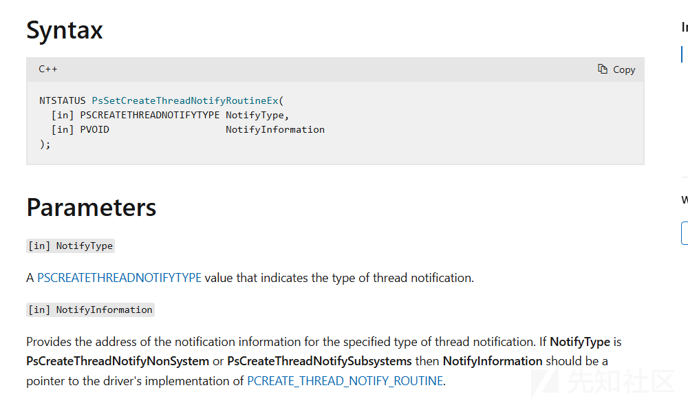

### Ring0 ETW

最出名的ETWTI，对APC SUSPEND\_THREAD 这种都是有内核遥测数据记录的，虽然不会说单凭你一个Create Suspend Thread 或者说通过APC进行了操作就把你查杀，但是这些遥测数据，可是会被真人审计的，比如SOC.

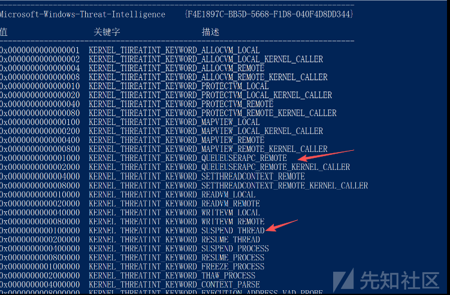

### Elastic EDR

检测规则如下

```
https://github.com/elastic/protections-artifacts/blob/136fd6e69610426de969e3d01b98bb9ce10607b2/behavior/rules/windows/defense_evasion_virtualprotect_call_via_nttestalert.toml#L4
```

检测是否通过NtTestAlert触发的内存属性修改，是的话就直接Kill进程

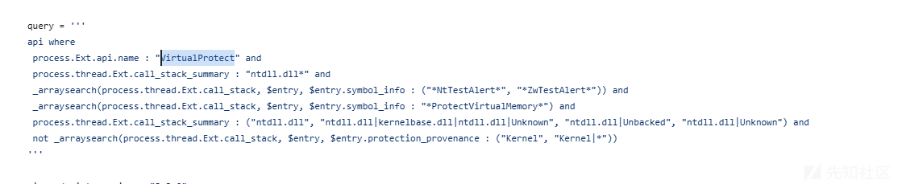

## ThreadPool

在两种类型的SleepObfs下，如果真的要选一种，那么我个人更偏向于ThreadPool

### Timer

拿C5的Ekko来举例

CreateTimerQueue 来创建一个TimerQueue

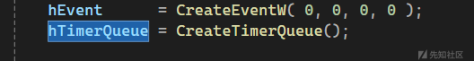

然后将对应的Timer进行排队运行，最终达到睡眠混淆的效果

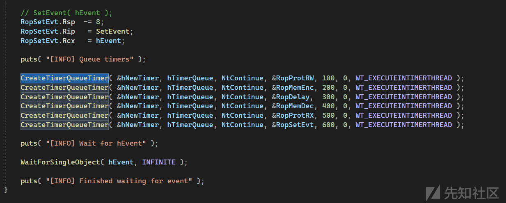

其中对于CreateTimerQueueTimer，他的底层还是走到RtlCreateTimer

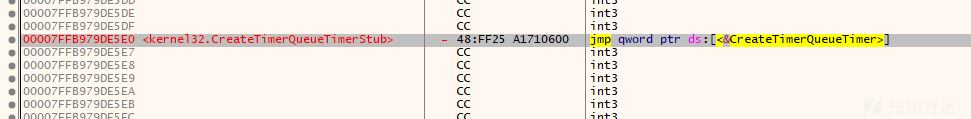

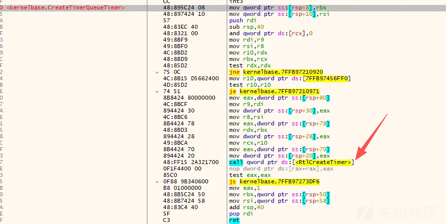

在Havoc中CreateTimerQueueTimer被C5换成了更加底层的RtlCreateTimer的实现

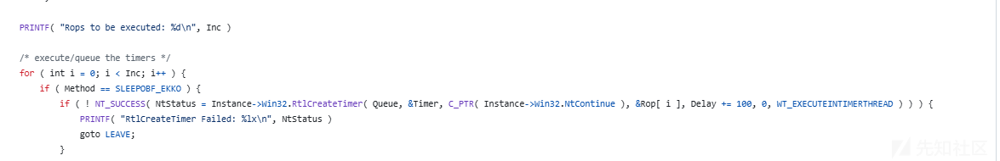

那么还是讲完了原理，我们来将检测，对于Timer，**他是不会走进入Ring0 的**，如果我们继续跟进去RtlCreateTimer的话，我们可以看到我们的CallBackfunc(v32)传入了\*(QWORD \*)(v12 + 32) ，在初始化其他字段完成之后会将V12作为第三个参数传递给TpAllocTimer

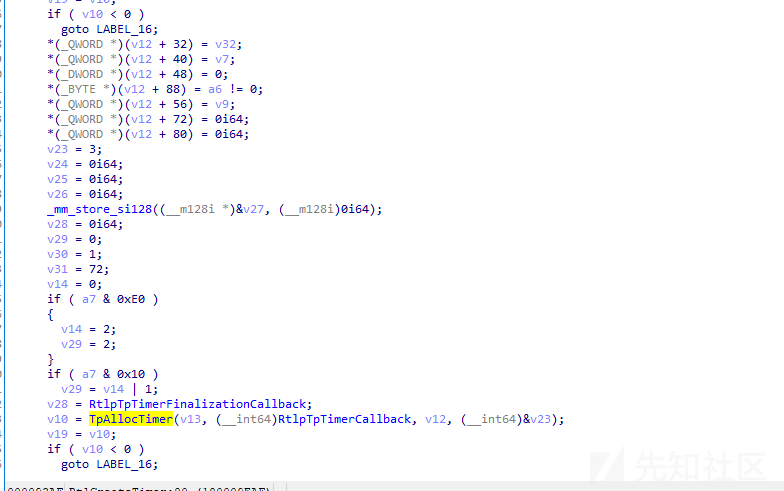

其中TpAllocTimer的函数原型如下

```
// winbase:CreateThreadpoolTimer
NTSYSAPI
NTSTATUS
NTAPI
TpAllocTimer(
    _Out_ PTP_TIMER *Timer,
    _In_ PTP_TIMER_CALLBACK Callback,
    _Inout_opt_ PVOID Context,
    _In_opt_ PTP_CALLBACK_ENVIRON CallbackEnviron
    );

```

Arg 2 是Callback , Arg3(包含我们的回调函数) 是Content ，我们跟进去 RtlpTpTimerCallback

可以看到我们的(v2 + 32) 也就是我们的回调函数被TppStartThreadData调用进行初始化

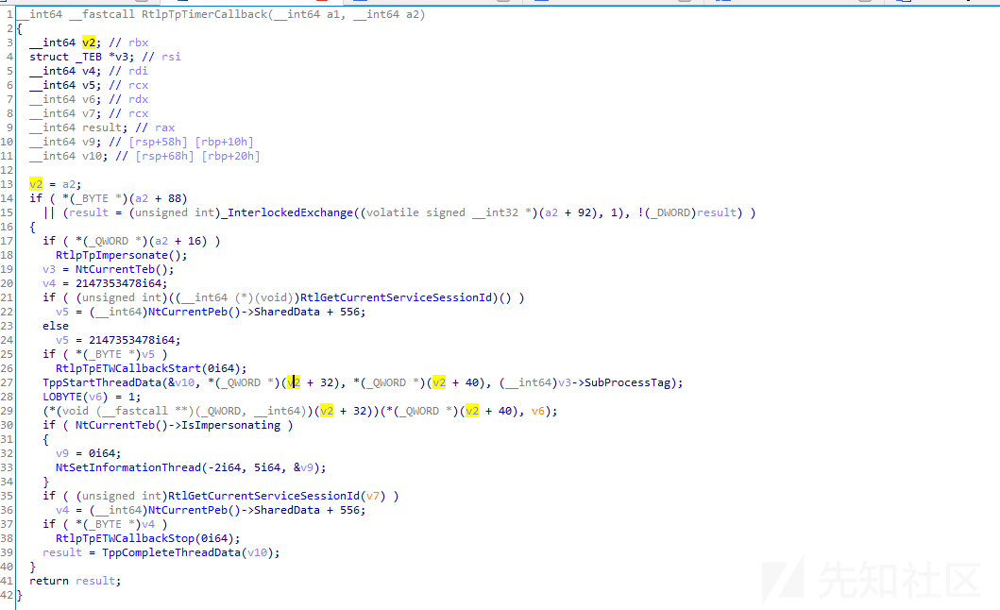

然后我们回到TpAllocTimer ，可以看到调用了TppInitializeTimer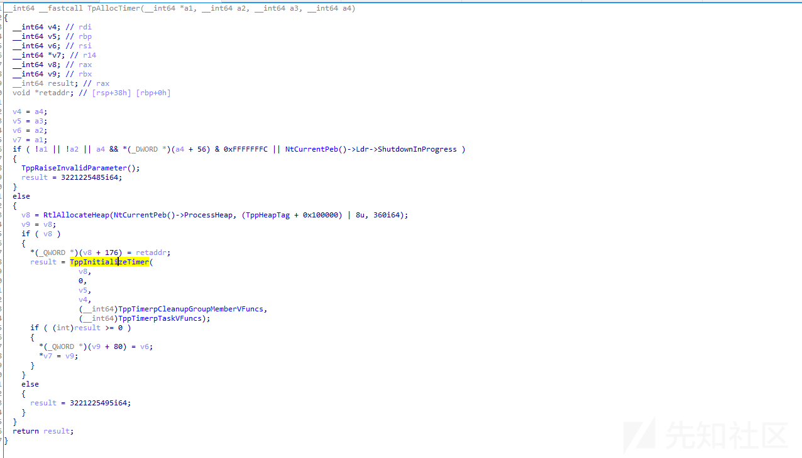

其中带有我们回调的函数地址的结构体被当作第二个参数传递给了 TppWorkInitialize进行初始化

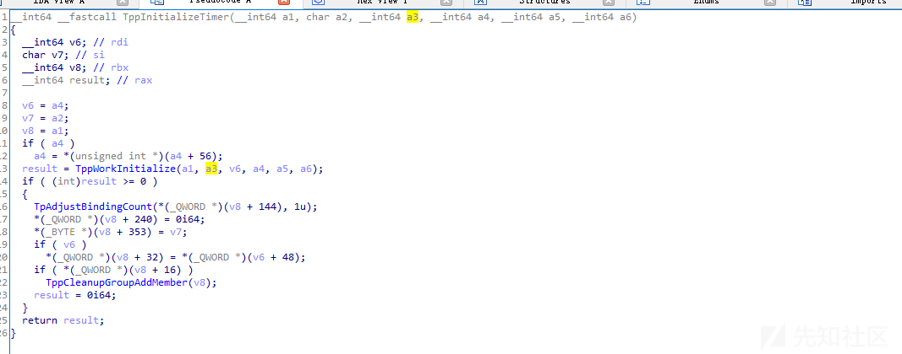

最后被转到了a1 这个结构体的一个偏移 然后进行初始化这个a1

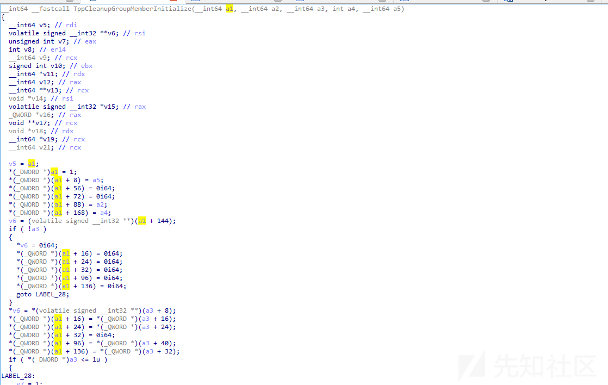对于这个a1结构体 如果返回我们一开始的TpAllocTimer ，我们可以看到他就是通过NtAllocateHeap分配的一个堆内存。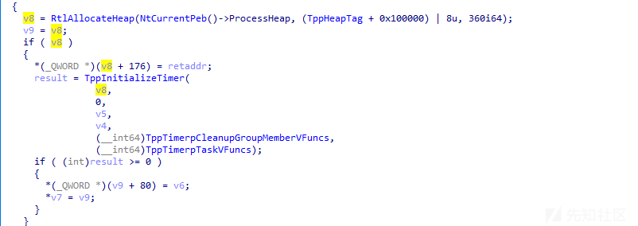那么上面描述了这么多，其实是想说明一个点 ：

**这个Timer的调用，不会进入Ring0 ，这一切都是在Ring3完成的，东西都在堆上进行初始化并放置在堆上**

我从下面这篇优秀的检测Timer的博客中得到了相同的观点

```
https://labs.withsecure.com/publications/hunting-for-timer-queue-timers
```

作者也是通过对API进行分析，发现计时器的回调以及参数都放在了堆上，其中由于不进入Ring0的原因，导致Windows在Timer这一方面的内核遥测可以说是空白,或者说甚少。

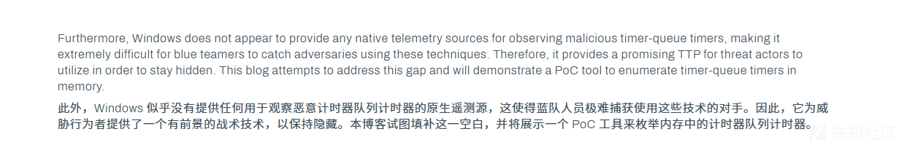

但是这个计时器要区分于另外一种睡眠混淆Cronos

```
https://github.com/Idov31/Cronos
```

其调用的 Kernel32的 CreateWaitableTimerW 最后会走到 Kernelbase的CreateWaitableTimerExW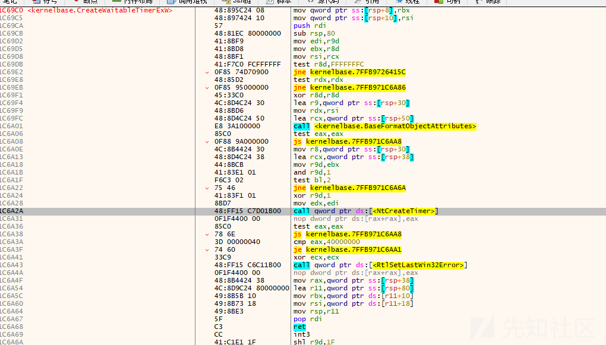

然后通过Syscall 进入Ring0，这个可能会存在对应的检测

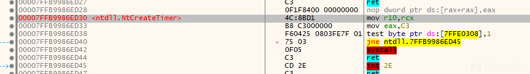

# 检测与绕过

## Hunting-Sleep-Beacon

说到睡眠混淆的检测，其中一个最出名的就是Hunting-Sleep-Beacon，从下面开始，我们将会基于Ekko进行改进，最终从原理上绕过HSB.

```
https://github.com/thefLink/Hunt-Sleeping-Beacons
```

我们直接对原生的Ekko 用HSB扫描

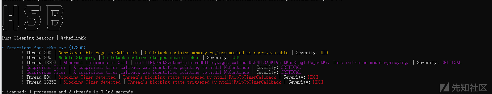

可以看到有了不少的告警，我们来依次解决

### A suspicious timer callback was identified pointing to ntdll!NtContinue

这个很好理解，就如他的检测规则名字，我们跟进去他的代码

```
Hunt-Sleeping-Beacons-main\src\Hunt-Sleeping-Beacons\suspicious_timer.cpp
```

通过去Read他的Timer的Context中的FinalizationCallback字段与维护的一些可疑的CallBack进行对比

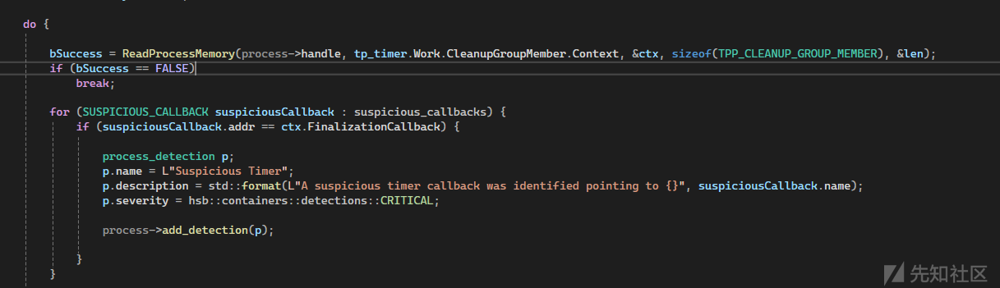

其中可疑的callback vector 如下成员

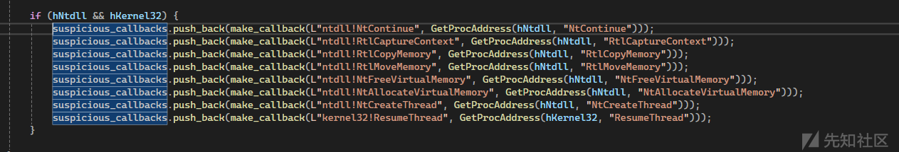

那么很简单，他的检测就是检测我们是否直接指向了以上的函数，如果有，那么就告警。知道了检测，那么Bypass就简单了，我们不能直接调用比如说NtContinue，那么我们就去找Gadget

* Jmp NtContinue
* Call NtContinue

幸运的是，在Ntdll里面，总有那么几个gadget能给我们利用，

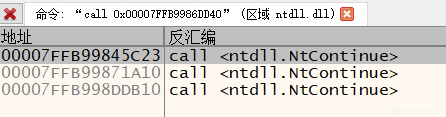

调用如下

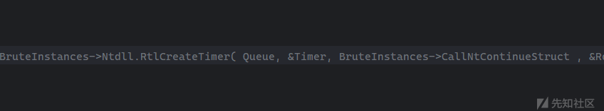

### Abnormal Intermodular Call This indicates module-proxying.

我们还是去看HSB的代码

```
Hunt-Sleeping-Beacons-main\src\Hunt-Sleeping-Beacons\abnormal_intermodular_call.cpp
```

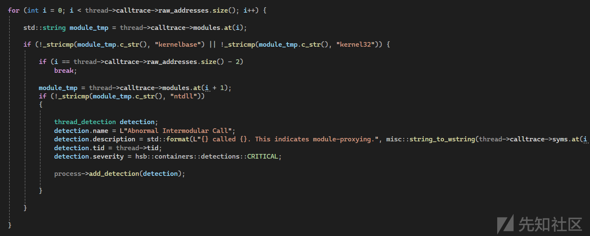

可以看到他定位了一个线程的两帧，如果我们有一帧在kernel32 或者 kernelbase ，并且我们的下一帧在ntdll，那么就会告警，如果我们去看ekko的线程调用堆栈，我们不难发现他其实是想捕获 在 KernelBase!WaitForSingleObjectEx -> ntdll!RtlGetSystemPreferredUILanguages 这两个调用帧

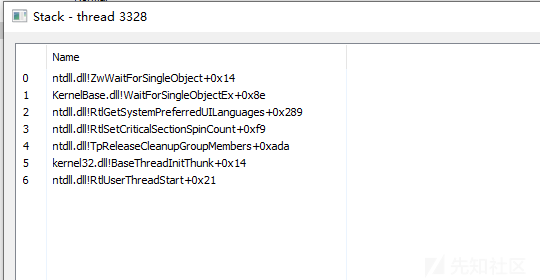

那么绕过就很简单了，如果我们没有kernel32 或者 kernelbase，全都是ntdll 的模块(从回调执行开始)，那么HSB将不再告警

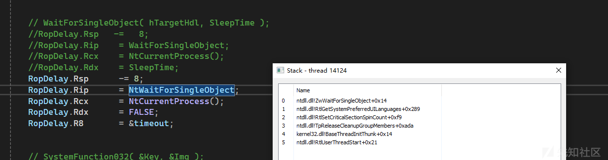

通过对比，我们能成功绕过这个检测

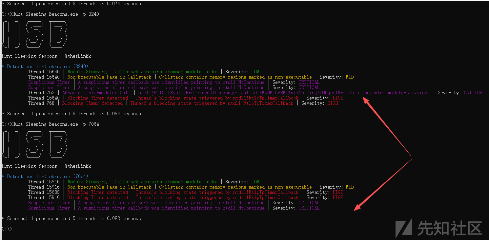

#### Bouns

其实绕过这一条规则特别简单，提示，可以观察BRC4在Sleep的线程调用栈，那里会有你想要的 :）

### Callstack contains memory regions marked as non-executable

这个告警是因为我们在Sleep的时候，我们将我们的植入物的内存改成了RW

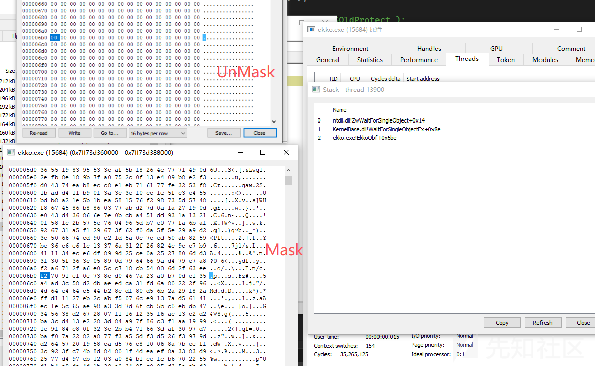

从内存我们也能看出来，一个被映射到内存的PE因为使用了EKKO，失去了所有的可执行属性

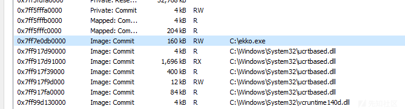

那么绕过也简单， 这里可以考虑堆栈欺骗，这样我们的栈返回的就不是一块RW的内存了，又或者说一种方法

DeathSleep

```
https://github.com/janoglezcampos/DeathSleep
```

由于他检测的是我们植入物的线程（也就是我们Implant功能执行的线程），如果我们这条线程根本就没有了呢，那么扫描器将无法进行栈回溯，也就能成功绕过

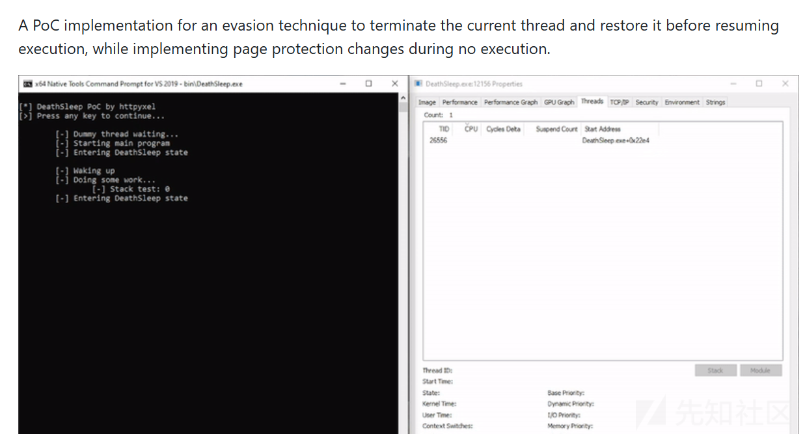

### Thread's blocking state triggered by ntdll!RtlpTpTimerCallback

这个应该是最具代表性的一个检测，我们再次查看我们线程池的调用栈

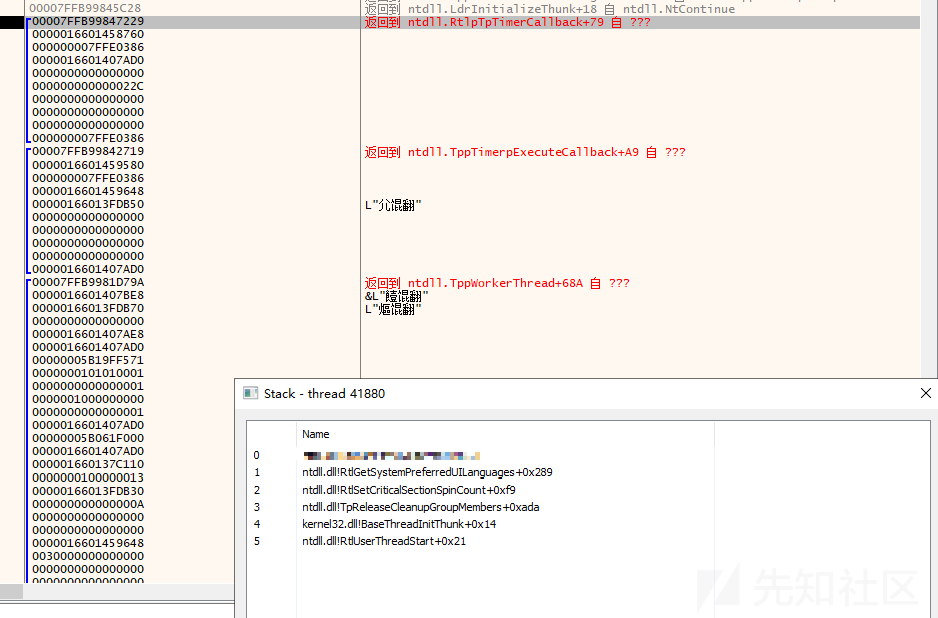

可以看见他的返回到了 ntdll!RtlTpTimerCallBack + 0x79还记得我们上面分析提到过的调用链吗

1. RtlCreateTimer
2. TpAllocTimer
3. RtlpTpTimerCallback
4. TppStartThreadData

可以知道我们线程去执行回调的时候，是通过RtlpTpTimerCallback去触发我们的回调函数的，然后我们再来看HSB的检测。

```
Hunt-Sleeping-Beacons-main\src\Hunt-Sleeping-Beacons\blocking_timer.cpp
```

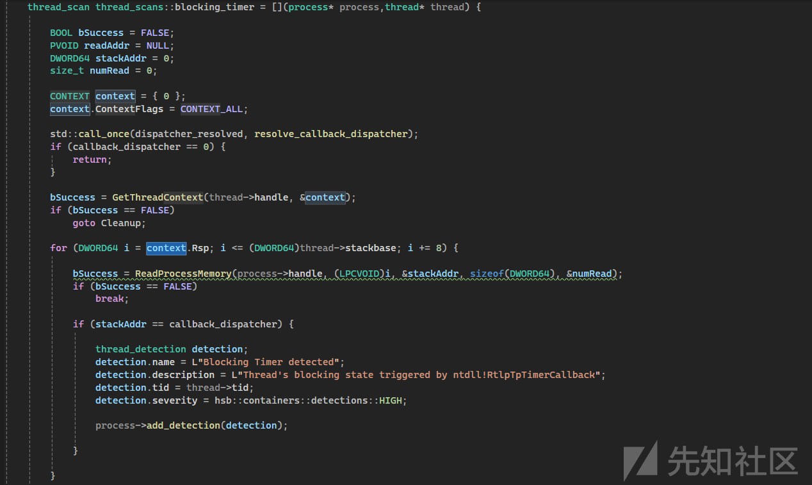

可以看见他是去从每一个线程的Stack Base开始遍历，然后判断栈上是否存在对应的回调触发的地址，如果存在，那么就直接标记这个IOC。这个确实是一个不错的检测点，毕竟你想让线程池帮你去做延时，那么就一定需要通过这个触发。 那么回到正题，既然他检测我们的栈上是否存在因为这个回调触发而导致栈上存在对应的地址，那么我们就可以不让线程池去blocking。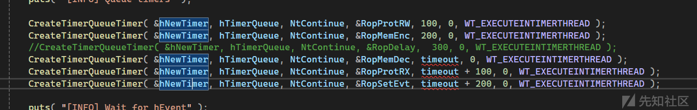

其中这个第五个参数就是计时器触发的时间，我们可以直接让计时器去延迟触发，也是同样的睡眠效果。但是这个时候，如果你再用HSB去扫，你会发现，还是会被扫出来，并且这一次是我们的主线程被扫描出来了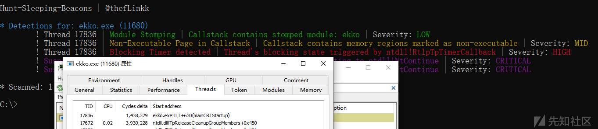

按常理来说，这个应该是不会出现的，因为我们的植入物线程并不需要回调触发执行函数，所以我们修改一下HSB，让他把对应的地址打印出来，可以看见这是我们在函数调用的过程中写入栈上的一个地址 。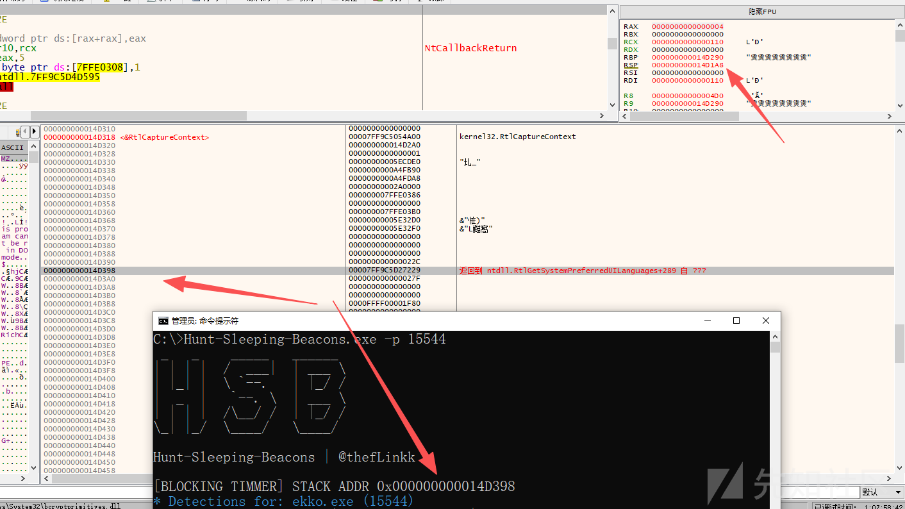

如果我们在ROP执行完之后，再去Sleep，这时候我们看看会发生什么 ，可以看到当我们在ROP链执行完成之后，并且已经进入了常规的Sleep，他还是检测出来对应的栈上的地址，说明这是一个 “误报”（但是如果我们没有用Timer就不会有这个误报，所以这个词也用的不准确）

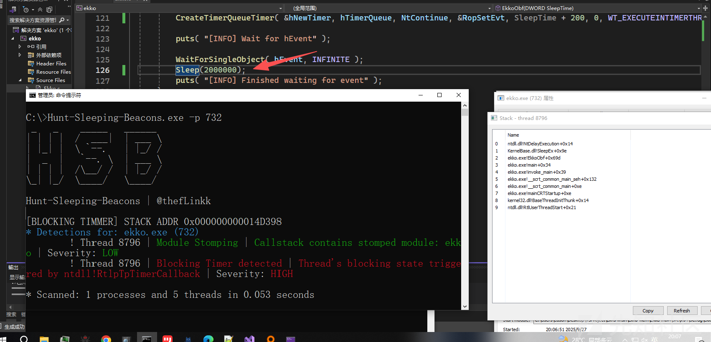

那么问题来了，在追求完美绕过扫描的情况下，应该如何去Bypass呢 ，这里首先还是要Cue到BRC4（在我的眼里BRC4一直是一款在规避性方面做的很多C2没得比的地方，当然了其他一些商业C2也很优秀，各有各的优点）。

栈(Stack)加密，既然我们都用上线程池了，那么我们是不是可以给我们的植入物的栈加密，这样栈上就再也无法检测出对应的回调地址了（**当然，这个会触发另一个IOC，也就是鸭哥命名的堆栈完整性检测，相应检测的文章如下** <https://key08.com/index.php/2025/07/13/2716.html> ）

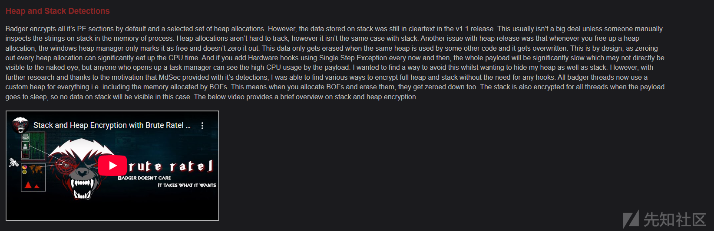

除了BRC4用的这种栈加密，似乎CS的Kit也在给我们提供一种解法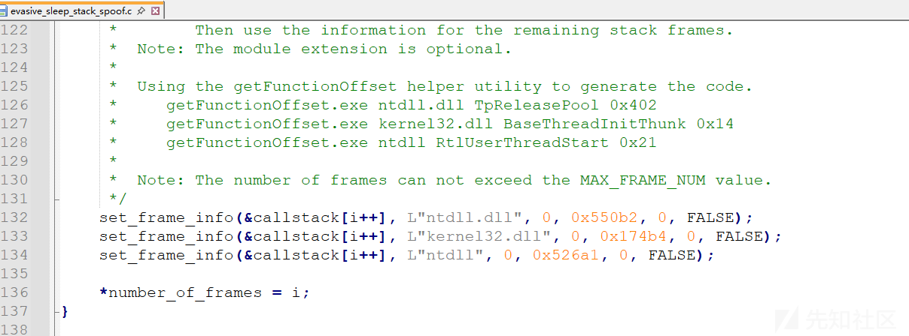

或者更加具体的来说 CallStack Master && Vulcan Raven (同一个作者)，

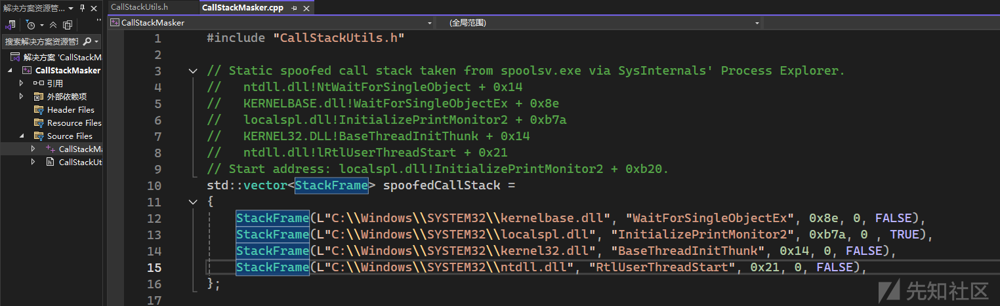

动态计算栈的每一帧的栈空间，用0 截断堆栈，提升堆栈，然后布置栈，这样，我们就有了任意的调用栈，或者，更进一步的就是在BRC4中体现的用户自定义调用堆栈。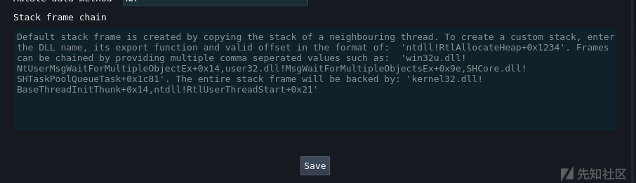

但是，这并不能解决我们栈上还是存在刚才那个地址的问题，而是这个思路。我们的注入物线程有没有办法有一个完全合法的堆栈，甚者说是一个别人的堆栈，在这里，Havoc 对这个思路进行了实现（当然这个也是C5参考的别人的思路），也就是 Stack Duplicate ，通过克隆线程池的Context 以及Teb中的 NtTib ，实现Bypass。 最终我将这些规避都集成到了Havoc，实现的效果如下，HSB将不再对我们的植入物告警，至此，HSB就被我们Bypass了。

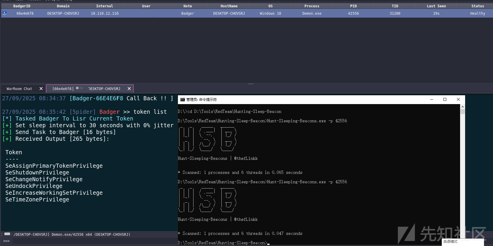

## TickTock

```
https://labs.withsecure.com/publications/hunting-for-timer-queue-timers
```

这也是针对Timer的一种扫描器，他是直接跟踪了Timer的堆分配，然后定位对应的CallBack 和 Context，这样，我们的动机就已经一览无遗了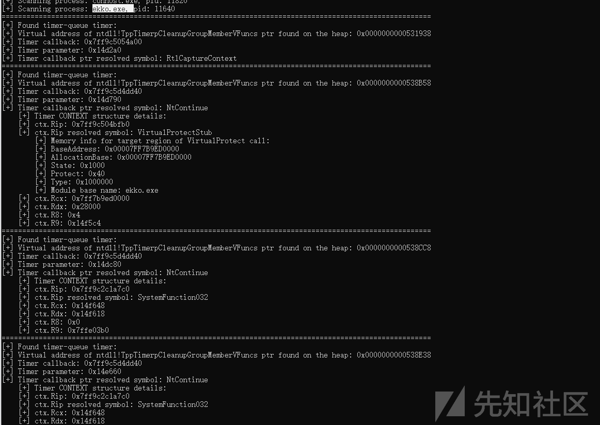

那么有检测就有对抗，下面这个就是对应的对抗

```
https://tishina.in/execution/phase-dive-sleep-obfuscation
```

1. 将回调触发的函数addr 直接改成Call Addr
2. 将Context的 Rip 改成 jmp Register

改动之后，就算我们的Timer被扫到，也无法直接看出我们的意图（然而手动分析一眼丁真 ）

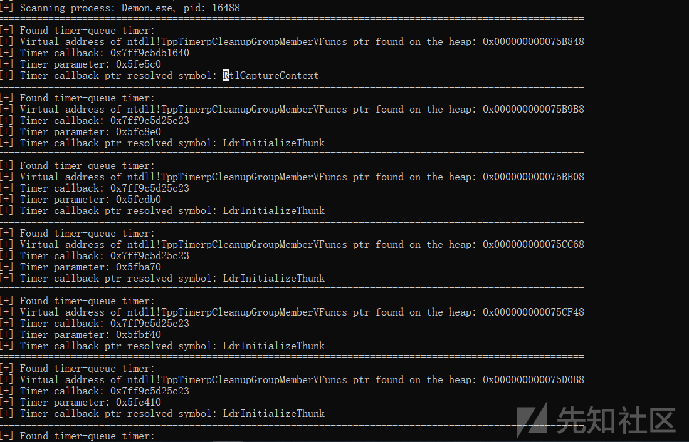

## 国内某友商的EDR

这里就不具体说名字了，对技术不对物，EKKO 和Zillean用的是两个不同的函数：RtlCreateTimer 和RtlRegisterWait ，我们附加一个debugger看对应的函数地址。

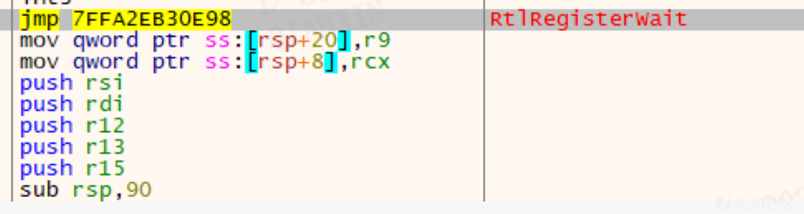

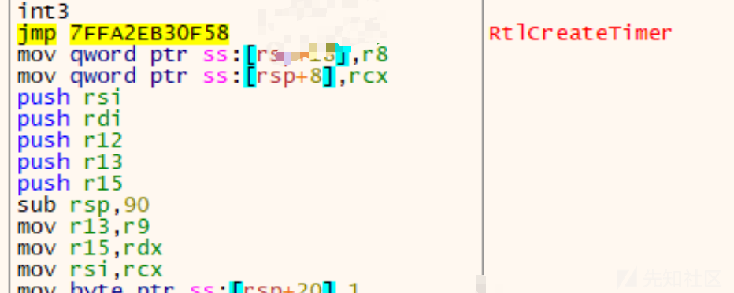

不难猜测，就是inline hook，但是前面说过，这种Timer是不进Ring0的，所以也没有什么(in)direct syscall

这里可以参考菊总以前在公众号发过的文章

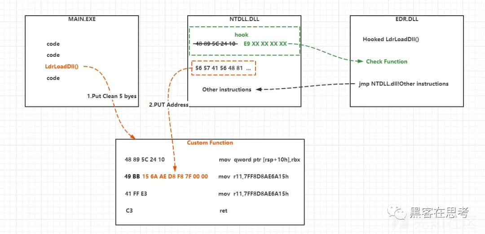

跳过第一条被Hook的指令，用汇编自实现之后跳回去下一行指令，绕过Hook(从这里也能看出Ring3 的Hook的脆弱性)，相信未来更多的检测将会偏向于Ring 0 的ETW 和 Kernel CallBack .

​
